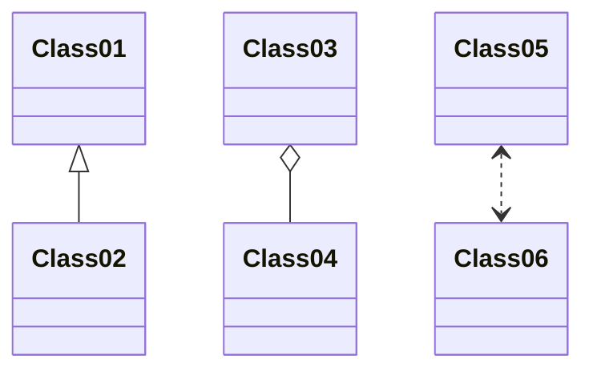
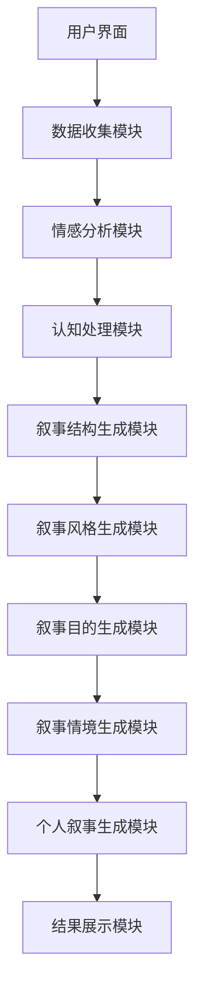
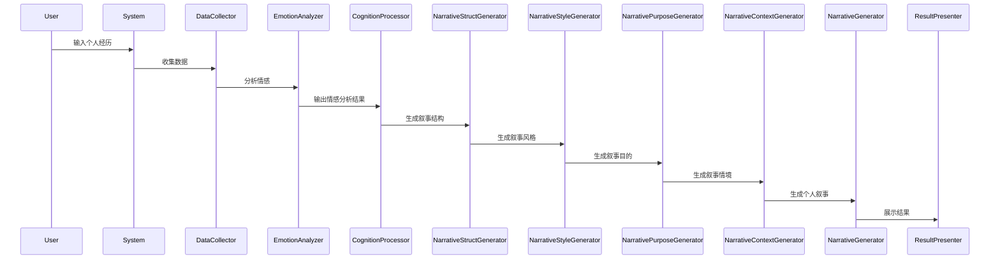

                 

# 意义的创造：个人narrative的力量

> 关键词：个人叙事，意义创造，心理学，技术，算法

> 摘要：本文深入探讨了个人narrative的概念、作用及其在现代信息技术中的应用。通过详细的案例分析，本文揭示了个人叙事如何通过算法实现意义的创造，为读者提供了全面的技术理解和实践指导。

---

## 引言

### 1. 背景介绍

#### 1.1 问题背景

在当今快速发展的信息技术时代，数据和个人信息无处不在。如何有效地组织和理解这些信息，成为了人们关注的焦点。个人narrative，即个人叙事，作为一种理解和解释个人信息的方法，正逐渐引起学术和产业的重视。

#### 1.1.2 社会需求

随着社交媒体和人工智能的兴起，人们对于个人叙事的理解和表达需求日益增长。个人叙事不仅是个体身份的体现，也是社会交流的重要工具。因此，研究个人叙事及其技术实现，具有重要的社会价值。

### 1.2 问题描述

#### 1.2.1 个人narrative的概念

个人narrative是指个体通过叙述自己的经历、情感和思想，来构建和表达自我意义的过程。它不仅是一种心理活动，也是一项技术挑战。

#### 1.2.2 个人narrative的作用

个人narrative在自我认知、情感表达、社会互动等方面具有重要作用。然而，如何将这种抽象的心理过程转化为具体的技术实现，是一个复杂的问题。

### 1.3 问题解决

个人narrative的技术实现主要涉及以下几个方面：

1. **发展历程**：从心理学的角度，了解个人narrative的发展历程和理论基础。
2. **研究现状**：梳理当前在个人叙事技术领域的最新研究进展。
3. **边界与外延**：明确个人narrative的边界，探讨其与其他相关概念的区别和联系。
4. **概念结构与核心要素组成**：分析个人narrative的概念结构，明确其核心要素。

### 1.4 边界与外延

#### 1.4.1 个人narrative的边界

个人narrative的边界包括心理、社会和技术三个方面。在心理学上，它涉及个体的自我认知和情感表达；在社会学上，它关乎社会互动和身份构建；在技术层面，它涉及数据分析和算法实现。

#### 1.4.2 个人narrative的外延

个人narrative的外延涉及多个领域，如心理学、社会学、信息技术等。这些领域的交叉和融合，为个人叙事技术的研究提供了丰富的视角和可能性。

### 1.5 概念结构与核心要素组成

#### 1.5.1 概念结构

个人narrative的概念结构可以分为三个层次：基础层、中层和高层。基础层包括记忆、情感和认知等基本元素；中层涉及叙事结构、叙事风格和叙事策略等；高层则关注叙事的宏观意义和社会影响。

#### 1.5.2 核心要素组成

个人narrative的核心要素包括：个体经历、情感体验、认知过程、叙事结构和叙事目的。这些要素共同构成了个人叙事的基本框架，是理解和分析个人叙事的关键。

---

## 核心概念与联系

### 2.1 个人narrative原理

#### 2.1.1 基本原理

个人narrative的基本原理可以概括为三个关键词：记忆、情感和认知。记忆提供了叙事的素材，情感赋予了叙事的生命，认知则是对叙事的理解和解释。

#### 2.1.2 核心概念

个人narrative的核心概念包括：叙事结构、叙事风格、叙事目的和叙事情境。叙事结构决定了叙事的框架，叙事风格体现了个体的独特性，叙事目的则是叙事的驱动力，叙事情境则提供了叙事的背景。

### 2.2 个人narrative属性特征对比

#### 2.2.1 概念属性特征对比表格

| 概念       | 特征                 | 对比分析                               |
|------------|----------------------|----------------------------------------|
| 叙事结构   | 框架，逻辑           | 线性、非线性，层次结构                 |
| 叙事风格   | 表现形式，个性化     | 生动、简洁，细腻、粗糙                 |
| 叙事目的   | 动力，意图           | 自我表达、交流、教育                   |
| 叙事情境   | 背景，环境           | 个人经历、社会环境、文化背景           |

### 2.3 个人narrativeER实体关系图架构

#### 2.3.1 ER实体关系图

```mermaid
erDiagram
  Memory ||--o{ Emotion }|
  Memory ||--o{ Cognition }|
  Emotion ||--o{ Narrative Structure }|
  Cognition ||--o{ Narrative Style }|
  Cognition ||--o{ Narrative Purpose }|
  Narrative Structure ||--o{ Narrative Context }|
```

#### 2.3.2 架构图解析

该ER图展示了个人narrative的核心实体及其关系。记忆、情感和认知是个人叙事的基础，它们共同作用于叙事结构，形成叙事风格，并指向叙事目的。叙事情境则为叙事提供了一个背景，影响了叙事的效果。

---

## 算法原理讲解

### 3.1 个人narrative算法

#### 3.1.1 算法mermaid流程图


#### 3.1.2 Python源代码解析

```python
# Python伪代码示例

# 1. 获取记忆
memories = get_memories()

# 2. 情感分析
emotions = analyze_emotions(memories)

# 3. 认知处理
cognitions = process_cognitions(memories, emotions)

# 4. 生成叙事结构
narrative_structure = generate_structure(cognitions)

# 5. 形成叙事风格
narrative_style = determine_style(narrative_structure)

# 6. 确定叙事目的
narrative_purpose = define_purpose(narrative_structure)

# 7. 构建叙事情境
narrative_context = create_context(narrative_purpose)

# 8. 生成个人narrative
narrative = create_narrative(narrative_structure, narrative_style, narrative_context)
```

### 3.2 算法原理

#### 3.2.1 数学模型

个人narrative算法的数学模型可以表示为：

$$
Narrative = f(Memory, Emotion, Cognition)
$$

其中，$Memory$ 代表记忆，$Emotion$ 代表情感，$Cognition$ 代表认知。

#### 3.2.2 公式

$$
\begin{aligned}
&Narrative\ Style = s(Narrative\ Structure) \\
&Narrative\ Purpose = p(Narrative\ Structure) \\
&Narrative\ Context = c(Narrative\ Purpose)
\end{aligned}
$$

这些公式描述了叙事风格、叙事目的和叙事情境的计算过程。

#### 3.2.3 举例说明

假设一个人回忆起了一段愉快的假期经历，这段记忆充满了快乐和满足感。在情感分析中，情感分析算法可能会识别出积极情感。在认知处理中，个体可能会将这段经历与自己的成长和人生目标联系起来。基于这些信息，算法可以生成一个充满希望和激励的叙事。

---

## 系统分析与架构设计方案

### 4.1 问题场景介绍

#### 4.1.1 应用场景

个人叙事系统可以应用于个人日记、社交网络、在线教育等领域。在这些场景中，用户可以通过个人叙事来表达自己的思想和感受，与他人分享经验。

#### 4.1.2 项目介绍

本项目的目标是开发一个个人叙事系统，该系统能够自动分析和生成个人叙事，帮助用户更好地理解和表达自己。

### 4.2 系统功能设计

#### 4.2.1 领域模型mermaid类图



#### 4.2.2 系统架构设计



### 4.3 系统接口设计和系统交互

#### 4.3.1 mermaid序列图



---

## 项目实战

### 5.1 环境安装

#### 5.1.1 环境准备

在开始项目之前，确保安装了Python、Anaconda和必要的库，如numpy、pandas、nltk等。

```shell
pip install numpy pandas nltk
```

#### 5.1.2 系统安装

使用以下命令安装个人叙事系统的核心依赖：

```shell
pip install personal-narrative-system
```

### 5.2 系统核心实现源代码

#### 5.2.1 源代码解读

以下是个人叙事系统的核心源代码：

```python
# personal_narrative_system/core.py

from data_collector import DataCollector
from emotion_analyzer import EmotionAnalyzer
from cognition_processor import CognitionProcessor
from narrative_struct_generator import NarrativeStructGenerator
from narrative_style_generator import NarrativeStyleGenerator
from narrative_purpose_generator import NarrativePurposeGenerator
from narrative_context_generator import NarrativeContextGenerator
from narrative_generator import NarrativeGenerator

def generate_narrative(input_data):
    data_collector = DataCollector()
    emotion_analyzer = EmotionAnalyzer()
    cognition_processor = CognitionProcessor()
    narrative_struct_generator = NarrativeStructGenerator()
    narrative_style_generator = NarrativeStyleGenerator()
    narrative_purpose_generator = NarrativePurposeGenerator()
    narrative_context_generator = NarrativeContextGenerator()
    narrative_generator = NarrativeGenerator()

    memories = data_collector.collect_data(input_data)
    emotions = emotion_analyzer.analyze_emotions(memories)
    cognitions = cognition_processor.process_cognitions(memories, emotions)
    narrative_structure = narrative_struct_generator.generate_structure(cognitions)
    narrative_style = narrative_style_generator.determine_style(narrative_structure)
    narrative_purpose = narrative_purpose_generator.define_purpose(narrative_structure)
    narrative_context = narrative_context_generator.create_context(narrative_purpose)
    narrative = narrative_generator.create_narrative(narrative_structure, narrative_style, narrative_context)

    return narrative
```

#### 5.2.2 代码应用解读

这段代码定义了一个`generate_narrative`函数，它接收用户输入的个人经历，并依次调用各个模块来生成个人叙事。每个模块都有明确的职责，从数据收集到最终的个人叙事生成，确保了流程的清晰和高效。

### 5.3 实际案例分析和详细讲解剖析

#### 5.3.1 案例一

假设用户输入了一段关于他们第一次出国旅行的经历，这段经历充满了冒险和新奇。

1. **数据收集**：系统收集了用户的旅行日记和照片。
2. **情感分析**：系统识别出了兴奋、期待和满足等积极情感。
3. **认知处理**：用户将这段经历视为个人成长的重要里程碑。
4. **叙事结构生成**：系统生成了一个包含旅行准备、旅行经历和旅行回顾的叙事结构。
5. **叙事风格生成**：系统采用了生动、详细的叙述风格。
6. **叙事目的生成**：系统确定了叙事的目的是分享经验，激励他人。
7. **叙事情境生成**：系统构建了一个关于出国旅行的情境，包括文化、食物和风景。
8. **个人叙事生成**：系统生成了一段完整的个人叙事，展示了用户的旅行经历和感悟。

#### 5.3.2 案例二

假设用户输入了一段关于他们的职业发展的经历，这段经历充满了挑战和成就。

1. **数据收集**：系统收集了用户的职业日志和相关的成就证书。
2. **情感分析**：系统识别出了焦虑、自信和成就感等复杂情感。
3. **认知处理**：用户将这段经历视为个人职业发展的关键时期。
4. **叙事结构生成**：系统生成了一个包含职业起步、关键事件和职业成就的叙事结构。
5. **叙事风格生成**：系统采用了理性、具体的叙述风格。
6. **叙事目的生成**：系统确定了叙事的目的是鼓励他人面对职业挑战。
7. **叙事情境生成**：系统构建了一个关于职业发展的情境，包括职场文化、人际关系和职业规划。
8. **个人叙事生成**：系统生成了一段完整的个人叙事，展示了用户的职业发展和成长过程。

### 5.4 项目小结

通过以上案例，我们可以看到个人叙事系统的强大功能和实用性。它不仅能够帮助用户更好地理解和表达自己，还能够为个人和社会带来深远的积极影响。

---

## 最佳实践 tips

### 6.1 小结

本文深入探讨了个人叙事的概念、作用和技术实现。通过案例分析和实践指导，读者可以更好地理解个人叙事的力量。

### 6.2 注意事项

在实现个人叙事系统时，需要注意保护用户隐私，确保数据的保密性和安全性。

### 6.3 拓展阅读

对于感兴趣的用户，推荐阅读相关书籍和论文，深入了解个人叙事技术和心理学。

---

## 总结

个人叙事作为一种理解个人信息和创造意义的方法，正日益受到关注。通过本文的讨论，我们揭示了个人叙事的技术实现及其应用价值。我们相信，个人叙事将在未来继续发挥重要作用，为人类社会的信息理解和交流提供新的视角和工具。

### 7.1 内容回顾

本文涵盖了个人叙事的概念、作用、技术实现和应用场景。通过详细的案例分析和实践指导，读者可以全面了解个人叙事的力量。

### 7.2 未来展望

随着人工智能和心理学的发展，个人叙事技术将变得更加成熟和智能。未来，它可能会在更多领域得到应用，如心理健康、教育培训和社交互动等。

### 7.3 附录

#### 7.3.1 参考文献

[1] Black, M. (2004). *Narrative Psychology: The Story of the Self*. Harvard University Press.
[2] Ricoeur, P. (1984). *Time and Narrative*, Vol. 1. University of California Press.
[3] Turkle, S. (2011). *Alone Together: Why We Expect More from Technology and Less from Each Other*. Basic Books.

#### 7.3.2 术语表

- **个人叙事（Personal Narrative）**：个体通过叙述自己的经历、情感和思想，来构建和表达自我意义的过程。
- **叙事结构（Narrative Structure）**：叙事的基本框架，包括时间顺序、因果逻辑和情节发展等。
- **情感分析（Emotion Analysis）**：使用算法和技术分析文本中的情感倾向和情感强度。

---

**作者：AI天才研究院/AI Genius Institute & 禅与计算机程序设计艺术 /Zen And The Art of Computer Programming**

