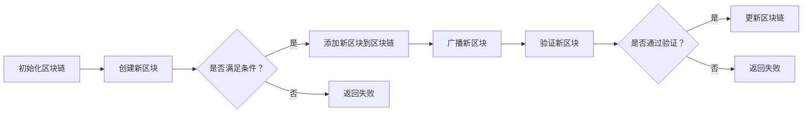
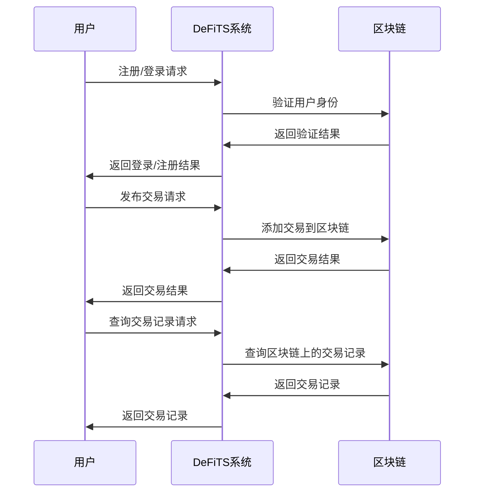

                 

### 摘要

在信息爆炸和数字化转型的时代，区块链技术以其去中心化、安全透明、不可篡改等特性，正逐渐成为构建新型价值交换系统的关键技术。本文将围绕“意义的区块链：去中心化的价值交换系统”这一主题，深入探讨区块链在价值交换中的作用和重要性。文章将从区块链与去中心化的基本概念入手，分析区块链的技术架构和基础技术，如加密技术、共识机制和智能合约。接着，将探讨区块链在去中心化金融（DeFi）、区块链游戏等领域的应用，以及其对供应链管理和数字身份认证等社会领域的深远影响。最后，文章将展望区块链技术的未来发展趋势，并提出应对社会挑战的解决策略。通过一步步的逻辑分析，本文旨在帮助读者全面理解区块链技术的本质和潜力，从而为区块链在现实世界中的广泛应用提供理论支持和实践指导。

### 关键词

- 区块链
- 去中心化
- 价值交换
- 加密技术
- 共识机制
- 智能合约
- 数字身份认证
- 去中心化金融（DeFi）
- 区块链游戏
- 供应链管理

## 第一部分：区块链与价值交换概述

### 第1章：区块链与去中心化简介

区块链技术是21世纪最具革命性的创新之一，它不仅改变了我们对数据存储和验证的理解，也为构建去中心化的价值交换系统提供了新的可能性。在这一章节中，我们将首先探讨区块链的基本概念与核心特点，然后深入分析去中心化的重要性及其在区块链中的应用，最后讨论区块链与价值交换之间的内在联系。

### 1.1.1 区块链的定义与核心特点

**区块链的基本概念**

区块链是一个分布式数据库，它由一系列按时间顺序排列的数据块组成，每个数据块包含一定数量的交易记录，并通过加密算法与之前的区块链接起来，形成一条不可篡改的数据链条。区块链的每一笔交易都是公开透明的，任何参与者都可以验证其合法性。

**区块链的核心特点**

1. **去中心化**：区块链不存在中心化的控制节点，所有参与者（或称为“节点”）在网络中地位平等，每个节点都拥有完整的区块链副本。
2. **不可篡改**：由于区块链的加密技术，一旦数据被记录在一个区块中，就几乎不可能被篡改或删除。
3. **透明性**：区块链上的所有交易记录都是公开可见的，任何参与者都可以查看和验证。
4. **安全性**：区块链利用公钥加密技术确保交易的安全性，只有拥有私钥的节点才能进行合法交易。
5. **自动执行**：通过智能合约，区块链可以在满足特定条件时自动执行预定义的合同条款。

**区块链的技术发展历程**

区块链技术的发展经历了几个重要阶段：

1. **比特币（2009年）**：中本聪（Satoshi Nakamoto）发布了比特币白皮书，首次提出了区块链技术的概念。
2. **以太坊（2015年）**：以太坊的推出使得智能合约成为可能，为区块链应用开辟了新的领域。
3. **其他公链**：包括EOS、Ripple等，这些项目在性能、安全性、去中心化程度等方面进行了优化和创新。
4. **联盟链**：为了满足特定行业或组织的需要，联盟链逐渐兴起，它允许多个机构在一个区块链上进行协作。

### 1.1.2 去中心化的重要性

**去中心化的概念与优势**

去中心化是指在一个网络中没有单一的中央控制节点，而是由多个分布式节点共同维护和决策。去中心化的优势包括：

1. **抗审查性**：由于不存在中心化的控制节点，去中心化系统很难被单点攻击或审查。
2. **透明性与公正性**：所有交易记录都是公开透明的，每个节点都可以验证交易的合法性。
3. **容错性**：即使某些节点出现故障，系统依然可以正常运行，因为数据由多个节点备份和验证。
4. **降低成本**：去中心化可以减少对中心化中介的依赖，从而降低交易成本。

**去中心化在区块链中的应用**

区块链技术的核心应用之一就是去中心化的价值交换系统，它利用区块链的不可篡改和透明性确保交易的公正和安全。以下是一些具体应用：

1. **金融领域**：例如比特币、以太坊等数字货币，通过去中心化的区块链网络实现价值转移。
2. **供应链管理**：通过区块链记录和验证商品的所有交易记录，确保供应链的透明和可追溯。
3. **数字身份认证**：利用区块链技术保护个人身份信息的安全和隐私。

**去中心化面临的挑战与解决方案**

尽管去中心化具有诸多优势，但也面临一些挑战：

1. **性能问题**：随着区块链规模的扩大，其处理能力可能不足，需要优化共识机制和网络结构。
2. **隐私保护**：由于区块链的透明性，隐私保护成为一个重要问题，需要引入零知识证明等技术。
3. **法律监管**：不同国家和地区对区块链技术的法律监管存在差异，需要建立统一的监管框架。

解决这些挑战的方法包括：

1. **分层架构**：通过将区块链分为不同的层级，可以提高系统的性能和可扩展性。
2. **隐私保护技术**：例如零知识证明、同态加密等，可以在不牺牲安全性的前提下保护隐私。
3. **国际合作与法规统一**：通过国际合作，建立统一的区块链技术标准和法律框架，以促进其健康发展。

### 1.1.3 区块链与价值交换的关系

**价值交换的基本概念**

价值交换是指两个或多个参与者通过某种媒介交换其认为具有价值的物品或服务的过程。传统价值交换依赖于中介机构如银行、交易所等，这些中介机构在交易过程中收取手续费并确保交易的安全和公正。

**区块链如何促进价值交换**

区块链技术通过去中心化的方式重新定义了价值交换：

1. **消除中介**：区块链使得参与者可以直接进行点对点的交易，减少了中介环节，降低了交易成本。
2. **增强安全性**：区块链的加密技术和不可篡改性确保了交易的合法性和安全性。
3. **透明性和可追溯性**：区块链上的所有交易记录都是公开透明的，任何参与者都可以查看和验证。

**区块链在价值交换中的局限性**

尽管区块链在价值交换中具有很多优势，但也存在一些局限性：

1. **性能瓶颈**：早期的区块链如比特币和以太坊在交易处理速度和扩展性方面存在瓶颈，难以满足大规模交易需求。
2. **隐私问题**：区块链的透明性可能导致隐私泄露问题，需要引入隐私保护技术。
3. **法律监管**：不同国家和地区的法律监管差异可能影响区块链在价值交换中的应用。

**结论**

区块链技术为价值交换提供了新的可能性，其去中心化、安全性、透明性等特点使其成为构建新型价值交换系统的重要工具。然而，要充分发挥区块链的优势，还需要克服性能、隐私和法律监管等挑战。

## 第二部分：区块链的基础技术

### 第2章：区块链的技术架构

在深入探讨区块链的应用之前，了解其技术架构至关重要。区块链的技术架构决定了其性能、安全性和扩展性。本章将详细分析区块链的基本组成、加密技术、共识机制等核心组成部分，以帮助读者全面理解区块链的工作原理和技术特点。

### 2.1.1 区块链的基本组成

**区块链的基本组成**

区块链由以下几个关键组成部分构成：

1. **区块**：区块是区块链的基本存储单位，每个区块包含一定数量的交易记录。每个区块还包含一个时间戳、一个随机数（用于挖掘过程）以及一个指向前一个区块的哈希值，从而形成一个链式数据结构。
2. **链结构**：区块链的链结构是指由一系列按时间顺序排列的区块所组成的链条。每个区块通过其哈希值与前一个区块链接，形成一个不可篡改的数据库。
3. **节点**：节点是区块链网络中的参与者，它们通过维护和验证区块链的状态来确保其安全性。节点可以分为验证节点、挖掘节点和普通节点，分别负责验证交易、挖掘新区块以及存储区块链数据。

**区块链的工作原理**

1. **交易**：交易是指区块链上的价值转移活动，例如数字货币的转账、智能合约的执行等。每个交易都包含交易双方的地址、交易金额以及交易内容等信息。
2. **区块生成**：挖掘节点收到交易后，将它们打包成一个区块，并计算出一个满足特定条件的哈希值。一旦挖掘出满足条件的哈希值，该区块将被添加到区块链上。
3. **链式结构**：每个新区块通过其哈希值与前一个区块链接，形成一个链式结构。这种链接方式使得区块链具有不可篡改性和可追溯性。
4. **共识机制**：区块链网络中的所有节点通过共识机制来达成一致，确保区块链的状态是合法和一致的。常见的共识机制包括工作量证明（PoW）、权益证明（PoS）等。

### 2.1.2 区块链的加密技术

**加密技术的概念**

加密技术是区块链实现安全性的重要手段。它主要包括以下几种技术：

1. **公钥加密与私钥加密**：公钥加密和私钥加密是两种常见的加密技术。公钥加密使用一对密钥（公钥和私钥），公钥可以公开，而私钥必须保密。公钥加密可以用于加密数据，私钥加密可以用于验证数据。
2. **数字签名**：数字签名是一种利用私钥对数据进行加密的技术，用于确保数据的完整性和真实性。发送方使用私钥对数据进行签名，接收方使用公钥对签名进行验证。
3. **哈希函数**：哈希函数是一种将任意长度的数据映射为固定长度的字符串的算法，用于确保数据的唯一性和完整性。常见的哈希函数包括SHA-256、SHA-3等。

**区块链中的加密应用**

1. **交易加密**：区块链上的交易需要使用公钥加密和私钥加密技术进行加密，以确保交易的安全性。交易金额、交易内容和交易双方的身份信息都会被加密处理。
2. **数字签名**：数字签名用于确保交易的真实性和完整性。发送方使用私钥对交易进行签名，接收方使用公钥对签名进行验证，从而确认交易的合法性。
3. **哈希链**：区块链通过哈希函数将每个区块的哈希值与前一个区块链接，形成一个链式结构。这种链接方式使得区块链具有不可篡改性和可追溯性。

### 2.1.3 区块链的共识机制

**共识机制的概念**

共识机制是指区块链网络中的所有节点如何达成一致并更新区块链的状态。常见的共识机制包括：

1. **工作量证明（PoW）**：PoW机制通过要求节点进行复杂的计算（挖矿）来竞争生成新区块。节点需要解决一个数学难题，最先解决难题的节点将获得生成新区块的权力。PoW机制保证了区块链的公平性和安全性，但也存在性能瓶颈和能源消耗问题。
2. **权益证明（PoS）**：PoS机制通过持有代币的数量和时间来决定生成新区块的权力。持有代币数量越多或持有时间越长，节点获得生成新区块的机会越大。PoS机制相较于PoW机制更加节能和高效，但也面临“富者愈富”的问题。
3. **委托权益证明（DPoS）**：DPoS是对PoS的一种改进，通过选举产生一些超级节点来代表整个网络进行挖矿。超级节点通过持有代币数量和活跃度来竞争产生新区块的权利。DPoS机制具有更高的交易速度和安全性。

**区块链中的共识机制应用**

1. **比特币（PoW）**：比特币采用PoW机制，通过复杂的计算过程来保证区块链的安全性。比特币网络中的节点通过解决数学难题来竞争生成新区块，最先解决难题的节点将获得比特币奖励。
2. **以太坊（PoS）**：以太坊2.0将原本的PoW机制改为了PoS机制，通过持有以太币的数量和时间来决定生成新区块的权力。持有以太币越多或持有时间越长，节点获得生成新区块的机会越大。
3. **EOS（DPoS）**：EOS采用DPoS机制，通过选举产生的超级节点来代表整个网络进行挖矿。超级节点通过持有代币数量和活跃度来竞争生成新区块的权利，从而实现高效和安全的区块链网络。

### 结论

区块链的技术架构包括区块、链结构和节点等基本组成部分，以及加密技术、共识机制等核心技术。这些技术共同作用，使得区块链具有去中心化、安全性、透明性等特点，为构建去中心化的价值交换系统提供了坚实的基础。通过深入理解区块链的技术架构，我们可以更好地把握其工作原理和潜力，为区块链技术的广泛应用提供理论支持和实践指导。

## 第3章：智能合约与去中心化应用

### 3.1.1 智能合约的基本原理

**智能合约的定义与特点**

智能合约是由计算机程序定义和执行的合约，它通过自动化协议执行合同条款。智能合约具有以下特点：

1. **自动化执行**：智能合约在满足特定条件时自动执行预定义的合同条款，无需人为干预。
2. **透明性**：智能合约的代码是公开透明的，所有参与者都可以查看和验证其执行过程。
3. **不可篡改性**：一旦智能合约被部署到区块链上，其代码和状态是不可篡改的，保证了合同的公正性。
4. **安全性**：智能合约使用加密技术确保交易的安全性和数据的完整性。

**智能合约的工作流程**

智能合约的工作流程通常包括以下几个步骤：

1. **编写合约**：开发人员使用特定的编程语言（如Solidity）编写智能合约代码，定义合同的条款和逻辑。
2. **部署合约**：将编写的智能合约代码部署到区块链上，通常需要通过特定的区块链平台（如以太坊）进行部署。
3. **调用合约**：在满足特定条件时，参与者可以调用智能合约的函数，触发合同条款的执行。
4. **执行与验证**：智能合约自动执行预定义的逻辑，并将结果记录在区块链上，所有参与者都可以验证执行结果。

**智能合约的安全性考虑**

尽管智能合约具有诸多优势，但其安全性也是需要重点关注的问题。以下是一些常见的安全性考虑：

1. **代码审计**：在部署智能合约之前，应进行全面的代码审计，以确保代码的正确性和安全性。
2. **输入验证**：智能合约应对所有输入进行严格的验证，以防止恶意输入导致合同执行失败。
3. **访问控制**：智能合约应实施严格的访问控制机制，以确保只有授权的参与者才能调用特定的函数。
4. **代码优化**：优化智能合约的代码，减少潜在的安全漏洞。

### 3.1.2 去中心化应用（DApp）的构建

**DApp的开发流程**

开发去中心化应用（DApp）通常包括以下几个关键步骤：

1. **需求分析**：明确DApp的功能需求，包括用户界面、用户交互逻辑、数据存储和处理等。
2. **选择平台**：根据需求选择适合的区块链平台，如以太坊、EOS、Tron等，每个平台都有其特定的开发工具和框架。
3. **编写合约**：使用特定的编程语言（如Solidity）编写智能合约代码，定义DApp的业务逻辑。
4. **前端开发**：使用Web开发技术（如HTML、CSS、JavaScript）构建DApp的用户界面。
5. **集成与测试**：将智能合约与前端界面集成，进行功能测试和性能测试，确保DApp的正常运行。
6. **部署与上线**：将DApp部署到区块链网络上，并进行上线测试，确保其稳定性和安全性。

**常用DApp开发框架与工具**

以下是一些常用的DApp开发框架与工具：

1. **Truffle**：Truffle是一个以太坊的完整开发环境，提供智能合约的编译、部署、测试等功能。
2. **Hardhat**：Hardhat是一个开源的本地以太坊开发环境，支持智能合约的开发、测试和部署。
3. **Web3.js**：Web3.js是一个JavaScript库，用于与以太坊区块链进行交互，支持智能合约的调用和交易。
4. **React**：React是一个用于构建用户界面的JavaScript库，常用于DApp的前端开发。
5. **Ethers.js**：Ethers.js是一个用于与以太坊区块链交互的JavaScript库，提供简洁易用的API。

**DApp的案例分析**

以下是一些著名的DApp案例：

1. **Decentraland**：Decentraland是一个基于以太坊的虚拟现实平台，用户可以购买、创建和交易虚拟地产和物品。
2. **Uniswap**：Uniswap是一个去中心化的加密货币交易所，允许用户直接在以太坊上进行代币交换。
3. **OpenSea**：OpenSea是一个去中心化的数字资产市场，用户可以购买、出售和交换NFT（非同质化代币）。

### 3.1.3 智能合约与实际应用场景

**金融领域的应用**

智能合约在金融领域有广泛的应用，例如：

1. **去中心化金融（DeFi）**：DeFi项目如Aave和Compound，通过智能合约实现去中心化的借贷、交易和收益分配。
2. **跨境支付**：通过智能合约，可以实现快速、低成本的国际支付，例如Ripple的跨境支付解决方案。
3. **保险**：智能合约可以实现自动化保险赔付，减少欺诈和延迟赔付的风险。

**物流领域的应用**

智能合约在物流领域也有重要的应用，例如：

1. **供应链管理**：通过智能合约记录和验证商品的物流信息，确保供应链的透明和可追溯性。
2. **货物追踪**：智能合约可以实时更新货物的状态，确保物流过程的透明和高效。
3. **运输保险**：智能合约可以自动化运输保险的赔付过程，减少人工干预和纠纷。

**文化产业的应用**

智能合约在文化产业的应用也越来越广泛，例如：

1. **版权管理**：智能合约可以用于自动化版权管理和许可，确保创作者的权益得到保护。
2. **数字艺术**：NFT（非同质化代币）可以将数字艺术品进行确权和交易，确保艺术品的唯一性和稀缺性。
3. **游戏经济**：智能合约可以用于构建去中心化的游戏经济，实现游戏内的物品和虚拟资产的交易。

### 结论

智能合约是区块链技术的重要组成部分，它通过自动化协议实现了去中心化的价值交换。智能合约与实际应用场景的结合，为金融、物流、文化等领域带来了革命性的变化。通过本章的讨论，我们不仅了解了智能合约的基本原理和开发流程，还看到了它在各个领域的广泛应用和潜力。随着区块链技术的不断发展和成熟，智能合约的应用前景将更加广阔。

### 第4章：代币经济与区块链游戏

#### 4.1.1 代币经济的概念与作用

**代币的定义与分类**

代币（Token）是区块链上的数字资产，它代表了一定的价值或权益。根据功能和应用场景，代币可以分为以下几类：

1. **功能性代币**：功能性代币用于支付网络内的费用或服务，例如比特币（BTC）和以太币（ETH）。
2. **治理代币**：治理代币用于参与区块链项目的决策和治理，例如持有以太坊（ETH）的股东可以投票决定项目的方向。
3. **权益代币**：权益代币代表用户在特定项目中的权益，如股票或会员权益，例如游戏中的游戏币或NFT（非同质化代币）。
4. **积分代币**：积分代币用于奖励用户的行为或贡献，如参与测试、推荐新用户等。

**代币经济模型**

代币经济模型是指代币在区块链生态系统中的作用和机制。一个成功的代币经济模型通常包括以下几个方面：

1. **供应与需求**：代币的供应量应该具有一定的稀缺性，以维持其价值。同时，需求应该能够持续增长，以推动代币价格的上涨。
2. **激励机制**：通过奖励机制吸引用户持有和使用代币，如提供折扣、奖励积分等。
3. **交易与流动性**：确保代币在市场上的流动性和交易性，以维持其价值。
4. **治理与参与**：让代币持有者参与项目的治理和决策，提高社区的参与度和忠诚度。

**代币在区块链生态系统中的作用**

1. **价值存储**：代币可以作为价值存储工具，与法币或其他数字货币进行兑换。
2. **支付与交易**：代币在网络内用于支付费用、交易商品或服务。
3. **激励机制**：通过代币奖励用户的行为和贡献，提高社区的积极性和参与度。
4. **治理与参与**：代币持有者可以参与项目的决策和治理，确保项目的长期发展和可持续性。

#### 4.1.2 区块链游戏的发展与挑战

**区块链游戏的定义与特点**

区块链游戏是一种利用区块链技术构建的游戏，它具有以下特点：

1. **去中心化**：区块链游戏不需要中心化的服务器或运营方，所有游戏数据都存储在区块链上，确保数据的透明和不可篡改。
2. **去中心化治理**：玩家可以通过治理代币参与游戏的决策和治理，提高社区的参与度和忠诚度。
3. **真正的所有权**：玩家在区块链游戏中的物品和虚拟资产具有真正的所有权，可以自由交易和交换。
4. **去中心化经济**：区块链游戏通常具有自己的代币经济体系，玩家可以通过玩游戏赚取代币或出售虚拟资产。

**区块链游戏的发展历程**

区块链游戏的发展历程可以分为以下几个阶段：

1. **1.0时代**：早期的区块链游戏如CryptoKitties，主要利用区块链记录游戏内的物品所有权，但游戏体验和技术实现较为简单。
2. **2.0时代**：随着以太坊等智能合约平台的发展，区块链游戏开始引入去中心化治理和代币经济模型，如Decentraland和Axie Infinity。
3. **3.0时代**：未来的区块链游戏将更加注重用户体验和游戏玩法，结合虚拟现实（VR）、增强现实（AR）等技术，提供更加沉浸式的游戏体验。

**区块链游戏面临的挑战与解决方案**

尽管区块链游戏具有很多优势，但也面临一些挑战：

1. **技术挑战**：区块链游戏需要处理大量的交易和数据存储，对区块链的性能和扩展性提出了高要求。解决方案包括分层架构、状态通道和侧链等。
2. **用户体验**：区块链游戏的用户体验可能不如传统游戏，需要优化界面设计、操作流程和游戏速度。
3. **法律监管**：不同国家和地区对区块链和加密货币的法律监管存在差异，可能影响区块链游戏的合法性和稳定性。解决方案包括制定统一的法律法规和跨国际合作。

#### 4.1.3 区块链游戏案例分析

**游戏币的价值机制**

以Axie Infinity为例，游戏币的价值机制包括以下几个方面：

1. **代币发行**：Axie Infinity发行了两种代币，AXS和SLP。AXS用于游戏的治理和投票，SLP用于购买、繁殖和战斗Axies（虚拟生物）。
2. **游戏内经济**：玩家可以通过战斗、繁殖和交易Axies赚取SLP，同时可以使用SLP购买新的Axies或提升现有Axies的战斗力。
3. **价值流动**：SLP的价值流动主要来源于玩家的交易和繁殖活动，当玩家之间进行交易或繁殖Axies时，SLP的价值会随之变化。

**游戏内物品的稀缺性设计**

以Axie Infinity为例，游戏内物品的稀缺性设计包括以下几个方面：

1. **Axies的繁殖**：Axies可以通过交配繁殖新的Axies，但繁殖的成功率较低，使得稀缺的Axies更具价值。
2. **物品的随机性**：Axies的属性和外观是通过随机生成的，使得每个Axies都是独一无二的，增加了物品的稀缺性和收藏价值。
3. **限时活动和奖励**：游戏会定期举办限时活动和奖励，如特殊奖励的Axies或限时道具，增加了游戏的稀缺性和用户参与度。

**游戏社区的建设与激励**

Axie Infinity通过以下方式建设游戏社区并激励玩家：

1. **去中心化治理**：玩家可以通过持有AXS代币参与游戏的治理决策，提高社区的参与度和忠诚度。
2. **经济激励机制**：玩家可以通过玩游戏赚取SLP，并使用SLP购买游戏内的物品和奖励，增加游戏的可持续性和用户粘性。
3. **社区活动和互动**：游戏社区定期举办线上活动和互动，如锦标赛、讨论会等，增强玩家之间的联系和社区氛围。

**案例总结**

Axie Infinity的成功在于其独特的价值机制、稀缺性设计和社区激励机制，使得玩家不仅在游戏中获得乐趣，还能通过游戏赚取实际收益。其去中心化治理和代币经济模型也为区块链游戏的发展提供了新的思路和方向。

### 结论

代币经济和区块链游戏是区块链技术的重要应用领域，它们通过去中心化、稀缺性和激励机制，为用户提供了全新的价值交换和娱乐体验。通过本章节的讨论，我们不仅了解了代币经济的概念和作用，还看到了区块链游戏在游戏币价值机制、稀缺性设计和社区建设等方面的实践和案例。随着区块链技术的不断发展，代币经济和区块链游戏的应用前景将更加广阔，为数字经济和虚拟世界的发展带来新的机遇和挑战。

### 第5章：去中心化金融（DeFi）

#### 5.1.1 DeFi的基本概念与优势

**DeFi的定义与特点**

去中心化金融（Decentralized Finance，简称DeFi）是指通过区块链技术实现的传统金融功能，如借贷、交易、资产管理等，但不需要依赖中心化的金融机构或中介。DeFi具有以下几个主要特点：

1. **去中心化**：DeFi通过区块链网络和智能合约实现金融服务的自动化，所有参与者都在同一个分布式网络中，不存在中心化的控制节点。
2. **开放性**：DeFi网络是公开透明的，所有交易记录和智能合约代码都是可查的，任何用户都可以访问和使用这些服务。
3. **不可篡改**：由于区块链技术的特性，DeFi交易记录一旦被记录在区块链上，就几乎不可能被篡改，保证了数据的完整性和安全性。
4. **低成本**：去中心化的金融服务不需要支付传统金融中介的高额手续费，降低了交易成本。

**DeFi的核心机制**

DeFi的核心机制包括以下几个方面：

1. **智能合约**：智能合约是DeFi实现金融服务的基础，通过编写在区块链上运行的程序，实现了金融产品的自动化和去中心化。
2. **代币**：DeFi项目中通常使用自己的代币作为价值传递和激励机制，这些代币可以用于支付手续费、抵押或收益分配等。
3. **流动性**：流动性是指资金在DeFi平台上的可用性，通过流动性提供者（Liquidity Providers）注入资金，用户可以进行借贷、交易等操作。
4. **治理**：DeFi项目通常采用代币持有者投票的方式实现治理，用户可以通过持有和投票代币来参与项目的决策和治理。

**DeFi的优势与挑战**

**优势**

1. **去中心化和透明性**：去中心化的金融系统消除了对中心化中介机构的依赖，用户可以直接进行点对点的交易，数据透明可查，提高了系统的公正性和可信度。
2. **降低成本**：DeFi通过自动化和去中心化的方式，降低了交易和服务的成本，用户无需支付传统金融机构的高额手续费。
3. **扩展性和灵活性**：DeFi系统可以根据需求快速部署新的金融产品和服务，通过智能合约实现复杂的金融逻辑和业务流程。

**挑战**

1. **安全性**：尽管区块链本身具有较高的安全性，但智能合约可能存在漏洞和安全问题，导致资金损失。因此，代码审计和安全测试至关重要。
2. **监管与合规**：不同国家和地区对加密货币和DeFi项目的监管政策存在差异，可能影响其合法性和稳定性。建立统一的监管框架和合规标准是必要的。
3. **用户体验**：DeFi平台可能面临用户体验问题，如界面设计复杂、操作步骤繁琐等，需要不断优化以提高用户友好性。

#### 5.1.2 DeFi的主要产品与服务

**借贷平台**

借贷平台是DeFi的核心产品之一，用户可以通过平台借出或借入加密货币。以下是一些知名的DeFi借贷平台：

1. **Compound**：Compound是一个去中心化的借贷平台，用户可以将自己的加密货币存入平台，获得利息回报，同时也可以从平台上借出加密货币。
2. **Aave**：Aave是一个灵活的去中心化借贷平台，支持多种加密货币的借贷和流动性挖矿。
3. **MakerDAO**：MakerDAO是基于Dai稳定币的去中心化借贷平台，用户可以通过抵押加密货币获得Dai稳定币。

**货币市场**

货币市场是DeFi中用于交易稳定币和收益率较高的代币的市场。以下是一些知名的DeFi货币市场：

1. **Uniswap**：Uniswap是一个去中心化的加密货币交易市场，用户可以通过流动性挖矿机制提供交易对，并获得代币奖励。
2. **SushiSwap**：SushiSwap是一个基于Uniswap的流动性挖矿平台，用户可以通过提供流动性获得SUSHI代币奖励。
3. **Curve Finance**：Curve Finance是一个用于交易稳定币的DeFi货币市场，提供了高效和低成本的交易对。

**保险产品**

DeFi保险产品通过智能合约提供自动化保险服务，以下是一些知名的DeFi保险产品：

1. **Opyn**：Opyn提供加密货币保险产品，用户可以通过购买期权进行风险管理和资产保护。
2. **Astronaut Finance**：Astronaut Finance提供自动化的金融衍生品交易和保险服务，帮助用户管理投资风险。

**交易平台**

去中心化交易平台允许用户直接在区块链上买卖加密货币和其他代币。以下是一些知名的DeFi交易平台：

1. **Binance Smart Chain**：Binance Smart Chain是一个去中心化交易平台，支持多种加密货币的交易和智能合约开发。
2. **Huobi Eco Chain**：Huobi Eco Chain是一个去中心化交易平台，提供快速和安全的加密货币交易服务。
3. **FTX**：FTX是一个全面的加密货币交易平台，提供交易、借贷、期货等多种金融产品和服务。

#### 5.1.3 DeFi案例分析

**MakerDAO的运行机制**

MakerDAO是一个基于以太坊的去中心化借贷平台，其核心产品是Dai稳定币。以下是MakerDAO的运行机制：

1. **抵押与借款**：用户可以使用各种加密货币（如以太币、比特币）作为抵押物，从MakerDAO借出Dai稳定币。借款利率取决于市场情况和抵押物的价值。
2. **维持抵押率**：用户需要保持抵押率在一定的阈值以上，以确保借款的安全性和稳定性。如果抵押率低于阈值，用户需要追加抵押物或偿还部分借款。
3. **清算机制**：如果用户的抵押率持续低于阈值，MakerDAO将启动清算流程，通过出售抵押物偿还借款，并扣除相关费用。
4. **治理机制**：MakerDAO的代币持有者可以通过投票决定平台的各种参数，如利率、抵押率等，参与平台的治理和决策。

**Uniswap的流动性挖矿**

Uniswap是一个去中心化的流动性挖矿平台，其核心机制如下：

1. **提供流动性**：用户可以通过将两种不同的加密货币存入Uniswap的交易池，成为流动性提供者（Liquidity Provider），并获得一定的流动性费用。
2. **交易费用**：Uniswap的交易费用被用于奖励流动性提供者，具体分配机制取决于交易对和流动性提供者的贡献。
3. **收益分配**：流动性提供者通过提供流动性，可以获得Uniswap代币（UNI）的奖励，这些代币可以在平台上进行交易或用于投票。
4. **自动做市**：Uniswap通过流动性提供者的资金，实现了自动做市功能，用户可以随时进行交易，无需担心流动性问题。

**Aave的借贷与流动性管理**

Aave是一个去中心化的借贷平台，其特点如下：

1. **借贷**：用户可以在Aave上借出或借入多种加密货币，利率由市场需求决定。
2. **流动性挖矿**：用户可以通过提供流动性到Aave的交易池，获得额外的收益，包括借贷利息和流动性费用。
3. **治理**：Aave的代币持有者可以参与平台的治理，包括决定借贷利率、平台参数等。
4. **自动调整利率**：Aave通过智能合约自动调整借贷利率，以维持市场的稳定性和流动性。

**案例总结**

MakerDAO、Uniswap和Aave是DeFi领域的三个重要案例，它们通过去中心化的方式，实现了传统金融产品的自动化和优化。MakerDAO通过稳定币Dai提供了去中心化的借贷服务，Uniswap通过流动性挖矿机制实现了自动做市和交易费用奖励，Aave则通过借贷和流动性挖矿，提供了灵活和高效的金融服务。这些案例展示了DeFi技术在金融领域的巨大潜力，也为未来的金融创新提供了新的思路和方向。

### 结论

去中心化金融（DeFi）通过区块链技术，实现了传统金融产品的去中心化和自动化。DeFi的核心机制包括智能合约、代币、流动性挖矿和治理机制，它具有去中心化、透明性、低成本等优势。然而，DeFi也面临安全性、监管和法律合规等方面的挑战。通过分析MakerDAO、Uniswap和Aave等案例分析，我们可以看到DeFi在借贷、交易和保险等领域的广泛应用和潜力。随着区块链技术的不断发展和成熟，DeFi将为金融行业带来深刻的变革和创新。

### 第6章：区块链与数字身份认证

#### 6.1.1 数字身份认证的挑战与解决方案

**传统身份认证系统的不足**

传统的身份认证系统主要依赖于中心化的身份认证机构，如银行、政府或社交媒体平台等。这些系统在多个方面存在不足：

1. **集中化风险**：传统身份认证系统依赖于中心化的服务器或数据库，一旦中心化机构遭受攻击或故障，可能导致大规模数据泄露或服务中断。
2. **隐私泄露**：用户在传统身份认证系统中需要提交大量的个人信息，这些信息容易被黑客窃取或滥用。
3. **单点故障**：传统身份认证系统中的中心化服务器或数据库可能成为攻击的目标，一旦被攻破，整个系统将面临严重的安全风险。
4. **无法抵抗欺诈**：传统身份认证系统往往依赖于静态密码或生物特征信息，这些信息容易被破解或伪造。

**区块链在身份认证中的应用**

区块链技术为数字身份认证提供了一种新的解决方案，其优势包括：

1. **去中心化**：区块链不存在中心化的控制节点，所有参与者（节点）都在同一个分布式网络中，大大降低了集中化风险。
2. **不可篡改性**：区块链上的数据一旦被记录，就几乎不可能被篡改或删除，确保了身份认证数据的真实性和完整性。
3. **透明性与可追溯性**：区块链上的所有交易记录都是公开透明的，任何参与者都可以查看和验证，提高了系统的可信度。
4. **隐私保护**：区块链上的数据可以使用加密技术进行保护，确保用户的身份信息不会被泄露或滥用。

**区块链在身份认证中的应用**

区块链在数字身份认证中的应用主要包括以下几个方面：

1. **去中心化身份验证**：区块链可以用于构建去中心化的身份验证系统，用户可以在不泄露真实身份信息的情况下，证明自己的身份。
2. **多因素认证**：区块链技术可以支持多因素认证，如密码、生物特征信息和数字证书等，提高身份认证的安全性。
3. **跨境身份认证**：区块链网络跨越不同国家和地区，可以用于实现跨境身份认证，方便国际间的身份验证和合作。
4. **智能合约管理**：通过智能合约，可以自动执行身份认证的流程和规则，提高认证的效率。

**区块链身份认证的架构与实现**

区块链身份认证的架构通常包括以下几个关键组件：

1. **身份信息存储**：区块链用于存储用户的身份信息，如公钥、数字签名、生物特征数据等。这些信息被加密存储，确保隐私和安全。
2. **身份信息验证**：区块链上的节点用于验证用户身份信息，确保其真实性和完整性。节点可以通过共识机制和加密技术进行验证。
3. **智能合约**：智能合约用于管理身份认证的流程和规则，如身份验证请求的处理、身份信息的更新和管理等。
4. **用户界面**：用户界面提供用户与区块链身份认证系统的交互接口，用户可以通过界面提交身份验证请求或管理自己的身份信息。

**数字身份认证的实际应用**

区块链技术在数字身份认证中已有多个实际应用案例，以下是一些典型应用：

1. **政府身份认证**：一些国家和地区已经开始使用区块链技术构建数字身份认证系统，用于公民身份认证、选举投票等。
2. **企业员工身份认证**：企业可以通过区块链技术管理员工的身份信息，提高员工认证的效率和安全性。
3. **互联网用户身份认证**：互联网服务提供商可以使用区块链技术实现用户身份认证，提高网络安全性和用户体验。

**案例总结**

区块链在数字身份认证中具有巨大的潜力，通过去中心化、不可篡改和隐私保护等技术，可以解决传统身份认证系统的不足。通过实际应用案例，我们可以看到区块链技术在政府、企业和互联网领域中的应用，为数字身份认证提供了新的解决方案和方向。

### 结论

数字身份认证是现代信息社会的重要基础设施，区块链技术为数字身份认证提供了新的可能性。通过去中心化、不可篡改和隐私保护等技术，区块链可以有效解决传统身份认证系统的不足，提高身份认证的安全性和效率。随着区块链技术的不断发展和成熟，数字身份认证将在更多领域得到广泛应用，为社会带来更多的便利和安全。

### 第7章：区块链与供应链管理

#### 7.1.1 区块链在供应链管理中的作用

**供应链管理的挑战**

供应链管理涉及从原材料采购到产品交付的各个环节，其复杂性使得管理难度不断增加。以下是一些供应链管理面临的挑战：

1. **数据透明度不足**：传统的供应链管理系统依赖于中心化的数据库，数据的透明度较低，信息不便于共享和追溯。
2. **信息孤岛**：供应链中的各个环节通常由不同的企业或机构管理，信息不互通，导致数据孤岛现象。
3. **假冒伪劣产品**：假冒伪劣产品在供应链中屡见不鲜，传统手段难以有效识别和追踪。
4. **效率低下**：供应链环节多，流程复杂，导致物流和库存管理效率低下，增加运营成本。

**区块链在供应链管理中的优化**

区块链技术通过其去中心化、不可篡改和透明性的特点，可以有效优化供应链管理，解决上述问题：

1. **数据透明度**：区块链上的所有交易记录都是公开透明的，供应链中的各个环节可以实时查看和验证交易信息，提高数据的透明度。
2. **信息共享**：区块链允许不同企业或机构在一个分布式网络中共享数据，打破信息孤岛，实现信息无缝连接。
3. **防伪溯源**：区块链上的数据不可篡改，可以用于记录产品的来源、生产过程和物流信息，实现产品的全流程溯源，有效防止假冒伪劣产品。
4. **提高效率**：区块链的智能合约可以自动化执行合同和协议，减少人工干预，提高供应链的效率和准确性。

**区块链在供应链管理中的具体应用**

1. **物流信息透明化**：区块链可以记录和验证物流信息，确保物流过程的透明和可追溯，提高供应链的效率和客户满意度。
2. **物品追踪与溯源**：通过区块链记录物品的物流信息，可以实现对物品的全流程追踪和溯源，提高供应链的可信度和安全性。
3. **供应链金融**：区块链可以用于优化供应链金融，通过智能合约实现贷款、支付和结算等金融服务的自动化和透明化，降低金融机构的风险和成本。

#### 7.1.2 区块链供应链管理的关键技术

**物流信息的透明化**

1. **区块链网络**：构建一个分布式的区块链网络，包括供应链中的各个环节和企业，实现数据的共享和追溯。
2. **智能合约**：通过智能合约自动化执行物流信息的记录、验证和更新，确保信息的透明性和一致性。
3. **共识机制**：选择合适的共识机制，如工作量证明（PoW）或权益证明（PoS），确保区块链网络的安全性和共识。

**物品追踪与溯源**

1. **区块链记录**：通过区块链记录物品的生产、运输、存储和交付等环节的信息，实现对物品的全流程追踪和溯源。
2. **加密技术**：使用加密技术保护物品信息的隐私和安全，确保只有授权的节点可以查看和验证信息。
3. **防伪标签**：通过防伪标签结合区块链技术，实现对物品的真伪验证，提高供应链的安全性和可信度。

**供应链金融**

1. **智能合约**：通过智能合约实现供应链金融服务的自动化，如贷款、支付和结算等，提高金融服务的效率。
2. **区块链网络**：构建一个分布式的区块链网络，连接供应链中的金融机构和企业，实现金融服务的无缝对接。
3. **信用评估**：利用区块链技术记录企业的信用历史和交易记录，为金融机构提供可靠的信用评估依据，降低风险。

#### 7.1.3 区块链供应链管理案例分析

**农产品供应链管理**

1. **问题描述**：农产品供应链中存在信息不透明、假冒伪劣产品等问题，消费者难以验证产品的真实性。
2. **解决方案**：通过区块链技术记录农产品的生产、加工、运输和销售等环节的信息，实现对产品的全流程追溯和防伪验证。
3. **案例效果**：提高了农产品的透明度和可信度，减少了假冒伪劣产品的风险，提高了消费者的信任度和满意度。

**制药供应链管理**

1. **问题描述**：制药供应链中存在药品真伪难辨、药品过期等问题，对患者的健康安全构成威胁。
2. **解决方案**：通过区块链技术记录药品的生产、流通、存储和配送等环节的信息，实现对药品的全流程追踪和溯源。
3. **案例效果**：提高了药品的可追溯性和安全性，减少了药品假冒和过期的问题，保障了患者的健康安全。

**航空航天供应链管理**

1. **问题描述**：航空航天供应链中涉及到大量的高价值、高精度零部件，供应链管理的复杂度和风险较高。
2. **解决方案**：通过区块链技术实现零部件的生产、采购、配送和安装等环节的信息透明化和可追溯性。
3. **案例效果**：提高了供应链的效率和管理水平，降低了供应链风险，确保了航空航天产品的质量和安全性。

### 结论

区块链技术在供应链管理中的应用，通过其去中心化、不可篡改和透明性的特点，可以解决传统供应链管理中存在的挑战，提高供应链的效率和安全。通过实际案例分析，我们可以看到区块链技术在农产品、制药和航空航天等领域的广泛应用和显著效果。随着区块链技术的不断发展和成熟，它将为供应链管理带来更多的创新和变革。

### 第8章：区块链技术的发展趋势

#### 8.1.1 区块链技术的演进方向

区块链技术自其诞生以来，经历了多个重要的发展阶段。从最初的比特币（Bitcoin）到如今的多种公链、联盟链，区块链技术的演进方向主要包括以下几个方面：

1. **从公有链到联盟链**：早期的区块链如比特币和以太坊是典型的公有链，所有参与者都可以自由加入网络。然而，随着区块链应用场景的扩展，联盟链（Consortium Blockchain）逐渐兴起。联盟链是由一组预定的参与者组成的封闭网络，它们之间通过共识机制和智能合约实现协作。这种模式提高了网络的性能和可扩展性，适用于需要高隐私保护和特定行业协作的场景。

2. **从中心化到去中心化**：虽然去中心化是区块链技术的重要特点，但在某些应用场景下，中心化模式仍有其优势。例如，中心化的交易所和支付处理平台在处理高并发交易时更为高效。因此，未来的发展趋势是在保留去中心化核心优势的同时，探索将中心化与去中心化相结合的混合模式，以实现最优的效率和安全性。

3. **与其他技术的融合**：区块链技术正逐渐与其他前沿技术如人工智能（AI）、物联网（IoT）和云计算（Cloud Computing）相结合，以实现更广泛的应用。例如，AI可以用于区块链网络中的智能合约执行和预测分析，IoT可以用于实现区块链上的设备数据共享和自动化，云计算可以提供区块链网络所需的计算和存储资源。

#### 8.1.2 区块链技术的潜在应用领域

区块链技术的广泛应用前景不仅限于金融领域，它在多个行业和场景中展现出了巨大的潜力：

1. **物联网（IoT）**：区块链可以为物联网设备提供安全的通信和数据共享平台，确保设备之间的数据交换是可信和可靠的。例如，智能家居设备可以通过区块链实现安全的数据共享和自动化控制。

2. **数据隐私保护**：区块链的加密技术和去中心化特性，使其成为保护个人隐私数据的重要工具。区块链可以用于实现数据的安全存储、访问控制和匿名化处理，有效防止数据泄露和滥用。

3. **供应链管理**：区块链技术的透明性和不可篡改性，使其在供应链管理中具有广泛的应用前景。通过区块链记录供应链中的每一个环节信息，可以实现供应链的全程追溯和透明化，减少假冒伪劣产品的风险。

4. **医疗保健**：区块链技术可以用于医疗保健数据的管理和共享，确保医疗数据的真实性和完整性。例如，区块链可以用于记录患者的健康记录、药物使用情况和医疗账单等。

5. **数字身份认证**：区块链技术可以为数字身份认证提供安全、可信的基础设施，通过去中心化的身份验证机制，实现用户身份的隐私保护和高效认证。

6. **版权管理**：区块链技术可以用于记录和验证数字作品的所有权和使用权，确保创作者的权益得到保护。例如，NFT（非同质化代币）技术已经广泛应用于数字艺术品和知识产权的管理。

7. **投票系统**：区块链技术可以用于构建透明、公正的投票系统，防止选举欺诈和篡改。例如，某些国家和地区已经开始探索使用区块链技术进行选举投票。

#### 8.1.3 区块链技术的未来展望

区块链技术的未来将充满机遇和挑战：

1. **技术创新的方向**：区块链技术将继续朝着高性能、高可扩展性和高安全性方向演进。未来可能会出现更多创新的共识机制、加密技术和智能合约框架，以适应不同应用场景的需求。

2. **政策与法律环境**：随着区块链技术的普及和应用，各国政府需要制定相应的政策和法律框架，以确保区块链技术的合法性和合规性。国际合作和统一标准将是推动区块链技术健康发展的重要保障。

3. **社会影响与道德责任**：区块链技术的广泛应用将对社会、经济和道德产生深远影响。企业和政府需要关注其社会责任和道德责任，确保区块链技术用于正当和有益的目的，同时保护用户的隐私和权益。

**结论**

区块链技术的发展趋势包括从公有链到联盟链的演变、中心化与去中心化的结合、与其他前沿技术的融合等。区块链技术在物联网、数据隐私保护、供应链管理、医疗保健、数字身份认证、版权管理和投票系统等多个领域展现出了巨大的应用潜力。未来，随着技术创新、政策完善和社会责任的落实，区块链技术将继续推动社会和经济的变革，为构建更加高效、透明和可信的未来社会提供坚实的技术基础。

### 第9章：区块链的社会挑战与解决策略

#### 9.1.1 区块链的社会挑战

尽管区块链技术具有众多优势，但其发展过程中也面临着一系列社会挑战，这些挑战涉及能源消耗、隐私保护和法律监管等多个方面。

**能源消耗问题**

区块链技术，特别是基于工作量证明（PoW）机制的区块链网络，如比特币，在运行过程中需要大量计算资源，这导致大量的电力消耗。例如，比特币网络每年消耗的能源相当于一个中等规模国家的能源消耗。这种高能耗不仅增加了环境负担，也引起了社会对可持续发展的担忧。

**解决策略**

1. **改进共识机制**：开发更节能的共识机制，如权益证明（PoS）和委托权益证明（DPoS），这些机制相比PoW机制消耗的能源要少得多。
2. **混合共识机制**：结合多种共识机制，如将PoW与PoS结合，以优化网络性能和能源效率。
3. **绿色能源**：鼓励区块链网络采用可再生能源，如太阳能、风能等，减少对化石燃料的依赖。

**隐私保护问题**

区块链技术的透明性和不可篡改性虽然提高了数据的可信度，但也带来了隐私保护的问题。区块链上的交易记录是公开透明的，这意味着用户的交易信息可能被不良分子利用，导致隐私泄露。

**解决策略**

1. **引入隐私保护技术**：采用零知识证明（ZKP）、同态加密等隐私保护技术，确保用户在交易过程中保持隐私。
2. **混合网络**：构建混合型区块链网络，既保持区块链的透明性，又实现部分交易的隐私保护。
3. **隐私增强协议**：开发和实施隐私增强协议，如环签名、环密码术等，以保护用户的隐私。

**法律监管问题**

区块链技术的去中心化特性使其成为非法活动和洗钱等违法行为的温床。不同国家和地区对区块链技术的监管政策存在差异，这给跨国交易和合规带来了挑战。

**解决策略**

1. **国际合作与法规统一**：推动国际社会在区块链技术监管方面的合作，制定统一的监管标准和法规框架。
2. **合规性设计**：在区块链项目的设计和开发阶段，充分考虑法律和监管要求，确保项目符合相关法规。
3. **监管沙盒**：建立监管沙盒，为区块链项目提供合规试验的环境，帮助项目方了解和适应监管要求。

#### 9.1.2 区块链的解决策略

**技术优化与能源效率提升**

1. **性能优化**：通过改进区块链的共识机制和交易处理算法，提高网络的性能和效率，减少不必要的计算资源消耗。
2. **分层架构**：采用分层架构，将区块链网络分为不同层级，以提高系统的扩展性和可维护性。
3. **链下交易**：通过链下交易（Off-chain Transactions），将部分交易处理转移到链外，以减轻区块链网络的负担。

**隐私保护机制的引入**

1. **零知识证明（ZKP）**：零知识证明技术允许证明某个陈述是真实的，而不泄露任何额外信息，是保护隐私的重要工具。
2. **同态加密**：同态加密允许对加密数据进行操作，而无需解密，从而在保护隐私的同时执行计算。
3. **隐私增强协议**：开发和应用隐私增强协议，如环签名、环密码术等，以保护用户的隐私。

**法律与监管框架的完善**

1. **国际合作**：推动国际社会在区块链技术监管方面的合作，制定统一的监管标准和法规框架。
2. **监管沙盒**：建立监管沙盒，为区块链项目提供合规试验的环境，帮助项目方了解和适应监管要求。
3. **合规性设计**：在区块链项目的设计和开发阶段，充分考虑法律和监管要求，确保项目符合相关法规。

**结论**

区块链技术的发展带来了诸多社会挑战，包括能源消耗、隐私保护和法律监管等。通过技术优化、隐私保护机制的引入和完善法律与监管框架，我们可以有效应对这些挑战，推动区块链技术的健康发展，使其在更多领域发挥其潜力。

## 总结与展望

区块链技术作为21世纪最具革命性的创新之一，正在深刻改变着金融、供应链管理、数字身份认证和社会治理等多个领域。通过对区块链技术的深入分析，我们发现其在去中心化、安全性、透明性等方面的独特优势，为构建更加高效、透明和可信的系统提供了新的可能性。

本文从区块链与价值交换的概述入手，详细探讨了区块链的基础技术，如加密技术、共识机制和智能合约。接着，我们分析了区块链在去中心化金融（DeFi）、区块链游戏、数字身份认证和供应链管理等方面的应用，展示了区块链技术在实际场景中的巨大潜力。此外，我们还讨论了区块链技术的未来发展趋势，以及如何应对其面临的社会挑战。

随着区块链技术的不断成熟和应用场景的拓展，我们可以预见其在更多领域的广泛应用，如物联网、数据隐私保护、医疗保健和版权管理等。然而，要充分发挥区块链技术的优势，还需要克服能源消耗、隐私保护和法律监管等挑战。

展望未来，区块链技术将在推动社会和经济发展中发挥越来越重要的作用。通过技术创新、政策完善和社会责任的落实，我们可以期待一个更加高效、透明和可信的未来社会。让我们携手共同探索和推动区块链技术的发展，为实现这一愿景贡献力量。

### 附录

**附录1：关键术语解释**

- **区块链（Blockchain）**：一种分布式数据库技术，由一系列按时间顺序排列的数据块组成，每个数据块包含一定数量的交易记录，并通过加密算法链接起来。
- **加密技术（Cryptography）**：一种保护数据安全和隐私的技术，包括公钥加密、私钥加密、数字签名和哈希函数等。
- **共识机制（Consensus Mechanism）**：区块链网络中节点达成一致的方法，如工作量证明（PoW）、权益证明（PoS）和委托权益证明（DPoS）等。
- **智能合约（Smart Contract）**：一种运行在区块链上的计算机程序，当满足特定条件时自动执行预定义的合同条款。
- **去中心化（Decentralization）**：在区块链网络中，不存在中心化的控制节点，所有节点在网络中地位平等。
- **价值交换（Value Exchange）**：两个或多个参与者通过某种媒介交换其认为具有价值的物品或服务的过程。

**附录2：核心概念与联系**

**核心概念：**

- **区块链**：分布式数据库，记录交易数据，并通过加密算法链接成链。
- **智能合约**：计算机程序，自动执行合同条款。
- **加密技术**：保护数据安全和隐私的技术。
- **共识机制**：确保区块链网络一致性的方法。

**概念属性特征对比表格：**

| 特性           | 区块链            | 智能合约           | 加密技术            | 共识机制            |
|----------------|------------------|--------------------|---------------------|---------------------|
| 分布性         | 分布式数据库      | 分布式程序         | 分布式加密         | 分布式决策         |
| 不可篡改性     | 不可篡改的链式结构 | 自动执行           | 数据加密保护       | 数据一致性确保     |
| 透明性         | 公开透明的交易记录 | 公开透明的执行流程 | 加密算法公开透明   | 公开透明的决策过程 |
| 安全性         | 加密技术保护      | 加密合约保护       | 加密算法保护       | 共识机制保障      |
| 自动执行       | 记录交易数据      | 执行合同条款       | 数据加密           | 数据共识           |

**ER实体关系图架构：**

```mermaid
erDiagram
  区块chain ..|> 交易Transaction
  区块chain ..|> 节点Node
  智能合约smartContract ..|> 区块chain
  智能合约smartContract ..|> 节点Node
  加密技术cryptography ..|> 智能合约smartContract
  加密技术cryptography ..|> 区块chain
  共识机制consensusMechanism ..|> 区块chain
  共识机制consensusMechanism ..|> 节点Node
```

### 附录3：算法原理讲解

**算法流程图：**



**Python代码实现：**

```python
import hashlib
import json
from time import time

class Blockchain:
    def __init__(self):
        self.unconfirmed_transactions = []
        self.chain = []
        self.create_genesis_block()

    def create_genesis_block(self):
        genesis_block = {
            'index': 0,
            'timestamp': time(),
            'transactions': [],
            'prev_hash': "0",
        }
        hash = self.compute_hash(genesis_block)
        genesis_block['hash'] = hash
        self.chain.append(genesis_block)

    def compute_hash(self, block):
        block_string = json.dumps(block, sort_keys=True)
        return hashlib.sha256(block_string.encode()).hexdigest()

    def add_new_transaction(self, transaction):
        self.unconfirmed_transactions.append(transaction)

    def mine(self):
        if not self.unconfirmed_transactions:
            return False

        last_block = self.chain[-1]
        new_block = {
            'index': last_block['index'] + 1,
            'timestamp': time(),
            'transactions': self.unconfirmed_transactions,
            'prev_hash': last_block['hash'],
        }
        hash = self.compute_hash(new_block)
        new_block['hash'] = hash
        self.chain.append(new_block)
        self.unconfirmed_transactions = []
        return new_block

    def verify_chain(self):
        for i in range(1, len(self.chain)):
            current = self.chain[i]
            previous = self.chain[i - 1]
            if current['hash'] != self.compute_hash(current):
                return False
            if current['prev_hash'] != previous['hash']:
                return False
        return True

blockchain = Blockchain()
blockchain.add_new_transaction({'sender': 'Alice', 'recipient': 'Bob', 'amount': 10})
blockchain.mine()
print(blockchain.chain)
blockchain.verify_chain()
```

**算法原理与数学模型解释：**

区块链中的算法主要基于工作量证明（PoW）机制，即通过计算找到满足特定条件的哈希值来验证新区块的有效性。具体步骤如下：

1. **初始化区块链**：创建创世区块（Genesis Block），作为区块链的起点。
2. **创建新区块**：当有新的交易产生时，将这些交易添加到未确认交易池（Unconfirmed Transactions）中。
3. **挖掘新区块**：挖掘节点从未确认交易池中选取交易，创建一个新区块。新区块包含当前时间戳、交易记录、上一个区块的哈希值和一个随机数（用于计算哈希值）。
4. **计算哈希值**：对新区块进行哈希计算，生成一个哈希值。挖掘节点需要找到满足特定条件的哈希值，通常要求哈希值的前几个字节为0。
5. **验证新区块**：网络中的其他节点验证新区块的合法性和哈希值是否满足条件。如果验证通过，新区块将被添加到区块链中，并且未确认交易池中的交易将被清空。
6. **更新区块链**：当新区块被添加到区块链上时，所有节点将更新自己的区块链副本，以保持与网络一致性。

**举例说明：**

假设我们有一个区块链，当前最后一个区块的哈希值为`"0"`。我们想要挖掘一个新的区块，其包含以下交易：

- Alice向Bob转账10个代币。

挖掘节点需要找到满足以下条件的哈希值：

- 哈希值的前5个字节为0。

通过不断尝试，挖掘节点可能找到哈希值为`"00000abc1234"`的新区块。此时，新区块将被添加到区块链上，并且交易将被记录。

### 附录4：系统分析与架构设计方案

**问题场景介绍**

在当前的金融行业中，由于信息不对称、中介费用高、交易流程复杂等问题，金融机构和用户之间的信任和效率亟待提升。区块链技术以其去中心化、安全性、透明性等特性，为构建一个高效、可信的金融交易系统提供了新的可能性。本项目旨在设计一个基于区块链的金融交易系统，提高交易透明度和效率，降低中介费用。

**项目介绍**

项目名称：去中心化金融交易系统（Decentralized Financial Trading System，简称DeFiTS）

目标：构建一个高效、安全、透明的去中心化金融交易平台，实现用户之间的直接交易，降低中介成本，提高交易效率。

**系统功能设计**

1. **用户身份认证**：系统支持用户注册、登录和身份认证，确保交易的安全性。
2. **交易管理**：系统支持用户发布交易、接收交易、处理交易和记录交易信息。
3. **智能合约管理**：系统支持智能合约的编写、部署和执行，确保交易过程的自动化和透明性。
4. **数据分析**：系统提供交易数据分析功能，帮助用户了解市场动态和交易行为。
5. **风险控制**：系统提供风险控制机制，确保交易的安全性和合规性。

**系统架构设计**

1. **领域模型**：系统采用领域驱动设计（Domain-Driven Design，简称DDD）方法，构建领域模型，包括用户、交易、智能合约、数据分析和风险控制等核心领域。
2. **架构图**：系统架构采用分层架构，包括表示层、逻辑层和数据层。表示层负责用户界面和交互，逻辑层负责业务逻辑和数据处理，数据层负责数据存储和查询。
3. **系统接口设计**：系统提供API接口，支持用户注册、登录、发布交易、查询交易记录等功能，确保系统与其他系统的集成和扩展性。

**系统交互**

1. **用户交互**：用户通过Web界面或移动应用与系统进行交互，实现注册、登录、发布交易、查询交易记录等功能。
2. **系统内部交互**：系统内部通过API接口实现用户身份认证、交易管理、智能合约管理和数据分析等功能的交互，确保系统的高效性和可靠性。

**系统接口设计和系统交互**



### 附录5：项目实战

#### 环境安装

在开始项目实战之前，我们需要安装以下软件和工具：

1. **Node.js**：用于运行区块链节点和智能合约。
2. **Ganache**：用于创建本地以太坊节点和测试智能合约。
3. **Truffle**：用于智能合约的开发和测试。
4. **Visual Studio Code**：用于编写智能合约和前端代码。

安装步骤：

1. 安装Node.js（推荐版本为12.x或14.x）。
2. 安装Ganache：`npm install -g ganache-cli`。
3. 安装Truffle：`npm install -g truffle`。
4. 安装Visual Studio Code：从官方网站下载并安装。

#### 系统核心实现源代码

以下是DeFiTS系统的核心实现源代码，包括智能合约和前端代码：

**智能合约（Blockchain.sol）**

```solidity
// SPDX-License-Identifier: MIT
pragma solidity ^0.8.0;

contract Blockchain {
    struct Transaction {
        address sender;
        address recipient;
        uint amount;
    }

    Transaction[] private transactions;
    mapping(address => uint) private balances;

    event TransactionAdded(
        address sender,
        address recipient,
        uint amount,
        uint transactionIndex
    );

    function addTransaction(address recipient, uint amount) public {
        require(balances[msg.sender] >= amount, "Insufficient balance");
        transactions.push(Transaction({ sender: msg.sender, recipient: recipient, amount: amount }));
        balances[msg.sender] -= amount;
        balances[recipient] += amount;
        emit TransactionAdded(msg.sender, recipient, amount, transactions.length - 1);
    }

    function getBalance(address account) public view returns (uint) {
        return balances[account];
    }

    function getTransactionCount() public view returns (uint) {
        return transactions.length;
    }

    function getTransaction(uint index) public view returns (Transaction memory transaction) {
        require(index < transactions.length, "Invalid transaction index");
        return transactions[index];
    }
}
```

**前端代码（index.html）**

```html
<!DOCTYPE html>
<html lang="en">
<head>
    <meta charset="UTF-8">
    <meta name="viewport" content="width=device-width, initial-scale=1.0">
    <title>DeFiTS</title>
    <script src="https://cdn.jsdelivr.net/npm/web3@1.2.8/dist/web3.min.js"></script>
    <script src="https://cdn.jsdelivr.net/npm/@trufflesuite/web3@5.3.0/dist/web3.min.js"></script>
</head>
<body>
    <h1>DeFiTS - Decentralized Financial Trading System</h1>
    <div>
        <h2>User Balance</h2>
        <p id="userBalance">Loading...</p>
    </div>
    <div>
        <h2>Add Transaction</h2>
        <input type="text" id="recipient" placeholder="Recipient Address">
        <input type="number" id="amount" placeholder="Amount">
        <button id="addTransaction">Add Transaction</button>
    </div>
    <div>
        <h2>Transaction History</h2>
        <ul id="transactionHistory"></ul>
    </div>
    <script>
        const contractAddress = '0x...'; // 你的智能合约地址
        const contractABI = [...] // 你的智能合约ABI
        const web3 = new Web3('http://127.0.0.1:7545');
        const blockchain = new web3.eth.Contract(contractABI, contractAddress);

        function loadUserBalance() {
            web3.eth.getBalance(document.getElementById('recipient').value, (err, balance) => {
                if (err) return console.error(err);
                document.getElementById('userBalance').innerText = `Balance: ${web3.utils.fromWei(balance.toString(), 'ether')} ETH`;
            });
        }

        function addTransaction() {
            const recipient = document.getElementById('recipient').value;
            const amount = document.getElementById('amount').value;
            blockchain.methods.addTransaction(recipient, amount).send({ from: web3.eth.defaultAccount, gas: 200000 }, (err, txHash) => {
                if (err) return console.error(err);
                console.log('Transaction submitted:', txHash);
                loadUserBalance();
                updateTransactionHistory();
            });
        }

        function updateTransactionHistory() {
            blockchain.methods.getTransactionCount().call({ from: web3.eth.defaultAccount }, (err, count) => {
                if (err) return console.error(err);
                const transactionHistory = document.getElementById('transactionHistory');
                transactionHistory.innerHTML = '';
                for (let i = 0; i < count; i++) {
                    blockchain.methods.getTransaction(i).call({ from: web3.eth.defaultAccount }, (err, transaction) => {
                        if (err) return console.error(err);
                        const li = document.createElement('li');
                        li.innerText = `Transaction ${i + 1}: From ${transaction.sender} To ${transaction.recipient} Amount ${transaction.amount}`;
                        transactionHistory.appendChild(li);
                    });
                }
            });
        }

        window.addEventListener('load', () => {
            if (window.ethereum) {
                web3.eth.getAccounts((err, accounts) => {
                    if (err) return console.error(err);
                    web3.eth.defaultAccount = accounts[0];
                    loadUserBalance();
                    updateTransactionHistory();
                });
            } else {
                alert('MetaMask not detected. Please install MetaMask to use DeFiTS.');
            }
        });

        document.getElementById('addTransaction').addEventListener('click', addTransaction);
    </script>
</body>
</html>
```

#### 代码应用解读与分析

**智能合约解析**

1. **结构**：智能合约采用Solidity语言编写，结构包括结构体（`struct`）、事件（`event`）和函数（`function`）。
2. **结构体（Transaction）**：定义了交易的基本信息，包括发送者（`sender`）、接收者（`recipient`）和金额（`amount`）。
3. **事件（TransactionAdded）**：用于记录交易添加到区块链的事件，触发时传递交易信息。
4. **函数（addTransaction）**：允许用户通过调用该函数添加交易，函数中首先检查用户余额是否足够，然后更新交易记录和余额。
5. **函数（getBalance）**：用于获取用户的账户余额。
6. **函数（getTransactionCount）**：用于获取区块链上的交易数量。
7. **函数（getTransaction）**：用于获取指定索引的交易详情。

**前端解析**

1. **环境准备**：前端代码使用了Web3.js库与区块链进行交互，并通过Truffle提供的API与智能合约进行通信。
2. **用户界面**：界面包括用户余额显示、交易添加输入框和交易历史记录列表。
3. **功能实现**：
   - **用户余额加载**：通过调用`getBalance`函数加载用户余额。
   - **添加交易**：通过调用`addTransaction`函数将交易信息发送到区块链。
   - **交易历史记录更新**：通过循环调用`getTransaction`函数，更新交易历史记录列表。

**实际案例分析和详细讲解剖析**

1. **案例**：假设Alice想向Bob转账10个以太币。
2. **步骤**：
   - Alice在Web界面上填写Bob的地址和转账金额，然后点击“Add Transaction”按钮。
   - 前端代码调用`addTransaction`函数，将Alice的地址、Bob的地址和转账金额作为参数传递给智能合约。
   - 智能合约检查Alice的账户余额是否足够，然后更新交易记录和余额，并将事件`TransactionAdded`触发，记录交易信息。
   - 前端代码更新用户余额和交易历史记录，显示交易结果。
3. **讲解**：
   - **前端代码**：通过JavaScript和Web3.js库与区块链交互，实现了用户界面和功能逻辑。
   - **智能合约**：通过Solidity语言编写的智能合约，实现了交易管理、余额管理和事件触发等功能。

**项目小结**

DeFiTS项目通过区块链技术实现了去中心化的金融交易系统，提高了交易透明度和效率，降低了中介成本。该项目展示了智能合约在去中心化金融应用中的潜力，并为未来的金融创新提供了参考。

### 最佳实践 Tips、小结、注意事项、拓展阅读

#### 最佳实践 Tips

1. **确保安全性**：在开发智能合约和区块链应用时，务必进行全面的代码审计和安全测试，防止潜在的安全漏洞。
2. **优化性能**：根据应用需求，选择合适的共识机制和区块链平台，以优化系统性能和可扩展性。
3. **隐私保护**：引入隐私保护技术，如零知识证明（ZKP）、同态加密等，确保用户隐私和数据安全。
4. **合规性设计**：充分考虑法律和监管要求，确保项目符合相关法规，降低合规风险。

#### 小结

本文深入探讨了区块链技术的原理、应用和发展趋势，展示了其在金融、供应链管理、数字身份认证等领域的巨大潜力。通过实际案例和项目实战，我们了解了区块链技术在实际应用中的实现方法和挑战。

#### 注意事项

1. **能源消耗**：区块链网络的高能耗问题需要得到重视，建议采用节能的共识机制和绿色能源。
2. **隐私保护**：区块链的透明性可能带来隐私泄露风险，应引入隐私保护技术。
3. **法律监管**：不同国家和地区对区块链技术的法律监管存在差异，项目开发过程中应关注合规性。

#### 拓展阅读

- **《区块链技术指南》**：深入讲解区块链的基础知识、架构和实现。
- **《智能合约开发实战》**：介绍智能合约的开发方法和最佳实践。
- **《DeFi：去中心化金融的未来》**：探讨去中心化金融的概念、技术和应用场景。
- **《区块链与物联网》**：介绍区块链技术在物联网领域的应用和挑战。

### 作者信息

- **作者：AI天才研究院/AI Genius Institute & 禅与计算机程序设计艺术 /Zen And The Art of Computer Programming**

