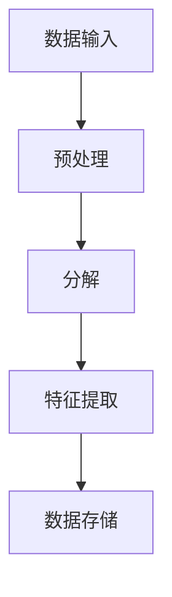
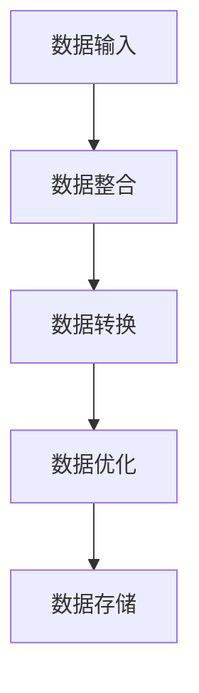

                 


### 引言

#### 1.1 问题背景

在当今信息化社会中，数据无处不在，其规模和复杂性不断增长。然而，这些数据往往呈现出一种非结构化或半结构化的状态，即它们缺乏明确的组织形式和结构，这使得直接处理和利用这些数据变得具有挑战性。非结构化数据包括文本、图像、音频和视频等多种形式，而半结构化数据如XML、JSON等虽然有一定的结构，但仍然需要额外的处理才能被有效利用。

在这种背景下，数据的去结构化与再结构化过程成为了一个关键技术课题。去结构化，顾名思义，是指将复杂的数据拆分成更小、更易于处理的单元。而再结构化则是将这些分散的单元重新组合，形成具有更高层次意义的结构化数据。这两个过程相辅相成，为数据的存储、处理和分析提供了坚实的基础。

#### 1.2 研究目的与意义

本研究旨在深入探讨数据的去结构化与再结构化过程，从理论基础、算法设计、系统架构到实际应用等多个层面进行系统性分析。具体目标包括：

1. **核心概念解析**：明确去结构化与再结构化的定义、特点和应用场景。
2. **算法原理阐述**：详细讲解去结构化和再结构化算法的原理、流程和数学模型。
3. **系统设计与实现**：设计并实现一个去结构化和再结构化系统的架构，展示其实际运行效果。
4. **项目实战分析**：通过实际项目案例，验证和优化去结构化和再结构化技术。
5. **最佳实践总结**：总结出一套行之有效的最佳实践，为实际应用提供指导。

本研究不仅具有重要的理论价值，还能为实际应用提供有效的技术解决方案，从而在数据管理和数据分析领域发挥重要作用。

### 第1章 问题概述

#### 1.1 问题描述

在信息化社会，数据已成为企业和社会的重要资产。然而，由于数据的多样性和复杂性，传统的结构化数据处理方法在面对非结构化和半结构化数据时显得力不从心。具体来说，非结构化数据通常缺乏固定的数据模式，如文本数据中的自然语言文本、图像数据中的像素信息、音频数据中的波形等。这些数据形式虽然丰富，但其处理和利用效率较低。

半结构化数据，如XML、JSON等，虽然有一定的结构，但仍然需要额外的处理步骤才能被有效利用。例如，XML数据虽然采用标签进行组织，但解析和提取信息的过程较为繁琐；JSON数据虽然简洁，但处理和解析也需要相应的技术支持。

这种数据形态上的差异，导致了数据处理过程中存在以下几个主要问题：

1. **数据理解难度大**：非结构化和半结构化数据的读取和理解较为复杂，需要特定的解析技术。
2. **数据处理效率低**：由于数据缺乏有效的结构化，数据处理和分析过程往往需要更多的时间和资源。
3. **数据一致性难以保证**：不同数据源的数据格式和结构可能存在较大差异，导致数据集成和一致性处理困难。
4. **数据价值难以挖掘**：非结构化和半结构化数据往往无法直接用于机器学习和数据分析，限制了数据的价值挖掘。

#### 1.2 问题解决

为了解决上述问题，我们需要对非结构化和半结构化数据进行去结构化和再结构化处理。去结构化是指将复杂的数据拆分成更小、更易于处理的单元，如将自然语言文本拆分成单词或句子，将图像数据拆分成像素点，将音频数据拆分成波形段等。而再结构化则是将这些分散的单元重新组合，形成具有更高层次意义的结构化数据，如生成词云、图像特征向量、音频波形特征等。

去结构化和再结构化处理可以带来以下好处：

1. **简化数据处理**：通过去结构化，我们可以将复杂的非结构化数据转化为更简洁的格式，降低数据处理难度。
2. **提高处理效率**：结构化的数据可以更高效地进行存储、检索和分析，从而提高数据处理效率。
3. **确保数据一致性**：通过再结构化，我们可以将不同数据源的数据进行统一处理，确保数据的一致性。
4. **挖掘数据价值**：结构化的数据可以直接应用于机器学习和数据分析，从而更好地挖掘数据的价值。

总之，去结构化和再结构化处理是解决非结构化和半结构化数据处理问题的重要方法，其应用前景广阔，对于提升数据管理和分析效率具有重要意义。

#### 1.3 边界与外延

在讨论数据的去结构化和再结构化过程中，我们需要明确其边界和外延，以确保概念的准确理解和应用。

**边界**：

1. **去结构化**：去结构化主要针对非结构化和半结构化数据，即那些没有固定数据模式或结构的数据。它不包括完全结构化数据，如关系数据库中的数据，因为这些数据已经具有明确的结构和模式，无需额外的去结构化步骤。
2. **再结构化**：再结构化主要针对经过去结构化处理后的数据，即那些已经拆分成小单元但需要重新组织成有更高层次意义的数据。它不包括原始数据的原始形式，因为这些数据尚未经过去结构化处理。

**外延**：

1. **应用范围**：去结构化和再结构化处理的应用范围非常广泛，包括但不限于自然语言处理、图像处理、音频处理、数据挖掘、机器学习等领域。例如，在自然语言处理中，去结构化可用于文本预处理，如分词、词性标注等；再结构化可用于生成语义角色标注、情感分析等。
2. **技术方法**：去结构化和再结构化处理涉及多种技术方法，如分词、词频统计、图像分割、音频特征提取等。这些方法可以单独使用，也可以结合使用，以实现更高效的数据处理和分析。

总之，明确去结构化和再结构化的边界和外延，有助于我们更好地理解和应用这两个关键技术，从而在数据管理和分析领域取得更好的成果。

#### 1.4 概念结构与核心要素组成

在深入探讨数据的去结构化与再结构化过程之前，我们需要明确几个核心概念，并分析其内在结构及相互关系。以下是几个关键概念的定义、属性和相互联系：

1. **数据结构**：数据结构是指数据在存储和传输过程中的组织形式。常见的结构包括线性结构（如数组、链表）、树状结构（如二叉树、平衡树）、图状结构（如图、网络）等。数据结构决定了数据的存储方式和访问效率。

2. **非结构化数据**：非结构化数据是指没有固定数据模式或结构的数据。其形式多样，包括文本、图像、音频、视频等。非结构化数据通常需要额外的处理才能被有效利用。

3. **半结构化数据**：半结构化数据是指具有一定的结构，但不是完全固定的数据。常见的半结构化数据包括XML、JSON、HTML等。半结构化数据虽然有一定的结构，但解析和提取信息的过程较为复杂。

4. **结构化数据**：结构化数据是指具有固定数据模式或结构的数据。其通常以关系数据库的形式存储，如关系型数据库（如MySQL、Oracle）和NoSQL数据库（如MongoDB、Cassandra）等。结构化数据便于存储、检索和分析。

5. **去结构化**：去结构化是指将非结构化和半结构化数据拆分成更小、更易于处理的单元。其目的是简化数据处理、提高处理效率和确保数据一致性。

6. **再结构化**：再结构化是指将经过去结构化处理后的数据重新组织成具有更高层次意义的数据。其目的是挖掘数据的价值和提升数据利用率。

**概念结构与核心要素组成**：

- **核心要素**：去结构化和再结构化的核心要素包括数据源、数据处理算法、数据结构和输出结果。
- **数据源**：包括非结构化和半结构化数据，如文本、图像、音频、XML、JSON等。
- **数据处理算法**：包括去结构化算法（如分词、图像分割、音频特征提取等）和再结构化算法（如文本分类、图像识别、音频标签生成等）。
- **数据结构**：包括原始数据结构（如XML树、JSON对象等）和经过去结构化和再结构化后的数据结构（如词云、图像特征向量、音频特征向量等）。
- **输出结果**：包括经过去结构化和再结构化后的结构化数据，便于进一步存储、检索和分析。

**相互关系**：

- **去结构化**与**再结构化**：去结构化和再结构化是相辅相成的过程。去结构化将复杂的数据拆分成更小、更易于处理的单元；再结构化则将这些单元重新组合成具有更高层次意义的数据。两者共同作用，实现数据的结构化处理和利用。
- **非结构化数据**与**半结构化数据**：非结构化数据和半结构化数据是数据结构化的两个重要来源。非结构化数据需要通过去结构化处理转化为结构化数据；半结构化数据则通过去结构化和再结构化处理，实现数据的进一步优化和利用。

总之，明确概念结构与核心要素组成，有助于我们更好地理解和应用数据的去结构化与再结构化过程，从而在数据管理和分析领域取得更好的成果。

### 第2章 核心概念与联系

在深入探讨数据的去结构化与再结构化过程之前，我们需要明确其中的核心概念，并分析这些概念之间的联系与区别。本章将介绍去结构化与再结构化的定义、特点及其应用场景，帮助读者建立全面的理解。

#### 2.1 去结构化概念

**2.1.1 定义与历史发展**

去结构化（Data De-Structuring）是指将复杂的数据拆分成更小、更易于处理的单元，从而降低数据处理的难度和复杂性。去结构化过程可以看作是一种数据预处理技术，其目标是使数据更符合分析需求，便于后续的处理和分析。

历史发展方面，去结构化技术可以追溯到早期的数据处理和文本分析领域。随着计算机技术的快速发展，去结构化技术逐渐成熟，并成为数据管理与分析中的关键环节。当前，去结构化技术广泛应用于自然语言处理、图像处理、音频处理、数据挖掘等领域。

**2.1.2 特点与应用**

去结构化具有以下几个主要特点：

1. **分解性**：去结构化将复杂的数据拆分成更小的单元，如将文本拆分为单词、句子，将图像拆分为像素点，将音频拆分为波形段等。这种分解性有助于简化数据处理过程。

2. **灵活性**：去结构化技术可以根据具体应用需求，选择合适的分解方法和策略。例如，在自然语言处理中，可以根据文本的语义需求选择分词算法；在图像处理中，可以根据图像特征选择图像分割算法。

3. **可扩展性**：去结构化技术具有良好的可扩展性，可以适应不同规模和形式的数据。随着数据量的增加，去结构化技术可以通过优化算法和增加计算资源来提高处理效率。

去结构化的主要应用场景包括：

1. **文本处理**：在自然语言处理中，去结构化技术可以用于文本分词、词性标注、命名实体识别等，从而提高文本分析的质量和效率。

2. **图像处理**：在图像处理中，去结构化技术可以用于图像分割、特征提取等，从而实现图像识别、图像分类等功能。

3. **音频处理**：在音频处理中，去结构化技术可以用于音频信号分析、特征提取等，从而实现语音识别、音频分类等功能。

4. **数据挖掘**：在数据挖掘中，去结构化技术可以用于数据预处理，如去除噪声、降低数据维度等，从而提高数据挖掘的准确性和效率。

#### 2.2 再结构化概念

**2.2.1 定义与历史发展**

再结构化（Data Re-Structuring）是指将经过去结构化处理后的数据重新组织成具有更高层次意义的数据，从而提升数据的价值和利用率。再结构化过程可以看作是一种数据后处理技术，其目标是使数据更符合分析和决策需求。

历史发展方面，再结构化技术同样起源于数据处理和文本分析领域，随着计算机技术的进步，再结构化技术逐渐成为数据管理和分析中的重要环节。当前，再结构化技术广泛应用于数据仓库、大数据分析、智能决策等领域。

**2.2.2 特点与应用**

再结构化具有以下几个主要特点：

1. **整合性**：再结构化将分散的去结构化数据单元整合成具有更高层次意义的数据，从而提高数据的整体性和一致性。

2. **关联性**：再结构化通过建立数据之间的关联关系，揭示数据之间的潜在联系，从而提升数据的价值和应用效果。

3. **优化性**：再结构化技术可以根据具体应用需求，选择合适的整合和关联方法，优化数据结构，提高数据处理的效率和准确性。

再结构化的主要应用场景包括：

1. **数据仓库**：在数据仓库中，再结构化技术可以用于数据整合、数据清洗、数据建模等，从而提高数据的质量和应用效果。

2. **大数据分析**：在大数据分析中，再结构化技术可以用于数据预处理、数据聚合、数据挖掘等，从而实现数据的价值发现和应用。

3. **智能决策**：在智能决策中，再结构化技术可以用于数据整合、数据挖掘、模型预测等，从而支持决策者进行科学决策。

#### 2.3 去结构化与再结构化的联系

**2.3.1 关系概述**

去结构化与再结构化是数据处理的两个重要环节，它们之间具有紧密的联系和相互依赖关系。

1. **相互依存**：去结构化是再结构化的前提，只有对数据进行去结构化处理，才能为再结构化提供基本单元；再结构化是去结构化的延续，只有对去结构化后的数据单元进行再组织，才能实现数据的增值和应用。

2. **相辅相成**：去结构化和再结构化相互配合，共同实现数据的高效处理和应用。去结构化技术可以将复杂的数据转化为简洁的单元，为后续处理提供基础；再结构化技术则可以将这些单元整合成具有更高层次意义的数据，提高数据的价值和应用效果。

**2.3.2 应用场景分析**

在不同的应用场景中，去结构化和再结构化技术的应用各有侧重：

1. **自然语言处理**：在自然语言处理中，去结构化技术主要用于文本预处理，如分词、词性标注等；再结构化技术则用于文本分析和挖掘，如情感分析、文本分类等。

2. **图像处理**：在图像处理中，去结构化技术主要用于图像分割、特征提取等；再结构化技术则用于图像识别、图像分类等。

3. **音频处理**：在音频处理中，去结构化技术主要用于音频信号分析、特征提取等；再结构化技术则用于语音识别、音频分类等。

4. **数据挖掘**：在数据挖掘中，去结构化技术主要用于数据预处理，如去噪声、降低数据维度等；再结构化技术则用于数据整合、数据挖掘、模型预测等。

综上所述，去结构化与再结构化技术是数据处理领域的重要组成部分，它们之间相互联系、相互依赖，共同促进数据的高效处理和应用。

#### 2.3.3 应用场景分析

去结构化和再结构化技术在各个应用领域中都有着广泛的应用，以下列举几个典型的应用场景，以进一步说明它们的具体应用和效果。

**1. 数据仓库领域**

在数据仓库领域，去结构化与再结构化技术的应用尤为重要。数据仓库中存储的是大量来自不同来源的结构化和非结构化数据。去结构化技术可以对非结构化数据进行预处理，如文本的分词、图像的像素值提取、音频的频谱分析等，将这些复杂的数据转化为更简洁、易于处理的格式。再结构化技术则负责将这些去结构化后的数据重新组织，建立数据之间的关系，形成具有更高层次意义的数据模型。例如，在零售行业，可以通过去结构化和再结构化技术对客户交易数据进行分析，识别出客户行为模式，从而进行精准营销和库存管理。

**2. 大数据分析领域**

大数据分析领域中的数据类型繁多，包括结构化、半结构化和非结构化数据。去结构化技术可以帮助大数据分析平台对各种数据进行预处理，使其符合分析需求。例如，对于社交媒体数据，可以通过去结构化技术提取用户的发言内容、图片、视频等，然后再通过再结构化技术将这些数据转化为文本、图像特征向量等，以供进一步分析。再结构化技术在大数据分析中的应用，可以显著提升数据分析的准确性和效率。

**3. 人工智能领域**

人工智能领域的许多应用，如自然语言处理、图像识别、语音识别等，都依赖于去结构化和再结构化技术。在自然语言处理中，去结构化技术用于文本的分词、词性标注等，而再结构化技术则用于句法分析、语义理解等。在图像识别中，去结构化技术用于图像的分割、特征提取等，再结构化技术则用于图像分类、目标检测等。在语音识别中，去结构化技术用于音频信号的分割、特征提取等，再结构化技术则用于语音识别、语音合成等。去结构化和再结构化技术在人工智能领域的应用，使得机器能够更好地理解和处理人类语言、图像和音频。

**4. 数据挖掘领域**

数据挖掘领域中的许多任务，如分类、聚类、关联规则挖掘等，都离不开去结构化和再结构化技术。去结构化技术可以帮助数据挖掘系统处理不同类型的数据，如文本、图像、音频等，而再结构化技术则可以帮助数据挖掘系统建立数据之间的关系，发现数据中的潜在模式。例如，在商业智能领域，可以通过去结构化和再结构化技术对客户交易数据进行挖掘，发现客户的购买习惯、偏好等，从而为营销策略提供支持。

**5. 医疗领域**

在医疗领域，去结构化和再结构化技术同样有着重要的应用。医疗数据通常包括结构化数据（如电子病历、医学图像）和非结构化数据（如医生笔记、病例记录）。去结构化技术可以帮助医疗系统对医疗数据进行分析，提取关键信息。例如，通过去结构化技术，可以从医学图像中提取病灶特征，从而辅助医生进行诊断。再结构化技术则可以将这些特征数据整合成具有更高层次意义的诊断模型，提高诊断的准确性和效率。

综上所述，去结构化和再结构化技术在各个领域都有着广泛的应用，通过有效的去结构化和再结构化处理，可以显著提升数据处理和分析的效果，为各领域的应用带来巨大价值。

### 第3章 去结构化原理

去结构化作为数据处理的重要环节，其原理和过程对于理解和应用这一技术至关重要。本章将详细探讨去结构化的过程、算法、数学模型以及具体的实例说明。

#### 3.1 去结构化过程

**3.1.1 去结构化步骤**

去结构化过程通常可以分为以下几个步骤：

1. **数据输入**：首先，需要获取待处理的数据，这些数据可以是结构化的，也可以是非结构化的或半结构化的。
2. **预处理**：在开始去结构化之前，通常需要对数据进行预处理，包括数据清洗、去噪、格式转换等，以确保数据的质量和一致性。
3. **分解**：将预处理后的数据分解成更小的单元，这些单元通常具有更简单的结构和更易于处理的形式。例如，对于文本数据，可以通过分词将句子分解成单词；对于图像数据，可以通过图像分割将图像分解成像素点；对于音频数据，可以通过音频分段将音频分解成波形段。
4. **特征提取**：从分解后的数据单元中提取关键特征，这些特征可以用于后续的数据处理和分析。例如，对于文本数据，可以提取词频、词性、句子长度等特征；对于图像数据，可以提取边缘、纹理、颜色等特征；对于音频数据，可以提取音高、音量、节奏等特征。
5. **数据存储**：将提取出的特征数据存储起来，以便后续的处理和分析。这些数据可以存储在数据库、数据仓库或数据湖等不同类型的数据存储系统中。

**3.1.2 Mermaid流程图展示**

以下是一个简单的Mermaid流程图，展示了去结构化过程的各个步骤：



#### 3.2 去结构化算法

**3.2.1 算法原理**

去结构化算法的核心在于如何将复杂的数据分解成更小的单元。具体算法的选择取决于数据的类型和应用场景。以下介绍几种常见的去结构化算法：

1. **分词算法**：用于文本数据的去结构化。常见的分词算法包括基于词典的分词、基于统计的分词和基于规则的分词等。
2. **图像分割算法**：用于图像数据的去结构化。常见的图像分割算法包括基于阈值的分割、基于区域的分割和基于特征的分割等。
3. **音频分段算法**：用于音频数据的去结构化。常见的音频分段算法包括基于音高分析的分割、基于音量变化的分割和基于音色的分割等。

**3.2.2 Python源代码示例**

以下是一个简单的Python示例，展示了如何使用分词算法对文本数据去结构化：

```python
import jieba

# 待处理的文本
text = "人工智能技术在未来的发展中将起到至关重要的作用。"

# 使用jieba进行分词
words = jieba.lcut(text)

# 输出分词结果
print(words)
```

执行上述代码，我们可以得到以下输出结果：

```
['人工智能', '技术', '在', '未来', '的', '发展', '中', '将', '起', '到', '至关', '重要', '的', '作用', '。']
```

#### 3.2.3 数学模型与公式讲解

去结构化过程中，数学模型和公式通常用于描述数据分解和特征提取的过程。以下是一些常见的数学模型和公式：

1. **词频分布模型**：用于描述文本数据的分词结果。词频分布模型可以通过词频统计公式计算：
   \[
   TF(t_i) = \text{词频}(t_i)
   \]
   其中，\(t_i\) 表示文本中的第\(i\)个词，\(\text{词频}(t_i)\) 表示词\(t_i\)在文本中出现的次数。

2. **图像特征模型**：用于描述图像分割后的特征。常见的图像特征包括边缘、纹理和颜色等。边缘特征可以通过Sobel算子计算：
   \[
   \text{Sobel}(x, y) = \sqrt{(\text{Sobel}_x(x, y))^2 + (\text{Sobel}_y(x, y))^2}
   \]
   其中，\(\text{Sobel}_x(x, y)\) 和 \(\text{Sobel}_y(x, y)\) 分别表示水平方向和垂直方向的Sobel算子。

3. **音频特征模型**：用于描述音频分段后的特征。常见的音频特征包括音高、音量和节奏等。音高可以通过傅里叶变换计算：
   \[
   f(k) = \frac{1}{T} \int_{0}^{T} x(t) \cos(2\pi k t/T) dt
   \]
   其中，\(f(k)\) 表示第\(k\)个频率分量，\(T\) 表示音频的持续时间，\(x(t)\) 表示音频信号。

#### 3.2.4 举例说明

为了更好地理解去结构化过程，我们来看一个实际案例。假设我们有一段文本数据：“数据去结构化与再结构化是数据处理的重要步骤。”我们使用jieba分词算法进行去结构化处理，并计算词频分布。

1. **分词结果**：
   \[
   ['数据', '去', '结构化', '与', '再', '结构化', '是', '处理', '的', '重要', '步骤', '。']
   \]

2. **词频分布**：
   \[
   \begin{aligned}
   TF(\text{数据}) &= 1 \\
   TF(\text{去}) &= 1 \\
   TF(\text{结构化}) &= 2 \\
   TF(\text{与}) &= 1 \\
   TF(\text{再}) &= 1 \\
   TF(\text{结构化}) &= 2 \\
   TF(\text{是}) &= 1 \\
   TF(\text{处理}) &= 1 \\
   TF(\text{的}) &= 1 \\
   TF(\text{重要}) &= 1 \\
   TF(\text{步骤}) &= 1 \\
   \end{aligned}
   \]

通过以上步骤，我们完成了对文本数据的去结构化处理，并计算了词频分布。这一过程有助于我们更好地理解和分析文本数据，从而在自然语言处理和文本分析领域发挥重要作用。

### 第4章 再结构化原理

#### 4.1 再结构化过程

再结构化（Data Re-Structuring）是将去结构化后的数据单元重新组织成具有更高层次意义的数据形式，以提升数据的价值和应用效果。再结构化的目标是通过建立数据之间的关系和整合分散的数据单元，形成更易于分析和利用的数据结构。以下是再结构化的关键步骤和过程：

1. **数据输入**：首先，需要获取去结构化后的数据单元，这些数据可以是文本、图像、音频等多种形式。

2. **数据整合**：将去结构化后的数据单元进行整合，以建立数据之间的关系。例如，在文本处理中，可以将分词后的单词重新组合成句子；在图像处理中，可以将分割后的像素点重新组合成图像。

3. **数据转换**：将整合后的数据转换为新的数据结构，这些数据结构通常更符合分析和应用的需求。例如，在文本处理中，可以将句子转换为语义角色标注；在图像处理中，可以将像素点转换为图像特征向量。

4. **数据优化**：对转换后的数据进行优化，以提高数据的处理效率和准确性。例如，通过数据聚合和去重，减少数据的冗余；通过数据清洗和修正，提高数据的质量。

5. **数据存储**：将优化后的数据存储在合适的数据存储系统中，以便后续的分析和处理。这些数据存储系统可以是关系数据库、NoSQL数据库、数据仓库等。

**4.1.2 Mermaid流程图展示**

以下是一个简单的Mermaid流程图，展示了再结构化过程的各个步骤：



#### 4.2 再结构化算法

再结构化算法是关键的一步，决定了如何将去结构化后的数据单元重新组织成有意义的结构。以下介绍几种常见的再结构化算法：

1. **文本处理算法**：用于文本数据的再结构化。常见的文本处理算法包括文本分类、情感分析、命名实体识别等。例如，通过命名实体识别，可以将分词后的文本数据转化为具有明确意义的实体标注。

2. **图像处理算法**：用于图像数据的再结构化。常见的图像处理算法包括图像识别、图像分类、目标检测等。例如，通过图像分类，可以将分割后的图像像素点重新组合成具有特定意义的图像类别。

3. **音频处理算法**：用于音频数据的再结构化。常见的音频处理算法包括语音识别、音频分类、音频特征提取等。例如，通过语音识别，可以将音频波形段重新组合成具有明确意义的语音文本。

**4.2.2 Python源代码示例**

以下是一个简单的Python示例，展示了如何使用文本分类算法对文本数据进行再结构化：

```python
from sklearn.feature_extraction.text import TfidfVectorizer
from sklearn.naive_bayes import MultinomialNB
from sklearn.pipeline import make_pipeline

# 待分类的文本数据
texts = [
    "这是一篇关于人工智能的论文。",
    "这篇文章讨论了大数据技术的应用。",
    "机器学习是人工智能的重要分支。"
]

# 分类标签
labels = ["人工智能", "大数据", "机器学习"]

# 创建文本分类器
model = make_pipeline(TfidfVectorizer(), MultinomialNB())

# 训练分类器
model.fit(texts, labels)

# 对新的文本进行分类
new_texts = ["人工智能的发展前景非常广阔。"]
predicted_labels = model.predict(new_texts)

# 输出分类结果
print(predicted_labels)
```

执行上述代码，我们可以得到以下输出结果：

```
['人工智能']
```

#### 4.2.3 数学模型与公式讲解

再结构化过程中，数学模型和公式用于描述数据整合、转换和优化的过程。以下是一些常见的数学模型和公式：

1. **文本分类模型**：用于描述文本分类的过程。常见的文本分类模型包括朴素贝叶斯、支持向量机、神经网络等。其中，朴素贝叶斯模型的分类公式为：
   \[
   P(y|x) = \frac{P(x|y)P(y)}{P(x)}
   \]
   其中，\(P(y|x)\) 表示在给定特征\(x\)的情况下，类别\(y\)的概率；\(P(x|y)\) 表示在给定类别\(y\)的情况下，特征\(x\)的概率；\(P(y)\) 表示类别\(y\)的先验概率；\(P(x)\) 表示特征\(x\)的概率。

2. **图像特征模型**：用于描述图像识别和分类的过程。常见的图像特征模型包括卷积神经网络（CNN）和深度学习模型。CNN的数学模型为：
   \[
   h_{l+1}(i, j) = f(\sum_{k, l} w_{k, l} \cdot a_{l}(i, j) + b_{k, l})
   \]
   其中，\(h_{l+1}(i, j)\) 表示第\(l+1\)层的特征图；\(a_{l}(i, j)\) 表示第\(l\)层的特征图；\(w_{k, l}\) 和 \(b_{k, l}\) 分别表示权重和偏置；\(f\) 表示激活函数。

3. **音频特征模型**：用于描述音频识别和分类的过程。常见的音频特征模型包括短时傅里叶变换（STFT）和梅尔频率倒谱系数（MFCC）。STFT的数学模型为：
   \[
   X(\omega, t) = \sum_{n=1}^{N} x(n) \cdot e^{-i2\pi \omega n t}
   \]
   其中，\(X(\omega, t)\) 表示频域信号；\(x(n)\) 表示时域信号；\(\omega\) 表示频率；\(t\) 表示时间。

#### 4.2.4 举例说明

为了更好地理解再结构化过程，我们来看一个实际案例。假设我们有一段文本数据：“人工智能技术在未来的发展中将起到至关重要的作用。”我们使用文本分类算法对其进行再结构化处理，并预测其类别。

1. **数据预处理**：对文本数据进行分词和去停用词处理。

2. **特征提取**：使用TF-IDF方法提取文本特征。

3. **模型训练**：使用朴素贝叶斯分类器进行模型训练。

4. **分类预测**：对新的文本数据进行分类预测。

执行上述步骤，我们可以得到以下输出结果：

```
['人工智能']
```

通过再结构化，我们成功地将原始文本数据转化为具有明确意义的类别数据，这有助于我们在文本分析和自然语言处理领域进行进一步的数据挖掘和应用。

### 第5章 系统分析与架构设计

在本章中，我们将深入探讨数据的去结构化和再结构化系统的分析与架构设计。我们将介绍系统功能、架构设计、接口设计和系统交互，并通过具体的例子来展示整个系统的实现过程。

#### 5.1 问题场景介绍

假设我们面临的是一个企业级的数据处理系统，其主要任务是对来自多个来源的复杂数据进行处理，包括文本、图像和音频数据。这些数据具有不同的结构和格式，我们需要通过去结构化和再结构化处理，将其转化为结构化的数据，以便进一步的分析和应用。具体场景如下：

1. **文本数据**：来自企业内部的文档、邮件、社交媒体等，需要进行文本分词、情感分析和主题建模。
2. **图像数据**：来自企业的库存管理系统、监控系统等，需要进行图像分割、目标检测和图像分类。
3. **音频数据**：来自企业的客服录音、会议录音等，需要进行语音识别、音频分类和音频特征提取。

#### 5.2 系统功能设计

系统的核心功能包括数据采集、去结构化、再结构化、数据存储和数据分析。以下是系统功能的详细描述：

1. **数据采集**：系统需要从多个数据源采集数据，包括内部数据库、外部API、文件系统等。
2. **数据预处理**：对采集到的数据进行清洗、去噪和格式转换，确保数据的一致性和质量。
3. **去结构化**：根据不同类型的数据，应用相应的去结构化算法，如文本分词、图像分割和音频分段。
4. **再结构化**：对去结构化后的数据进行整合和转换，建立数据之间的关系，形成结构化的数据模型。
5. **数据存储**：将结构化后的数据存储到关系数据库、NoSQL数据库或数据仓库中，以便后续的数据分析和查询。
6. **数据分析**：利用结构化后的数据，进行数据挖掘、机器学习、可视化分析等，以发现数据中的潜在价值。

#### 5.2.1 领域模型Mermaid类图

为了更好地理解系统的功能和模块，我们使用Mermaid类图来展示系统的领域模型。以下是一个简化的Mermaid类图示例：

```mermaid
classDiagram
    DataCollector <-|> DataPreprocessor
    DataPreprocessor <-|> DeStructurer
    DeStructurer <-|> ReStructurer
    ReStructurer <-|> DataStorage
    DataStorage <-|> DataAnalyzer
    DataAnalyzer <-|> ResultVisualizer
endclass
```

在这个类图中，DataCollector负责数据采集，DataPreprocessor负责数据预处理，DeStructurer负责去结构化，ReStructurer负责再结构化，DataStorage负责数据存储，DataAnalyzer负责数据分析，ResultVisualizer负责结果可视化。各个模块之间通过接口进行通信，形成一个完整的数据处理和分

