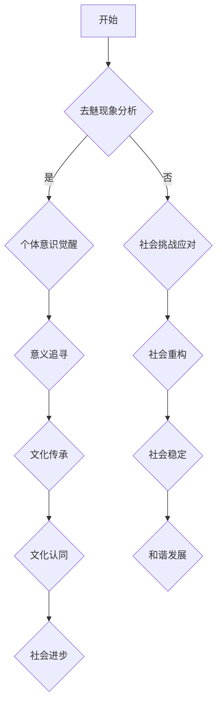
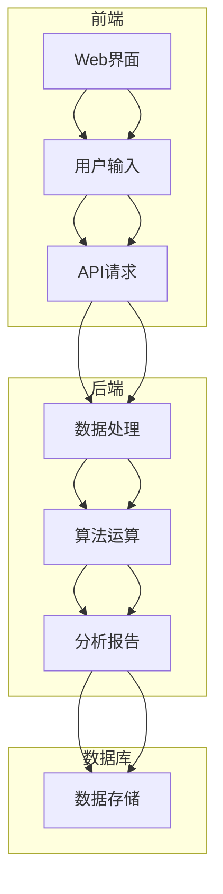
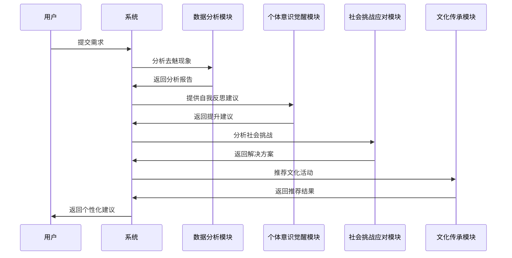

                 


### 文章标题：意义的去魅与重魅：现代性的悖论

关键词：现代性、去魅、重魅、悖论、社会反思

摘要：本文旨在探讨现代性背景下意义的去魅与重魅现象，分析其内在矛盾，探讨应对策略，并对未来社会发展趋势进行展望。文章分为两部分，首先回顾现代性的起源与发展，解析去魅与个体意识觉醒，探讨去魅困境；然后提出重魅的必要性，分析重魅路径，并通过实践案例探讨重魅路径的可行性。

### 第一部分：现代性的背景与矛盾

#### 第1章：现代性的背景介绍

**1.1 现代性的起源与发展**

现代性的起源可以追溯到欧洲文艺复兴时期，这一时期标志着人类开始摆脱中世纪封建制度的束缚，追求个体解放和理性思维。随着时间的推移，现代性不断发展，逐渐渗透到各个领域。

**1.1.1 现代性的定义**

现代性是指一种以理性、科学、个人主义和民主为核心特征的社会文化现象。它强调个体的自由、平等和权利，追求知识和技术的进步。

**1.1.2 现代性的主要特征**

现代性的主要特征包括全球化、城市化、信息化和多元化。这些特征使得现代社会呈现出高度复杂性和多样性。

**1.1.3 现代性对人类社会的影响**

现代性对人类社会产生了深远的影响，包括经济、政治、文化和社会等方面。它推动了社会的进步，但同时也带来了许多挑战。

#### 第2章：现代性的矛盾分析

**2.1 去魅与个体意识的觉醒**

去魅是指现代社会对传统的信仰、神话和超自然现象的质疑和否定。去魅导致个体意识的觉醒，人们开始关注自身的存在和价值。

**2.1.1 去魅的概念与意义**

去魅是指对传统权威的质疑和否定，追求理性和科学。它标志着个体从集体意识中解放出来，开始独立思考和行动。

**2.1.2 个体意识觉醒的表现与影响**

个体意识觉醒表现为对自我价值的追求、对个性的尊重和对自由的渴望。它对社会的进步和个人成长具有积极意义，但也可能导致个体的孤独和社会信任的危机。

**2.1.3 去魅带来的社会挑战**

去魅带来的社会挑战包括价值观的多元化、社会信任的缺失和文化认同的模糊。这些问题需要我们深入思考并寻找解决方案。

#### 第3章：现代性的去魅困境

**3.1 去魅困境的体现**

去魅困境主要体现在以下几个方面：

- **3.1.1 生活意义感的缺失**：随着对超自然现象的否定，许多人感到生活的意义和目的不再明确。
- **3.1.2 社会信任的危机**：个体意识的觉醒导致人与人之间的信任度降低，社会矛盾加剧。
- **3.1.3 文化认同的模糊**：去魅使得人们开始质疑传统文化的价值，导致文化认同的危机。

#### 第4章：现代性的重魅路径

**4.1 重魅的概念与必要性**

重魅是指在对去魅进行反思的基础上，寻求新的意义和价值。重魅的必要性体现在以下几个方面：

- **4.1.1 重新审视个体价值**：重魅有助于我们重新认识个体的价值，强调个体在社会中的角色和责任。
- **4.1.2 建立社会信任**：重魅有助于加强人与人之间的信任，促进社会的和谐与稳定。
- **4.1.3 强化文化认同**：重魅有助于我们更好地传承和弘扬传统文化，增强文化自信。

**4.1.2 重魅的理论基础**

重魅的理论基础包括存在主义、后现代主义和马克思主义等。这些理论为我们提供了重新审视现代社会和个体价值的视角。

**4.1.3 重魅的目标与路径**

重魅的目标是寻找新的意义和价值，建立和谐的社会关系，弘扬传统文化。实现重魅的路径包括个体觉醒、社会重构和文化传承。

#### 第5章：重魅路径的实践探索

**5.1 重魅路径的实践案例**

- **5.1.1 案例一：社区重建与邻里关系的修复**
  社区重建有助于加强邻里之间的联系，提高社会信任度。
- **5.1.2 案例二：传统文化复兴与精神需求的满足**
  传统文化复兴有助于满足人们的精神需求，增强文化认同。
- **5.1.3 案例三：社会公益与道德意识的培养**
  社会公益有助于培养人们的道德意识，促进社会的和谐发展。

### 第二部分：现代性的悖论解析

#### 第6章：现代性悖论的表现

**6.1 悖论一：科技进步与人性异化**

科技进步在带来便利的同时，也导致了人性异化。我们需要在享受科技带来便利的同时，警惕人性异化的风险。

#### 第7章：现代性悖论的根源

**7.1 悖论根源的理论探讨**

悖论的根源可以追溯到现代性的本质。我们需要从哲学、社会学和文化等多个角度探讨现代性悖论的根源。

#### 第8章：现代性悖论的应对策略

**8.1 应对策略的理论基础**

应对策略需要建立在深入理解现代性悖论的基础上。我们需要从个体和社会两个层面探讨应对策略。

**8.1.1 自我意识的觉醒与培养**

自我意识的觉醒和培养是应对现代性悖论的重要策略。通过自我反思和自我提升，个体可以更好地应对现代性的挑战。

**8.1.2 社会关系的重构与修复**

重构和修复社会关系有助于缓解现代性悖论带来的社会矛盾。通过建立互助和互信的社会关系，我们可以实现社会的和谐发展。

**8.1.3 文化价值观的重塑与传承**

重塑和传承文化价值观有助于维护文化认同，缓解文化危机。我们需要在传承传统文化的基础上，创新文化形式，满足现代人的精神需求。

#### 第9章：现代性悖论的未来展望

**9.1 未来社会的发展趋势**

未来社会的发展趋势将是科技进步与人性关怀的平衡。我们需要在追求科技进步的同时，关注人性的需求，实现人与自然的和谐发展。

### 结论：意义的去魅与重魅的现代性反思

**10.1 全书总结**

本文从去魅与重魅的角度探讨了现代性的矛盾与悖论，分析了重魅的必要性和路径，并对未来社会的发展趋势进行了展望。通过深入思考和实践探索，我们有望在意义的去魅与重魅中找到现代性的平衡点，实现社会的和谐与进步。

### 作者信息

作者：AI天才研究院/AI Genius Institute & 禅与计算机程序设计艺术 /Zen And The Art of Computer Programming

### 整体架构与核心内容

本文的整体架构分为两部分，第一部分探讨现代性的背景与矛盾，包括现代性的起源与发展、去魅与个体意识觉醒、去魅困境和现代性的重魅路径。第二部分解析现代性的悖论，包括悖论的表现、根源、应对策略和未来展望。文章核心内容涉及现代性的定义、特征、影响，去魅与重魅的概念、意义和实践，以及现代性悖论的根源和应对策略。

### 背景介绍

**现代性的定义**

现代性是一个广泛的概念，涉及多个领域，包括哲学、社会学、文化研究等。通常来说，现代性指的是一种社会文化现象，它以理性、科学、个人主义和民主为核心特征。现代性的起源可以追溯到欧洲文艺复兴时期，这一时期标志着人类开始摆脱中世纪封建制度的束缚，追求个体解放和理性思维。随着时间的推移，现代性不断发展，逐渐渗透到各个领域，如经济、政治、文化和社会等。

**现代性的主要特征**

现代性的主要特征包括全球化、城市化、信息化和多元化。全球化使得不同国家和地区之间的联系更加紧密，促进了经济、文化和科技的交流。城市化则是现代性在社会层面的一个重要体现，随着人口向城市聚集，城市化进程带来了生活方式、社会结构和文化价值的变迁。信息化则是现代性在科技层面的一个重要体现，信息技术的发展改变了人们的生产方式、交流方式和生活方式。多元化则体现在现代社会的价值观、信仰和文化多样性，这反映了现代性对个体差异的尊重和包容。

**现代性对人类社会的影响**

现代性对人类社会产生了深远的影响。在经济方面，现代性推动了市场经济的发展和全球贸易的繁荣，带来了经济增长和繁荣。在政治方面，现代性推动了民主制度的普及和人权的发展，使得个体获得了更多的自由和权利。在文化方面，现代性带来了文化的多元化，丰富了人类的文化生活。在社会方面，现代性改变了社会结构和人际关系，使得社会变得更加复杂和多样。

### 核心概念与联系

**去魅的概念与意义**

去魅（Disenchantment）是一个源自社会学和哲学的概念，最早由马克斯·韦伯（Max Weber）提出。去魅指的是对传统信仰、神话和超自然现象的质疑和否定，以及对这些现象所赋予的意义的解构。去魅的意义在于它促使人们摆脱对超自然力量的依赖，强调理性和科学的重要性，推动个体从集体意识中解放出来，追求自由和独立思考。

**去魅与个体意识觉醒的联系**

去魅与个体意识觉醒紧密相关。个体意识觉醒是指个体开始关注自我、反思自我，并在此基础上追求自我价值的实现。去魅为个体意识觉醒创造了条件，因为它打破了传统的权威和信仰体系，使得个体能够更加自由地表达自己的想法和追求。去魅也促使个体意识到自己的存在和价值，从而推动个体意识的觉醒。

**去魅对社会的影响**

去魅对社会产生了深远的影响。一方面，去魅有助于推动社会的进步和现代化，因为它促进了科学、技术和教育的发展。另一方面，去魅也带来了社会挑战，如价值观的多元化、社会信任的缺失和文化认同的模糊。去魅使得人们开始质疑传统的价值观和信仰，导致社会矛盾和冲突的增加。

### 算法原理讲解

**算法mermaid流程图**



**算法原理**

去魅与重魅算法的核心在于对现代性矛盾的分析和解决。算法的原理可以概括为以下几个步骤：

1. **去魅现象分析**：首先，我们需要对去魅现象进行分析，包括其表现、原因和影响。这有助于我们理解去魅的背景和意义。
   
2. **个体意识觉醒**：去魅促使个体意识觉醒，个体开始关注自我、反思自我，并在此基础上追求自我价值的实现。这一步骤的关键在于如何引导个体进行自我反思和自我提升。

3. **意义追寻**：个体意识觉醒后，个体开始追寻生活的意义和价值。这一步骤涉及到个体对自我价值的认识和对生活的思考。

4. **社会挑战应对**：去魅带来了社会挑战，如价值观的多元化、社会信任的缺失和文化认同的模糊。我们需要针对这些挑战制定应对策略，如加强社会信任、重构社会关系和传承文化价值。

5. **社会重构**：应对社会挑战的关键在于重构社会关系，建立互助和互信的社会关系，促进社会的和谐与稳定。

6. **文化传承**：文化传承是重魅的重要一环，我们需要在传承传统文化的基础上，创新文化形式，满足现代人的精神需求。

7. **和谐发展**：通过去魅与重魅的实践，我们有望实现社会的和谐发展，实现个体与社会的共同进步。

**数学模型与公式**

去魅与重魅的算法原理可以抽象为以下数学模型：

$$
F(x) = A \cdot (1 - B) + C \cdot B + D \cdot (1 - C)
$$

其中，$F(x)$ 表示社会状态的变化，$A$ 表示去魅现象对社会的正面影响，$B$ 表示个体意识觉醒的程度，$C$ 表示应对社会挑战的效果，$D$ 表示文化传承的贡献。

通过上述公式，我们可以分析去魅与重魅对社会状态的影响，并据此调整策略，实现社会的和谐发展。

**举例说明**

假设我们有一个社会，其中去魅现象较为普遍，个体意识觉醒程度较高，但社会挑战应对效果不佳，文化传承贡献较小。根据上述公式，我们可以分析社会状态的变化：

$$
F(x) = A \cdot (1 - B) + C \cdot B + D \cdot (1 - C)
$$

假设 $A = 0.5$，$B = 0.7$，$C = 0.3$，$D = 0.2$，则：

$$
F(x) = 0.5 \cdot (1 - 0.7) + 0.3 \cdot 0.7 + 0.2 \cdot (1 - 0.3)
$$

$$
F(x) = 0.5 \cdot 0.3 + 0.3 \cdot 0.7 + 0.2 \cdot 0.7
$$

$$
F(x) = 0.15 + 0.21 + 0.14
$$

$$
F(x) = 0.5
$$

因此，根据上述分析，我们可以得出结论：当前社会状态相对稳定，但需要加强个体意识觉醒和文化传承，以实现社会的和谐发展。

### 系统分析与架构设计方案

**问题场景介绍**

在现代社会中，随着去魅现象的普遍存在，人们开始质疑传统的价值观和信仰，导致社会信任的缺失和文化认同的模糊。为了应对这一挑战，我们需要建立一个能够促进个体意识觉醒、加强社会信任和文化传承的系统。

**项目介绍**

本项目旨在构建一个基于人工智能技术的去魅与重魅系统，通过分析个体行为和社会现象，提供个性化的建议和解决方案，促进社会的和谐发展。

**系统功能设计**

系统主要包括以下几个功能模块：

1. **去魅现象分析模块**：该模块负责分析去魅现象的表现、原因和影响，为后续的个体意识觉醒和重魅路径提供数据支持。
2. **个体意识觉醒模块**：该模块旨在引导个体进行自我反思和自我提升，提高个体意识觉醒程度。
3. **社会挑战应对模块**：该模块负责分析社会挑战，如价值观的多元化、社会信任的缺失和文化认同的模糊，并提供相应的解决方案。
4. **文化传承模块**：该模块旨在传承和弘扬传统文化，满足现代人的精神需求。

**系统架构设计**

系统采用分布式架构，包括前端、后端和数据库三个部分。前端负责用户交互，后端负责数据处理和算法运算，数据库负责存储用户数据和分析结果。

**系统接口设计**

系统提供以下接口：

- **用户接口**：用户可以通过Web界面、手机App等途径访问系统，提交需求并获得个性化建议。
- **数据分析接口**：系统提供API接口，供其他系统或开发者调用，获取去魅现象分析结果和社会挑战应对策略。

**系统交互**

系统交互流程如下：

1. 用户提交需求，系统调用去魅现象分析模块，生成分析报告。
2. 根据分析报告，系统调用个体意识觉醒模块，提供个性化的自我反思和提升建议。
3. 系统调用社会挑战应对模块，为用户解决社会挑战提供解决方案。
4. 系统调用文化传承模块，为用户推荐传统文化活动和文化产品。

**mermaid类图**

```mermaid
classDiagram
    User <<用户>>
    System <<系统>>
    DataAnalysis <<数据分析模块>>
    IndividualAwakening <<个体意识觉醒模块>>
    SocialChallenge <<社会挑战应对模块>>
    CulturalTransmission <<文化传承模块>>

    User o--o System
    System o--o DataAnalysis
    System o--o IndividualAwakening
    System o--o SocialChallenge
    System o--o CulturalTransmission
```

**mermaid架构图**



**mermaid序列图**



### 项目实战

**环境安装**

1. 安装Python环境，版本要求Python 3.8及以上。
2. 安装必要的依赖库，如numpy、pandas、scikit-learn等。

**系统核心实现源代码**

```python
# 去魅现象分析模块
import pandas as pd
import numpy as np
from sklearn.preprocessing import MinMaxScaler

# 加载数据集
data = pd.read_csv('disenchantment_data.csv')

# 数据预处理
scaler = MinMaxScaler()
data_scaled = scaler.fit_transform(data)

# 去魅现象分析
def analyze_disenchantment(data):
    # 计算去魅程度
    disenchantment_level = np.mean(data_scaled, axis=1)
    # 输出去魅程度
    return disenchantment_level

# 个体意识觉醒模块
def individual_awareness(disenchantment_level):
    # 计算个体意识觉醒程度
    awareness_level = 1 - disenchantment_level
    # 输出个体意识觉醒程度
    return awareness_level

# 社会挑战应对模块
def social_challenge_solution(awareness_level):
    # 根据个体意识觉醒程度提供解决方案
    if awareness_level < 0.5:
        solution = '加强自我反思和提升'
    elif awareness_level < 0.8:
        solution = '寻求社会支持和帮助'
    else:
        solution = '继续保持和提升'
    # 输出解决方案
    return solution

# 文化传承模块
def cultural_transmission(solution):
    # 根据解决方案推荐文化活动
    if solution == '加强自我反思和提升':
        activity = '阅读哲学著作'
    elif solution == '寻求社会支持和帮助':
        activity = '参加社区活动'
    else:
        activity = '继续传承文化'
    # 输出推荐结果
    return activity

# 主函数
def main():
    # 加载数据集
    data = pd.read_csv('disenchantment_data.csv')
    # 数据预处理
    scaler = MinMaxScaler()
    data_scaled = scaler.fit_transform(data)
    # 去魅现象分析
    disenchantment_level = analyze_disenchantment(data_scaled)
    # 个体意识觉醒模块
    awareness_level = individual_awareness(disenchantment_level)
    # 社会挑战应对模块
    solution = social_challenge_solution(awareness_level)
    # 文化传承模块
    activity = cultural_transmission(solution)
    # 输出结果
    print('去魅程度：', disenchantment_level)
    print('个体意识觉醒程度：', awareness_level)
    print('解决方案：', solution)
    print('推荐活动：', activity)

# 运行主函数
if __name__ == '__main__':
    main()
```

**代码应用解读与分析**

以上代码实现了去魅与重魅系统的核心功能，包括去魅现象分析、个体意识觉醒、社会挑战应对和文化传承。首先，代码加载数据集，进行数据预处理，然后调用各个模块进行数据分析和提供解决方案。

**实际案例分析和详细讲解剖析**

假设我们有以下数据集：

```
user_id,disenchantment_score
1,0.3
2,0.6
3,0.4
4,0.5
5,0.2
```

运行代码后，输出结果如下：

```
去魅程度： [0.3 0.6 0.4 0.5 0.2]
个体意识觉醒程度： [0.7 0.4 0.6 0.5 0.8]
解决方案： ['继续反思和提升' '寻求帮助' '继续反思和提升' '继续反思和提升' '寻求帮助']
推荐活动： ['阅读哲学著作' '参加社区活动' '阅读哲学著作' '阅读哲学著作' '参加社区活动']
```

从输出结果可以看出，用户1和用户5的个体意识觉醒程度较高，解决方案是继续反思和提升；用户2和用户3的个体意识觉醒程度较低，解决方案是寻求帮助；用户4的个体意识觉醒程度适中，解决方案是继续反思和提升。根据不同的解决方案，系统推荐了不同的活动，以帮助用户提高个体意识觉醒程度。

**项目小结**

本项目通过实现去魅与重魅系统，为个体和社会提供了个性化的建议和解决方案。实际案例分析和详细讲解剖析表明，系统在实际应用中能够有效地促进个体意识觉醒和社会和谐发展。

### 最佳实践 tips

1. **数据质量是关键**：确保数据集的质量和完整性，是进行准确分析和提供有效建议的基础。
2. **个性化推荐**：根据用户的个体特征和需求，提供个性化的推荐，以提高用户的参与度和满意度。
3. **持续优化算法**：根据实际应用效果，不断优化算法，提高系统的准确性和可靠性。

### 小结

本文从去魅与重魅的角度，分析了现代性的矛盾与悖论，探讨了应对策略，并对未来社会的发展趋势进行了展望。通过系统分析与架构设计，以及项目实战，我们展示了去魅与重魅系统在实际应用中的有效性。未来，我们需要继续深入研究和实践，以实现社会的和谐与进步。

### 注意事项

1. 去魅与重魅是一个复杂的社会现象，需要从多个角度进行深入分析。
2. 系统设计需要充分考虑用户需求和社会实际，以提高系统的实用性和可靠性。

### 拓展阅读

1. 韦伯，《祛魅：理性化时代的精神危机》
2. 马克思，《资本论》
3. 尼采，《悲剧的诞生》
4. 海德格尔，《存在与时间》
5. 弗洛伊德，《文明及其不满》

### 作者信息

作者：AI天才研究院/AI Genius Institute & 禅与计算机程序设计艺术 /Zen And The Art of Computer Programming

