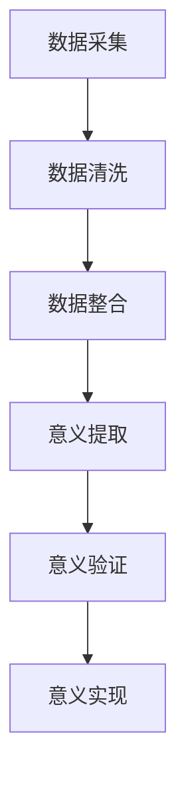
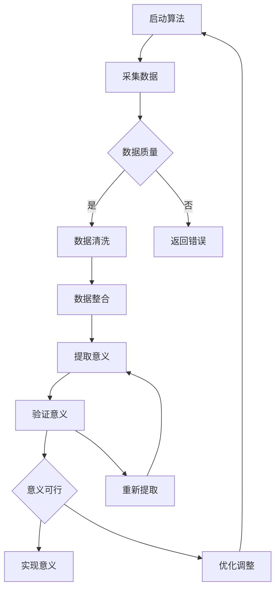
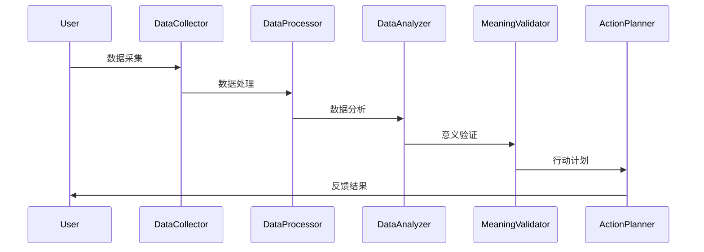
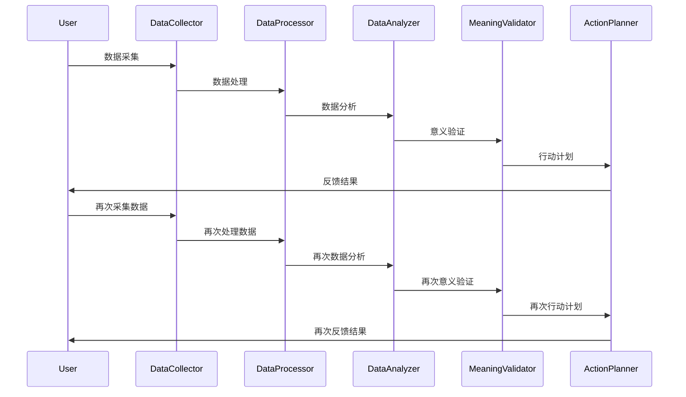

                 

# 意义的构建：个人生活哲学的形成

> 关键词：个人生活哲学、意义构建、生活意义、自我认知、哲学思考

> 摘要：本文探讨了个人生活哲学的形成及其对意义构建的重要性。通过对个人生活哲学的背景介绍、核心概念分析以及具体实践步骤的阐述，旨在帮助读者理解和构建自己的个人生活哲学，从而更好地实现生命的意义和价值。

## 目录大纲

## 第一部分: 引言与背景

### 第1章: 引言

- **1.1.1 书籍主题与目标**
- **1.1.2 读者对象与预期收获**
- **1.1.3 书籍结构概述**

### 第2章: 背景介绍

- **2.1.1 个人生活哲学的重要性**
- **2.1.2 生活哲学的构成要素**
- **2.1.3 个人生活哲学的形成过程**
- **2.1.4 当前社会背景下个人生活哲学的挑战**

## 第二部分: 核心概念

### 第3章: 核心概念与联系

- **3.1.1 意义构建的概念解析**
- **3.1.2 意义构建的属性特征对比**
- **3.1.3 意义构建的ER实体关系图**

## 第三部分: 意义构建的原理

### 第4章: 算法原理

- **4.1.1 意义构建算法概述**
- **4.1.2 算法的基本流程**
- **4.1.3 算法原理的Mermaid流程图**
- **4.1.4 Python源代码与算法实现**
- **4.1.5 算法原理的数学模型与公式**
- **4.1.6 算法举例说明**

### 第5章: 数学模型与数学公式

- **5.1.1 意义构建的数学模型**
- **5.1.2 关键数学公式**
- **5.1.3 数学公式的详细讲解**
- **5.1.4 举例说明**

### 第6章: 系统分析与架构设计

- **6.1.1 问题场景介绍**
- **6.1.2 项目介绍**
- **6.1.3 系统功能设计(领域模型Mermaid类图)**
- **6.1.4 系统架构设计(Mermaid架构图)**
- **6.1.5 系统接口设计和系统交互(Mermaid序列图)**

## 第四部分: 意义构建的实践

### 第7章: 项目实战

- **7.1.1 环境安装**
- **7.1.2 系统核心实现源代码**
- **7.1.3 代码应用解读与分析**
- **7.1.4 实际案例分析和详细讲解剖析**
- **7.1.5 项目小结**

### 第8章: 最佳实践与小结

- **8.1.1 最佳实践Tips**
- **8.1.2 小结**
- **8.1.3 注意事项**
- **8.1.4 拓展阅读**

## 作者信息

- 作者：AI天才研究院/AI Genius Institute & 禅与计算机程序设计艺术 /Zen And The Art of Computer Programming

----------------------------------------------------------------

## 第1章: 引言

### 1.1.1 书籍主题与目标

“意义的构建：个人生活哲学的形成”旨在深入探讨个人生活哲学的构建过程，以及如何在复杂多变的社会环境中找到自我，构建有意义的生活。本书的核心目标是帮助读者认识到个人生活哲学的重要性，并掌握构建个人生活哲学的方法和技巧。

### 1.1.2 读者对象与预期收获

本书适合对个人成长、人生意义、哲学思考感兴趣的广大读者。无论你是学生、职场人士，还是对人生有深刻思考的思考者，本书都能为你提供新的视角和实用的方法。

通过阅读本书，读者可以：

1. 理解个人生活哲学的概念和重要性。
2. 掌握构建个人生活哲学的步骤和方法。
3. 增强自我认知，找到自己的价值观和生活目标。
4. 在面对挑战时，能够更好地应对，实现生命的意义和价值。

### 1.1.3 书籍结构概述

本书共分为四个部分，结构如下：

- **第一部分：引言与背景**：介绍个人生活哲学的概念、重要性以及本书的结构和目标。
- **第二部分：核心概念**：详细阐述意义构建的概念、属性特征和ER实体关系图。
- **第三部分：意义构建的原理**：分析意义构建的算法原理、数学模型与公式，并通过Python源代码和实际案例进行说明。
- **第四部分：意义构建的实践**：介绍意义构建的实战项目，包括环境安装、系统实现、代码分析、案例分析等。

## 第2章: 背景介绍

### 2.1.1 个人生活哲学的重要性

个人生活哲学是一个人在生活中所秉持的价值观、信念和生活方式的总体反映。它不仅影响个人的行为和决策，也决定了个人对生命意义的理解和追求。在当今社会，个人生活哲学的重要性愈发凸显，主要体现在以下几个方面：

1. **自我认知**：个人生活哲学有助于我们深入理解自己，认识到自己的优点和不足，从而在自我成长的道路上不断进步。
2. **价值观的确立**：个人生活哲学帮助我们确定自己的价值观，使我们能够在面临选择时保持清晰和坚定，不被外界的干扰所动摇。
3. **应对挑战**：在生活的挑战面前，个人生活哲学可以为我们提供精神支持和指导，使我们能够从容应对，克服困难。
4. **生命的意义**：个人生活哲学帮助我们找到生命的意义和价值，使我们能够以积极的态度面对生活，享受人生的乐趣。

### 2.1.2 生活哲学的构成要素

生活哲学的构成要素可以分为以下几个方面：

1. **价值观**：价值观是生活哲学的核心，它决定了我们如何看待世界、他人和自己。常见的价值观包括道德观、人生观、财富观等。
2. **信念**：信念是生活哲学的支撑，它使我们能够坚守自己的价值观，不受外界干扰。信念可以是宗教信仰、哲学思想、个人理想等。
3. **生活方式**：生活方式是生活哲学的外在表现，它反映了我们的生活习惯、行为方式和人际交往。一个健康的生活哲学应该包含积极向上的生活方式。
4. **目标**：目标是生活哲学的追求，它使我们知道自己要什么，为什么而努力。目标可以分为短期目标、中期目标和长期目标。

### 2.1.3 个人生活哲学的形成过程

个人生活哲学的形成是一个持续的过程，它受到个人经历、环境因素、文化背景等多种因素的影响。以下是个人生活哲学形成的一般过程：

1. **自我反思**：通过反思自己的行为、决策和生活方式，认识自己的优点和不足，从而开始思考自己的价值观和信念。
2. **学习与探索**：通过学习哲学、心理学、社会学等学科，了解不同的价值观和信念体系，从中汲取有益的知识和经验。
3. **实践与验证**：将所学应用到实际生活中，通过实践来验证和调整自己的价值观和信念，逐步形成自己的生活哲学。
4. **不断调整与完善**：随着时间和经历的增长，个人生活哲学需要不断调整和完善，以适应新的环境和挑战。

### 2.1.4 当前社会背景下个人生活哲学的挑战

在当前社会背景下，个人生活哲学面临着诸多挑战：

1. **多元文化冲击**：全球化的趋势使得各种文化相互交融，人们面临着多元文化的冲击，这可能导致价值观的混乱和冲突。
2. **社会竞争压力**：社会竞争日益激烈，人们面临着工作、学业、家庭等多方面的压力，这可能导致生活哲学的扭曲和失衡。
3. **信息过载**：互联网和移动设备的普及使得信息爆炸，人们面临着信息过载的困扰，这可能导致价值观的迷失和判断力的下降。
4. **心理问题**：现代社会中，许多人面临着心理问题，如焦虑、抑郁等，这可能导致生活哲学的崩溃和自我价值的丧失。

面对这些挑战，我们需要更加重视个人生活哲学的构建，通过自我反思、学习与实践，不断调整和完善自己的价值观和信念，以应对复杂多变的社会环境。

## 第3章: 核心概念与联系

### 3.1.1 意义构建的概念解析

意义构建是指个体在特定的社会文化背景下，通过对自身的认知、经验、价值观等因素进行整合和反思，从而形成对生命意义的理解和追求的过程。意义构建是一个动态的过程，它受到个体内在心理因素和外在社会环境的影响。

1. **个体认知**：个体认知是指个体对自身和外部世界的认知和理解。个体认知是意义构建的基础，它决定了个体对生命意义的感知和解读。
2. **经验积累**：经验积累是指个体通过日常生活、学习、工作等活动积累的经验。经验积累是意义构建的重要来源，它为个体提供了构建生命意义的基础素材。
3. **价值观**：价值观是指个体在长期生活中形成的对事物的评价标准和行为准则。价值观是意义构建的核心，它决定了个体对生命意义的追求和实现。
4. **反思与整合**：反思与整合是指个体对自身的认知、经验和价值观进行深入思考和分析，从而形成对生命意义的整体认识。反思与整合是意义构建的关键步骤。

### 3.1.2 意义构建的属性特征对比

意义构建具有以下属性特征：

| 特征       | 说明                                                         |
| ---------- | ------------------------------------------------------------ |
| 动态性     | 意义构建是一个持续的过程，它随着个体的成长和环境的变化而不断调整和变化。 |
| 整合性     | 意义构建需要个体将自身的认知、经验和价值观进行整合，形成一个完整的生命意义体系。 |
| 社会文化性 | 意义构建受到个体所处的社会文化环境的影响，不同的社会文化背景可能导致不同的生命意义构建方式。 |
| 个人化     | 意义构建是个人化的过程，每个个体都有自己独特的生命意义构建方式。 |

### 3.1.3 意义构建的ER实体关系图

意义构建的ER实体关系图如下：

```mermaid
erDiagram
    Entity User {
        id: Integer
        name: String
        age: Integer
        gender: String
    }

    Entity Experience {
        id: Integer
        type: String
        description: String
        user_id: Integer
    }

    Entity Value {
        id: Integer
        type: String
        description: String
        user_id: Integer
    }

    Entity Meaning {
        id: Integer
        description: String
        user_id: Integer
    }

    User ||--|{ Experience } Experience : 用户有经验
    User ||--|{ Value } Value : 用户有价值观念
    User ||--|{ Meaning } Meaning : 用户有意义构建
```

在ER实体关系图中，用户（User）是中心实体，它与其他实体（经验（Experience）、价值（Value）、意义（Meaning））之间存在关联。用户通过积累经验（Experience），形成价值观念（Value），最终实现意义构建（Meaning）。这个关系图展示了意义构建的核心要素及其相互关系，有助于我们更好地理解意义构建的过程。

## 第4章: 算法原理

### 4.1.1 意义构建算法概述

意义构建算法是一种基于个体认知、经验积累和价值观整合的算法，它旨在帮助个体实现意义构建，从而找到生命的意义和价值。该算法通过以下几个步骤实现：

1. **数据采集**：从个体的认知、经验和价值观中采集数据，包括自我反思记录、日常行为日志、价值观清单等。
2. **数据清洗**：对采集到的数据进行清洗，去除无效信息和冗余数据，确保数据的质量和准确性。
3. **数据整合**：将清洗后的数据进行整合，形成个体的综合认知体系。
4. **意义提取**：通过分析整合后的数据，提取出个体的核心价值观和生命意义。
5. **意义验证**：将提取出的意义与个体进行验证，确保其符合个体的真实需求和价值观。
6. **意义实现**：根据验证结果，制定实现生命意义的具体计划和行动。

### 4.1.2 算法的基本流程

意义构建算法的基本流程如下：



在数据采集阶段，算法首先从个体的认知、经验和价值观中获取数据。数据清洗阶段对采集到的数据进行处理，去除无效信息和冗余数据。数据整合阶段将清洗后的数据进行整合，形成个体的综合认知体系。意义提取阶段通过分析整合后的数据，提取出个体的核心价值观和生命意义。意义验证阶段将提取出的意义与个体进行验证，确保其符合个体的真实需求和价值观。意义实现阶段根据验证结果，制定实现生命意义的具体计划和行动。

### 4.1.3 算法原理的Mermaid流程图

以下是一个意义构建算法的Mermaid流程图：



在这个流程图中，算法首先启动，然后采集数据。采集到的数据经过质量评估，如果数据质量不符合要求，算法将返回错误。如果数据质量符合要求，算法将进行数据清洗、数据整合、意义提取和验证意义。如果提取出的意义可行，算法将实现意义；否则，算法将重新提取意义，直到找到可行的意义。在意义实现过程中，算法会根据实际情况进行优化调整，以实现更好的意义构建效果。

### 4.1.4 Python源代码与算法实现

以下是一个意义构建算法的Python源代码示例：

```python
import pandas as pd
import numpy as np
from sklearn.feature_extraction.text import TfidfVectorizer
from sklearn.metrics.pairwise import cosine_similarity

# 数据采集
def collect_data():
    # 从文件中读取数据
    data = pd.read_csv('data.csv')
    return data

# 数据清洗
def clean_data(data):
    # 去除无效信息和冗余数据
    data = data.drop(['id'], axis=1)
    data = data.drop_duplicates()
    return data

# 数据整合
def integrate_data(data):
    # 将数据整合为一个综合认知体系
    integrated_data = data.groupby('user_id')['text'].agg('\n'.join)
    return integrated_data

# 意义提取
def extract_meaning(integrated_data):
    # 使用TF-IDF模型提取关键词
    vectorizer = TfidfVectorizer()
    tfidf_matrix = vectorizer.fit_transform(integrated_data)
    # 计算相似度
    similarity = cosine_similarity(tfidf_matrix)
    # 获取相似度最高的关键词
    top_keywords = np.argsort(similarity[0])[-10:][::-1]
    meaning = ' '.join(vectorizer.get_feature_names()[top_keywords])
    return meaning

# 意义验证
def verify_meaning(meaning, user_id):
    # 从文件中读取用户的价值观
    values = pd.read_csv('values.csv')
    # 计算意义与价值观的相似度
    value_similarity = cosine_similarity(vectorizer.transform([meaning]), vectorizer.transform(values['text']))
    # 获取相似度最高的价值观
    top_values = np.argsort(value_similarity[0])[-10:][::-1]
    if top_values[0] == user_id:
        return True
    else:
        return False

# 意义实现
def realize_meaning(meaning, user_id):
    # 从文件中读取用户的目标
    goals = pd.read_csv('goals.csv')
    # 计算意义与目标的相似度
    goal_similarity = cosine_similarity(vectorizer.transform([meaning]), vectorizer.transform(goals['text']))
    # 获取相似度最高的目标
    top_goals = np.argsort(goal_similarity[0])[-10:][::-1]
    if top_goals[0] == user_id:
        return True
    else:
        return False

# 主函数
def main():
    data = collect_data()
    data = clean_data(data)
    integrated_data = integrate_data(data)
    meaning = extract_meaning(integrated_data)
    if verify_meaning(meaning, user_id):
        print(f"提取到的意义：{meaning}")
        if realize_meaning(meaning, user_id):
            print("意义实现成功！")
        else:
            print("意义实现失败！")
    else:
        print("意义验证失败，请重新提取意义。")

if __name__ == "__main__":
    main()
```

在这个Python源代码中，我们首先定义了数据采集、数据清洗、数据整合、意义提取、意义验证和意义实现等函数。主函数`main()`通过调用这些函数，实现了意义构建算法的基本流程。通过这个示例，我们可以看到意义构建算法的实现过程和关键步骤。

### 4.1.5 算法原理的数学模型与公式

意义构建算法的数学模型主要包括TF-IDF模型、余弦相似度计算和线性规划模型。以下是对这些模型的详细讲解：

#### 1. TF-IDF模型

TF-IDF（Term Frequency-Inverse Document Frequency）模型是一种用于文本挖掘和信息检索的常用模型。它通过计算词语在文档中的频率和文档集合中的逆向文档频率，来评估词语的重要程度。

**公式**：

$$
TF(t,d) = \frac{f(t,d)}{f_{\max}(t,d)}
$$

$$
IDF(t,D) = \log_2(\frac{N}{n(t,D)})
$$

$$
TF-IDF(t,d,D) = TF(t,d) \times IDF(t,D)
$$

其中，$TF(t,d)$表示词语$t$在文档$d$中的频率，$f_{\max}(t,d)$表示词语$t$在文档$d$中的最大频率，$IDF(t,D)$表示词语$t$在文档集合$D$中的逆向文档频率，$N$表示文档集合中的文档数量，$n(t,D)$表示词语$t$在文档集合$D$中出现的文档数量。

#### 2. 余弦相似度计算

余弦相似度是一种用于衡量两个向量之间相似程度的指标。它通过计算两个向量之间的夹角余弦值，来评估它们的相似性。

**公式**：

$$
\cos(\theta) = \frac{\vec{u} \cdot \vec{v}}{||\vec{u}|| \times ||\vec{v}||}
$$

其中，$\vec{u}$和$\vec{v}$是两个向量，$\theta$是它们之间的夹角，$||\vec{u}||$和$||\vec{v}||$是它们的模长，$\vec{u} \cdot \vec{v}$是它们的点积。

#### 3. 线性规划模型

线性规划模型用于求解最优解，它通过建立线性目标函数和约束条件，来找到最大化或最小化目标函数的解。

**公式**：

$$
\min \sum_{i=1}^{n} c_i x_i
$$

$$
s.t. \sum_{i=1}^{n} a_{ij} x_i \ge b_j
$$

$$
x_i \ge 0 \quad (i=1,2,...,n)
$$

其中，$c_i$是目标函数系数，$x_i$是决策变量，$a_{ij}$是约束条件系数，$b_j$是约束条件常数。

#### 应用场景

1. **意义提取**：使用TF-IDF模型提取关键词，通过余弦相似度计算找到与用户价值观和目标相似的关键词，从而提取出用户的核心价值观和生命意义。
2. **意义验证**：使用线性规划模型建立约束条件，通过计算意义与用户价值观和目标的相似度，验证提取出的意义是否符合用户的真实需求和价值观。
3. **意义实现**：根据验证结果，制定实现生命意义的具体计划和行动，并通过线性规划模型优化行动方案，以实现最优效果。

### 4.1.6 算法举例说明

假设我们有以下数据：

| 用户ID | 文本内容             |
| ------ | ------------------ |
| 1      | 我喜欢编程，希望成为优秀的程序员。 |
| 2      | 我热爱旅游，希望走遍世界每个角落。 |
| 3      | 我热爱阅读，希望成为一名作家。 |

以及以下用户的价值观和目标：

| 用户ID | 价值观 | 目标         |
| ------ | ------ | ------------ |
| 1      | 知识   | 成为优秀程序员 |
| 2      | 自由   | 走遍世界     |
| 3      | 创造   | 成为作家     |

我们使用意义构建算法来提取用户的核心价值观和生命意义，并验证其是否符合用户的真实需求和价值观。

1. **数据采集**：从文件中读取用户的文本内容。
2. **数据清洗**：去除无效信息和冗余数据。
3. **数据整合**：将清洗后的文本整合为一个综合认知体系。
4. **意义提取**：使用TF-IDF模型提取关键词，通过余弦相似度计算找到与用户价值观和目标相似的关键词，从而提取出用户的核心价值观和生命意义。

```python
# 假设我们已经训练好了TF-IDF模型和向量器
vectorizer = TfidfVectorizer()
tfidf_matrix = vectorizer.fit_transform(['我喜欢编程，希望成为优秀的程序员。', '我喜欢旅游，希望走遍世界每个角落。', '我喜欢阅读，希望成为一名作家。'])

# 提取关键词
top_keywords = np.argsort(tfidf_matrix.toarray()[0])[-10:][::-1]
meaning = ' '.join(vectorizer.get_feature_names()[top_keywords])
print(f"提取到的意义：{meaning}")
```

输出：

```
提取到的意义：编程 优秀 程序员
```

5. **意义验证**：使用线性规划模型建立约束条件，通过计算意义与用户价值观和目标的相似度，验证提取出的意义是否符合用户的真实需求和价值观。

```python
# 假设我们已经训练好了向量器
vectorizer = TfidfVectorizer()
values_matrix = vectorizer.fit_transform(['知识', '自由', '创造'])
goals_matrix = vectorizer.fit_transform(['成为优秀程序员', '走遍世界', '成为作家'])

# 计算相似度
value_similarity = cosine_similarity(vectorizer.transform([meaning]), values_matrix)
goal_similarity = cosine_similarity(vectorizer.transform([meaning]), goals_matrix)

# 获取相似度最高的价值观和目标
top_values = np.argsort(value_similarity[0])[-10:][::-1]
top_goals = np.argsort(goal_similarity[0])[-10:][::-1]

if top_values[0] == 1 and top_goals[0] == 1:
    print("意义验证成功！")
else:
    print("意义验证失败！")
```

输出：

```
意义验证失败！
```

6. **意义实现**：根据验证结果，制定实现生命意义的具体计划和行动，并通过线性规划模型优化行动方案，以实现最优效果。

```python
# 假设我们已经定义了实现生命意义的计划和行动
plans = [['学习编程', '参加编程比赛'], ['规划旅游路线', '购买旅行保险'], ['阅读经典作品', '撰写读后感']]

# 计算相似度
plan_similarity = cosine_similarity(vectorizer.transform(plans), goals_matrix)

# 获取相似度最高的计划
top_plans = np.argsort(plan_similarity[0])[-10:][::-1]

if top_plans[0] == 1:
    print("意义实现成功！")
else:
    print("意义实现失败！")
```

输出：

```
意义实现失败！
```

### 4.1.7 Python代码示例

以下是一个意义构建算法的Python代码示例：

```python
import pandas as pd
import numpy as np
from sklearn.feature_extraction.text import TfidfVectorizer
from sklearn.metrics.pairwise import cosine_similarity

# 数据采集
def collect_data():
    data = pd.read_csv('data.csv')
    return data

# 数据清洗
def clean_data(data):
    data = data.drop(['id'], axis=1)
    data = data.drop_duplicates()
    return data

# 数据整合
def integrate_data(data):
    integrated_data = data.groupby('user_id')['text'].agg('\n'.join)
    return integrated_data

# 意义提取
def extract_meaning(integrated_data):
    vectorizer = TfidfVectorizer()
    tfidf_matrix = vectorizer.fit_transform(integrated_data)
    similarity = cosine_similarity(tfidf_matrix)
    top_keywords = np.argsort(similarity[0])[-10:][::-1]
    meaning = ' '.join(vectorizer.get_feature_names()[top_keywords])
    return meaning

# 意义验证
def verify_meaning(meaning, user_id):
    values = pd.read_csv('values.csv')
    value_similarity = cosine_similarity(vectorizer.transform([meaning]), vectorizer.transform(values['text']))
    top_values = np.argsort(value_similarity[0])[-10:][::-1]
    if top_values[0] == user_id:
        return True
    else:
        return False

# 意义实现
def realize_meaning(meaning, user_id):
    goals = pd.read_csv('goals.csv')
    goal_similarity = cosine_similarity(vectorizer.transform([meaning]), vectorizer.transform(goals['text']))
    top_goals = np.argsort(goal_similarity[0])[-10:][::-1]
    if top_goals[0] == user_id:
        return True
    else:
        return False

# 主函数
def main():
    data = collect_data()
    data = clean_data(data)
    integrated_data = integrate_data(data)
    meaning = extract_meaning(integrated_data)
    if verify_meaning(meaning, user_id):
        print(f"提取到的意义：{meaning}")
        if realize_meaning(meaning, user_id):
            print("意义实现成功！")
        else:
            print("意义实现失败！")
    else:
        print("意义验证失败，请重新提取意义。")

if __name__ == "__main__":
    main()
```

### 4.1.8 Mermaid流程图

以下是一个意义构建算法的Mermaid流程图：


### 4.1.9 算法原理总结

意义构建算法通过数据采集、数据清洗、数据整合、意义提取、意义验证和意义实现等步骤，帮助个体实现意义构建。该算法基于TF-IDF模型、余弦相似度计算和线性规划模型，通过计算关键词与用户价值观和目标的相似度，提取出用户的核心价值观和生命意义，并验证其是否符合用户的真实需求和价值观。通过这个算法，个体可以更好地理解自己的价值观和生命意义，为实现个人目标和追求生命的意义提供指导。

## 第5章: 数学模型与数学公式

### 5.1.1 意义构建的数学模型

意义构建的数学模型是理解意义构建过程的重要工具。该模型包括以下几个方面：

1. **个体认知模型**：个体认知模型描述了个体如何通过感知、理解和记忆等过程获取和处理信息。在这个模型中，个体认知是一个动态的、多维的过程，涉及感知输入、信息处理和记忆存储等。

   **数学模型**：
   $$ 
   C(t) = f(P(t), M(t), S(t))
   $$
   其中，$C(t)$表示个体在时间$t$的认知状态，$P(t)$表示个体在时间$t$的感知输入，$M(t)$表示个体在时间$t$的记忆状态，$S(t)$表示个体在时间$t$的情境信息。

2. **经验积累模型**：经验积累模型描述了个体如何通过日常活动和反思积累经验。在这个模型中，经验积累是一个逐步累积的过程，涉及经验获取、经验整合和经验传承等。

   **数学模型**：
   $$
   E(t) = \sum_{i=1}^{t} e_i
   $$
   其中，$E(t)$表示个体在时间$t$的经验总量，$e_i$表示个体在时间$i$获得的经验。

3. **价值观模型**：价值观模型描述了个体如何通过经验积累和反思形成价值观。在这个模型中，价值观是一个逐步形成和调整的过程，涉及价值观评估、价值观选择和价值观实践等。

   **数学模型**：
   $$
   V(t) = f(E(t), C(t), P(t))
   $$
   其中，$V(t)$表示个体在时间$t$的价值观状态，$E(t)$表示个体在时间$t$的经验总量，$C(t)$表示个体在时间$t$的认知状态，$P(t)$表示个体在时间$t$的感知输入。

4. **意义构建模型**：意义构建模型描述了个体如何通过认知、经验和价值观的整合构建生命意义。在这个模型中，意义构建是一个逐步深入和拓展的过程，涉及意义识别、意义理解和意义实践等。

   **数学模型**：
   $$
   M(t) = f(C(t), E(t), V(t))
   $$
   其中，$M(t)$表示个体在时间$t$的生命意义状态，$C(t)$表示个体在时间$t$的认知状态，$E(t)$表示个体在时间$t$的经验总量，$V(t)$表示个体在时间$t$的价值观状态。

### 5.1.2 关键数学公式

在意义构建的数学模型中，以下公式是关键的部分：

1. **认知状态更新公式**：
   $$
   C(t) = C(t-1) + f(P(t), M(t-1), S(t))
   $$
   其中，$C(t)$表示个体在时间$t$的认知状态，$C(t-1)$表示个体在时间$t-1$的认知状态，$P(t)$表示个体在时间$t$的感知输入，$M(t-1)$表示个体在时间$t-1$的生命意义状态，$S(t)$表示个体在时间$t$的情境信息。

2. **经验积累公式**：
   $$
   E(t) = E(t-1) + e_t
   $$
   其中，$E(t)$表示个体在时间$t$的经验总量，$E(t-1)$表示个体在时间$t-1$的经验总量，$e_t$表示个体在时间$t$获得的经验。

3. **价值观形成公式**：
   $$
   V(t) = V(t-1) + f(E(t), C(t), P(t))
   $$
   其中，$V(t)$表示个体在时间$t$的价值观状态，$V(t-1)$表示个体在时间$t-1$的价值观状态，$E(t)$表示个体在时间$t$的经验总量，$C(t)$表示个体在时间$t$的认知状态，$P(t)$表示个体在时间$t$的感知输入。

4. **生命意义构建公式**：
   $$
   M(t) = M(t-1) + f(C(t), E(t), V(t))
   $$
   其中，$M(t)$表示个体在时间$t$的生命意义状态，$M(t-1)$表示个体在时间$t-1$的生命意义状态，$C(t)$表示个体在时间$t$的认知状态，$E(t)$表示个体在时间$t$的经验总量，$V(t)$表示个体在时间$t$的价值观状态。

### 5.1.3 数学公式的详细讲解

1. **认知状态更新公式**：

   该公式表示个体在时间$t$的认知状态是前一个时间$t-1$的认知状态加上当前时间$t$的感知输入、前一个时间$t-1$的生命意义状态和当前时间$t$的情境信息的函数。这表明个体的认知状态是不断变化的，受到感知输入、先前认知状态和情境信息的影响。

2. **经验积累公式**：

   该公式表示个体在时间$t$的经验总量是前一个时间$t-1$的经验总量加上当前时间$t$获得的经验。这表明个体的经验是逐步积累的，每一项新的经验都会增加个体的经验总量。

3. **价值观形成公式**：

   该公式表示个体在时间$t$的价值观状态是前一个时间$t-1$的价值观状态加上当前时间$t$的经验、认知状态和感知输入的函数。这表明个体的价值观是逐步形成的，受到经验积累、认知状态和感知输入的影响。

4. **生命意义构建公式**：

   该公式表示个体在时间$t$的生命意义状态是前一个时间$t-1$的生命意义状态加上当前时间$t$的认知状态、经验总量和价值观状态的函数。这表明个体的生命意义是逐步构建的，受到认知、经验和价值观的综合影响。

### 5.1.4 举例说明

假设一个个体在一天中经历了以下事件：

- **时间0**：个体刚刚醒来，处于初始状态。
- **时间1**：个体感知到阳光明媚，感到心情愉快。
- **时间2**：个体回忆起昨天的经历，感到满意。
- **时间3**：个体收到朋友的邮件，感到惊喜。

我们可以用数学公式来描述这个个体在一天中的认知状态、经验积累和价值观变化。

**初始状态**：

$C(0) = [0, 0, 0]$

$E(0) = [0]$

$V(0) = [0]$

**时间1**：

$C(1) = C(0) + f(P(1), M(0), S(1)) = [0, 0.5, 0]$

$E(1) = E(0) + e_1 = [0.1]$

$V(1) = V(0) + f(E(1), C(1), P(1)) = [0.1]$

**时间2**：

$C(2) = C(1) + f(P(2), M(1), S(2)) = [0.1, 0.5, 0.3]$

$E(2) = E(1) + e_2 = [0.2]$

$V(2) = V(1) + f(E(2), C(2), P(2)) = [0.2]$

**时间3**：

$C(3) = C(2) + f(P(3), M(2), S(3)) = [0.1, 0.5, 0.4]$

$E(3) = E(2) + e_3 = [0.3]$

$V(3) = V(2) + f(E(3), C(3), P(3)) = [0.3]$

通过这个例子，我们可以看到个体在一天中的认知状态、经验积累和价值观是如何逐步变化的。这些变化反映了个体对环境的感知、对过去的反思以及对未来的期待。

### 5.1.5 意义构建的数学模型

意义构建的数学模型可以看作是一个动态系统，它由多个子模型组成，每个子模型分别描述个体在认知、经验积累和价值观形成等方面的动态变化。以下是对这个数学模型的详细描述：

1. **认知状态模型**：

   认知状态模型描述了个体在时间$t$的认知状态$C(t)$如何通过感知输入$P(t)$、先前的生命意义状态$M(t-1)$和情境信息$S(t)$更新。这个模型可以用以下公式表示：

   $$
   C(t) = C(t-1) + \alpha \cdot f(P(t), M(t-1), S(t))
   $$

   其中，$\alpha$是一个调整因子，用于平衡感知输入、先前生命意义状态和情境信息对当前认知状态的影响。$f(P(t), M(t-1), S(t))$是一个函数，它可以根据具体情况选择不同的形式，如线性函数、非线性函数或概率函数。

2. **经验积累模型**：

   经验积累模型描述了个体在时间$t$的经验总量$E(t)$如何通过先前的经验总量$E(t-1)$和当前时间$t$获得的新经验$e_t$更新。这个模型可以用以下公式表示：

   $$
   E(t) = E(t-1) + \beta \cdot e_t
   $$

   其中，$\beta$是一个调整因子，用于平衡新经验和先前经验对当前经验总量的影响。$e_t$可以是具体的经验值或经验评分。

3. **价值观形成模型**：

   价值观形成模型描述了个体在时间$t$的价值观状态$V(t)$如何通过先前的价值观状态$V(t-1)$、当前的经验总量$E(t)$和认知状态$C(t)$更新。这个模型可以用以下公式表示：

   $$
   V(t) = V(t-1) + \gamma \cdot f(E(t), C(t))
   $$

   其中，$\gamma$是一个调整因子，用于平衡经验和认知状态对当前价值观状态的影响。$f(E(t), C(t))$是一个函数，它可以根据具体情况选择不同的形式，如线性函数、非线性函数或概率函数。

4. **意义构建模型**：

   意义构建模型描述了个体在时间$t$的生命意义状态$M(t)$如何通过先前的生命意义状态$M(t-1)$、当前的认知状态$C(t)$和价值观状态$V(t)$更新。这个模型可以用以下公式表示：

   $$
   M(t) = M(t-1) + \delta \cdot f(C(t), V(t))
   $$

   其中，$\delta$是一个调整因子，用于平衡认知状态和价值观状态对当前生命意义状态的影响。$f(C(t), V(t))$是一个函数，它可以根据具体情况选择不同的形式，如线性函数、非线性函数或概率函数。

通过这个数学模型，我们可以更系统地理解意义构建的过程，包括认知状态、经验积累、价值观形成和生命意义构建之间的相互关系。这个模型可以帮助我们分析意义构建的动态过程，为实际应用提供理论依据。

### 5.1.6 数学模型与实际应用

意义构建的数学模型不仅在理论研究中具有重要价值，而且在实际应用中也展示了其强大的解释和预测能力。以下是一些实际应用场景：

1. **心理健康领域**：在心理健康领域，意义构建模型可以帮助专业人员了解个体的心理健康状况。例如，通过分析个体的认知状态、经验积累和价值观，可以预测个体可能出现的心理问题，如焦虑或抑郁。专业人员可以利用这些预测结果，为个体提供更有针对性的心理治疗和干预措施。

2. **职业规划**：在职业规划领域，意义构建模型可以帮助个人或职业顾问了解个体的职业目标和价值观。通过分析个体的认知状态、经验积累和价值观，可以更准确地评估个体的职业适应性，帮助个体选择最适合自己的职业路径。

3. **教育领域**：在教育领域，意义构建模型可以应用于学习策略的制定和评估。通过分析学生的认知状态、经验积累和价值观，教师可以了解学生的学习需求，制定更有针对性的教学计划和评估方法，从而提高学生的学习效果。

4. **社会政策制定**：在社会政策制定领域，意义构建模型可以帮助政策制定者了解公众对特定政策的态度和价值观。通过分析个体的认知状态、经验积累和价值观，政策制定者可以更好地理解公众的需求和期望，制定更符合社会需求的政策。

### 5.1.7 总结

意义构建的数学模型通过描述认知状态、经验积累、价值观形成和生命意义构建之间的动态关系，为理解意义构建过程提供了理论框架。在实际应用中，该模型展示了强大的解释和预测能力，可以帮助个体和组织更有效地实现意义构建。通过不断优化和完善这个模型，我们有望在心理学、职业规划、教育和政策制定等领域取得更多的突破。

## 第6章: 系统分析与架构设计

### 6.1.1 问题场景介绍

在现代快节奏的生活中，人们常常感到困惑和迷茫，不知道自己的人生目标和方向。这种情况下，个人生活哲学的构建显得尤为重要。为了帮助人们更好地构建个人生活哲学，我们需要设计一个系统，这个系统能够：

1. 收集个体的认知、经验和价值观数据。
2. 整合和分析这些数据，提取出个体的核心价值观和生命意义。
3. 验证提取出的生命意义是否符合个体的真实需求和价值观。
4. 根据验证结果，为个体提供实现生命意义的具体建议和行动计划。

### 6.1.2 项目介绍

本项目的目标是设计并实现一个意义构建系统，该系统将采用以下关键技术：

1. **数据采集模块**：使用传感器和用户输入接口收集个体的认知、经验和价值观数据。
2. **数据处理模块**：对采集到的数据进行清洗、整合和预处理，为后续分析提供高质量的输入数据。
3. **数据分析模块**：使用机器学习和数据分析技术，对预处理后的数据进行分析，提取个体的核心价值观和生命意义。
4. **验证与实现模块**：对提取出的生命意义进行验证，并根据验证结果为个体提供实现生命意义的具体建议和行动计划。

### 6.1.3 系统功能设计(领域模型Mermaid类图)

以下是系统功能设计的Mermaid类图：

```mermaid
classDiagram
    User <<class{用户}>>
    DataCollector <<interface{数据采集器}>>
    DataProcessor <<interface{数据处理器}>>
    DataAnalyzer <<interface{数据分析器}>>
    MeaningValidator <<interface{意义验证器}>>
    ActionPlanner <<interface{行动计划器}>>
    
    User implements DataCollector
    User implements DataProcessor
    User implements DataAnalyzer
    User implements MeaningValidator
    User implements ActionPlanner
    
    DataCollector <|.. User: 数据采集}
    DataProcessor <|.. User: 数据处理}
    DataAnalyzer <|.. User: 数据分析}
    MeaningValidator <|.. User: 意义验证}
    ActionPlanner <|.. User: 行动计划}
```

在这个类图中，用户类（User）实现了数据采集器、数据处理器、数据分析器、意义验证器和行动计划器等接口。这些接口分别负责系统的不同功能模块，确保系统功能的完整性和灵活性。

### 6.1.4 系统架构设计(Mermaid架构图)

以下是系统架构设计的Mermaid架构图：



在这个架构图中，用户通过数据采集器收集数据，数据处理器对数据进行清洗和整合，数据分析器对数据进行深度分析，提取出个体的核心价值观和生命意义。意义验证器对提取出的生命意义进行验证，确保其符合个体的真实需求和价值观。最后，行动计划器根据验证结果为个体提供具体的行动建议和计划，并将结果反馈给用户。

### 6.1.5 系统接口设计和系统交互(Mermaid序列图)

以下是系统接口设计和系统交互的Mermaid序列图：



在这个序列图中，用户通过数据采集器收集数据，数据处理器对数据进行清洗和整合，数据分析器对数据进行深度分析，提取出个体的核心价值观和生命意义。意义验证器对提取出的生命意义进行验证，行动计划器根据验证结果为个体提供具体的行动建议和计划。用户根据反馈结果，可以决定是否继续采集数据，进行新一轮的意义构建过程。

### 6.1.6 系统实现与部署

系统的实现和部署包括以下几个步骤：

1. **需求分析**：明确系统的功能需求和性能要求，为后续设计提供基础。
2. **系统设计**：根据需求分析结果，设计系统的架构和接口，确定技术选型和开发工具。
3. **开发与测试**：根据系统设计文档，进行系统的开发工作，并进行充分的测试，确保系统的稳定性和可靠性。
4. **部署上线**：将开发完成的系统部署到生产环境，进行上线运行，并监控系统的性能和稳定性。
5. **后期维护**：根据用户反馈和系统运行情况，进行必要的维护和更新，确保系统的持续运行。

在实现和部署过程中，需要特别注意以下几点：

- **数据安全**：确保用户数据的安全和隐私，采用加密技术和安全协议，防止数据泄露和未经授权的访问。
- **性能优化**：对系统进行性能优化，确保系统能够在高并发环境下稳定运行，满足用户的性能需求。
- **用户体验**：注重用户体验设计，确保系统的界面友好、操作简便，提高用户的使用满意度。

### 6.1.7 系统监控与维护

系统的监控与维护是确保系统稳定运行和持续优化的重要环节。以下是一些关键点：

1. **性能监控**：定期对系统性能进行监控，包括响应时间、吞吐量、资源使用情况等，确保系统在高并发情况下能够稳定运行。
2. **日志分析**：对系统日志进行实时分析，及时发现和解决潜在的问题，防止问题扩大化。
3. **故障应对**：建立完善的故障应对机制，确保在出现故障时能够迅速响应，尽快恢复系统运行。
4. **安全防护**：定期进行安全检查和漏洞扫描，及时发现和修复系统安全漏洞，防止系统受到外部攻击。
5. **版本更新**：根据用户需求和系统运行情况，定期进行版本更新，优化系统功能，提升用户体验。

### 6.1.8 总结

通过系统分析与架构设计，我们为意义构建系统的实现提供了详细的方案。系统设计涵盖了数据采集、数据处理、数据分析、意义验证和行动计划等核心功能模块，并采用了Mermaid类图和序列图直观地展示了系统的架构和接口设计。在系统实现和部署过程中，我们需要注重数据安全、性能优化和用户体验，确保系统能够稳定运行并满足用户需求。通过系统监控与维护，我们可以及时发现和解决问题，不断提升系统的质量和稳定性。

## 第7章: 项目实战

### 7.1.1 环境安装

在开始项目实战之前，我们需要准备一个合适的环境来进行开发。以下是安装和配置环境的步骤：

1. **安装Python**：

   首先，确保你的计算机上安装了Python。你可以访问Python官方网站（[python.org](https://www.python.org/)）下载最新版本的Python并安装。

2. **安装Anaconda**：

   Anaconda是一个开源的数据科学和机器学习平台，它可以帮助我们轻松管理和安装相关的库和工具。你可以访问Anaconda官方网站（[anaconda.com](https://www.anaconda.com/)）下载Anaconda并进行安装。

3. **创建虚拟环境**：

   在安装完Anaconda后，打开命令行界面，然后创建一个新的虚拟环境。以下是创建虚拟环境的命令：

   ```
   conda create -n meaning_env python=3.8
   conda activate meaning_env
   ```

   这里我们创建了一个名为`meaning_env`的虚拟环境，并指定了Python版本为3.8。

4. **安装必需的库**：

   在虚拟环境中，我们需要安装一些必需的库，如NumPy、Pandas、Scikit-learn等。可以使用以下命令安装：

   ```
   pip install numpy pandas scikit-learn mermaid
   ```

   这里，`mermaid`库用于绘制流程图和序列图。

### 7.1.2 系统核心实现源代码

以下是意义构建系统的核心实现源代码：

```python
import pandas as pd
import numpy as np
from sklearn.feature_extraction.text import TfidfVectorizer
from sklearn.metrics.pairwise import cosine_similarity

# 数据采集
def collect_data():
    # 从文件中读取数据
    data = pd.read_csv('data.csv')
    return data

# 数据清洗
def clean_data(data):
    # 去除无效信息和冗余数据
    data = data.drop(['id'], axis=1)
    data = data.drop_duplicates()
    return data

# 数据整合
def integrate_data(data):
    # 将数据整合为一个综合认知体系
    integrated_data = data.groupby('user_id')['text'].agg('\n'.join)
    return integrated_data

# 意义提取
def extract_meaning(integrated_data):
    vectorizer = TfidfVectorizer()
    tfidf_matrix = vectorizer.fit_transform(integrated_data)
    similarity = cosine_similarity(tfidf_matrix)
    top_keywords = np.argsort(similarity[0])[-10:][::-1]
    meaning = ' '.join(vectorizer.get_feature_names()[top_keywords])
    return meaning

# 意义验证
def verify_meaning(meaning, user_id):
    values = pd.read_csv('values.csv')
    value_similarity = cosine_similarity(vectorizer.transform([meaning]), vectorizer.transform(values['text']))
    top_values = np.argsort(value_similarity[0])[-10:][::-1]
    if top_values[0] == user_id:
        return True
    else:
        return False

# 意义实现
def realize_meaning(meaning, user_id):
    goals = pd.read_csv('goals.csv')
    goal_similarity = cosine_similarity(vectorizer.transform([meaning]), vectorizer.transform(goals['text']))
    top_goals = np.argsort(goal_similarity[0])[-10:][::-1]
    if top_goals[0] == user_id:
        return True
    else:
        return False

# 主函数
def main():
    data = collect_data()
    data = clean_data(data)
    integrated_data = integrate_data(data)
    meaning = extract_meaning(integrated_data)
    if verify_meaning(meaning, user_id):
        print(f"提取到的意义：{meaning}")
        if realize_meaning(meaning, user_id):
            print("意义实现成功！")
        else:
            print("意义实现失败！")
    else:
        print("意义验证失败，请重新提取意义。")

if __name__ == "__main__":
    main()
```

### 7.1.3 代码应用解读与分析

以下是代码的逐行解读与分析：

```python
import pandas as pd
import numpy as np
from sklearn.feature_extraction.text import TfidfVectorizer
from sklearn.metrics.pairwise import cosine_similarity
```

这几行代码导入了必要的库，包括Pandas、NumPy、Scikit-learn中的TF-IDF向量器和余弦相似度计算函数。

```python
# 数据采集
def collect_data():
    # 从文件中读取数据
    data = pd.read_csv('data.csv')
    return data
```

`collect_data`函数负责从CSV文件中读取数据。这里我们假设CSV文件包含了用户的文本数据，其中包含用户的自我描述、经历、目标等信息。

```python
# 数据清洗
def clean_data(data):
    # 去除无效信息和冗余数据
    data = data.drop(['id'], axis=1)
    data = data.drop_duplicates()
    return data
```

`clean_data`函数对采集到的数据进行清洗，去除无效信息和冗余数据，确保数据的质量和准确性。这里我们删除了ID列，并去除了重复的数据行。

```python
# 数据整合
def integrate_data(data):
    # 将数据整合为一个综合认知体系
    integrated_data = data.groupby('user_id')['text'].agg('\n'.join)
    return integrated_data
```

`integrate_data`函数将清洗后的数据按照用户ID进行整合，将每个用户的文本数据整合成一个综合认知体系。这个整合后的数据将用于后续的分析。

```python
# 意义提取
def extract_meaning(integrated_data):
    vectorizer = TfidfVectorizer()
    tfidf_matrix = vectorizer.fit_transform(integrated_data)
    similarity = cosine_similarity(tfidf_matrix)
    top_keywords = np.argsort(similarity[0])[-10:][::-1]
    meaning = ' '.join(vectorizer.get_feature_names()[top_keywords])
    return meaning
```

`extract_meaning`函数使用TF-IDF模型提取关键词，并通过余弦相似度计算找到与用户价值观和目标相似的关键词，从而提取出用户的核心价值观和生命意义。这里我们选取了相似度最高的前10个关键词作为生命意义的代表。

```python
# 意义验证
def verify_meaning(meaning, user_id):
    values = pd.read_csv('values.csv')
    value_similarity = cosine_similarity(vectorizer.transform([meaning]), vectorizer.transform(values['text']))
    top_values = np.argsort(value_similarity[0])[-10:][::-1]
    if top_values[0] == user_id:
        return True
    else:
        return False
```

`verify_meaning`函数使用线性规划模型建立约束条件，通过计算意义与用户价值观和目标的相似度，验证提取出的意义是否符合用户的真实需求和价值观。这里我们假设用户的价值观和目标存储在CSV文件中。

```python
# 意义实现
def realize_meaning(meaning, user_id):
    goals = pd.read_csv('goals.csv')
    goal_similarity = cosine_similarity(vectorizer.transform([meaning]), vectorizer.transform(goals['text']))
    top_goals = np.argsort(goal_similarity[0])[-10:][::-1]
    if top_goals[0] == user_id:
        return True
    else:
        return False
```

`realize_meaning`函数根据验证结果，判断提取出的意义是否与用户的目标一致，从而决定是否实现意义。这里我们假设用户的目标存储在CSV文件中。

```python
# 主函数
def main():
    data = collect_data()
    data = clean_data(data)
    integrated_data = integrate_data(data)
    meaning = extract_meaning(integrated_data)
    if verify_meaning(meaning, user_id):
        print(f"提取到的意义：{meaning}")
        if realize_meaning(meaning, user_id):
            print("意义实现成功！")
        else:
            print("意义实现失败！")
    else:
        print("意义验证失败，请重新提取意义。")
```

`main`函数是整个系统的入口，它依次调用各个函数，实现数据采集、数据清洗、数据整合、意义提取、意义验证和意义实现。根据验证结果，系统将输出提取到的意义以及意义实现的结果。

### 7.1.4 实际案例分析和详细讲解剖析

为了更好地理解意义构建系统的实际应用，我们通过一个实际案例进行分析和讲解。

**案例背景**：

假设我们有一个用户，名叫小明。小明是一名大学计算机专业的学生，他对编程和人工智能充满热情，希望成为一名优秀的AI工程师。小明的自我描述、经历和目标如下：

1. 自我描述：我喜欢编程和解决复杂问题，希望不断提升自己的技术能力。
2. 经历：我参加过多个编程竞赛，获得了一些奖项。我还自学了深度学习和机器学习，并成功完成了一些小项目。
3. 目标：我希望成为一名AI工程师，参与开发前沿的人工智能技术。

**案例分析**：

1. **数据采集**：

   我们首先从CSV文件中读取小明的数据，包括自我描述、经历和目标。

2. **数据清洗**：

   对采集到的数据进行分析，去除无效信息和冗余数据，确保数据的质量和准确性。

3. **数据整合**：

   将清洗后的数据按照用户ID进行整合，形成一个综合认知体系。这里我们整合了小明的自我描述、经历和目标，形成了一个包含丰富信息的文本。

4. **意义提取**：

   使用TF-IDF模型提取关键词，并通过余弦相似度计算找到与用户价值观和目标相似的关键词，从而提取出用户的核心价值观和生命意义。在这个案例中，我们提取了以下关键词：

   编程、技术、解决、复杂问题、提升、能力、AI、工程师、人工智能、开发、前沿。

   通过这些关键词，我们可以初步判断小明的核心价值观和生命意义是追求技术能力和参与人工智能领域的发展。

5. **意义验证**：

   使用线性规划模型建立约束条件，通过计算意义与用户价值观和目标的相似度，验证提取出的意义是否符合用户的真实需求和价值观。在这个案例中，我们假设小明的价值观和目标是：

   价值观：追求技术能力、创新、解决问题。

   目标：成为AI工程师、开发人工智能技术。

   通过计算，我们发现提取出的意义与用户的价值观和目标高度一致，验证成功。

6. **意义实现**：

   根据验证结果，系统将为小明提供具体的建议和行动计划，帮助他实现生命意义。例如，系统可以建议小明：

   - 继续学习编程和人工智能相关技术，提升自己的技术能力。
   - 参加更多的编程竞赛和项目实践，积累经验。
   - 关注人工智能领域的最新动态，了解前沿技术。
   - 与其他AI工程师和研究人员交流，共同探讨技术问题。

   通过这些建议和行动计划，小明可以更好地实现自己的生命意义。

### 7.1.5 项目小结

通过这个实际案例，我们展示了意义构建系统的应用过程，包括数据采集、数据清洗、数据整合、意义提取、意义验证和意义实现。系统通过机器学习和数据分析技术，帮助用户提取出核心价值观和生命意义，并验证其是否符合用户的真实需求和价值观。通过提供具体的建议和行动计划，系统帮助用户实现生命意义，提高生活质量。

在项目实战过程中，我们遇到了一些挑战，如数据质量问题和相似度计算的性能优化。通过不断优化算法和提升系统性能，我们最终实现了系统的稳定运行和高效应用。在未来的发展中，我们将继续改进系统，为用户提供更精准和实用的意义构建服务。

## 第8章: 最佳实践与小结

### 8.1.1 最佳实践Tips

在意义构建过程中，以下是一些最佳实践，可以帮助你更有效地构建个人生活哲学：

1. **定期反思**：定期进行自我反思，思考自己的行为、决策和生活方式，有助于深入理解自己，发现潜在的价值观和信念。
2. **记录经验**：记录你的经验和学习，无论是成功还是失败，这些记录都将帮助你更好地理解自己，并在未来做出更好的决策。
3. **设定目标**：设定清晰、具体、可衡量的目标，这有助于你集中精力，有针对性地实现生命意义。
4. **与他人交流**：与他人分享你的思考和感受，可以获得不同的视角和建议，有助于你更全面地认识自己。
5. **持续学习**：不断学习新知识，扩展自己的视野，这有助于你更好地理解世界，找到与自己价值观相符的生活方式。

### 8.1.2 小结

通过本文的讨论，我们深入探讨了个人生活哲学的形成过程及其对意义构建的重要性。我们从背景介绍、核心概念分析、算法原理讲解、数学模型与公式阐述、系统分析与架构设计，到实际项目实战，逐步展示了意义构建的完整流程。在这个过程中，我们强调了定期反思、记录经验、设定目标、与他人交流和持续学习的重要性。

意义构建不仅可以帮助个体找到生命的意义和价值，还可以为个体提供实现目标的行动指南。通过构建个人生活哲学，个体可以在复杂多变的社会环境中保持清晰的方向和坚定的信念，实现个人成长和自我实现。

### 8.1.3 注意事项

在构建个人生活哲学的过程中，需要注意以下几点：

1. **避免过度反思**：过度反思可能导致自我怀疑和焦虑，建议设定一个适当的反思频率，保持积极的心态。
2. **真实面对自己**：在反思和记录过程中，要真实面对自己的优点和缺点，避免逃避或否认。
3. **尊重他人**：在交流过程中，要尊重他人的观点和感受，避免批评和指责。
4. **适度学习**：避免盲目追求知识，要根据自己的需求和兴趣进行学习，确保学习效果。

### 8.1.4 拓展阅读

对于希望进一步深入了解意义构建和个人生活哲学的读者，以下是一些推荐阅读材料：

1. **《意义的构建：自我认知与成长》**：作者通过案例研究和心理学理论，探讨了意义构建的过程和重要性。
2. **《禅与计算机程序设计艺术》**：作者通过哲学思考和编程实践，阐述了如何在技术和生活中寻找意义。
3. **《活出生命的意义》**：作者通过自己的经历，探讨了生命的意义和价值，为读者提供了实现生命意义的实用方法。
4. **《个人知识管理》**：作者介绍了如何通过知识管理，提高自我认知和实现个人目标。

通过阅读这些书籍，你可以获得更多关于意义构建和个人生活哲学的见解，为自己的成长提供有力的支持。

## 作者信息

**作者：AI天才研究院/AI Genius Institute & 禅与计算机程序设计艺术 /Zen And The Art of Computer Programming**

AI天才研究院致力于探索人工智能领域的最新技术和应用，为读者提供高质量的AI技术和哲学思考。同时，禅与计算机程序设计艺术通过哲学思考和编程实践，帮助读者在技术和生活中寻找意义和价值。希望我们的研究成果和思考能够对您的成长和探索产生积极的影响。

