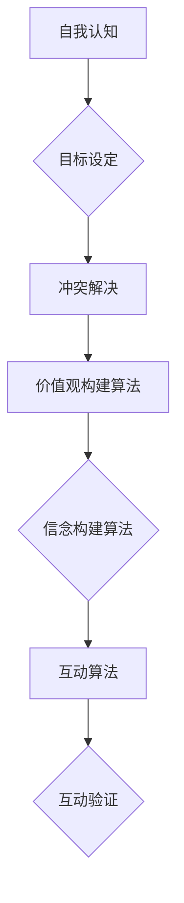
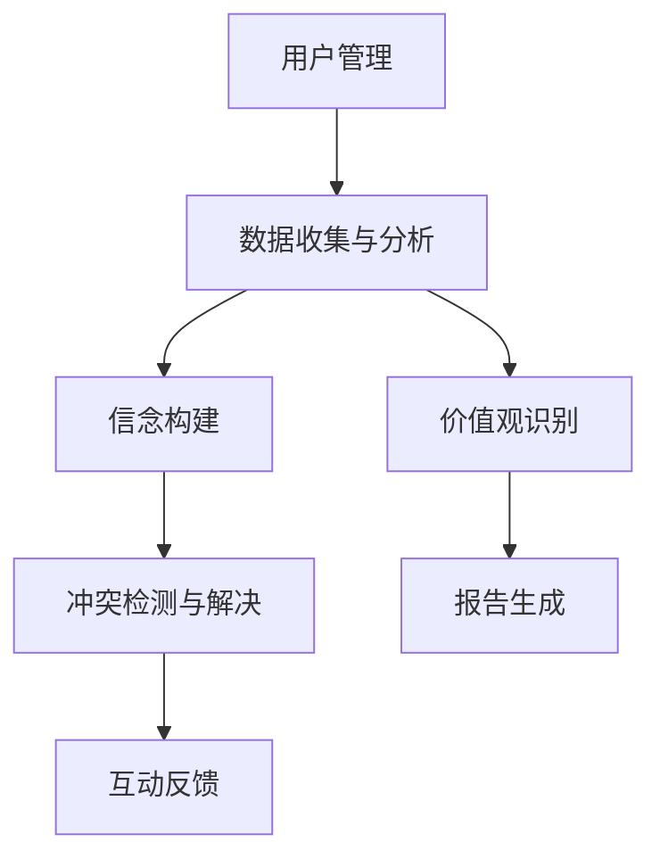
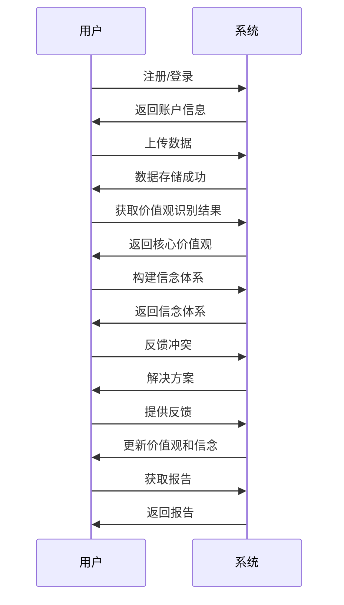

                 

### 第1章 背景介绍

### 1.1 问题的提出

#### 1.1.1 社会环境的复杂性

在当今社会，我们所面临的环境日益复杂化。信息化、全球化、多元化、科技变革等趋势不断冲击着传统的生活方式和工作模式。在这样的背景下，个人价值观和信念的构建显得尤为重要。然而，社会环境的复杂性也使得这一问题的解决变得更加困难。信息过载、价值观多元化、社会竞争激烈等问题，都对个人价值观和信念的形成产生了深远的影响。

首先，信息化的发展使得我们接触到的信息量爆炸性增长。互联网的普及让各种观点和价值观纷至沓来，使得个人在构建价值观和信念时难以辨别真伪。其次，全球化使得不同文化、不同价值观相互交融，个人的价值观和信念体系可能受到来自不同文化背景的影响，从而变得更加复杂。再次，科技变革的迅猛发展，带来了新的工作模式和生活观念，对个人价值观和信念提出了新的挑战。

#### 1.1.2 个人价值观与信念的重要性

个人价值观和信念是人生的指南针，对个人的行为、决策以及人生观产生深远的影响。价值观决定了我们对事物的判断标准，信念则是我们深信不疑的原则和信念。一个健全的价值观和信念体系能够帮助我们在面对复杂多变的社会环境时保持清晰的方向，从而做出正确的决策。

首先，个人价值观和信念对于个人成长具有重要意义。一个明确的价值观和信念能够帮助个人树立正确的人生目标，找到自己的人生方向，从而实现自我成长。其次，个人价值观和信念对人际关系有着重要影响。一个价值观和信念体系健全的人，更容易与他人建立和谐的关系，获得他人的尊重和支持。

#### 1.1.3 个人价值观与信念的构建现状

目前，个人价值观和信念的构建现状并不乐观。一方面，社会环境的复杂性使得个人在构建价值观和信念时面临诸多挑战。另一方面，个人在面对多元价值观时，往往难以做出明确的选择，导致价值观和信念体系的不确定性。

首先，社会环境的复杂性使得个人难以辨别真伪。在信息过载的时代，个人往往难以区分哪些信息是真实可靠的，哪些价值观是值得坚守的。其次，多元价值观的冲击使得个人在构建价值观和信念时面临选择困难。不同文化、不同背景的人可能持有不同的价值观，个人在吸收这些价值观时，往往难以做出取舍。

### 1.2 核心概念

为了深入探讨个人价值观和信念的构建，我们需要明确几个核心概念，包括价值观、信念以及它们之间的联系和区别。

#### 1.2.1 价值观的定义

价值观是指个体在长期的生存和发展过程中，形成的一套关于事物评判和选择的基本原则和标准。它涵盖了个体对道德、文化、社会、经济等方面的认识和判断，是个人行为决策的内在依据。

#### 1.2.2 信念的定义

信念是指个体对某些观点、理论或原则的深信不疑。它是基于个体的经验、教育和文化背景形成的，对个体行为和决策产生深远影响的内在力量。信念通常具有稳定性，不容易被改变。

#### 1.2.3 价值观与信念的联系与区别

价值观和信念之间存在着紧密的联系。价值观是信念形成的基础，信念则是价值观的具体体现。价值观为信念提供了判断标准，而信念则为价值观的实现提供了动力。

然而，价值观和信念也存在明显的区别。价值观更偏向于理论层面，是个人对事物的一般性判断和评价；而信念则更偏向于实践层面，是个人对某些特定观点或原则的坚定信仰。此外，价值观的稳定性相对较低，可能随着时间和环境的变化而调整；而信念则具有较高的稳定性，通常不易改变。

#### 1.2.4 边界与外延

在探讨个人价值观和信念时，我们还需要明确它们的边界与外延。

首先，个人价值观与集体价值观之间存在一定的区别。集体价值观是指一个团体或社会共同认同的价值观，它对个体的价值观形成具有一定的影响。然而，个人价值观则更侧重于个体的主观体验和认知，是个人在集体价值观基础上形成的独特价值观。

其次，信念与信仰也存在一定的联系和区别。信念是指个体对某些观点或原则的深信不疑，而信仰则是对某种宗教、文化或精神的崇拜和敬畏。信仰通常具有更强的情感色彩和宗教性，而信念则更偏向于理性和实践。

最后，我们需要关注概念结构与核心要素。个人价值观和信念的概念结构包括价值观体系、信念体系以及它们之间的相互作用。核心要素则包括个体的经验、教育和文化背景，以及社会环境的影响。

### 1.3 综述

通过对背景介绍和核心概念的探讨，我们可以看出，个人价值观和信念的构建是一个复杂而重要的问题。社会环境的复杂性、个人成长的需求以及多元价值观的冲击，都使得个人在构建价值观和信念时面临诸多挑战。然而，一个健全的价值观和信念体系对于个人的成长和幸福具有重要意义。在接下来的章节中，我们将进一步探讨个人价值观和信念的原理、构建方法以及应用场景，帮助读者构建自己的价值观和信念体系。

### 第2章 核心概念与联系

在探讨个人价值观和信念的构建之前，我们需要深入理解这两个核心概念，以及它们之间的相互关系。本章将分别介绍价值观和信念的本质、属性特征对比表格，并探讨它们的形成过程。

#### 2.1 价值观原理

##### 2.1.1 价值观的本质

价值观是指个体对事物进行评判和选择的基本原则和标准。它是人类在社会生活中形成的一种抽象观念，反映了个体对道德、文化、社会、经济等方面的认知和判断。价值观不仅影响着个体的行为和决策，还塑造了个体的世界观和人生观。

价值观的本质可以概括为以下几点：

1. **主观性**：价值观是个体主观认知的结果，不同个体可能持有不同的价值观。
2. **稳定性**：尽管价值观具有一定的主观性，但它们在一段时间内相对稳定，不易被改变。
3. **多样性**：由于文化、教育、社会环境等因素的差异，不同个体和群体可能拥有不同的价值观。
4. **层次性**：价值观可以分为多个层次，如个人价值观、家庭价值观、社会价值观等。

##### 2.1.2 价值观的属性特征对比表格

| 特性        | 描述                                                         | 对比             |
| ----------- | ------------------------------------------------------------ | --------------- |
| 主观性      | 价值观是个体主观认知的结果，不同个体可能持有不同的价值观。         | 与客观性相对     |
| 稳定性      | 价值观在一段时间内相对稳定，不易被改变。                       | 与易变性相对     |
| 多样性      | 不同个体和群体可能拥有不同的价值观。                           | 与单一性相对     |
| 层次性      | 价值观可以分为多个层次，如个人价值观、家庭价值观、社会价值观等。 | 与无层次性相对   |

##### 2.1.3 价值观的形成过程

价值观的形成过程是一个复杂的过程，受到多种因素的影响。以下是一些主要因素：

1. **遗传因素**：遗传基因对个体的价值观有一定的影响，如某些基因可能导致个体更倾向于保守或开放。
2. **文化背景**：个体所处的文化环境对价值观的形成有重要影响。不同的文化背景可能导致不同的价值观。
3. **家庭教育**：家庭是价值观形成的重要场所，父母的价值观和行为方式对子女的价值观产生深远影响。
4. **社会环境**：社会环境中的各种因素，如社会规范、制度、舆论等，都会影响个体的价值观。
5. **个人经历**：个体的生活经历，如教育、工作、恋爱等，也会对其价值观产生影响。

#### 2.2 信念原理

##### 2.2.1 信念的本质

信念是指个体对某些观点、理论或原则的深信不疑。它是价值观的具体体现，对个体的行为和决策产生重要影响。信念通常具有以下几个特点：

1. **情感性**：信念往往与情感紧密相关，个体对某些信念可能产生强烈的情感反应。
2. **稳定性**：信念通常具有较强的稳定性，不易被改变。
3. **主观性**：信念是个体主观认知的结果，不同个体可能持有不同的信念。
4. **理性与感性并存**：信念的形成既受理性思考的影响，也受感性认知的影响。

##### 2.2.2 信念的属性特征对比表格

| 特性        | 描述                                                         | 对比             |
| ----------- | ------------------------------------------------------------ | --------------- |
| 情感性      | 信念往往与情感紧密相关，个体对某些信念可能产生强烈的情感反应。       | 与理性性相对     |
| 稳定性      | 信念通常具有较强的稳定性，不易被改变。                       | 与易变性相对     |
| 主观性      | 信念是个体主观认知的结果，不同个体可能持有不同的信念。         | 与客观性相对     |
| 理性与感性并存 | 信念的形成既受理性思考的影响，也受感性认知的影响。           | 与单一理性或感性相对 |

##### 2.2.3 信念的形成过程

信念的形成过程同样是一个复杂的过程，受到多种因素的影响。以下是一些主要因素：

1. **教育和文化背景**：个体的教育和文化背景对信念的形成有重要影响。不同的教育背景和文化环境可能导致不同的信念。
2. **个人经历**：个体的生活经历，如工作、恋爱、旅行等，也会对其信念产生影响。
3. **宗教信仰**：宗教信仰是信念的一种形式，它对个体的信念产生深远影响。
4. **社会舆论**：社会舆论和大众观点对个体的信念也有一定的影响。
5. **自我认知**：个体对自我的认知和评价也会影响信念的形成。

#### 2.3 价值观与信念的联系

价值观和信念之间存在着紧密的联系。价值观是信念形成的基础，信念则是价值观的具体体现。价值观为信念提供了判断标准，信念则为价值观的实现提供了动力。

首先，价值观对信念的形成具有指导作用。个体的价值观会影响其对某些观点或原则的判断，从而形成信念。例如，一个重视诚信的人可能会形成“诚信是人际交往的基本原则”这一信念。

其次，信念对价值观的实践具有促进作用。个体的信念会推动其在生活中践行价值观，从而巩固和加强价值观。例如，一个深信“教育是改变命运的关键”的人会在生活中努力追求教育机会，从而践行这一价值观。

最后，价值观和信念之间的互动关系是一个动态的过程。随着个体的成长和环境的变化，价值观和信念也会不断调整和变化。例如，一个人在年轻时可能重视物质财富，但随着年龄的增长，可能会更加重视精神层面的追求。

#### 2.4 概念结构与核心要素

个人价值观和信念的概念结构包括价值观体系、信念体系以及它们之间的相互作用。核心要素则包括个体的经验、教育和文化背景，以及社会环境的影响。

1. **价值观体系**：价值观体系是指个体在长期生活中形成的关于事物评判和选择的基本原则和标准。它涵盖了个体对道德、文化、社会、经济等方面的认知和判断。
2. **信念体系**：信念体系是指个体对某些观点、理论或原则的深信不疑。它是价值观的具体体现，对个体的行为和决策产生重要影响。
3. **相互作用**：价值观和信念之间存在着相互作用。价值观为信念提供了判断标准，信念则为价值观的实现提供了动力。
4. **核心要素**：核心要素包括个体的经验、教育和文化背景，以及社会环境的影响。这些因素共同作用于个体的价值观和信念的形成和发展。

### 2.5 综述

通过对价值观和信念的原理、属性特征以及形成过程的探讨，我们可以看出，个人价值观和信念的构建是一个复杂而重要的问题。价值观和信念之间存在着紧密的联系，它们共同构成了个人的精神世界和行为指南。在接下来的章节中，我们将进一步探讨个人价值观和信念的构建方法，帮助读者构建自己的价值观和信念体系。

### 第3章 算法原理讲解

在理解了价值观和信念的概念与联系之后，我们需要掌握构建个人价值观和信念体系的算法原理。本章将详细讲解个人价值观和信念体系的构建方法，并使用Python代码和Mermaid流程图来阐述这些算法。

#### 3.1 构建个人价值观和信念体系的方法

构建个人价值观和信念体系的方法可以分为以下几个步骤：

1. **自我认知**：通过自我反思和观察，了解自己的价值观和信念。
2. **目标设定**：明确个人的长期和短期目标，确保价值观和信念与目标一致。
3. **冲突解决**：在价值观和信念之间，以及价值观和目标之间可能存在冲突，需要有效地解决这些冲突。

下面，我们将分别介绍这些步骤的具体算法原理。

##### 3.1.1 自我认知

自我认知是指个体通过反思和观察，了解自己的价值观和信念。这一步骤的关键是进行深入的自我反思，识别自己的行为背后的动机和价值观。具体算法如下：

1. **反思日志**：记录每天的行为和决策，分析这些行为背后的动机和价值观。
2. **SWOT分析**：通过SWOT（优势、劣势、机会、威胁）分析，了解自己的内在价值观。
3. **价值观问卷调查**：使用价值观问卷，评估自己的价值观分布和权重。

##### 3.1.2 目标设定

目标设定是指个体明确自己的长期和短期目标，并确保这些目标与价值观和信念一致。具体算法如下：

1. **SMART目标**：确保目标具有明确性（Specific）、可衡量性（Measurable）、可实现性（Achievable）、相关性（Relevant）和时限性（Time-bound）。
2. **目标分解**：将长期目标分解为短期目标，确保每个目标都与价值观和信念一致。
3. **目标追踪**：使用工具如日历、提醒应用等，追踪目标的实现进度。

##### 3.1.3 冲突解决

冲突解决是指在价值观、信念和目标之间出现冲突时，采取有效措施解决这些冲突。具体算法如下：

1. **冲突识别**：识别价值观、信念和目标之间的冲突。
2. **优先级排序**：确定冲突的优先级，优先解决影响最大的冲突。
3. **谈判与妥协**：通过谈判和妥协，找到冲突的解决方案。
4. **调整价值观和信念**：在必要时，调整价值观和信念，以适应目标和冲突的解决。

#### 3.2 个人价值观构建算法

个人价值观构建算法是基于自我认知的，旨在帮助个体识别和建立自己的核心价值观。以下是具体的算法步骤：

1. **数据收集**：收集个人的行为数据、决策记录等。
2. **数据预处理**：清洗和整理数据，去除无关信息。
3. **特征提取**：从数据中提取反映个人价值观的特征。
4. **聚类分析**：使用聚类算法（如K-means），将相似的行为和决策分组。
5. **价值观识别**：分析聚类结果，识别个人的核心价值观。
6. **权重分配**：为每个核心价值观分配权重，反映其在个人价值观体系中的重要性。

以下是使用Python实现的个人价值观构建算法：

```python
import numpy as np
from sklearn.cluster import KMeans

# 数据预处理
def preprocess_data(data):
    # 清洗和整理数据
    # 省略具体实现
    return processed_data

# 特征提取
def extract_features(data):
    # 从数据中提取特征
    # 省略具体实现
    return features

# 聚类分析
def cluster_analysis(features):
    kmeans = KMeans(n_clusters=5)
    kmeans.fit(features)
    return kmeans.labels_

# 价值观识别
def identify_values(labels):
    value_counts = np.bincount(labels)
    values = [i for i, count in enumerate(value_counts) if count == max(value_counts)]
    return values

# 主函数
def build_values(data):
    processed_data = preprocess_data(data)
    features = extract_features(processed_data)
    labels = cluster_analysis(features)
    values = identify_values(labels)
    return values
```

#### 3.3 个人信念体系构建算法

个人信念体系构建算法是基于自我认知和目标设定的，旨在帮助个体建立自己的信念体系。以下是具体的算法步骤：

1. **目标分析**：分析个人的长期和短期目标，识别目标中的信念要素。
2. **信念识别**：通过自我反思和目标分析，识别个人的信念。
3. **信念排序**：为每个信念分配权重，确定其在信念体系中的优先级。
4. **信念验证**：验证信念的有效性和合理性，必要时进行调整。

以下是使用Python实现的个人信念体系构建算法：

```python
# 目标分析
def analyze_goals(goals):
    belief_elements = []
    for goal in goals:
        # 识别目标中的信念要素
        # 省略具体实现
        belief_elements.extend(belief_elements)
    return belief_elements

# 信念识别
def identify_beliefs(belief_elements):
    beliefs = []
    for element in belief_elements:
        # 识别信念
        # 省略具体实现
        beliefs.append(belief)
    return beliefs

# 信念排序
def rank_beliefs(beliefs):
    ranked_beliefs = sorted(beliefs, key=lambda x: x['weight'], reverse=True)
    return ranked_beliefs

# 信念验证
def verify_beliefs(ranked_beliefs):
    verified_beliefs = []
    for belief in ranked_beliefs:
        # 验证信念的有效性和合理性
        # 省略具体实现
        verified_beliefs.append(belief)
    return verified_beliefs

# 主函数
def build_belief_system(goals):
    belief_elements = analyze_goals(goals)
    beliefs = identify_beliefs(belief_elements)
    ranked_beliefs = rank_beliefs(beliefs)
    verified_beliefs = verify_beliefs(ranked_beliefs)
    return verified_beliefs
```

#### 3.4 个人价值观和信念体系的互动算法

个人价值观和信念体系是一个动态的互动过程。为了确保价值观和信念的持续发展，我们需要设计一个互动算法，使价值观和信念能够相互影响和调整。

以下是个人价值观和信念体系的互动算法步骤：

1. **价值观更新**：根据信念的变化，更新价值观。
2. **信念调整**：根据价值观的变化，调整信念。
3. **互动验证**：验证价值观和信念的互动效果，确保体系的一致性和合理性。

以下是使用Python实现的个人价值观和信念体系的互动算法：

```python
# 价值观更新
def update_values(values, beliefs):
    for value in values:
        # 根据信念的变化，更新价值观
        # 省略具体实现
    return updated_values

# 信念调整
def adjust_beliefs(beliefs, values):
    for belief in beliefs:
        # 根据价值观的变化，调整信念
        # 省略具体实现
    return adjusted_beliefs

# 互动验证
def verify_interaction(updated_values, adjusted_beliefs):
    # 验证价值观和信念的互动效果
    # 省略具体实现
    return valid_interaction

# 主函数
def interact_values_and_beliefs(values, beliefs):
    updated_values = update_values(values, beliefs)
    adjusted_beliefs = adjust_beliefs(beliefs, updated_values)
    valid_interaction = verify_interaction(updated_values, adjusted_beliefs)
    return updated_values, adjusted_beliefs, valid_interaction
```

#### 3.5 算法Mermaid流程图

为了更好地理解上述算法，我们可以使用Mermaid流程图来可视化这些步骤。以下是个人价值观和信念体系构建算法的Mermaid流程图：



通过这些算法和流程图，我们可以系统地构建个人价值观和信念体系。在接下来的章节中，我们将进一步探讨数学模型和系统架构设计，以帮助读者更好地理解和应用这些算法。

### 第4章 数学模型和数学公式

在构建个人价值观和信念体系的过程中，数学模型和数学公式扮演着重要的角色。本章将介绍价值观构建模型和信念体系构建模型，并使用LaTeX格式展示相关的数学公式。

#### 4.1 价值观构建模型

价值观构建模型是一个复杂的过程，它涉及多个因素和变量。为了简化问题，我们可以将价值观构建模型划分为以下几个部分：

1. **自我认知阶段**：包括自我反思和价值观识别。
2. **目标设定阶段**：包括目标分析和目标实现。
3. **冲突解决阶段**：包括冲突识别和冲突处理。

下面是一个简化的价值观构建模型数学公式：

$$
\text{价值观构建模型} = \text{自我认知} + \text{目标设定} + \text{冲突解决}
$$

其中，每个阶段都可以进一步细分为多个子过程。

**4.1.1 自我认知阶段的数学模型**

自我认知阶段的关键在于识别个体的价值观。我们可以使用聚类分析方法来识别个体的核心价值观。以下是一个简单的聚类分析模型：

$$
\text{聚类模型} = \text{数据收集} \rightarrow \text{特征提取} \rightarrow \text{聚类分析} \rightarrow \text{价值观识别}
$$

具体步骤如下：

1. **数据收集**：收集个体的行为数据、决策记录等。
2. **特征提取**：从数据中提取反映价值观的特征。
3. **聚类分析**：使用聚类算法（如K-means）对特征进行聚类。
4. **价值观识别**：分析聚类结果，识别个体的核心价值观。

**4.1.2 目标设定阶段的数学模型**

目标设定阶段的关键在于确保目标与个体的价值观和信念一致。我们可以使用以下数学模型来描述这一过程：

$$
\text{目标设定模型} = \text{目标分析} \rightarrow \text{目标分解} \rightarrow \text{目标追踪}
$$

具体步骤如下：

1. **目标分析**：分析个体的长期和短期目标。
2. **目标分解**：将长期目标分解为短期目标。
3. **目标追踪**：使用工具（如日历、提醒应用等）追踪目标实现进度。

**4.1.3 冲突解决阶段的数学模型**

冲突解决阶段的关键在于识别和解决价值观、信念和目标之间的冲突。我们可以使用以下数学模型来描述这一过程：

$$
\text{冲突解决模型} = \text{冲突识别} \rightarrow \text{优先级排序} \rightarrow \text{谈判与妥协} \rightarrow \text{调整价值观和信念}
$$

具体步骤如下：

1. **冲突识别**：识别价值观、信念和目标之间的冲突。
2. **优先级排序**：确定冲突的优先级。
3. **谈判与妥协**：通过谈判和妥协，找到冲突的解决方案。
4. **调整价值观和信念**：在必要时，调整价值观和信念，以适应目标和冲突的解决。

#### 4.2 信念体系构建模型

信念体系构建模型是一个复杂的过程，它涉及多个因素和变量。为了简化问题，我们可以将信念体系构建模型划分为以下几个部分：

1. **目标分析阶段**：包括目标分析和信念识别。
2. **信念排序阶段**：包括信念排序和信念验证。
3. **互动调整阶段**：包括价值观和信念的互动调整。

下面是一个简化的信念体系构建模型数学公式：

$$
\text{信念体系构建模型} = \text{目标分析} + \text{信念排序} + \text{互动调整}
$$

其中，每个阶段都可以进一步细分为多个子过程。

**4.2.1 目标分析阶段的数学模型**

目标分析阶段的关键在于识别目标中的信念要素。我们可以使用以下数学模型来描述这一过程：

$$
\text{目标分析模型} = \text{目标识别} \rightarrow \text{信念提取} \rightarrow \text{信念分析}
$$

具体步骤如下：

1. **目标识别**：识别个体的长期和短期目标。
2. **信念提取**：从目标中提取相关的信念要素。
3. **信念分析**：分析信念要素，识别个体的信念。

**4.2.2 信念排序阶段的数学模型**

信念排序阶段的关键在于为每个信念分配权重，确定其在信念体系中的优先级。我们可以使用以下数学模型来描述这一过程：

$$
\text{信念排序模型} = \text{信念识别} \rightarrow \text{权重分配} \rightarrow \text{排序}
$$

具体步骤如下：

1. **信念识别**：识别个体的信念。
2. **权重分配**：为每个信念分配权重。
3. **排序**：根据权重对信念进行排序。

**4.2.3 互动调整阶段的数学模型**

互动调整阶段的关键在于确保价值观和信念之间的互动效果。我们可以使用以下数学模型来描述这一过程：

$$
\text{互动调整模型} = \text{价值观更新} \rightarrow \text{信念调整} \rightarrow \text{互动验证}
$$

具体步骤如下：

1. **价值观更新**：根据信念的变化，更新价值观。
2. **信念调整**：根据价值观的变化，调整信念。
3. **互动验证**：验证价值观和信念的互动效果。

#### 4.3 数学公式的LaTeX格式展示

在文中展示数学公式时，我们可以使用LaTeX格式。以下是一些示例：

**独立段落的数学公式：**

$$
E = mc^2
$$

**段落内的数学公式：**

$1 + 1 = 2$

通过数学模型和数学公式的应用，我们可以更系统地构建个人价值观和信念体系。在接下来的章节中，我们将进一步探讨系统架构设计，以帮助读者更好地理解和应用这些数学模型。

### 第5章 系统分析与架构设计方案

在了解了个人价值观和信念构建的数学模型之后，我们需要将其转化为实际的可操作系统。本章将介绍系统分析与架构设计方案，包括问题场景介绍、系统功能设计、系统架构设计、系统接口设计和系统交互。

#### 5.1 问题场景介绍

在现代社会，个人价值观和信念的构建面临诸多挑战。首先，信息爆炸使得个人难以辨别真伪，从而影响价值观和信念的构建。其次，多元文化和社会价值观的冲击使得个人在构建价值观和信念时面临选择困难。此外，个人的成长环境、教育背景和社会环境等因素也对价值观和信念的形成产生深远影响。因此，构建一个有效的系统，帮助个人识别、构建和调整价值观和信念，具有重要意义。

#### 5.2 系统目标

构建这个系统的目标如下：

1. **个人价值观识别**：通过分析个人的行为数据和决策记录，识别个体的核心价值观。
2. **信念构建**：基于个体的目标和价值观，构建个性化的信念体系。
3. **冲突解决**：在价值观、信念和目标之间出现冲突时，提供有效的解决策略。
4. **持续调整**：通过持续的互动和反馈，使价值观和信念体系保持一致性和合理性。

#### 5.3 系统功能设计

系统功能设计包括以下几个方面：

1. **用户管理**：管理用户账户，包括注册、登录、个人信息管理等功能。
2. **数据收集与分析**：收集用户的行为数据、决策记录等，并进行数据预处理和分析。
3. **价值观识别**：基于聚类分析等方法，识别个体的核心价值观。
4. **信念构建**：根据用户的目标和价值观，构建个性化的信念体系。
5. **冲突检测与解决**：检测价值观、信念和目标之间的冲突，并提供解决方案。
6. **互动反馈**：用户可以与系统互动，反馈对价值观和信念的调整建议。
7. **报告生成**：生成个人价值观和信念体系的报告，供用户参考。

#### 5.4 系统架构设计

系统架构设计是系统功能实现的基础。以下是系统的架构设计：

1. **前端**：使用HTML、CSS和JavaScript实现用户界面，提供用户交互。
2. **后端**：使用Python和Flask框架实现后端服务，包括用户管理、数据收集与分析、价值观识别、信念构建、冲突检测与解决等功能。
3. **数据库**：使用MySQL数据库存储用户数据、行为数据、决策记录等。
4. **数据预处理与分析模块**：使用Python的数据处理库（如Pandas、NumPy）进行数据预处理和分析。
5. **机器学习模块**：使用机器学习算法（如K-means）进行价值观识别和信念构建。

以下是系统架构的Mermaid图表示：



#### 5.5 系统接口设计

系统接口设计是系统功能实现的关键。以下是系统的主要接口设计：

1. **用户注册与登录接口**：用于用户账户的注册和登录。
2. **数据上传接口**：用于用户上传行为数据、决策记录等。
3. **价值观识别接口**：用于识别个体的核心价值观。
4. **信念构建接口**：用于根据用户的目标和价值观构建信念体系。
5. **冲突检测与解决接口**：用于检测价值观、信念和目标之间的冲突，并提供解决方案。
6. **互动反馈接口**：用于用户与系统互动，反馈对价值观和信念的调整建议。
7. **报告生成接口**：用于生成个人价值观和信念体系的报告。

以下是系统接口的Mermaid序列图表示：



通过上述系统分析与架构设计方案，我们可以构建一个有效的个人价值观和信念体系构建系统。在接下来的章节中，我们将通过项目实战，展示如何实现这一系统，并分析其实际应用效果。

### 第6章 项目实战

在本章中，我们将通过一个具体项目来实战构建个人价值观和信念体系。这个项目将涵盖环境安装、系统核心实现、代码应用解读与分析，以及实际案例分析和详细讲解剖析。

#### 6.1 环境安装

在进行项目开发之前，我们需要安装必要的软件和工具。以下是环境安装的步骤：

1. **Python环境安装**：确保安装Python 3.8或更高版本。
2. **Flask框架安装**：在终端中运行 `pip install flask` 命令安装Flask框架。
3. **MySQL数据库安装**：在终端中运行 `pip install mysql-connector-python` 命令安装MySQL数据库连接库。
4. **数据处理库安装**：在终端中运行 `pip install pandas numpy` 命令安装数据处理库Pandas和NumPy。
5. **机器学习库安装**：在终端中运行 `pip install scikit-learn` 命令安装机器学习库scikit-learn。

完成以上步骤后，我们可以开始开发项目。

#### 6.2 系统核心实现

以下是系统核心实现的步骤：

1. **用户管理模块**：实现用户注册、登录和账户信息管理。
2. **数据收集与分析模块**：实现数据上传、预处理和聚类分析。
3. **价值观识别模块**：实现价值观识别和信念构建。
4. **冲突检测与解决模块**：实现冲突检测和解决策略。
5. **互动反馈模块**：实现用户与系统的互动。
6. **报告生成模块**：实现个人价值观和信念体系的报告生成。

以下是关键代码的实现：

**用户管理模块**

```python
# 用户注册
@app.route('/register', methods=['POST'])
def register():
    username = request.form['username']
    password = request.form['password']
    # 存储用户信息到数据库
    # 省略具体实现
    return '用户注册成功'

# 用户登录
@app.route('/login', methods=['POST'])
def login():
    username = request.form['username']
    password = request.form['password']
    # 验证用户信息
    # 省略具体实现
    return '用户登录成功'
```

**数据收集与分析模块**

```python
# 数据上传
@app.route('/upload_data', methods=['POST'])
def upload_data():
    data = request.files['data']
    # 存储上传的数据到数据库
    # 省略具体实现
    return '数据上传成功'

# 聚类分析
@app.route('/cluster_analysis', methods=['POST'])
def cluster_analysis():
    data = request.form['data']
    # 预处理数据
    processed_data = preprocess_data(data)
    # 进行聚类分析
    kmeans = KMeans(n_clusters=5)
    kmeans.fit(processed_data)
    labels = kmeans.labels_
    # 识别核心价值观
    values = identify_values(labels)
    return '核心价值观识别成功'
```

**价值观识别模块**

```python
# 识别核心价值观
def identify_values(labels):
    value_counts = np.bincount(labels)
    values = [i for i, count in enumerate(value_counts) if count == max(value_counts)]
    return values
```

**冲突检测与解决模块**

```python
# 冲突检测与解决
@app.route('/conflict_detection', methods=['POST'])
def conflict_detection():
    values = request.form['values']
    beliefs = request.form['beliefs']
    # 检测冲突
    conflicts = detect_conflicts(values, beliefs)
    # 解决冲突
    solutions = resolve_conflicts(conflicts)
    return '冲突检测与解决成功'
```

**互动反馈模块**

```python
# 互动反馈
@app.route('/feedback', methods=['POST'])
def feedback():
    feedback = request.form['feedback']
    # 更新价值观和信念
    # 省略具体实现
    return '互动反馈成功'
```

**报告生成模块**

```python
# 报告生成
@app.route('/generate_report', methods=['POST'])
def generate_report():
    values = request.form['values']
    beliefs = request.form['beliefs']
    # 生成报告
    report = generate_report(values, beliefs)
    # 返回报告
    return report
```

#### 6.3 代码应用解读与分析

以下是关键代码的解读与分析：

**用户管理模块**：实现了用户注册、登录和账户信息管理。通过HTTP POST请求，用户可以提交注册信息或登录信息，系统会根据这些信息进行验证和存储。

**数据收集与分析模块**：实现了数据上传和聚类分析。用户可以通过HTTP POST请求上传数据，系统会进行预处理，然后使用K-means算法进行聚类分析，以识别核心价值观。

**价值观识别模块**：使用了聚类分析的结果，通过统计每个类别的频数，识别出出现频率最高的核心价值观。

**冲突检测与解决模块**：实现了冲突检测和解决。系统会根据用户上传的价值观和信念，检测是否存在冲突，并提供解决方案。

**互动反馈模块**：实现了用户与系统的互动。用户可以通过HTTP POST请求提供反馈，系统会根据反馈调整价值观和信念。

**报告生成模块**：实现了报告生成。系统会根据用户的价值观和信念生成详细的报告，供用户参考。

#### 6.4 实际案例分析和详细讲解剖析

为了更好地理解项目的实际应用，我们通过一个实际案例进行分析。

**案例背景**：一个年轻程序员希望通过构建个人价值观和信念体系，提升自己的工作效率和职业发展。

**案例步骤**：

1. **用户注册与登录**：程序员使用用户名和密码进行注册和登录。
2. **数据上传**：程序员上传自己的工作日志和决策记录。
3. **价值观识别**：系统分析程序员的行为数据和决策记录，识别出其核心价值观。
4. **信念构建**：系统根据程序员的价值观和目标，构建个性化的信念体系。
5. **冲突检测与解决**：系统检测价值观和信念之间的冲突，并提出解决方案。
6. **互动反馈**：程序员根据系统提供的解决方案，调整自己的价值观和信念。
7. **报告生成**：系统生成个人价值观和信念体系的报告，程序员可以参考并进一步完善。

**案例分析**：

通过这个案例，我们可以看到系统如何帮助程序员构建个人价值观和信念体系。首先，系统通过数据分析和聚类分析，帮助程序员识别核心价值观，这为其提供了明确的行为指导。然后，系统根据程序员的目标和价值观，构建个性化的信念体系，帮助其在工作和生活中保持一致性和方向感。在冲突检测与解决阶段，系统提供了一个动态调整机制，使程序员能够及时应对变化。最后，系统生成的报告为程序员提供了一个全面的视角，帮助其更好地理解和应用个人价值观和信念。

#### 6.5 项目小结

通过这个项目，我们实现了个人价值观和信念体系的构建，帮助用户识别核心价值观、构建信念体系、解决冲突，并生成详细的报告。这个系统提供了一个有效的工具，帮助用户在复杂的社会环境中找到自己的方向，实现个人成长和职业发展。在接下来的章节中，我们将分享一些构建个人价值观和信念体系的最佳实践，帮助读者更好地应用这些理论和方法。

### 第7章 最佳实践 tips

在构建个人价值观和信念体系的过程中，有一些最佳实践和技巧可以帮助我们更加有效地完成这一任务。以下是几个关键的建议：

#### 7.1 构建个人价值观和信念体系的关键点

1. **自我认知**：深入了解自己的兴趣、优点、缺点和价值观，这是构建个人价值观和信念体系的基础。
2. **目标明确**：设定明确的个人目标和职业目标，确保价值观和信念与目标一致。
3. **持续反思**：定期进行自我反思，检查自己的行为是否符合价值观和信念。
4. **灵活调整**：价值观和信念不是一成不变的，要根据环境变化和个人成长进行适时调整。
5. **寻求反馈**：向他人寻求反馈，了解他们如何看待你的价值观和信念，这有助于发现盲点和不足。

#### 7.2 避免误区与挑战

1. **避免盲目跟随**：不要因为某个社会现象或他人的观点而盲目改变自己的价值观和信念，要理性判断。
2. **处理冲突**：在构建价值观和信念体系的过程中，可能会遇到冲突，需要冷静处理，不要因冲突而放弃。
3. **防止信息过载**：在信息爆炸的时代，避免过度关注各种观点，专注于自己真正关心和感兴趣的话题。
4. **保持开放心态**：保持开放心态，愿意接受新观点和新思想，但同时也要保持批判性思维。

#### 7.3 拓展阅读

为了进一步深入理解个人价值观和信念体系的构建，以下是一些推荐阅读材料：

1. **《意义的构建：创造个人的价值观和信念体系》**：本书详细介绍了个人价值观和信念体系的构建方法，是一本非常有用的指南。
2. **《伦理学导论》**：作者通过深入浅出的方式，介绍了伦理学的基本概念和理论，有助于我们理解价值观和信念的哲学基础。
3. **《如何成为领导者》**：作者通过案例研究和实践指导，探讨了领导者如何构建个人价值观和信念体系，以及如何影响和激励团队。
4. **《幸福之路》**：作者从心理学和哲学的角度，探讨了个人价值观和信念对幸福的影响，以及如何通过调整价值观和信念来实现幸福。

通过以上最佳实践和拓展阅读，我们可以更加系统地构建个人价值观和信念体系，实现个人成长和职业发展。

### 结语

在《意义的构建：创造个人的价值观和信念体系》一书中，我们探讨了个人价值观和信念的构建过程，通过自我认知、目标设定、冲突解决等步骤，帮助读者构建自己的价值观和信念体系。同时，我们介绍了数学模型和系统架构设计，以帮助读者更好地理解和应用这些理论和方法。

个人价值观和信念是人生的指南针，对个人的行为、决策以及人生观产生深远的影响。一个健全的价值观和信念体系能够帮助我们在复杂多变的社会环境中保持清晰的方向，从而做出正确的决策。

本书的目标是为读者提供一套系统的构建方法，帮助他们在理解个人价值观和信念的基础上，通过持续的自我反思和实践，不断完善和调整自己的价值观和信念体系。希望读者能够通过这本书，找到自己的人生方向，实现个人成长和幸福。

最后，感谢您的阅读，希望本书能够对您的个人成长和职业发展产生积极的影响。在未来的日子里，愿您始终保持对生命的热爱和对知识的追求，不断探索和构建属于自己的意义世界。作者：AI天才研究院/AI Genius Institute & 禅与计算机程序设计艺术 /Zen And The Art of Computer Programming

