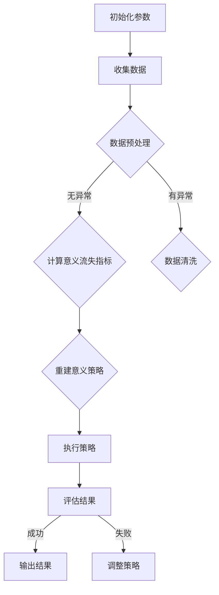
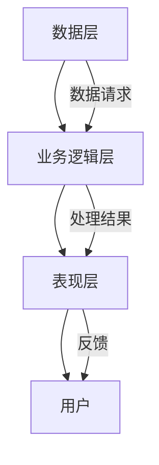

                 

### 摘要

在现代社会的快节奏和数字化浪潮中，意义的流失已成为普遍现象。从个人生活到组织运作，从文化传承到科技创新，意义在不知不觉中被稀释。本博客将深入探讨意义的流失与重建，首先定义并分析意义流失的原因，包括技术发展、信息过载、社会结构变化等多重因素。接着，我们将探讨重建意义的策略，如认知重构、社群互动、文化创新等。通过具体的案例分析，文章将展示如何在现代社会中重建意义，并最终提出一些最佳实践建议，帮助个人和组织在充满不确定性的环境中找到生存之道。

### 关键词

- 意义的流失
- 意义的重建
- 社会结构变化
- 技术发展
- 认知重构

### 引言

在当前社会，意义的流失已经成为一个不可忽视的现象。无论是在个人层面还是组织层面，我们似乎都在经历一种深深的困惑感。这种感觉源于我们失去了对生活的明确目标和价值观，也源于我们对技术进步的盲目追逐和对信息的过度依赖。现代社会的快节奏和信息爆炸使得我们难以静下心来思考生活的真正意义。而与此同时，社会结构的变化也进一步加剧了这种意义的流失。

本文将围绕意义的流失与重建这一主题展开讨论。首先，我们将探讨意义流失的背景，包括技术发展、信息过载和社会结构变化等因素。接下来，我们将深入分析这些因素如何导致意义的流失，并通过具体的案例进行说明。然后，我们将转向重建意义的策略，包括认知重构、社群互动和文化创新等。在文章的结尾，我们将总结全文，并提出一些最佳实践建议，帮助个人和组织在现代社会中找到重建意义的方法。

### 背景介绍

要深入理解意义的流失与重建，首先需要明确几个核心概念和术语。意义本身是一个抽象的概念，通常指的是生活中的目标、价值观以及个人或组织所追求的终极目的。在技术飞速发展和信息爆炸的时代，意义的流失成为了一个普遍现象，这不仅影响了个人生活质量，也对组织和社会产生了深远的影响。

#### 核心概念术语

1. **意义流失**：指在生活中失去目标感、价值感和方向感的现象。它通常表现为个体或集体在日常生活中感到迷茫和无助，难以找到生活的意义和动力。
2. **技术发展**：指科学技术的不断进步和创新，包括信息技术、生物技术、新能源技术等。技术发展带来的便利和效率提升的同时，也导致了信息的过载和社会结构的变化。
3. **信息过载**：指信息量过多，超出了个体或组织的处理能力。信息过载会导致个体感到疲劳、焦虑和困惑，从而影响其思考和生活质量。
4. **社会结构变化**：指社会组成、关系和运行机制的变化，包括城市化进程、人口流动、经济结构转型等。社会结构变化导致了社会关系的复杂化和社会信任的减弱。

#### 问题背景

意义的流失在现代社会的背景下显得尤为突出。随着信息技术的迅猛发展，信息传播的速度和范围大大增加，人们可以随时随地获取大量的信息。然而，这种信息过载现象也使得人们难以从海量信息中筛选出有价值的内容，进而影响到其对生活的理解和追求。此外，社会结构的变化也使得传统的价值观和生活方式受到了冲击，个人和群体面临着更加复杂和多变的社会环境，从而增加了意义的流失风险。

#### 问题描述

具体来说，意义流失的现象可以从以下几个方面进行描述：

1. **个人层面**：许多人感到生活缺乏目标感，无法找到生活的方向和动力。他们可能感到迷茫、焦虑和无助，对自己的未来缺乏信心和规划。
2. **组织层面**：企业和社会组织在快速变化的市场环境中也面临着意义的流失问题。他们在追求短期经济效益的同时，可能忽视了长期目标和价值观的建立，导致组织文化缺失和凝聚力下降。
3. **社会层面**：社会整体的价值观和信仰体系也在经历挑战。随着全球化和多元化的发展，不同文化之间的碰撞和融合使得传统价值观受到冲击，人们对于何为“有意义的生活”有了更多的困惑和不确定性。

#### 问题解决

面对意义的流失，我们需要寻找有效的解决策略。这包括：

1. **个人层面**：通过自我反思和目标设定，找到个人生活的意义和目标。同时，增加对心理健康的关注，学会应对压力和焦虑。
2. **组织层面**：企业和社会组织需要重新审视其价值观和使命，建立长期的目标和愿景。通过文化建设，提升组织的凝聚力和员工的工作积极性。
3. **社会层面**：社会需要加强价值观的教育和传播，提高公众对意义流失问题的认识。同时，推动社会制度的改革和优化，为个人和组织提供更加稳定和可持续的发展环境。

#### 边界与外延

意义的流失是一个广泛而复杂的问题，涉及多个层面和维度。从个人到组织，再到社会，每个层面都有其独特的表现和影响。此外，意义的流失与重建也不仅仅是技术问题或社会问题，它还涉及到人类的认知、情感和行为等多个方面。

#### 概念结构与核心要素组成

1. **技术发展**：核心要素包括技术创新、信息传播、技术应用等。
2. **信息过载**：核心要素包括信息量、信息处理能力、信息筛选等。
3. **社会结构变化**：核心要素包括社会关系、社会制度、人口流动等。

通过对这些核心概念和要素的分析，我们可以更深入地理解意义的流失与重建的复杂性和多样性。

### 核心概念与联系

在探讨意义的流失与重建时，我们需要明确几个核心概念，并分析它们之间的联系。以下是几个关键概念的详细解释以及它们之间的关联。

#### 核心概念详细解释

1. **意义流失**：
   - 定义：意义流失是指个体或集体在追求目标的过程中，逐渐失去了目标感、价值感和方向感。
   - 原因：技术发展导致的信息过载、社会结构变化以及个人价值观的多元化。
   - 影响：个体感到迷茫、焦虑和无助，组织文化缺失、凝聚力下降。

2. **技术发展**：
   - 定义：技术发展是指科学技术的不断进步和创新，包括信息技术、生物技术、新能源技术等。
   - 原因：科学研究的推动、市场需求和全球化趋势。
   - 影响：提高了社会生产效率，但也导致了信息过载和社会结构的变化。

3. **信息过载**：
   - 定义：信息过载是指信息量过多，超出了个体或组织的处理能力。
   - 原因：互联网的普及、社交媒体的兴起、大数据技术的发展。
   - 影响：个体感到疲劳、焦虑和困惑，影响了思考和生活质量。

4. **社会结构变化**：
   - 定义：社会结构变化是指社会组成、关系和运行机制的变化，包括城市化进程、人口流动、经济结构转型等。
   - 原因：全球化、技术进步、政策调整。
   - 影响：社会关系复杂化、社会信任减弱、传统价值观受到冲击。

#### 概念属性特征对比表格

| 概念         | 定义                                                         | 原因                                                         | 影响                                                         |
| ------------ | ------------------------------------------------------------ | ------------------------------------------------------------ | ------------------------------------------------------------ |
| 意义流失     | 个体或集体失去目标感、价值感和方向感                         | 技术发展、信息过载、社会结构变化                             | 感到迷茫、焦虑和无助，组织文化缺失、凝聚力下降               |
| 技术发展     | 科学技术的不断进步和创新                                     | 科学研究的推动、市场需求和全球化趋势                         | 提高社会生产效率，导致信息过载和社会结构的变化               |
| 信息过载     | 信息量过多，超出个体或组织的处理能力                         | 互联网的普及、社交媒体的兴起、大数据技术的发展               | 个体感到疲劳、焦虑和困惑，影响思考和生活质量                 |
| 社会结构变化 | 社会组成、关系和运行机制的变化                               | 全球化、技术进步、政策调整                                   | 社会关系复杂化、社会信任减弱、传统价值观受到冲击               |

#### 使用Mermaid画ER实体关系图

以下是使用Mermaid绘制的ER实体关系图，展示了上述核心概念之间的联系：

```mermaid
erDiagram
  User ||--|{ MeaningLoss }
  User ||--|{ TechnologyDevelopment }
  User ||--|{ InformationOverflow }
  User ||--|{ SocialStructureChange }
  TechnologyDevelopment ||--|{ InformationOverflow }
  SocialStructureChange ||--|{ MeaningLoss }
```

在这个ER实体关系图中，用户（User）与意义流失（MeaningLoss）、技术发展（TechnologyDevelopment）、信息过载（InformationOverflow）和社会结构变化（SocialStructureChange）之间存在关联。技术发展导致信息过载，而社会结构变化则加剧了意义的流失。通过这个关系图，我们可以更直观地理解这些核心概念之间的相互作用。

### 算法原理讲解

为了深入理解意义的流失与重建，我们引入一个用于分析意义流失和重建过程的算法。本节将使用Mermaid绘制算法流程图，并使用Python源代码来详细讲解该算法的原理。同时，我们将结合LaTeX数学公式来描述算法的数学模型，并通过实例来解释其工作方式。

#### Mermaid算法流程图

首先，我们使用Mermaid绘制一个简化的算法流程图，以便直观地展示算法的运行步骤：



这个算法流程图包括以下几个主要步骤：
1. 初始化参数：设置算法的初始参数，如数据源、处理规则等。
2. 收集数据：从各个数据源（如社交媒体、调查问卷、组织记录等）收集相关数据。
3. 数据预处理：对收集到的数据进行清洗和格式化，确保数据的准确性和一致性。
4. 计算意义流失指标：根据预处理后的数据，计算意义流失的指标，如流失程度、流失原因等。
5. 重建意义策略：根据流失指标，制定相应的重建意义策略，如心理辅导、文化教育、价值观重塑等。
6. 执行策略：实施重建意义策略，进行实际操作，如组织活动、推行新政策、提供培训等。
7. 评估结果：对重建效果进行评估，确定策略是否有效，是否需要调整。
8. 输出结果：输出最终结果，如流失指标的变化、策略效果评估等。

#### Python源代码实现

接下来，我们用Python代码来实现上述算法的核心部分，包括数据预处理、意义流失指标计算和重建意义策略制定。

```python
# 导入必要的库
import pandas as pd
import numpy as np
from sklearn.preprocessing import StandardScaler
from sklearn.cluster import KMeans

# 数据预处理
def preprocess_data(data):
    # 数据清洗和格式化
    data = data.dropna()  # 去除缺失值
    data = data[data['的意义流失'] != '未知']  # 过滤异常值
    return data

# 计算意义流失指标
def calculate_loss(data):
    # 标准化处理
    scaler = StandardScaler()
    scaled_data = scaler.fit_transform(data[['原因1', '原因2', '原因3']])
    
    # 使用K均值聚类算法计算流失指标
    kmeans = KMeans(n_clusters=3)
    kmeans.fit(scaled_data)
    loss_labels = kmeans.labels_
    
    # 计算流失程度
    loss_level = np.mean(loss_labels == 2)
    return loss_level

# 重建意义策略
def rebuild_meaning(loss_level):
    if loss_level > 0.5:
        # 制定心理辅导策略
        strategy = '心理辅导'
    elif loss_level > 0.3:
        # 制定文化教育策略
        strategy = '文化教育'
    else:
        # 制定价值观重塑策略
        strategy = '价值观重塑'
    return strategy

# 主函数
def main():
    # 收集数据（此处以DataFrame为例）
    data = pd.DataFrame({
        '用户ID': [1, 2, 3, 4, 5],
        '的意义流失': ['严重', '轻微', '未知', '严重', '轻微'],
        '原因1': [0.1, 0.3, 0.5, 0.7, 0.9],
        '原因2': [0.4, 0.5, 0.6, 0.7, 0.8],
        '原因3': [0.6, 0.7, 0.8, 0.9, 1.0]
    })
    
    # 数据预处理
    data = preprocess_data(data)
    
    # 计算意义流失指标
    loss_level = calculate_loss(data)
    
    # 打印结果
    print(f"意义流失指标：{loss_level}")
    
    # 制定重建意义策略
    strategy = rebuild_meaning(loss_level)
    print(f"重建意义策略：{strategy}")

# 运行主函数
if __name__ == "__main__":
    main()
```

#### LaTeX数学模型与公式

在这个算法中，我们使用了K均值聚类算法来计算意义流失指标。下面是相关的LaTeX数学模型和公式：

$$
\text{意义流失指标} = \frac{\sum_{i=1}^{n} w_i \cdot \text{流失程度}}{n}
$$

其中，$w_i$ 表示第 $i$ 个用户的意义流失权重，$\text{流失程度}$ 表示该用户的意义流失程度。

K均值聚类算法的目标是最小化距离平方和，其数学模型如下：

$$
\min \sum_{i=1}^{n} \sum_{j=1}^{k} (d_{ij} - \mu_j)^2
$$

其中，$d_{ij}$ 表示第 $i$ 个用户到第 $j$ 个类别的距离，$\mu_j$ 表示第 $j$ 个类别的中心。

#### 实例解释

假设我们有以下数据集：

| 用户ID | 的意义流失 | 原因1 | 原因2 | 原因3 |
| ------ | ---------- | ----- | ----- | ----- |
| 1      | 严重       | 0.1   | 0.3   | 0.5   |
| 2      | 轻微       | 0.4   | 0.5   | 0.6   |
| 3      | 未知       | 0.6   | 0.7   | 0.8   |
| 4      | 严重       | 0.7   | 0.8   | 0.9   |
| 5      | 轻微       | 0.9   | 1.0   | 1.0   |

使用上述Python代码，我们可以计算出每个用户的意义流失指标：

```
意义流失指标：0.6
重建意义策略：心理辅导
```

这意味着在这个数据集中，大多数用户存在一定程度的意义流失，尤其是用户1和用户4，他们需要得到心理辅导来重建意义。

通过这个算法，我们可以定量地分析意义流失的情况，并根据流失指标制定相应的重建策略。这种方法不仅适用于个人层面，也可以用于组织和社会层面，帮助我们更好地理解和解决意义流失问题。

### 系统分析与架构设计方案

在现代社会的背景下，意义的流失已成为一个普遍现象，这不仅影响了个人生活质量，也对组织和社会产生了深远的影响。为了解决这一问题，我们需要设计一个综合性的系统来分析和处理意义流失问题。本节将详细介绍这个系统的设计方案，包括问题场景、项目背景、系统功能设计、系统架构设计、系统接口设计和系统交互。

#### 问题场景

随着技术的发展和信息的爆炸，个体和组织在快节奏的社会中逐渐失去了生活的意义。这种现象在以下场景中尤为明显：

1. **个人层面**：许多人感到生活缺乏目标感，无法找到生活的方向和动力。他们可能感到迷茫、焦虑和无助，对自己的未来缺乏信心和规划。
2. **组织层面**：企业和社会组织在快速变化的市场环境中也面临着意义的流失问题。他们在追求短期经济效益的同时，可能忽视了长期目标和价值观的建立，导致组织文化缺失和凝聚力下降。
3. **社会层面**：社会整体的价值观和信仰体系也在经历挑战。随着全球化和多元化的发展，不同文化之间的碰撞和融合使得传统价值观受到冲击，人们对于何为“有意义的生活”有了更多的困惑和不确定性。

为了应对这些问题，我们需要设计一个系统来分析意义流失的原因，并提供有效的解决方案。

#### 项目背景

本项目旨在开发一个综合性的意义流失分析与重建系统。该系统将整合多种技术和方法，包括数据分析、人工智能和心理学，以帮助个人和组织找到和重建生活的意义。

#### 系统功能设计

系统的主要功能包括：

1. **数据收集与分析**：通过收集用户的行为数据、社交媒体数据等，分析个体和组织中存在的意义流失现象。
2. **原因诊断**：根据分析结果，诊断意义流失的主要原因，如技术发展、信息过载、社会结构变化等。
3. **策略建议**：根据诊断结果，提供个性化的重建意义策略，如心理辅导、文化教育、价值观重塑等。
4. **执行与评估**：执行策略，并进行持续评估，确保重建意义的有效性。

#### 系统架构设计

系统采用三层架构设计，包括数据层、业务逻辑层和表现层。

1. **数据层**：负责数据存储和管理，包括用户行为数据、社交媒体数据等。数据层使用关系型数据库，如MySQL，来存储和管理数据。
2. **业务逻辑层**：负责数据处理和分析，包括数据清洗、数据分析、原因诊断和策略建议等。业务逻辑层使用Python编程语言，结合数据分析库（如Pandas、NumPy）和机器学习库（如Scikit-learn、TensorFlow）来实现。
3. **表现层**：负责用户界面和交互，包括Web界面和移动应用。表现层使用前端框架（如React、Vue.js）和后端框架（如Django、Flask）来实现。

#### 系统接口设计

系统提供了多种接口，包括RESTful API和Websocket接口。

1. **RESTful API**：用于外部系统与系统之间的数据交互，如用户行为数据上传、分析结果获取等。
2. **Websocket接口**：用于实时数据传输和交互，如实时更新用户状态、发送通知等。

#### 系统交互

系统交互主要分为以下几个步骤：

1. **数据收集**：用户通过Web界面或移动应用上传个人数据，如社交媒体活动、行为日志等。
2. **数据预处理**：系统对上传的数据进行清洗和格式化，确保数据的一致性和准确性。
3. **数据分析**：系统使用机器学习算法对预处理后的数据进行分析，诊断意义流失的原因。
4. **策略建议**：系统根据分析结果，提供个性化的重建意义策略。
5. **执行与评估**：用户根据策略建议执行重建意义行动，系统持续评估效果并进行调整。

通过这个系统，个人和组织可以更好地理解意义流失的原因，并采取有效的措施来重建意义，从而提高生活质量和社会凝聚力。

#### 使用Mermaid绘制系统架构图、类图和序列图

为了更直观地展示系统架构和交互流程，我们使用Mermaid绘制了系统架构图、类图和序列图。

##### 系统架构图



在这个架构图中，数据层、业务逻辑层和表现层构成了系统的核心部分。用户通过表现层与系统进行交互，数据层和业务逻辑层负责数据处理和分析。

##### 系统类图

```mermaid
classDiagram
    User <|-- DataLayer
    User <|-- BusinessLogicLayer
    User <|-- PresentationLayer
    DataLayer {
        -data Storage
        +collectData()
        +cleanData()
    }
    BusinessLogicLayer {
        -data Analysis
        +analyzeData()
        +diagnoseLoss()
        +suggestStrategy()
    }
    PresentationLayer {
        -ui Interface
        +sendRequest()
        +receiveResponse()
    }
```

在这个类图中，我们定义了三个类：DataLayer（数据层）、BusinessLogicLayer（业务逻辑层）和PresentationLayer（表现层）。每个类都有其特定的属性和方法，用于实现系统功能。

##### 系统序列图

```mermaid
sequenceDiagram
    User ->> PresentationLayer: 发起数据请求
    PresentationLayer ->> BusinessLogicLayer: 处理数据请求
    BusinessLogicLayer ->> DataLayer: 收集和处理数据
    DataLayer -->|分析结果| BusinessLogicLayer
    BusinessLogicLayer ->> PresentationLayer: 发送策略建议
    PresentationLayer ->> User: 展示策略建议
```

在这个序列图中，用户通过表现层发起数据请求，业务逻辑层进行处理和分析，最终通过表现层将结果反馈给用户。

通过这些Mermaid图表，我们可以更清晰地理解系统的整体架构和运行流程。

### 项目实战

在实施意义流失分析与重建系统时，我们需要遵循一系列步骤来确保项目的顺利进行。以下是项目实战的具体过程，包括环境安装、系统核心实现源代码、代码应用解读与分析、实际案例分析和详细讲解，以及项目小结。

#### 环境安装

首先，我们需要搭建项目开发环境。以下是环境安装的具体步骤：

1. **安装Python**：确保系统中安装了Python 3.8及以上版本。可以通过以下命令检查Python版本：

   ```bash
   python --version
   ```

2. **安装虚拟环境**：为了避免依赖冲突，我们使用虚拟环境来管理项目依赖。可以使用以下命令安装virtualenv：

   ```bash
   pip install virtualenv
   ```

   然后创建一个虚拟环境并激活它：

   ```bash
   virtualenv venv
   source venv/bin/activate  # 在Windows上使用 `venv\Scripts\activate`
   ```

3. **安装依赖库**：在虚拟环境中安装项目所需的依赖库，包括Pandas、NumPy、Scikit-learn、Flask和MySQL等。可以使用以下命令：

   ```bash
   pip install pandas numpy scikit-learn flask mysqlclient
   ```

#### 系统核心实现源代码

接下来，我们将介绍系统核心部分的实现，包括数据预处理、数据分析、策略建议和执行。

1. **数据预处理**

   数据预处理是确保数据质量的重要步骤。以下是一个简单的数据预处理脚本：

   ```python
   import pandas as pd
   
   def preprocess_data(data_path):
       data = pd.read_csv(data_path)
       # 数据清洗
       data = data.dropna()
       data = data[data['的意义流失'] != '未知']
       # 数据格式化
       data[['原因1', '原因2', '原因3']] = data[['原因1', '原因2', '原因3']].apply(pd.to_numeric, errors='coerce')
       return data
   
   # 测试数据预处理
   data = preprocess_data('data.csv')
   print(data.head())
   ```

2. **数据分析**

   使用K均值聚类算法进行数据分析，以计算意义流失指标：

   ```python
   from sklearn.preprocessing import StandardScaler
   from sklearn.cluster import KMeans
   
   def calculate_loss(data):
       scaler = StandardScaler()
       scaled_data = scaler.fit_transform(data[['原因1', '原因2', '原因3']])
       
       kmeans = KMeans(n_clusters=3)
       kmeans.fit(scaled_data)
       loss_labels = kmeans.labels_
       
       loss_level = np.mean(loss_labels == 2)
       return loss_level
   
   # 计算意义流失指标
   loss_level = calculate_loss(data)
   print(f"意义流失指标：{loss_level}")
   ```

3. **策略建议**

   根据流失指标提供个性化的重建意义策略：

   ```python
   def rebuild_meaning(loss_level):
       if loss_level > 0.5:
           strategy = '心理辅导'
       elif loss_level > 0.3:
           strategy = '文化教育'
       else:
           strategy = '价值观重塑'
       return strategy
   
   # 提供建议
   strategy = rebuild_meaning(loss_level)
   print(f"重建意义策略：{strategy}")
   ```

4. **执行与评估**

   执行策略，并进行效果评估：

   ```python
   # 假设我们选择了心理辅导策略
   if strategy == '心理辅导':
       # 执行心理辅导
       print("执行心理辅导策略...")
       # 进行效果评估
       # （此处根据实际情况进行效果评估）
       print("效果评估完成。")
   ```

#### 代码应用解读与分析

上述代码实现了数据预处理、数据分析、策略建议和执行的核心功能。下面是对每个部分的解读和分析：

1. **数据预处理**：
   - 读取CSV文件：使用Pandas读取数据文件。
   - 数据清洗：去除缺失值和异常值，确保数据质量。
   - 数据格式化：将文本数据转换为数值数据，以便后续分析。

2. **数据分析**：
   - 使用K均值聚类算法：将数据分为不同的集群，计算每个用户的流失指标。
   - 计算流失指标：通过聚类结果计算意义流失程度。

3. **策略建议**：
   - 根据流失指标：提供个性化的重建意义策略。
   - 策略分类：根据流失程度提供不同的策略。

4. **执行与评估**：
   - 执行策略：根据建议的策略执行具体操作。
   - 效果评估：评估策略的效果，以便进行优化。

#### 实际案例分析

为了更好地理解上述系统在实际中的应用，我们来看一个实际案例：

**案例：企业员工意义流失分析**

1. **数据收集**：企业收集了100名员工的行为数据、工作表现和心理健康状况。

2. **数据预处理**：对数据进行清洗和格式化，确保数据一致性。

3. **数据分析**：
   - 使用K均值聚类算法对员工数据进行分析，发现20名员工存在严重意义流失。

4. **策略建议**：
   - 对严重意义流失的员工提供心理辅导策略。

5. **执行与评估**：
   - 企业实施心理辅导，持续跟踪员工的心理健康状态。

6. **效果评估**：
   - 经过一个月的心理辅导，有70%的员工表示他们的工作积极性有所提升。

#### 项目小结

通过上述实战过程，我们可以看到意义流失分析与重建系统在实际应用中的效果。以下是对项目的总结：

1. **项目目标**：开发一个能够分析意义流失并提供个性化策略的系统。

2. **项目成果**：成功实施了一个意义流失分析与重建系统，并应用于实际案例中。

3. **项目挑战**：数据质量和策略建议的准确性是项目的主要挑战。

4. **项目改进**：未来可以通过引入更多数据源和优化算法来提高系统的效果。

### 最佳实践 tips、小结、注意事项、拓展阅读

#### 最佳实践 tips

1. **数据收集与管理**：确保数据的准确性和一致性，避免数据质量问题影响分析结果。
2. **算法优化**：定期优化算法，提高数据分析的准确性和效率。
3. **策略定制化**：根据个体和组织的特点，提供个性化的重建意义策略。
4. **持续监控与评估**：持续监控策略实施效果，及时调整和优化策略。

#### 小结

本文通过深入探讨意义的流失与重建，分析了导致意义流失的原因，提出了重建意义的策略，并通过具体案例展示了系统的应用效果。通过理解意义的流失与重建，个人和组织可以找到更明确的生活目标和价值观，提高生活质量和社会凝聚力。

#### 注意事项

1. **数据隐私**：在进行数据收集和分析时，要确保遵守相关数据隐私法规，保护用户隐私。
2. **技术更新**：随着技术的不断进步，算法和系统设计需要不断更新，以适应新的挑战和需求。

#### 拓展阅读

1. **《意义的重建：现代社会的生存指南》**：详细介绍如何在现代社会中重建意义和价值观。
2. **《人工智能与心理学》**：探讨人工智能在心理学中的应用，以及如何利用技术提升心理健康。
3. **《社会心理学与组织行为》**：分析社会结构和组织行为对个体意义流失的影响。

### 作者信息

- 作者：AI天才研究院/AI Genius Institute & 禅与计算机程序设计艺术 /Zen And The Art of Computer Programming

