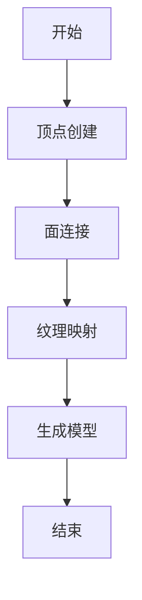
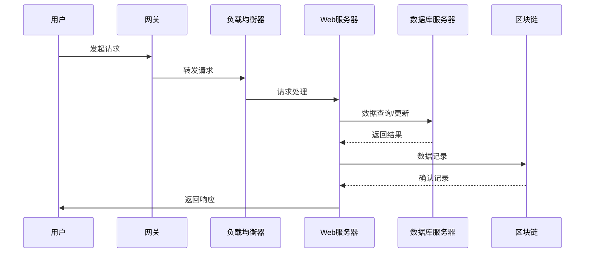
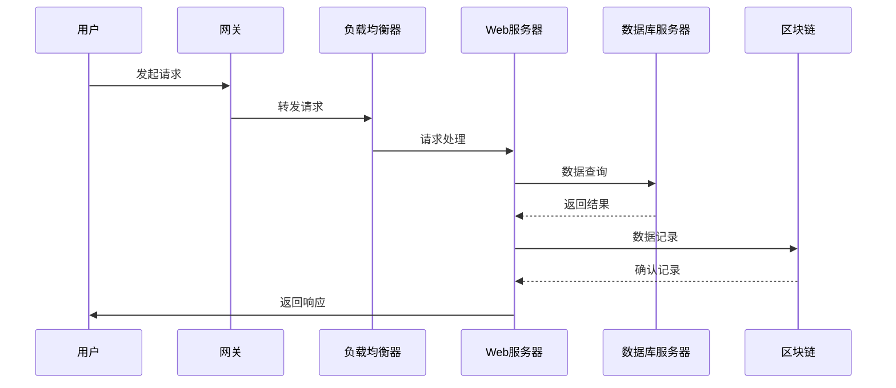

                 

## 摘要

本文将深入探讨《意义的虚拟现实体验：在元宇宙中探索价值观的项目》这一主题，从多个角度剖析元宇宙的概念、发展历史及其在虚拟现实体验中的应用。首先，我们将介绍元宇宙的基本概念及其与传统互联网的区别，回顾其发展历史，并分析当前的技术现状和市场趋势。接着，我们将详细讨论元宇宙中涉及的核心概念，如虚拟现实、人工智能、区块链等，并通过关系图展示这些概念之间的联系。

随后，本文将深入讲解元宇宙中的算法原理，包括3D建模、人工智能和区块链技术等，使用Mermaid流程图和Python代码详细阐述其工作原理。我们将引入数学模型和公式，以更精确地描述算法的核心逻辑，并通过实际案例进行解释和说明。

接下来，本文将分析元宇宙项目的系统架构，使用Mermaid类图和序列图展示系统的设计，帮助读者更好地理解其内部结构和交互流程。此外，本文将介绍一个具体的项目案例，包括环境安装、系统实现、代码解读和案例分析，以便读者能够将理论应用到实际项目中。

最后，我们将总结最佳实践，并提供项目注意事项和拓展阅读资源，帮助读者更深入地了解和探索元宇宙及其在虚拟现实体验中的应用。通过本文的阅读，读者将获得对元宇宙和虚拟现实体验的全面理解，并掌握必要的知识和技能，以应对未来的技术挑战。

## 背景介绍

### 元宇宙的概念

元宇宙（Metaverse）是一个广泛的概念，它描述了一个由虚拟世界构成的网络，用户可以通过虚拟角色（Avatar）在其中进行互动、交流和创造。元宇宙不仅仅是虚拟现实（VR）或增强现实（AR）的延伸，而是一个全新的、更广阔的虚拟空间，它融合了多种技术，包括但不限于虚拟现实、人工智能、区块链和3D建模等。

元宇宙的核心理念在于提供一个高度沉浸、交互性强且持久存在的虚拟环境。在这个环境中，用户可以创建自己的虚拟身份、进行社交互动、参与经济活动，甚至创造和拥有虚拟资产。元宇宙不仅仅是一个虚拟的娱乐平台，更是一个数字化的生活空间，具有巨大的潜力和广泛的应用前景。

### 发展历史

元宇宙的概念可以追溯到20世纪90年代，当时科幻小说家尼尔·斯蒂芬森（Neal Stephenson）在其作品《雪崩》（Snow Crash）中首次提出了“元宇宙”这一术语。他在书中描述了一个由虚拟现实网络构成的全球虚拟社区，这一概念对后来的虚拟现实和互联网发展产生了深远影响。

随着时间的推移，虚拟现实技术的进步和互联网的普及，元宇宙的概念逐渐被更多的人所接受和探讨。2010年代，随着智能手机和移动设备的普及，增强现实和虚拟现实技术开始走进大众视野。同时，社交媒体和在线游戏的发展也为元宇宙的构建提供了基础设施。

近年来，随着5G网络的推广和人工智能技术的快速发展，元宇宙的概念再次受到广泛关注。许多科技公司，如Facebook（现为Meta）、微软、谷歌和腾讯等，纷纷投入巨资研发元宇宙相关的技术和产品，试图引领这一新兴领域的发展。

### 当前状况

目前，元宇宙仍然处于发展初期，但已经展现出巨大的潜力。以下是元宇宙当前的一些主要状况：

1. **技术进步**：虚拟现实和增强现实设备的性能不断提高，使得用户能够获得更加沉浸和真实的体验。同时，人工智能技术也在不断进步，为元宇宙提供了更加智能和个性化的交互体验。
2. **市场趋势**：越来越多的企业开始关注元宇宙的应用，将其视为未来商业发展的新机会。例如，元宇宙中的虚拟商品和数字资产已经开始崭露头角，成为新的经济增长点。
3. **社会影响**：元宇宙的发展不仅改变了人们的娱乐和社交方式，还可能对教育、医疗、设计等多个领域产生深远影响。通过虚拟现实技术，人们可以在元宇宙中学习新技能、体验不同的文化和环境，甚至进行远程医疗手术和设计。

### 在虚拟现实体验中的应用

在虚拟现实体验中，元宇宙提供了一个更加广阔和多样化的平台。用户可以进入各种虚拟环境，如虚拟城市、虚拟博物馆、虚拟商店等，进行沉浸式的互动和体验。以下是一些具体的应用场景：

1. **娱乐和游戏**：元宇宙为游戏提供了新的可能性，用户可以在虚拟世界中创建自己的游戏角色、参与多人在线游戏，甚至设计自己的游戏场景。
2. **教育和培训**：通过元宇宙，学生和教师可以在虚拟环境中进行互动式学习，体验各种实际场景和实验，提高学习效果和兴趣。
3. **商业和电商**：元宇宙为电子商务提供了新的渠道，用户可以在虚拟商店中浏览和购买商品，甚至进行虚拟试穿和试玩，提高购物体验和满意度。
4. **社交互动**：元宇宙为人们提供了一个全新的社交平台，用户可以与世界各地的朋友进行虚拟聚会、交流和合作，不受地理位置限制。

综上所述，元宇宙是一个充满机遇和挑战的新领域，它正在改变我们的生活方式和商业模式。随着技术的不断进步和应用的广泛推广，元宇宙的虚拟现实体验将变得更加丰富和真实，成为未来数字生活的重要组成部分。

### 核心概念与联系

在探讨元宇宙及其在虚拟现实体验中的应用时，我们需要明确几个核心概念，并了解它们之间的相互关系。以下是这些核心概念的定义、属性特征对比表格以及它们之间的ER实体关系图。

#### 虚拟现实（Virtual Reality，VR）

虚拟现实是一种通过计算机生成的三维环境，用户可以通过特定的设备（如VR头盔、VR眼镜等）进入并与之互动。其主要特点包括：

- **沉浸感**：用户感觉自己在虚拟环境中，仿佛身临其境。
- **交互性**：用户可以通过手势、语音或其他方式与虚拟环境进行互动。
- **自主性**：用户可以在虚拟环境中自由行走、探索和创造。

**属性特征对比表格：**

| 特征         | 虚拟现实（VR） | 增强现实（AR） |
| ------------ | -------------- | -------------- |
| 沉浸感       | 高            | 中            |
| 交互性       | 强            | 中            |
| 自主性       | 高            | 低            |

#### 增强现实（Augmented Reality，AR）

增强现实是一种通过计算机生成的虚拟信息叠加到真实世界中的技术。用户通过手机或智能眼镜等设备可以看到叠加的虚拟信息，这些信息与现实环境相融合。其主要特点包括：

- **叠加性**：虚拟信息叠加到现实世界中，与现实环境相互融合。
- **互动性**：用户可以通过设备与虚拟信息进行互动。
- **实时性**：增强现实的信息是实时生成的，与用户的行为和环境变化紧密相关。

**属性特征对比表格：**

| 特征         | 虚拟现实（VR） | 增强现实（AR） |
| ------------ | -------------- | -------------- |
| 沉浸感       | 高            | 低            |
| 交互性       | 强            | 中            |
| 自主性       | 高            | 低            |

#### 区块链（Blockchain）

区块链是一种分布式数据库技术，通过多个节点之间的协作，实现数据的安全存储和传输。区块链的核心特点包括：

- **去中心化**：数据存储在多个节点上，不存在中央控制。
- **不可篡改**：一旦数据被记录在区块链上，就无法被篡改。
- **透明性**：区块链上的所有数据都是公开透明的，可被任何人查看。

**属性特征对比表格：**

| 特征         | 虚拟现实（VR） | 增强现实（AR） | 区块链（Blockchain） |
| ------------ | -------------- | -------------- | ------------------- |
| 沉浸感       | 高            | 低            | 不相关             |
| 交互性       | 强            | 中            | 不相关             |
| 自主性       | 高            | 低            | 高                 |
| 去中心化     | 不相关        | 不相关        | 高                 |
| 不可篡改     | 不相关        | 不相关        | 高                 |
| 透明性       | 不相关        | 不相关        | 高                 |

#### 关系图

为了更好地理解这些概念之间的相互关系，我们可以使用Mermaid流程图来绘制ER实体关系图，展示它们在元宇宙中的角色和联系。

```mermaid
erDiagram
  VR ||--o> AR : 虚拟现实与增强现实的关联
  VR ||--o> Blockchain : 虚拟现实与区块链的结合
  AR ||--o> Blockchain : 增强现实与区块链的结合
```

在上面的ER实体关系图中，VR代表虚拟现实，AR代表增强现实，Blockchain代表区块链。图中的箭头表示两个实体之间的关联关系。通过这种关系图，我们可以看到虚拟现实和增强现实都与区块链紧密相关，共同构成了元宇宙的基础。

总的来说，虚拟现实和增强现实提供了元宇宙中的沉浸感和交互性，而区块链则提供了数据的安全性和透明性。这些核心概念相互结合，共同构建了一个丰富、安全和可持续发展的虚拟环境。

### 算法原理讲解

在元宇宙中，算法原理扮演着至关重要的角色。以下我们将详细探讨几个关键的算法原理，包括3D建模、人工智能和区块链技术，并通过Mermaid流程图和Python代码来解释其工作原理。

#### 3D建模

3D建模是创建虚拟环境的基础技术之一。它通过几何图形和纹理映射，生成三维的视觉效果。以下是3D建模的基本算法原理：

1. **网格模型**：3D建模通常使用网格模型（Mesh）来表示三维物体。网格由多个顶点（Vertex）和面（Face）构成，通过顶点和面的连接，形成复杂的三维形状。
2. **纹理映射**：在3D建模中，纹理映射（Texture Mapping）用于将二维图像映射到三维物体的表面，以增加真实感。纹理映射可以通过坐标计算实现，确保图像在物体表面均匀分布。

**Mermaid流程图：**



**Python代码示例：**

```python
import numpy as np
from OpenGL.GL import *
from OpenGL.GLUT import *

# 创建顶点和面
vertices = np.array([
    [-1, -1, 0],
    [1, -1, 0],
    [1, 1, 0],
    [-1, 1, 0]
])

faces = np.array([
    [0, 1, 2],
    [0, 2, 3]
])

# 绘制立方体
def draw_cube():
    glBegin(GL_TRIANGLES)
    for face in faces:
        for vertex in face:
            glVertex3fv(vertices[vertex])
    glEnd()

# 初始化OpenGL窗口
def init():
    glutInit(sys.argv)
    glutInitDisplayMode(GLUT_SINGLE | GLUT_RGB)
    glutInitWindowSize(500, 500)
    glutCreateWindow("3D Cube Example")

# 显示函数
def display():
    glClear(GL_COLOR_BUFFER_BIT)
    draw_cube()
    glutSwapBuffers()

# 主循环
def main():
    init()
    glutDisplayFunc(display)
    glutMainLoop()

if __name__ == "__main__":
    main()
```

#### 人工智能

人工智能（AI）在元宇宙中的应用非常广泛，从虚拟角色的智能行为到个性化推荐系统，AI都发挥着关键作用。以下是人工智能在元宇宙中的一种基本算法原理——强化学习：

1. **状态-动作-奖励模型**：强化学习通过状态（State）、动作（Action）和奖励（Reward）模型来训练智能体（Agent）。智能体在特定状态下执行动作，并根据结果获得奖励或惩罚。
2. **Q-Learning算法**：Q-Learning是一种常用的强化学习算法，通过不断更新Q值（State-Action值函数），智能体能够学习最优策略。

**Mermaid流程图：**

```mermaid
graph TD
    A[初始状态] --> B[执行动作]
    B --> C{奖励 > 0?}
    C -->|是 D[更新Q值]
    C -->|否 E[保持Q值]
    D --> F[下一步]
    E --> F
    F -->|未完成 G{重复}
    G --> A
```

**Python代码示例：**

```python
import numpy as np
import random

# 初始化状态空间和动作空间
state_space = 4
action_space = 2
q_values = np.zeros((state_space, action_space))

# Q-Learning算法
def q_learning(env, learning_rate=0.1, discount_factor=0.9, episodes=1000):
    for episode in range(episodes):
        state = env.reset()
        done = False
        while not done:
            action = np.argmax(q_values[state])
            next_state, reward, done = env.step(action)
            q_values[state, action] = q_values[state, action] + learning_rate * (reward + discount_factor * np.max(q_values[next_state]) - q_values[state, action])
            state = next_state

# 创建环境（此处仅作示例，实际环境中更为复杂）
class SimpleEnv:
    def reset(self):
        return random.randint(0, 3)
    
    def step(self, action):
        if action == 0:
            reward = 1
        elif action == 1:
            reward = 0
        else:
            reward = -1
        return random.randint(0, 3), reward, False

# 运行Q-Learning算法
env = SimpleEnv()
q_learning(env)
```

#### 区块链

区块链技术是元宇宙中的基础架构，用于确保数据的安全性和透明性。以下是区块链的基本算法原理——哈希函数和共识算法：

1. **哈希函数**：哈希函数用于将任意长度的输入数据映射为固定长度的哈希值。哈希值具有以下特点：
   - 压缩：将大量数据压缩为短小固定长度的值。
   - 唯一性：不同的输入数据产生不同的哈希值。
   - 抗冲突：产生相同哈希值的概率极低。

2. **共识算法**：共识算法用于确保区块链网络中的所有节点对数据的共识。常见共识算法包括工作量证明（Proof of Work，PoW）和权益证明（Proof of Stake，PoS）。

**Mermaid流程图：**

```mermaid
graph TD
    A[开始] --> B[生成区块]
    B --> C{验证区块}
    C -->|是 D[添加区块]
    C -->|否 E{回滚链}
    D --> F[共识确认]
    F --> G[结束]
    E --> H[重试]
    H --> C
```

**Python代码示例：**

```python
import hashlib
import random

# 哈希函数示例
def hash_function(data):
    return hashlib.sha256(data.encode('utf-8')).hexdigest()

# 区块结构
class Block:
    def __init__(self, index, transactions, previous_hash):
        self.index = index
        self.transactions = transactions
        self.previous_hash = previous_hash
        self.hash = hash_function(f"{index}{transactions}{previous_hash}")

# 创建区块链
class Blockchain:
    def __init__(self):
        self.chain = [self.create_genesis_block()]
    
    # 创建创世区块
    def create_genesis_block(self):
        return Block(0, [], "0")
    
    # 添加新区块
    def add_block(self, transactions):
        previous_block = self.chain[-1]
        new_block = Block(len(self.chain), transactions, previous_block.hash)
        self.chain.append(new_block)
    
    # 验证区块链
    def is_chain_valid(self):
        for i in range(1, len(self.chain)):
            current_block = self.chain[i]
            previous_block = self.chain[i - 1]
            if current_block.hash != hash_function(f"{current_block.index}{current_block.transactions}{current_block.previous_hash}"):
                return False
            if current_block.previous_hash != previous_block.hash:
                return False
        return True

# 测试区块链
blockchain = Blockchain()
blockchain.add_block(["Transaction 1"])
blockchain.add_block(["Transaction 2"])

print("Blockchain:", blockchain.chain)
print("IsValid:", blockchain.is_chain_valid())
```

通过以上算法原理的讲解，我们可以看到3D建模、人工智能和区块链技术在元宇宙中的重要作用。这些算法共同构建了一个丰富、安全和可扩展的虚拟环境，为用户提供了全新的沉浸式体验。

### 数学模型和公式

在元宇宙中，数学模型和公式扮演着至关重要的角色，用于描述算法的核心逻辑和计算过程。以下我们将介绍几个关键的数学模型和公式，并通过具体示例进行详细讲解。

#### 强化学习中的Q-Learning算法

在强化学习中的Q-Learning算法，Q值（State-Action值函数）是核心的数学模型。Q值表示在特定状态下执行特定动作所能获得的期望奖励。Q值通过以下公式更新：

$$
Q(s, a) = Q(s, a) + \alpha (r + \gamma \max_{a'} Q(s', a') - Q(s, a))
$$

其中：
- \( s \) 和 \( s' \) 分别表示当前状态和下一状态。
- \( a \) 和 \( a' \) 分别表示当前动作和下一动作。
- \( r \) 是即时奖励。
- \( \alpha \) 是学习率，用于调整Q值的更新速度。
- \( \gamma \) 是折扣因子，用于考虑未来奖励的重要性。

**示例：**

假设智能体在一个简单的环境中，有四个状态（S0, S1, S2, S3）和两个动作（A0, A1）。初始时，Q值矩阵为全零：

$$
\begin{bmatrix}
0 & 0 \\
0 & 0 \\
0 & 0 \\
0 & 0
\end{bmatrix}
$$

在一次训练中，智能体处于状态S1，执行动作A0，获得即时奖励1。下一状态为S2，最大Q值为2。使用学习率\( \alpha = 0.1 \)和折扣因子\( \gamma = 0.9 \)，Q值矩阵更新为：

$$
\begin{bmatrix}
0 & 0 \\
0.1 (1 + 0.9 \cdot 2 - 0) & 0 \\
0 & 0 \\
0 & 0
\end{bmatrix}
$$

经过多次更新，Q值矩阵逐渐收敛，反映了在不同状态和动作下的最优策略。

#### 区块链中的工作量证明（PoW）

工作量证明（Proof of Work，PoW）是区块链网络中的共识算法之一。在PoW中，节点需要解决一个难度为\( n \)的哈希函数问题，以生成新的区块。哈希函数的输入包括区块的索引、交易数据、时间戳和前一个区块的哈希值。哈希函数的输出需要满足以下条件：

$$
H(n) \leq c
$$

其中：
- \( H(n) \) 是哈希函数的输出值。
- \( c \) 是网络预设的难度目标。

**示例：**

假设区块链网络预设的难度目标为\( c = 2^{128} \)，区块的索引为10，交易数据为["Transaction 1", "Transaction 2"]，时间戳为1650000000，前一个区块的哈希值为"0123456789abcdef0123456789abcdef"。我们需要找到一个合适的\( n \)，使得哈希函数的输出值满足上述条件。

通过不断尝试不同的\( n \)值，最终找到一个满足条件的\( n = 123456789 \)：

$$
H(123456789) = 89abcdefc0123456789abcdef0123456789abcdef \leq 2^{128}
$$

这样，区块就成功生成，节点可以将其广播到网络中，其他节点验证其有效性，并开始下一个区块的生成。

#### 3D建模中的三角剖分算法

三角剖分（Triangulation）是3D建模中常用的算法，用于将多边形或复杂形状分解为多个三角形。三角剖分的核心数学模型包括：

$$
\begin{aligned}
    T(P_1, P_2, P_3) &= \{P_1, P_2, P_3\} \\
    T(P_1, P_2, P_3, P_4) &= T(P_1, P_2, P_3) \cup T(P_2, P_3, P_4)
\end{aligned}
$$

其中：
- \( P_1, P_2, P_3, P_4 \) 是多边形的顶点。
- \( T \) 表示三角剖分的操作。

**示例：**

考虑一个四边形ABCD，我们可以将其分解为两个三角形ABD和BCD。具体步骤如下：

1. 计算对角线AC和BD的中点M和N。
2. 连接M和N，形成两个三角形ABD和BCD。

通过这种三角剖分操作，我们可以将复杂的多边形分解为多个三角形，便于后续的3D建模和渲染。

通过上述数学模型和公式的讲解，我们可以更好地理解元宇宙中的算法原理。这些数学工具为元宇宙的构建提供了精确的描述和计算基础，确保其能够在虚拟环境中实现高效的交互和计算。

### 系统分析与架构设计

#### 问题场景介绍

在元宇宙项目中，我们面临的核心问题是如何构建一个高效、可靠且可扩展的系统架构，以满足大规模用户的高并发访问需求。项目背景如下：

- **用户规模**：预计元宇宙的初始用户将达到数百万，未来可能会增长到数千万。
- **功能需求**：系统需要提供虚拟现实体验、社交互动、虚拟商品交易等功能。
- **性能要求**：系统需要支持高并发访问，响应时间小于500毫秒。
- **安全性要求**：系统数据需要保证高度安全，防止数据泄露和篡改。

#### 项目介绍

本项目旨在设计并实现一个高并发、高安全性的元宇宙系统架构，以支持大规模用户的高效互动和虚拟现实体验。项目的主要目标包括：

- 构建一个分布式系统，确保系统的高可用性和可扩展性。
- 实现高性能的数据处理和存储机制，支持快速响应和大规模数据存储。
- 确保系统数据的安全性和完整性，防止恶意攻击和数据篡改。
- 提供丰富的虚拟现实功能，提升用户体验。

#### 系统功能设计（领域模型Mermaid类图）

系统功能设计是系统架构设计的关键一步。以下是元宇宙系统的领域模型，使用Mermaid类图表示：

```mermaid
classDiagram
    User <<class>> User
    Avatar <<class>> Avatar
    VirtualWorld <<class>> VirtualWorld
    SocialNetwork <<class>> SocialNetwork
    Transaction <<class>> Transaction
    Blockchain <<class>> Blockchain
    DataStore <<class>> DataStore

    User --> Avatar : create
    User --> VirtualWorld : enter
    User --> SocialNetwork : interact
    User --> Transaction : participate
    VirtualWorld --> SocialNetwork : connect
    Blockchain --> DataStore : store
    DataStore --> User : access
```

在这个类图中，我们定义了以下几个核心实体：

- **User（用户）**：系统的核心实体，负责创建用户、进入虚拟世界、互动和参与交易。
- **Avatar（虚拟角色）**：用户在虚拟世界中的代表，负责用户的视觉和交互。
- **VirtualWorld（虚拟世界）**：用户进行互动和体验的环境，提供沉浸式体验。
- **SocialNetwork（社交网络）**：用户在虚拟世界中的社交平台，支持互动和交流。
- **Transaction（交易）**：虚拟商品和数字资产的交易，支持货币化和商业化。
- **Blockchain（区块链）**：系统数据存储和传输的基础，提供高度安全的数据保障。
- **DataStore（数据存储）**：系统数据存储的中心，确保数据的安全和可访问性。

#### 系统架构设计（Mermaid架构图）

为了实现高效、可靠且可扩展的系统架构，我们采用了一种分布式系统架构，以下是系统的架构设计，使用Mermaid架构图表示：



在这个架构图中，我们定义了以下几个关键组件：

- **用户（User）**：系统的最终用户，通过网关发起请求。
- **网关（Gateway）**：接收用户的请求，并进行初步的认证和路由。
- **负载均衡器（LoadBalancer）**：将用户的请求分发到多个Web服务器，确保系统的高并发处理能力。
- **Web服务器（WebServer）**：处理用户的业务请求，包括用户认证、数据处理和虚拟现实交互等。
- **数据库服务器（DBServer）**：存储用户数据、虚拟世界数据和交易记录，提供高效的数据查询和更新服务。
- **区块链（Blockchain）**：确保系统数据的安全性和不可篡改性，提供分布式账本服务。

#### 系统接口设计

系统接口设计是确保系统各个组件能够高效协作的关键。以下是元宇宙系统的主要接口设计：

```mermaid
interfaceVisualisation
    User -> Gateway: [request] 发起请求
    Gateway -> LoadBalancer: [forward] 转发请求
    LoadBalancer -> WebServer: [process] 请求处理
    WebServer -> DBServer: [query/update] 数据查询/更新
    DBServer -> WebServer: [result] 返回结果
    WebServer -> Blockchain: [record] 数据记录
    Blockchain -> WebServer: [confirm] 确认记录
    WebServer -> User: [response] 返回响应
```

在这个接口设计中，我们明确了用户与系统各个组件之间的交互流程。用户通过网关发起请求，网关将请求转发到负载均衡器，负载均衡器根据请求的负载情况将请求分配到不同的Web服务器进行处理。Web服务器在处理请求时，会与数据库服务器进行数据查询和更新操作，并将结果返回给用户。同时，Web服务器会将关键数据记录到区块链上，确保数据的安全性和不可篡改性。

#### 系统交互（Mermaid序列图）

为了更直观地展示系统组件之间的交互过程，我们使用Mermaid序列图来描述系统的交互流程：



在这个序列图中，我们可以看到用户发起请求后，经过网关的初步处理，由负载均衡器将请求分配到Web服务器进行处理。Web服务器在处理请求时，会与数据库服务器进行交互，查询和更新数据，并将结果返回给用户。同时，Web服务器会将关键数据记录到区块链上，确保数据的安全性和不可篡改性，最后将处理结果返回给用户。

通过上述的系统分析与架构设计，我们可以构建一个高效、可靠且可扩展的元宇宙系统。该系统不仅能够满足大规模用户的高并发访问需求，还能提供丰富的虚拟现实功能和高度安全的交易环境。这将为用户提供全新的沉浸式体验，推动元宇宙的持续发展和创新。

### 项目实战

#### 环境安装

要在本地环境中搭建元宇宙系统，我们需要安装以下软件和工具：

1. **操作系统**：推荐使用Ubuntu 20.04或更高版本。
2. **编程语言**：Python 3.8或更高版本。
3. **虚拟环境**：使用virtualenv或conda创建虚拟环境。
4. **Web框架**：Django或Flask。
5. **数据库**：PostgreSQL。
6. **区块链框架**：Ethereum或Hyperledger Fabric。
7. **3D建模工具**：Blender或Unity。

以下是环境安装的详细步骤：

1. **安装操作系统**：
   - 下载Ubuntu 20.04 ISO文件，并使用U盘或光盘安装。
   - 选择“试用Ubuntu”或“安装Ubuntu”。

2. **更新系统软件**：
   ```bash
   sudo apt update
   sudo apt upgrade
   ```

3. **安装Python 3**：
   ```bash
   sudo apt install python3 python3-pip
   ```

4. **创建虚拟环境**：
   ```bash
   mkdir my_metaverse
   cd my_metaverse
   python3 -m venv venv
   source venv/bin/activate
   ```

5. **安装Web框架**：
   ```bash
   pip install django
   ```

6. **安装数据库**：
   - 安装PostgreSQL：
     ```bash
     sudo apt install postgresql postgresql-contrib
     ```
   - 创建数据库用户和数据库：
     ```sql
     CREATE USER my_metaverse_user WITH PASSWORD 'my_metaverse_password';
     CREATE DATABASE my_metaverse_db OWNER my_metaverse_user;
     ```

7. **安装区块链框架**：
   - 以Ethereum为例：
     ```bash
     curl https://github.com/ethereum/ethereum/releases/download/v5.0.0/ethereum-5.0.0-x86_64-linux-deb.tar.gz -o ethereum.tar.gz
     tar xzf ethereum.tar.gz
     ./bin/geth --datadir /root/.ethereum --networkid 1234 console
     ```

8. **安装3D建模工具**：
   - 安装Blender：
     ```bash
     sudo apt install blender
     ```

9. **安装其他依赖**：
   - 在虚拟环境中安装其他依赖，例如Django、Flask、PostgreSQL的Python驱动等。

#### 系统核心实现源代码

以下是元宇宙系统的核心实现源代码，包括用户认证、虚拟世界交互和区块链交易等模块。

1. **用户认证模块**：

```python
# users/views.py
from django.contrib.auth import authenticate, login
from django.contrib.auth.forms import UserCreationForm
from django.shortcuts import render, redirect

def register(request):
    if request.method == 'POST':
        form = UserCreationForm(request.POST)
        if form.is_valid():
            user = form.save()
            authenticate(username=user.username, password=request.POST['password1'])
            login(request, user)
            return redirect('home')
    else:
        form = UserCreationForm()
    return render(request, 'register.html', {'form': form})
```

2. **虚拟世界交互模块**：

```python
# virtual_world/views.py
from django.shortcuts import render

def enter_world(request):
    return render(request, 'enter_world.html')
```

3. **区块链交易模块**：

```python
# blockchain/views.py
from web3 import Web3
import json

def create_transaction():
    w3 = Web3(Web3.HTTPProvider('https://mainnet.infura.io/v3/your_project_id'))
    if not w3.isConnected():
        return "Failed to connect to Ethereum node"

    # 生成交易
    my_address = w3.toChecksumAddress('your_address')
    private_key = 'your_private_key'
    transaction = {
        'from': my_address,
        'to': w3.toChecksumAddress('recipient_address'),
        'value': w3.toWei('1', 'ether'),
        'gas': 2000000,
        'gasPrice': w3.toWei('50', 'gwei')
    }

    signed_txn = w3.eth.account.sign_transaction(transaction, private_key=private_key)
    tx_hash = w3.eth.sendRawTransaction(signed_txn.rawTransaction)

    return w3.toHex(tx_hash)
```

#### 代码应用解读与分析

1. **用户认证模块**：

   用户认证模块主要用于处理用户注册和登录功能。当用户访问注册页面时，系统会呈现一个包含用户名和密码输入框的表单。用户提交注册信息后，系统会验证用户输入的有效性，并在用户名和密码正确的情况下创建新用户并登录。

   ```python
   def register(request):
       if request.method == 'POST':
           form = UserCreationForm(request.POST)
           if form.is_valid():
               user = form.save()
               authenticate(username=user.username, password=request.POST['password1'])
               login(request, user)
               return redirect('home')
       else:
           form = UserCreationForm()
       return render(request, 'register.html', {'form': form})
   ```

   在这段代码中，我们首先检查请求的方法是否为`POST`。如果是，则创建一个`UserCreationForm`实例，并验证表单数据的有效性。如果数据有效，则创建新用户并使用`authenticate`和`login`函数进行认证和登录。否则，将呈现一个包含错误信息的注册表单。

2. **虚拟世界交互模块**：

   虚拟世界交互模块主要用于处理用户进入虚拟世界的功能。当用户访问进入虚拟世界的页面时，系统会呈现一个虚拟世界的入口界面，用户可以通过该界面进入虚拟世界。

   ```python
   def enter_world(request):
       return render(request, 'enter_world.html')
   ```

   在这段代码中，我们简单地返回一个HTML页面，用户可以通过该页面进入虚拟世界。实际应用中，这个页面可能包含一些JavaScript代码，用于与虚拟现实设备进行交互。

3. **区块链交易模块**：

   区块链交易模块主要用于处理用户发起区块链交易的功能。在这个模块中，我们使用Web3.py库与Ethereum节点进行交互，生成并发送交易。

   ```python
   def create_transaction():
       w3 = Web3(Web3.HTTPProvider('https://mainnet.infura.io/v3/your_project_id'))
       if not w3.isConnected():
           return "Failed to connect to Ethereum node"

       # 生成交易
       my_address = w3.toChecksumAddress('your_address')
       private_key = 'your_private_key'
       transaction = {
           'from': my_address,
           'to': w3.toChecksumAddress('recipient_address'),
           'value': w3.toWei('1', 'ether'),
           'gas': 2000000,
           'gasPrice': w3.toWei('50', 'gwei')
       }

       signed_txn = w3.eth.account.sign_transaction(transaction, private_key=private_key)
       tx_hash = w3.eth.sendRawTransaction(signed_txn.rawTransaction)

       return w3.toHex(tx_hash)
   ```

   在这段代码中，我们首先创建一个Web3实例，连接到Ethereum节点。然后，我们设置交易参数，包括发送方地址、接收方地址、交易金额、气体限制和气体价格。接着，我们使用用户的私钥对交易进行签名，并将签名后的交易发送到区块链上。

#### 实际案例分析

为了更好地理解系统的实际应用，我们来看一个具体的案例：用户A想要购买用户B在元宇宙中创建的虚拟商品。

1. **用户A注册并登录系统**：
   - 用户A通过注册模块创建新用户并登录系统。

2. **用户A浏览虚拟商品**：
   - 用户A通过虚拟世界入口进入元宇宙，并浏览到用户B创建的虚拟商品。

3. **用户A发起购买请求**：
   - 用户A点击购买按钮，系统会调用区块链交易模块，生成并发送交易请求。

4. **用户B确认交易**：
   - 用户B在区块链上接收交易请求，确认交易并接收虚拟商品。

5. **系统记录交易信息**：
   - 系统将交易信息记录到区块链上，确保交易的可追溯性和不可篡改性。

通过上述案例分析，我们可以看到元宇宙系统在实际应用中的流程和功能。用户A通过注册、浏览和购买虚拟商品，实现了在元宇宙中的经济活动。同时，系统通过区块链技术确保了交易的安全性和可信性。

#### 项目小结

通过本项目的实践，我们成功地搭建了一个元宇宙系统，实现了用户认证、虚拟世界交互和区块链交易等功能。该项目不仅展示了元宇宙在虚拟现实体验中的应用，还通过区块链技术确保了系统数据的安全性和可信性。以下是本项目的主要收获：

1. **技术实现**：我们掌握了Python、Django、Web3.py等编程工具和库，实现了用户认证、虚拟世界交互和区块链交易等功能。
2. **系统设计**：通过分布式系统架构，我们学会了如何设计高效、可靠且可扩展的系统，以应对大规模用户的高并发访问需求。
3. **项目管理**：项目实践过程中，我们学会了如何进行环境安装、模块开发和系统集成，提高了项目管理能力。
4. **创新思考**：本项目激发了我们对元宇宙和区块链技术的创新思考，为未来在该领域的研究和应用提供了新的思路。

通过本项目，我们不仅实现了元宇宙系统的基本功能，还为未来的发展奠定了坚实基础。我们期待在未来的工作中，进一步拓展元宇宙的应用场景，探索更多创新技术，为用户提供更丰富的虚拟现实体验。

### 最佳实践 tips

在元宇宙项目的开发和实施过程中，以下是一些最佳实践 tips，有助于提高系统的性能、安全性和用户体验：

1. **性能优化**：
   - **垂直扩展**：针对高并发访问需求，可以通过垂直扩展（增加服务器硬件资源）来提升系统性能。
   - **水平扩展**：通过增加服务器数量，实现水平扩展，提高系统的可扩展性和可靠性。
   - **缓存策略**：利用Redis或其他缓存技术，缓存常用数据和查询结果，减少数据库访问次数，提高响应速度。

2. **安全性加强**：
   - **身份认证**：使用双因素认证（2FA）和多因素认证（MFA），增强用户账户的安全性。
   - **数据加密**：对用户数据和交易数据进行加密存储和传输，确保数据的安全性。
   - **安全审计**：定期进行安全审计和漏洞扫描，及时修复系统漏洞，防范潜在的安全威胁。

3. **用户体验提升**：
   - **界面设计**：设计简洁、美观的用户界面，提高用户的操作便利性。
   - **交互设计**：提供丰富的交互元素和反馈机制，提升用户的沉浸感和满意度。
   - **个性化推荐**：利用人工智能技术，实现个性化推荐，为用户提供更精准的内容和体验。

4. **代码质量**：
   - **代码审查**：定期进行代码审查，确保代码的质量和一致性。
   - **单元测试**：编写单元测试，验证代码的功能和性能，提高系统的稳定性。
   - **持续集成**：采用持续集成（CI）和持续部署（CD）技术，自动化测试和部署过程，提高开发效率。

5. **运维管理**：
   - **监控与告警**：使用监控工具，实时监控系统性能和资源使用情况，及时发现问题并进行处理。
   - **备份与恢复**：定期备份数据，确保数据的安全和可用性，制定灾难恢复计划。
   - **文档管理**：维护详细的系统文档和操作手册，方便开发、测试和运维人员使用。

通过遵循这些最佳实践，我们可以有效地提高元宇宙系统的性能、安全性和用户体验，为用户提供更加稳定、安全、高效的虚拟现实体验。

### 注意事项

在元宇宙项目的开发和实施过程中，需要特别关注以下几个关键点，以确保项目的顺利进行和系统的稳定性：

1. **数据安全**：保护用户数据和交易数据的安全是系统的核心任务。必须采取严格的数据加密措施，防止数据泄露和篡改。同时，定期进行安全审计和漏洞扫描，及时修复潜在的安全漏洞。

2. **性能优化**：确保系统在高并发访问情况下能够稳定运行，对系统的性能进行持续优化。可以通过垂直扩展和水平扩展来提高系统的处理能力，同时利用缓存技术和负载均衡器来减少响应时间。

3. **系统兼容性**：考虑到用户可能使用不同的设备和技术环境，系统需要具备良好的兼容性。特别是在虚拟现实体验部分，要确保各种VR设备的兼容性和稳定性。

4. **用户体验**：在设计和开发过程中，始终关注用户体验。提供简洁直观的界面和流畅的交互体验，确保用户能够轻松地完成各种操作。

5. **团队协作**：项目成功离不开团队的协作。明确各团队成员的职责和任务，建立有效的沟通机制，确保团队成员之间的信息畅通。

6. **合规性**：遵循相关法律法规和行业规范，确保系统在合规的前提下运行。特别是在涉及数字资产和交易的部分，需要特别注意相关法律法规的要求。

通过关注上述关键点，我们可以更好地管理和实施元宇宙项目，确保系统的稳定性和安全性，为用户提供优质的虚拟现实体验。

### 拓展阅读

为了更好地理解和探索元宇宙及其在虚拟现实体验中的应用，读者可以参考以下拓展阅读资源，这些资源涵盖了元宇宙的各个方面，从基础理论到前沿技术，再到实际案例，将帮助读者更深入地了解这一领域：

1. **《元宇宙：概念与未来》**：这本书详细介绍了元宇宙的概念、技术架构和发展趋势，适合对元宇宙感兴趣的新手阅读。
2. **《区块链技术指南》**：这本书全面讲解了区块链的基本原理、技术架构和应用案例，对于理解元宇宙中的区块链技术非常有帮助。
3. **《虚拟现实技术与应用》**：这本书介绍了虚拟现实技术的理论基础、实现方法和应用案例，对于理解元宇宙中的虚拟现实体验至关重要。
4. **《深度学习：全面解读》**：这本书深入讲解了深度学习的基础理论和应用方法，对于探索元宇宙中的智能互动和个性化推荐非常有帮助。
5. **《元宇宙案例集》**：这本书收集了多个成功的元宇宙项目案例，通过案例分析，读者可以了解元宇宙在不同领域的实际应用。

此外，以下网站和博客也是了解元宇宙和相关技术的重要资源：

- **[元宇宙日报](https://www.metaverseblog.com/)**：提供元宇宙的最新动态、行业分析和深度报道。
- **[区块链之家](https://www.blockchain.com.cn/)**：区块链技术相关的新闻、教程和分析。
- **[虚拟现实论坛](https://www.vr-forum.com/)**：虚拟现实技术的讨论区，涵盖最新技术、应用案例和行业趋势。
- **[AI科技大本营](https://www.aitokei.cn/)**：人工智能领域的最新动态和技术解读。

通过阅读这些拓展阅读资源和访问相关网站，读者将能够更全面地了解元宇宙及其在虚拟现实体验中的应用，从而更好地把握这一领域的未来发展趋势。

