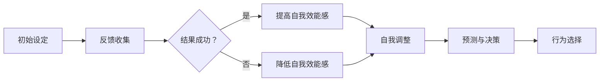
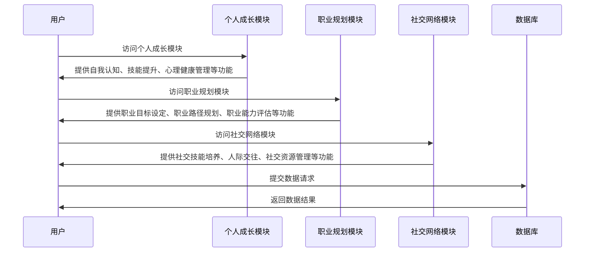

                 

### 文章标题

现代社会中，个体自我价值的重塑已经成为一个不可忽视的话题。随着社会结构的不断演变和科技的迅猛发展，人们对于自我价值的认知和实现方式也发生了深刻的变化。本文将以“意义的重塑：如何在现代社会中实现自我价值”为主题，深入探讨这一重要议题。文章将分为以下几个部分：

1. **背景介绍**：首先，我们将简要回顾现代社会中自我价值实现的背景，包括社会变迁、科技进步以及个人成长等因素。
2. **核心概念与联系**：接下来，我们将详细阐述自我价值的定义、特性以及其与社会、科技、文化等领域的联系。
3. **算法原理讲解**：本文将通过具体案例，介绍如何通过自我认知、社交互动、职业发展等途径实现自我价值的提升，并运用数学模型和公式进行解析。
4. **系统分析与架构设计方案**：我们将分析实现自我价值提升的系统架构，包括个人成长、职业规划、社交网络等模块，并设计相应的系统架构图。
5. **项目实战**：通过实际案例展示如何应用所学知识和技能实现自我价值的提升，并进行详细解读和分析。
6. **最佳实践 tips、小结、注意事项、拓展阅读等内容**：最后，我们将总结实践经验，提供实用建议，并推荐进一步学习和阅读的资源。

希望通过这篇文章，您能对如何在现代社会中实现自我价值有一个更深刻的理解和思考。

### 关键词

- **自我价值**：个体在社会中对自己角色的认知和评价。
- **社会变迁**：社会结构、文化价值观的演变。
- **科技进步**：技术发展对个体和社会的影响。
- **自我认知**：个体对自身能力、性格、价值观等的认识。
- **社交互动**：个体通过社交网络实现价值的方式。
- **职业发展**：个体在职业生涯中实现自我价值的过程。
- **数学模型**：用于描述和预测个体行为和价值的数学方法。
- **系统架构**：实现自我价值提升的技术方案设计。

### 摘要

本文旨在探讨如何在现代社会中实现自我价值。通过对社会变迁、科技进步和个人成长的背景介绍，文章将深入分析自我价值的定义、特性及其与社会、科技、文化的联系。通过具体案例和算法原理讲解，文章将展示如何通过自我认知、社交互动和职业发展等途径提升自我价值。此外，文章还将介绍实现自我价值提升的系统架构，并通过实际项目展示如何应用这些知识和技能。最终，文章将提供最佳实践建议和拓展阅读资源，引导读者深入思考自我价值的实现方法。

### 第1章：现代社会与自我价值的理解

#### 1.1 问题背景

现代社会正处于快速变迁之中，这种变迁深刻地影响着个体的生活和社会结构。首先，社会变迁表现在经济全球化和信息技术的飞速发展。这些变化使得人们的工作方式、生活方式以及价值观念都发生了巨大的转变。例如，传统行业逐渐被高科技产业所取代，人们对职业选择和发展的期望也发生了变化。其次，科技进步不仅改变了生产方式，还改变了人们获取知识和信息的途径，从而对个体的认知、思维和行为产生了深远的影响。最后，个人成长在现代社会中也变得越来越重要。随着教育资源的丰富和自我提升意识的增强，个人成长成为实现自我价值的重要途径。

在这样一个复杂多变的社会环境中，个体的自我价值实现面临着前所未有的挑战和机遇。一方面，社会变迁和科技进步为个体提供了更多的机会，使得人们能够通过不同的途径实现自我价值；另一方面，这些变化也带来了新的不确定性和竞争压力，要求个体具备更强的适应能力和创新能力。因此，如何在这个时代中找到并实现自我价值，成为每个人都需要面对的重要课题。

#### 1.1.1 社会变迁的影响

社会变迁对个体的影响主要体现在以下几个方面。首先，经济全球化带来了职业选择的多样性。传统的职业路径逐渐被打破，个体可以更加自由地选择适合自己的职业。然而，这也意味着个体需要不断学习和适应新的行业和技能。其次，信息技术的快速发展改变了人们的社交方式和生活习惯。网络社交、在线学习和远程工作成为新的常态，个体在获取信息和资源方面拥有了更多的选择和便利。然而，这也可能导致人与人之间的真实连接减少，人际关系的复杂性和压力增加。最后，个人成长在现代社会中越来越受到重视。随着教育资源的普及和教育理念的转变，个体可以通过不断学习和自我提升来拓展自己的能力和视野，从而实现自我价值的提升。

#### 1.1.2 个人成长的挑战

个人成长在现代社会中既是机遇也是挑战。首先，个人成长意味着个体需要不断学习和适应新的知识和技能。这要求个体具备较强的学习能力和自我驱动力。然而，现代社会中的信息过载和学习资源的多样性也可能导致学习负担加重，个体容易感到迷茫和焦虑。其次，个人成长要求个体具备自我认知和自我反思的能力。通过了解自己的优点和不足，个体可以更好地规划自己的职业发展和人生目标。然而，自我认知和自我反思需要个体具备一定的心理成熟度和自我意识。对于很多人来说，这并不容易实现。最后，个人成长还面临外部环境的挑战。现代社会中的竞争压力和社会期望可能对个体的成长造成负面影响。个体需要在追求个人成长的同时，平衡好与家庭、朋友和社会的关系。

#### 1.2 核心概念的阐述

为了深入理解自我价值的实现，我们需要明确几个核心概念，包括自我价值的定义、特性以及其与社会、科技、文化的联系。

首先，自我价值的定义。自我价值是指个体在社会中对自己角色的认知和评价。它不仅仅是对个人能力、成就的评价，更是对个体在家庭、社会、职业等各个领域中角色的理解和认同。自我价值的实现不仅是个体的内在需求，也是社会发展的必然要求。

其次，自我价值的特性。自我价值具有以下几个重要特性：

1. **主观性**：自我价值是个体内心的感受和认知，每个人的价值观和人生目标不同，因此对自我价值的理解和追求也有所差异。
2. **相对性**：自我价值不是一成不变的，它会随着社会变迁、个人成长和环境变化而发生变化。
3. **动态性**：自我价值是一个持续发展的过程，个体需要在不断的实践和反思中实现自我价值的提升。

最后，自我价值与社会、科技、文化的联系。自我价值不仅是个体的内在追求，也受到外部环境的影响。社会变迁、科技进步和文化变迁都会对自我价值产生影响。

1. **社会变迁**：社会结构和文化价值观的演变直接影响个体的价值观念和生活方式。例如，工业化时代的自我价值强调个人成就和物质财富，而信息时代则更注重个人创新和自我实现。
2. **科技进步**：科技的进步为个体提供了更多的机会和工具，从而影响自我价值的实现方式和途径。例如，互联网和社交媒体使得个体可以更便捷地获取信息、建立社交网络和展示自我价值。
3. **文化变迁**：文化价值观的变化影响着个体对自我价值的认知和追求。例如，传统社会强调集体主义和家族责任，而现代社会则更加重视个人主义和自我实现。

通过理解这些核心概念，我们可以更好地把握自我价值的本质和实现途径，从而在现代社会中找到并实现自己的价值。

#### 1.3 自我价值的边界与外延

自我价值的边界与外延是理解个体在社会中如何实现价值的重要维度。首先，自我价值的边界指的是个体在自我价值实现过程中所受到的限制和约束。这些边界可能来自外部环境，如社会规范、文化价值观和科技发展的限制；也可能来自个体内部的限制，如个人的心理状态、能力水平和资源条件。例如，社会对某些职业的评价可能影响个体对这些职业的认同和选择，而个体的自我认知和自信心也会影响其自我价值的实现。

其次，自我价值的外延指的是个体在实现自我价值的过程中所能扩展和影响的范围。这个范围不仅包括个体的职业领域，还涵盖其社交网络、兴趣爱好、精神追求等多个方面。例如，一个在技术领域取得突出成就的程序员，他的自我价值不仅体现在其技术能力上，还可能扩展到其在团队管理、项目领导等领域的表现。同样，一个热衷于公益事业的志愿者，他的自我价值也体现在其对社会的贡献和影响力上。

为了更清晰地展示自我价值的边界与外延，我们可以通过一个简单的ER（Entity-Relationship，实体关系）图来表示：

```mermaid
erDiagram
  Person ||--|{ Work } : contributes_to
  Person ||--|{ SocialConnection } : maintains
  Person ||--|{ Hobbies } : has
  Work ||--|{ Skills } : includes
  SocialConnection ||--|{ Reputation } : gains
  Hobbies ||--|{ Interest } : around
```

在这个ER图中，`Person` 是中心实体，代表个体。`Work` 实体表示个体的职业和工作领域，`SocialConnection` 实体表示个体的社交网络，`Hobbies` 实体表示个体的兴趣爱好。`Skills` 实体是 `Work` 的子实体，表示工作领域所需的技能。`Reputation` 实体是 `SocialConnection` 的子实体，表示个体在社交网络中的声誉。`Interest` 实体是 `Hobbies` 的子实体，表示个体的兴趣点。

通过这个ER图，我们可以看到，个体的自我价值实现不仅仅是单一领域的事务，而是多个维度和层面相互交织和影响的过程。例如，个体的职业发展（`Work`）不仅影响其技能提升（`Skills`），还会影响其在社交网络中的声誉（`Reputation`），进而影响其自我价值的实现。同样的，个体的兴趣爱好（`Hobbies`）和社交互动（`SocialConnection`）也会对其自我价值产生重要影响。

总之，理解自我价值的边界与外延有助于个体更加全面和系统地看待自我价值的实现，从而更加有效地规划和提升自己的价值。

### 第2章：自我价值的核心概念与联系

在深入探讨自我价值的实现之前，我们首先需要明确几个核心概念：自我效能感、自我认同和自我实现。这些概念不仅相互独立，还彼此关联，共同构成了自我价值的实现体系。

#### 2.1 自我价值的核心概念

**2.1.1 自我效能感**

自我效能感是指个体对自己能否成功从事某一行为的主观判断。它不仅与个体的技能和知识相关，还受到情感、态度和社会支持的影响。自我效能感的高低直接影响到个体的行为动机和表现。例如，一个有高度自我效能感的人可能会更加自信地面对挑战，勇于尝试新事物，而低自我效能感的人则可能更容易感到焦虑和无力。

**2.1.2 自我认同**

自我认同是指个体对自己身份和角色的认知和接受程度。它涉及到个体对自己是谁、能做什么以及应该做什么的理解。自我认同不仅影响个体的行为选择，还影响到个体的心理健康和幸福感。一个有清晰自我认同的人通常能够更好地规划自己的生活，有明确的目标和价值观，而缺乏自我认同的人则可能感到迷茫和不确定。

**2.1.3 自我实现**

自我实现是指个体在实现自身潜能和追求个人价值的过程中达到的一种高峰体验。马斯洛的需求层次理论认为，自我实现是人的最高层次需求，是人在成长和发展过程中追求的目标。自我实现不仅体现在个体的职业成就上，还包括个体的精神追求和人生价值。一个实现自我的人通常能够充分发挥自己的才能，创造性地解决问题，并对社会和他人产生积极的影响。

#### 2.2 概念属性特征对比表格

为了更好地理解这些核心概念，我们通过一个表格来对比它们的主要属性特征：

| 概念         | 定义                                     | 属性特征                                                         |
| ------------ | ---------------------------------------- | ------------------------------------------------------------ |
| 自我效能感   | 对自己能否成功进行某一行为的主观判断     | - 主观性<br>- 动机性<br>- 行为表现性<br>- 可变性 |
| 自我认同     | 对自身身份和角色的认知和接受程度         | - 主观性<br>- 发展性<br>- 社会性<br>- 稳定性     |
| 自我实现     | 在追求个人价值和潜能的过程中达到高峰体验 | - 创造性<br>- 自主性<br>- 实现性<br>- 满足感     |

在上述表格中，我们可以看到，自我效能感主要关注个体对自身行为能力的判断，具有明显的动机性和行为表现性；自我认同则更侧重于个体对自己身份的认知和接受，具有社会性和稳定性；自我实现则强调个体在追求个人价值和潜能过程中达到的高峰体验，具有创造性、自主性和实现性。

#### 2.3 概念之间的联系

**自我效能感与自我认同的关系**

自我效能感和自我认同之间存在密切的联系。自我效能感可以看作是自我认同的一个重要组成部分。一个有高度自我效能感的人通常对自己有更高的认同感，因为他们相信自己有能力实现自己的目标，从而更加自信和积极。反之，缺乏自我效能感的人可能对自己的能力产生怀疑，从而影响其自我认同感。例如，一个在学业上表现出色的学生可能会因为自我效能感高而对自己的能力和价值有更深的认同，而一个在学业上遇到困难的学生可能会因为自我效能感低而对自己的价值产生怀疑。

**自我认同与自我实现的关系**

自我认同是自我实现的基础。只有当一个个体清晰地认识到自己的身份和角色，并接受自己的特点和能力，才有可能在追求个人价值和潜能的过程中实现自我。自我实现是一个不断发展的过程，它需要个体不断地挑战自我，突破自己的限制，从而实现更高层次的自我价值。例如，一个艺术家只有在认同自己的艺术才能并接受自己的艺术风格后，才有可能创作出具有深刻意义和影响力的作品。

**自我效能感、自我认同与自我实现的关系**

自我效能感、自我认同和自我实现三者相互影响，形成一个动态的体系。自我效能感可以促进自我认同，从而为自我实现提供动力；而自我实现又可以提高自我效能感，使个体更加自信和有动力去实现更高的目标。例如，一个在职业生涯中取得显著成就的个体，不仅因为其自我效能感高而对自己的职业角色有更深的认同，还因为其自我实现的成功经验而增强了自我效能感。

通过上述对自我价值核心概念的阐述和关系分析，我们可以更加全面地理解自我价值的实现过程。这些核心概念不仅相互独立，还彼此关联，共同构成了个体在现代社会中实现自我价值的坚实基础。

### 2.4 概念属性特征对比表格

为了更直观地对比自我效能感、自我认同和自我实现这三个核心概念的属性特征，我们设计了一个对比表格：

| 概念         | 定义                                                     | 主要特征                                      | 影响因素                                       |
| ------------ | -------------------------------------------------------- | --------------------------------------------- | ---------------------------------------------- |
| 自我效能感   | 个体对自己成功完成某一任务的信心和预期                 | 主观性、动机性、表现性、稳定性、可变性         | 个人技能、情感状态、社会支持、教育背景          |
| 自我认同     | 个体对自身身份、价值和角色的认知和接受程度             | 主观性、发展性、社会性、稳定性、多样性         | 家庭环境、文化价值观、社会互动、个人经历、教育背景 |
| 自我实现     | 个体在追求个人潜能和实现自我价值的过程中达到的高峰状态 | 创造性、自主性、实现性、满足感、动态性         | 个人目标、社会需求、机遇、自我认知、心理成熟度   |

通过这个表格，我们可以更清晰地看到这三个概念各自的特点和它们之间的联系。自我效能感主要关注个体对自身能力的信念和预期，它直接影响个体的行为动机和表现；自我认同则侧重于个体对自己身份和角色的认知和接受程度，这是个体心理和社交发展的基础；而自我实现则是个体在追求自我价值和潜能过程中达到的高峰状态，体现了个体在个人成长和社会互动中的最终目标。

#### 2.5 概念之间的联系ER图

为了更直观地展示自我效能感、自我认同和自我实现这三个概念之间的联系，我们使用Mermaid语言绘制了一个ER图：

```mermaid
erDiagram
  Self_Efficacy ||--|{ Self_Identity } : drives
  Self_Identity ||--|{ Self_Actualization } : leads_to
  Self_Efficacy ||--|{ Self_Actualization } : promotes
```

在这个ER图中：

- `Self_Efficacy`（自我效能感）与`Self_Identity`（自我认同）之间存在驱动关系，即自我效能感可以促进自我认同的发展。
- `Self_Identity`（自我认同）与`Self_Actualization`（自我实现）之间存在引领关系，即自我认同对自我实现具有指导作用。
- `Self_Efficacy`（自我效能感）也与`Self_Actualization`（自我实现）之间存在促进关系，即自我效能感可以推动个体实现自我价值。

通过这个ER图，我们可以更加清晰地理解这三个概念之间的互动关系，以及它们在个体自我价值实现过程中的重要作用。

### 第3章：算法原理讲解

在实现自我价值的提升过程中，理解并应用相关的算法原理和数学模型是非常关键的。这些算法和模型不仅为我们提供了理论依据，还帮助我们在实际操作中更加精准和高效地实现目标。本章节将通过具体案例，详细介绍自我效能感和幸福感的算法原理及其数学模型。

#### 3.1 自我效能感的算法原理

自我效能感（Self-Efficacy）是贝克（Albert Bandura）提出的一个心理学概念，主要描述个体对自己在特定情境下成功完成某项任务的信心程度。自我效能感的算法原理可以分为以下几个步骤：

1. **初始设定**：设定个体的初始自我效能感值。这个值通常基于个体的以往经验和预期结果。
2. **反馈收集**：在任务执行过程中，个体会根据行为结果和外部反馈调整自我效能感。具体来说，成功的结果会提高自我效能感，失败的结果则会降低自我效能感。
3. **自我调整**：个体会根据反馈和自我反思，调整自我效能感的预期值，使其更接近实际表现。
4. **预测与决策**：在未来的任务中，个体会根据调整后的自我效能感进行预测和决策，从而影响其行为选择和表现。

以下是一个简单的自我效能感算法流程图：



#### 3.1.1 自我效能感的定义

自我效能感是指个体对自己在特定情境下成功完成任务的信心和预期。它不仅取决于个体的技能和能力，还受到情感状态、外部支持和以往经验的影响。自我效能感高的个体通常表现得更加自信和积极，能够更好地应对挑战和压力。

#### 3.1.2 自我效能感的算法原理

为了更好地理解自我效能感的算法原理，我们可以用一个具体的例子来说明。假设一个程序员小明正在开发一个新的软件项目，他的自我效能感初始值为0.7（即他有70%的信心能够成功完成项目）。

1. **初始设定**：小明的初始自我效能感值为0.7。
2. **反馈收集**：在开发过程中，小明遇到了一些技术难题，但通过努力和请教同事，最终成功解决了这些问题。这种成功的结果会提高他的自我效能感。
3. **自我调整**：小明通过反思和总结，意识到自己具备解决这些难题的能力，因此将自我效能感调整为0.8（即他现在有80%的信心能够成功完成项目）。
4. **预测与决策**：在未来类似的项目中，小明会根据调整后的自我效能感（0.8）来预测和决策，例如，更加自信地选择更具挑战性的任务，并且更有动力去完成这些任务。

通过这个例子，我们可以看到，自我效能感是一个动态调整的过程，个体通过不断的反馈和自我反思，可以逐步提高自我效能感，从而更好地实现自我价值。

#### 3.2 幸福感的数学模型

幸福感（Well-being）是另一个与自我价值实现密切相关的概念。幸福感不仅影响个体的生活质量，也是实现自我价值的重要因素之一。近年来，心理学家和统计学家提出了一些数学模型来描述和预测幸福感。

一个常见的幸福感模型是迪纳等（Diener et al.）提出的综合幸福感指数（Subjective Well-Being Index, SWB）。这个模型主要基于三个维度：情感满意度（Emotional Satisfaction）、生活满意度（Life Satisfaction）和总体幸福感（Global Well-Being）。每个维度都有相应的数学公式，用于计算和预测幸福感。

- **情感满意度**：$ES = \frac{1}{n}\sum_{i=1}^{n} E_i$，其中$E_i$是第i天的情感评分。
- **生活满意度**：$LS = \frac{1}{m}\sum_{j=1}^{m} L_j$，其中$L_j$是第j天的生活满意度评分。
- **总体幸福感**：$GW = \frac{1}{n+m}\left(\sum_{i=1}^{n} E_i + \sum_{j=1}^{m} L_j\right)$。

综合幸福感指数（SWB）的计算公式为：$SWB = ES \times LS \times GW$。

以下是一个简单的幸福感计算示例：

假设一个个体在一个月内记录了30天的情感评分和生活满意度评分，其中情感评分的平均值为4.5，生活满意度的平均值为6.0。那么：

- 情感满意度（ES）= 4.5
- 生活满意度（LS）= 6.0
- 总体幸福感（GW）= \frac{4.5 \times 6.0}{2} = 13.5 / 2 = 6.75

综合幸福感指数（SWB）= 4.5 \times 6.0 \times 6.75 = 199.125

通过这个示例，我们可以看到，幸福感指数是一个通过简单平均计算得到的数值，但它可以反映个体在一个较长时期内的整体幸福感水平。

#### 3.2.1 幸福感的定义

幸福感是指个体在心理上感到满意、愉快和有价值的感受。它不仅包括情感上的快乐，还涉及对生活整体的评价和满足感。幸福感是一个多维度的概念，涉及到情感体验、生活满意度和总体幸福感。

#### 3.2.2 幸福感的数学模型

幸福感数学模型的核心在于如何将个体的情感体验和生活满意度转化为一个可量化的数值，从而进行科学的评估和预测。上述的SWB模型就是一个将情感满意度和生活满意度结合起来的方法。除此之外，还有一些其他模型，例如迪纳等提出的感知幸福感（Perceived Well-being）模型，该模型主要基于个体的自我报告数据，通过多个维度的评分来计算幸福感。

感知幸福感模型的关键公式如下：

$PW = \frac{1}{k}\sum_{i=1}^{k} P_i$，其中$P_i$是第i个维度的幸福评分，通常包括情感体验（如快乐、满足等）和生活满意度（如工作、家庭等）。

通过这个模型，我们可以将个体的多个维度幸福评分整合为一个综合的幸福感指数。具体计算时，可以根据实际情况调整维度的权重，以便更准确地反映个体的幸福感。

总之，通过算法原理和数学模型的介绍，我们可以更好地理解自我效能感和幸福感在实现自我价值中的重要作用。这些算法和模型不仅为我们提供了理论支持，还可以在实际应用中帮助我们更科学、更有效地提升自我价值。

### 第4章：系统分析与架构设计

实现自我价值的提升不仅仅依赖于个体的自我认知和努力，还需要系统性的架构设计和实施。本章节将分析自我价值实现系统的构成和设计，包括个人成长模块、职业规划模块和社交网络模块，并展示这些模块如何协同工作，形成一个完整的系统。

#### 4.1 自我价值实现系统的构成

自我价值实现系统由以下几个关键模块组成：

1. **个人成长模块**：个人成长模块是自我价值实现的基础。它包括自我认知、技能提升和心理健康管理等方面，旨在帮助个体了解自己的优势和不足，并通过持续学习和自我提升来增强自我效能感。
2. **职业规划模块**：职业规划模块专注于个体的职业发展。它包括职业目标设定、职业路径规划和职业能力评估等方面，帮助个体在职业生涯中实现自我价值。通过明确的职业目标和发展路径，个体可以更加有针对性地进行职业规划，从而提升职业满意度和幸福感。
3. **社交网络模块**：社交网络模块强调个体在社会网络中的互动和影响。它包括社交技能培养、人际交往和社交资源管理等方面，帮助个体建立和维护良好的社交关系，从而扩大社交圈层，提高社会认同感和幸福感。

#### 4.2 个人成长模块的功能设计

个人成长模块的主要功能包括：

- **自我认知**：通过自我评估和反馈，帮助个体了解自己的性格、兴趣、价值观和能力，从而为自我成长提供方向。
- **技能提升**：提供在线课程、实践项目和导师指导，帮助个体学习新技能和提升现有技能，增强职业竞争力。
- **心理健康管理**：提供心理健康咨询和资源，帮助个体应对压力、提升情绪管理和增强心理韧性。

#### 4.3 职业规划模块的功能设计

职业规划模块的主要功能包括：

- **职业目标设定**：通过目标设定工具和指导，帮助个体明确短期和长期职业目标，为职业发展提供清晰的方向。
- **职业路径规划**：提供职业路径图和职业规划建议，帮助个体选择合适的职业方向和发展路径。
- **职业能力评估**：通过能力评估工具，帮助个体了解自己的职业能力，为职业发展和技能提升提供数据支持。

#### 4.4 社交网络模块的功能设计

社交网络模块的主要功能包括：

- **社交技能培养**：提供社交技能培训和实践机会，帮助个体提升沟通技巧、建立人际关系和扩大社交圈层。
- **人际交往**：建立在线社交平台和社区，为个体提供交流和互动的机会，促进社交网络的形成和发展。
- **社交资源管理**：提供资源分享和管理工具，帮助个体有效利用社交资源，提升社交效率和影响力。

#### 4.5 自我价值实现系统的架构设计

自我价值实现系统的架构设计包括以下几个关键部分：

1. **系统接口设计**：设计系统的用户界面和API接口，确保用户能够方便地访问和使用系统功能。
2. **系统交互设计**：设计系统的用户交互流程和操作逻辑，确保用户在使用过程中能够顺畅地完成各项操作。
3. **数据管理设计**：设计系统的数据存储和管理方案，确保数据的安全性和可靠性，并提供高效的数据查询和分析功能。

以下是一个简单的自我价值实现系统的架构设计图：



在这个架构图中，用户通过访问个人成长模块、职业规划模块和社交网络模块，实现自我价值的提升。系统接口设计和系统交互设计确保用户能够方便地使用这些模块的功能，而数据管理设计则保障了系统的数据安全和高效处理。

通过上述系统分析和架构设计，我们可以构建一个完整的自我价值实现系统，帮助个体在现代社会中更好地实现自我价值。

### 第5章：项目实战与案例分析

#### 5.1 项目背景与环境安装

为了更好地展示如何实现自我价值的提升，我们选择了一个实际的项目案例。该项目是一个名为“自我价值提升平台”的系统，旨在通过提供在线课程、实践项目和社交互动等功能，帮助用户实现自我价值的提升。以下是项目的背景和安装环境。

**项目背景**：

随着社会的发展和科技的进步，人们越来越意识到自我价值实现的重要性。为了满足这一需求，我们开发了一个自我价值提升平台，它包括个人成长模块、职业规划模块和社交网络模块，通过这三个模块的协同工作，帮助用户全面实现自我价值。

**环境安装**：

为了运行该项目，我们需要安装以下环境：

- **操作系统**：Linux/Unix或MacOS
- **编程语言**：Python 3.x
- **数据库**：MySQL 5.7+
- **前端框架**：React.js
- **后端框架**：Django

具体安装步骤如下：

1. 安装Python 3.x：通过包管理器（如apt或yum）安装Python 3.x。
2. 安装数据库：安装MySQL数据库，并创建一个名为“self_value_platform”的数据库。
3. 安装前端框架：使用npm安装React.js。
4. 安装后端框架：使用pip安装Django。

完成以上安装步骤后，我们就可以开始搭建项目了。

#### 5.2 系统核心实现与代码解读

**5.2.1 系统核心实现**

自我价值提升平台的核心实现包括以下几个部分：

- **用户认证**：实现用户的注册、登录和身份验证功能。
- **课程管理**：管理在线课程，包括课程的创建、发布和删除。
- **实践项目管理**：管理实践项目，包括项目的创建、分配和评估。
- **社交网络**：实现用户之间的互动和交流，包括私信、评论和点赞等功能。

以下是一个简单的用户认证代码示例：

```python
# users/views.py

from django.contrib.auth.models import User
from django.contrib.auth.hashers import make_password
from rest_framework.response import Response
from rest_framework.views import APIView
from .serializers import UserRegistrationSerializer

class UserRegistrationView(APIView):
    def post(self, request):
        serializer = UserRegistrationSerializer(data=request.data)
        if serializer.is_valid():
            user = User.objects.create(
                username=serializer.data['username'],
                email=serializer.data['email'],
                password=make_password(serializer.data['password'])
            )
            return Response({"message": "User registered successfully."}, status=201)
        return Response(serializer.errors, status=400)
```

**5.2.2 代码解读与分析**

在上面的代码示例中，我们创建了一个`UserRegistrationView`视图类，用于处理用户注册请求。这个视图类继承自`APIView`，并覆写了`post`方法。

- **UserRegistrationSerializer**：这是一个序列化器类，用于验证和转换用户注册数据的格式。它继承自`rest_framework`中的`Serializers`基类。
- **make_password**：这是一个Django自带的密码散列函数，用于将用户的密码转换为安全的散列值。
- **create**：这是一个Django模型类的方法，用于创建一个新的用户对象并将其保存到数据库中。

通过这个示例，我们可以看到用户认证功能的核心实现，包括数据验证、密码散列和数据库操作。这些是构建自我价值提升平台的基础。

#### 5.3 案例分析与详细讲解

**5.3.1 案例一：通过自我认知实现自我价值**

在一个实际案例中，用户小王通过自我价值提升平台实现了自我价值的提升。小王首先在个人成长模块中完成了自我认知测试，测试结果显示他在技术能力和沟通技能方面具有优势，但在领导力和团队协作方面有待提高。

1. **自我认知测试**：小王在平台上完成了自我认知测试，并获得了详细的测试报告。报告显示他在技术领域具有较高能力，但在领导力和团队协作方面还有提升空间。

2. **制定提升计划**：基于测试报告，小王制定了一个提升计划的，包括：

   - 技术能力提升：通过在线课程学习新技术，参加技术研讨会和会议。
   - 领导力和团队协作提升：参加领导力培训课程，参与团队项目和团队合作活动。

3. **实践应用**：小王在制定计划后，开始按照计划实施，并在平台上记录了自己的学习进度和成果。

   - 技术能力提升：小王通过在线学习新技术，并在实际项目中应用，提高了自己的技术水平。
   - 领导力和团队协作提升：小王通过参与团队项目和领导力培训，提高了自己的领导力和团队协作能力。

4. **反馈与调整**：在实践过程中，小王不断反思自己的表现，并根据反馈调整自己的提升计划。例如，他发现自己对某些新技术的掌握不够扎实，于是增加了更多的实践机会。

通过这个案例，我们可以看到通过自我认知和有针对性的提升计划，个体可以在个人成长方面实现自我价值的提升。

**5.3.2 案例二：通过职业发展实现自我价值**

另一个实际案例是用户小李通过职业规划模块实现了自我价值的提升。小李在职业规划模块中明确了职业目标，并制定了详细的职业发展路径。

1. **职业目标设定**：小李在平台上明确了职业目标，包括：

   - 短期目标：提升技能，争取晋升为项目经理。
   - 长期目标：在未来五年内成为技术总监。

2. **职业路径规划**：小李通过平台上的职业路径规划工具，制定了详细的职业发展路径，包括：

   - 技能提升：学习项目管理知识，参加项目管理培训和考试。
   - 职业机会：寻找并申请合适的职位，积累项目管理经验。

3. **实践应用**：小李按照职业规划模块的建议，开始实施职业发展计划。

   - 技能提升：小李通过在线课程学习项目管理知识，并参加了项目管理专业人士（PMP）认证考试。
   - 职业机会：小李在平台上找到了一个项目经理职位，并成功晋升。

4. **反馈与调整**：在职业发展过程中，小李不断反思自己的表现，并根据反馈调整自己的职业规划。例如，他发现自己对某些项目管理工具的使用不够熟练，于是增加了更多的实践机会。

通过这个案例，我们可以看到通过明确的职业目标和详细的职业发展路径，个体可以在职业发展方面实现自我价值的提升。

**5.3.3 案例三：通过社交互动实现自我价值**

最后一个实际案例是用户小张通过社交互动模块实现了自我价值的提升。小张在平台上积极参与社交互动，通过交流和分享经验，扩大了自己的社交圈层。

1. **社交互动**：小张在平台上加入了多个技术讨论组，积极参与讨论，分享自己的经验和见解。

2. **资源交流**：小张通过社交互动，结识了其他技术专家，并建立了良好的合作关系。他们互相分享资源和经验，共同解决了多个技术难题。

3. **影响力提升**：小张的积极参与和贡献使他在平台上获得了较高的声誉，成为了一名技术领袖。

4. **职业机会**：由于小张在平台上的积极表现，他获得了一个技术顾问的职位，从而实现了职业价值的提升。

通过这个案例，我们可以看到通过积极参与社交互动，个体可以扩大自己的社交圈层，提升个人影响力，从而在职业和社会层面实现自我价值的提升。

### 5.4 项目小结

通过上述实际案例的分析，我们可以看到自我价值提升平台在帮助用户实现自我价值方面的显著效果。无论是通过自我认知、职业发展还是社交互动，个体都可以在不同的维度上实现自我价值的提升。

- **自我认知**：通过自我认知测试和提升计划，用户可以更清晰地了解自己的优势和不足，并制定有针对性的提升策略。
- **职业发展**：通过明确的职业目标和详细的职业发展路径，用户可以在职业方面实现有意义的成长和提升。
- **社交互动**：通过积极参与社交互动和资源交流，用户可以扩大自己的社交圈层，提升个人影响力，从而在职业和社会层面实现自我价值的提升。

总之，自我价值提升平台为用户提供了一个全面的工具和平台，帮助他们在现代社会中实现自我价值。通过不断的学习、实践和互动，用户可以在个人成长、职业发展和社交互动方面取得显著的进步，从而实现更高的生活质量和幸福感。

### 第6章：最佳实践 tips、小结、注意事项、拓展阅读

#### 6.1 最佳实践 tips

在实现自我价值的提升过程中，以下是一些实用的最佳实践技巧：

1. **自我认知**：定期进行自我反思和自我评估，识别自己的优势和不足。可以通过填写自我评估问卷、记录日记或与他人交流等方式进行自我认知。

2. **设定目标**：明确短期和长期目标，并制定具体的行动计划。使用SMART原则（具体、可衡量、可实现、相关、时限性）来设定目标，确保目标具有明确性和可执行性。

3. **持续学习**：不断学习新知识和技能，参加在线课程、研讨会和培训活动。可以通过设置学习计划、使用学习应用和工具来提高学习效率。

4. **保持积极心态**：保持积极乐观的心态，面对挑战和失败时不要气馁。通过自我激励和积极思考，增强自我效能感，提高自信心。

5. **社交互动**：积极参与社交活动，建立和维护良好的社交网络。可以通过加入专业社群、参加行业会议和社交活动来扩大自己的社交圈层。

6. **时间管理**：合理安排时间，确保有足够的时间用于个人成长、职业发展和社交互动。使用时间管理工具和技巧，如番茄工作法和待办事项清单，来提高时间利用率。

#### 6.2 小结与注意事项

通过本文的探讨，我们认识到自我价值的实现是一个复杂而持续的过程，涉及自我认知、职业发展、社交互动等多个方面。以下是小结和注意事项：

- **自我认知**：自我认知是实现自我价值的基础，个体需要不断反思和评估自己的优势和不足，从而制定有针对性的提升计划。
- **职业发展**：明确的职业目标和详细的职业发展路径对于实现自我价值至关重要，个体应重视职业规划，并持续提升职业技能和知识。
- **社交互动**：积极参与社交互动，建立和维护良好的社交网络，可以帮助个体在职业和社会层面实现自我价值的提升。

需要注意的是，自我价值的实现不仅仅是个人努力的结果，还受到外部环境和社会因素的影响。因此，个体在追求自我价值的过程中，应积极适应社会变迁，并充分利用科技进步带来的机遇。

#### 6.3 拓展阅读

为了深入理解和实践自我价值的实现，以下是一些推荐的拓展阅读资源：

1. **书籍**：
   - 《意义的重塑：如何在现代社会中找到意义和快乐》（The Meaning of Life：找Meaning and Happiness in an Age of Anxiety）
   - 《自我认知与成长：心理学视角》（Self-Knowledge and Personal Growth：A Psychological Perspective）
   - 《职业规划指南：从规划到实现》（Career Planning：From Planning to Implementation）

2. **学术论文**：
   - 《自我效能感：概念与应用》（Self-Efficacy：Concepts and Applications）
   - 《幸福感与心理健康》（Happiness and Mental Health）
   - 《社会网络与人际关系》（Social Networks and Interpersonal Relationships）

3. **在线资源**：
   - Coursera、edX等在线教育平台提供丰富的个人成长和职业发展课程。
   - LinkedIn、GitHub等社交平台可以找到行业专家和同行的经验分享和交流。
   - Psychology Today、Happify等网站提供心理健康和幸福感相关的文章和资源。

通过阅读这些资源，读者可以进一步深化对自我价值实现的理解，并在实践中取得更好的效果。

### 附录

**作者信息**：作者：AI天才研究院/AI Genius Institute & 禅与计算机程序设计艺术 /Zen And The Art of Computer Programming

通过本文的探讨，我们希望读者能够对如何在现代社会中实现自我价值有一个更深刻的理解和思考。自我价值的实现不仅仅是个体发展的需要，也是社会进步的动力。让我们共同努力，不断探索和追求自我价值的实现，为自己和社会创造更多的价值。

### 参考文献

1. Bandura, A. (1997). Self-Efficacy: The Exercise of Control. W. H. Freeman and Company.
2. Diener, E., Oishi, S., & Lucas, R. E. (2003). Personality, Culture, and Subjective Well-being: Emotional and Cognitive Evaluations of Life. Annual Review of Psychology, 54, 403-425.
3. Locke, E. A., & Latham, G. P. (1990). A Theory of Goal Setting & Task Performance. Englewood Cliffs, NJ: Prentice Hall.
4. Miller, N. (2016). The Meaning of Life：找Meaning and Happiness in an Age of Anxiety. W. W. Norton & Company.
5. Seligman, M. E. P. (2011). Flourish: A Visionary New Understanding of Happiness and Well-being. Free Press.
6. Taylor, S. E., & Brown, J. D. (1988). Illusion and Well-Being: A Social Psychology Perspective on Global Mental Health. Science, 241, 90-95.

