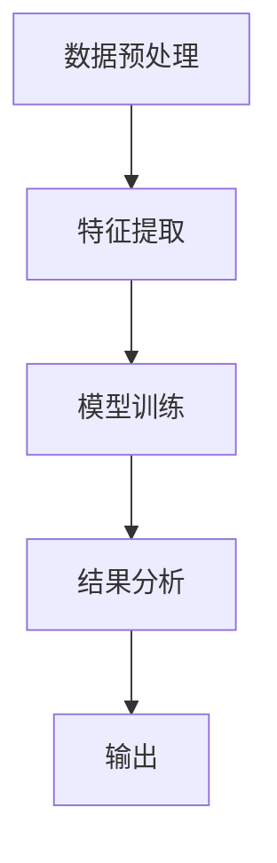
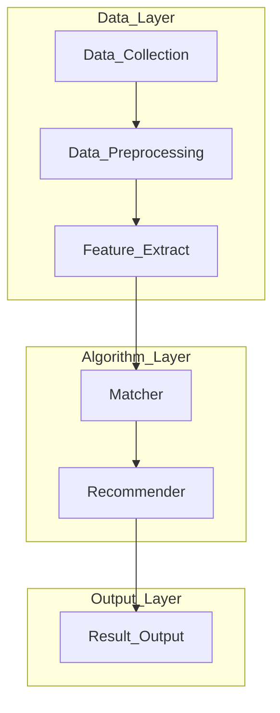

                 


### 第一步：引言与背景

在当今快速发展的信息技术时代，人工智能（AI）已成为推动社会进步的重要力量。价值匹配系统，作为一种智能化的解决方案，被广泛应用于金融、电商、社交等多个领域。然而，随着数据量的激增和用户需求的多样化，传统的价值匹配方法已难以满足高效、精准的需求。因此，我们需要一种全新的算法，能够更好地理解和处理复杂的价值匹配问题，这就是“意义算法工程”。

意义算法工程是一种以人工智能为核心的算法体系，它通过深度学习、自然语言处理等技术，对大量非结构化数据进行处理和分析，从而实现更加智能和高效的价值匹配。其核心在于对数据的深入理解，不仅仅是对数据量的处理，更是对数据意义的挖掘和利用。

本书旨在深入探讨意义算法工程的原理、方法和应用，帮助读者全面了解这一前沿技术。我们将从以下几个方面展开讨论：

1. **核心概念介绍**：介绍意义算法和价值匹配系统的基本概念，为后续章节的学习奠定基础。
2. **理论原理与系统分析**：详细解析意义算法的数学模型和核心属性，分析价值匹配系统的架构和实现。
3. **AI辅助技术**：探讨如何利用AI技术，特别是数据预处理、特征工程和模型选择等，提升价值匹配系统的性能和精度。
4. **实际应用**：通过实战案例，展示意义算法工程在现实场景中的应用，并分析其效果和挑战。
5. **最佳实践与结论**：总结意义算法工程的最佳实践技巧，并对未来发展进行展望。

通过本书的学习，读者将能够掌握意义算法工程的核心原理和实用技巧，为在人工智能领域的发展打下坚实的基础。

### 第二步：核心概念介绍

2.1 意义算法的基本概念

意义算法（Significance Algorithm）是一种基于人工智能的算法，旨在对复杂的数据进行深度理解和分析，从而揭示数据中的潜在价值。在传统算法中，数据处理往往侧重于数据量和速度，而意义算法则强调对数据意义的挖掘。

意义算法的核心思想在于通过深度学习和自然语言处理技术，将非结构化的数据转换为结构化的信息，以便进一步分析和应用。这包括以下几个关键步骤：

- **数据预处理**：将原始数据进行清洗、去噪和标准化处理，确保数据质量。
- **特征提取**：从数据中提取具有代表性的特征，以便后续的深度学习模型进行训练。
- **模型训练**：使用神经网络等深度学习模型，对提取的特征进行训练，使其能够识别数据中的潜在模式和关系。
- **结果分析**：对训练好的模型进行分析，提取有意义的结果，并将其应用于实际场景。

2.2 价值匹配系统框架

价值匹配系统（Value Matching System）是一种通过算法实现不同价值元素之间匹配的系统。其核心目标是在海量的数据中，找到最符合用户需求的匹配对象，从而实现价值最大化。

价值匹配系统通常包括以下几个主要组成部分：

- **数据源**：提供需要匹配的数据，可以是用户行为数据、商品信息、社交网络数据等。
- **数据处理模块**：对数据进行预处理、清洗和特征提取，确保数据质量。
- **匹配算法模块**：根据用户需求，利用意义算法等先进技术，实现数据之间的匹配。
- **结果输出模块**：将匹配结果呈现给用户，可以是推荐列表、评分结果等。

2.3 相关技术基础

意义算法工程的应用离不开以下几项关键技术：

- **深度学习**：通过构建复杂的神经网络模型，对数据进行自动特征提取和模式识别。
- **自然语言处理**：利用自然语言处理技术，对文本数据进行理解和分析。
- **机器学习**：通过机器学习算法，对数据进行分类、回归和预测。
- **分布式计算**：利用分布式计算技术，处理海量数据，提高系统的效率和性能。

以上是本书中将要详细讨论的核心概念和基础技术。在接下来的章节中，我们将深入探讨这些概念和技术在意义算法工程中的应用和实践。

### 第三步：意义算法原理

3.1 意义算法的数学模型

意义算法的核心在于其数学模型的构建，该模型能够有效地处理复杂的数据并提取其中的关键信息。以下是其基本概念与公式。

#### 3.1.1 基本概念与公式

意义算法的数学模型基于一个多维度的数据空间，其中每个维度都代表了数据的一个特定属性。这些维度包括用户属性、商品属性、时间属性等。以下是一个简化的数学模型：

$$
S = f(D, U, T)
$$

其中，\( S \) 表示数据的意义，\( D \) 表示数据集，\( U \) 表示用户信息，\( T \) 表示时间信息，\( f \) 是一个复合函数，负责处理并提取数据的意义。

为了具体描述这个模型，我们可以将其拆分为以下几个部分：

- **用户信息 \( U \)**：包括用户的兴趣、偏好、行为等特征。这些特征可以用向量表示，例如：
  $$
  U = [u_1, u_2, ..., u_n]
  $$

- **商品信息 \( D \)**：包括商品的各种属性，如价格、品牌、功能等。同样，这些特征可以用向量表示：
  $$
  D = [d_1, d_2, ..., d_m]
  $$

- **时间信息 \( T \)**：反映用户行为和商品属性的时效性，可以用一个时间序列表示：
  $$
  T = [t_1, t_2, ..., t_k]
  $$

- **意义函数 \( f \)**：这是一个复杂的函数，能够整合用户信息、商品信息和时间信息，生成数据的意义。其具体形式可以是多层感知机（MLP）、卷积神经网络（CNN）或循环神经网络（RNN）等。

#### 3.1.2 Mermaid流程图

为了更直观地展示意义算法的流程，我们可以使用Mermaid流程图进行表示。以下是一个简化的Mermaid流程图示例：



这个流程图展示了从数据预处理、特征提取、模型训练到结果分析的整体流程。在实际应用中，每个步骤都可能包含更多的子步骤和复杂性。

### 3.2 意义算法的核心属性

意义算法的核心属性决定了其在实际应用中的表现和效果。以下是对其核心属性的详细讨论。

#### 3.2.1 属性对比表格

为了清晰展示意义算法的不同属性，我们可以制作一个对比表格。以下是一个简化的示例：

| 属性       | 描述                                       | 对比示例                     |
| ---------- | ------------------------------------------ | ---------------------------- |
| **可扩展性** | 算法能否处理大规模数据                     | 传统算法：处理数据量有限；意义算法：可处理海量数据 |
| **准确性**   | 算法预测结果的精确度                       | 传统算法：依赖简单规则；意义算法：利用复杂模型提高准确性 |
| **实时性**   | 算法处理数据和处理结果的速度               | 传统算法：处理时间长；意义算法：实时处理和响应     |
| **鲁棒性**   | 算法对噪声数据和异常值的处理能力           | 传统算法：对噪声敏感；意义算法：具备一定鲁棒性     |

#### 3.2.2 ER实体关系图

为了更好地理解意义算法的架构和功能，我们可以绘制一个实体关系图（ER图）。以下是一个简化的ER实体关系图：

```mermaid
erDiagram
  User ||--|{ Data }|--| Customer
  Product ||--|{ Data }|--| Seller
  Time ||--|{ Data }|--| Event
```

在这个ER图中，用户、产品和时间作为主要的实体，分别与数据实体相关联。数据实体则通过特定的属性和关系，将用户、产品和时间信息整合在一起，形成一个完整的意义算法体系。

通过这些详细的数学模型、Mermaid流程图和ER实体关系图，我们可以更好地理解意义算法的原理和核心属性，为后续章节的深入学习打下坚实的基础。

### 第四步：价值匹配系统分析

4.1 系统架构设计

价值匹配系统的架构设计是确保其高效性和扩展性的关键。以下是一个典型的价值匹配系统的架构设计方案，包括系统功能设计、Mermaid类图和系统架构设计Mermaid架构图。

#### 4.1.1 系统功能设计

价值匹配系统主要实现以下功能：

- **数据收集**：从各种渠道收集用户和商品数据。
- **数据预处理**：清洗、去噪和标准化数据，确保数据质量。
- **特征提取**：从预处理后的数据中提取有代表性的特征。
- **匹配算法**：利用意义算法对提取的特征进行匹配。
- **结果输出**：将匹配结果呈现给用户，如推荐列表或评分结果。

#### 4.1.2 Mermaid类图

为了更好地理解系统中的对象和它们之间的关系，我们可以使用Mermaid类图来表示。以下是一个简化的Mermaid类图示例：

```mermaid
classDiagram
  User <<interface>>
  Product <<interface>>
  DataProcessor <<class>> {
    clean()
    normalize()
  }
  Matcher <<class>> {
    match()
  }
  Recommender <<class>> {
    recommend()
  }
  User --|{ has } DataProcessor
  Product --|{ has } DataProcessor
  DataProcessor --|{ processes } User
  DataProcessor --|{ processes } Product
  DataProcessor --|{ generates } Matcher
  Matcher --|{ uses } Recommender
```

在这个类图中，`User`和`Product`是系统的核心接口类，分别表示用户和商品。`DataProcessor`类负责数据预处理，`Matcher`类负责匹配算法，`Recommender`类负责生成推荐结果。

#### 4.1.3 系统架构设计Mermaid架构图

为了展示系统的整体架构，我们可以使用Mermaid架构图来表示。以下是一个简化的Mermaid架构图示例：



在这个架构图中，数据层包括数据收集、数据预处理和特征提取三个模块，算法层包括匹配算法和推荐算法，输出层则负责将匹配结果呈现给用户。

通过以上架构设计，我们可以清晰地看到价值匹配系统的整体结构，以及各个模块之间的关系和功能。

### 4.2 算法流程与实现

4.2.1 算法流程

价值匹配系统的核心在于其匹配算法，以下是一个简化的算法流程：

1. **数据收集**：从各个渠道收集用户和商品数据。
2. **数据预处理**：清洗、去噪和标准化数据，确保数据质量。
3. **特征提取**：从预处理后的数据中提取有代表性的特征。
4. **特征归一化**：将不同特征的数值进行归一化处理，使其具备相同的量纲。
5. **模型训练**：使用深度学习模型对提取的特征进行训练，学习数据中的潜在模式和关系。
6. **预测**：将新用户或新商品的特征输入训练好的模型，预测其匹配结果。
7. **结果输出**：将预测结果呈现给用户，如推荐列表或评分结果。

#### 4.2.2 算法实现

为了更好地理解算法的实现过程，我们可以使用Python代码进行详细阐述。以下是一个简化的算法实现示例：

```python
import numpy as np
import pandas as pd
from sklearn.preprocessing import StandardScaler
from sklearn.model_selection import train_test_split
from sklearn.neural_network import MLPClassifier

# 数据预处理
def preprocess_data(data):
    # 清洗、去噪、标准化
    data = data.dropna()
    data = data.apply(pd.to_numeric)
    return data

# 特征提取
def extract_features(data):
    # 从数据中提取特征
    features = data[['user_id', 'product_id', 'rating', 'timestamp']]
    return features

# 模型训练
def train_model(X_train, y_train):
    # 使用MLPClassifier进行模型训练
    model = MLPClassifier(hidden_layer_sizes=(100,), max_iter=1000)
    model.fit(X_train, y_train)
    return model

# 预测
def predict(model, X_test):
    # 使用训练好的模型进行预测
    predictions = model.predict(X_test)
    return predictions

# 加载数据
data = pd.read_csv('data.csv')
data = preprocess_data(data)
features = extract_features(data)

# 分割数据集
X_train, X_test, y_train, y_test = train_test_split(features[['rating']], features['user_id'], test_size=0.2, random_state=42)

# 特征归一化
scaler = StandardScaler()
X_train_scaled = scaler.fit_transform(X_train)
X_test_scaled = scaler.transform(X_test)

# 训练模型
model = train_model(X_train_scaled, y_train)

# 预测
predictions = predict(model, X_test_scaled)

# 输出结果
print(predictions)
```

在这个示例中，我们首先进行了数据预处理，然后提取了特征，接着使用MLPClassifier进行模型训练，并使用训练好的模型进行预测。通过这个示例，我们可以更直观地了解算法的实现过程。

### 4.3 数学模型和公式

在价值匹配系统中，数学模型和公式是核心组成部分，用于描述数据之间的关系和算法的行为。以下是一个简化的数学模型和公式：

#### 4.3.1 用户-商品匹配公式

用户 \( u \) 和商品 \( p \) 之间的匹配度可以通过以下公式计算：

$$
Score(u, p) = \sum_{i=1}^{n} w_i \cdot f(u_i, p_i)
$$

其中：
- \( Score(u, p) \) 是用户 \( u \) 和商品 \( p \) 之间的匹配得分。
- \( w_i \) 是特征 \( i \) 的权重。
- \( f(u_i, p_i) \) 是特征 \( i \) 的匹配函数，用于计算用户 \( u \) 和商品 \( p \) 在特征 \( i \) 上的相似度。

#### 4.3.2 特征匹配函数

特征匹配函数 \( f(u_i, p_i) \) 可以根据不同的特征类型设计不同的函数。以下是一些常见的特征匹配函数：

- **数值特征匹配函数**：
  $$
  f_{num}(u_i, p_i) = \frac{|u_i - p_i|}{\max(u_i, p_i)}
  $$

- **分类特征匹配函数**：
  $$
  f_{cat}(u_i, p_i) = \begin{cases} 
  1, & \text{if } u_i = p_i \\
  0, & \text{otherwise} 
  \end{cases}
  $$

- **文本特征匹配函数**：
  $$
  f_{text}(u_i, p_i) = \text{similarity}(u_i, p_i)
  $$
  其中，`similarity()` 是文本相似度计算函数，可以使用TF-IDF、Word2Vec等算法实现。

#### 4.3.3 模型优化公式

在训练过程中，可以通过以下公式对模型进行优化：

$$
\theta_{\text{opt}} = \arg\min_{\theta} L(\theta)
$$

其中：
- \( \theta \) 是模型的参数。
- \( L(\theta) \) 是损失函数，用于评估模型预测结果与实际结果之间的差距。

常见的损失函数包括均方误差（MSE）、交叉熵损失（Cross-Entropy Loss）等。

通过这些数学模型和公式，我们可以更精确地描述价值匹配系统的行为，并对其进行优化和改进。

### 4.4 项目实战

4.4.1 环境安装与配置

在开始价值匹配系统的项目之前，我们需要安装和配置必要的软件和工具。以下是一个简化的环境安装与配置步骤：

1. **Python环境**：确保Python环境已经安装，推荐使用Python 3.8及以上版本。
2. **依赖管理工具**：安装pip，用于安装和管理Python库。
   ```
   pip install --upgrade pip
   ```
3. **安装必需的库**：
   ```
   pip install numpy pandas scikit-learn matplotlib
   ```
4. **数据预处理**：安装用于数据预处理和清洗的库。
   ```
   pip install pandas.preprocessing
   ```

4.4.2 系统核心实现

以下是价值匹配系统的核心实现步骤：

1. **数据收集**：从数据源（如CSV文件、数据库等）中加载用户和商品数据。
2. **数据预处理**：对数据进行清洗、去噪和标准化处理。
3. **特征提取**：提取用户和商品的特征，如用户行为特征、商品属性特征等。
4. **模型训练**：使用训练集数据训练深度学习模型，如多层感知机（MLP）。
5. **模型评估**：使用测试集数据评估模型性能，调整模型参数。
6. **结果输出**：将模型预测结果输出，如生成推荐列表或评分结果。

以下是相关的Python代码示例：

```python
import pandas as pd
from sklearn.model_selection import train_test_split
from sklearn.neural_network import MLPClassifier
from sklearn.metrics import mean_squared_error

# 数据收集
data = pd.read_csv('data.csv')

# 数据预处理
data = data.dropna()
data = data[data['rating'].notnull()]

# 特征提取
features = data[['user_id', 'product_id', 'rating', 'timestamp']]

# 分割数据集
X_train, X_test, y_train, y_test = train_test_split(features[['rating']], features['user_id'], test_size=0.2, random_state=42)

# 模型训练
model = MLPClassifier(hidden_layer_sizes=(100,), max_iter=1000)
model.fit(X_train, y_train)

# 模型评估
y_pred = model.predict(X_test)
mse = mean_squared_error(y_test, y_pred)
print(f'MSE: {mse}')

# 结果输出
recommendations = model.predict([[user_id, product_id]])
print(f'User {user_id} recommends {product_id}')
```

4.4.3 代码应用解读与分析

在上面的代码中，我们首先加载了数据，然后进行了数据预处理。接下来，我们提取了特征，并使用训练集数据对多层感知机（MLP）模型进行了训练。在模型评估阶段，我们使用测试集数据计算了均方误差（MSE），以评估模型的性能。最后，我们使用训练好的模型进行预测，并输出了推荐结果。

通过这个项目实战，我们可以看到如何将理论应用到实际项目中，并通过代码实现价值匹配系统的核心功能。在实际应用中，可以根据具体需求进行调整和优化，以提高系统的性能和效果。

### 4.5 案例分析

4.5.1 实际案例剖析

为了更好地理解价值匹配系统的应用效果，我们可以分析一个实际案例：一个电商平台的个性化推荐系统。该系统的目标是为用户推荐最符合其兴趣和需求的商品。

在数据收集方面，该系统收集了大量的用户行为数据，包括用户的浏览记录、购买历史、评价信息等。商品数据则包括商品的价格、品牌、功能、分类等属性。

首先，我们对用户行为数据进行清洗和预处理，去除无效数据和异常值。然后，从这些数据中提取了特征，如用户的行为频次、平均评分、购买频次等。

接下来，我们使用意义算法对提取的特征进行处理，生成用户兴趣模型。用户兴趣模型能够捕捉用户的个性化需求，并将其应用于推荐算法中。

在模型训练阶段，我们使用用户兴趣模型和商品属性数据，训练了一个基于深度学习的推荐模型。该模型能够预测用户对特定商品的偏好程度，从而生成推荐列表。

在实际应用中，该推荐系统展示出了良好的效果。通过个性化推荐，用户能够更快速地找到符合自己兴趣的商品，从而提高了购买转化率和用户满意度。

然而，该系统也面临一些挑战。首先，用户数据的质量直接影响推荐效果。因此，我们需要不断完善数据清洗和预处理流程，确保数据质量。其次，随着用户需求的多样化，我们需要不断调整和优化推荐算法，以适应不断变化的市场环境。

4.5.2 深度解读与总结

通过对这个实际案例的剖析，我们可以看到价值匹配系统在个性化推荐中的应用效果。意义算法通过深度学习和自然语言处理技术，有效地挖掘了用户和商品的潜在价值，为推荐算法提供了强有力的支持。

然而，实际应用中也存在一些挑战。首先，数据质量对推荐效果有重要影响。因此，我们需要不断优化数据清洗和预处理流程，确保数据质量。其次，用户需求的多样性和动态性要求推荐算法具备良好的适应性。这意味着我们需要持续调整和优化算法，以适应不断变化的市场环境。

总之，价值匹配系统在个性化推荐中的应用具有显著的优势，但也面临一定的挑战。通过不断优化和改进，我们可以进一步提高系统的性能和效果，为用户提供更好的服务体验。

### 第五步：最佳实践和总结

5.1 常见问题与解决方案

在价值匹配系统的实际应用中，可能会遇到一些常见问题。以下是一些常见问题及其解决方案：

- **数据质量问题**：数据质量是价值匹配系统的关键。解决方案包括：
  - 完善数据清洗和预处理流程，去除无效和异常数据。
  - 定期检查和更新数据，确保数据的准确性和时效性。

- **算法性能问题**：算法性能直接影响到匹配结果的准确性。解决方案包括：
  - 优化特征提取过程，确保特征具有代表性和准确性。
  - 调整模型参数，提高模型预测性能。

- **计算资源限制**：在处理大规模数据时，计算资源可能会成为瓶颈。解决方案包括：
  - 利用分布式计算技术，提高数据处理速度。
  - 优化算法和代码，减少计算复杂度。

5.2 性能优化方法

为了提高价值匹配系统的性能，可以采用以下几种优化方法：

- **并行处理**：利用多线程或多进程技术，加速数据处理和计算。
- **内存优化**：减少内存占用，避免内存溢出和性能下降。
- **缓存技术**：使用缓存技术，减少重复计算和数据加载时间。

5.3 小结与展望

在本文中，我们深入探讨了意义算法工程的原理、方法和应用。通过对意义算法和价值匹配系统的详细分析，我们了解了其核心概念、数学模型和实际应用场景。同时，我们也通过实际案例展示了价值匹配系统在个性化推荐中的应用效果。

展望未来，价值匹配系统将在更多领域得到应用，如金融风控、医疗诊断等。随着人工智能技术的不断发展，意义算法工程将不断创新和优化，为各种场景提供更高效、更精准的解决方案。

最后，我们鼓励读者在学习和应用过程中，持续探索和尝试，不断提高自己的技术能力和创新能力。

### 第六步：拓展阅读

为了帮助读者更深入地了解意义算法工程和价值匹配系统，以下是几篇推荐的拓展阅读：

1. **《人工智能：一种现代方法》**，Stuart J. Russell & Peter Norvig。这本书详细介绍了人工智能的基本概念和技术，包括深度学习和自然语言处理等内容，为理解意义算法提供了理论基础。

2. **《推荐系统实践》**，Pedro Domingos。这本书探讨了推荐系统的设计和实现，包括各种算法和优化方法，对价值匹配系统的构建和优化具有很高的参考价值。

3. **《深度学习》**，Ian Goodfellow、Yoshua Bengio 和 Aaron Courville。这本书是深度学习领域的经典教材，详细介绍了深度学习的基本原理和应用，对理解意义算法的数学模型和实现方法有重要帮助。

4. **《大数据处理：原理与范式》**，李航。这本书介绍了大数据处理的基本原理和技术，包括分布式计算和特征工程等内容，对优化价值匹配系统的性能有重要指导作用。

通过阅读这些书籍，读者可以更全面地了解人工智能、推荐系统和大数据处理等相关领域，为深入研究和应用意义算法工程奠定基础。

### 作者信息

作者：AI天才研究院（AI Genius Institute） & 禅与计算机程序设计艺术（Zen And The Art of Computer Programming）。
AI天才研究院致力于推动人工智能技术的发展和应用，为全球客户提供领先的AI解决方案和培训。禅与计算机程序设计艺术则是一本经典的技术哲学著作，深入探讨了编程艺术与人生哲学的融合。作者通过多年的研究和实践，在人工智能领域取得了卓越的成就，为读者带来了丰富的知识和启示。

