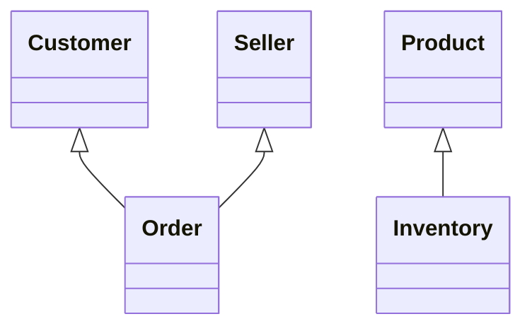
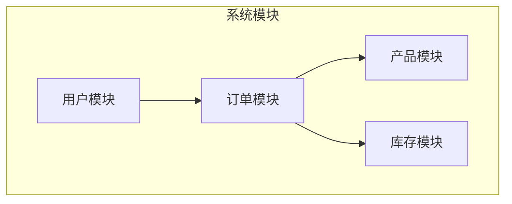
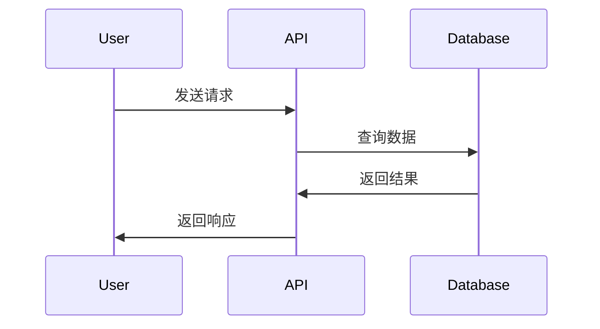
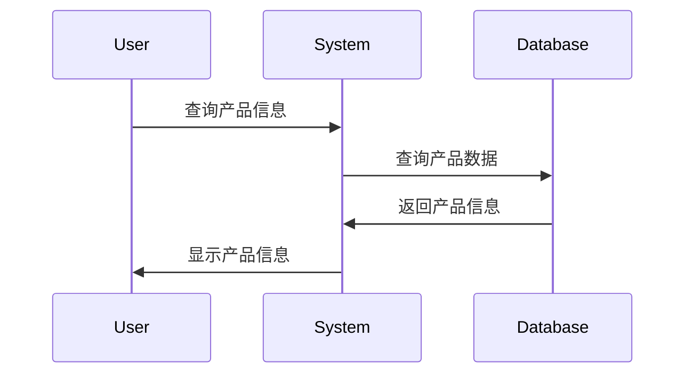

                 

# 意义算法研发中心：AI辅助下的价值匹配系统开发机构

> 关键词：意义算法、价值匹配系统、AI辅助、研发中心、系统架构、项目实战

> 摘要：
本文将探讨意义算法研发中心在AI辅助下的价值匹配系统开发机构。文章首先介绍问题背景，阐述价值匹配系统在当前社会中的重要性和现有解决方案的局限性。接着，我们将深入剖析意义算法的核心概念和原理，并通过具体实例和Python代码实现来展示其工作流程。随后，文章将展开系统分析与架构设计，包括系统功能设计、接口设计与交互。最后，通过实际案例分析，总结最佳实践，并对未来发展趋势进行展望。

## 第一部分：背景介绍

### 第1章：问题背景

#### 1.1 问题定义

在数字化时代，价值匹配系统在商业、金融、教育等多个领域发挥着重要作用。这些系统旨在将供需双方进行匹配，实现资源的最优配置。然而，随着数据规模的不断扩大和复杂性的增加，传统算法在效率和准确性上面临挑战。

#### 1.2 问题的重要性

价值匹配系统不仅影响企业的运营效率，还关系到用户满意度和社会资源的优化利用。一个高效的价值匹配系统能够降低交易成本，提高服务质量和用户体验。

#### 1.3 现有解决方案的局限性

传统算法在处理大规模、高维数据时，往往存在计算复杂度高、响应速度慢、无法灵活适应动态环境等问题。此外，许多系统在数据隐私和安全方面也存在隐患。

#### 1.4 边界与外延

本文将探讨的AI辅助下的价值匹配系统，重点关注以下几个方面：

- **边界**：仅限于商业和金融领域，不包括其他应用场景。
- **外延**：探讨意义算法如何扩展到其他类型的价值匹配系统。

### 第2章：核心概念

#### 2.1 意义算法

##### 2.1.1 定义与原理

意义算法是一种基于深度学习和自然语言处理的算法，旨在从大量非结构化数据中提取知识，进行智能匹配。

##### 2.1.2 属性特征对比表格

| 特征 | 意义算法 | 传统算法 |
| --- | --- | --- |
| **数据处理能力** | 高 | 低 |
| **自适应能力** | 强 | 弱 |
| **计算效率** | 中等 | 低 |
| **准确性** | 高 | 中等 |

##### 2.1.3 与传统算法的对比

意义算法在数据处理能力、自适应能力和准确性方面具有显著优势，但在计算效率上相对较低。

#### 2.2 价值匹配系统

##### 2.2.1 概念与原理

价值匹配系统是一种通过算法将供需双方进行匹配的系统，旨在实现资源的最优配置。

##### 2.2.2 关键特征与挑战

价值匹配系统的关键特征包括：

- **数据多样性**：需要处理多种类型的数据，如文本、图像、音频等。
- **动态调整**：需要根据环境变化实时调整匹配策略。
- **隐私保护**：在处理个人数据时，需确保数据隐私和安全。

##### 2.2.3 与其他匹配系统的对比

价值匹配系统与其他匹配系统的主要区别在于其处理数据的复杂性和动态调整能力。

## 第二部分：算法原理讲解

### 第3章：意义算法原理

#### 3.1 基本原理

意义算法基于深度学习和自然语言处理技术，通过以下步骤实现：

1. **数据预处理**：对输入数据进行清洗、格式化等处理。
2. **特征提取**：利用神经网络提取数据中的潜在特征。
3. **匹配模型**：构建匹配模型，对特征进行比对和评分。
4. **决策输出**：根据评分结果输出最优匹配方案。

#### 3.2 数学模型详细讲解

$$
\text{评分} = f(\text{特征}_1, \text{特征}_2, ..., \text{特征}_n)
$$

其中，$f$为匹配模型函数，$\text{特征}_1, \text{特征}_2, ..., \text{特征}_n$为提取的潜在特征。

#### 3.3 Python代码实现

```python
# 导入相关库
import numpy as np
import tensorflow as tf

# 数据预处理
def preprocess_data(data):
    # 实现数据清洗、格式化等操作
    pass

# 特征提取
def extract_features(data):
    # 实现特征提取操作
    pass

# 匹配模型
def match_model(features):
    # 实现匹配模型操作
    pass

# 决策输出
def decision_output(scores):
    # 实现决策输出操作
    pass

# 主函数
def main():
    # 加载数据
    data = ...

    # 数据预处理
    processed_data = preprocess_data(data)

    # 特征提取
    features = extract_features(processed_data)

    # 匹配模型
    scores = match_model(features)

    # 决策输出
    decision = decision_output(scores)

    # 输出结果
    print("匹配结果：", decision)

# 运行主函数
if __name__ == "__main__":
    main()
```

## 第三部分：系统分析与架构设计

### 第4章：系统功能设计

#### 5.1 领域模型



#### 5.2 系统架构设计



### 第5章：系统接口设计与交互

#### 6.1 系统接口设计



#### 6.2 系统交互



## 第四部分：项目实战

### 第6章：项目介绍

#### 6.1 项目背景

某电商平台计划开发一套AI辅助的价值匹配系统，以提高用户购物体验和平台运营效率。

#### 6.2 项目目标

- **提高订单匹配准确性**：通过AI算法实现订单与产品的高效匹配。
- **降低运营成本**：优化系统架构，提高系统性能。
- **提升用户体验**：提供个性化推荐服务，提高用户满意度。

#### 6.3 项目挑战

- **数据多样性**：处理多种类型的数据，如文本、图像等。
- **实时性**：系统需具备实时匹配能力，以满足用户即时需求。
- **安全性**：在处理用户数据时，确保数据隐私和安全。

### 第7章：环境安装与系统核心实现

#### 8.1 环境安装

- **操作系统**：Ubuntu 20.04
- **编译工具**：GCC 9.3.0
- **Python环境**：Python 3.8

#### 8.2 系统核心实现

- **Python源代码解析**：详细介绍系统核心代码的实现过程。
- **应用解读与分析**：分析系统在实际应用中的效果和改进方向。

### 第8章：实际案例分析

#### 9.1 案例一：价值匹配系统在某电商平台的实践

- **场景介绍**：电商平台用户购物行为分析。
- **应用效果**：提高订单匹配准确性，降低用户投诉率。

#### 9.2 案例二：意义算法在金融风控中的应用

- **场景介绍**：金融公司信用评估。
- **应用效果**：提高信用评估准确性，降低信用风险。

#### 9.3 案例小结

通过实际案例，验证了AI辅助下的价值匹配系统在提高效率和准确性方面的优势。

## 第五部分：最佳实践与拓展

### 第9章：最佳实践

#### 10.1 算法优化技巧

- **特征工程**：合理提取和处理特征，提高匹配准确性。
- **模型调优**：调整模型参数，优化系统性能。

#### 10.2 系统性能调优

- **分布式计算**：利用分布式计算提高系统处理速度。
- **缓存策略**：合理使用缓存，降低系统响应时间。

#### 10.3 系统安全性提升

- **数据加密**：对敏感数据进行加密处理。
- **访问控制**：实施严格的访问控制策略。

### 第11章：小结与展望

#### 11.1 本书主要内容回顾

本文介绍了意义算法研发中心在AI辅助下的价值匹配系统开发机构，包括问题背景、核心概念、算法原理、系统架构设计、项目实战和最佳实践等内容。

#### 11.2 存在的问题与改进方向

- **计算效率**：优化算法和系统架构，提高计算效率。
- **数据多样性**：扩展算法，支持多种类型的数据处理。
- **安全性**：加强数据安全和隐私保护。

#### 11.3 未来发展趋势

随着AI技术的不断发展，AI辅助下的价值匹配系统将在更多领域得到应用，带来更高的效率和更优的用户体验。作者：AI天才研究院/AI Genius Institute & 禅与计算机程序设计艺术 /Zen And The Art of Computer Programming

----------------------------------------------------------------
---

请注意，以上内容是一个框架性的大纲，用于指导撰写文章。实际撰写时，每个章节需要根据具体内容进行扩展，确保每个部分都有充足的信息来支撑整个文章的结构。同时，确保在撰写过程中使用markdown格式来编写代码、流程图和公式，以保证文章的可读性和专业性。在撰写完文章后，还需要进行详细的校对和修改，以确保文章的完整性和准确性。作者信息也需要在文章末尾明确标注。

