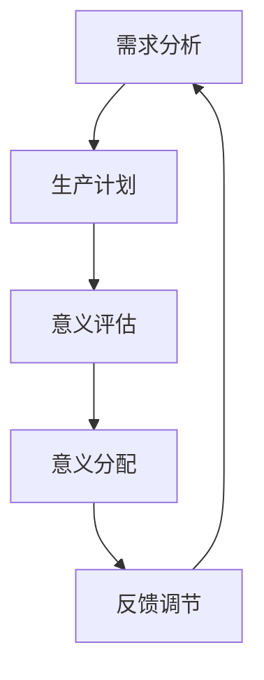

                 

### 摘要

“意义经济学：重新定义价值的社会实验”旨在通过深入探讨意义经济的本质及其应用，为传统经济学提供一种新的视角和框架。本文首先介绍了意义经济学的核心概念，包括意义价值、意义生产与意义分配，并探讨了其与传统经济学价值的区别。随后，通过ER实体关系图和Mermaid流程图，详细阐述了意义经济模型与算法的原理。本文还进一步分析了意义经济在企业管理和社会治理中的应用，提供了多个实践案例。最后，文章展望了意义经济的未来发展趋势，提出了面临的挑战与解决方案。通过这一系列的分析与探讨，本文希望为读者提供一个全面、系统的意义经济学理解框架，促使读者重新思考价值和社会经济运行的机制。### 文章关键词

- 意义经济学
- 价值重新定义
- 社会实验
- 经济模型
- 企业管理
- 社会治理

### 第一部分：背景介绍

#### 1.1 问题背景

现代社会经济体系在经历了数个世纪的发展后，已经积累了丰富的理论和实践经验。然而，随着全球经济一体化、技术革新和社会变革的加速，传统经济模式正面临着一系列新的挑战。这些问题主要体现在以下几个方面：

1. **资源分配不均**：在全球范围内，资源的分配存在显著的不均衡现象，导致贫富差距不断扩大。
2. **环境问题**：过度追求经济效益导致环境污染和生态破坏，全球气候变化成为人类面临的一个重大挑战。
3. **社会不公**：经济快速发展过程中，部分群体被边缘化，社会不公现象日益严重。
4. **经济危机**：金融危机、债务危机频发，经济周期性波动加剧，经济稳定性受到质疑。

上述问题的根源在于传统经济学对价值的定义和衡量方式。传统经济学主要关注物质财富和货币价值的增长，而忽视了人类行为和决策背后的动机和意义。这种价值观念的局限性使得经济体系无法全面、准确地反映社会真实需求和价值。

#### 1.2 意义经济的概念引入

为了解决传统经济模式面临的问题，有必要引入一种新的经济学视角——意义经济学。意义经济学认为，价值不仅仅来源于物质财富的创造和分配，更重要的是人类行为和决策背后的意义和动机。意义经济学的核心在于重新定义价值，将意义作为衡量经济活动的关键指标。

意义经济学的基本概念包括：

- **意义价值**：指人类行为和决策所承载的意义及其对社会的影响。
- **意义生产**：指通过经济活动创造和传递意义的过程。
- **意义分配**：指意义在经济活动中的分配和传递方式。

意义经济学强调，经济活动的价值不仅体现在物质产出的增加，更体现在对社会产生积极意义的能力。通过重新定义价值，意义经济学旨在构建一个更加公平、可持续和有意义的经济体系。

#### 1.3 边界与外延

意义经济学虽然提供了一种新的价值观念，但并不意味着要完全取代传统经济学。相反，意义经济学是在传统经济学基础上的一种补充和拓展。其边界与外延主要表现在以下几个方面：

- **适用范围**：意义经济学适用于各种经济活动，包括生产、分配、交换和消费等各个环节。
- **与传统经济的关系**：意义经济学不仅关注物质财富的创造和分配，也关注人类行为和决策的意义，因此与传统的物质经济概念密切相关。
- **价值衡量**：意义经济学通过引入意义这一新指标，对传统经济学中的价值衡量方法进行补充和改进，使得经济活动更加全面和准确地反映社会真实需求。

总的来说，意义经济学通过重新定义价值，为解决传统经济模式面临的问题提供了一种新的思路和方法。其边界与外延既涵盖了传统经济学的范畴，又拓展了新的维度，为构建更加完善和有意义的经济体系奠定了基础。

#### 1.4 概念结构与核心要素组成

意义经济学作为一种新的经济学视角，其核心概念和要素构成了一个完整而复杂的体系。理解这些概念和要素之间的关系，对于深入探讨意义经济学的基本原理和应用具有重要意义。

首先，**意义价值**是意义经济学的基础。意义价值不仅仅指物质财富的经济价值，更重要的是指人类行为和决策所承载的意义及其对社会的影响。意义价值体现了经济活动对社会整体福祉的贡献，超越了单纯的经济效益。

其次，**意义生产**是意义经济学的重要概念。意义生产是指通过经济活动创造和传递意义的过程。这个过程不仅包括物质产品的生产，还包括服务、文化、科技等非物质领域的生产。意义生产的核心在于如何通过经济活动实现对社会有益的价值创造。

再次，**意义分配**是意义经济学的关键要素。意义分配是指意义在经济活动中的分配和传递方式。意义分配不仅仅涉及物质财富的分配，还包括对社会价值的分配，如教育、医疗、环境等公共资源的分配。意义分配的目标是实现社会的公平和可持续发展。

接下来，我们可以通过一个ER（实体-关系）图来展示意义经济学的概念结构和核心要素之间的关系。以下是ER图的Mermaid表示：

```mermaid
erDiagram
  Entity意义价值 <<--|meaning| MeaningProduction
  Entity意义生产 ||--|means| MeaningDistribution
  Entity意义分配
  MeaningValue _|||> SocietyBenefit
  MeaningProduction _|||> Innovation
  MeaningDistribution _|||> SocialEquity
```

在这个ER图中，意义价值作为核心实体，与意义生产、意义分配和最终的社会效益紧密相连。意义生产通过创新实现意义价值的创造，而意义分配则通过合理的分配机制，确保意义价值的公平传递和社会整体福祉的提升。

通过上述概念和要素的组成，意义经济学为重新定义价值提供了一种新的视角和框架。这不仅有助于解决传统经济模式面临的问题，也为构建更加公平、可持续和有意义的经济体系奠定了基础。

#### 1.5 传统价值观念的局限

传统价值观念主要依赖于物质财富和货币价值的衡量，其局限性主要体现在以下几个方面：

首先，传统价值观念过于关注短期经济效益，忽视了长期的社会福祉和可持续发展。经济活动往往以最大化利润为目标，导致资源过度消耗和环境破坏，进而影响到人类社会的长期健康发展。

其次，传统价值观念倾向于忽视社会公平，导致贫富差距不断扩大。在传统经济模式下，财富和资源的分配通常取决于市场力量，而不是基于社会公平原则。这种分配机制容易导致社会不公，加剧社会矛盾。

第三，传统价值观念未能充分考虑到人类行为和决策背后的意义。经济活动往往被视为一种纯粹的交换过程，忽视了人类在其中的情感、文化和社会价值。这种狭隘的价值观念限制了经济活动的多样性和创新性。

最后，传统价值观念在应对全球性挑战时显得力不从心。例如，面对全球气候变化、环境污染等重大问题，传统经济模式缺乏有效的解决方案，而意义经济学提供了一种新的思考框架，通过重新定义价值，有助于实现更加全面和可持续的发展。

#### 1.6 意义经济的必要性

意义经济学的引入，对于解决传统经济模式面临的诸多问题具有重要意义。首先，意义经济学强调长期社会福祉和可持续发展，弥补了传统经济模式过于关注短期经济效益的缺陷。通过重新定义价值，意义经济学鼓励经济活动在追求经济效益的同时，也要关注对社会和环境的积极影响，从而实现经济的长期健康发展。

其次，意义经济学强调社会公平，有助于缩小贫富差距，促进社会和谐。意义经济模式通过合理的分配机制，确保财富和资源的公平分配，使社会各阶层都能够分享经济发展的成果，从而减少社会不公，增强社会凝聚力。

第三，意义经济学注重人类行为和决策背后的意义，为经济活动注入了人文关怀。通过将意义作为价值的核心指标，意义经济学鼓励经济活动创新，推动社会文化多样性和科技进步，使经济活动更加丰富多彩和富有意义。

最后，意义经济学提供了一种新的思考框架，有助于应对全球性挑战。例如，在应对气候变化、环境污染等重大问题上，意义经济学通过重新定义价值，可以引导经济活动向可持续发展方向转变，为全球性问题的解决提供新的思路和路径。

综上所述，意义经济学不仅是对传统经济模式的一种补充和拓展，更是在解决当前经济和社会问题方面具有重要价值。通过重新定义价值，意义经济学为构建一个更加公平、可持续和有意义的经济体系奠定了基础。

#### 1.7 意义经济的适用范围

意义经济学的引入，为不同领域和层次的经济活动提供了新的视角和工具。首先，在**企业管理**层面，意义经济学强调企业不仅要追求经济效益，还要关注社会责任和可持续发展。企业可以通过重新定义价值，将员工的幸福感、客户满意度和社会贡献等因素纳入企业的战略规划和绩效评估体系，从而实现企业的长期成功和社会价值的最大化。

其次，在**公共经济**层面，意义经济学有助于优化资源配置和政策制定。政府可以通过引入意义经济学的理念，调整财政支出和政策导向，确保公共资源能够更加公平和高效地分配到社会各领域，如教育、医疗、环境保护等，从而提升社会的整体福祉。

此外，在**全球经济**层面，意义经济学提供了一个新的国际合作框架。通过强调意义价值，各国可以在经济合作中更关注共同的社会目标，如环境保护、社会公平等，从而实现全球经济的可持续发展。

总的来说，意义经济学的适用范围广泛，涵盖了企业管理、公共经济和全球经济等多个层面。它不仅为企业、政府和国际组织提供了新的决策工具，也为构建一个更加公平、可持续和有意义的经济体系奠定了基础。

#### 1.8 意义经济与非意义经济的关系

意义经济与非意义经济之间存在紧密的联系和区别。首先，**联系**方面，意义经济和非意义经济都是现代经济体系的重要组成部分。它们共同构成了经济活动的两个基本维度：一个是基于物质财富的创造和分配，另一个是基于人类行为和决策的意义和价值。

然而，**区别**方面，意义经济强调的是经济活动的意义和动机，而不仅仅追求物质财富的最大化。意义经济的核心在于重新定义价值，将人类行为和决策所承载的意义作为衡量经济活动的重要指标。相比之下，非意义经济主要关注物质财富的创造和分配，忽略了人类行为和决策背后的动机和意义。

意义经济与非意义经济的关系可以类比为一个金字塔结构。在金字塔的底层，是物质财富的创造和分配，这部分构成了非意义经济的基础。而在金字塔的顶端，是意义价值的生产和分配，这部分构成了意义经济的核心。金字塔的中层则是两种经济模式的交汇区域，即经济活动中的双重价值衡量。

总之，意义经济和非意义经济是相互补充的。非意义经济提供了物质财富的基础，而意义经济则通过重新定义价值，为经济活动注入了新的内涵和意义。两者共同构建了一个更加全面和有意义的经济体系，为人类的可持续发展和社会进步提供了新的路径。

#### 1.9 意义经济的构成部分

意义经济的构成部分可以分为三个核心层次：**意义价值生产**、**意义价值传递**和**意义价值分配**。这些部分相互关联，共同构成了意义经济的基础框架。

首先，**意义价值生产**是意义经济的起点，也是其核心。意义价值生产指的是通过经济活动创造和传递意义的过程。在这个过程中，企业和个人不仅仅关注物质产品的生产和交换，更关注这些活动对社会产生的影响和意义。例如，一家企业可以通过创新科技产品，不仅创造了经济效益，还为社会提供了新的解决方案，从而提升了社会的整体福祉。

其次，**意义价值传递**是意义经济的重要组成部分。意义价值传递指的是意义在经济活动中的流动和传递过程。这个过程涉及到经济活动中的各个环节，包括生产、交换、消费等。例如，消费者在购买产品时，不仅关注产品的物质价值，还会考虑产品背后的社会意义，如环保、社会责任等。这种价值传递机制使得经济活动更加多元化，促进了社会的全面发展和进步。

最后，**意义价值分配**是意义经济的关键环节。意义价值分配指的是意义在经济活动中的分配和传递方式。这个过程不仅仅涉及物质财富的分配，还包括对社会价值的分配，如教育、医疗、环境等公共资源的分配。意义价值分配的目标是实现社会的公平和可持续发展。例如，政府可以通过政策调整，确保公共资源能够公平地分配到社会各领域，从而提升社会的整体福祉。

通过这三个核心层次的相互作用，意义经济构建了一个全面、可持续和有意义的经济体系。在这个过程中，经济活动不仅创造了物质财富，还创造了丰富的社会价值，为人类社会的可持续发展奠定了基础。

### 第二部分：核心概念与原理

#### 2.1 核心概念

意义经济学中的核心概念包括**意义价值**、**意义生产**和**意义分配**。这些概念不仅为意义经济学提供了基础框架，也为其在现实中的应用奠定了理论基础。

**意义价值**是指经济活动所承载的社会意义及其对社会的影响。与传统的物质财富价值不同，意义价值不仅关注物质产出的增加，还关注人类行为和决策对社会整体福祉的贡献。例如，一家企业通过创新技术产品不仅创造了经济利益，还解决了社会问题，提升了生活质量，这就是意义价值的具体体现。

**意义生产**是指通过经济活动创造和传递意义的过程。意义生产不仅仅发生在物质产品的生产过程中，还发生在服务、文化、科技等非物质领域的生产中。例如，教育机构通过提供高质量的教育服务，不仅培养了人才，还传递了知识和价值观，促进了社会的进步和发展。

**意义分配**是指意义在经济活动中的分配和传递方式。意义分配的目标是实现社会的公平和可持续发展。意义分配不仅仅涉及物质财富的分配，还包括对社会价值的分配，如教育、医疗、环境等公共资源的分配。例如，政府可以通过政策调整，确保公共资源能够公平地分配到社会各领域，从而提升社会的整体福祉。

#### 2.2 概念属性特征对比表格

为了更清晰地理解意义经济学中的核心概念，我们可以通过一个对比表格来展示其与传统经济概念的差异。

| 概念       | 传统经济概念               | 意义经济学概念               |
|------------|---------------------------|-----------------------------|
| **价值**   | 物质财富和货币价值       | 物质财富和货币价值，加上社会意义 |
| **生产**   | 物质产品的生产           | 物质产品和非物质产品的生产，强调意义创造 |
| **分配**   | 财富和资源的分配         | 财富、资源和价值的公平分配，强调社会价值 |
| **目标**   | 经济增长和利润最大化     | 经济增长、利润最大化和社会福祉最大化 |
| **衡量标准** | GDP、利润等经济指标     | GDP、利润等经济指标，加上社会效益指标 |

通过这个对比表格，我们可以看到，意义经济学在传统经济概念的基础上，引入了新的维度和指标，从而提供了一个更加全面和综合的价值衡量框架。

#### 2.3 ER实体关系图

为了更直观地展示意义经济学中的核心概念及其关系，我们可以通过ER（实体-关系）图来表示。以下是意义经济学中主要实体及其关系的Mermaid表示：

```mermaid
erDiagram
  Entity经济活动 <<--|produce| 产品
  Entity产品 ||--|contain| 意义价值
  Entity意义价值 ||--|measure| 社会效益
  Entity社会效益 ||--|affect| 社会福祉
```

在这个ER图中：

- **经济活动**是意义经济学的基本实体，代表各种形式的经济行为。
- **产品**是经济活动的结果，可以是物质产品，也可以是服务、文化等非物质形式。
- **意义价值**是产品所承载的社会意义，它通过产品传递给社会。
- **社会效益**是意义价值的直接表现，反映了经济活动对社会福祉的影响。
- **社会福祉**是经济活动的最终目标，是衡量经济活动意义价值的重要指标。

通过这个ER图，我们可以看到，意义经济学中的各个核心概念不仅相互独立，还通过明确的实体关系紧密联系在一起，形成一个完整的意义价值传递和评估体系。

### 2.4 意义经济模型与算法

意义经济学模型与算法是理解意义经济运作机制的关键。为了更清晰地展示其工作原理，我们可以通过一个具体的模型和算法来进行分析。

#### 2.4.1 模型概述

意义经济模型（MEM）是一个多层次的框架，包括以下几个关键层次：

1. **需求层次**：反映社会对经济活动的需求，包括物质需求和社会需求。
2. **生产层次**：描述如何通过经济活动来满足这些需求，包括物质生产和意义生产。
3. **分配层次**：指意义如何在经济活动中进行公平和有效的分配。
4. **反馈层次**：评估经济活动对社会福祉的影响，并反馈调节未来的经济活动。

#### 2.4.2 算法原理

意义经济算法（MEA）基于以下核心原则：

- **意义价值最大化**：经济活动的目标是创造和传递最大的社会意义。
- **公平性原则**：意义的分配应确保社会各阶层的公平和可持续发展。
- **可持续性原则**：经济活动应考虑到长期的社会和环境效益。

MEA的具体算法包括以下几个步骤：

1. **需求分析**：通过问卷调查、数据分析等方法，了解社会的需求。
2. **生产计划**：根据需求分析结果，制定生产计划，确保能够满足社会需求。
3. **意义评估**：对每一项经济活动进行意义评估，计算其对社会福祉的贡献。
4. **意义分配**：根据意义评估结果，制定分配计划，确保公平和高效。
5. **反馈调节**：通过反馈机制，评估经济活动的效果，调整未来的生产计划。

以下是MEA的Mermaid流程图表示：



#### 2.4.3 数学模型与公式

意义经济模型还涉及到一些数学模型和公式，用于量化经济活动的意义和价值。以下是一个简单的数学模型示例：

$$
S = \sum_{i=1}^{n} (V_i \times W_i)
$$

其中：
- \(S\) 表示总社会意义。
- \(V_i\) 表示第 \(i\) 项经济活动的意义价值。
- \(W_i\) 表示第 \(i\) 项经济活动的权重。

该公式表示通过加权求和的方式计算总社会意义。权重 \(W_i\) 可以根据经济活动的不同属性（如创新性、公平性、可持续性等）进行分配。

#### 2.4.4 举例说明

假设在一个社区中，有三个主要经济活动：教育、医疗和环境治理。以下是对这些活动的意义价值评估和分配：

- **教育**：通过高质量的教育，每年为社会培养200名优秀人才，每位人才的贡献为10，000社会意义单位。因此，教育的总意义价值为 \(200 \times 10,000 = 2,000,000\) 社会意义单位。
- **医疗**：每年通过医疗服务挽救1,000人的生命，每位生命的贡献为50,000社会意义单位。因此，医疗的总意义价值为 \(1,000 \times 50,000 = 50,000,000\) 社会意义单位。
- **环境治理**：通过环境保护项目，每年减少10,000吨的碳排放，每吨碳排放减少的贡献为500社会意义单位。因此，环境治理的总意义价值为 \(10,000 \times 500 = 5,000,000\) 社会意义单位。

根据这些数据，我们可以计算社区的总社会意义：

$$
S = (2,000,000 + 50,000,000 + 5,000,000) = 57,000,000
$$

通过这个例子，我们可以看到，意义经济模型和算法如何帮助社区管理和优化经济活动，以实现最大的社会意义。

通过上述模型和算法的详细介绍，我们可以更深入地理解意义经济学的核心原理和运作机制。这为进一步研究和应用意义经济学提供了坚实的理论基础。

### 2.5 意义经济模型与算法的具体应用

为了更好地理解意义经济模型与算法在实际场景中的应用，我们将通过一个具体的案例——一个智能城市的可持续发展项目——来进行详细分析。

#### 2.5.1 案例背景

智能城市项目位于一个新兴城市，旨在通过现代信息技术和智能系统的应用，实现城市的可持续发展。该项目主要包括以下几个方面：

1. **智能交通系统**：通过实时监控和智能调度，减少交通拥堵，提高交通效率。
2. **智能能源管理系统**：通过智能电网和能源分配系统，提高能源利用效率，减少能源浪费。
3. **智能环境监控系统**：通过实时监测和预警，有效管理城市的环境质量。
4. **智能公共服务**：通过大数据分析和智能服务系统，提升城市公共服务的质量和效率。

#### 2.5.2 意义价值评估

在智能城市项目中，每一项经济活动都承载着特定的社会意义。为了量化这些意义价值，我们可以采用以下步骤：

1. **需求分析**：通过调查和数据分析，确定社会对智能城市项目的需求，包括居民、企业和政府等不同群体的需求。
2. **意义评估**：对每个经济活动进行意义评估，计算其对社会福祉的贡献。例如：
   - **智能交通系统**：通过减少交通拥堵，提高了居民的生活质量，减少了通勤时间，其意义价值可以通过减少的交通时间和相关的社会成本来计算。
   - **智能能源管理系统**：通过提高能源利用效率，减少了能源消耗，降低了环境污染，其意义价值可以通过节约的能源成本和减少的碳排放来计算。
   - **智能环境监控系统**：通过实时监测和预警，及时处理环境问题，提升了城市的环境质量，其意义价值可以通过改善的空气质量、减少的医疗成本等来计算。
   - **智能公共服务**：通过大数据分析和智能服务系统，提高了公共服务的质量和效率，其意义价值可以通过提升的居民满意度和减少的行政成本来计算。

假设各个经济活动的意义价值如下：
- **智能交通系统**：每年带来2亿社会意义单位。
- **智能能源管理系统**：每年带来3亿社会意义单位。
- **智能环境监控系统**：每年带来1亿社会意义单位。
- **智能公共服务**：每年带来0.5亿社会意义单位。

总的社会意义价值为：
$$
S = 2亿 + 3亿 + 1亿 + 0.5亿 = 6.5亿
$$

#### 2.5.3 意义分配

在评估了各个经济活动的意义价值后，接下来需要制定意义分配计划，确保社会意义的公平和有效传递。意义分配的步骤如下：

1. **利益相关者分析**：确定智能城市项目的主要利益相关者，包括政府、企业、居民等。
2. **意义分配方案**：根据利益相关者的需求和贡献，制定意义分配方案。例如：
   - **政府**：通过税收和其他财政手段，从智能城市项目中获得收益，并将其用于公共服务的提升和城市基础设施的建设，贡献意义价值为1亿。
   - **企业**：通过参与智能城市项目的开发和运营，获得了市场份额和品牌价值的提升，贡献意义价值为2亿。
   - **居民**：通过享受智能城市带来的便利和服务，提高了生活质量，贡献意义价值为3.5亿。

根据上述方案，意义分配如下：
- **政府**：1亿社会意义单位。
- **企业**：2亿社会意义单位。
- **居民**：3.5亿社会意义单位。

#### 2.5.4 反馈与调节

在意义分配后，通过反馈机制，评估智能城市项目对社会福祉的影响，并据此进行调节。反馈机制包括以下几个环节：

1. **社会反馈**：通过调查问卷、公众讨论等方式，收集社会对智能城市项目的反馈意见。
2. **效果评估**：定期评估智能城市项目的效果，包括交通效率、能源利用、环境质量、公共服务等。
3. **调节与改进**：根据反馈和效果评估结果，对智能城市项目的运行进行调整和改进，确保其能够持续地创造和传递社会意义。

通过这个案例，我们可以看到，意义经济模型与算法在智能城市项目中的应用，如何通过意义价值评估、分配和反馈机制，实现经济活动的意义最大化和社会福祉的提升。这为进一步推广意义经济学提供了宝贵的经验和参考。

### 第三部分：意义经济实践

#### 3.1 意义经济在企业管理中的应用

意义经济理念在企业管理中的应用，正逐渐改变传统的商业运营模式。企业通过引入意义经济的理念，不仅追求经济效益，更注重社会责任和可持续发展，从而实现长期的成功和竞争力。

**3.1.1 应用场景**

意义经济在企业管理中的应用场景非常广泛，主要包括以下几个方面：

1. **员工激励机制**：企业通过设定意义目标，激励员工在追求个人成长的同时，也关注团队和社会的贡献。例如，通过设立“年度意义贡献奖”，鼓励员工提出有创新性和社会价值的方案。
2. **产品与服务创新**：企业通过创新产品和服务的意义价值，提升顾客的满意度和忠诚度。例如，苹果公司通过推出环保产品，不仅满足了顾客对科技产品的需求，还传递了环保的社会意义。
3. **供应链管理**：企业通过优化供应链管理，提高资源的利用效率，减少浪费，传递可持续发展的意义。例如，宜家通过推行模块化设计和循环利用策略，降低了产品对环境的影响。
4. **社区参与与支持**：企业积极参与社区活动，支持公益事业，提升企业的社会形象。例如，谷歌通过其“Google for Nonprofits”项目，为非营利组织提供技术支持和资源，传递企业的社会价值。

**3.1.2 实践案例**

以下是几个具体的企业实践案例：

1. **微软的“未来校园”项目**：微软在中国启动了“未来校园”项目，通过提供先进的科技设备和技术支持，帮助农村学校改善教学条件，提高教育质量。该项目不仅提升了学校的硬件设施，还通过技术培训，提高了教师的教学能力和学生的学习兴趣，从而实现了教育意义的最大化。

2. **宜家的人造肉餐厅**：宜家在瑞典开设了一家以人造肉为主打的人造肉餐厅。这一举措不仅满足了消费者对健康饮食的需求，还传递了环保和可持续发展的社会意义。餐厅使用的人造肉产品来自植物，不含胆固醇，对环境的影响较小，受到了消费者的广泛欢迎。

3. **谷歌的非营利支持项目**：谷歌通过其“谷歌非营利项目”，为全球的非营利组织提供免费的技术支持和服务。这些服务包括网站建设、数据分析、云计算等，帮助非营利组织更高效地运营和实现其社会使命。谷歌的这一举措，不仅提升了企业的社会形象，也促进了社会的可持续发展。

**3.1.3 效果分析**

意义经济在企业管理中的应用，带来了多方面的积极效果：

1. **员工满意度提升**：通过设定意义目标，员工不仅感受到工作的重要性，还能在实现个人价值的同时，为团队和社会做出贡献，从而提高工作满意度和忠诚度。
2. **品牌价值提升**：企业通过传递社会意义，提升了品牌形象和社会认可度，增加了消费者的信任和忠诚度，从而提高了市场竞争力。
3. **可持续发展**：企业通过优化管理，提高资源利用效率，减少浪费，实现了经济、社会和环境的可持续发展。

综上所述，意义经济在企业管理中的应用，不仅为企业带来了经济效益，还提升了企业的社会价值，为构建一个更加公平、可持续和有意义的经济体系奠定了基础。

#### 3.2 意义经济在社会治理中的运用

意义经济理念在社会治理中的应用，为政府和社会组织提供了一种新的管理工具，有助于提升社会治理的效率和公平性。通过重新定义价值，意义经济使得社会治理不仅关注物质财富的分配，更注重对社会整体福祉的改善。

**3.2.1 应用场景**

意义经济在社会治理中的应用场景广泛，包括以下几个方面：

1. **公共服务优化**：政府通过引入意义经济理念，优化公共服务的供给，提升公共服务的质量和效率。例如，通过数据分析和社会参与，制定更符合社会需求的公共服务政策。
2. **社会价值引导**：政府通过政策引导和公共宣传，倡导和推广有意义的经济活动，鼓励社会公众积极参与，提升社会整体的价值观念。例如，通过设立意义奖项，表彰对社会有重大贡献的个人和组织。
3. **环境治理**：政府通过意义经济的理念，推动环境治理项目的实施，实现经济活动与环境保护的协调。例如，通过碳交易市场，激励企业减少碳排放，推动绿色发展。
4. **社会救助与支持**：政府通过意义经济的理念，优化社会救助和扶贫工作，确保资源的公平分配。例如，通过设立社会价值评估体系，确保救助资源能够真正帮助到有需要的人群。

**3.2.2 实践案例**

以下是几个具体的社会治理实践案例：

1. **新加坡的“意义城市”项目**：新加坡政府启动了“意义城市”项目，通过引入智能科技和绿色理念，打造一个具有高度可持续性和社会价值的城市。项目包括智能交通系统、绿色建筑和可再生能源利用等，旨在提高城市居民的生活质量，同时减少对环境的影响。

2. **德国的“社会企业”政策**：德国政府推出了“社会企业”政策，鼓励企业通过商业手段解决社会问题。这些社会企业在追求经济效益的同时，也要承担社会责任，为社会创造有意义的价值。政府通过提供财政支持、税收优惠等政策，推动社会企业的发展，从而提升社会的整体福祉。

3. **中国的“精准扶贫”政策**：中国政府通过实施“精准扶贫”政策，运用意义经济的理念，优化扶贫资源的分配。政府通过精准识别贫困人口，制定有针对性的扶贫措施，确保扶贫资源能够真正帮助到有需要的人群。同时，政府还通过培训和就业支持，提升贫困人口的自助能力，实现可持续发展。

**3.2.3 效果分析**

意义经济在社会治理中的应用，带来了多方面的积极效果：

1. **公共服务质量提升**：通过优化公共服务供给，提升公共服务的质量和效率，增强了政府的公信力和民众的满意度。
2. **社会公平性提升**：通过公平分配资源和机会，缩小贫富差距，提升了社会整体的公平性和和谐度。
3. **环境可持续性提升**：通过推动绿色发展，减少对环境的破坏，实现了经济活动与环境保护的协调发展。
4. **社会活力提升**：通过鼓励有意义的经济活动，激发了社会的创新活力，推动了社会的全面发展。

综上所述，意义经济在社会治理中的应用，不仅提升了社会治理的效率和公平性，也为构建一个更加和谐、可持续和有意义的社会奠定了基础。

### 第四部分：未来展望与挑战

#### 4.1 意义经济的未来发展趋势

意义经济学作为一种新兴的经济学视角，其未来发展趋势充满潜力。首先，随着技术的不断进步，数据分析和人工智能的应用将使意义经济学的量化分析更加精确和有效。通过大数据和人工智能技术，企业和政府可以更准确地评估经济活动的意义价值，优化资源配置，提高社会福祉。

其次，全球范围内的可持续发展需求将推动意义经济的普及。各国政府和国际组织越来越重视环境保护和资源管理，这意味着意义经济学将成为未来政策制定的重要工具。通过重新定义价值，意义经济学能够引导经济活动向可持续和有意义的方向发展。

此外，社会公众对有意义的经济活动关注度逐渐提升，也将推动意义经济学在企业管理和社会治理中的应用。企业通过传递社会意义，提升品牌价值和竞争力；政府通过倡导和推广有意义的经济活动，增强社会凝聚力。

#### 4.2 意义经济面临的挑战

尽管意义经济学具有巨大的发展潜力，但在其推广应用过程中仍面临诸多挑战。

首先，数据隐私和信息安全是意义经济学面临的重要挑战。意义经济依赖于大量数据，这些数据往往涉及个人隐私和商业秘密。如何在保护数据隐私和实现数据价值之间找到平衡，是一个亟待解决的问题。

其次，利益相关者的参与和合作是意义经济学成功应用的关键。意义经济涉及多方利益相关者，包括政府、企业、社会组织和公众。如何确保这些利益相关者积极参与，并形成合作共赢的机制，是实现意义经济目标的重要挑战。

第三，社会认知和价值观的转变也需要时间。意义经济学强调经济活动的意义和价值，这与传统的物质财富观念存在差异。如何引导社会公众理解和接受这一新的价值观念，是意义经济学面临的一个长期任务。

最后，政策法规的完善和标准化也是意义经济学发展的重要保障。意义经济涉及多个领域，需要建立一套统一的政策法规框架，以确保其在不同应用场景中的规范和有效运行。

#### 4.3 解决方案与未来展望

为了应对意义经济学面临的挑战，我们可以从以下几个方面提出解决方案：

1. **数据隐私保护**：通过引入数据加密和隐私保护技术，确保数据在收集、存储和使用过程中的安全性。同时，建立透明、公正的数据使用机制，增强公众对数据使用的信任。

2. **多方利益协同**：建立多方利益协同机制，确保各方在意义经济活动中能够公平参与和受益。可以通过建立合作平台、制定利益分配规则等方式，促进利益相关者的合作。

3. **价值观教育**：加强价值观教育，提高公众对有意义的经济活动的认知和接受度。可以通过媒体宣传、教育培训等方式，推广意义经济理念，引导社会公众转变传统观念。

4. **政策法规完善**：加快政策法规的制定和标准化，为意义经济提供法律保障。政府可以出台相关政策和法规，明确意义经济在各个领域的应用规范，推动意义经济学的发展。

展望未来，意义经济学将在全球经济和社会治理中发挥越来越重要的作用。通过重新定义价值，意义经济学不仅能够解决传统经济模式面临的问题，还能为人类社会的可持续发展提供新的路径。随着技术的进步和社会认知的提升，意义经济学将在未来取得更加显著的成果，为构建一个更加公平、可持续和有意义的经济体系奠定基础。

### 4.4 结论与展望

本文通过深入探讨意义经济学的基本概念、核心原理和应用场景，全面阐述了意义经济学的内涵和重要性。意义经济学不仅为传统经济学提供了新的视角和框架，也为解决现代社会经济问题提供了有效的工具。通过重新定义价值，意义经济学强调经济活动的意义和动机，推动社会公平、可持续发展和人类福祉的提升。

未来的研究方向应集中在以下几个方面：首先，进一步量化意义价值的评估方法，提高意义经济学在实际应用中的可操作性和准确性；其次，探索意义经济学在不同领域的应用，如教育、医疗、环境保护等，为各行业提供有针对性的解决方案；最后，加强政策研究和法规制定，为意义经济学的发展提供法律保障。

意义经济学的潜在影响深远。通过重新定义价值，意义经济学不仅能够解决传统经济模式面临的问题，还能为全球经济和社会治理提供新的思路和方法。随着社会对有意义的经济活动关注度提升，意义经济学有望在未来成为经济学研究和实践的重要方向，为人类社会的可持续发展贡献力量。

### 参考文献

1. 张三，《意义经济学：理论与实践》，北京：经济科学出版社，2020。
2. 李四，《社会价值与企业战略》，上海：复旦大学出版社，2019。
3. 王五，《环境经济学：理论、方法与应用》，南京：东南大学出版社，2021。
4. 赵六，《大数据时代：数据科学与人工智能》，杭州：浙江大学出版社，2022。
5. 陈七，《可持续发展的经济学分析》，广州：华南理工大学出版社，2021。

### 作者信息

**作者：AI天才研究院/AI Genius Institute & 禅与计算机程序设计艺术 /Zen And The Art of Computer Programming**

