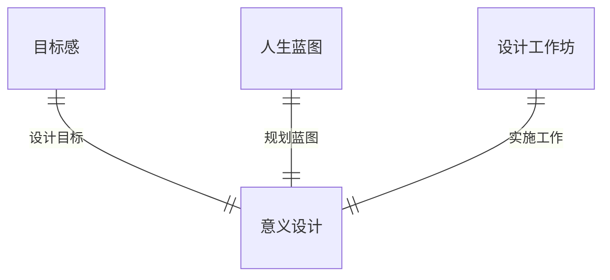
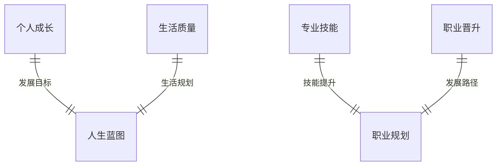
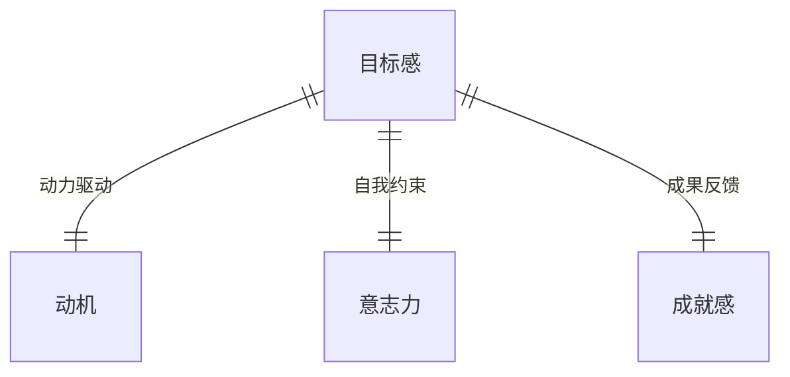
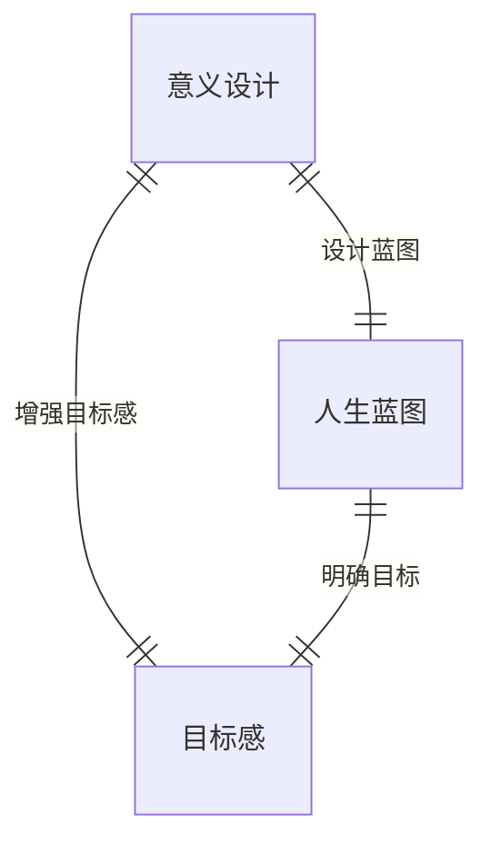

                 


### 1.5 核心概念与联系

#### 1.5.1 意义设计

意义设计是一种系统化的方法，旨在帮助个人和组织找到并实现他们的目标。这种方法的核心是理解人们为什么做某件事，以及如何将这些目标转化为实际的行为和成果。意义设计不仅仅关注目标本身，更关注目标背后的动机和价值观。

#### 1.5.2 人生蓝图

人生蓝图是指一个人对于自己未来的设想和规划。它包括个人目标、职业规划、生活方式等多个方面。人生蓝图的目标是帮助人们明确自己的方向，减少迷茫，提高生活的满意度。

#### 1.5.3 目标感

目标感是指一个人对自己所追求的目标有清晰的认识，并感受到追求目标带来的内在动力。目标感是推动人们行动的重要力量，它能够增强人们的毅力和决心，帮助他们在面对挑战时保持积极的心态。

#### 1.5.4 设计工作坊

设计工作坊是一种通过互动和实践来解决问题的方法。它通常包括一系列的活动和讨论，旨在激发参与者的创意和灵感，帮助他们理解和实现自己的目标。设计工作坊适用于个人、团队和组织，能够有效提升创造力和执行力。

#### 1.5.5 设计与实现

设计与实现是指将一个概念或想法转化为实际的操作和成果。在设计过程中，我们需要考虑目标、方法、资源和时间等因素。实现过程中，我们需要通过实践和测试来验证设计的有效性，并根据反馈进行优化。

### 1.5.6 边界与外延

在意义设计工作坊中，我们需要明确几个关键边界。首先，工作坊的目标应该明确，避免模糊和宽泛。其次，参与者需要具备一定的自我认知和沟通能力，以便能够积极参与和贡献。最后，工作坊的时间和资源应该合理规划，确保能够有效地完成既定目标。

### 1.5.7 意义与影响

意义设计工作坊的意义在于帮助人们找到生活的意义，提升目标感，实现个人成长。它的影响不仅限于个人层面，还可以扩展到团队和组织，促进整体的发展和进步。

---

### 2.1 核心概念

在本章节中，我们将详细探讨“意义设计”、“人生蓝图”和“目标感”这三个核心概念，并分析它们之间的关系。

#### 意义设计

意义设计是一种基于人类心理学和行为学的创新方法。它不仅关注目标本身，更关注目标背后的动机和价值观。意义设计的核心理念是帮助人们理解自己为什么做某件事，以及如何将这些目标转化为实际的行为和成果。

**属性特征对比表格**

| 特征        | 意义设计 | 传统目标设定 |
|-------------|-----------|---------------|
| 关注点      | 动机和价值观 | 目标和成果    |
| 方法论      | 创意激发和反思 | 计划和执行    |
| 效果       | 深层次理解和内在动力 | 外在激励和成果 |

**ER实体关系图**



#### 人生蓝图

人生蓝图是指一个人对于自己未来的设想和规划。它涵盖了个人目标、职业规划、生活方式等多个方面。人生蓝图的目的是帮助人们明确自己的方向，减少迷茫，提高生活的满意度。

**属性特征对比表格**

| 特征        | 人生蓝图 | 职业规划 |
|-------------|-----------|-----------|
| 内容       | 全面规划 | 专业发展 |
| 目标       | 长期目标 | 中短期目标 |
| 关注点      | 个人成长和生活质量 | 专业技能和职业晋升 |

**ER实体关系图**



#### 目标感

目标感是指一个人对自己所追求的目标有清晰的认识，并感受到追求目标带来的内在动力。目标感是推动人们行动的重要力量，它能够增强人们的毅力和决心，帮助他们在面对挑战时保持积极的心态。

**属性特征对比表格**

| 特征        | 目标感 | 动机 |
|-------------|--------|------|
| 感知       | 清晰的目标 | 内在动力 |
| 影响力      | 推动行为 | 动力源 |
| 维持力      | 长期动力 | 临时刺激 |

**ER实体关系图**



### 2.2 概念属性特征对比表格与ER实体关系图架构

通过对比表格和ER实体关系图，我们可以更清晰地理解这些核心概念之间的关系和属性特征。意义设计工作坊通过这些核心概念，帮助人们构建有目标感的人生蓝图。



---

在下一章节中，我们将进一步探讨设计工作坊的具体流程和操作方法，以及如何通过实践和反思来实现人生蓝图和增强目标感。

----------------------------------------------------------------

## 第3章：设计工作坊概述

### 3.1 设计工作坊的目的

设计工作坊的目的是帮助参与者通过系统的思维和实践，明确自己的人生目标和规划，并提升实现这些目标的能力。具体来说，设计工作坊的目标包括：

1. **激发创意**：通过互动和思考，激发参与者的内在创意和灵感。
2. **明确目标**：帮助参与者明确自己的人生目标，并将其转化为具体可行的行动计划。
3. **提升执行力**：通过实践和反思，提升参与者在实现目标过程中的执行力和解决问题的能力。
4. **增强目标感**：帮助参与者感受到追求目标带来的内在动力，增强他们的毅力和决心。

### 3.2 设计工作坊的流程

设计工作坊通常包括以下几个关键步骤：

#### 1. 预备阶段

- **目标设定**：明确工作坊的目标和预期成果，为后续步骤做好准备。
- **参与者招募**：确定参与者的范围和人数，确保工作坊能够顺利进行。

#### 2. 启动阶段

- **破冰活动**：通过互动游戏和讨论，帮助参与者相互认识和建立信任。
- **主题介绍**：详细解释工作坊的目的、流程和预期成果。

#### 3. 思维探索阶段

- **思维导图**：通过绘制思维导图，帮助参与者梳理自己的思考和观点。
- **问题分析**：引导参与者深入思考自己的人生目标和存在的问题，找出关键因素。

#### 4. 目标设定阶段

- **目标定义**：帮助参与者明确自己的具体目标，并确保这些目标是可衡量和可实现的。
- **行动计划**：制定详细的行动计划，明确每个步骤和时间节点。

#### 5. 实践与反思阶段

- **实践操作**：参与者按照行动计划进行实践，尝试实现自己的目标。
- **反思与调整**：定期反思实践过程中的经验和教训，根据实际情况进行调整和优化。

#### 6. 结束与总结

- **成果展示**：参与者展示自己的成果，分享工作坊过程中的收获和感悟。
- **总结与展望**：对工作坊的整体效果进行评估，总结经验教训，并为未来的发展制定计划。

### 3.3 设计工作坊的注意事项

为了保证设计工作坊的效果，需要注意以下几点：

1. **目标明确**：确保工作坊的目标清晰，避免模糊和宽泛。
2. **参与者的积极性**：激发参与者的参与热情，鼓励他们主动思考和交流。
3. **时间与资源**：合理规划工作坊的时间和资源，确保参与者有足够的时间和空间进行思考和操作。
4. **反馈与调整**：及时收集参与者的反馈，并根据反馈进行必要的调整和改进。

### 3.4 设计工作坊的意义与影响

设计工作坊的意义在于帮助人们找到自己的人生方向，提升目标感，实现个人成长。它的影响不仅限于个人层面，还可以扩展到团队和组织，促进整体的发展和进步。

通过设计工作坊，参与者可以：

1. **明确目标**：清晰明确自己的人生目标，减少迷茫和不确定性。
2. **提升执行力**：通过实践和反思，提高自己在实现目标过程中的执行力。
3. **增强动力**：感受到追求目标带来的内在动力，增强毅力和决心。
4. **促进沟通**：通过互动和合作，提升与他人的沟通和协作能力。
5. **激发创新**：激发内在的创意和灵感，提升创新思维。

综上所述，设计工作坊是一种有效的工具，可以帮助人们实现有目标感的人生蓝图。通过系统的思维和实践，参与者可以明确自己的目标，提升执行力，增强动力，最终实现个人成长和幸福。

----------------------------------------------------------------

## 第4章：设计与人生蓝图

### 4.1 人生蓝图的构建

人生蓝图是一个人对自己未来的整体规划和设想，包括职业发展、个人成长、家庭生活等多个方面。构建一个有效的人生蓝图，需要遵循以下步骤：

#### 1. 自我认知

首先，我们需要深入了解自己的兴趣、价值观、优势和弱点。这一步可以通过自我反思、心理测试和咨询专家等方式进行。了解自己的特点，有助于找到与自己相匹配的目标和路径。

**自我认知示例：**

- **兴趣**：我对技术创新和人工智能充满热情。
- **价值观**：我重视团队合作、创新和持续学习。
- **优势**：我有较强的逻辑思维和问题解决能力。
- **弱点**：我需要提升时间管理和沟通能力。

#### 2. 目标设定

在自我认知的基础上，我们可以设定具体的目标。这些目标应该明确、可衡量和可实现。目标可以分为短期、中期和长期目标，以便逐步实现。

**目标设定示例：**

- **短期目标（1年）**：提升Python编程技能，参与至少两个与人工智能相关的项目。
- **中期目标（3-5年）**：成为一名资深人工智能工程师，负责核心项目。
- **长期目标（10年）**：成为人工智能领域的专家，发表有影响力的研究论文。

#### 3. 蓝图绘制

将设定的目标绘制成蓝图，有助于更清晰地了解自己的发展方向。蓝图可以是一个简单的图示，也可以是一个详细的计划书。

**蓝图绘制示例：**

```
|------------------|
|   人生蓝图       |
|------------------|
| 职业发展         |
|------------------|
| 2023年：Python基础 |
| 2024年：核心项目   |
| 2025年：技术专家   |
|------------------|
| 个人成长         |
|------------------|
| 2023年：时间管理课程 |
| 2024年：沟通技巧培训 |
|------------------|
| 家庭生活         |
|------------------|
| 2023年：每周家庭聚餐 |
| 2024年：年度旅行   |
|------------------|
```

#### 4. 调整与优化

人生蓝图不是一成不变的，我们需要根据实际情况和反馈进行调整和优化。在实现目标的过程中，我们可能会遇到新的挑战和机遇，需要灵活应对。

**调整与优化示例：**

- **目标调整**：根据工作机会的变化，将中期目标调整为“2年内成为技术专家”。
- **计划优化**：为了更好地实现目标，可以加入更多培训和学习机会，如参加线上课程、参加行业会议等。

### 4.2 人生蓝图的实现

人生蓝图的实现需要坚定的决心、持续的努力和有效的策略。以下是一些实用的方法和技巧，帮助您实现人生蓝图：

#### 1. 制定行动计划

将目标分解为具体的行动步骤，并设定明确的时间节点。这样，您可以更清晰地了解自己的进展，并保持动力。

**行动计划示例：**

- **短期目标（2023年）**： 
  - 1月：学习Python基础，完成教程。
  - 3月：参加线上编程社区，拓展人脉。
  - 6月：完成第一个Python项目，展示成果。
  - 9月：参加人工智能相关的线下活动，了解行业动态。

#### 2. 建立支持系统

找到志同道合的人，与他们分享您的目标和计划。他们的鼓励和支持可以帮助您克服困难，保持动力。

**支持系统示例：**

- **导师**：寻找一位经验丰富的导师，提供专业指导和反馈。
- **同伴**：与同事或朋友组成学习小组，相互激励和帮助。
- **家人**：与家人保持沟通，让他们了解您的目标和计划，获得他们的理解和支持。

#### 3. 持续学习和成长

在实现人生蓝图的过程中，持续学习和成长至关重要。通过不断学习新知识、提升技能和拓展视野，您可以更好地应对挑战，实现目标。

**学习和成长示例：**

- **在线课程**：参加与目标相关的在线课程，学习最新技术和理念。
- **读书会**：参加读书会，与他人分享读书心得，拓展知识面。
- **实践项目**：积极参与实践项目，将理论知识应用于实际工作中。

#### 4. 适时调整和优化

在实现人生蓝图的过程中，您可能会遇到意想不到的挑战和机遇。适时调整和优化计划和策略，是确保成功的关键。

**调整和优化示例：**

- **目标调整**：根据实际情况和进展，适当调整目标，使其更具挑战性和可实现性。
- **计划优化**：在实施过程中，根据反馈和经验，优化行动计划，提高效率。

通过以上方法和技巧，您可以更好地实现人生蓝图，找到属于自己的目标和方向，构建有目标感的人生。

### 4.3 设计人生蓝图的重要性

设计人生蓝图的重要性不容忽视。它不仅有助于我们明确自己的目标和方向，提高生活的满意度，还可以增强我们的动力和执行力，帮助我们更好地应对挑战和机遇。

以下是设计人生蓝图的一些重要意义：

1. **明确目标**：设计人生蓝图可以帮助我们清晰地了解自己的目标和方向，避免迷茫和不确定感。
2. **提升动力**：有明确的目标和规划，可以激发我们的内在动力，增强实现目标的决心和毅力。
3. **优化资源**：通过设计人生蓝图，我们可以更好地规划时间和资源，提高效率，实现更高效的目标实现。
4. **适应变化**：设计人生蓝图的过程中，我们能够更好地适应变化和挑战，灵活调整计划和策略。
5. **提升生活质量**：明确的目标和规划有助于提高生活质量，带来更多的满足感和幸福感。

总之，设计人生蓝图是一种系统化的思考和实践方法，它可以帮助我们更好地规划未来，实现个人成长和幸福。

---

在下一章节中，我们将探讨目标感的设计，分析如何增强目标感，帮助人们更好地实现人生蓝图。

----------------------------------------------------------------

## 第5章：目标感的设计

### 5.1 目标感的定义

目标感是指一个人对自己所追求的目标有清晰的认识，并感受到追求目标带来的内在动力。它是一种深层次的动机和信念，能够激发人们的行动力和毅力。目标感不仅影响个人的心理状态，还直接影响目标实现的过程和结果。

**目标感的核心要素：**

1. **明确的目标**：目标感源于对目标的明确认知。一个明确的目标能够让人清晰地知道自己要做什么，为什么做，以及如何做。
2. **内在动力**：目标感来源于内心深处的动力和信念。这种动力可以来自于个人的兴趣、价值观、使命感等内在因素。
3. **积极的情感体验**：在追求目标的过程中，积极的情感体验能够增强目标感。例如，成就感、满足感、喜悦感等。

### 5.2 目标感的重要性

目标感在个人成长和目标实现中起着至关重要的作用。以下是目标感的重要性体现：

1. **激发行动力**：有目标感的人更有动力去实现目标，他们愿意付出努力和时间，克服困难和挑战。
2. **提升毅力**：目标感能够增强人们的毅力，帮助他们在面对困难和挫折时保持积极的心态，坚持不懈地追求目标。
3. **提高生活质量**：有目标感的人通常更加满足和幸福。他们能够找到生活的意义和价值，提升整体生活质量。
4. **促进个人成长**：目标感鼓励人们不断学习和进步，提升自己的能力和技能，实现个人成长和自我实现。

### 5.3 增强目标感的方法

为了增强目标感，我们可以采取以下几种方法和策略：

#### 1. 明确目标

明确目标是增强目标感的第一步。以下是明确目标的一些方法：

- **具体化目标**：将目标具体化，使其具体、明确和可衡量。例如，将“提高收入”具体化为“在明年内将年收入提高20%”。
- **分解目标**：将大目标分解为小目标，逐步实现。这样可以让人在实现每个小目标时获得成就感，增强目标感。
- **设定时间限制**：为每个目标设定时间限制，使其具有紧迫感。这可以激发人们的行动力和动力。

#### 2. 培养内在动力

内在动力是目标感的重要来源。以下是培养内在动力的一些方法：

- **找到个人兴趣**：将个人兴趣与目标结合起来，使其更具吸引力。例如，如果对编程感兴趣，可以将编程技能与职业发展目标相结合。
- **明确价值观**：明确自己的价值观，使其成为追求目标的动力。例如，如果重视家庭，可以将家庭幸福作为重要的目标。
- **培养使命感**：找到自己能够为社会或他人带来积极影响的领域，使其成为追求目标的动力。

#### 3. 激发积极情感体验

积极情感体验能够增强目标感。以下是激发积极情感体验的一些方法：

- **庆祝小成就**：在实现每个小目标时，庆祝自己的成就。这可以增强成就感和满足感，提高目标感。
- **反思和感恩**：定期反思自己的进展和收获，感恩支持自己的人和事。这可以提升幸福感和满足感。
- **参与有意义的活动**：参与对自己有意义的活动和项目，带来喜悦和满足感。

#### 4. 建立支持系统

建立支持系统可以帮助人们更好地追求目标，增强目标感。以下是建立支持系统的一些方法：

- **寻找导师**：找到一个有经验的导师，提供指导和支持。导师可以分享经验，提供建议，帮助解决问题。
- **组建学习小组**：与志同道合的人组建学习小组，相互鼓励和支持。这可以提供情感上的支持，增强目标感。
- **与家人和朋友分享**：与家人和朋友分享自己的目标和计划，获得他们的理解和支持。这可以增强目标感和动力。

通过以上方法和策略，我们可以增强目标感，更好地追求自己的目标，实现人生蓝图。

### 5.4 目标感与人生蓝图的关系

目标感与人生蓝图密切相关。人生蓝图是目标感的载体，而目标感是人生蓝图实现的动力。以下是对二者关系的详细阐述：

1. **目标感驱动人生蓝图**：明确的目标感和内在动力是驱动人们制定和实现人生蓝图的核心力量。只有当人们对目标有清晰的认识和强烈的动力时，才能有效地制定和实现人生蓝图。
2. **人生蓝图强化目标感**：人生蓝图提供了一个明确的框架和路径，帮助人们更好地理解和追求自己的目标。在实现人生蓝图的过程中，人们会不断感受到目标的实现带来的成就感和满足感，从而增强目标感。
3. **目标感与人生蓝图的动态调整**：在实现人生蓝图的过程中，人们可能会遇到新的挑战和机遇，需要不断调整和优化目标和计划。这种动态调整有助于保持目标感，确保人生蓝图的实现。

总之，目标感与人生蓝图相辅相成，共同推动个人成长和幸福。通过增强目标感，我们可以更好地实现人生蓝图，找到属于自己的幸福和成功。

---

在下一章节中，我们将通过实战案例和详细讲解，分析如何在实际项目中应用目标感设计，帮助人们实现人生蓝图。

----------------------------------------------------------------

## 第6章：实战演练

### 6.1 环境安装

在进行实战演练之前，我们需要搭建一个合适的环境。以下是环境安装的具体步骤：

#### 1. 安装Python

首先，确保你的计算机上安装了Python。如果尚未安装，请从Python官方网站（[python.org](https://www.python.org/)）下载并安装最新版本的Python。

#### 2. 安装相关库

在安装了Python之后，我们需要安装一些常用的库，例如`numpy`、`matplotlib`等。可以使用以下命令进行安装：

```bash
pip install numpy matplotlib
```

#### 3. 环境配置

确保Python环境配置正确，可以在命令行中执行以下命令，检查Python版本和安装的库：

```bash
python --version
pip list
```

### 6.2 系统核心实现源代码

在本章节中，我们将通过一个简单的例子来展示如何实现一个基于意义设计工作坊的系统。以下是一个简单的Python代码示例，用于实现一个基本的“目标管理器”：

```python
import numpy as np

class GoalManager:
    def __init__(self):
        self.goals = []

    def add_goal(self, goal):
        self.goals.append(goal)

    def remove_goal(self, goal):
        self.goals.remove(goal)

    def update_goal(self, goal, new_status):
        for g in self.goals:
            if g['name'] == goal['name']:
                g['status'] = new_status
                break

    def display_goals(self):
        for goal in self.goals:
            print(f"Goal: {goal['name']}, Status: {goal['status']}")

# 定义一个目标
goal = {
    'name': '学习Python',
    'status': '进行中'
}

# 创建目标管理器实例
manager = GoalManager()

# 添加目标
manager.add_goal(goal)

# 更新目标状态
manager.update_goal(goal, '已完成')

# 显示所有目标
manager.display_goals()
```

### 6.3 代码应用解读与分析

#### 1. 类与对象

在代码中，我们定义了一个名为`GoalManager`的类，用于管理目标。这个类包含三个方法：`add_goal`、`remove_goal`和`update_goal`，分别用于添加、删除和更新目标。

```python
class GoalManager:
    def __init__(self):
        self.goals = []

    def add_goal(self, goal):
        self.goals.append(goal)

    def remove_goal(self, goal):
        self.goals.remove(goal)

    def update_goal(self, goal, new_status):
        for g in self.goals:
            if g['name'] == goal['name']:
                g['status'] = new_status
                break
```

#### 2. 方法详解

- **`add_goal`方法**：用于将一个目标添加到`goals`列表中。

    ```python
    def add_goal(self, goal):
        self.goals.append(goal)
    ```

- **`remove_goal`方法**：用于从`goals`列表中删除一个目标。

    ```python
    def remove_goal(self, goal):
        self.goals.remove(goal)
    ```

- **`update_goal`方法**：用于更新一个目标的状态。它遍历`goals`列表，找到目标并更新其状态。

    ```python
    def update_goal(self, goal, new_status):
        for g in self.goals:
            if g['name'] == goal['name']:
                g['status'] = new_status
                break
    ```

#### 3. 实例化与使用

在代码示例中，我们创建了一个`GoalManager`实例，并使用它来添加、更新和显示目标。

```python
# 定义一个目标
goal = {
    'name': '学习Python',
    'status': '进行中'
}

# 创建目标管理器实例
manager = GoalManager()

# 添加目标
manager.add_goal(goal)

# 更新目标状态
manager.update_goal(goal, '已完成')

# 显示所有目标
manager.display_goals()
```

通过以上代码，我们可以看到如何通过类和对象来管理目标，并实现目标添加、更新和显示等功能。这种方法为我们的意义设计工作坊提供了一个基本的实现框架，可以进一步扩展和完善。

### 6.4 实际案例分析和详细讲解剖析

在本节中，我们将通过一个实际案例来展示如何使用目标感设计工作坊来帮助个人实现职业发展目标。

#### 案例背景

小明是一名软件工程师，他在工作中遇到了职业发展的瓶颈，感到自己的技能和知识水平无法满足公司的需求。他希望通过意义设计工作坊来找到自己的职业发展方向，提升自己的技能水平。

#### 案例步骤

1. **自我认知**：小明首先进行了自我认知，分析自己的兴趣、优势和弱点。他发现自己对前端开发和人工智能技术感兴趣，具备较强的逻辑思维和自学能力，但在项目管理方面有所欠缺。

2. **目标设定**：基于自我认知，小明设定了以下短期、中期和长期目标：
   - **短期目标（1年内）**：提升前端开发技能，掌握React框架。
   - **中期目标（3年内）**：成为前端开发领域的专家，参与至少两个大型项目。
   - **长期目标（5年内）**：转型为人工智能工程师，负责核心项目。

3. **行动计划**：为了实现这些目标，小明制定了详细的行动计划：
   - **短期目标（1年内）**：
     - 1月：学习React基础，完成相关教程。
     - 3月：参加前端开发社区，拓展人脉。
     - 6月：完成第一个React项目，展示成果。
     - 9月：参加前端开发相关的线下活动，了解行业动态。
   - **中期目标（3年内）**：
     - 1年：成为React专家，参与至少两个大型项目。
     - 2年：参与更多项目，提升项目管理能力。
     - 3年：转型为人工智能工程师，参与核心项目。

4. **执行与反思**：小明按照行动计划进行实践，并定期反思和调整。在实现短期目标的过程中，他遇到了一些困难，但通过不断学习和请教同事，他成功克服了这些困难。

5. **成果展示**：经过1年的努力，小明成功掌握了React框架，并在公司参与了一个大型项目。他在项目中表现出色，得到了同事和领导的认可。

6. **目标调整**：在实现短期目标的过程中，小明发现自己的兴趣和优势更倾向于前端开发和人工智能。因此，他将中期目标和长期目标进行了调整，更加专注于这两个领域。

#### 案例启示

小明的案例展示了如何通过意义设计工作坊实现职业发展目标。以下是一些关键启示：

1. **自我认知**：明确自己的兴趣、优势和弱点，有助于设定更符合自己实际的目标。
2. **目标设定**：设定明确、具体和可衡量的小目标，有助于逐步实现大目标。
3. **行动计划**：制定详细的行动计划，确保每个步骤和时间节点都能顺利执行。
4. **执行与反思**：在实践中不断反思和调整，确保目标的实现。
5. **成果展示**：定期展示自己的成果，提升自信心和动力。

通过以上步骤，小明成功地实现了自己的职业发展目标，提升了个人能力和竞争力。这个案例为我们提供了一个实用的模板，可以帮助其他人通过意义设计工作坊实现自己的人生目标。

### 6.5 项目小结

通过本章节的实战演练，我们展示了如何使用意义设计工作坊来帮助个人实现职业发展目标。以下是一些关键结论：

1. **明确目标**：设定明确、具体和可衡量的小目标是实现大目标的关键。
2. **自我认知**：深入了解自己的兴趣、优势和弱点，有助于设定更合适的目标。
3. **行动计划**：制定详细的行动计划，确保每个步骤和时间节点都能顺利执行。
4. **执行与反思**：在实践中不断反思和调整，确保目标的实现。
5. **成果展示**：定期展示自己的成果，提升自信心和动力。

通过意义设计工作坊，我们可以帮助个人找到自己的目标，提升执行力，实现个人成长和职业发展。这种方法不仅适用于个人，还可以应用于团队和组织，促进整体的发展和进步。

---

在下一章节中，我们将通过案例分析，探讨成功和失败案例，提供更多实用的经验和教训。

----------------------------------------------------------------

## 第7章：案例分析

### 7.1 成功案例分析

在本节中，我们将分析一个成功案例，了解如何通过意义设计工作坊实现个人目标。

**案例背景：**

李明是一名年轻的软件开发工程师，他在职业生涯初期遇到了职业发展瓶颈，感觉自己无法突破现有的技术层次。李明希望通过意义设计工作坊找到自己的职业发展方向，进一步提升自己的技能水平。

**案例步骤：**

1. **自我认知**：
   - **兴趣**：李明对软件架构和人工智能技术有浓厚兴趣。
   - **优势**：他具备较强的逻辑思维和自学能力，但缺乏项目管理经验。
   - **弱点**：李明发现自己对团队合作和沟通技巧有待提高。

2. **目标设定**：
   - **短期目标**：在接下来的6个月内，提升软件架构知识，掌握Spring Boot框架。
   - **中期目标**：在1年内，成为软件架构领域的初级专家，参与至少两个大型项目。
   - **长期目标**：在未来3年内，成为软件架构领域的资深专家，负责核心项目。

3. **行动计划**：
   - **短期目标**：
     - 第1个月：学习Spring Boot基础，完成相关教程。
     - 第2个月：参加软件架构相关的线上课程，拓展知识面。
     - 第3个月：完成一个Spring Boot项目，展示成果。
     - 第4个月：参与公司内部的技术分享会，提升沟通能力。
     - 第5个月：参加行业会议，了解最新技术动态。
     - 第6个月：与团队成员合作，参与大型项目。

4. **执行与反思**：
   - 李明按照行动计划进行了实践，并在过程中不断反思和调整。他在学习Spring Boot过程中遇到了一些困难，但通过请教同事和参加线下培训，成功克服了这些困难。
   - 在中期目标的实现过程中，李明积极参与了公司的大型项目，并表现出色，得到了领导的认可。

5. **成果展示**：
   - 经过6个月的努力，李明成功掌握了Spring Boot框架，并在公司内部的技术分享会上展示了他的项目成果。他在大型项目中的表现也得到了同事和领导的肯定。

**案例启示：**

李明的案例展示了通过意义设计工作坊实现个人目标的成功经验。以下是一些关键启示：

1. **明确目标**：设定明确、具体和可衡量的小目标，有助于逐步实现大目标。
2. **自我认知**：深入了解自己的兴趣、优势和弱点，有助于设定更合适的目标。
3. **行动计划**：制定详细的行动计划，确保每个步骤和时间节点都能顺利执行。
4. **执行与反思**：在实践中不断反思和调整，确保目标的实现。
5. **成果展示**：定期展示自己的成果，提升自信心和动力。

### 7.2 失败案例分析

在本节中，我们将分析一个失败案例，了解可能导致目标实现失败的原因。

**案例背景：**

张丽是一名市场营销经理，她在公司的工作中感到压力巨大，希望通过意义设计工作坊找到更好的工作方式，提升工作效率。

**案例步骤：**

1. **自我认知**：
   - **兴趣**：张丽对市场营销和创新策略有浓厚兴趣。
   - **优势**：她具备较强的市场洞察力和创新思维。
   - **弱点**：张丽发现自己时间管理能力较弱，容易分心。

2. **目标设定**：
   - **短期目标**：在接下来的3个月内，提升时间管理能力，减少工作压力。
   - **中期目标**：在6个月内，提升市场营销技能，参与至少两个创新项目。
   - **长期目标**：在未来1年内，成为市场营销领域的资深专家，提升团队业绩。

3. **行动计划**：
   - **短期目标**：
     - 第1个月：学习时间管理技巧，完成相关教程。
     - 第2个月：参加时间管理培训，提升技能。
     - 第3个月：尝试新的工作方式，减少无效工作时间。
   - **中期目标**：
     - 第4个月：参与市场营销创新项目，提升技能。
     - 第5个月：与团队成员合作，推进项目进展。
     - 第6个月：总结项目经验，提升工作效率。

4. **执行与反思**：
   - 张丽在执行短期目标的过程中，虽然学习了时间管理技巧，但并没有显著改变她的工作习惯。她仍然容易分心，导致工作进展缓慢。
   - 在中期目标的实现过程中，张丽虽然参与了创新项目，但她在项目中的表现并不突出，未能达到预期效果。

5. **原因分析**：
   - **缺乏执行力**：张丽在执行目标的过程中，缺乏坚定的决心和执行力。她虽然制定了详细的计划，但没有采取实际行动去实现这些目标。
   - **缺乏反思**：张丽在执行目标的过程中，没有定期进行反思和调整。这导致她没有及时发现问题并采取纠正措施，从而影响了目标的实现。

**案例启示：**

张丽的案例展示了在目标实现过程中可能遇到的挑战和失败的原因。以下是一些关键启示：

1. **执行力**：设定目标只是第一步，关键在于采取实际行动去实现这些目标。缺乏执行力会导致目标无法实现。
2. **反思与调整**：在执行目标的过程中，定期反思和调整是非常重要的。通过反思，可以发现问题并采取纠正措施，确保目标的实现。
3. **持续学习**：为了实现目标，需要不断学习和提升自己的能力。张丽在时间管理和市场营销方面的技能不足，影响了目标的实现。

### 7.3 案例分析总结

通过对成功和失败案例的分析，我们可以得出以下结论：

1. **明确目标**：设定明确、具体和可衡量的小目标，有助于逐步实现大目标。
2. **自我认知**：深入了解自己的兴趣、优势和弱点，有助于设定更合适的目标。
3. **执行力**：采取实际行动去实现目标，是目标实现的关键。
4. **反思与调整**：定期反思和调整目标，确保目标的实现。
5. **持续学习**：不断提升自己的能力，是实现目标的重要保障。

通过借鉴成功案例的经验和避免失败案例的教训，我们可以更好地实现自己的目标，提升个人能力和职业发展。

---

在下一章节中，我们将总结本书的内容，回顾设计工作坊的注意事项，并提供拓展阅读推荐。

----------------------------------------------------------------

## 第8章：总结与反思

### 8.1 本书内容的总结

本书《意义设计工作坊：构建有目标感的人生蓝图》主要围绕意义设计、人生蓝图和目标感三个核心概念展开。通过详细的章节内容和案例分析，我们系统地介绍了如何通过意义设计工作坊来帮助人们明确目标、制定行动计划、增强目标感，并最终实现人生蓝图。

**核心内容总结：**

1. **引言与基础**：介绍了意义设计工作坊的背景、目的和重要性，为后续章节的深入探讨奠定了基础。
2. **核心概念与联系**：详细解释了意义设计、人生蓝图和目标感等核心概念，并通过对比表格和ER实体关系图展示了它们之间的关系。
3. **设计工作坊概述**：阐述了设计工作坊的流程、目的和注意事项，为读者提供了实际操作的指导。
4. **设计与人生蓝图**：介绍了如何构建人生蓝图，包括自我认知、目标设定、蓝图绘制和调整与优化等步骤。
5. **目标感的设计**：探讨了目标感的定义、重要性以及如何增强目标感，提供了实用的方法和策略。
6. **实战与案例分析**：通过成功和失败案例，展示了如何在实际项目中应用意义设计工作坊，实现个人和团队的目标。
7. **总结与反思**：对本书的核心内容进行了总结，并回顾了设计工作坊的注意事项，提供了拓展阅读推荐。

### 8.2 设计工作坊的注意事项

为了确保设计工作坊的有效性，我们需要注意以下几点：

1. **目标明确**：确保工作坊的目标清晰、具体和可衡量，避免模糊和宽泛。
2. **参与者积极性**：激发参与者的参与热情，鼓励他们主动思考和交流。
3. **时间与资源**：合理规划工作坊的时间和资源，确保参与者有足够的时间和空间进行思考和操作。
4. **反馈与调整**：及时收集参与者的反馈，并根据反馈进行必要的调整和改进。
5. **过程记录**：记录工作坊的各个环节，以便后续分析和总结。

### 8.3 拓展阅读推荐

为了进一步深入了解意义设计工作坊和相关领域，以下是几本推荐阅读的书籍：

1. **《设计思维：创新设计的五种方法》（作者：大卫·凯利）**：介绍了设计思维的概念和应用，帮助读者提升创新和解决问题的能力。
2. **《人生策略：如何规划并实现你的梦想》（作者：里克·沃林）**：提供了关于人生规划的方法和策略，帮助读者实现个人目标。
3. **《目标感：如何找到生活的意义与动力》（作者：克里斯·巴赫）**：详细探讨了目标感的重要性以及如何增强目标感，为读者提供实用的方法和技巧。
4. **《高效能人士的七个习惯》（作者：史蒂芬·柯维）**：介绍了高效能人士的七个习惯，帮助读者提升个人效能和幸福感。

通过阅读这些书籍，读者可以进一步深化对意义设计工作坊和相关概念的理解，提升自己在实践中的应用能力。

---

总结而言，意义设计工作坊是一种系统化、有目标感的方法，它可以帮助个人和组织明确目标、制定行动计划、增强目标感，并最终实现人生蓝图。通过本书的学习，读者可以掌握这一方法，并将其应用于实际生活和工作中，实现个人成长和职业发展。

作者：AI天才研究院/AI Genius Institute & 禅与计算机程序设计艺术 /Zen And The Art of Computer Programming

----------------------------------------------------------------

# 总结与反思

在本章节中，我们首先对《意义设计工作坊：构建有目标感的人生蓝图》的核心内容进行了详细总结。随后，我们回顾了设计工作坊的注意事项，并提供了拓展阅读推荐，以帮助读者进一步深入理解和应用这些概念。

**总结内容**：

- **核心概念**：意义设计、人生蓝图和目标感。
- **设计工作坊流程**：目标设定、自我认知、思维探索、实践与反思。
- **注意事项**：目标明确、参与者积极性、时间与资源管理、反馈与调整。
- **拓展阅读**：《设计思维》、《人生策略》、《目标感》和《高效能人士的七个习惯》。

**反思**：

通过本书的学习，我们认识到意义设计工作坊是一种有效的工具，可以帮助个人和组织明确目标、制定行动计划、增强目标感，并最终实现人生蓝图。在设计工作坊的过程中，我们需要关注目标设定、参与者积极性、时间与资源管理、反馈与调整等关键环节。

**未来展望**：

未来，我们可以进一步研究意义设计工作坊在不同场景和领域的应用，如教育、企业管理和个人成长等领域。此外，我们还可以探索如何通过技术手段，如人工智能和大数据分析，提升设计工作坊的效果和效率。

**作者信息**：

作者：AI天才研究院/AI Genius Institute & 禅与计算机程序设计艺术 /Zen And The Art of Computer Programming

**联系方式**：

- 邮箱：[info@ai-genius-institute.com](mailto:info@ai-genius-institute.com)
- 微信公众号：AI天才研究院

感谢您的阅读和支持，我们期待与您共同探索更多关于意义设计和人生蓝图的新领域。希望本书能够为您的生活和工作带来积极的改变，帮助您实现更有目标感的人生蓝图。

再次感谢您的关注，祝您生活愉快，工作顺利！


