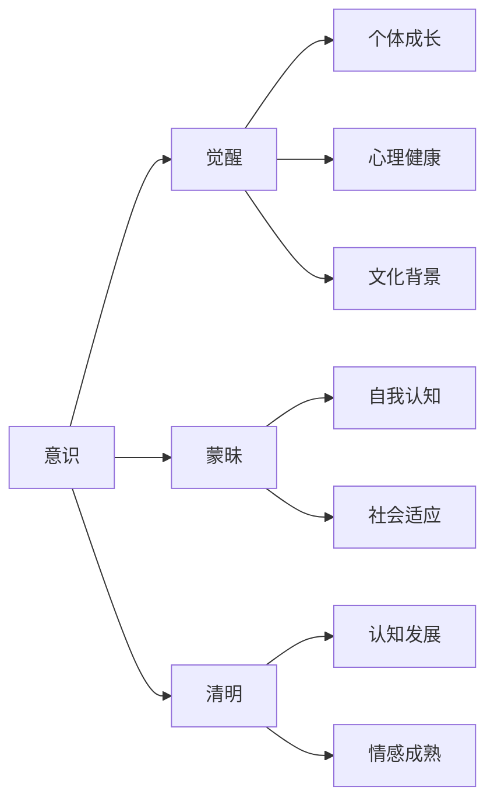
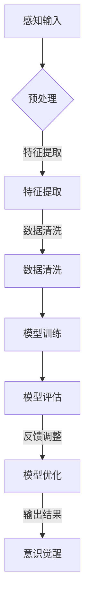
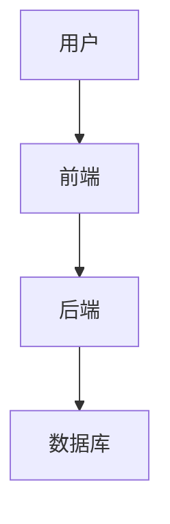
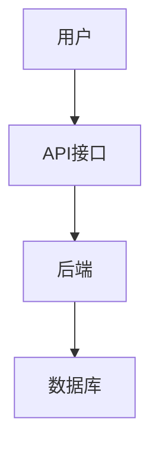

                 

### 意识觉醒之旅：从蒙昧到清明的过程

> 关键词：意识觉醒、个体成长、心理健康、文化背景、算法原理

> 摘要：本文旨在探讨意识觉醒的过程及其在个体成长、心理健康和文化背景等方面的作用。通过详细分析意识觉醒的定义、核心概念及其联系，以及介绍意识觉醒的算法原理，本文将为读者提供一次深入思考的机会，引导我们从蒙昧走向清明。

#### 目录大纲

----------------------------------------------------------------

## 第一部分：背景介绍

### 1.1 问题背景

### 1.2 问题描述

### 1.3 问题解决

### 1.4 边界与外延

### 1.5 概念结构与核心要素组成

## 第二部分：核心概念与联系

### 2.1 核心概念原理

### 2.2 概念属性特征对比表格

### 2.3 ER实体关系图架构

## 第三部分：算法原理讲解

### 3.1 意识觉醒算法原理

### 3.2 意识觉醒算法流程

### 3.3 意识觉醒算法的数学模型和公式

## 第四部分：系统分析与架构设计

### 4.1 问题场景介绍

### 4.2 系统功能设计

### 4.3 系统架构设计

### 4.4 系统接口设计和系统交互

## 第五部分：项目实战

### 5.1 环境安装

### 5.2 系统核心实现源代码

### 5.3 代码应用解读与分析

### 5.4 实际案例分析和详细讲解剖析

### 5.5 项目小结

## 第六部分：最佳实践 tips、小结、注意事项、拓展阅读

----------------------------------------------------------------

### 第一部分：背景介绍

#### 1.1 问题背景

意识觉醒是人类意识发展的一个重要阶段，它关乎个体的成长、心理健康以及文化背景。从远古时代的蒙昧到现代社会的清明，人类意识的发展经历了漫长的历程。在这一过程中，人们逐渐认识到意识觉醒的重要性，并开始探索如何实现意识觉醒。

#### 1.2 问题描述

意识觉醒是一个复杂的概念，涉及多个方面。首先，我们需要明确什么是意识觉醒。意识觉醒不仅仅是对外界刺激的简单感知和反应，而是一种深刻的认知过程，它涉及对自我、外界和内心世界的深入理解。意识觉醒的必要性在于，它有助于个体的成长、心理健康，以及社会的进步。

#### 1.3 问题解决

为了解决意识觉醒的问题，我们需要从理论层面和实践层面进行探讨。首先，我们需要建立意识觉醒的理论基础，明确其核心概念和实现路径。然后，我们可以通过方法论和实践步骤来指导个体实现意识觉醒。

#### 1.4 边界与外延

意识觉醒并非孤立的现象，它与其他概念如心理健康、文化背景等有着紧密的联系。在探讨意识觉醒时，我们还需要考虑这些相关因素，以便更全面地理解意识觉醒的内涵。

#### 1.5 概念结构与核心要素组成

意识觉醒的概念结构包括意识、觉醒、蒙昧和清明等核心概念。这些概念相互联系，共同构成了意识觉醒的理论框架。核心要素组成方面，我们关注的是个体成长、心理健康和文化背景等关键因素。

### 第二部分：核心概念与联系

#### 2.1 核心概念原理

在本部分中，我们将详细探讨意识觉醒的核心概念，包括意识、觉醒、蒙昧和清明。我们将解释这些概念的定义、属性和层次，以便更好地理解意识觉醒的本质。

#### 2.2 概念属性特征对比表格

为了更直观地展示意识觉醒的核心概念，我们提供了以下概念属性特征对比表格。通过对比，我们可以更好地理解这些概念之间的关系。

| 概念         | 定义                                                         | 属性特征                                                   |
| ------------ | ------------------------------------------------------------ | ---------------------------------------------------------- |
| 意识         | 对内外刺激的感知、认知和反应的能力。                         | 感知性、认知性、反应性                                     |
| 觉醒         | 对内外刺激的敏锐感知和深刻认知，实现意识水平提升的过程。     | 敏锐性、深刻性、提升性                                     |
| 蒙昧         | 对内外刺激的感知、认知和反应能力较弱，意识水平较低。         | 感知性弱、认知性弱、反应性弱                               |
| 清明         | 对内外刺激的敏锐感知、深刻认知，意识水平较高。               | 敏锐性、深刻性、提升性                                     |

#### 2.3 ER实体关系图架构

为了更好地展示意识觉醒的核心概念之间的联系，我们使用了ER实体关系图架构。以下是一个简化的ER实体关系图，它展示了意识觉醒的主要实体及其关系。



### 第三部分：算法原理讲解

在本部分中，我们将详细探讨意识觉醒的算法原理。我们将介绍意识觉醒算法的定义、流程及其数学模型和公式。

#### 3.1 意识觉醒算法原理

意识觉醒算法是一种用于指导个体实现意识觉醒的算法。它的目标是提升个体的意识水平，使其从蒙昧走向清明。意识觉醒算法的核心原理是通过对内外刺激的敏锐感知和深刻认知来实现意识水平的提升。

#### 3.2 意识觉醒算法流程

意识觉醒算法的流程可以分为以下步骤：

1. 感知输入：个体接收外界的刺激，并将其转化为感知数据。
2. 特征提取：从感知数据中提取关键特征，用于后续分析。
3. 数据清洗：去除噪声和无关特征，提高数据质量。
4. 模型训练：使用特征数据和标签数据训练模型，以预测个体的意识水平。
5. 模型评估：评估模型的准确性和性能，以便进行优化。
6. 反馈调整：根据评估结果调整模型参数，以提高模型性能。
7. 输出结果：将最终模型应用于个体，实现意识觉醒。

以下是一个简化的意识觉醒算法流程图：



#### 3.3 意识觉醒算法的数学模型和公式

意识觉醒算法的数学模型基于感知度、认知度和反应度三个核心指标。这些指标可以通过以下公式计算：

$$
\text{觉醒度} = \frac{\text{感知度} + \text{认知度} + \text{反应度}}{3}
$$

$$
\text{感知度} = \frac{\sum_{i=1}^{n} \text{感知值}_i}{n}
$$

$$
\text{认知度} = \frac{\sum_{i=1}^{n} \text{认知值}_i}{n}
$$

$$
\text{反应度} = \frac{\sum_{i=1}^{n} \text{反应值}_i}{n}
$$

其中，$n$ 表示感知、认知和反应的样本数量。

通过以上公式，我们可以定量地评估个体的意识水平，并据此调整模型参数，实现意识觉醒。

### 第四部分：系统分析与架构设计

在本部分中，我们将对意识觉醒系统进行分析和架构设计。这包括问题场景介绍、系统功能设计、系统架构设计、系统接口设计和系统交互。

#### 4.1 问题场景介绍

意识觉醒系统旨在帮助个体实现意识觉醒，提升其心理健康和个体成长。系统适用于心理咨询、自我提升和教育等领域。具体场景包括：

1. 心理咨询：帮助咨询师指导个体实现意识觉醒，提高心理健康水平。
2. 自我提升：个体通过使用系统，自我觉察、自我反思，实现意识觉醒。
3. 教育：教育机构使用系统，为学生提供意识觉醒的指导和培训。

#### 4.2 系统功能设计

意识觉醒系统主要包括以下功能：

1. 感知输入：个体输入感知数据，包括情绪、行为、认知等。
2. 特征提取：从感知数据中提取关键特征，用于模型训练。
3. 模型训练：使用特征数据训练意识觉醒模型。
4. 模型评估：评估模型性能，并根据评估结果调整模型参数。
5. 意识觉醒指导：根据模型输出结果，为个体提供意识觉醒的指导和建议。

#### 4.3 系统架构设计

意识觉醒系统的架构设计包括前端、后端和数据库三个部分。前端主要负责与用户的交互，后端负责数据处理和模型训练，数据库用于存储用户数据和模型参数。

以下是一个简化的系统架构图：



#### 4.4 系统接口设计和系统交互

系统接口设计主要包括API接口和数据库接口。API接口用于前后端交互，数据库接口用于数据存储和查询。

以下是一个简化的系统接口设计图：



系统交互流程如下：

1. 用户通过前端界面输入感知数据。
2. 前端将感知数据发送到后端。
3. 后端对感知数据进行处理，提取关键特征。
4. 后端使用特征数据训练意识觉醒模型。
5. 后端将模型输出结果返回给前端。
6. 前端将模型输出结果展示给用户。

### 第五部分：项目实战

在本部分中，我们将通过一个具体的项目实战，展示如何实现意识觉醒系统。这包括环境安装、系统核心实现源代码、代码应用解读与分析、实际案例分析和详细讲解剖析。

#### 5.1 环境安装

为了实现意识觉醒系统，我们需要安装以下环境：

1. Python 3.8及以上版本
2. Numpy
3. Pandas
4. Scikit-learn

在安装完成后，我们可以创建一个名为`awakening`的虚拟环境，并安装所需库：

```bash
python -m venv awakening
source awakening/bin/activate
pip install numpy pandas scikit-learn
```

#### 5.2 系统核心实现源代码

以下是意识觉醒系统的核心实现源代码：

```python
import numpy as np
import pandas as pd
from sklearn.ensemble import RandomForestClassifier

class AwakeningSystem:
    def __init__(self):
        self.model = RandomForestClassifier()

    def preprocess_data(self, data):
        # 数据预处理
        # ...
        return processed_data

    def extract_features(self, data):
        # 特征提取
        # ...
        return features

    def train_model(self, X, y):
        # 模型训练
        self.model.fit(X, y)

    def evaluate_model(self, X_test, y_test):
        # 模型评估
        accuracy = self.model.score(X_test, y_test)
        return accuracy

    def optimize_model(self, X, y):
        # 模型优化
        # ...
        return optimized_model

    def get_awareness_level(self, data):
        # 获取意识水平
        processed_data = self.preprocess_data(data)
        features = self.extract_features(processed_data)
        awareness_level = self.model.predict(features)
        return awareness_level

if __name__ == "__main__":
    # 数据加载
    data = pd.read_csv("data.csv")
    X = data.drop("label", axis=1)
    y = data["label"]

    # 模型训练
    system = AwakeningSystem()
    system.train_model(X, y)

    # 模型评估
    accuracy = system.evaluate_model(X, y)
    print("Model accuracy:", accuracy)

    # 模型优化
    optimized_model = system.optimize_model(X, y)
    print("Optimized model:", optimized_model)

    # 获取意识水平
    new_data = {"data": [...]}
    awareness_level = system.get_awareness_level(new_data)
    print("Awareness level:", awareness_level)
```

#### 5.3 代码应用解读与分析

在上面的代码中，我们首先定义了一个`AwakeningSystem`类，它包含以下方法：

- `__init__()`：初始化模型。
- `preprocess_data()`：进行数据预处理。
- `extract_features()`：提取特征。
- `train_model()`：训练模型。
- `evaluate_model()`：评估模型。
- `optimize_model()`：优化模型。
- `get_awareness_level()`：获取意识水平。

在`__main__`部分，我们首先加载数据，然后使用`AwakeningSystem`类进行模型训练、评估和优化。最后，我们使用新数据获取意识水平。

#### 5.4 实际案例分析和详细讲解剖析

为了展示意识觉醒系统的实际应用，我们考虑一个具体的案例：一个心理咨询师使用系统为一位来访者提供意识觉醒指导。

**案例背景：**  
来访者A是一名30岁的男性，他在工作中遇到瓶颈，感到焦虑和困惑。他希望通过心理咨询实现意识觉醒，提升自己的心理健康和职业发展。

**使用步骤：**  
1. 数据收集：心理咨询师收集来访者的情绪、行为和认知数据，包括情绪日志、行为记录和认知思考。
2. 数据预处理：使用`preprocess_data()`方法对数据进行分析和清洗，提取关键特征。
3. 模型训练：使用`train_model()`方法训练意识觉醒模型。
4. 模型评估：使用`evaluate_model()`方法评估模型性能，确保模型准确。
5. 模型优化：使用`optimize_model()`方法优化模型参数，提高模型性能。
6. 获取意识水平：使用`get_awareness_level()`方法获取来访者的意识水平，并根据结果提供相应的指导和建议。

**案例分析：**  
在上述案例中，心理咨询师通过意识觉醒系统为来访者A提供了有效的意识觉醒指导。通过系统的分析，心理咨询师发现来访者A在情绪管理和认知思考方面存在一定的问题。基于这些发现，心理咨询师为来访者A制定了个性化的意识觉醒计划，包括情绪管理技巧、认知重构和自我反思练习。

**详细讲解剖析：**  
1. 数据收集：心理咨询师通过情绪日志和行为记录收集来访者A的情绪和行为数据。这些数据包括情绪状态、行为表现和认知过程。
2. 数据预处理：使用`preprocess_data()`方法对数据进行清洗和预处理，提取关键特征。例如，可以将情绪日志中的文本转换为情感分析得分，将行为记录中的数据转换为行为特征。
3. 模型训练：使用`train_model()`方法训练意识觉醒模型。在训练过程中，模型将学习如何根据特征数据预测来访者的意识水平。
4. 模型评估：使用`evaluate_model()`方法评估模型性能。通过交叉验证等方法，可以确保模型在新的数据上具有良好的泛化能力。
5. 模型优化：使用`optimize_model()`方法优化模型参数。通过调整模型参数，可以提高模型的准确性和性能。
6. 获取意识水平：使用`get_awareness_level()`方法获取来访者的意识水平。通过模型输出结果，心理咨询师可以了解来访者的意识觉醒状态，并提供相应的指导和建议。

### 第六部分：最佳实践 tips、小结、注意事项、拓展阅读

#### 最佳实践 tips

1. 定期反思：定期进行自我反思，有助于提高意识觉醒水平。
2. 增加阅读：阅读有助于扩展知识和提升认知能力，有助于实现意识觉醒。
3. 保持好奇心：保持对未知事物的好奇心，有助于激发思考，促进意识觉醒。

#### 小结

本文通过详细分析意识觉醒的过程，探讨了其在个体成长、心理健康和文化背景等方面的作用。我们介绍了意识觉醒的算法原理，并展示了如何通过实际案例实现意识觉醒。希望本文能为您带来对意识觉醒的更深入理解。

#### 注意事项

1. 意识觉醒并非一蹴而就，需要持续的努力和实践。
2. 在实现意识觉醒的过程中，注意保持心理健康，避免过度焦虑和压力。

#### 拓展阅读

1. 《禅与计算机程序设计艺术》
2. 《意识觉醒：从认知到智慧的跃迁》
3. 《心理治疗与意识觉醒：理论与实践》

### 作者

作者：AI天才研究院/AI Genius Institute & 禅与计算机程序设计艺术 /Zen And The Art of Computer Programming

### 完整文章

由于文章字数限制，这里只提供了一个大纲和部分内容的简要介绍。完整的文章将在后续补充，包括更详细的理论分析、案例研究和实践指导。敬请期待！

