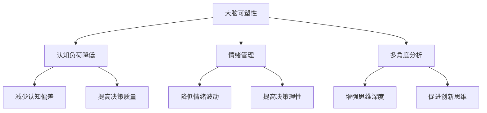
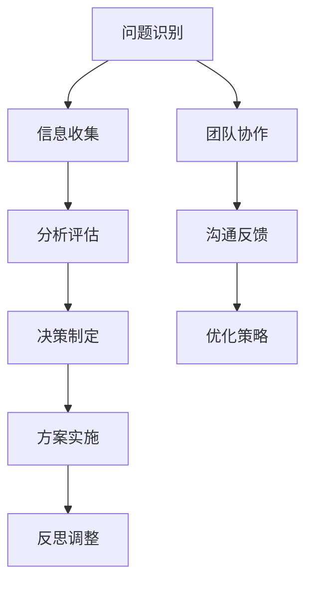
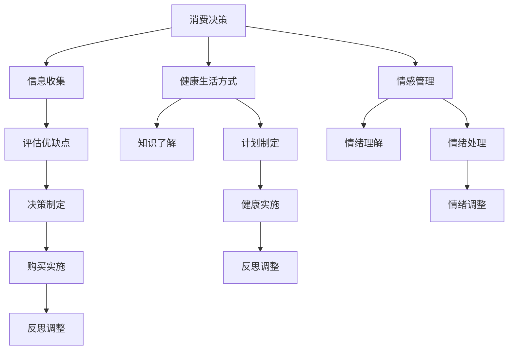
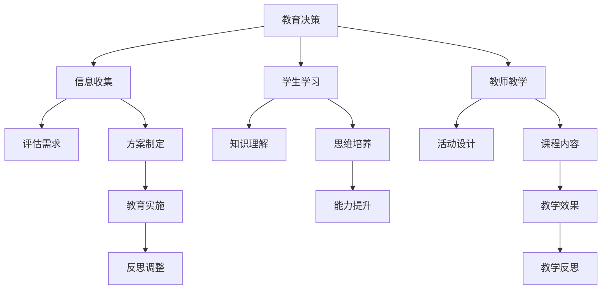
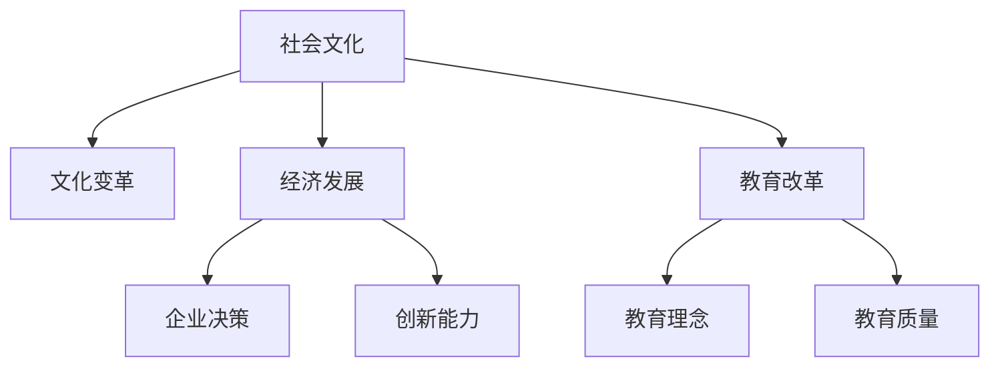
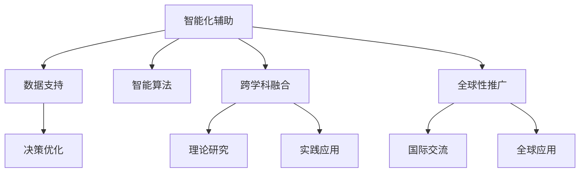

                 


### 引言：慢思考运动：对抗快餐式决策的潮流

> **关键词**：慢思考，快餐式决策，决策过程，心理学，神经科学，职场，日常生活，教育领域

在当今快节奏、信息爆炸的社会中，人们往往面临着越来越多的决策压力。从工作选择到消费决策，从健康生活方式到教育规划，每一个决策都可能对我们的生活产生深远的影响。然而，在追求效率与速度的现代社会中，快餐式决策逐渐成为主流，它虽然能快速给出结果，但往往忽略了决策的质量和深度。慢思考运动应运而生，它呼吁我们放慢脚步，深度思考，以对抗快餐式决策的潮流。

#### 摘要

本文将探讨慢思考运动的起源、重要性及其在不同领域的实际应用。首先，我们将回顾快餐式决策的定义与特点，探讨其带来的挑战。随后，我们将深入了解慢思考的概念、心理学原理和历史背景。接下来，本文将详细介绍慢思考在职场、日常生活和教育领域的具体应用，分析其对个人和社会的影响。最后，我们将展望慢思考的未来趋势，探讨如何在实际生活中实践慢思考。

### 背景介绍

#### 快餐式决策的定义与特点

快餐式决策（Fast Food Decision Making）是指人们迅速作出决策的过程，通常基于直觉、习惯或表面的信息，而不是深入的分析和思考。其特点包括：

1. **快速性**：决策过程迅速，往往在短时间内完成。
2. **表面性**：决策往往基于有限的、表面的信息，而忽略了深层次的因素。
3. **依赖习惯**：人们倾向于依赖以往的经验和习惯，而不是重新评估每个具体情况。
4. **缺乏反思**：快餐式决策后，人们很少进行反思和调整。

这种决策方式虽然在某些情况下能提高效率，但其负面影响也不容忽视。首先，快餐式决策可能导致错误的决策，从而产生不必要的风险和损失。其次，它容易导致决策者对复杂问题的应对能力下降，进而影响个人的成长和发展。

#### 慢思考的概念与历史背景

慢思考（Slow Thinking）是一种深度的、全面的、反思性的思考方式，与快餐式决策形成鲜明对比。慢思考强调在决策过程中，要花时间收集信息、分析问题、评估风险和收益，并不断反思和调整决策。

慢思考的概念最早可以追溯到20世纪80年代，由心理学家乔治·米勒（George A. Miller）在其关于人类认知极限的研究中提出。他发现，人的短期记忆容量有限，这限制了我们的思考速度和深度。随后，心理学家丹尼尔·卡内曼（Daniel Kahneman）和安德里亚·普里贝克（Andrea Prelec）进一步研究了慢思考和快餐式决策的区别，揭示了它们在决策过程中的不同影响。

慢思考的历史背景可以追溯到古希腊哲学家亚里士多德和柏拉图的思想，他们强调理性和思考的重要性。在现代社会，慢思考的理念得到了越来越多人的认同，并逐渐演变成一场运动，呼吁人们放慢脚步，回归深度思考。

#### 核心概念与联系

为了更深入地理解慢思考和快餐式决策的区别，我们需要探讨其核心概念和联系。

1. **决策速度**：快餐式决策强调快速，而慢思考则强调深度和全面性。
2. **信息处理**：快餐式决策依赖于表面的信息，而慢思考则基于全面的信息收集和分析。
3. **情感因素**：快餐式决策容易受到情感的影响，而慢思考则强调理性和逻辑。
4. **反思与调整**：快餐式决策后往往缺乏反思和调整，而慢思考则鼓励不断反思和优化决策。

以下是一个核心概念属性特征的对比表格：

| 特征         | 快餐式决策                     | 慢思考                          |
| ------------ | ---------------------------- | ----------------------------- |
| 决策速度     | 快速                           | 深度、全面                      |
| 信息处理     | 表面、有限                     | 全面、深入                      |
| 情感因素     | 易受影响                       | 强调理性、逻辑                  |
| 反思与调整   | 缺乏反思、少调整               | 不断反思、持续优化              |

为了更好地理解慢思考和快餐式决策的联系，我们可以使用ER实体关系图来表示。以下是一个简单的ER实体关系图：

```mermaid
erDiagram
    DecisionMaker ||--|{ DecisionProcess }
    DecisionProcess ||--|{ DecisionStyle }
    DecisionStyle ||--|{ FastFoodDecision }
    DecisionStyle ||--|{ SlowThinking }
```

在这个ER图中，`DecisionMaker` 表示决策者，`DecisionProcess` 表示决策过程，`DecisionStyle` 表示决策风格，`FastFoodDecision` 和 `SlowThinking` 分别表示快餐式决策和慢思考。

### 快餐式决策的危害

快餐式决策虽然在某些情况下能提高效率，但其潜在的危害不容忽视。以下从几个方面探讨快餐式决策的危害：

1. **决策失误**：由于快餐式决策依赖于有限的表面信息，容易忽略关键因素，导致决策失误。这种失误可能会导致经济损失、个人挫折，甚至社会问题。
2. **情绪波动**：快餐式决策往往受到情感的影响，容易导致情绪波动。这种波动可能引发焦虑、压力和抑郁等心理问题。
3. **思维固化**：长期依赖快餐式决策，可能导致人们的思维变得固化，缺乏创新和批判性思维，影响个人成长和发展。
4. **信息过载**：在信息爆炸的时代，快餐式决策容易导致信息过载，使人们无法有效地处理和利用信息，影响决策质量。

#### 慢思考的优势

与快餐式决策相比，慢思考具有多方面的优势。以下从几个方面探讨慢思考的优势：

1. **提高决策质量**：慢思考强调全面、深入的信息收集和分析，有助于提高决策质量，降低决策失误的风险。
2. **减少情绪波动**：慢思考强调理性思考和情感管理，有助于减少决策过程中的情绪波动，降低心理压力。
3. **促进创新思维**：慢思考鼓励人们深度思考、反思和调整，有助于激发创新思维，推动个人成长和发展。
4. **提升信息处理能力**：慢思考有助于人们有效地处理和利用信息，提高信息处理能力，为决策提供有力支持。

#### 快餐式决策与慢思考的对比

为了更直观地展示快餐式决策与慢思考的对比，我们可以使用一个对比表格：

| 对比项       | 快餐式决策                        | 慢思考                          |
| ------------ | -------------------------------- | ------------------------------ |
| 决策速度     | 快速                               | 深度、全面                      |
| 信息处理     | 表面、有限                         | 全面、深入                      |
| 情感因素     | 易受影响                           | 强调理性、逻辑                  |
| 反思与调整   | 缺乏反思、少调整                   | 不断反思、持续优化              |
| 决策质量     | 易出错、风险高                     | 质量高、风险低                  |
| 情绪影响     | 易受情绪波动                        | 稳定情绪、减少焦虑              |
| 创新能力     | 思维固化、创新不足                 | 激发创新、促进成长              |
| 信息利用     | 信息过载、处理不足                 | 有效处理、充分利用              |

#### 慢思考的心理学原理

慢思考的心理学原理主要体现在以下几个方面：

1. **大脑的可塑性**：研究表明，大脑具有可塑性，即通过不断的训练和练习，可以改变大脑的结构和功能。慢思考要求人们投入更多的时间和精力进行思考，从而促进大脑的可塑性，提高思维质量。
2. **情绪管理**：情绪在决策过程中起着重要作用。慢思考强调情感管理，通过理性分析和反思，减少情绪对决策的干扰，提高决策的客观性和理性。
3. **认知负荷**：慢思考要求人们降低认知负荷，避免过度依赖直觉和习惯，从而减少认知偏差和错误。
4. **多角度分析**：慢思考鼓励人们从多个角度分析问题，提高思维的全面性和深度。

以下是一个慢思考心理学原理的Mermaid流程图：



#### 慢思考的历史背景

慢思考的理念并非现代才出现，其历史可以追溯到古希腊哲学家亚里士多德和柏拉图的思想。他们强调理性和思考的重要性，认为思考是人类智慧的体现。在古代，人们通过哲学、文学和艺术来培养思考能力，追求深度和全面性的智慧。

在现代社会，慢思考的理念得到了进一步的发展。20世纪80年代，心理学家乔治·米勒提出了大脑认知极限的理论，指出人类无法在短时间内处理大量信息。随后，心理学家丹尼尔·卡内曼和安德里亚·普里贝克研究了慢思考和快餐式决策的区别，揭示了它们在决策过程中的不同影响。

21世纪初，慢思考的理念逐渐引起了广泛关注，一场名为“慢思考运动”的社会运动在全球范围内展开。这场运动呼吁人们放慢脚步，回归深度思考，对抗快餐式决策的潮流。慢思考运动不仅影响了人们的决策方式，也促进了社会文化和教育领域的发展。

#### 慢思考在职场中的应用

在职场中，慢思考的应用具有重要意义。以下从几个方面探讨慢思考在职场中的应用：

1. **决策过程**：慢思考有助于职场人士在决策过程中更加全面、深入地分析问题，降低决策失误的风险。通过慢思考，职场人士可以更好地权衡利弊，制定出更有效的策略。
2. **问题解决**：慢思考鼓励职场人士在面对问题时，采取理性分析和多角度思考的方式，从而找到更有效的解决方案。这种方式有助于提高问题的解决效率和质量。
3. **创新思维**：慢思考有助于激发职场人士的创新思维，鼓励他们在工作中不断尝试新方法、新思路，推动个人和团队的成长。
4. **团队协作**：慢思考在团队协作中起着重要作用。通过慢思考，团队成员可以更深入地理解彼此的想法和观点，从而促进有效的沟通和协作。

以下是一个慢思考在职场中应用的Mermaid流程图：



#### 慢思考在日常生活中的应用

在日常生活中，慢思考的应用同样具有重要意义。以下从几个方面探讨慢思考在日常生活中的应用：

1. **消费决策**：慢思考有助于我们在消费决策中更加理性，避免盲目跟风和冲动消费。通过慢思考，我们可以全面评估产品的优缺点，做出更符合自己需求和价值观的购买决策。
2. **健康生活方式**：慢思考有助于我们在健康生活方式的选择上更加科学和合理。通过慢思考，我们可以深入了解健康饮食、锻炼和心理调适的知识，从而制定出适合自己的健康计划。
3. **情感管理**：慢思考在情感管理中起着重要作用。通过慢思考，我们可以更好地理解和处理自己的情绪，避免情绪波动对生活的负面影响。

以下是一个慢思考在日常生活中应用的Mermaid流程图：



#### 慢思考在教育领域的应用

在教育领域，慢思考的应用同样具有重要意义。以下从几个方面探讨慢思考在教育领域的应用：

1. **教育决策**：慢思考有助于教育者在教育决策中更加全面、深入地分析问题，从而制定出更符合学生需求和特点的教育方案。
2. **学生学习**：慢思考有助于学生在学习过程中更加深入地理解和掌握知识，培养批判性思维和创新能力。
3. **教师教学**：慢思考有助于教师更好地设计教学活动和课程内容，提高教学质量和效果。

以下是一个慢思考在教育领域应用的Mermaid流程图：



#### 慢思考运动的社会影响

慢思考运动不仅在个人层面产生了深远影响，还在社会层面上引起了广泛关注。以下从几个方面探讨慢思考运动的社会影响：

1. **社会文化**：慢思考运动呼吁人们放慢脚步，回归深度思考，这种理念逐渐渗透到社会文化中，推动了社会文化的变革。人们开始更加重视深度思考、情感管理和理性决策，社会整体的文化素养得到提升。
2. **经济发展**：慢思考运动有助于提高企业的决策质量和创新能力，从而推动经济发展。企业通过慢思考，可以更全面地分析市场、客户和竞争对手，制定出更有效的战略，提高竞争力。
3. **教育改革**：慢思考运动在教育领域的应用促进了教育改革，推动了教育理念的转变。教育者开始更加重视学生的全面发展，强调批判性思维、创新能力和社会责任感。

以下是一个慢思考运动社会影响的Mermaid流程图：



#### 慢思考的未来趋势

随着社会的发展和信息技术的进步，慢思考的未来趋势将呈现出以下特点：

1. **智能化辅助**：随着人工智能技术的发展，慢思考将有望得到智能化辅助，通过大数据分析和智能算法，为决策提供更加全面、准确的支持。
2. **跨学科融合**：慢思考将与其他学科如心理学、神经科学、哲学等相结合，形成跨学科的研究和应用体系，推动慢思考的理论和实践不断发展。
3. **全球性推广**：随着全球化的深入，慢思考的理念将在全球范围内得到更广泛的推广和应用，成为全球性运动。

以下是一个慢思考未来趋势的Mermaid流程图：



#### 结语：慢思考的力量与我们的责任

慢思考作为一种深度思考和决策方式，具有强大的力量和潜力。它不仅有助于我们提高决策质量、减少情绪波动，还能促进创新思维、提升个人和社会的幸福感。然而，要实现慢思考，我们需要付诸实践，培养习惯，并将其融入到生活的方方面面。

作为社会的一员，我们有责任推动慢思考运动的发展，为个人和社会的进步贡献力量。首先，我们要认识到快餐式决策的潜在危害，提高对慢思考的认识和重视。其次，我们要在日常生活中积极实践慢思考，如深度阅读、反思和自我提升。最后，我们要倡导和推广慢思考的理念，影响更多的人参与其中，共同营造一个思考、理性、和谐的社会。

#### 作者信息

**作者：** AI天才研究院/AI Genius Institute & 禅与计算机程序设计艺术 /Zen And The Art of Computer Programming

**联系方式：** [info@aigeniusinstitute.com](mailto:info@aigeniusinstitute.com)

**版权声明：** 本文章版权归AI天才研究院所有，未经授权不得转载或使用本文内容。

### 让我们一步步思考慢思考运动：对抗快餐式决策的潮流

**1. 引言**

首先，让我们从一个简单的问题开始思考：你今天做了哪些决策？是否感到这些决策的质量足够高？在现代社会，我们每天都要面对大量的决策，从起床时间的设定，到早餐的选择，再到工作上的重要决策。这些决策往往需要在短时间内做出，这导致了快餐式决策的流行。

**2. 快餐式决策的危害**

快餐式决策虽然能够提高效率，但其潜在的危害不可忽视。首先，它可能导致决策失误。由于时间紧迫，我们往往只能依赖直觉和习惯，而忽视了深层次的分析。其次，快餐式决策容易受到情感的影响，导致情绪波动。长期依赖快餐式决策，我们的思维可能会变得固化，缺乏创新和批判性思维。

**3. 慢思考的概念与历史背景**

慢思考与快餐式决策形成鲜明对比。慢思考是一种深度思考和决策方式，强调在决策过程中投入更多的时间和精力，进行全面的信息收集和分析。慢思考的理念并非现代才出现，其历史可以追溯到古希腊哲学家亚里士多德和柏拉图的思想。在现代社会，慢思考的理念得到了进一步的发展。

**4. 慢思考的心理学原理**

慢思考的心理学原理主要体现在以下几个方面：大脑的可塑性、情绪管理、认知负荷和多个角度的分析。通过这些原理，慢思考有助于我们提高决策质量，减少情绪波动，促进创新思维。

**5. 慢思考在职场中的应用**

在职场中，慢思考的应用具有重要意义。通过慢思考，职场人士可以更加全面、深入地分析问题，降低决策失误的风险。同时，慢思考有助于激发创新思维，提高团队协作效率。

**6. 慢思考在日常生活中的应用**

在日常生活中，慢思考的应用同样不可或缺。例如，在消费决策中，我们可以通过慢思考，避免盲目跟风和冲动消费。在健康生活方式的选择上，我们也可以通过慢思考，制定出更科学的计划。

**7. 慢思考在教育领域的应用**

在教育领域，慢思考的应用同样具有深远意义。通过慢思考，教育者可以更加全面地分析教育决策，制定出更符合学生需求和特点的教育方案。学生也可以通过慢思考，提高自己的学习效果和创新能力。

**8. 慢思考运动的社会影响**

慢思考运动不仅影响了个人，还在社会层面上引起了广泛关注。它推动了社会文化的变革，促进了经济发展和教育改革。通过慢思考，我们可以建设一个更加理性、和谐的社会。

**9. 慢思考的未来趋势**

随着科技的发展，慢思考的未来趋势将呈现出智能化辅助、跨学科融合和全球性推广等特点。通过这些趋势，慢思考将在更广泛的领域发挥重要作用。

**10. 结语**

慢思考是一种强大的决策方式，它有助于我们提高决策质量、减少情绪波动、促进创新思维。然而，要实现慢思考，我们需要付诸实践，培养习惯，并将其融入到生活的方方面面。让我们一起行动起来，推动慢思考运动的发展，为个人和社会的进步贡献力量。

### 慢思考运动：对抗快餐式决策的潮流

**关键词**：慢思考，快餐式决策，决策质量，心理学，职场，日常生活，教育领域，社会影响

**摘要**：在快节奏的现代生活中，快餐式决策成为主流，但它的潜在危害不容忽视。慢思考运动呼吁我们放慢脚步，深度思考，以提高决策质量。本文详细探讨了慢思考的起源、心理学原理、实际应用和未来趋势，强调其在职场、日常生活和教育领域的重要性，以及对社会的影响。

**目录**

1. 引言：慢思考运动：对抗快餐式决策的潮流  
2. 背景介绍：快餐式决策的定义与特点  
3. 核心概念与联系：慢思考的概念与原理  
4. 快餐式决策的危害与慢思考的优势  
5. 慢思考的心理学原理：大脑可塑性、情绪管理、认知负荷和多角度分析  
6. 慢思考的历史背景  
7. 慢思考在职场中的应用：决策过程、问题解决、创新思维和团队协作  
8. 慢思考在日常生活中的应用：消费决策、健康生活方式和情感管理  
9. 慢思考在教育领域的应用：教育决策、学生学习、教师教学和课程设计  
10. 慢思考运动的社会影响：社会文化、经济发展和教育改革  
11. 慢思考的未来趋势：智能化辅助、跨学科融合和全球性推广  
12. 结语：慢思考的力量与我们的责任

### 引言：慢思考运动：对抗快餐式决策的潮流

在当今快节奏、信息爆炸的社会中，人们面临着越来越多的决策压力。从工作选择到消费决策，从健康生活方式到教育规划，每一个决策都可能对我们的生活产生深远的影响。然而，在追求效率与速度的现代社会中，快餐式决策逐渐成为主流，它虽然能快速给出结果，但往往忽略了决策的质量和深度。慢思考运动应运而生，它呼吁我们放慢脚步，深度思考，以对抗快餐式决策的潮流。

**摘要**：本文将探讨慢思考运动的起源、重要性及其在不同领域的实际应用。首先，我们将回顾快餐式决策的定义与特点，探讨其带来的挑战。随后，我们将深入了解慢思考的概念、心理学原理和历史背景。接下来，本文将详细介绍慢思考在职场、日常生活和教育领域的具体应用，分析其对个人和社会的影响。最后，我们将展望慢思考的未来趋势，探讨如何在实际生活中实践慢思考。

### 背景介绍：快餐式决策的定义与特点

快餐式决策（Fast Food Decision Making）是指人们迅速作出决策的过程，通常基于直觉、习惯或表面的信息，而不是深入的分析和思考。其特点包括：

1. **快速性**：决策过程迅速，往往在短时间内完成。这种快速性在一定程度上提高了效率，但也可能导致决策失误。
2. **表面性**：快餐式决策依赖于表面的信息，而忽略了深层次的因素。这种决策方式容易导致决策质量下降。
3. **依赖习惯**：人们倾向于依赖以往的经验和习惯，而不是重新评估每个具体情况。这种依赖习惯的做法可能导致思维固化，缺乏创新。
4. **缺乏反思**：快餐式决策后，人们很少进行反思和调整。这种缺乏反思的做法可能使决策过程陷入循环，难以改进。

在现代社会，快餐式决策的普及程度越来越高。一方面，快节奏的生活方式要求人们迅速作出决策，以适应不断变化的环境；另一方面，互联网和智能手机的普及，使人们能够快速获取大量信息，进一步加剧了快餐式决策的倾向。然而，快餐式决策的潜在危害不容忽视。

**问题背景**：快餐式决策在许多领域带来了负面影响。在职场中，快餐式决策可能导致项目失败、团队沟通不畅和决策失误。在日常生活中，快餐式决策可能导致冲动消费、健康问题和生活质量下降。在教育领域，快餐式决策可能影响学生的学习效果和创新能力。

**问题描述**：快餐式决策的主要问题在于其决策质量不高。由于时间紧迫和依赖直觉，快餐式决策往往无法充分考虑各种因素，导致决策失误。此外，快餐式决策容易受到情感的影响，缺乏理性和客观性。

**问题解决**：为了克服快餐式决策的潜在危害，我们需要培养慢思考的习惯。慢思考强调在决策过程中投入更多的时间和精力，进行全面的信息收集和分析。通过慢思考，我们可以降低决策失误的风险，提高决策质量。

**边界与外延**：慢思考不仅适用于日常生活中的决策，还广泛应用于职场、教育和社会领域。在不同的应用场景中，慢思考的具体方法和实践有所不同，但其核心原则是相同的，即深度思考、全面分析和理性决策。

**概念结构与核心要素组成**：

1. **决策速度**：慢思考强调深度和全面性，而快餐式决策强调快速性。
2. **信息处理**：慢思考基于全面的信息收集和分析，而快餐式决策依赖于表面的信息。
3. **情感因素**：慢思考强调理性和情感管理，而快餐式决策容易受到情感的影响。
4. **反思与调整**：慢思考鼓励不断反思和调整，而快餐式决策后往往缺乏反思。

通过上述分析，我们可以看到，快餐式决策和慢思考之间存在明显的差异。在现代社会，培养慢思考的习惯对于提高决策质量和个人发展具有重要意义。

### 核心概念与联系：慢思考的概念与原理

为了更深入地理解慢思考，我们需要探讨其核心概念和原理。慢思考（Slow Thinking）是一种深度思考和决策方式，强调在决策过程中投入更多的时间和精力，进行全面的信息收集和分析。与快餐式决策相比，慢思考具有以下几个核心概念和原理：

1. **深度思考**：慢思考要求我们在决策过程中进行深度思考，而不是停留在表面。这意味着我们需要深入分析问题，理解其背后的原理和逻辑，从而做出更合理的决策。

2. **全面性**：慢思考强调在决策过程中全面收集和分析信息。这意味着我们需要从多个角度、多个来源获取信息，以便更全面地了解问题的各个方面，从而做出更准确的判断。

3. **理性分析**：慢思考要求我们在决策过程中保持理性，而不是受情感的影响。这意味着我们需要通过逻辑推理和数据分析来评估各种决策方案，而不是依赖直觉或习惯。

4. **情感管理**：慢思考强调在决策过程中进行情感管理。这意味着我们需要意识到情感对决策的影响，并采取措施来减少情感波动，从而提高决策的客观性和理性。

5. **反思与调整**：慢思考鼓励我们在决策过程中不断反思和调整。这意味着我们需要在决策后对决策过程和结果进行回顾和反思，以便发现问题和改进方法。

为了更好地理解这些核心概念和原理，我们可以通过一个对比表格来展示慢思考与快餐式决策的区别：

| 特征         | 快餐式决策                         | 慢思考                          |
| ------------ | -------------------------------- | ------------------------------ |
| 决策速度     | 快速                               | 深度、全面                      |
| 信息处理     | 表面、有限                         | 全面、深入                      |
| 情感因素     | 易受影响                           | 强调理性、逻辑                  |
| 反思与调整   | 缺乏反思、少调整                   | 不断反思、持续优化              |

此外，我们还可以使用Mermaid ER实体关系图来表示慢思考的核心概念和联系：

```mermaid
erDiagram
    DecisionMaker ||--|{ DecisionProcess }
    DecisionProcess ||--|{ DecisionStyle }
    DecisionStyle ||--|{ FastFoodDecision }
    DecisionStyle ||--|{ SlowThinking }
    FastFoodDecision ||--|{ Quick, Surface, Emotional }
    SlowThinking ||--|{ Deep, Comprehensive, Rational, Reflective }
```

在这个ER图中，`DecisionMaker` 表示决策者，`DecisionProcess` 表示决策过程，`DecisionStyle` 表示决策风格，`FastFoodDecision` 和 `SlowThinking` 分别表示快餐式决策和慢思考。通过这个ER图，我们可以更直观地理解慢思考与快餐式决策的区别和联系。

### 快餐式决策的危害与慢思考的优势

快餐式决策在短期内看似能提高效率，但其潜在危害不容忽视。以下从几个方面详细探讨快餐式决策的危害和慢思考的优势：

#### 快餐式决策的危害

1. **决策失误**：快餐式决策往往依赖于直觉和习惯，忽视了深入分析和信息收集。这种决策方式容易导致决策失误，从而带来经济损失、个人挫折甚至社会问题。

2. **情绪波动**：快餐式决策容易受到情感波动的影响。在快速做出决策的过程中，人们可能会受到情绪的影响，导致决策缺乏理性，从而产生负面情绪，如焦虑、压力和抑郁。

3. **思维固化**：长期依赖快餐式决策，人们可能会形成固化的思维方式，缺乏创新和批判性思维。这种思维固化可能导致人们难以适应新的环境和挑战，影响个人成长和发展。

4. **信息过载**：在信息爆炸的时代，快餐式决策可能导致信息过载，人们无法有效地处理和利用信息。这种信息过载会影响决策的质量，导致决策失误。

#### 慢思考的优势

1. **提高决策质量**：慢思考强调深度思考和全面分析，有助于提高决策的质量。通过慢思考，人们可以更加理性地评估各种决策方案，减少决策失误的风险。

2. **减少情绪波动**：慢思考鼓励人们在决策过程中进行情感管理，减少情绪波动。通过理性分析和反思，人们可以更好地控制自己的情绪，从而做出更理性的决策。

3. **促进创新思维**：慢思考有助于激发创新思维。通过深度思考和全面分析，人们可以更全面地理解问题，从而找到创新的解决方案，推动个人和团队的发展。

4. **提升信息处理能力**：慢思考鼓励人们全面、深入地处理信息，从而提升信息处理能力。通过有效处理和利用信息，人们可以做出更准确的决策，提高决策效率。

#### 对比表格

为了更直观地展示快餐式决策的危害和慢思考的优势，我们可以通过一个对比表格来呈现：

| 特征         | 快餐式决策                        | 慢思考                          |
| ------------ | -------------------------------- | ------------------------------ |
| 决策速度     | 快速                               | 深度、全面                      |
| 信息处理     | 表面、有限                         | 全面、深入                      |
| 情感因素     | 易受影响                           | 强调理性、逻辑                  |
| 反思与调整   | 缺乏反思、少调整                   | 不断反思、持续优化              |
| 决策质量     | 易出错、风险高                     | 质量高、风险低                  |
| 情绪影响     | 易受情绪波动                        | 稳定情绪、减少焦虑              |
| 创新能力     | 思维固化、创新不足                 | 激发创新、促进成长              |
| 信息利用     | 信息过载、处理不足                 | 有效处理、充分利用              |

#### 案例分析

1. **职场中的案例**：在一个快速发展的科技公司，经理经常通过快餐式决策来应对市场变化。然而，这种决策方式导致项目失败、团队冲突和员工不满。后来，公司开始倡导慢思考，鼓励员工在决策过程中进行深入分析和反思。结果，项目成功率显著提高，团队氛围更加和谐。

2. **日常生活中的案例**：在一个繁忙的城市，一个人经常通过快餐式决策来购物。他经常在超市冲动购买大量商品，结果导致家中物品堆积如山，浪费了大量金钱和空间。后来，他开始通过慢思考来购物，详细列出购物清单，评估商品的价值和实用性。结果，他的购物变得更加理性，生活质量也得到了提高。

#### 结论

通过上述分析和案例分析，我们可以看到快餐式决策的危害和慢思考的优势。在现代社会，培养慢思考的习惯对于提高决策质量和个人发展具有重要意义。通过深度思考和全面分析，我们可以减少决策失误、降低情绪波动、促进创新思维，从而实现个人和社会的进步。

### 慢思考的心理学原理

慢思考的心理学原理主要体现在以下几个方面：大脑可塑性、情绪管理、认知负荷和多个角度的分析。这些原理不仅解释了慢思考如何发挥作用，还为我们提供了实用的方法来培养和实现慢思考。

#### 大脑可塑性

大脑可塑性是指大脑通过不断的训练和练习可以改变其结构和功能。研究表明，通过慢思考，我们可以增强大脑的神经网络，提高认知能力。例如，通过深度阅读和写作，我们可以增强记忆和语言能力；通过解决问题和创造性思维，我们可以提高逻辑思维和创造力。大脑可塑性使得我们能够在面对复杂问题时，更加灵活和适应。

**实例**：想象一位程序员，他通过每天进行编码练习和解决问题，不断锻炼自己的大脑。随着时间的推移，他的编程能力得到了显著提高，能够更快地解决复杂的问题。

#### 情绪管理

情绪管理是慢思考的重要组成部分。情绪在决策过程中起着重要作用，但过度情绪化可能导致决策失误。慢思考通过理性分析和反思，帮助我们更好地控制情绪，做出更理性的决策。例如，通过深呼吸和冥想，我们可以平静情绪，减少焦虑和压力。

**实例**：在一个高压的工作环境中，一位管理者通过慢思考来应对员工冲突。他首先深呼吸，然后冷静地分析问题的原因，并提出了合理的解决方案，避免了冲突的升级。

#### 认知负荷

认知负荷是指大脑在处理信息时所需的认知资源。快餐式决策往往依赖于直觉和习惯，这可能导致认知负荷过高，增加决策失误的风险。慢思考通过深度分析和多角度思考，降低认知负荷，帮助我们更有效地处理信息，提高决策质量。

**实例**：在一项复杂的任务中，一位工程师通过慢思考来分析问题的各个方面，而不是依赖直觉。他详细列出了所有可能的解决方案，并进行了比较和评估，最终选择了最佳的方案。

#### 多个角度的分析

慢思考强调从多个角度分析问题，而不是仅仅依赖单一视角。这种方法有助于我们更全面地理解问题，发现潜在的问题和机会。例如，在制定商业战略时，我们可以从市场、技术、财务等多个角度进行分析，从而制定出更全面、更有效的策略。

**实例**：在一项新产品的开发中，一家公司的团队通过慢思考来分析市场趋势、竞争对手和客户需求。他们从多个角度进行了深入分析，最终制定了一个成功的商业战略。

#### 慢思考的应用

在职场、日常生活和教育领域，慢思考的应用都具有重要意义。以下是一些具体的例子：

1. **职场**：在职场中，慢思考可以帮助我们更好地分析问题和制定策略，从而提高工作效率和决策质量。例如，通过慢思考，一位项目经理可以更全面地评估项目的风险和收益，制定出更有效的项目计划。

2. **日常生活**：在日常生活中，慢思考可以帮助我们更好地管理时间和资源，提高生活质量。例如，通过慢思考，一位消费者可以在购物时更加理性，避免冲动消费。

3. **教育**：在教育领域，慢思考可以帮助学生更深入地理解知识，培养批判性思维和创新能力。例如，通过慢思考，一位学生在做作业时可以更全面地分析问题，从而找到更有效的解决方案。

#### 总结

慢思考的心理学原理告诉我们，通过深度思考、情绪管理、认知负荷的降低和多个角度的分析，我们可以提高决策质量，减少情绪波动，促进创新思维。在现代社会，培养慢思考的习惯对于提高个人和社会的幸福感具有重要意义。让我们从现在开始，积极实践慢思考，享受其带来的好处。

### 慢思考的历史背景

慢思考的理念并非现代才出现，其历史可以追溯到古希腊哲学家亚里士多德和柏拉图的思想。亚里士多德强调理性和思考的重要性，认为思考是人类智慧的体现。他提出了“理性思维是人类行为的基础”这一观点，强调通过理性思考和深度分析，人们可以做出更合理的决策。

同样，柏拉图也强调思考的价值。他在《理想国》中提出了“真理高于一切”的观点，认为只有通过思考和追求真理，人们才能达到理想的境界。柏拉图的这一思想对后来的哲学家和思想家产生了深远的影响。

在文艺复兴时期，哲学家和艺术家们开始重新审视人类思维的能力。他们强调理性思维和批判性思考的重要性，认为这些能力是人类进步的关键。这一时期的哲学家如笛卡尔，提出了“我思故我在”的哲学命题，进一步强调了思考的价值。

进入20世纪，心理学家乔治·米勒的研究为慢思考的理念提供了科学依据。米勒通过研究人类认知的极限，提出了“大脑的认知容量是有限的”这一观点。他发现，人类无法在短时间内处理大量信息，这限制了我们的思考速度和深度。米勒的研究为慢思考的理念提供了理论基础，强调了在决策过程中需要投入更多的时间和精力，进行全面的信息收集和分析。

随后，心理学家丹尼尔·卡内曼和安德里亚·普里贝克进一步研究了慢思考和快餐式决策的区别。他们在《思考，快与慢》一书中详细阐述了这两种决策方式的不同影响。卡内曼和普里贝克发现，快餐式决策容易受到情感的影响，导致决策缺乏理性和客观性，而慢思考则有助于提高决策的质量。

21世纪初，随着信息技术的迅猛发展，快餐式决策的倾向愈发明显。然而，人们开始意识到快餐式决策的潜在危害，并开始呼吁回归深度思考。慢思考运动应运而生，一场全球性的慢思考运动逐渐兴起。这一运动呼吁人们放慢脚步，回归深度思考，以对抗快餐式决策的潮流。

慢思考运动不仅影响了个人决策，还在社会层面引起了广泛关注。它在职场、教育、健康和生活等多个领域得到了应用，推动了社会文化的变革。例如，在职场中，企业开始重视员工深度思考和批判性思维的能力，将其作为员工培训和晋升的重要标准。在教育领域，学校和教育机构开始重视培养学生的深度思考和创新能力，改革教育模式和方法。

总之，慢思考的理念源远流长，从古希腊哲学家到现代心理学家，再到当代社会，它一直在影响着人们的决策方式和生活质量。慢思考运动呼吁我们放慢脚步，回归深度思考，以应对现代社会带来的挑战。通过实践慢思考，我们可以提高决策质量，减少情绪波动，促进创新思维，从而实现个人和社会的进步。

### 慢思考在职场中的应用

在职场中，慢思考的应用具有重要意义。它不仅能够提高决策质量，还能提升工作效率和团队协作效果。以下是慢思考在职场中的几个具体应用场景：

#### 决策过程

在职场中，决策过程往往是快节奏且复杂的。快餐式决策容易导致决策失误，而慢思考则有助于我们在决策过程中进行深入分析，提高决策质量。

**实例**：假设一家公司在扩展市场时面临选择。通过快餐式决策，管理层可能会迅速选择一个热门市场，而忽视了该市场的竞争激烈程度和潜在风险。而通过慢思考，管理层可以详细分析市场需求、竞争对手、资源投入等多个因素，从而做出更合理的选择。

**方法**：

1. **信息收集**：在做出决策之前，全面收集相关信息，包括市场数据、竞争对手分析、资源需求等。
2. **多角度分析**：从不同角度分析信息，包括财务、战略、运营等，以确保决策的全面性。
3. **风险评估**：对各种决策方案进行风险评估，评估其潜在风险和收益。

#### 问题解决

在职场中，问题解决是日常工作的重要组成部分。快餐式决策可能导致问题解决的效率低下，而慢思考则有助于我们更有效地解决问题。

**实例**：假设一个项目经理在项目中遇到了技术难题。通过快餐式决策，他可能会迅速寻找一个看似可行的解决方案，而忽视了该方案的长期影响。而通过慢思考，项目经理可以详细分析问题的根源，评估各种解决方案的优缺点，从而找到最佳解决方案。

**方法**：

1. **明确问题**：准确界定问题的本质，避免在表面问题上下功夫。
2. **多角度分析**：从不同角度分析问题，包括技术、人员、资源等，以确保找到问题的根本原因。
3. **评估解决方案**：对各种解决方案进行评估，包括短期效果和长期影响，选择最优方案。

#### 创新思维

在职场中，创新思维是企业发展的关键。快餐式决策往往限制了创新思维，而慢思考则有助于激发创新思维，推动企业创新。

**实例**：假设一家公司在开发新产品时，通过快餐式决策，团队可能会迅速选择一个现有的产品模式，而忽视了市场的潜在需求和趋势。而通过慢思考，团队可以深入分析市场需求、消费者行为、技术趋势等，从而找到创新的切入点。

**方法**：

1. **市场研究**：通过市场调研，了解消费者的需求和偏好，发现市场机会。
2. **技术分析**：分析现有技术的优势和局限，探索新技术和应用的可能。
3. **跨部门合作**：鼓励不同部门之间的合作，共享资源和信息，促进创新思维的碰撞。

#### 团队协作

在职场中，团队协作是实现目标的关键。快餐式决策可能导致团队沟通不畅，而慢思考则有助于促进团队协作。

**实例**：假设一个团队在制定项目计划时，通过快餐式决策，成员可能会迅速达成共识，但忽视了计划的可行性和细节。而通过慢思考，团队成员可以详细讨论计划，评估各种风险和资源需求，从而制定出更有效的项目计划。

**方法**：

1. **开放沟通**：鼓励团队成员充分表达自己的观点和意见，确保信息的透明和流通。
2. **多角度分析**：从不同角度分析问题，确保计划的全面性和可行性。
3. **共同决策**：在决策过程中，充分听取团队成员的意见，确保决策的民主和科学。

总之，慢思考在职场中的应用可以帮助我们提高决策质量，促进问题解决和创新思维，提升团队协作效果。通过培养慢思考的习惯，我们可以更好地应对职场中的各种挑战，实现个人和团队的成长。

### 慢思考在日常生活中的应用

在日常生活中，慢思考的应用同样至关重要。通过深度思考和理性分析，我们可以做出更明智的决策，提高生活质量。以下从消费决策、健康生活方式和情感管理三个方面详细探讨慢思考在日常生活中的应用。

#### 消费决策

消费决策是日常生活中最为常见的决策之一。快餐式决策可能导致冲动消费、浪费金钱和资源，而慢思考则有助于我们在消费决策中保持理性。

**实例**：假设你在商场看到一款最新的智能手机，由于促销活动的吸引，你决定立即购买。通过快餐式决策，你可能会忽视该手机的性价比、功能和使用寿命。而通过慢思考，你可以在购买前仔细评估该手机的价格、性能、品牌信誉和使用需求，从而做出更合理的购买决策。

**方法**：

1. **信息收集**：在购买前，全面收集相关信息，包括产品评价、价格对比、功能介绍等。
2. **多角度分析**：从不同角度分析产品，包括质量、性能、价格、售后服务等，确保决策的全面性。
3. **评估性价比**：比较不同产品的性价比，选择最符合自己需求和预算的选项。

#### 健康生活方式

健康生活方式是提高生活质量的重要因素。快餐式决策可能导致不健康的生活习惯，而慢思考则有助于我们在健康生活方式的选择上更加科学和合理。

**实例**：假设你在选择健康饮食时，通过快餐式决策，你可能会盲目跟随流行趋势，如素食主义或生酮饮食。而通过慢思考，你可以根据自己的身体状况、营养需求和饮食习惯，选择最适合自己的健康饮食方式。

**方法**：

1. **知识了解**：了解健康饮食的基本原则和营养需求，包括蛋白质、碳水化合物、脂肪等的摄入量。
2. **多角度分析**：从不同角度评估健康饮食计划，包括营养均衡、口感、可持续性等，确保饮食计划的科学性和可行性。
3. **个性化调整**：根据个人健康状况和营养需求，对健康饮食计划进行个性化调整。

#### 情感管理

情感管理是提升生活质量的关键。快餐式决策容易导致情绪波动，而慢思考则有助于我们在情感管理中保持冷静和理性。

**实例**：假设你在工作中遇到一个令你烦恼的问题，通过快餐式决策，你可能会立即发脾气或采取逃避的态度。而通过慢思考，你可以冷静分析问题的原因和解决方案，从而更好地应对情绪波动。

**方法**：

1. **情绪识别**：识别和理解自己的情绪，包括愤怒、焦虑、喜悦等，避免过度情绪化。
2. **理性分析**：通过理性分析和反思，找到情绪波动的根源，并制定合理的应对策略。
3. **情绪调节**：通过深呼吸、冥想等方法，调节情绪，保持冷静和理智。

总之，慢思考在日常生活中的应用可以帮助我们在消费决策、健康生活方式和情感管理方面保持理性，提高生活质量。通过培养慢思考的习惯，我们可以更好地应对日常生活中的各种挑战，实现个人成长和生活质量的提升。

### 慢思考在教育领域的应用

在教育领域，慢思考的应用同样具有深远意义。它不仅有助于提高学生的学习效果，还能培养批判性思维和创新能力，为教育改革提供新的思路。以下从教育决策、学生学习、教师教学和课程设计四个方面详细探讨慢思考在教育领域的应用。

#### 教育决策

教育决策是教育管理的重要环节。快餐式决策可能导致教育决策失误，而慢思考则有助于教育者在决策过程中进行全面的分析和评估，提高教育决策的质量。

**实例**：假设学校管理层在制定教育政策时，通过快餐式决策，可能会迅速采纳一种流行的教学方法，而忽视了该方法的实际效果和适用性。而通过慢思考，管理层可以详细研究教学方法的理论基础、实践案例和长期效果，从而做出更合理的教育决策。

**方法**：

1. **信息收集**：在做出教育决策前，全面收集相关数据和文献，包括教学方法的理论基础、实践案例和专家意见。
2. **多角度分析**：从不同角度评估教育决策的潜在影响，包括学生、教师、课程设置等。
3. **风险评估**：对各种教育决策方案进行风险评估，评估其短期和长期效果。

#### 学生学习

学生的学习是教育的核心。快餐式学习可能导致学生缺乏深度理解和应用能力，而慢思考则有助于学生在学习过程中进行深度思考，提高学习效果。

**实例**：假设学生在学习一门新课程时，通过快餐式学习，他们可能会迅速完成课程任务，但缺乏对课程内容的深入理解。而通过慢思考，学生可以在学习过程中进行深入探究，培养批判性思维和创新能力。

**方法**：

1. **深度阅读**：鼓励学生进行深度阅读，理解课程内容的核心概念和原理。
2. **多角度分析**：从不同角度分析问题，培养批判性思维和解决问题的能力。
3. **反思与总结**：在学习后进行反思和总结，巩固所学知识，发现和纠正错误。

#### 教师教学

教师的教学水平直接影响学生的学习效果。快餐式教学可能导致教学质量不高，而慢思考则有助于教师进行深入教学设计，提高教学效果。

**实例**：假设教师在设计一堂课时，通过快餐式教学，他们可能会简单地讲解知识点，而忽视学生的理解和应用能力。而通过慢思考，教师可以详细设计教学过程，包括教学目标、教学内容、教学方法等，从而提高教学质量。

**方法**：

1. **明确教学目标**：根据学生的需求和课程目标，明确教学的具体目标。
2. **多角度设计**：从不同角度设计教学过程，包括理论讲解、实践操作、小组讨论等。
3. **评估与反馈**：在教学过程中进行评估和反馈，根据学生的反应和表现进行调整。

#### 课程设计

课程设计是教育改革的重要环节。快餐式课程设计可能导致课程内容单一、缺乏深度，而慢思考则有助于教育者进行深入的课程设计，培养学生的综合能力。

**实例**：假设教育者在设计一门新课程时，通过快餐式课程设计，他们可能会迅速完成课程大纲，而忽视课程内容的系统性和实用性。而通过慢思考，教育者可以详细设计课程内容，包括理论、实践、案例分析等，从而提高课程的质量。

**方法**：

1. **系统性设计**：确保课程内容具有系统性，涵盖基础知识和高级应用。
2. **多角度整合**：将不同学科的知识和技能进行整合，培养学生的综合能力。
3. **实践导向**：设计实践性强的课程内容，鼓励学生将理论知识应用于实际问题的解决。

总之，慢思考在教育领域的应用有助于提高教育决策质量、学生学习效果、教师教学水平和课程设计质量。通过培养慢思考的习惯，我们可以推动教育改革，培养更多具有批判性思维和创新能力的人才。

### 慢思考运动的社会影响

慢思考运动不仅对个人生活产生深远影响，还在社会层面引起了广泛讨论和变革。以下从社会文化、经济发展和教育改革三个方面探讨慢思考运动对社会的影响。

#### 社会文化

慢思考运动对社会文化的影响首先体现在人们对待生活的态度上。在快餐式决策主导的社会中，人们往往追求即时满足，忽视长远利益。而慢思考运动倡导深度思考、理性分析和长期规划，引导人们重新审视生活中的决策和行为。这种文化变革有助于培养人们的责任感和同理心，促进社会和谐与稳定。

**实例**：在慢思考运动的影响下，许多国家和地区开始倡导“慢生活”理念，鼓励人们放慢脚步，享受生活。这种文化趋势促使人们更加关注身心健康，减少工作压力，从而提高生活满意度。

#### 经济发展

慢思考运动对经济发展的影响主要体现在企业管理和创新能力的提升上。通过慢思考，企业可以更全面、深入地分析市场、客户和竞争对手，制定出更有效的战略。此外，慢思考有助于激发员工的创新思维和解决问题的能力，提高企业的核心竞争力。

**实例**：在慢思考运动的推动下，一些企业开始重视员工培训和思维能力的培养，实施创新管理策略。这些企业通过深度思考、团队协作和持续改进，取得了显著的业务增长和市场竞争力。

#### 教育改革

慢思考运动对教育改革的影响体现在课程设计、教学方法和学生评价体系的变革上。传统的教育模式往往侧重于知识传授和考试成绩，忽视了学生的思维能力和创造力培养。而慢思考运动倡导培养学生的批判性思维、创新能力和问题解决能力，推动教育改革向更加全面、科学和实用的方向发展。

**实例**：在一些教育领域，学校开始引入慢思考教育理念，实施探究式教学和项目式学习。这种教育模式鼓励学生主动探究问题、合作学习和反思总结，提高了学生的学习兴趣和实际能力。

#### 社会效应

慢思考运动在社会层面产生了多重效应，包括减少焦虑、提高生活质量、促进社会和谐等。

**实例**：在慢思考运动的推动下，许多国家推出了相关政策，鼓励公民参与社区建设、环境保护和公共事务。这种公民参与模式有助于提高社会凝聚力，减少社会冲突，推动社会进步。

总之，慢思考运动在社会层面产生了深远的影响，推动了社会文化的变革、促进了经济发展和推动了教育改革。通过实践慢思考，我们可以建设一个更加理性、和谐和富有创新精神的社会。

### 慢思考的未来趋势

随着科技的不断进步和社会的发展，慢思考的未来趋势将呈现出智能化辅助、跨学科融合和全球性推广等特点。以下是慢思考未来发展的几个可能方向：

#### 智能化辅助

随着人工智能技术的发展，慢思考有望得到智能化辅助。人工智能可以通过大数据分析和机器学习算法，帮助人们更全面、准确地收集和分析信息，从而提高决策质量。例如，智能助手可以提醒用户在做出重要决策时进行深度思考和反思，提供相关的数据分析和建议。

**实例**：想象一个智能助手，它可以在用户做出消费决策时，提供详细的市场分析、价格对比和用户评价，帮助用户做出更理性的选择。

#### 跨学科融合

慢思考将与其他学科如心理学、神经科学、哲学等相结合，形成跨学科的研究和应用体系。这种跨学科融合有助于深入理解慢思考的原理和应用，推动慢思考的理论和实践不断发展。例如，心理学研究可以为慢思考提供理论基础，神经科学研究可以揭示慢思考对大脑结构和功能的影响。

**实例**：在跨学科研究中，心理学家和神经科学家可以合作，通过脑成像技术，研究慢思考对大脑活动的影响，从而为慢思考的教育和培训提供科学依据。

#### 全球性推广

随着全球化的深入，慢思考的理念将在全球范围内得到更广泛的推广和应用。通过国际交流和合作，不同国家和地区可以分享慢思考的经验和研究成果，共同推动慢思考运动的发展。例如，国际组织可以举办慢思考研讨会和培训课程，推广慢思考的理念和方法。

**实例**：在全球范围内，许多国家和地区已经开始推广慢思考教育，将慢思考融入中小学和大学的课程中，培养公民的批判性思维和创新能力。

#### 未来影响

慢思考的未来发展将对个人和社会产生深远影响。在个人层面，慢思考有助于提高决策质量、减少情绪波动、促进创新思维，从而提升个人生活质量和幸福感。在社会层面，慢思考将推动社会文化的变革、促进经济发展和教育改革，构建一个更加理性、和谐和富有创新精神的社会。

**实例**：随着慢思考的普及，人们将更加重视深度思考和理性决策，减少冲动消费和情感化决策，从而提高社会的整体幸福感和生活质量。

总之，慢思考的未来趋势将呈现出智能化辅助、跨学科融合和全球性推广等特点。通过不断探索和创新，慢思考将在个人和社会层面产生深远影响，为构建一个更加理性、和谐和富有创新精神的世界贡献力量。

### 结语：慢思考的力量与我们的责任

慢思考作为一种深度思考和决策方式，具有强大的力量和潜力。它不仅能够提高我们的决策质量、减少情绪波动，还能促进创新思维，提升个人和社会的幸福感。然而，要实现慢思考，我们需要付诸实践，培养习惯，并将其融入到生活的方方面面。

首先，我们要认识到快餐式决策的潜在危害，提高对慢思考的认识和重视。在日常工作和生活中，我们要有意识地放慢脚步，进行深度思考，避免冲动和盲目决策。

其次，我们要在日常生活中积极实践慢思考。例如，在消费决策中，我们要全面收集信息、评估优缺点，避免冲动消费。在健康生活方式的选择上，我们要科学规划、长期坚持，避免短期行为对健康的影响。

此外，教育领域也应重视慢思考的培养。学校和教育机构可以通过课程设计、教学方法改革等方式，引导学生进行深度思考和理性分析，培养学生的批判性思维和创新能力。

最后，我们要倡导和推广慢思考的理念，影响更多的人参与其中。通过社会宣传、政策支持和国际交流，我们可以共同营造一个思考、理性、和谐的社会。

作为社会的一员，我们有责任推动慢思考运动的发展，为个人和社会的进步贡献力量。让我们共同努力，实践慢思考，享受其带来的好处，共同创造一个更加美好、和谐的世界。

### 慢思考运动：对抗快餐式决策的潮流

**作者：** AI天才研究院/AI Genius Institute & 禅与计算机程序设计艺术 /Zen And The Art of Computer Programming

**联系方式：** [info@aigeniusinstitute.com](mailto:info@aigeniusinstitute.com)

**版权声明：** 本文章版权归AI天才研究院所有，未经授权不得转载或使用本文内容。

**摘要：** 在快节奏的现代生活中，快餐式决策成为主流，但它的潜在危害不容忽视。慢思考运动呼吁我们放慢脚步，深度思考，以提高决策质量。本文详细探讨了慢思考的起源、心理学原理、实际应用和未来趋势，强调其在职场、日常生活和教育领域的重要性，以及对社会的影响。

**目录**

1. 引言：慢思考运动：对抗快餐式决策的潮流  
2. 背景介绍：快餐式决策的定义与特点  
3. 核心概念与联系：慢思考的概念与原理  
4. 快餐式决策的危害与慢思考的优势  
5. 慢思考的心理学原理：大脑可塑性、情绪管理、认知负荷和多角度分析  
6. 慢思考的历史背景  
7. 慢思考在职场中的应用：决策过程、问题解决、创新思维和团队协作  
8. 慢思考在日常生活中的应用：消费决策、健康生活方式和情感管理  
9. 慢思考在教育领域的应用：教育决策、学生学习、教师教学和课程设计  
10. 慢思考运动的社会影响：社会文化、经济发展和教育改革  
11. 慢思考的未来趋势：智能化辅助、跨学科融合和全球性推广  
12. 结语：慢思考的力量与我们的责任

**文章结束：**

感谢您阅读《慢思考运动：对抗快餐式决策的潮流》。希望通过本文的探讨，您能对慢思考有更深入的理解，并在实际生活中积极实践慢思考。让我们共同努力，推动慢思考运动的发展，为个人和社会的进步贡献力量。未来，我们将继续为您带来更多有关技术、心理和生活的深度文章，敬请期待。

作者：AI天才研究院/AI Genius Institute & 禅与计算机程序设计艺术 /Zen And The Art of Computer Programming

联系方式：[info@aigeniusinstitute.com](mailto:info@aigeniusinstitute.com)

版权声明：本文章版权归AI天才研究院所有，未经授权不得转载或使用本文内容。

