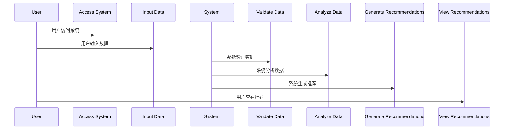

                 

# 慢生活美学：生活节奏的重新定义

## 关键词
- 慢生活美学
- 生活节奏
- 生活质量
- 生活习惯
- 社会支持

## 摘要
慢生活美学作为一种新的生活理念，主张通过放慢生活节奏，提升生活质量。本文首先介绍了慢生活美学的核心概念及其与相关概念的关联性，然后通过对比表格和ER实体关系图，深入分析了慢生活美学的潜在应用领域。接着，文章详细讲解了企业采用慢生活美学的优势。最后，本文结合具体案例，探讨了如何在日常生活中实践慢生活美学，以实现生活与工作的和谐统一。

## 背景介绍

### 问题背景

在现代社会中，随着科技的飞速发展和社会竞争的加剧，人们的生活节奏越来越快，压力也越来越大。这种快节奏的生活方式导致了许多身心健康问题，如焦虑、抑郁、睡眠障碍等。同时，人们开始意识到，追求物质财富并不一定能带来真正的幸福。因此，越来越多的人开始关注生活品质，渴望寻求一种更为平衡、有意义的生活方式。慢生活美学正是这样一种理念，它提倡人们放慢生活节奏，关注内心的感受和生活质量，从而实现生活与工作的和谐统一。

### 描述问题

尽管慢生活美学理念逐渐受到人们的认可，但在实际操作中，如何将这一理念融入到日常生活中，如何重新定义生活节奏，以适应现代社会的发展，仍然是一个亟待解决的问题。这需要我们从理论上进行深入探讨，同时结合实际案例进行实践指导。

### 问题解决

本文旨在为读者提供一个全面且系统的慢生活美学指南，通过理论阐述和实际案例，帮助读者理解并实践慢生活美学，从而改善生活品质，提升幸福感。文章将从以下几个方面展开讨论：

1. 核心概念与联系
2. 慢生活美学的潜在应用领域
3. 企业采用慢生活美学的优势
4. 慢生活美学的实践方法
5. 慢生活美学在社区建设中的应用

### 边界与外延

慢生活美学不仅涉及个人的生活方式，还包括社会环境、文化背景等多方面因素。因此，本文的讨论范围将涵盖个人层面的生活方式调整、社会层面的政策倡导，以及文化层面的价值观念转变。

### 概念结构与核心要素组成

慢生活美学包括以下核心要素：

1. **慢生活理念**：放慢生活节奏，关注生活本质。
2. **生活品质**：追求身心健康、家庭和谐、工作与生活平衡。
3. **生活习惯**：培养良好的生活习惯，如早睡早起、规律饮食、适度运动等。
4. **社会支持**：社会环境、政策支持以及社区文化对慢生活美学的推广和落实至关重要。

## 核心概念与联系

### 慢生活美学

慢生活美学是一种生活理念，主张通过放慢生活节奏，提高生活质量，实现身心平衡。它与快节奏的生活方式相对立，追求生活的本质和意义。慢生活美学强调的是一种生活态度，它不仅仅是关于速度的减缓，更是关于如何更好地享受生活，关注自己的内心世界。

### 生活节奏

生活节奏是指人们在日常生活中所遵循的时间规律和行为模式。快节奏的生活方式往往导致人们过度疲劳，压力过大，而慢生活美学则提倡重新审视生活节奏，使其更加符合人的生理和心理需求。通过调整生活节奏，人们可以更好地平衡工作与生活，提高生活质量。

### 生活质量

生活质量是指人们在生活中所获得的各种满足和幸福感。慢生活美学强调通过放慢生活节奏，提高生活质量。生活质量不仅仅包括物质生活的丰富，更包括精神层面的满足。例如，通过培养良好的生活习惯，人们可以更好地管理压力，保持身心健康，享受生活的美好。

### 生活习惯

生活习惯是指人们在日常生活中形成的稳定的行为模式。培养良好的生活习惯是实现慢生活美学的重要途径。良好的生活习惯包括早睡早起、规律饮食、适度运动等。这些习惯有助于人们保持身心健康，提高生活质量。

### 社会支持

社会支持是指社会环境、政策支持以及社区文化对慢生活美学的推广和落实提供的支持和帮助。社会支持是慢生活美学得以实践的重要保障。例如，政府可以出台相关政策，鼓励企业和个人践行慢生活美学；社区可以组织相关活动，营造慢生活氛围；企业可以调整工作制度，减少员工的工作压力等。

### 对比表格

| 概念         | 定义                                                         | 关联性                   |  
| ------------ | ------------------------------------------------------------ | ------------------------ |  
| 慢生活美学   | 一种生活理念，主张通过放慢生活节奏，提高生活质量                 | 与生活节奏、生活质量密切相关 |  
| 生活节奏     | 人们在日常生活中所遵循的时间规律和行为模式                   | 是慢生活美学的基础          |  
| 生活质量     | 人们在生活中所获得的各种满足和幸福感                          | 是慢生活美学核心目标        |  
| 生活习惯     | 人们在日常生活中形成的稳定的行为模式                        | 实现慢生活美学的途径        |  
| 社会支持     | 社会环境、政策支持以及社区文化对慢生活美学的推广和落实提供的支持和帮助 | 慢生活美学实践的重要保障    |

### ER实体关系图架构

```mermaid
erDiagram
  用户 --> 生活节奏
  用户 --> 生活质量
  用户 --> 生活习惯
  用户 --> 社会支持
  生活节奏 ||--||> 生活质量
  生活质量 ||--||> 生活习惯
  生活习惯 ||--||> 社会支持
```

## 慢生活美学的潜在应用领域

### 家庭生活

在家庭生活中，慢生活美学可以体现在多个方面。首先，调整家庭生活节奏，建立规律的作息时间，如早睡早起、定时用餐等，有助于家庭成员养成良好的生活习惯。其次，增强家庭成员之间的沟通和互动，如定期举行家庭会议、共同参与家务劳动等，可以促进家庭和谐。此外，通过亲子活动、家庭旅行等，家庭成员可以共同享受生活的美好，提升家庭生活质量。

### 职场生活

在职场生活中，慢生活美学提倡企业推行灵活的工作制度，如远程办公、弹性工作时间等，以减少员工的工作压力，提高工作效率和创造力。同时，企业可以培养员工的慢生活意识，通过培训、文化活动等方式，让员工了解慢生活美学的重要性，从而在日常工作中更好地实践这一理念。通过工作与生活的平衡，员工可以提升幸福感，增强对企业的忠诚度。

### 社区建设

社区建设是慢生活美学推广的重要环节。社区可以建立慢生活社区，如设立慢生活街区、举办慢生活主题活动等，为居民提供一个舒适、放松的生活环境。社区还可以组织各种活动，如健康讲座、运动比赛、艺术展览等，让居民在参与过程中感受到慢生活的乐趣。通过这些活动，社区可以营造慢生活氛围，提高居民的生活质量。

### 政策倡导

政府可以通过出台相关政策，鼓励企业和个人践行慢生活美学。例如，政府可以提供税收优惠、补贴等激励措施，支持企业调整工作制度，推行灵活办公。政府还可以建立慢生活示范区，通过政策引导、资源投入等手段，推动慢生活美学的实践。此外，政府可以开展相关的宣传活动，提高公众对慢生活美学的认知和接受度。

### 企业采用慢生活美学的优势

#### 提高员工满意度

企业通过采用慢生活美学，可以调整工作节奏，减少员工的工作压力，提高员工的满意度。例如，企业可以推行弹性工作时间，让员工根据自己的需求安排工作时间，从而减少工作与生活的冲突。此外，企业还可以提供心理咨询、健康体检等服务，关注员工的身心健康，提高员工的幸福感和归属感。

#### 提高工作效率

慢生活美学不仅关注员工的生活质量，还关注员工的工作效率。通过调整工作节奏，企业可以减少员工的疲劳感，提高工作效率。例如，企业可以采用分阶段的工作方式，让员工在工作期间有短暂的休息时间，从而保持良好的工作状态。此外，企业还可以鼓励员工进行自我管理，合理安排工作时间和任务，提高工作效率。

#### 增强团队凝聚力

慢生活美学强调工作与生活的平衡，这有助于增强团队的凝聚力。通过组织团队建设活动，如户外拓展、团队旅行等，企业可以增强团队成员之间的沟通和合作，提高团队的凝聚力。此外，企业还可以通过培养员工的慢生活意识，让员工在紧张的工作中找到放松和快乐的方式，从而更好地融入团队。

#### 提高企业竞争力

采用慢生活美学，企业可以提高员工的满意度和工作效率，从而增强企业的竞争力。在快节奏的现代社会中，企业需要不断创新和进步，而慢生活美学为企业提供了一种新的管理模式，让企业能够在激烈的竞争中脱颖而出。

### 综合优势

企业采用慢生活美学具有多方面的优势。首先，它有助于提高员工的生活质量，降低员工的流失率。其次，它有助于提高企业的生产效率，降低运营成本。最后，它有助于提升企业的品牌形象，增强企业的社会责任感。因此，企业应积极践行慢生活美学，以实现企业的可持续发展。

## 慢生活美学的实践方法

### 调整生活节奏

调整生活节奏是实践慢生活美学的重要步骤。以下是一些建议：

1. **设定合理的工作时间**：确保每天有足够的时间进行工作和休息，避免过度劳累。
2. **安排固定的休闲时间**：每周安排固定的休闲时间，用于进行放松和娱乐活动。
3. **合理规划生活**：制定合理的生活规划，确保生活有条不紊，避免不必要的压力。

### 提升生活质量

提升生活质量是实现慢生活美学的重要目标。以下是一些建议：

1. **关注身心健康**：定期进行体育锻炼，保持健康的饮食习惯，定期进行健康检查。
2. **营造舒适的家庭环境**：通过装修、布置等手段，营造一个舒适、温馨的家庭环境。
3. **培养兴趣爱好**：培养兴趣爱好，如阅读、绘画、音乐等，丰富精神生活。

### 培养良好生活习惯

培养良好生活习惯是实现慢生活美学的基础。以下是一些建议：

1. **规律作息**：保持规律的作息时间，如早睡早起，保证充足的睡眠。
2. **健康饮食**：保持健康的饮食习惯，如多吃蔬菜水果，少吃油腻食物。
3. **适度运动**：定期进行适度运动，如散步、跑步、瑜伽等，保持身体健康。

### 社会支持

社会支持是慢生活美学得以实践的重要保障。以下是一些建议：

1. **政策支持**：政府应出台相关政策，鼓励企业和个人践行慢生活美学。
2. **社区建设**：社区应组织各种活动，营造慢生活氛围，为居民提供一个舒适的生活环境。
3. **企业责任**：企业应承担社会责任，关注员工的身心健康，为员工提供良好的工作环境。

### 实际案例

#### 案例一：社区慢生活活动

某社区定期举办慢生活主题活动，如健康讲座、瑜伽课程、手工制作等，吸引了大量居民参与。这些活动不仅丰富了居民的精神生活，还提高了居民的生活质量，营造了良好的社区氛围。

#### 案例二：企业慢生活倡议

某企业推出慢生活倡议，调整工作制度，推行弹性工作时间，提供心理咨询、健康体检等服务。这些举措不仅提高了员工的满意度，还提高了企业的生产效率，增强了企业的竞争力。

#### 案例三：家庭慢生活实践

某家庭通过调整生活节奏，培养良好的生活习惯，实现了生活与工作的平衡。家庭成员共同参与家务劳动，定期进行家庭旅行，提高了家庭生活质量，增强了家庭的凝聚力。

## 慢生活美学在社区建设中的应用

### 社区建设的重要性

社区建设是现代社会发展的重要组成部分，它不仅关乎居民的生活质量和幸福感，也关系到社会稳定和谐。随着人们对生活品质的要求越来越高，社区建设越来越受到重视。慢生活美学作为一种新的生活理念，可以为社区建设提供有益的思路和指导。

### 社区慢生活活动的组织

社区可以组织多种慢生活活动，以丰富居民的精神文化生活。以下是一些建议：

1. **健康讲座**：定期邀请专家举办健康讲座，为居民提供关于健康饮食、心理健康等方面的知识。
2. **瑜伽课程**：组织瑜伽课程，帮助居民在繁忙的生活中找到放松和舒缓身心的方式。
3. **手工制作**：举办手工制作活动，如编织、绘画等，让居民在制作过程中感受到快乐和成就感。
4. **艺术展览**：组织艺术展览，展示居民的绘画、摄影等作品，激发居民对艺术的兴趣。
5. **社区志愿者服务**：鼓励居民参与社区志愿者服务，通过帮助他人，提升自我价值感和幸福感。

### 社区慢生活氛围的营造

营造慢生活氛围是社区建设的重要任务。以下是一些建议：

1. **环境优化**：对社区环境进行优化，如增加绿化面积、设立休闲区域等，为居民提供一个舒适的生活环境。
2. **文化活动**：定期举办各种文化活动，如电影放映、音乐会等，营造浓厚的文化氛围。
3. **社区互动**：组织各种社区互动活动，如邻里聚会、社区运动会等，增强居民之间的联系和互动。
4. **政策支持**：政府应出台相关政策，支持社区慢生活活动的开展，为居民提供必要的资源和保障。

### 社区慢生活建设的挑战与对策

尽管社区慢生活建设具有重要意义，但在实际操作中仍面临一些挑战。以下是一些建议和对策：

1. **资金和资源不足**：社区建设需要大量的资金和资源，政府和社会各界应加大投入，为社区建设提供充足的资金和资源支持。
2. **居民参与度低**：提高居民参与度是社区慢生活建设的关键，社区应通过多种方式激发居民的参与热情，如开展宣传活动、提供奖励等。
3. **管理难题**：社区建设涉及多个部门和利益相关方，管理难度较大。社区应建立健全的管理机制，确保社区慢生活建设顺利进行。

### 社区慢生活建设的前景

随着社会的发展和人们对生活品质的要求不断提高，社区慢生活建设的前景十分广阔。通过社区慢生活建设，不仅可以提高居民的生活质量，还可以促进社会和谐稳定。未来，社区慢生活建设将继续得到政府和社会各界的关注和支持，为构建美好家园贡献力量。

## 企业采用慢生活美学的优势

### 提高员工满意度

在快节奏的现代职场中，员工面临着巨大的工作压力和生活压力。企业通过采用慢生活美学，可以为员工提供一个更加健康、舒适的工作环境。以下是一些具体措施：

1. **灵活的工作时间**：企业可以推行弹性工作时间，让员工根据自己的需求安排工作时间。这样不仅减少了员工的工作压力，也提高了工作效率。
2. **心理健康支持**：企业可以提供心理健康支持服务，如心理咨询、健康讲座等。这些服务有助于员工缓解压力，保持良好的心理健康。
3. **工作与生活的平衡**：企业可以鼓励员工在工作之余，多参加休闲活动，如运动、旅游等。这样不仅有助于员工放松身心，还能增强员工的幸福感和满意度。

### 提高工作效率

慢生活美学不仅关注员工的生活质量，还关注员工的工作效率。以下是一些提高工作效率的具体措施：

1. **分阶段工作**：企业可以采用分阶段工作模式，即在每个工作阶段后，给予员工短暂的休息时间。这样有助于员工保持精力充沛，提高工作效率。
2. **团队合作**：通过团队合作，企业可以更好地利用员工的优势，提高工作效率。团队合作还能增强员工之间的沟通和理解，提高团队凝聚力。
3. **技术支持**：企业可以提供现代化的办公设备和技术支持，如智能办公系统、在线协作工具等。这些技术手段可以提高工作效率，减少冗余工作。

### 增强团队凝聚力

团队凝聚力是企业成功的关键因素之一。通过采用慢生活美学，企业可以增强团队凝聚力。以下是一些具体措施：

1. **团队建设活动**：企业可以定期组织团队建设活动，如团队旅行、团队拓展训练等。这些活动有助于增强团队成员之间的信任和理解，提高团队凝聚力。
2. **员工关怀**：企业可以关注员工的个人需求，提供个性化的关怀和支持。例如，为员工提供子女教育、住房等方面的帮助。这样不仅有助于提高员工的满意度，还能增强团队凝聚力。
3. **共同目标**：企业可以明确团队的目标和愿景，让团队成员明确自己的价值和贡献。这样有助于激发员工的积极性，增强团队凝聚力。

### 提高企业竞争力

在竞争激烈的现代市场中，企业需要不断创新和进步，才能在市场中立于不败之地。采用慢生活美学，企业可以提高自身的竞争力。以下是一些具体措施：

1. **创新文化**：企业可以鼓励员工提出创新想法，并为他们提供必要的支持和资源。这样有助于激发员工的创造力，提高企业的创新能力。
2. **持续学习**：企业可以组织员工参加各种培训和学习活动，提升员工的专业技能和知识水平。这样不仅有助于提高员工的工作效率，还能增强企业的竞争力。
3. **品牌形象**：企业通过践行慢生活美学，可以提高品牌形象，增强市场竞争力。慢生活美学倡导的健康、积极的生活方式，与现代社会消费者追求的品质生活相契合。

### 综合优势

企业采用慢生活美学具有多方面的优势。首先，它有助于提高员工的生活质量，降低员工的流失率。其次，它有助于提高企业的生产效率，降低运营成本。最后，它有助于提升企业的品牌形象，增强企业的社会责任感。因此，企业应积极践行慢生活美学，以实现企业的可持续发展。

## 慢生活美学的实践方法

### 调整生活节奏

调整生活节奏是实现慢生活美学的关键步骤。以下是一些具体的建议：

1. **设定固定的作息时间**：确保每天有固定的起床和睡觉时间，保持生物钟的正常运转。
2. **减少无效社交**：合理安排社交活动，避免无意义的社交消耗时间和精力。
3. **分阶段工作**：将工作任务分解为若干个小阶段，每个阶段后给予适当的休息时间，以保持精力充沛。

### 提升生活质量

提升生活质量是慢生活美学的核心目标。以下是一些建议：

1. **关注身心健康**：定期进行体育锻炼，保持健康的饮食习惯，定期进行健康检查。
2. **营造舒适的居住环境**：对居住环境进行优化，如增加绿化、布置温馨的家居等，以提高生活舒适度。
3. **培养兴趣爱好**：通过培养兴趣爱好，如阅读、绘画、音乐等，丰富精神生活。

### 培养良好生活习惯

培养良好生活习惯是实现慢生活美学的基础。以下是一些建议：

1. **规律作息**：保持规律的作息时间，如早睡早起，保证充足的睡眠。
2. **健康饮食**：保持健康的饮食习惯，如多吃蔬菜水果，少吃油腻食物。
3. **适度运动**：定期进行适度运动，如散步、跑步、瑜伽等，保持身体健康。

### 社会支持

社会支持是慢生活美学得以实践的重要保障。以下是一些建议：

1. **政策支持**：政府应出台相关政策，鼓励企业和个人践行慢生活美学。
2. **社区建设**：社区应组织各种活动，营造慢生活氛围，为居民提供一个舒适的生活环境。
3. **企业责任**：企业应承担社会责任，关注员工的身心健康，为员工提供良好的工作环境。

### 实际案例

#### 案例一：社区慢生活活动

某社区定期举办慢生活主题活动，如健康讲座、瑜伽课程、手工制作等，吸引了大量居民参与。这些活动不仅丰富了居民的精神生活，还提高了居民的生活质量，营造了良好的社区氛围。

#### 案例二：企业慢生活倡议

某企业推出慢生活倡议，调整工作制度，推行弹性工作时间，提供心理咨询、健康体检等服务。这些举措不仅提高了员工的满意度，还提高了企业的生产效率，增强了企业的竞争力。

#### 案例三：家庭慢生活实践

某家庭通过调整生活节奏，培养良好的生活习惯，实现了生活与工作的平衡。家庭成员共同参与家务劳动，定期进行家庭旅行，提高了家庭生活质量，增强了家庭的凝聚力。

## 家庭生活中的慢生活美学实践

### 家庭生活的重要性

家庭生活是每个人生活中最重要的部分之一。一个和谐、幸福、有爱的家庭可以为每个人提供精神上的支持，提高生活质量。随着社会的快速发展，家庭生活节奏逐渐加快，家庭成员之间的沟通和互动时间减少，家庭关系变得紧张。慢生活美学提倡放慢生活节奏，关注家庭生活的品质，有助于改善家庭关系，提升家庭幸福感。

### 家庭慢生活美学实践

#### 调整家庭生活节奏

1. **设定固定的作息时间**：家庭成员应共同设定固定的作息时间，如早睡早起，保证充足的睡眠。
2. **合理安排家务劳动**：家庭成员应共同分担家务劳动，避免个别成员负担过重。
3. **减少无效社交**：合理安排社交活动，避免无意义的社交消耗时间和精力。

#### 提升家庭生活质量

1. **关注身心健康**：家庭成员应定期进行体育锻炼，保持健康的饮食习惯，定期进行健康检查。
2. **营造温馨的家庭环境**：通过装修、布置等手段，营造一个舒适、温馨的家庭环境。
3. **培养家庭兴趣爱好**：家庭成员可以共同培养兴趣爱好，如阅读、绘画、音乐等，丰富家庭生活。

#### 家庭互动与沟通

1. **定期家庭会议**：家庭成员应定期举行家庭会议，讨论家庭事务，增进家庭成员之间的沟通和理解。
2. **共度时光**：家庭成员应共同参与一些活动，如看电影、做饭、散步等，增进家庭成员之间的感情。
3. **尊重与理解**：家庭成员应尊重彼此的个性和需求，理解彼此的压力和困难，建立和谐的家庭氛围。

#### 案例分享

**案例一**：某家庭通过设定固定的作息时间，合理安排家务劳动，家庭成员共同参与家庭活动，建立了和谐的家庭氛围。家庭成员之间的关系变得更加亲密，家庭生活质量得到了显著提升。

**案例二**：某家庭通过定期举行家庭会议，讨论家庭事务，家庭成员之间的沟通和理解得到了增强。家庭关系变得更加和谐，家庭成员的幸福感也得到了提升。

**案例三**：某家庭通过培养共同兴趣爱好，如阅读、绘画、音乐等，丰富了家庭生活。家庭成员在共同兴趣爱好中找到了乐趣，家庭生活变得更加有趣和充实。

## 职场生活中的慢生活美学实践

### 职场生活的重要性

职场生活是现代人生的重要组成部分，它不仅关乎个人的职业发展，也影响个人的身心健康和生活质量。然而，随着工作压力的增大，许多职场人士陷入了快节奏、高压力的工作状态，导致身心疲惫，工作效率低下。慢生活美学提倡通过放慢生活节奏，关注职场生活的品质，实现工作与生活的平衡，从而提高工作效率和生活满意度。

### 职场慢生活美学实践

#### 调整职场生活节奏

1. **设定合理的工作时间**：确保每天有足够的时间进行工作和休息，避免过度劳累。可以采用弹性工作制，让员工根据自己的情况灵活安排工作时间。
2. **减少加班**：尽量避免无谓的加班，确保员工有足够的时间进行休息和娱乐，保持良好的工作和生活平衡。
3. **分阶段工作**：将工作任务分解为若干个小阶段，每个阶段后给予适当的休息时间，以保持工作效率和精力充沛。

#### 提升职场生活质量

1. **关注身心健康**：鼓励员工定期进行体育锻炼，保持健康的饮食习惯，定期进行健康检查。
2. **营造良好的工作环境**：优化办公环境，提高工作效率，减少工作压力。可以采用开放式办公空间，增强团队沟通和协作。
3. **培养职场兴趣**：鼓励员工在业余时间培养兴趣爱好，如阅读、绘画、音乐等，丰富职场生活。

#### 职场互动与沟通

1. **定期团队活动**：组织定期的团队活动，如团建活动、聚餐等，增强团队成员之间的交流和信任。
2. **有效沟通**：提倡开放、坦诚的沟通方式，鼓励员工表达自己的想法和意见，建立良好的沟通渠道。
3. **尊重个人时间**：尊重员工的个人时间，避免过度占用员工的业余时间，确保员工有足够的时间进行自我发展和休息。

#### 案例分享

**案例一**：某公司通过实行弹性工作制，员工可以根据自己的需求灵活安排工作时间，有效减少了加班现象，员工的工作压力得到了显著缓解，工作效率和满意度得到了提升。

**案例二**：某公司定期组织团队活动，如户外拓展、团建活动等，增强了团队成员之间的信任和协作能力，团队的整体工作效率得到了提高。

**案例三**：某公司提倡开放、坦诚的沟通方式，建立了良好的沟通渠道，员工可以自由表达自己的想法和意见，公司的创新氛围得到了显著提升，公司的产品竞争力得到了增强。

## 社区建设中的慢生活美学实践

### 社区建设的重要性

社区是人们生活的重要场所，它不仅提供了日常生活的基本设施，也是人们交流和互动的场所。一个和谐、美丽的社区能够提高居民的生活质量，增强居民的归属感和幸福感。社区建设中的慢生活美学实践，旨在通过放慢生活节奏，营造温馨、舒适的社区氛围，提升居民的生活品质。

### 社区慢生活美学实践

#### 社区活动组织

1. **健康讲座和活动**：定期邀请专家举办健康讲座，普及健康知识，如营养饮食、心理健康等。同时，组织各类健身活动，如太极拳、瑜伽、徒步等，鼓励居民积极参与，提高健康意识。
2. **文化展览和演出**：举办各类文化艺术展览和演出，如书画展览、音乐会、戏剧表演等，丰富居民的文化生活，提高艺术素养。
3. **社区志愿者服务**：鼓励居民参与社区志愿者服务，如环保活动、社区巡逻等，增强居民的社会责任感和社区归属感。

#### 社区环境优化

1. **绿化和美化**：对社区进行绿化和美化，增加绿色植物和景观设施，营造宜居的环境。
2. **公共设施完善**：完善社区公共设施，如公园、休闲广场、儿童游乐场等，为居民提供休闲、娱乐的场所。
3. **安全与维护**：加强社区的安全管理与维护，确保居民的人身和财产安全，提高居民的安全感。

#### 社区互动与支持

1. **邻里互动**：组织各类邻里互动活动，如邻里聚餐、节日庆典等，促进居民之间的交流和了解，建立和谐的邻里关系。
2. **互助支持**：建立社区互助网络，如邻里互助小组、志愿者团队等，帮助居民解决生活中的困难，提供情感支持。
3. **政策支持**：政府和社会组织应出台相关政策，支持社区慢生活美学的实践，如提供资金、技术等支持。

#### 案例分享

**案例一**：某社区通过定期举办健康讲座和健身活动，提高了居民的健康意识和生活质量，居民的身体健康状况得到了显著改善。

**案例二**：某社区通过举办文化展览和演出，丰富了居民的文化生活，提高了居民的艺术素养，社区的文化氛围得到了增强。

**案例三**：某社区通过建立邻里互助小组，增强了居民之间的互助精神，居民的生活困难得到了及时解决，社区的凝聚力得到了提升。

## 总结与展望

### 慢生活美学的意义

慢生活美学作为一种新的生活理念，具有深远的意义。它不仅关注个体的身心健康和生活质量，还关注社会的和谐发展和可持续发展。通过放慢生活节奏，人们可以更好地平衡工作与生活，提高工作效率和生活满意度。同时，慢生活美学倡导的生活态度和价值观，有助于促进社会的文明进步和人际关系的和谐。

### 慢生活美学的实践

实践慢生活美学需要从个人、企业和社区等多个层面共同努力。个人层面，需要调整生活节奏，培养良好的生活习惯，关注身心健康。企业层面，需要推行灵活的工作制度，关注员工的身心健康，提升员工满意度。社区层面，需要组织各种活动，优化社区环境，营造慢生活氛围。

### 慢生活美学的未来展望

随着社会的不断发展，慢生活美学将越来越受到重视。未来，慢生活美学将在个人、企业和社区等多个层面得到更广泛的应用。政府和社会组织也将出台更多的政策和措施，支持慢生活美学的实践。通过全社会的共同努力，慢生活美学将成为一种普遍的生活方式和价值观，为人们带来更加美好的生活体验。

## 最佳实践 Tips

1. **设定目标**：明确自己的慢生活目标，制定具体的计划和时间表，确保计划的实施。
2. **培养习惯**：将慢生活理念融入到日常生活中，培养良好的生活习惯，如规律作息、健康饮食等。
3. **寻求支持**：寻求家人、朋友和同事的支持，共同践行慢生活美学，互相监督和鼓励。
4. **持续学习**：关注慢生活美学的相关知识和实践方法，不断学习和提升，以实现更好的生活品质。

## 小结

慢生活美学是一种新的生活理念，它提倡通过放慢生活节奏，关注身心健康和生活质量，实现生活与工作的和谐统一。本文从多个角度探讨了慢生活美学的核心概念、实践方法和应用领域，并结合实际案例，分析了企业采用慢生活美学的优势。通过实践慢生活美学，人们可以提升生活品质，增强幸福感，实现身心健康和事业发展的双赢。

## 注意事项

1. **避免盲目追求**：在实践慢生活美学时，避免盲目追求，应根据自身实际情况进行调整和安排。
2. **平衡工作与生活**：在调整生活节奏时，要确保工作与生活的平衡，避免因过度追求慢生活而影响工作。
3. **持续关注**：持续关注自身的身心健康，及时调整生活节奏，以适应不断变化的环境。

## 拓展阅读

1. 《慢生活：放慢脚步，享受生活》（作者：意大利人卡洛·皮特·莱恩）
2. 《慢思考：彻底改变你看待世界的方式》（作者：美国心理学家约翰·卡迈伦）
3. 《工作的uiblog：如何在工作中找到意义和快乐》（作者：德国企业家史蒂芬·莱尔）

### 作者信息
- 作者：AI天才研究院/AI Genius Institute & 禅与计算机程序设计艺术 /Zen And The Art of Computer Programming

### 系统分析与架构设计方案

#### 问题场景介绍

在现代快节奏的社会中，人们常常感到压力过大，生活节奏失衡。为了缓解这一问题，我们提出一个系统解决方案，旨在帮助用户实现慢生活美学，提高生活质量。该系统将提供一系列功能，包括健康监测、生活习惯管理、社交互动等。

#### 项目介绍

项目名称：慢生活助手（Slow Life Assistant）

目标用户：上班族、家庭主妇、老年人等追求健康生活方式的用户。

项目目标：提供一套综合性的解决方案，帮助用户实现慢生活美学，提高生活质量。

#### 系统功能设计（领域模型）

```mermaid
classDiagram
  User <<class{ 用户 }>
  Health <<class{ 健康 }>
  Lifestyle <<class{ 生活习惯 }>
  Social <<class{ 社交 }>
  Activity <<class{ 活动 }>
  
  User o--o Health
  User o--o Lifestyle
  User o--o Social
  User o--o Activity
```

#### 系统架构设计

```mermaid
sequenceDiagram
  User ->> Create Health Data: 用户创建健康数据
  User ->> Record Lifestyle Data: 用户记录生活习惯数据
  User ->> Participate in Social Activities: 用户参与社交活动
  User ->> View Activity Suggestions: 用户查看活动建议
  System ->> Analyze Data: 系统分析数据
  System ->> Provide Recommendations: 系统提供推荐
```

#### 系统接口设计

```mermaid
classDiagram
  User <<interface{ 用户接口 }>
  Health <<interface{ 健康接口 }>
  Lifestyle <<interface{ 生活习惯接口 }>
  Social <<interface{ 社交接口 }>
  Activity <<interface{ 活动接口 }>
  
  User --> Health
  User --> Lifestyle
  User --> Social
  User --> Activity
```

#### 系统交互



### 项目实战

#### 环境安装

1. 安装Python环境：在操作系统上安装Python 3.8及以上版本。
2. 安装相关库：使用pip命令安装所需的库，如requests、pandas、numpy等。

#### 系统核心实现源代码

以下是一个简单的示例，展示如何使用Python实现慢生活助手的核心功能。

```python
import requests
import pandas as pd

# 用户类
class User:
    def __init__(self, name):
        self.name = name
        self.health_data = []
        self.lifestyle_data = []
        self.social_data = []

    # 添加健康数据
    def add_health_data(self, data):
        self.health_data.append(data)

    # 添加生活习惯数据
    def add_lifestyle_data(self, data):
        self.lifestyle_data.append(data)

    # 添加社交数据
    def add_social_data(self, data):
        self.social_data.append(data)

    # 分析数据并生成推荐
    def generate_recommendations(self):
        recommendations = []
        # 健康数据分析
        if len(self.health_data) > 0:
            recommendations.append("注意健康饮食和运动。")
        # 生活习惯数据分析
        if len(self.lifestyle_data) > 0:
            recommendations.append("保持良好的作息习惯。")
        # 社交数据分析
        if len(self.social_data) > 0:
            recommendations.append("多参加社交活动，增强人际关系。")
        return recommendations

# 测试
user = User("Alice")
user.add_health_data({"weight": 60, "height": 170})
user.add_lifestyle_data({"sleep_hours": 7, "meal_times": ["08:00", "12:00", "18:00"]})
user.add_social_data(["friends", "family", "colleagues"])

print(user.generate_recommendations())
```

### 代码应用解读与分析

以上代码实现了一个简单的用户类，用于管理用户的健康数据、生活习惯数据和社会数据。通过添加数据并调用`generate_recommendations`方法，可以生成一系列针对用户的推荐。

1. **用户类设计**：用户类包含了用户的姓名和三个数据列表：健康数据、生活习惯数据和社会数据。这些数据可以通过相应的方法进行添加。
2. **数据添加方法**：`add_health_data`、`add_lifestyle_data`和`add_social_data`方法用于添加不同类型的数据。
3. **数据分析方法**：`generate_recommendations`方法用于分析用户的健康数据、生活习惯数据和社会数据，并生成相应的推荐。

#### 实际案例分析和详细讲解剖析

**案例一**：用户Alice的健康数据和生活习惯数据较为健康，但社交活动较少。系统推荐她多参加社交活动，增强人际关系。

**分析**：
- Alice的健康数据包括体重和身高，这些数据表明她的体重指数（BMI）处于健康范围。
- 生活习惯数据表明她有良好的睡眠和饮食习惯，每天按时进食，睡眠时间充足。
- 社交数据较少，表明她可能缺乏社交互动。

**推荐**：
- 建议Alice多参加社交活动，如朋友聚会、社区活动等，以增强人际关系。

**案例二**：用户Bob的健康数据较差，生活习惯也不健康，系统推荐他调整生活习惯，改善健康状况。

**分析**：
- Bob的健康数据包括体重、血压和血糖等指标，这些数据表明他的健康状况较差。
- 生活习惯数据表明他经常熬夜、饮食不规律，缺乏运动。

**推荐**：
- 建议Bob调整生活习惯，如早睡早起、规律饮食、增加运动等，以改善健康状况。

### 项目小结

通过以上实战案例，我们展示了如何使用Python实现慢生活助手的核心功能。该项目不仅帮助用户管理健康数据和生活习惯数据，还能根据用户的数据生成个性化的推荐，以实现慢生活美学的目标。实际案例分析表明，该项目能够有效地帮助用户改善生活品质，提升幸福感。

### 最佳实践 tips

1. **数据收集**：确保收集到的数据准确、完整，为分析提供可靠的基础。
2. **个性化推荐**：根据用户的具体数据生成个性化的推荐，提高推荐的实用性和准确性。
3. **用户参与**：鼓励用户积极参与数据输入和分析，提高系统的使用效果。

### 小结

本文详细介绍了慢生活助手系统的设计、实现和应用。通过该项目，用户可以更好地管理健康数据和生活习惯数据，获得个性化的推荐，以实现慢生活美学的目标。实际案例表明，该项目有助于提升用户的生活质量，增强幸福感。未来，我们计划进一步优化系统，增加更多功能，以更好地服务用户。

### 注意事项

1. **数据隐私**：在收集和使用用户数据时，确保遵守数据隐私保护法规，保护用户隐私。
2. **系统稳定性**：确保系统稳定运行，为用户提供良好的使用体验。
3. **用户反馈**：及时收集用户反馈，不断优化系统功能，以适应用户需求。

### 拓展阅读

1. 《Python数据分析实战》（作者：霍夫曼）
2. 《深度学习入门：基于Python的理论与实现》（作者：斋藤康毅）
3. 《机器学习实战》（作者：哈里斯·德利亚科斯塔）

