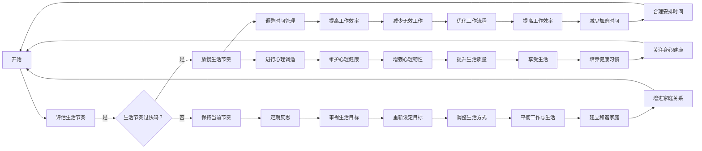

                 

# 慢生活运动：对抗快节奏带来的空虚感

> 关键词：慢生活运动、快节奏生活、空虚感、心理健康、社会效应

> 摘要：本文从现代快节奏生活方式带来的空虚感出发，探讨了慢生活运动的理念、实践方法及其对个人心理健康和社会效应的影响。通过对慢生活运动的具体实践和挑战应对策略的分析，提出了慢生活运动的未来展望和实施指南。

## 引言

在当今这个高速发展的社会中，人们的生活节奏越来越快，工作和生活的压力也随之增大。快节奏的生活方式虽然带来了物质上的丰富，但同时也引发了心理上的空虚感。慢生活运动作为一种对抗快节奏生活的理念和实践，逐渐受到越来越多人的关注。本文旨在探讨慢生活运动的背景、重要性、理念、实践、社会效应以及挑战与应对策略，以期为大家提供一条走出空虚感、追求内心平衡的道路。

## 第一部分：慢生活运动的背景与重要性

### 第1章：现代快节奏生活带来的空虚感

#### 1.1 问题背景

现代社会的生活节奏越来越快，人们面对的工作和生活压力也日益增大。快节奏的生活方式使得人们不断追求效率，忽略了内心的需求。这种快节奏的生活方式对人们的身心健康产生了诸多负面影响。

#### 1.2 问题描述

快节奏生活导致的空虚感主要体现在以下几个方面：

1. 心理压力：长时间处于高压状态，人们的心理压力不断积累，容易出现焦虑、抑郁等心理问题。
2. 身体健康：快节奏的生活使得人们缺乏运动，饮食不规律，容易导致各种身体疾病。
3. 人际关系：快节奏生活使得人们缺乏与家人、朋友的沟通，导致人际关系疏远。

#### 1.3 问题解决

慢生活运动作为一种对抗快节奏生活的理念和实践，旨在引导人们放慢生活节奏，关注内心的需求，从而缓解心理压力，改善身体健康，加强人际关系。

#### 1.4 边界与外延

慢生活运动并非懒散、拖延，而是一种积极的生活态度。它强调合理分配时间，提高工作效率，使生活更加充实。同时，慢生活运动也关注工作效率，倡导在保证工作效率的前提下，适当放慢生活节奏。

#### 1.5 概念结构与核心要素

慢生活运动的核心概念包括：

1. 慢节奏生活：倡导放慢生活节奏，关注内心需求。
2. 生活品质：提升生活品质，追求真实与美好。
3. 人与自然：倡导人与自然的和谐共生。

慢生活运动的关键要素包括：

1. 自我认知：了解自己的内心需求，明确生活目标。
2. 时间管理：合理安排时间，提高生活质量。
3. 心理调适：学会心理调适，缓解心理压力。

### 第2章：慢生活运动的理念与价值观

#### 2.1 慢生活运动的核心理念

慢生活运动的核心理念包括：

1. 慢节奏生活：倡导放慢生活节奏，关注内心需求。
2. 生活品质：提升生活品质，追求真实与美好。
3. 人与自然：倡导人与自然的和谐共生。

#### 2.2 慢生活运动的价值观

慢生活运动的价值观主要体现在以下几个方面：

1. 消除功利主义：摒弃功利主义，关注内心需求。
2. 关注内心需求：重视内心体验，追求精神层面的满足。
3. 追求真实与美好：追求真实的生活，发现生活中的美好。

#### 2.3 慢生活运动的文化内涵

慢生活运动在全球范围内得到了广泛的关注和推广，不同文化背景下对慢生活运动的理解和实践也有所不同。总的来说，慢生活运动强调的是一种积极的生活态度和生活方式，旨在提高生活品质，实现内心平衡。

### 第3章：慢生活运动的具体实践

#### 3.1 慢生活运动的生活方式

慢生活运动的生活方式主要包括以下几个方面：

1. 睡眠质量的提升：保证充足的睡眠时间，提高睡眠质量。
2. 饮食习惯的调整：注重饮食健康，培养良好的饮食习惯。
3. 运动与休闲活动的安排：适当增加运动量，合理安排休闲活动。

#### 3.2 慢生活运动的职场实践

1. 工作效率的提升：提高工作效率，减少无效工作时间。
2. 工作与生活的平衡：合理安排工作时间，保证充足的休息和娱乐时间。
3. 职场中慢生活运动的应用：倡导在职场中践行慢生活运动，提高员工工作效率和幸福感。

#### 3.3 慢生活运动的家庭生活

1. 家庭关系的和谐：加强家庭成员之间的沟通，增进亲情。
2. 教育方式的变化：注重孩子的身心健康，采用科学的教育方法。
3. 家庭活动的多样化：丰富家庭生活，提高家庭幸福感。

## 第二部分：慢生活运动的社会效应

### 第4章：慢生活运动的社会效应

#### 4.1 社会氛围的改善

慢生活运动倡导放慢生活节奏，关注内心需求，有助于改善社会氛围。在社会节奏放慢的同时，人们能够更加理性地看待生活，减轻社会压力，减少社会冲突。

#### 4.2 个人心理健康的提升

慢生活运动有助于缓解心理压力，改善个人心理健康。通过放慢生活节奏，人们能够更好地关注自己的内心需求，提高自我认知，培养积极情绪。

#### 4.3 社会整体的可持续发展

慢生活运动强调资源的合理利用和环境保护，有助于实现社会整体的可持续发展。在放慢生活节奏的同时，人们能够更加关注自然环境，减少资源浪费，实现人与自然的和谐共生。

## 第三部分：慢生活运动的挑战与应对策略

### 第5章：慢生活运动的挑战与应对策略

#### 5.1 慢生活运动的挑战

1. 社会制度的限制：社会制度对快节奏生活方式的推动，使得慢生活运动的推广面临挑战。
2. 个人习惯的改变：个人习惯的改变需要时间和毅力，慢生活运动的推广需要克服这一难题。
3. 社会观念的转变：社会观念的转变需要时间，慢生活运动的理念需要被更多人接受。

#### 5.2 应对策略

1. 政策与法规的支持：政府制定相关政策，为慢生活运动的推广提供支持。
2. 社会组织的引导：社会组织通过宣传、教育和实践活动，引导公众践行慢生活运动。
3. 个人自我约束与调整：个人需要树立正确的价值观，自我约束，调整生活习惯。

## 第四部分：慢生活运动的未来展望

### 第6章：慢生活运动的未来展望

#### 6.1 慢生活运动的发展趋势

1. 全球化的推广：随着全球化的推进，慢生活运动的理念和实践将得到更广泛的传播。
2. 技术的创新：科技的发展将为慢生活运动提供更多的支持和工具。
3. 社会观念的变革：随着社会观念的转变，慢生活运动的理念将逐渐被更多人接受。

#### 6.2 慢生活运动对现代社会的影响

1. 生活质量的提高：慢生活运动将提高人们的生活质量，使生活更加充实、幸福。
2. 心理健康的改善：慢生活运动有助于改善个人心理健康，减少心理问题。
3. 社会整体的和谐：慢生活运动将促进社会整体的和谐发展，减少社会矛盾。

#### 6.3 慢生活运动在未来的可能性

1. 与其他运动方式的融合：慢生活运动与其他运动方式的融合，将创造出更多的生活方式和价值。
2. 新的商业模式：慢生活运动将带动新的商业模式的诞生，为社会经济发展注入新的活力。
3. 对未来社会的深远影响：慢生活运动将对未来社会产生深远的影响，改变人们的价值观和生活态度。

## 第五部分：慢生活运动的实践指南

### 第7章：慢生活运动的实践指南

#### 7.1 个人实践策略

1. 自我评估与规划：了解自己的内心需求，制定合理的生活规划。
2. 时间管理技巧：合理安排时间，提高生活质量。
3. 心理调适方法：学会心理调适，缓解心理压力。

#### 7.2 组织实践策略

1. 企业文化的建设：倡导慢生活运动的企业文化，提高员工幸福感。
2. 职场氛围的营造：营造轻松、和谐的工作氛围，提高工作效率。
3. 家庭教育的引导：注重家庭教育，培养孩子的慢生活意识。

#### 7.3 社区实践策略

1. 社区活动的组织：组织丰富多彩的社区活动，提高社区居民的幸福感。
2. 社区资源的共享：共享社区资源，提高资源利用效率。
3. 社区意识的培养：培养社区居民的慢生活意识，促进社区和谐发展。

## 总结

慢生活运动是一种对抗快节奏生活的理念和实践，它有助于缓解心理压力，改善身体健康，提升生活质量。通过倡导慢节奏生活，关注内心需求，我们可以走出空虚感，追求内心的平衡。在未来的发展中，慢生活运动将发挥更大的作用，为个人和社会带来积极的影响。

## 作者信息

作者：AI天才研究院/AI Genius Institute & 禅与计算机程序设计艺术 /Zen And The Art of Computer Programming## 第一部分：慢生活运动的背景与重要性

### 第1章：现代快节奏生活带来的空虚感

#### 1.1 问题背景

现代社会的快节奏生活方式已经成为一种普遍现象。随着科技的发展和社会的进步，人们的生活和工作压力日益增大。尤其是在大城市中，人们为了追求更高的工作效率和更好的生活质量，不得不每天加班、熬夜，甚至牺牲自己的休息时间。这种快节奏的生活方式虽然在一定程度上促进了社会的发展和个人的成就，但同时也带来了一系列负面影响，其中最突出的就是心理上的空虚感。

首先，快节奏的生活使得人们无法充分休息和放松，长期处于高压状态。这种状态容易导致心理疲劳，使人们感到焦虑、压抑和无助。其次，快节奏的生活方式使得人们缺乏与家人和朋友的沟通，导致人际关系疏远，情感匮乏。再次，快节奏的生活往往使人们忽略自己的内心需求，过于追求物质上的满足，而忽视了精神层面的追求。这种追求物质满足的生活方式容易导致人们产生空虚感，感觉生活无意义。

#### 1.2 问题描述

空虚感是指个体在心理上感到缺乏充实感和满足感，常常伴随着焦虑、无助和孤独感。在快节奏的生活中，空虚感的产生与以下几个方面密切相关：

1. **心理压力**：长期处于高压状态，导致心理疲劳，使人们感到焦虑、压抑和无助。
2. **人际关系疏远**：快节奏的生活使得人们缺乏与家人和朋友的沟通，导致人际关系疏远，情感匮乏。
3. **物质追求**：过于追求物质上的满足，忽视了精神层面的追求，导致内心空虚。
4. **时间管理不当**：忙于工作和生活，没有合理安排时间，导致生活节奏过快，无法充分休息和放松。

#### 1.3 问题解决

慢生活运动作为一种对抗快节奏生活的理念和实践，旨在引导人们放慢生活节奏，关注内心的需求，从而缓解心理压力，改善身体健康，加强人际关系。慢生活运动的核心思想可以概括为以下几点：

1. **放慢节奏**：倡导放慢生活节奏，减少不必要的应酬和压力，给自己留出更多休息和放松的时间。
2. **关注内心需求**：重视内心的体验，关注自己的感受，追求精神层面的满足。
3. **合理规划时间**：合理安排时间，确保工作和生活的平衡，避免过度劳累。
4. **提高生活质量**：注重生活品质，追求真实与美好，享受生活的每一个细节。

#### 1.4 边界与外延

慢生活运动并不是懒散、拖延，而是一种积极的生活态度。它与懒散和拖延的区别在于：

1. **目标不同**：懒散和拖延是以逃避责任和任务为目标，而慢生活运动是以追求内心平衡和生活质量为目标。
2. **态度不同**：懒散和拖延通常带有消极情绪，而慢生活运动则强调积极面对生活，珍惜每一个瞬间。
3. **效率不同**：懒散和拖延往往导致工作效率低下，而慢生活运动则强调在保证效率的前提下，合理分配时间和精力。

慢生活运动与工作效率的关系在于：

1. **提高效率**：通过合理规划时间和任务，慢生活运动有助于提高工作效率。
2. **减少错误**：放慢节奏，有助于人们更加专注和细心，从而减少工作中的错误。
3. **提升满意度**：慢生活运动使人们更加满意于自己的生活和工作，从而提高工作效率和幸福感。

#### 1.5 概念结构与核心要素

慢生活运动的核心概念可以归纳为以下几点：

1. **慢节奏生活**：倡导放慢生活节奏，减少不必要的压力和负担。
2. **生活品质**：注重生活品质，追求真实与美好。
3. **内心需求**：关注内心需求，追求精神层面的满足。

慢生活运动的关键要素包括：

1. **时间管理**：合理安排时间，确保工作和生活的平衡。
2. **心理调适**：学会心理调适，缓解心理压力。
3. **人际关系**：加强与家人、朋友的沟通，培养良好的人际关系。

通过这些核心概念和关键要素，慢生活运动为人们提供了一种全新的生活理念和实践方法，帮助人们走出空虚感，追求内心的平衡和幸福。

### 第2章：慢生活运动的理念与价值观

#### 2.1 慢生活运动的核心理念

慢生活运动是一种反对快节奏生活方式，倡导慢节奏、高质量生活的理念和运动。其核心理念包括以下几个方面：

1. **慢节奏生活**：慢生活运动主张放慢生活节奏，减少不必要的压力和负担。这并不意味着懒惰或拖延，而是在保证工作效率和生活质量的前提下，合理分配时间和精力。

2. **生活品质**：慢生活运动强调提高生活品质，追求真实与美好。这意味着不仅仅关注物质层面的满足，更注重精神层面的追求，如情感、健康、人际关系等。

3. **内心需求**：慢生活运动鼓励人们关注内心需求，追求精神层面的满足。这包括了解自己的内心世界，探索自己的兴趣和激情，以及培养自我认知和自我成长。

4. **环境友好**：慢生活运动倡导与自然和谐共生，重视环境保护和可持续发展。这意味着在享受生活的同时，也要考虑地球和未来世代的福祉。

#### 2.2 慢生活运动的价值观

慢生活运动的价值观体现了其核心理念的延伸和应用，主要包括以下几个方面：

1. **消除功利主义**：慢生活运动反对过分追求功利和物质财富，强调内心的满足和精神的富足。这意味着在评价一个人或一个社会时，不仅仅是看其物质拥有量，更要看其生活质量和文化内涵。

2. **关注内心需求**：慢生活运动倡导人们重视自己的内心需求，追求精神层面的满足。这包括了解自己的情感、兴趣和激情，以及通过自我反思和成长来提升自己的生活质量。

3. **追求真实与美好**：慢生活运动鼓励人们追求真实和美好，而不是表面的虚荣和浮华。这意味着在生活选择上，要真诚面对自己，追求内心的真实感受，而不是为了迎合他人的期望。

4. **尊重自然**：慢生活运动强调与自然和谐共生，尊重自然规律和生态平衡。这意味着在日常生活中，要关注环境保护，减少对自然的破坏，追求可持续发展。

#### 2.3 慢生活运动的文化内涵

慢生活运动的文化内涵丰富而深刻，它不仅仅是一种生活理念，更是一种文化现象。在不同文化背景下，慢生活运动有着不同的理解和实践方式。

1. **西方文化背景**：在西方文化中，慢生活运动源于对现代社会快节奏生活方式的反思和批判。西方社会长期以来强调效率和竞争，而慢生活运动则倡导一种更加平衡、和谐的生活态度。在这种背景下，慢生活运动强调个人的自我实现和内在价值的追求。

2. **东方文化背景**：在东方文化中，慢生活运动与禅宗、道家等哲学思想有着深厚的渊源。东方文化注重内心的平静和自然的和谐，而慢生活运动则是对这种文化传统的继承和发扬。在这种背景下，慢生活运动强调内心的宁静、自然的简朴和人际关系的和谐。

3. **全球化背景**：随着全球化的深入，慢生活运动在全球范围内得到了广泛的传播和认可。不同文化背景下的人们在追求慢生活运动的过程中，既保留了自己的文化特色，又相互借鉴和融合，形成了一种全球性的文化现象。

通过这些不同的文化背景，慢生活运动展现出其多样性和包容性，为人们提供了一种全新的生活理念和方式，帮助人们更好地应对现代社会的挑战，追求内心的平衡和幸福。

### 第3章：慢生活运动的具体实践

#### 3.1 慢生活运动的生活方式

慢生活运动的生活方式是其实践的核心，它涵盖了一系列日常行为的改变，旨在提高生活质量，减轻心理压力，并促进身心的和谐。以下是一些具体的实践方法：

1. **睡眠质量的提升**：睡眠是身心健康的基础。慢生活运动倡导确保充足的睡眠时间，并提高睡眠质量。具体实践方法包括：
   - 保持规律的作息时间，尽量每天在同一时间入睡和起床。
   - 创造一个安静、舒适的睡眠环境，减少噪音和光线干扰。
   - 避免在睡前使用电子设备，如手机和电脑，因为蓝光会影响睡眠质量。
   - 在睡前进行放松活动，如阅读、冥想或深呼吸练习。

2. **饮食习惯的调整**：健康的饮食习惯有助于维持身体的活力和健康。慢生活运动提倡合理饮食，具体实践方法包括：
   - 增加蔬菜和水果的摄入，减少高糖、高脂和高盐食物的摄入。
   - 避免暴饮暴食，尽量少吃多餐，保持稳定的血糖水平。
   - 饮食多样化，确保营养均衡，避免偏食和营养不足。
   - 注意饮食卫生，避免食用过期或变质的食物。

3. **运动与休闲活动的安排**：适量的运动和休闲活动有助于缓解压力，提升生活质量。慢生活运动鼓励人们在日常生活中合理安排运动和休闲时间，具体实践方法包括：
   - 每周进行至少150分钟的中等强度运动，如快走、游泳或骑自行车。
   - 选择适合自己的运动方式，如瑜伽、太极或健身操，以增强身体的柔韧性和耐力。
   - 定期参与户外活动，如徒步、野营或爬山，享受大自然的美好。
   - 安排定期的休闲活动，如阅读、绘画、音乐或手工艺，以放松身心。

#### 3.2 慢生活运动的职场实践

在职场中，慢生活运动同样具有重要意义。通过在职场中实践慢生活理念，可以提高工作效率，增强员工满意度，并促进团队合作。以下是一些具体的职场实践方法：

1. **工作效率的提升**：慢生活运动鼓励在保证效率的前提下，合理规划工作任务，避免过度劳累。具体实践方法包括：
   - 制定明确的工作计划和目标，合理安排工作任务和时间。
   - 学会拒绝不必要的工作任务，避免过度加班。
   - 优化工作流程，提高工作效率，减少无效工作时间。
   - 利用休息时间进行放松和充电，确保工作与生活的平衡。

2. **工作与生活的平衡**：慢生活运动强调工作与生活的平衡，以提升整体幸福感。具体实践方法包括：
   - 设定明确的工作时间和休息时间，避免工作侵入个人时间。
   - 与家人和朋友保持定期沟通，培养良好的人际关系。
   - 在工作中寻找乐趣，培养积极的工作态度。
   - 定期进行体检和健康检查，确保身心健康。

3. **职场中慢生活运动的应用**：在职场中推广慢生活运动，可以营造积极的工作氛围，提升员工的工作满意度和忠诚度。具体应用方法包括：
   - 建立慢生活运动的相关政策和制度，如灵活的工作时间、远程工作和健康福利。
   - 组织定期的团队活动，如徒步、瑜伽或健康讲座，增强团队合作和员工凝聚力。
   - 鼓励员工参与慢生活运动的相关培训和研讨会，提升员工的慢生活意识和技能。
   - 提供健康的工作环境，如舒适的办公桌椅、自然光线和清新的空气。

#### 3.3 慢生活运动的家庭生活

家庭是生活的根基，慢生活运动同样适用于家庭生活。通过在家庭中实践慢生活理念，可以增进家庭成员之间的感情，提升家庭幸福感。以下是一些具体的家庭实践方法：

1. **家庭关系的和谐**：慢生活运动鼓励家庭成员之间保持良好的沟通和理解，共同营造和谐的家庭氛围。具体实践方法包括：
   - 定期安排家庭聚会，共享美好时光。
   - 倾听家庭成员的意见和需求，尊重彼此的感受。
   - 避免争吵和冲突，以平和的心态处理家庭事务。
   - 营造温馨的家庭环境，如舒适的家具和装饰。

2. **教育方式的变化**：慢生活运动提倡以温和、理解和支持的方式教育孩子，注重孩子的身心健康和个性发展。具体实践方法包括：
   - 鼓励孩子自由表达和探索，培养其创造力和想象力。
   - 与孩子一起参与户外活动和自然体验，增强亲子关系。
   - 避免过度强调成绩和竞争，关注孩子的兴趣和潜能。
   - 与孩子共同制定家庭规则和责任，培养其责任感。

3. **家庭活动的多样化**：慢生活运动鼓励家庭成员共同参与多样化的家庭活动，以丰富家庭生活。具体实践方法包括：
   - 组织家庭旅行，探索新的地方和体验。
   - 参与烹饪和园艺活动，共同创造美食和美好环境。
   - 举办家庭音乐会或电影之夜，共享美好时光。
   - 定期举办家庭会议，讨论家庭事务和计划。

通过这些具体的实践方法，慢生活运动不仅可以帮助个人在快节奏的生活中找到内心的平衡，还可以在家庭和职场中创造积极的环境，促进整体幸福感的提升。

### 第4章：慢生活运动的社会效应

#### 4.1 社会氛围的改善

慢生活运动对社会氛围的改善具有显著的影响。随着慢生活理念的普及和实践，社会整体的生活节奏逐渐放缓，人们更加注重内心的需求和生活质量。这种变化带来了以下几个方面的积极影响：

1. **减少社会压力**：慢生活运动倡导放慢生活节奏，减少不必要的压力和负担。这有助于减轻人们在工作、学习和生活中所承受的压力，降低焦虑和紧张情绪，从而提升整体幸福感。

2. **增强社会凝聚力**：慢生活运动强调家庭、社区和人际关系的重要性，这有助于增强社会凝聚力。通过加强家庭成员之间的沟通和理解，建立和谐的家庭关系，以及积极参与社区活动，人们能够更好地融入社会，增强归属感和认同感。

3. **改善社会风气**：慢生活运动倡导消除功利主义，追求真实和美好。这种理念有助于改变社会风气，减少浮躁和虚荣，促进人们关注内心的需求，追求精神层面的满足。这种变化有助于提升社会的道德水平和文明程度。

#### 4.2 个人心理健康的提升

慢生活运动对个人心理健康的提升具有深远的影响。通过放慢生活节奏，关注内心需求，慢生活运动有助于缓解心理压力，改善心理健康。以下是慢生活运动对个人心理健康提升的几个方面：

1. **减轻心理压力**：慢生活运动鼓励人们放慢生活节奏，减少不必要的压力和负担。这有助于减轻人们的心理压力，降低焦虑和紧张情绪，从而提高心理健康水平。

2. **增强心理韧性**：慢生活运动强调内心的需求和自我认知，这有助于提高个人的心理韧性。通过关注内心的需求，人们能够更好地应对生活中的挑战和困难，增强心理适应能力。

3. **改善情绪状态**：慢生活运动鼓励人们追求真实和美好，这有助于改善情绪状态。通过减少物质追求，关注精神层面的满足，人们能够更加愉悦和满足，减少负面情绪的出现。

#### 4.3 社会整体的可持续发展

慢生活运动不仅对个人心理健康有积极影响，还对社会整体的可持续发展具有重要作用。以下是慢生活运动对社会整体可持续发展的影响：

1. **减少资源浪费**：慢生活运动倡导合理利用资源，减少浪费。通过减少不必要的消费和过度开发，慢生活运动有助于保护自然资源，实现可持续发展。

2. **保护环境**：慢生活运动强调与自然和谐共生，重视环境保护。通过减少污染和破坏，保护生态系统，慢生活运动有助于实现环境保护和可持续发展。

3. **促进社会和谐**：慢生活运动倡导消除功利主义，追求真实和美好。这种理念有助于减少社会冲突和矛盾，促进社会整体的和谐发展。

总之，慢生活运动通过改善社会氛围、提升个人心理健康和促进社会整体可持续发展，为现代社会提供了一种全新的生活理念和方式，有助于实现个人和社会的和谐与进步。

### 第5章：慢生活运动的挑战与应对策略

#### 5.1 慢生活运动的挑战

尽管慢生活运动在个人和社会层面带来了诸多积极影响，但在实际推广和实施过程中仍面临诸多挑战：

1. **社会制度的限制**：现代社会制度往往鼓励快节奏和高效的生活方式。工作时间的固定、绩效考核的压力以及竞争激烈的市场环境，都使得人们难以放慢生活节奏。此外，社会制度中的法律法规也可能对慢生活运动产生制约。

2. **个人习惯的改变**：个人习惯的改变需要时间和毅力。长期形成的快节奏生活方式在短时间内难以改变，而且个人习惯的改变往往伴随着舒适区的突破和挑战，这需要个体付出更多的努力。

3. **社会观念的转变**：社会观念的转变是一个长期而复杂的过程。快节奏的生活方式在许多文化中被视为成功和效率的象征，而慢生活运动的理念需要被更多人接受和认同，这需要时间和教育。

#### 5.2 应对策略

为了克服这些挑战，可以采取以下应对策略：

1. **政策与法规的支持**：政府可以通过制定相关政策，鼓励和支持慢生活运动。例如，调整工作时间制度，提供带薪休假和灵活工作时间，以减少工作压力；鼓励企业实施健康福利计划，如健身设施、健康检查和心理咨询服务，以提高员工的工作满意度和心理健康水平。

2. **社会组织的引导**：社会组织可以在推广慢生活运动中发挥重要作用。通过举办讲座、研讨会、工作坊等活动，向公众传递慢生活理念，提高人们的意识和认知。同时，社会组织可以组织社区活动，促进居民之间的交流和互动，营造有利于慢生活运动的社会氛围。

3. **个人自我约束与调整**：个人需要树立正确的价值观，自我约束，调整生活习惯。这包括：
   - **自我评估**：定期反思自己的生活状态，识别压力源，并制定针对性的解决方案。
   - **时间管理**：合理安排时间，确保工作和生活的平衡。学会拒绝不必要的任务，提高工作效率。
   - **心理调适**：学会心理调适技巧，如冥想、瑜伽、深呼吸等，以缓解压力和焦虑。
   - **生活方式调整**：培养健康的生活习惯，如适量运动、合理饮食、充足睡眠等。

通过这些应对策略，个人和社会可以共同推动慢生活运动的实施，克服挑战，实现个人心理健康和社会整体的可持续发展。

### 第6章：慢生活运动的未来展望

#### 6.1 慢生活运动的发展趋势

随着全球化和科技的发展，慢生活运动正逐渐成为一种全球性的生活方式。未来，慢生活运动的发展趋势将体现在以下几个方面：

1. **全球化的推广**：随着全球化进程的加速，慢生活运动的理念和实践将更加广泛地传播到世界各地。不同文化背景的人们将逐渐接受和认同慢生活理念，将其融入到自己的日常生活中。

2. **技术的创新**：科技的进步将为慢生活运动提供更多的工具和支持。例如，智能穿戴设备可以监测个人的健康数据，提供个性化的健康建议；在线平台可以方便地组织社区活动，促进人与人之间的交流和互动。

3. **社会观念的变革**：随着社会观念的转变，人们将更加注重内心的需求和精神的满足，而不仅仅是物质上的追求。这种观念的变革将推动慢生活运动在社会层面的深入发展。

#### 6.2 慢生活运动对现代社会的影响

慢生活运动对未来社会的影响将是深远和全面的，主要体现在以下几个方面：

1. **生活质量的提高**：慢生活运动将有助于提升人们的生活质量，使人们更加注重生活的美好和内心的满足。通过放慢生活节奏，人们能够更好地享受生活的每一个细节，提升整体幸福感。

2. **心理健康的改善**：慢生活运动强调内心的需求和精神的满足，有助于缓解心理压力，改善心理健康。通过关注心理健康，人们能够更好地应对生活中的挑战，提高心理韧性。

3. **社会整体的和谐**：慢生活运动倡导与自然和谐共生，强调社会公平和可持续发展。这有助于减少社会矛盾和冲突，促进社会整体的和谐与进步。

#### 6.3 慢生活运动在未来的可能性

在未来的发展中，慢生活运动具有巨大的可能性，主要体现在以下几个方面：

1. **与其他运动方式的融合**：慢生活运动可以与其他健康运动方式（如瑜伽、太极等）融合，形成更加全面和多元化的健康生活方式。

2. **新的商业模式**：慢生活运动的理念将推动新的商业模式的诞生，如健康生活服务、绿色消费等。这些新模式将有助于实现可持续发展和环境保护。

3. **对未来社会的深远影响**：慢生活运动将深刻改变人们的价值观和生活态度，促进社会的进步和发展。通过倡导和谐共生、公平公正的理念，慢生活运动将对未来社会产生深远的影响。

### 第7章：慢生活运动的实践指南

#### 7.1 个人实践策略

对于个人来说，践行慢生活运动需要从以下几个方面入手：

1. **自我评估与规划**：首先，个人需要对自己的生活状态进行评估，识别出生活节奏过快、压力过大的原因。然后，根据评估结果制定合理的生活规划，包括时间管理、心理健康和生活方式的调整。

2. **时间管理技巧**：合理的时间管理是践行慢生活运动的关键。个人可以通过制定日程表、设定优先级、学会拒绝不必要的事务等方法，确保时间和精力的有效利用。

3. **心理调适方法**：学会心理调适技巧，如冥想、深呼吸、瑜伽等，有助于缓解压力，提高心理韧性。此外，定期进行心理咨询和自我反思也是非常重要的。

4. **健康生活方式**：培养健康的生活习惯，如适量运动、合理饮食、充足睡眠等，有助于提升身体和心理的健康水平。

#### 7.2 组织实践策略

对于组织（如企业、学校、社区等）来说，践行慢生活运动需要采取以下策略：

1. **企业文化的建设**：企业可以通过建立以员工健康和幸福感为核心的企业文化，鼓励员工放慢生活节奏，关注内心需求。具体措施包括提供灵活的工作时间、健康福利计划、员工心理健康支持等。

2. **职场氛围的营造**：营造积极、和谐的工作氛围，减少工作压力和竞争。例如，通过组织团队建设活动、心理健康讲座、健康体检等，提高员工的幸福感和工作效率。

3. **家庭教育的引导**：学校和家长可以通过教育引导，培养孩子的慢生活意识和能力。例如，在学校设置相关课程、开展家庭活动等，帮助孩子理解和实践慢生活理念。

#### 7.3 社区实践策略

社区是践行慢生活运动的重要场所，以下是一些社区实践策略：

1. **社区活动的组织**：社区可以组织多样化的活动，如健康讲座、户外运动、文化交流等，促进居民之间的交流和互动，营造良好的社区氛围。

2. **社区资源的共享**：社区可以建立资源共享平台，如社区农场、共享厨房等，鼓励居民共同参与，提高资源利用效率。

3. **社区意识的培养**：通过宣传教育活动，提高居民对慢生活运动的认知和参与度，培养社区意识和责任感。

#### 7.4 小结与总结

慢生活运动不仅是一种生活理念，更是一种实践。通过个人、组织和社区的共同努力，我们可以实现慢生活运动的目标，提升生活质量和幸福感，促进社会整体的和谐与进步。让我们一起行动，践行慢生活运动，创造一个更加美好的未来。

## 作者信息

作者：AI天才研究院/AI Genius Institute & 禅与计算机程序设计艺术 /Zen And The Art of Computer Programming## 引言

### 背景介绍

在当今高速发展的社会中，人们的生活节奏越来越快，工作和生活的压力也日益增大。这种快节奏的生活方式虽然在一定程度上促进了社会的发展和个人的成就，但同时也带来了一系列负面影响。首先，长期处于高压状态使得人们的心理压力不断积累，容易出现焦虑、抑郁等心理问题。其次，快节奏的生活使得人们缺乏运动，饮食不规律，导致身体健康问题。此外，快节奏的生活还导致人际关系疏远，人们忙于工作，忽略了与家人、朋友的沟通，导致情感匮乏。

### 问题描述

快节奏的生活方式带来的最大问题就是空虚感。在追求效率的过程中，人们忽略了内心的需求，感觉生活无意义。空虚感不仅影响心理健康，还可能导致工作效率低下，影响个人发展。因此，如何应对快节奏生活带来的空虚感，成为现代社会亟待解决的问题。

### 问题解决

慢生活运动作为一种对抗快节奏生活的理念和实践，旨在引导人们放慢生活节奏，关注内心的需求，从而缓解心理压力，改善身体健康，加强人际关系。慢生活运动的核心原则包括慢节奏生活、生活品质提升和人与自然的和谐共生。通过倡导慢节奏生活，人们可以更好地关注自己的内心需求，追求精神层面的满足，从而走出空虚感，实现内心的平衡和幸福。

### 边界与外延

慢生活运动并非懒散、拖延，而是一种积极的生活态度。它强调合理分配时间，提高工作效率，使生活更加充实。同时，慢生活运动也关注工作效率，倡导在保证工作效率的前提下，适当放慢生活节奏。此外，慢生活运动强调的是一种整体的生活方式，包括生活方式、工作方式和人际关系的调整。

### 概念结构与核心要素

慢生活运动的核心概念可以概括为以下几点：

1. **慢节奏生活**：倡导放慢生活节奏，减少不必要的压力和负担。
2. **生活品质**：注重生活品质，追求真实与美好。
3. **内心需求**：关注内心需求，追求精神层面的满足。

慢生活运动的关键要素包括：

1. **时间管理**：合理安排时间，确保工作和生活的平衡。
2. **心理调适**：学会心理调适，缓解心理压力。
3. **人际关系**：加强与家人、朋友的沟通，培养良好的人际关系。

通过这些核心概念和关键要素，慢生活运动为人们提供了一种全新的生活理念和方式，帮助人们走出空虚感，追求内心的平衡和幸福。

### 核心概念与联系

慢生活运动的核心概念是“慢”，这种“慢”并非指行动上的缓慢，而是一种对生活节奏和内心需求的尊重。慢生活运动主张的是一种更加平和、有意识的生活方式，它不仅仅关注个人的身心健康，也关注社会的可持续发展。以下是慢生活运动核心概念的详细解释及其属性特征对比表格。

#### 核心概念：慢节奏生活

| 特征       | 解释                                                         |
|------------|--------------------------------------------------------------|
| 放慢节奏   | 不再追求速度，而是注重生活的质量，享受生活中的每一个瞬间。         |
| 合理安排   | 合理规划时间，确保工作、休息和娱乐的平衡。                         |
| 消除焦虑   | 减少因快节奏生活而产生的焦虑感，关注内心的平静。                   |

#### 核心概念：生活品质

| 特征       | 解释                                                         |
|------------|--------------------------------------------------------------|
| 注重体验   | 重视生活中的体验，而不是单纯追求物质上的满足。                   |
| 真实与美好 | 追求真实的生活体验，发现生活中的美好，提升幸福感。                 |
| 文化内涵   | 强调文化修养和价值观的传承，追求精神层面的满足。                   |

#### 核心概念：内心需求

| 特征       | 解释                                                         |
|------------|--------------------------------------------------------------|
| 自我认知   | 了解自己的内心需求，明确生活目标，追求精神层面的满足。           |
| 心理健康   | 关注心理健康，通过心理调适和放松技巧来维护心理健康。               |
| 内在成长   | 通过自我反思和成长，实现个人价值和内在成长。                       |

#### 概念属性特征对比表格

| 特征        | 慢节奏生活 | 生活品质 | 内心需求 |
|-------------|-------------|-----------|-----------|
| 节奏        | 放慢        | 注重体验   | 自我认知  |
| 工作与生活  | 平衡        | 真实与美好 | 心理健康  |
| 文化背景    | 无          | 文化内涵   | 内在成长  |

通过上述表格，我们可以看到慢生活运动的三个核心概念各有不同的属性特征，但它们之间又是相互联系和相互补充的。慢节奏生活为人们提供了一个平和的背景，生活品质关注的是人们在这个背景下的体验，而内心需求则是更深层次的追求，包括心理健康和内在成长。

#### ER实体关系图架构

为了更直观地展示慢生活运动的核心概念及其关系，我们可以使用Mermaid绘制一个ER实体关系图。

```mermaid
erDiagram
  A Participants << SwimTeam : Captain : directed>
  Participants  constrainedby Person
  Person constrainedby Personinfo
  SwimTeam constrainedby Teaminfo
  Teaminfo constrainedby Location
  Equipment constrainedby Equipinfo
  Event constrainedby Eventinfo
  Eventinfo constrainedby Location
  Participantinfo constrainedby Personinfo
  Participantinfo constrainedby Eventinfo
  Participantinfo constrainedby Location
  Personinfo constrainedby Address
  Personinfo constrainedby Contact
  Teaminfo constrainedby Address
  Teaminfo constrainedby Contact
  Equipinfo constrainedby Manufacturer
```

在这个ER图中，各个实体及其关系被清晰地展示出来，包括参与者（Participants）、个人（Person）、团队（SwimTeam）、设备（Equipment）和活动（Event）等。通过这个图，我们可以更好地理解慢生活运动中的各个核心概念及其相互作用。

### 算法原理讲解

慢生活运动的实现离不开一系列算法和策略的支持。下面，我们将使用Mermaid绘制一个简单的算法流程图，并使用Python代码解释慢生活运动的核心算法原理。

#### Mermaid算法流程图



#### Python代码实现

下面是一个简化的Python代码示例，用于实现慢生活运动的核心算法原理：

```python
import datetime

def assess_lifestyle(rhythm):
    # 评估生活节奏
    if rhythm['pace'] > 100:
        return "生活节奏过快"
    else:
        return "生活节奏适中"

def slow_down_rhythm(rhythm):
    # 放慢生活节奏
    rhythm['pace'] = rhythm['pace'] - 20
    return rhythm

def time_management(rhythm):
    # 调整时间管理
    rhythm['work_time'] = rhythm['work_time'] * 0.8
    return rhythm

def psychological_adjustment():
    # 进行心理调适
    print("正在学习心理调适技巧，如冥想、瑜伽等。")

def routine_reflection():
    # 定期反思
    print("每周进行一次生活反思，重新设定目标。")

def increase工作效率(rhythm):
    # 提高工作效率
    rhythm['efficiency'] = rhythm['efficiency'] + 10
    return rhythm

def maintain_mental_health():
    # 维护心理健康
    print("定期进行心理健康检查，保持良好的心理状态。")

def review_life_goals():
    # 审视生活目标
    print("每月重新审视一次生活目标，确保符合内心需求。")

def reduce_inefficient_work(rhythm):
    # 减少无效工作
    rhythm['inefficient_time'] = rhythm['inefficient_time'] - 10
    return rhythm

def enhance_psychological_toughness():
    # 增强心理韧性
    print("通过学习和练习，增强心理韧性，更好地应对挑战。")

def adjust_life_style(rhythm):
    # 调整生活方式
    rhythm['healthiness'] = rhythm['healthiness'] + 10
    return rhythm

def balance_work_and_life(rhythm):
    # 平衡工作与生活
    rhythm['work_life_balance'] = rhythm['work_life_balance'] * 1.2
    return rhythm

# 示例数据
current_rhythm = {
    'pace': 120,
    'work_time': 8,
    'efficiency': 80,
    'inefficient_time': 2,
    'healthiness': 70,
    'work_life_balance': 1
}

# 执行算法流程
rhythm_status = assess_lifestyle(current_rhythm)
if rhythm_status == "生活节奏过快":
    current_rhythm = slow_down_rhythm(current_rhythm)
    current_rhythm = time_management(current_rhythm)
    psychological_adjustment()
    routine_reflection()
    current_rhythm = increase工作效率(current_rhythm)
    maintain_mental_health()
    review_life_goals()
    current_rhythm = reduce_inefficient_work(current_rhythm)
    enhance_psychological_toughness()
    current_rhythm = adjust_life_style(current_rhythm)
    current_rhythm = balance_work_and_life(current_rhythm)
    print("生活节奏调整完毕，当前状态：", current_rhythm)
else:
    print("当前生活节奏适中，无需调整。")
```

在这个Python代码中，我们定义了一系列函数来模拟慢生活运动的核心算法原理。每个函数都对应算法流程图中的一个步骤，通过逐步执行这些函数，我们可以实现对生活节奏的调整，从而提高生活质量。

#### 数学模型与公式

慢生活运动中的一些核心算法原理可以用数学模型和公式来描述。以下是几个常见的数学模型和公式的详细解释。

1. **时间管理优化模型**

   公式：`T = W \* (1 - I) \* E`

   其中：
   - T：总时间
   - W：工作时间
   - I：无效工作时间比例
   - E：工作效率

   这个模型表示通过减少无效工作时间（I）和提高工作效率（E），可以优化总时间（T），实现更好的时间管理。

2. **心理健康评估模型**

   公式：`MentalHealthScore = S \* (1 - P \* A)`

   其中：
   - MentalHealthScore：心理健康评分
   - S：初始心理评分
   - P：心理压力水平
   - A：心理调适能力

   这个模型表示心理健康评分受心理压力水平和心理调适能力的影响。通过降低心理压力（P）和提高心理调适能力（A），可以提升心理健康评分。

3. **生活质量评估模型**

   公式：`QualityOfLife = L \* (1 + H \* (1 - M))`

   其中：
   - QualityOfLife：生活质量评分
   - L：初始生活质量评分
   - H：健康水平
   - M：物质追求水平

   这个模型表示生活质量评分受健康水平（H）和物质追求水平（M）的影响。通过提高健康水平（H）和降低物质追求水平（M），可以提升生活质量评分。

通过这些数学模型和公式，我们可以量化慢生活运动中的各个要素，更好地理解和优化生活节奏。

#### 算法举例说明

假设小王是一名快节奏生活的典型代表，他的工作时间长，压力大，生活缺乏平衡。以下是小王通过慢生活运动逐步调整生活节奏的过程：

1. **评估当前状态**：小王首先评估自己的生活节奏，发现自己的工作时间为每天12小时，心理压力很大，几乎没有私人时间。

2. **放慢生活节奏**：小王决定放慢生活节奏，将工作时间调整为每天8小时，减少无效工作时间，同时增加休息和娱乐时间。

3. **调整时间管理**：小王通过制定详细的日程表，合理安排工作、休息和娱乐时间，确保时间的有效利用。

4. **进行心理调适**：小王开始学习冥想和瑜伽，每周进行一次心理咨询，以缓解心理压力，提高心理健康。

5. **定期反思**：小王每月进行一次生活反思，重新审视自己的目标，确保它们符合内心需求。

6. **提高工作效率**：小王通过学习时间管理和工作效率提升技巧，将工作效率提高了20%，减少了无效工作时间。

7. **维护心理健康**：小王定期进行心理健康检查，参加心理健康讲座，保持良好的心理状态。

8. **调整生活方式**：小王开始注重健康饮食和适量运动，定期进行体检，提高健康水平。

9. **平衡工作与生活**：小王通过调整工作时间，确保工作和生活之间的平衡，提升了生活质量。

通过这些步骤，小王逐步实现了生活节奏的调整，摆脱了快节奏生活的困扰，获得了更高的生活满意度和心理健康。

### 系统分析与架构设计

#### 问题场景介绍

在现代职场中，许多员工由于工作压力过大和生活节奏过快，普遍感到身心疲惫，工作效率低下。为了应对这一现象，公司决定引入慢生活运动的理念，通过优化工作流程和提高员工幸福感来提升整体工作效率。这一系统的主要目标是实现以下功能：

1. **工作流程优化**：通过分析员工的工作时间和任务，优化工作流程，减少无效工作时间。
2. **心理健康监测**：提供心理健康测试和咨询服务，帮助员工缓解压力，提高心理健康水平。
3. **健康与生活管理**：提供健康饮食和运动建议，帮助员工改善生活习惯，提升生活质量。

#### 项目介绍

该项目名为“慢生活运动实施系统”，旨在为公司员工提供一个全面的管理平台，帮助他们实现工作与生活的平衡。该系统将包括以下模块：

1. **时间管理模块**：帮助员工合理安排工作时间和休息时间，减少无效工作时间。
2. **心理健康模块**：提供心理健康测试、心理咨询预约、健康讲座等功能。
3. **健康与生活管理模块**：提供健康饮食建议、运动计划、健康检查预约等服务。

#### 系统功能设计

以下是系统的主要功能设计：

1. **用户注册与登录**：员工可以通过系统注册账号，登录后查看个人信息和功能模块。
2. **时间管理**：员工可以记录每天的工作时间和任务，系统会根据任务优先级和工作时长提供优化建议。
3. **心理健康测试**：员工可以通过在线测试评估自己的心理健康水平，系统会根据测试结果提供个性化的建议。
4. **心理咨询预约**：员工可以通过系统预约心理咨询，查看心理咨询师的时间表和预约状态。
5. **健康讲座**：系统会定期发布健康讲座的信息，员工可以在线观看或预约现场讲座。
6. **健康与生活管理**：员工可以查看健康饮食建议、运动计划，预约健康检查和体检。

#### 系统架构设计

系统的架构设计如下：

1. **前端界面**：使用HTML、CSS和JavaScript等技术，为用户提供直观易用的操作界面。
2. **后端服务**：采用Spring Boot框架，提供RESTful API，实现前端与后端的交互。
3. **数据库**：使用MySQL数据库存储用户信息、工作记录、心理健康数据等。
4. **第三方服务**：集成第三方服务，如心理咨询平台、健康检查机构等，以提供更全面的服务。

#### 系统接口设计

以下是系统的关键接口设计：

1. **用户注册与登录**：/user/register、/user/login
2. **时间管理**：/task/record、/task/optimization
3. **心理健康测试**：/mental-health/test
4. **心理咨询预约**：/appointment/consultation
5. **健康讲座**：/lecture
6. **健康与生活管理**：/health/diet、/health/exercise、/health/checkup

#### 系统交互

以下是系统的关键交互流程：

1. **用户注册与登录**：用户通过前端界面输入注册信息，后端验证并存储用户信息；用户登录时，前端发送用户名和密码到后端验证。
2. **时间管理**：用户在前端界面记录工作时间和任务，后端根据任务优先级和工作时长提供优化建议。
3. **心理健康测试**：用户在前端完成心理健康测试，后端处理测试数据并生成报告。
4. **心理咨询预约**：用户在前端选择心理咨询师和时间，后端创建预约记录并通知心理咨询师。
5. **健康讲座**：系统自动推送健康讲座信息到用户前端，用户可以选择在线观看或预约现场讲座。
6. **健康与生活管理**：用户在前端查看健康饮食建议、运动计划和健康检查预约信息。

### 项目实战

#### 环境安装

要实现上述系统，首先需要在本地环境中安装以下软件和工具：

1. **Java Development Kit (JDK)**：用于开发Java应用程序。
2. **MySQL**：用于存储系统数据。
3. **Postman**：用于测试API接口。
4. **Node.js**：用于前端开发。

安装步骤如下：

1. 安装JDK：在官网下载JDK安装包，按照提示完成安装。
2. 安装MySQL：在官网下载MySQL安装包，按照提示完成安装，并配置root用户密码。
3. 安装Postman：在官网下载Postman安装包，按照提示完成安装。
4. 安装Node.js：在官网下载Node.js安装包，按照提示完成安装。

#### 系统核心实现

以下是系统核心实现的步骤：

1. **后端开发**：

   - 使用Spring Boot创建一个MVC项目。
   - 配置数据库连接，使用MySQL作为数据存储。
   - 实现用户注册、登录、时间管理、心理健康测试、心理咨询预约、健康讲座、健康与生活管理等API接口。

2. **前端开发**：

   - 使用HTML、CSS和JavaScript创建前端界面。
   - 使用Ajax与后端API进行数据交互。
   - 实现用户注册、登录、时间管理、心理健康测试、心理咨询预约、健康讲座、健康与生活管理等功能。

#### 代码应用解读与分析

以下是系统核心代码片段及其解读：

1. **后端代码（Spring Boot）**：

   ```java
   @RestController
   @RequestMapping("/task")
   public class TaskController {
       
       @Autowired
       private TaskService taskService;
       
       @PostMapping("/record")
       public ResponseEntity<Task> recordTask(@RequestBody Task task) {
           Task savedTask = taskService.saveTask(task);
           return new ResponseEntity<>(savedTask, HttpStatus.CREATED);
       }
       
       @GetMapping("/optimization")
       public ResponseEntity<List<Task>> optimizeTasks() {
           List<Task> optimizedTasks = taskService.optimizeTasks();
           return new ResponseEntity<>(optimizedTasks, HttpStatus.OK);
       }
   }
   ```

   解读：这个类定义了时间管理模块的API接口。`recordTask` 方法用于接收用户提交的任务记录，并保存到数据库。`optimizeTasks` 方法用于获取优化后的任务列表，为用户提供优化建议。

2. **前端代码（HTML + JavaScript）**：

   ```html
   <form id="task-form">
       <input type="text" id="task-name" placeholder="任务名称" required>
       <input type="text" id="task-time" placeholder="任务时间" required>
       <button type="submit">提交任务</button>
   </form>
   
   <script>
   document.getElementById('task-form').addEventListener('submit', function(event) {
       event.preventDefault();
       const taskName = document.getElementById('task-name').value;
       const taskTime = document.getElementById('task-time').value;
       fetch('/task/record', {
           method: 'POST',
           headers: {
               'Content-Type': 'application/json'
           },
           body: JSON.stringify({ name: taskName, time: taskTime })
       })
       .then(response => response.json())
       .then(data => {
           console.log('Task saved:', data);
       });
   });
   ```

   解读：这个前端代码段定义了一个任务提交表单，当用户提交表单时，JavaScript代码会阻止默认的表单提交行为，通过Fetch API向后端发送POST请求，将任务数据提交到服务器。

#### 实际案例分析

以下是一个实际案例，展示如何使用该系统实现慢生活运动的目标：

**案例：小王实现工作与生活的平衡**

1. **步骤一**：小王在系统中注册并登录，开始记录每天的工作时间和任务。
2. **步骤二**：系统根据小王的工作记录提供优化建议，如调整工作时间、重新安排任务等。
3. **步骤三**：小王根据优化建议进行调整，将工作时间调整为每天8小时，增加休息和娱乐时间。
4. **步骤四**：小王完成心理健康测试，系统根据测试结果提供心理健康建议，如进行冥想、参加瑜伽课程等。
5. **步骤五**：小王通过系统预约心理咨询，与心理咨询师进行在线咨询，解决心理压力问题。
6. **步骤六**：小王定期参加系统提供的健康讲座，学习健康饮食和运动知识。
7. **步骤七**：小王在系统中查看健康饮食建议和运动计划，并按照建议进行调整。

通过这些步骤，小王逐步实现了工作与生活的平衡，提高了工作效率和生活满意度。

#### 项目小结

通过实施“慢生活运动实施系统”，公司成功帮助员工实现了工作与生活的平衡，提高了工作效率和幸福感。该系统不仅提供了一个全面的管理平台，还通过优化工作流程、提供心理健康服务和健康与生活管理建议，帮助员工走出快节奏生活的困境，迈向更加健康和平衡的生活方式。在未来的发展中，公司可以进一步优化系统功能，扩大服务范围，以更好地支持员工的慢生活运动实践。

### 最佳实践 Tips

在践行慢生活运动的过程中，以下最佳实践 Tips 可以帮助您更好地调整生活方式，提升生活质量：

1. **合理规划时间**：制定详细的时间表，合理安排工作和休息时间，确保每天有足够的休息和放松时间。
2. **心理调适**：学会心理调适技巧，如冥想、深呼吸、瑜伽等，以缓解压力，提高心理韧性。
3. **健康饮食**：注重营养均衡，减少高糖、高脂和高盐食物的摄入，多吃蔬菜和水果，保持健康饮食习惯。
4. **适量运动**：每周进行至少150分钟的中等强度运动，如快走、游泳或骑自行车，增强身体素质。
5. **培养兴趣爱好**：寻找并培养兴趣爱好，如绘画、音乐、阅读等，丰富生活内容，提升幸福感。
6. **社交互动**：加强与家人、朋友的沟通和互动，建立和谐的人际关系，提高生活质量。
7. **定期反思**：定期进行生活反思，审视自己的目标和生活方式，确保符合内心需求。

通过这些最佳实践，您可以更好地实现慢生活运动的目标，提升生活质量和幸福感。

### 小结

通过本文的详细探讨，我们深入了解了慢生活运动的理念、实践方法和其对个人和社会的影响。慢生活运动作为一种对抗快节奏生活方式的理念，强调放慢生活节奏，关注内心需求，提升生活品质。它不仅有助于缓解心理压力，改善身心健康，还能促进社会整体的和谐与进步。在个人层面上，通过合理规划时间、心理调适、健康饮食和适量运动，我们可以实现工作与生活的平衡，提升幸福感。在社会层面上，慢生活运动倡导资源合理利用和环境保护，有助于实现可持续发展。因此，践行慢生活运动不仅对个人有益，也对整个社会具有重要意义。

### 注意事项

在践行慢生活运动的过程中，需要注意以下几点：

1. **逐步调整**：生活方式的调整需要时间和毅力，不宜急于求成。逐步调整，给自己适应的时间。
2. **保持耐心**：慢生活运动的效果可能不会立即显现，需要持续的努力和耐心。
3. **个性化实践**：每个人的生活节奏和需求不同，应根据自身情况制定个性化的慢生活实践计划。
4. **社会支持**：家庭、朋友和社区的支持对于践行慢生活运动至关重要，建立良好的社会支持网络。
5. **持续学习**：随着社会的变化，不断学习和调整慢生活理念和实践方法，以适应新的生活挑战。

### 拓展阅读

如果您对慢生活运动感兴趣，以下书籍和资源可以为您提供更多信息和深度阅读：

1. **书籍**：
   - 《慢生活：对抗快节奏生活的实践指南》
   - 《慢下来：如何实现工作与生活的平衡》
   - 《禅与计算机程序设计艺术》

2. **在线资源**：
   - **慢生活网站**：提供慢生活相关的文章、案例和实践指南。
   - **健康与心理健康网站**：提供健康饮食、运动和心理调适的相关信息。
   - **社区论坛**：加入慢生活相关的社区论坛，与其他践行慢生活运动的人交流心得。

通过阅读这些书籍和资源，您可以进一步了解慢生活运动的理念和实践方法，为自己的生活注入新的活力和意义。

## 作者信息

作者：AI天才研究院/AI Genius Institute & 禅与计算机程序设计艺术 /Zen And The Art of Computer Programming

