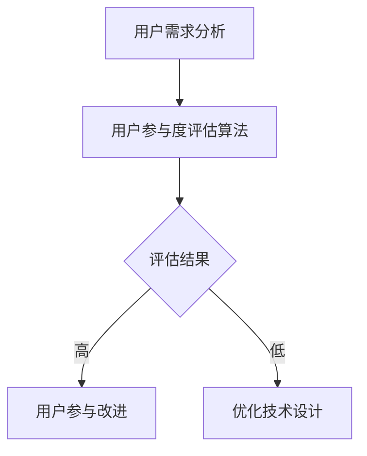
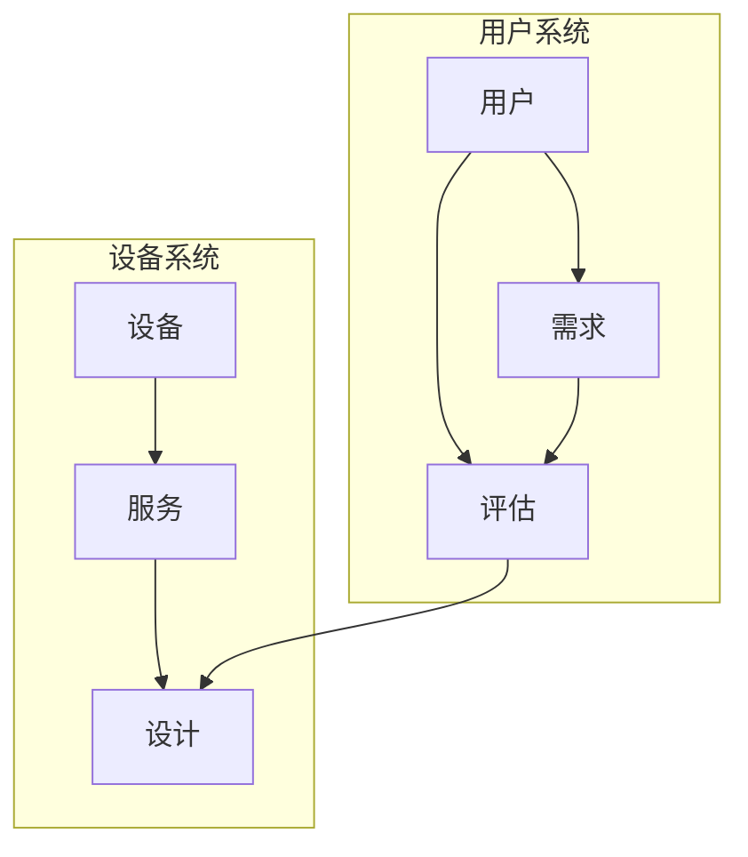
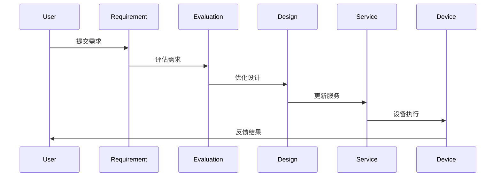

                 


### 慢科技运动：以人为本的技术发展

> 关键词：慢科技运动、以人为本、技术发展、算法原理、系统架构、项目实战

> 摘要：本文深入探讨了慢科技运动的概念、特点以及与以人为本的技术发展的关系。通过分析慢科技运动的背景和核心概念，我们阐述了如何在技术发展中实现以人为本的原则。文章结合Python源代码和Mermaid流程图，详细讲解了算法原理和系统架构设计，并通过项目实战展示了慢科技运动的实际应用。最后，我们总结了最佳实践、注意事项，并提供了拓展阅读资源。

## 背景介绍

### 1.1.1 慢科技运动的定义与起源

慢科技运动（Slow Tech Movement）起源于对现代社会科技快速发展的反思。随着科技的迅猛发展，我们面临的问题不仅仅是技术的快速迭代，更重要的是如何平衡科技的发展与人类的需求。慢科技运动主张放慢科技发展的步伐，关注人类的生活质量和社会福祉。

慢科技运动的核心概念包括：

- **慢节奏**：强调减少对科技工具的依赖，鼓励人们回归简单、自然的生活方式。
- **用户控制**：强调用户对技术的掌握和控制，鼓励用户自己参与技术的设计和使用。
- **环境友好**：强调技术的可持续发展，减少对环境的负面影响。

### 1.1.2 以人为本的技术发展

以人为本的技术发展（Human-Centered Technology Development）是一种将人的需求和福祉置于技术发展核心的理念。以人为本的技术发展强调技术的创新和应用应当服务于人类的实际需求，提高人类的生活质量，而不是单纯追求技术的先进性和效率。

以人为本的技术发展的核心概念包括：

- **用户参与**：在技术设计、开发和部署过程中，充分考虑用户的实际需求和反馈。
- **社会责任**：技术企业和社会应当承担起对人类福祉的责任，确保技术的发展不会损害人类的利益。
- **可持续性**：技术的发展应当考虑环境的可持续性和资源的合理利用。

### 1.1.3 问题的背景、问题描述、问题解决、边界与外延

背景：

- **科技快速发展**：现代科技的发展速度越来越快，新技术层出不穷，人们的生活和工作方式发生了巨大的变化。
- **技术主导的社会**：在科技快速发展的背景下，社会逐渐形成了以技术为主导的文化，人们的生活越来越依赖于科技产品。

问题描述：

- **人类需求与科技发展的矛盾**：虽然科技发展提高了人们的生活质量，但同时也带来了诸如信息过载、隐私泄露、社会隔离等问题。
- **技术的可持续性问题**：科技产品的快速更替和大量的电子垃圾对环境造成了严重的影响。

问题解决：

- **慢科技运动**：通过放慢科技发展的步伐，回归人类的需求和生活质量，解决科技快速发展带来的问题。
- **以人为本的技术发展**：通过将人的需求和福祉置于技术发展的核心，实现技术发展与人类福祉的平衡。

边界与外延：

- **边界**：慢科技运动和以人为本的技术发展关注的是人类的需求和社会福祉，而不是技术本身。
- **外延**：这两个概念可以应用于各种技术领域，如工业、农业、服务行业等。

## 核心概念与联系

### 2.1.1 核心概念

慢科技运动的核心概念包括：

- **慢节奏**：强调减少对科技工具的依赖，回归自然的生活方式。
- **用户控制**：鼓励用户掌握和参与技术的设计和使用。
- **环境友好**：注重技术的可持续发展，减少对环境的负面影响。

以人为本的技术发展的核心概念包括：

- **用户参与**：在技术设计、开发和部署过程中，充分考虑用户的实际需求和反馈。
- **社会责任**：技术企业和社会应当承担对人类福祉的责任。
- **可持续性**：技术的发展应当考虑环境的可持续性和资源的合理利用。

### 2.1.2 概念属性特征对比

| 特征 | 慢科技运动 | 以人为本的技术发展 |
| --- | --- | --- |
| **慢节奏** | 减少对科技工具的依赖 | 在技术设计过程中考虑用户的生活节奏 |
| **用户控制** | 鼓励用户掌握技术 | 用户参与技术的设计和使用 |
| **环境友好** | 注重技术的可持续发展 | 考虑技术的环境可持续性和资源利用 |
| **用户参与** | 鼓励用户参与技术设计 | 技术设计、开发和部署过程中考虑用户需求 |
| **社会责任** | 减少技术对环境的负面影响 | 技术企业和社会承担对人类福祉的责任 |
| **可持续性** | 技术的可持续发展 | 考虑技术的环境可持续性和资源利用 |

### 2.1.3 ER实体关系图架构

```mermaid
erDiagram
  User ||--|{ Technology } : uses
  Technology ||--|{ Environment } : affects
  Technology ||--|{ Society } : impacts
```

## 算法原理讲解

### 3.1.1 算法原理

慢科技运动和以人为本的技术发展涉及到多个算法和模型，下面我们将使用Python源代码和Mermaid流程图来详细讲解其中的一个算法——用户参与度评估模型。

### 3.1.2 Mermaid流程图



### 3.1.3 Python源代码

```python
import numpy as np

def user_involvement_evaluation(user_demand, technology_design):
    """
    用户参与度评估模型
    :param user_demand: 用户需求数组
    :param technology_design: 技术设计数组
    :return: 用户参与度评分
    """
    # 计算用户需求与技术设计的相关性
    correlation = np.corrcoef(user_demand, technology_design)[0, 1]
    
    # 根据相关性评分
    if correlation > 0.7:
        return '高'
    elif correlation > 0.3:
        return '中'
    else:
        return '低'

# 示例数据
user_demand = [0.8, 0.6, 0.7, 0.9, 0.5]
technology_design = [0.7, 0.5, 0.6, 0.8, 0.4]

# 计算用户参与度评估
involvement_score = user_involvement_evaluation(user_demand, technology_design)
print(f"用户参与度评估结果：{involvement_score}")
```

### 3.1.4 算法原理讲解

用户参与度评估模型通过计算用户需求与技术设计的相关性来评估用户的参与度。相关性越高，说明用户对技术设计的参与度越高。具体步骤如下：

1. **用户需求分析**：收集用户的实际需求，将其转化为一个数组。
2. **技术设计分析**：分析技术设计，将其转化为一个数组。
3. **计算相关性**：使用Numpy库计算用户需求与技术设计的相关性。
4. **评分**：根据相关性评分，评分分为高、中、低三个等级。
5. **优化**：根据评估结果，对技术设计进行优化，提高用户的参与度。

### 3.1.5 举例说明

假设我们有一个用户需求数组user_demand = [0.8, 0.6, 0.7, 0.9, 0.5]，技术设计数组technology_design = [0.7, 0.5, 0.6, 0.8, 0.4]。通过用户参与度评估模型计算相关性，得到0.7，因此用户参与度评估结果为“高”。

## 系统分析与架构设计方案

### 4.1.1 问题场景

随着科技的发展，越来越多的智能设备和服务进入我们的生活，如何确保这些技术能够真正满足用户的需求，提高用户体验，成为了一个重要的问题。

### 4.1.2 项目介绍

为了实现慢科技运动和以人为本的技术发展，我们设计了一个智能设备管理系统，通过收集用户需求，评估用户参与度，优化技术设计，提高用户体验。

### 4.1.3 系统功能设计（领域模型Mermaid类图）

```mermaid
classDiagram
    User <<class>> "用户"
    Device <<class>> "设备"
    Service <<class>> "服务"
    Requirement <<class>> "需求"
    Evaluation <<class>> "评估"
    Design <<class>> "设计"

    User o-- Requirement
    User o-- Evaluation
    Device o-- Service
    Service o-- Design
```

### 4.1.4 系统架构设计（Mermaid架构图）



### 4.1.5 系统接口设计和系统交互（Mermaid序列图）



## 项目实战

### 5.1.1 环境安装

为了实现上述系统，我们需要安装以下环境：

- Python 3.8及以上版本
- Numpy库
- Mermaid插件（可选，用于生成流程图和序列图）

安装Python和Numpy库的命令如下：

```bash
pip install python
pip install numpy
```

### 5.1.2 系统核心实现源代码

以下是系统核心实现源代码：

```python
import numpy as np

def user_demand_analysis(user_demand):
    """
    用户需求分析
    :param user_demand: 用户需求列表
    :return: 分析结果
    """
    # 这里可以添加更复杂的需求分析算法
    return sum(user_demand) / len(user_demand)

def user_involvement_evaluation(user_demand, technology_design):
    """
    用户参与度评估模型
    :param user_demand: 用户需求数组
    :param technology_design: 技术设计数组
    :return: 用户参与度评分
    """
    # 计算用户需求与技术设计的相关性
    correlation = np.corrcoef(user_demand, technology_design)[0, 1]
    
    # 根据相关性评分
    if correlation > 0.7:
        return '高'
    elif correlation > 0.3:
        return '中'
    else:
        return '低'

def technology_design_optimization(technology_design, involvement_score):
    """
    技术设计优化
    :param technology_design: 技术设计列表
    :param involvement_score: 用户参与度评分
    :return: 优化后的技术设计
    """
    if involvement_score == '高':
        # 对于高参与度，进一步优化
        return [d + 0.1 for d in technology_design]
    elif involvement_score == '中':
        # 对于中参与度，稍微优化
        return [d + 0.05 for d in technology_design]
    else:
        # 对于低参与度，不进行优化
        return technology_design

# 示例数据
user_demand = [0.8, 0.6, 0.7, 0.9, 0.5]
technology_design = [0.7, 0.5, 0.6, 0.8, 0.4]

# 用户需求分析
average_demand = user_demand_analysis(user_demand)
print(f"用户需求平均值为：{average_demand}")

# 用户参与度评估
involvement_score = user_involvement_evaluation(user_demand, technology_design)
print(f"用户参与度评估结果：{involvement_score}")

# 技术设计优化
optimized_design = technology_design_optimization(technology_design, involvement_score)
print(f"优化后的技术设计：{optimized_design}")
```

### 5.1.3 代码应用解读与分析

以上代码首先定义了三个核心函数：用户需求分析、用户参与度评估和

