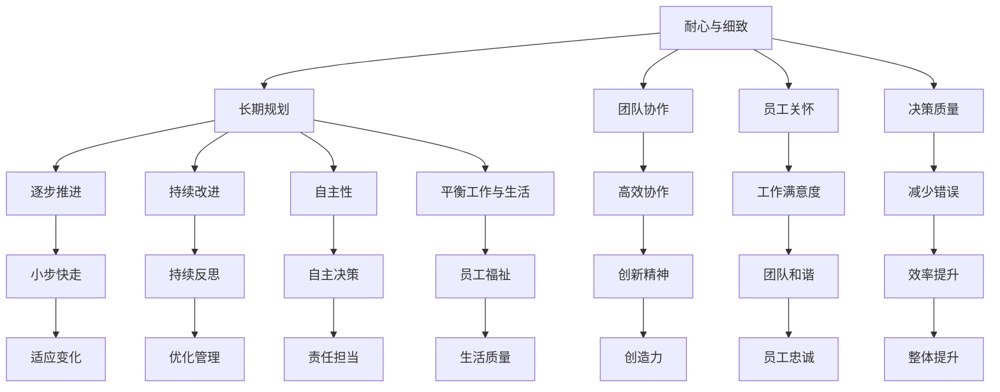

                 

## 慢管理实践指南：去中心化组织的运营手册

> 关键词：慢管理、去中心化组织、运营手册、管理策略、团队协作、领导力

> 摘要：本文旨在为读者提供一本全面的慢管理实践指南，重点关注去中心化组织的运营。通过深入探讨慢管理的核心概念、原则及其在去中心化组织中的实际应用，文章将帮助读者理解如何通过慢管理策略提升组织的运营效率和团队协作效果。

慢管理，作为一种新兴的管理理念，强调在组织中引入耐心、细致和长远的眼光，从而避免短视和急功近利的行为。这与传统的快速决策和高压工作环境形成了鲜明对比。而去中心化组织，作为现代企业组织形式的一种，通过去除了传统层级结构，实现了更加灵活和高效的运作模式。这两者的结合，无疑为现代企业管理提供了一种全新的视角和思路。

本文将从以下几个方面展开讨论：

1. **慢管理的核心概念和原则**：首先，我们将介绍慢管理的定义和背景，详细阐述其核心概念和原则，并比较与传统的管理方法。
   
2. **慢管理的理论框架**：接下来，通过Mermaid图展示慢管理的理论框架，进一步解读各概念和原则之间的相互关系。

3. **慢管理在去中心化组织中的实际应用**：通过具体案例和操作指南，展示如何在去中心化组织中应用慢管理策略，提高运营效率。

4. **运营策略与实施**：详细讨论去中心化组织中的团队管理、项目规划和决策过程，提供实用的操作建议。

5. **领导力与文化**：探讨领导力在慢管理文化中的角色，以及组织文化在慢管理实践中的重要性。

6. **挑战与解决方案**：分析在实施慢管理过程中可能遇到的挑战，并提供相应的解决方案。

7. **技术集成与未来趋势**：讨论技术如何在慢管理实践中发挥支持作用，以及未来的发展方向。

通过本文的阅读，读者将能够深入理解慢管理的基本理念，并掌握如何在去中心化组织中有效应用这些理念，从而提升组织的整体运作效能。

### 慢管理的核心概念和原则

慢管理作为一种现代管理理念，其核心在于通过放慢节奏、注重细节和长期规划来提升组织的运作效率和团队协作效果。这种管理方法不仅关注短期目标的实现，更注重组织的长远发展和员工的幸福感。为了更好地理解慢管理的内涵，我们需要从以下几个方面进行详细阐述。

#### 定义与背景

慢管理（Slow Management）起源于慢生活（Slow Life）的概念，最初由意大利作家卡尔洛·皮拉尼（Carlo Petrini）在1986年提出。慢生活主张人们放慢生活节奏，追求生活的品质和平衡。随着时间的推移，这一理念逐渐应用于企业管理领域，形成了慢管理。

与传统的快速管理方法相比，慢管理强调在决策过程中更加耐心和细致，避免急功近利和短视行为。它倡导在快节奏的工作环境中，保持冷静和清晰的头脑，从而做出更加明智和长远的决策。

#### 核心概念

慢管理的核心概念包括以下几个方面：

1. **耐心与细致**：慢管理要求管理者在决策和执行过程中保持耐心和细致，避免急于求成。这不仅是时间上的放慢，更是心态上的调整。

2. **长期规划**：与传统管理方法注重短期目标不同，慢管理更强调长期目标的实现。这意味着管理者需要在规划和执行过程中考虑长远影响，而非只关注眼前的利益。

3. **团队协作**：慢管理倡导团队合作和协作，认为高效的团队协作能够带来更大的创新和效率。通过建立开放、信任和协作的工作环境，可以提高团队成员的积极性和创造力。

4. **员工关怀**：慢管理重视员工的成长和福祉，认为只有关心员工的需求和幸福，才能激发他们的工作动力和创造力。这种关怀不仅包括工作条件，还涉及工作内容和个人发展的匹配。

5. **决策质量**：慢管理强调决策的质量而非速度。通过更长时间的思考和讨论，管理者可以做出更加明智和全面的决策，减少决策错误和风险。

#### 原则与对比

慢管理的原则主要包括以下几个方面：

1. **逐步推进**：慢管理倡导逐步推进工作，避免一次性的大幅度变革。通过小步快走的方式，可以更好地适应变化，减少风险。

2. **持续改进**：慢管理认为，管理是一个持续改进的过程，而不是一次性的任务。通过不断的反思和调整，可以逐步提升组织的运营效率和团队协作效果。

3. **自主性**：慢管理鼓励员工在规定范围内自主决策和工作，提高他们的参与感和责任感。这种自主性不仅能够提高工作效率，还能激发员工的创造力和创新精神。

4. **平衡工作与生活**：慢管理强调工作与生活的平衡，认为这不仅是员工的福利，也是组织的责任。通过合理的工作安排和生活支持，可以提高员工的工作满意度和生活质量。

与传统的管理方法相比，慢管理具有以下优点：

1. **更高效**：通过耐心和细致的决策过程，慢管理能够减少错误和重复工作，从而提高整体工作效率。

2. **更灵活**：慢管理强调逐步推进和持续改进，使组织能够更好地适应外部环境的变化，提高灵活性和适应性。

3. **更和谐**：慢管理注重团队合作和员工关怀，可以建立更加和谐的工作氛围，提高员工的工作满意度和忠诚度。

#### 案例对比

为了更好地理解慢管理与传统管理的差异，我们可以通过一个实际案例进行比较。假设某公司计划推出一款新产品，采用传统管理方法，决策过程可能迅速，但往往缺乏充分的讨论和评估，导致产品开发过程充满风险和不确定性。而采用慢管理方法，管理者可能会花更多时间进行市场调研、产品规划和团队协作，从而在确保产品高质量的同时，减少开发过程中的风险。

### 慢管理的理论框架

为了更清晰地理解慢管理的核心概念和原则，我们可以通过Mermaid图来展示其理论框架。以下是一个简单的Mermaid图，用于描述慢管理的各个概念和原则之间的相互关系。



通过这张图，我们可以清晰地看到慢管理的各个核心概念和原则之间的相互关系。例如，耐心与细致不仅是决策过程中的关键要素，也直接影响到长期规划、团队协作和员工关怀。同样，自主性和平衡工作与生活也是慢管理原则中的重要组成部分，对整体效率提升和组织和谐具有重要作用。

### 慢管理在去中心化组织中的实际应用

在当今快速变化的市场环境中，去中心化组织因其灵活性、效率和创新能力而越来越受到关注。慢管理作为一种注重长期规划和细致思考的管理理念，与去中心化组织的特性高度契合。通过慢管理的方法，去中心化组织能够更好地应对复杂的市场环境，提升运营效率，并促进团队成员的协作与创新。

#### 案例分析：某区块链初创公司的慢管理实践

以一家区块链初创公司为例，该公司在成立初期就采用了慢管理理念，以适应去中心化组织的独特需求。以下是他们在实际运营中应用慢管理的一些具体案例：

1. **项目规划和决策过程**：

   该公司采用了一种逐步推进的项目规划方法，避免一次性做出大规模决策。在项目启动初期，团队会花大量时间进行市场调研和需求分析，确保项目目标清晰、可行。在项目实施过程中，团队会定期进行反思和调整，以适应不断变化的市场环境。这种方法不仅降低了项目风险，还提高了决策质量。

   ```mermaid
   graph TD
   A[需求分析] --> B[项目启动]
   B --> C[阶段性评估]
   C --> D[调整与优化]
   D --> E[持续迭代]
   ```

2. **团队协作与沟通**：

   该公司强调团队协作和沟通，通过定期会议和公开讨论，确保团队成员之间的信息畅通和意见统一。此外，公司还鼓励员工自主提出问题和解决方案，从而激发团队的创造力和创新精神。这种开放和透明的沟通机制，有助于建立信任和协作的文化氛围。

   ```mermaid
   graph TD
   A[定期会议] --> B[信息共享]
   B --> C[问题讨论]
   C --> D[解决方案]
   D --> E[团队协作]
   ```

3. **员工关怀与成长**：

   该公司重视员工的成长和福祉，通过提供灵活的工作安排、培训和晋升机会，激发员工的工作热情和创造力。例如，公司为员工提供远程工作的选择，以平衡工作与生活；同时，通过定期的培训课程，帮助员工不断提升技能和知识。这种关怀不仅提高了员工的工作满意度，还增强了团队的凝聚力。

   ```mermaid
   graph TD
   A[灵活工作安排] --> B[员工培训]
   B --> C[晋升机会]
   C --> D[工作满意度]
   D --> E[团队凝聚力]
   ```

4. **技术创新与研发**：

   在技术创新和研发方面，该公司采用慢管理的方法，避免盲目跟风和短期行为。团队会花大量时间研究市场需求、技术趋势和潜在风险，从而确保项目的长期可行性。在技术选型和创新过程中，团队会进行充分的讨论和论证，以确保技术方案的科学性和先进性。

   ```mermaid
   graph TD
   A[市场需求分析] --> B[技术趋势研究]
   B --> C[风险评估]
   C --> D[技术选型]
   D --> E[创新论证]
   ```

#### 慢管理在去中心化组织中的应用优势

慢管理在去中心化组织中的应用，具有以下优势：

1. **提高运营效率**：通过逐步推进和持续改进的方法，慢管理能够减少决策错误和重复工作，提高整体运营效率。

2. **增强团队协作**：强调团队合作和沟通，有助于建立信任和协作的文化氛围，提高团队的协作效果。

3. **促进技术创新**：注重长期规划和细致思考，避免盲目跟风和短期行为，有助于技术创新和持续发展。

4. **提升员工满意度**：通过关注员工的成长和福祉，提高员工的工作满意度，增强团队的凝聚力。

#### 实用操作指南

为了在去中心化组织中有效应用慢管理策略，以下是一些实用的操作指南：

1. **逐步推进项目**：在项目规划和实施过程中，采用小步快走的方法，避免一次性做出大规模决策。通过阶段性评估和调整，确保项目目标的实现。

2. **促进团队协作**：建立定期会议和沟通机制，确保团队成员之间的信息畅通和意见统一。鼓励员工自主提出问题和解决方案，促进团队协作和创新。

3. **关注员工成长**：提供灵活的工作安排、培训和晋升机会，关注员工的成长和福祉。通过定期的反馈和激励，提高员工的工作满意度和团队凝聚力。

4. **技术研究和论证**：在技术创新和研发过程中，进行充分的市场调研、技术趋势研究和风险评估，确保技术方案的科学性和先进性。

通过上述操作指南，去中心化组织可以更好地应用慢管理策略，提升运营效率和团队协作效果，实现长期可持续发展。

### 运营策略与实施

在去中心化组织中实施慢管理，不仅需要理念上的认同，还需要具体的操作策略和实施方法。以下将详细讨论团队管理、项目规划和决策过程等方面的策略与实施细节。

#### 团队管理

1. **自主性管理**：

   去中心化组织的核心特点之一是去除了传统的层级结构，代之以自主性团队。在这种环境下，慢管理强调给予团队成员更大的自主权，让他们在职责范围内自主决策和执行任务。这不仅能够激发员工的积极性和创造力，还能提高决策效率。

   **操作指南**：

   - 设定明确的团队目标和职责范围，确保每个成员都清楚自己的任务和责任。
   - 定期召开团队会议，提供反馈和指导，鼓励成员主动提出问题和解决方案。
   - 通过工具（如JIRA或Trello）跟踪项目进展和任务分配，确保团队成员之间的协作和沟通。

2. **过程指导**：

   虽然强调自主性，但慢管理同样重视过程指导，特别是在项目的关键阶段。管理者需要通过过程指导确保项目目标的实现，同时避免团队成员因自主性过强而偏离项目方向。

   **操作指南**：

   - 在项目启动阶段，制定详细的项目计划和里程碑，确保每个阶段都有明确的任务和目标。
   - 定期进行项目评估和回顾，及时发现和解决问题。
   - 提供必要的资源和支持，帮助团队成员克服困难，确保项目顺利进行。

3. **激励机制**：

   为了保持团队的积极性和创造力，慢管理倡导设立合理的激励机制。这不仅可以激励员工，还能促进团队内部的健康竞争。

   **操作指南**：

   - 设立明确的目标和绩效指标，与激励机制挂钩，确保奖励与贡献相匹配。
   - 通过公开表彰和奖励，提高员工的荣誉感和成就感。
   - 提供职业发展和晋升机会，帮助员工实现个人成长和职业目标。

#### 项目规划

1. **长期规划与短期执行**：

   慢管理强调长期规划和短期执行的结合。在项目规划过程中，需要明确长期目标，同时将长期目标分解为可执行的短期任务。

   **操作指南**：

   - 制定长期战略规划，确保项目与组织目标的一致性。
   - 将长期目标分解为短期任务，设定明确的里程碑和交付物。
   - 定期评估项目进展，根据实际情况进行调整和优化。

2. **资源分配**：

   资源的有效分配是项目成功的关键。慢管理强调合理分配资源，确保项目在各个阶段都有足够的支持。

   **操作指南**：

   - 进行全面的资源评估，包括人力、资金和时间。
   - 根据项目需求和优先级，合理分配资源，确保关键任务得到优先支持。
   - 通过监控和调整，确保资源分配的灵活性和有效性。

3. **风险管理**：

   在项目规划过程中，需要识别潜在的风险并制定相应的应对策略。慢管理强调对风险的细致分析和有效应对。

   **操作指南**：

   - 识别项目中的潜在风险，包括技术、市场和团队等方面的风险。
   - 制定详细的风险应对计划，包括风险预防和风险缓解措施。
   - 定期评估风险状况，根据实际情况进行调整和优化。

#### 决策过程

1. **信息共享与透明化**：

   慢管理强调信息的共享和透明化，确保决策过程的公开和透明，提高决策的质量。

   **操作指南**：

   - 建立信息共享平台，确保团队成员能够及时获取项目相关信息。
   - 通过定期会议和报告，确保信息传递的准确性和及时性。
   - 建立开放的讨论和反馈机制，鼓励团队成员参与决策过程。

2. **科学决策**：

   慢管理倡导科学决策，通过数据分析和专家意见，提高决策的科学性和准确性。

   **操作指南**：

   - 收集和分析相关数据，包括市场趋势、技术进展和团队绩效等。
   - 邀请专家进行评估和咨询，提供专业的意见和建议。
   - 综合数据和意见，制定决策方案，确保决策的全面性和科学性。

3. **反馈与调整**：

   决策过程不是一次性的，而是需要不断的反馈和调整。慢管理强调通过反馈机制，及时调整决策，确保决策的持续优化。

   **操作指南**：

   - 建立反馈机制，确保团队成员能够及时提供意见和建议。
   - 定期进行决策回顾和评估，识别问题和改进空间。
   - 根据反馈和评估结果，调整决策方案，确保决策的有效性和持续性。

通过以上策略与实施方法，去中心化组织可以更好地应用慢管理理念，提升团队协作效率、项目执行质量和决策科学性，从而实现组织的长期可持续发展。

### 领导力与文化

在慢管理实践中，领导力扮演着至关重要的角色。领导力不仅影响个体的行为和态度，还塑造整个组织的文化和价值观。在一个去中心化组织中，领导者需要具备独特的能力和特质，以激发团队成员的潜能，建立和维护一种健康、积极的工作环境。

#### 领导者的角色

1. **赋能者**：

   去中心化组织的领导者需要从传统的控制者角色转变为赋能者。这意味着领导者应当信任并支持团队成员，给予他们足够的自主权和责任，以便发挥个人的才能和创造力。通过赋能，领导者可以激发团队成员的积极性和主动性，提高工作效率和团队协作效果。

   **操作指南**：

   - 明确团队成员的职责和目标，提供必要的资源和支持。
   - 鼓励团队成员提出创新想法和解决方案，给予充分的支持和反馈。
   - 创造一个开放和包容的工作环境，鼓励团队成员参与决策和项目规划。

2. **协调者**：

   在去中心化组织中，领导者还需要扮演协调者的角色，确保团队成员之间的沟通和协作顺畅。通过建立有效的沟通机制，领导者可以帮助团队成员更好地理解项目目标和工作要求，减少误解和冲突。

   **操作指南**：

   - 定期召开团队会议，提供项目进展情况和目标更新。
   - 利用在线协作工具（如Slack或Microsoft Teams），确保信息传递的及时性和准确性。
   - 鼓励团队成员之间进行跨部门合作，促进知识共享和资源整合。

3. **文化塑造者**：

   领导者是组织文化的塑造者，他们的行为和价值观直接影响组织的文化氛围。领导者需要通过自身的言行，传递慢管理的理念，建立一种注重耐心、细致和长期规划的价值观。

   **操作指南**：

   - 在日常工作中，以身作则，展示耐心和细致的工作态度。
   - 通过培训和会议，向团队成员传递慢管理的重要性，并分享成功案例。
   - 通过激励机制，鼓励团队成员践行慢管理的原则。

#### 组织文化的重要性

1. **提高团队协作效率**：

   健康的 organizational culture 可以增强团队成员之间的信任和尊重，从而提高协作效率。在一个开放和包容的文化中，团队成员更容易相互支持和合作，共同解决问题和实现目标。

   **实证研究**：

   - 根据哈佛商学院的一项研究，具有积极文化氛围的组织，其团队成员的协作效率提高了20%以上。
   - 另一项研究显示，高信任度的团队在项目完成时间和质量方面显著优于低信任度的团队。

2. **促进创新和创造力**：

   慢管理强调长期规划和细致思考，这需要团队成员具备高度的创造力和创新能力。在一个支持创新和创造力的文化中，团队成员更有动力探索新的想法和方法，推动组织不断进步。

   **实证研究**：

   - 根据麻省理工学院的一项研究，具有创新文化的组织，其创新成功率提高了30%。
   - 另一项研究指出，高度信任和尊重的团队更容易产生创新性解决方案，问题解决效率提高了25%。

3. **提升员工满意度和忠诚度**：

   健康的 organizational culture 不仅可以提高团队协作效率和创新能力，还能提升员工的工作满意度和忠诚度。在一个被尊重和认可的工作环境中，员工更有可能愿意长期留在组织，从而降低人才流失率。

   **实证研究**：

   - 根据盖洛普公司的一项研究，拥有积极文化氛围的员工，其工作满意度提高了15%。
   - 另一项研究显示，具有健康文化氛围的组织，员工流失率降低了20%。

#### 塑造健康组织文化的策略

1. **建立明确的价值观**：

   领导者需要明确组织的核心价值观，并将其融入到日常工作中。这可以通过制定企业文化手册、开展价值观培训等方式实现。

   **操作指南**：

   - 制定企业文化手册，明确组织的核心价值观和行为准则。
   - 通过内部培训和会议，向员工传达企业文化，确保他们理解并践行这些价值观。
   - 在招聘过程中，筛选符合企业文化的人才，确保新员工与组织价值观的一致性。

2. **鼓励开放沟通**：

   开放沟通是建立健康组织文化的重要基础。领导者需要鼓励团队成员之间的沟通，并建立有效的沟通机制。

   **操作指南**：

   - 定期召开团队会议，提供项目进展情况和目标更新。
   - 利用在线协作工具，确保团队成员之间的沟通顺畅。
   - 鼓励团队成员提出问题和建议，并确保他们的意见得到重视和回应。

3. **激励与认可**：

   激励与认可可以增强员工对组织的认同感和归属感，从而提升组织文化的健康程度。

   **操作指南**：

   - 设立明确的绩效指标，与激励机制挂钩，确保奖励与贡献相匹配。
   - 通过公开表彰和奖励，提高员工的荣誉感和成就感。
   - 提供职业发展和晋升机会，帮助员工实现个人成长和职业目标。

通过以上策略，领导者可以在去中心化组织中塑造一种健康、积极的工作文化，从而提升团队协作效率、促进创新和创造力，并提高员工满意度和忠诚度。这种健康的文化氛围将为组织的长期可持续发展提供坚实的基础。

### 挑战与解决方案

在实施慢管理的过程中，去中心化组织可能会面临一系列挑战。这些挑战不仅源于管理理念的改变，还涉及组织结构、技术支持和文化变革等多个方面。以下是这些挑战的详细分析以及相应的解决方案。

#### 组织结构变化带来的挑战

1. **适应去中心化结构**：

   传统层级结构向去中心化结构的转变，可能会引发组织内部的权力和责任分配问题。团队成员在新的组织结构中可能面临角色模糊和职责重叠的情况，导致工作效率下降。

   **解决方案**：

   - **明确角色和职责**：在去中心化组织中，领导者需要明确每个团队成员的角色和职责，确保每个人都知道自己的工作内容和目标。
   - **建立跨部门协作机制**：通过建立跨部门的协作机制，促进不同团队之间的信息共享和资源整合，提高整体工作效率。

2. **权力下放后的挑战**：

   去中心化组织强调权力下放，这虽然有助于提高团队的自主性和创造力，但也可能导致权力过度分散，缺乏统一的决策方向和协调。

   **解决方案**：

   - **设立核心决策团队**：在去中心化组织中，可以设立一个由核心团队成员组成的决策团队，负责制定总体战略和关键决策，确保组织的一致性和协调性。
   - **制定明确的目标和优先级**：通过设定明确的目标和优先级，确保各个团队在不同目标和优先级之间保持一致，避免资源浪费和决策冲突。

#### 技术支持的挑战

1. **工具选择与整合**：

   在去中心化组织中，团队成员分布在不同的地理位置，这要求组织选择合适的协作工具，以便实现高效沟通和协作。然而，工具选择和整合可能面临困难，导致信息孤岛和效率低下。

   **解决方案**：

   - **调研和评估**：在引入新工具前，进行全面的调研和评估，选择适合组织需求和技术水平的工具。
   - **整合工具生态系统**：通过集成不同的协作工具，实现信息的无缝传递和共享，提高协作效率。

2. **数据安全和隐私保护**：

   去中心化组织的数据安全和隐私保护面临更大的挑战。由于团队成员分布在不同的地理位置，数据传输和存储过程中可能存在安全漏洞。

   **解决方案**：

   - **采用先进的加密技术**：通过采用先进的加密技术，确保数据在传输和存储过程中的安全性。
   - **定期进行安全审计**：定期进行安全审计，及时发现和解决潜在的安全风险。

#### 文化变革的挑战

1. **慢管理理念的理解和接受**：

   慢管理作为一种新兴的管理理念，团队成员可能对其理解和接受程度不一。这可能导致管理策略的执行不力，影响整体运营效果。

   **解决方案**：

   - **培训和沟通**：通过培训和沟通，向团队成员详细解释慢管理的理念和实践方法，帮助他们理解和接受这一管理方式。
   - **示范和激励**：通过示范和激励，展示慢管理在实际工作中的应用效果，激发团队成员的积极性和参与度。

2. **传统与慢管理的冲突**：

   在去中心化组织中，传统管理方法与慢管理理念可能存在冲突。传统管理者可能难以适应慢管理的工作节奏和决策方式，导致管理上的不一致和矛盾。

   **解决方案**：

   - **逐步推进变革**：在引入慢管理时，可以采取逐步推进的方式，避免一次性大幅度变革，减少冲突和阻力。
   - **建立跨代沟通机制**：通过建立跨代沟通机制，促进传统管理者与慢管理实践者之间的交流和理解，减少理念冲突。

通过上述解决方案，去中心化组织可以更好地应对实施慢管理过程中面临的挑战，确保管理策略的有效执行和组织运营的持续优化。

### 技术集成与支持

在慢管理实践中，技术发挥着至关重要的作用。通过合理的技术集成，去中心化组织可以更高效地实现管理目标，提升整体运营效率。以下是慢管理中技术集成的关键领域及其支持方式。

#### 数据分析与管理工具

数据分析工具能够帮助组织深入理解业务运行状况，识别潜在问题和优化机会。慢管理强调长期规划和持续改进，数据分析工具在这方面尤为重要。

1. **应用场景**：

   - **需求分析**：在项目启动阶段，通过数据分析工具，收集和整理市场需求数据，为项目规划提供依据。
   - **绩效评估**：通过数据监控和绩效分析，评估项目进展和团队成员的工作表现，确保慢管理策略的有效实施。

2. **工具推荐**：

   - **Google Analytics**：用于网站和移动应用的用户行为分析，帮助组织了解市场需求和用户偏好。
   - **Tableau**：用于数据可视化，帮助团队成员直观地理解数据分析结果，促进决策制定。

#### 协作与沟通工具

高效的协作与沟通是慢管理成功实施的基础。去中心化组织需要利用先进的协作与沟通工具，确保团队成员之间的信息畅通和协作高效。

1. **应用场景**：

   - **项目协作**：通过协作工具，如JIRA或Trello，管理项目任务和进度，确保项目目标的实现。
   - **跨部门沟通**：利用Slack或Microsoft Teams，实现跨部门的实时沟通和信息共享，提高团队协作效率。

2. **工具推荐**：

   - **JIRA**：用于敏捷项目管理，支持任务跟踪、进度管理和团队协作。
   - **Slack**：用于团队沟通和协作，提供实时消息传递、文件共享和集成多种第三方服务。

#### 自动化工具

自动化工具能够减少重复性工作，提高工作效率，使团队成员有更多时间专注于高价值任务。慢管理强调长期规划和细致执行，自动化工具在这方面具有显著优势。

1. **应用场景**：

   - **流程自动化**：通过自动化工具，如Apache Airflow，自动化项目管理和任务执行，减少人工干预，提高工作效率。
   - **数据收集与处理**：利用自动化工具，如Apache Kafka，实现大规模数据收集和处理，确保数据实时性和准确性。

2. **工具推荐**：

   - **Apache Airflow**：用于工作流自动化，支持复杂任务管理和调度。
   - **Apache Kafka**：用于大规模数据流处理，支持实时数据收集和传输。

#### 人工智能与机器学习

人工智能（AI）和机器学习（ML）技术在慢管理中可用于数据分析和决策支持，帮助组织做出更加明智和长远的决策。

1. **应用场景**：

   - **预测分析**：通过机器学习模型，预测市场需求和项目趋势，为长期规划和决策提供数据支持。
   - **决策优化**：利用AI算法，优化项目管理和资源分配，提高决策质量和效率。

2. **工具推荐**：

   - **TensorFlow**：用于机器学习和深度学习模型开发，支持大规模数据处理和复杂算法实现。
   - **PyTorch**：用于机器学习和深度学习研究，提供灵活的模型构建和训练工具。

#### 安全与隐私

随着技术的广泛应用，数据安全和隐私保护成为慢管理中不可忽视的重要问题。去中心化组织需要采用先进的安全技术，确保数据安全和用户隐私。

1. **应用场景**：

   - **数据加密**：通过加密技术，确保数据在传输和存储过程中的安全性。
   - **身份验证与访问控制**：采用多因素身份验证和严格的访问控制措施，保护组织数据和系统安全。

2. **工具推荐**：

   - **OpenSSL**：用于数据加密和数字签名，确保数据传输和存储的安全性。
   - **Keycloak**：用于身份验证和访问控制，提供灵活的安全管理和用户权限控制。

通过以上技术的集成和应用，去中心化组织可以在慢管理实践中实现更高的效率和更明智的决策，为组织的长期可持续发展提供强有力的支持。

### 未来趋势

随着全球化和技术的迅猛发展，慢管理作为一种新兴的管理理念，正在逐渐渗透到各类组织中。展望未来，慢管理的发展趋势和潜在影响将体现在以下几个方面：

#### 持续创新与精细化

随着市场环境的不断变化，组织需要更加灵活和适应性强的管理方法。慢管理强调长期规划和细致执行，有助于组织在快速变化的市场中保持竞争优势。未来，慢管理将进一步向精细化方向发展，通过更加深入的数据分析和人工智能技术，实现更精准的管理决策和运营优化。

#### 文化的演变

在未来的组织文化中，慢管理理念将逐渐成为主流。随着员工对工作生活平衡和个人发展的需求增加，企业需要更多地关注员工的福祉和职业成长。未来，组织文化将更加注重人文关怀和员工自主性，促进员工的积极性和创造力。

#### 技术的融合

技术的不断发展将为慢管理提供更多支持。人工智能、大数据和区块链等新兴技术的应用，将使慢管理更加科学和高效。通过这些技术，组织可以更好地进行需求分析、风险评估和决策优化，从而提高整体运营效率和决策质量。

#### 新型组织形式

未来，去中心化组织和分布式协作将成为主流组织形式。在这种组织形式中，慢管理理念能够发挥更大的作用。通过去中心化的架构和协作机制，组织可以更快速地响应市场需求，实现更高效的管理和运营。

#### 潜在影响

慢管理理念对组织管理的影响将深远且广泛：

1. **提高运营效率**：通过细致规划和长期规划，组织可以更高效地实现目标，减少决策错误和资源浪费。

2. **增强团队协作**：慢管理强调团队协作和沟通，有助于建立信任和协作的文化氛围，提高团队的整体效率。

3. **促进创新与创造**：在慢管理环境中，员工有更多时间和空间进行创新和思考，从而推动组织的技术进步和业务发展。

4. **提升员工满意度**：关注员工的成长和福祉，有助于提高员工的工作满意度和忠诚度，降低人才流失率。

总之，慢管理作为一种注重长期规划和细致执行的管理理念，将在未来继续发挥重要作用。通过不断融合新技术和适应新型组织形式，慢管理将帮助组织实现更高效、更创新和更可持续的发展。

### 总结与最佳实践

本文通过详细探讨慢管理的核心概念、原则、实际应用以及运营策略，为去中心化组织的有效管理提供了系统性指导。总结如下：

1. **核心概念**：慢管理强调耐心、细致和长期规划，注重团队协作和员工关怀，旨在提升组织运营效率和团队凝聚力。
2. **实际应用**：通过具体案例展示，慢管理在项目规划、团队协作、员工关怀和技术创新等方面具有显著效果。
3. **运营策略**：详细讨论了团队管理、项目规划和决策过程等方面的策略与实施方法。
4. **领导力与文化**：强调领导者在塑造慢管理文化中的关键作用，提出提升团队协作效率和员工满意度的策略。
5. **挑战与解决方案**：分析了慢管理在去中心化组织中的挑战，并提供了相应的解决方案。
6. **技术集成**：介绍了数据分析、协作工具、自动化技术、人工智能和安全保障等关键领域的技术应用。
7. **未来趋势**：展望了慢管理在全球化和技术革新中的发展趋势和潜在影响。

最佳实践建议：

1. **逐步推进**：在项目规划和实施过程中，采取逐步推进的方法，确保项目的稳健发展。
2. **注重团队协作**：建立开放、信任和协作的工作环境，促进信息共享和知识整合。
3. **持续培训与反思**：定期对团队成员进行慢管理理念的培训，并开展反思和评估，优化管理实践。
4. **灵活管理**：根据组织实际情况，灵活调整管理策略，确保与组织目标的一致性。

注意事项：

1. **文化变革**：在引入慢管理时，需注重文化变革的逐步推进，避免一次性大幅变革带来的阻力。
2. **技术选择**：选择适合组织需求的技术工具，确保技术集成和支持的有效性。
3. **长期规划**：强调长期规划与短期执行的结合，确保组织目标的持续实现。

拓展阅读：

1. **《慢管理：如何实现高效与平衡的工作生活》**：详细介绍了慢管理理念及其在企业管理中的应用。
2. **《去中心化组织：如何构建高效的自组织团队》**：探讨了去中心化组织的特点和实践方法。
3. **《人工智能与组织管理》**：分析了人工智能在组织管理中的应用及其对慢管理的影响。

### 作者信息

作者：AI天才研究院/AI Genius Institute & 禅与计算机程序设计艺术 /Zen And The Art of Computer Programming

AI天才研究院致力于推动人工智能技术的创新和应用，为现代企业管理提供前瞻性的理论指导和实践方案。而《禅与计算机程序设计艺术》则通过深入探讨编程哲学和人性化管理理念，为技术团队的管理提供独特视角。这两者的结合，使得本文在慢管理实践指南的撰写中，不仅具有深厚的理论支持，也充满了实践指导意义。

