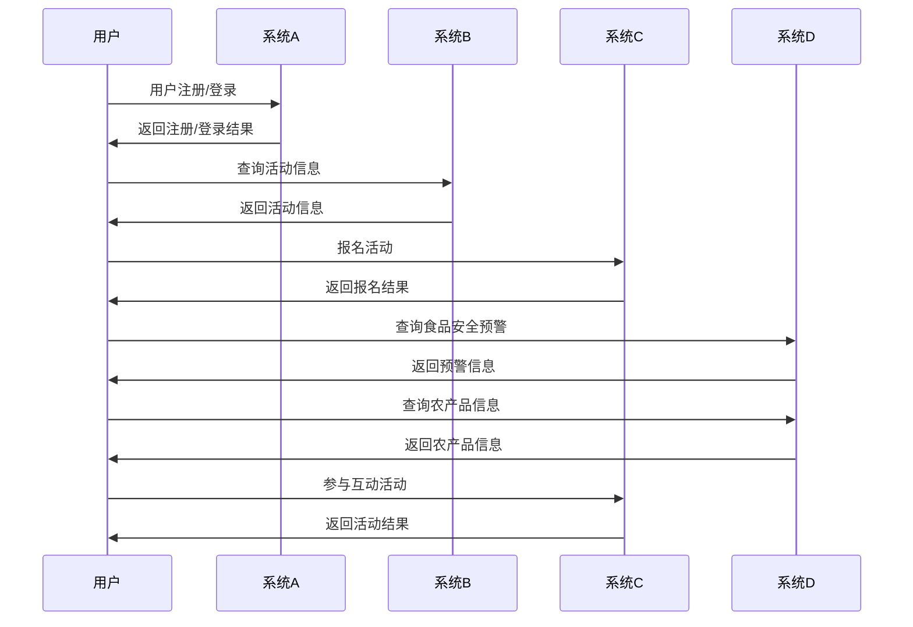

                 


### 关键词：

1. 慢食运动
2. 饮食文化
3. 文化传承
4. 健康生活方式
5. 食品安全
6. 传统饮食
7. 可持续发展

### 摘要：

本文以《慢食革命：饮食中的文化传承》为题，深入探讨了饮食文化中的慢食运动。文章首先介绍了慢食运动的起源与背景，探讨了其核心原则和实践方式。接着，分析了慢食革命对饮食文化的影响与面临的挑战，并通过案例研究展示了不同国家和地区的慢食实践。最后，文章从理论基础、实践中的关键问题、系统分析与架构设计等方面，全面阐述了慢食革命的理论与实践。通过本文的阐述，我们希望读者能够更好地理解慢食革命的意义，并在日常生活中践行慢食理念。

## 第一部分：慢食运动的起源与背景

### 1.1 慢食运动的起源

**背景介绍**

慢食运动（Slow Food Movement）起源于20世纪80年代，由意大利的厨师、美食家和作家卡洛·佩特里尼（Carlo Petrini）发起。当时的意大利正面临着快速工业化带来的饮食文化冲击，传统饮食文化逐渐消失，快餐文化迅速崛起。卡洛·佩特里尼对此感到担忧，他认为这种趋势将导致食物质量下降，文化多样性的丧失，以及人们对健康生活方式的忽视。

**问题背景**

卡洛·佩特里尼提出了“慢食”的概念，倡导人们放慢进食的速度，享受食物的美好，关注食物的生产过程和质量。这一理念很快得到了广泛的关注和支持，慢食运动也随之诞生。

**问题描述**

慢食运动的初衷是保护传统饮食文化，提升人们对健康饮食的认识，促进可持续农业的发展。其核心目标是反对工业化的快餐生产和消费方式，鼓励人们选择新鲜、健康、可持续的食材，享受自然的味道。

**问题解决**

慢食运动通过一系列活动来实现其目标，包括举办慢食节、开设慢食学校、出版相关书籍和杂志、建立慢食协会等。此外，慢食运动还积极推广有机农业、生态农业和地方特色农产品。

**边界与外延**

慢食运动不仅关注食物本身，还涉及饮食文化、环境保护、社会公平等多个领域。它强调的是一种健康、可持续的生活方式和价值观念。

**概念结构与核心要素组成**

慢食运动的核心概念包括：

1. **慢食理念**：倡导放慢进食速度，享受食物的美好。
2. **慢食餐桌**：强调食物的源头和质量，推崇手工制作。
3. **慢食文化**：传承和保护传统饮食文化，促进文化交流。
4. **慢食运动**：通过实际行动推动慢食理念的实施和传播。

### 1.2 慢食运动的发展背景

**社会环境**

在慢食运动兴起之前，全球化、工业化和城市化进程加速，传统饮食文化受到了前所未有的冲击。快餐文化的普及使得人们越来越忽视食物的质量和来源，饮食健康问题日益突出。这一背景下，慢食运动的诞生显得尤为及时和必要。

**经济因素**

随着人们生活水平的提高，对饮食质量的需求也日益增加。越来越多的人开始关注有机食品、绿色食品和健康饮食，这为慢食运动提供了良好的市场基础。

**文化传承**

饮食文化是一个国家和民族的重要文化遗产。慢食运动致力于保护和传承传统饮食文化，使之不因现代化的冲击而消失。

### 1.3 慢食运动的目标与意义

**目标**

慢食运动的主要目标是：

1. **保护传统饮食文化**：通过倡导慢食理念，防止传统饮食文化的消失。
2. **提升饮食质量**：鼓励人们选择新鲜、健康、可持续的食材。
3. **促进可持续农业**：推动有机农业和生态农业的发展。

**意义**

慢食运动的意义在于：

1. **文化传承**：饮食文化是一个国家和民族的重要文化遗产。慢食运动有助于保护和传承这些宝贵的文化遗产。
2. **健康生活方式**：慢食理念倡导健康、平衡的饮食方式，有助于提高人们的健康水平。
3. **可持续发展**：慢食运动鼓励人们选择可持续的食材和生活方式，有助于推动可持续发展。

### 1.4 慢食运动的影响力

**食品安全**

慢食运动提倡选择新鲜、自然、无污染的食材，有助于保障食品安全。

**农业发展**

慢食运动鼓励有机农业和生态农业的发展，有助于提高农产品的质量和产量，促进农业可持续发展。

**文化交流**

慢食运动通过推广慢食理念，促进了不同文化之间的交流和理解。

### 1.5 本章小结

本部分介绍了慢食运动的起源、发展背景、目标和意义，以及它对社会、农业和文化的积极影响。在接下来的章节中，我们将进一步探讨慢食理念的核心原则和实践方式。

## 第二部分：慢食理念与实践

### 2.1 慢食理念的核心原则

**尊重自然**

慢食理念强调尊重自然，主张食物应该来自自然，而不是通过人工手段加工。这包括选择有机食品、无污染的食材，以及采用生态友好的农业方法。

**重视传统**

慢食理念强调重视传统饮食文化，认为传统饮食是一种宝贵的文化遗产，值得传承和发扬。这包括保护传统烹饪技巧、传统食品配方和传统饮食习俗。

**倡导健康**

慢食理念倡导健康饮食，主张食物应该富含营养，有益于身体健康。这包括选择新鲜食材、避免过度加工的食物，以及遵循科学的饮食原则。

### 2.2 慢食饮食的实践方式

**慢食餐桌的布置**

慢食餐桌的布置强调简洁、自然和美观。餐具、桌布和装饰品应尽量使用天然材料，避免过度装饰。食物的摆放应注重美观和色彩搭配。

**慢食烹饪技巧**

慢食烹饪强调手工制作和自然烹饪方法。烹饪过程中应尽量减少人工添加剂，使用新鲜食材和简单的烹饪技巧，以保留食物的原汁原味。

**慢食饮食的选择**

慢食饮食的选择应遵循以下原则：

1. **选择新鲜食材**：新鲜食材富含营养，口感更佳。
2. **选择有机食品**：有机食品无污染，更健康。
3. **选择本地食材**：本地食材新鲜，减少运输过程中的损耗。

### 2.3 慢食生活方式的推广

**社区活动**

社区活动是推广慢食生活方式的重要手段。可以通过组织慢食讲座、烹饪课程、市集等活动，让更多人了解和参与到慢食运动中来。

**教育与宣传**

教育与宣传是推动慢食理念传播的重要手段。可以通过学校教育、媒体宣传、出版物等方式，提高人们对慢食的认识和重视。

**政策支持**

政策支持是慢食运动发展的重要保障。政府可以出台相关政策，鼓励和支持有机农业、生态农业和慢食产业的发展。

### 2.4 慢食运动的参与者

**烹饪爱好者**

烹饪爱好者是慢食运动的重要参与者。他们可以通过学习烹饪技巧、参与烹饪活动，推广慢食理念。

**农业生产者**

农业生产者是慢食运动的基石。他们通过种植有机食品、推广生态农业，为慢食运动提供了优质食材。

**消费者**

消费者是慢食运动的重要力量。他们通过选择新鲜、健康、可持续的食材，践行慢食理念。

### 2.5 本章小结

本部分详细介绍了慢食理念的核心原则、实践方式和推广途径，以及慢食运动的参与者。在接下来的章节中，我们将进一步探讨慢食革命的影响与挑战。

## 第三部分：慢食革命的影响与挑战

### 3.1 慢食革命对饮食文化的贡献

**保护和传承饮食文化**

慢食革命通过强调传统饮食文化和烹饪技巧的传承，有效地保护了饮食文化的多样性。许多传统食品和烹饪方法得以保存和发扬，成为国家或地区的文化遗产。

**提升饮食质量**

慢食革命倡导选择新鲜、有机、无污染的食材，强调食物的原汁原味。这有助于提高饮食质量，减少食物中的有害物质，促进人们的健康。

**促进文化交流**

慢食革命通过推广慢食理念，促进了不同文化之间的交流和理解。各国美食家、烹饪爱好者可以互相学习、分享经验，增进友谊。

### 3.2 慢食革命面临的挑战

**社会认知度的问题**

尽管慢食革命在全球范围内得到了广泛的关注，但仍有很多人对慢食理念了解不深。提高社会对慢食的认知度，仍然是慢食运动面临的重要挑战。

**经济成本的压力**

慢食饮食通常需要更高的成本，包括有机食品的价格、烹饪器具的购置等。这对于一些经济条件较差的消费者来说，可能是一个负担。

**与现代生活节奏的冲突**

现代生活节奏快，很多人难以适应慢食理念。如何在快节奏的生活中实践慢食，是一个值得探讨的问题。

### 3.3 慢食革命的未来展望

**慢食与可持续发展的融合**

慢食革命与可持续发展理念有着天然的契合点。未来，慢食运动可以进一步与可持续发展相结合，推动环保、健康、可持续的生活方式。

**全球的影响**

随着全球化的深入，慢食理念将在全球范围内产生更大的影响。各国可以借鉴慢食经验，推动本国的饮食文化发展和饮食健康。

**未来趋势**

未来，慢食运动可能呈现出以下趋势：

1. **更广泛的社会参与**：更多的人将参与到慢食运动中来，推动饮食文化的变革。
2. **技术创新**：随着科技的发展，慢食理念将在生产、加工、储存等环节得到更广泛的应用。
3. **多元化**：慢食运动将在全球范围内呈现出多元化的发展趋势，各国可以根据自身的文化特点，发展具有地方特色的慢食文化。

### 3.4 本章小结

本部分详细分析了慢食革命对饮食文化的贡献、面临的挑战以及未来的展望。在接下来的章节中，我们将通过案例研究，进一步探讨慢食革命在不同国家和地区的实践。

## 第四部分：案例研究

### 4.1 案例一：意大利的慢食运动

**起源**

意大利是慢食运动的发源地。1986年，意大利厨师、美食家卡洛·佩特里尼在意大利的布拉村发起了一场反对快餐的抗议活动，这就是慢食运动的起源。卡洛·佩特里尼创办了《慢食》杂志，并提出了“慢食”的概念。

**发展**

随着慢食理念的推广，意大利的慢食运动逐渐发展壮大。1989年，慢食国际（Slow Food International）正式成立，总部设在意大利的布拉村。慢食国际致力于推广慢食理念，组织各种活动，如慢食节、烹饪比赛等，吸引了全球的关注。

**影响**

意大利的慢食运动对饮食文化产生了深远的影响。它推动了有机农业、生态农业的发展，提高了人们对食品质量的认识，促进了饮食文化的传承和创新。

### 4.2 案例二：中国的慢食实践

**发展历程**

中国的慢食运动起步较晚，但发展迅速。2006年，中国的慢食协会正式成立，标志着中国慢食运动的开始。随着人们对健康饮食和饮食文化的关注增加，慢食运动在中国得到了广泛的推广。

**特点**

中国的慢食实践具有以下特点：

1. **与传统文化结合**：中国的慢食运动强调与传统饮食文化的结合，注重传承和发扬中国的饮食文化。
2. **多元化的饮食文化**：中国是一个拥有丰富饮食文化的国家，慢食运动在中国不仅推广意大利的慢食理念，还结合了中国的饮食特色，形成了具有中国特色的慢食文化。

**未来展望**

中国的慢食运动在未来有望进一步发展，通过推广慢食理念，提高人们的饮食质量，保护传统饮食文化，促进可持续发展。

### 4.3 案例三：国际慢食组织的作用

**成立**

国际慢食组织（Slow Food International）成立于1989年，总部设在意大利的布拉村。它是一个全球性的非营利组织，致力于推广慢食理念，保护传统饮食文化。

**主要活动**

国际慢食组织的主要活动包括：

1. **慢食节**：每年在全球范围内举办各种慢食节活动，吸引世界各地的人们参与。
2. **烹饪比赛**：组织各种烹饪比赛，推广慢食理念，提高烹饪技艺。
3. **教育培训**：开设慢食学校，提供烹饪、农业等方面的培训。

**影响力**

国际慢食组织在推广慢食理念、保护传统饮食文化方面发挥了重要作用。它不仅影响了全球的饮食文化，还推动了可持续农业和生态农业的发展。

### 4.4 本章小结

本部分通过三个案例，详细介绍了意大利的慢食运动、中国的慢食实践以及国际慢食组织的作用。这些案例展示了慢食革命在不同国家和地区的实践情况，为读者提供了丰富的参考。

## 第五部分：慢食革命的理论与实践

### 5.1 慢食革命的理论基础

**文化传承理论**

慢食革命强调文化传承，认为饮食文化是一个国家和民族的重要文化遗产。通过保护和传承传统饮食文化，可以增强民族认同感和文化自信心。

**可持续发展理论**

慢食革命倡导可持续发展，强调在食物的生产、加工、储存和消费过程中，要尽量减少对环境的污染，保护自然资源。这有助于实现经济、社会和环境的可持续发展。

**健康饮食理论**

慢食革命倡导健康饮食，强调选择新鲜、有机、无污染的食材，避免过度加工的食物。这有助于提高人们的健康水平，减少慢性疾病的发生。

### 5.2 慢食革命实践中的关键问题

**传统饮食文化的保护与传承**

慢食革命的一个重要任务是保护与传承传统饮食文化。这需要从政策、教育、宣传等多个方面入手，提高人们对传统饮食文化的认识，鼓励人们学习和传承传统烹饪技巧。

**食品安全与质量保障**

食品安全是慢食革命的重要议题。要保障食品安全，需要从源头上把控，确保食材的新鲜、有机和无污染。同时，还需要建立完善的食品安全监管体系，加强对食品生产和流通环节的监管。

**地方特色农产品的推广**

地方特色农产品是慢食革命的重要组成部分。通过推广地方特色农产品，可以促进当地农业的发展，提高农产品的附加值，同时也可以丰富人们的饮食文化。

### 5.3 系统分析与架构设计

**问题场景介绍**

慢食革命涉及多个领域，包括饮食文化、环境保护、农业发展等。在这个场景下，我们需要设计一个系统来支持慢食理念的实践。

**项目介绍**

项目名为“慢食智慧平台”，旨在提供一个综合性的平台，用于推广慢食理念、传播饮食文化、保障食品安全、促进农业发展。

**系统功能设计**

系统功能包括：

1. **饮食文化推广**：通过线上线下的活动，推广慢食理念，传播饮食文化。
2. **食品安全监测**：实时监测食品的质量和安全，提供食品安全预警。
3. **农业支持**：提供农业技术支持，推广有机农业、生态农业。
4. **消费者互动**：为消费者提供选择新鲜、健康食材的渠道，鼓励消费者参与慢食实践。

**系统架构设计**

系统架构采用微服务架构，包括以下主要模块：

1. **用户模块**：负责用户注册、登录、个人信息管理等功能。
2. **饮食文化模块**：负责饮食文化推广、活动组织等功能。
3. **食品安全模块**：负责食品安全监测、预警等功能。
4. **农业支持模块**：负责农业技术支持、农产品推广等功能。
5. **消费者互动模块**：负责消费者互动、消费记录等功能。

**系统接口设计和系统交互**

系统采用RESTful API设计，提供以下主要接口：

1. **用户接口**：包括用户注册、登录、个人信息管理等。
2. **饮食文化接口**：包括活动信息查询、活动报名等。
3. **食品安全接口**：包括食品安全监测数据查询、预警通知等。
4. **农业支持接口**：包括农业技术查询、农产品推荐等。
5. **消费者互动接口**：包括消费记录查询、互动活动参与等。

系统交互示意图如下（使用Mermaid绘制）：



### 5.4 项目实战

**环境安装**

在Linux环境中，可以使用以下命令安装项目所需依赖：

```bash
sudo apt-get update
sudo apt-get install python3-pip
pip3 install -r requirements.txt
```

**系统核心实现源代码**

以下是系统核心实现的一部分源代码：

```python
# app.py
from flask import Flask, request, jsonify
from flask_cors import CORS

app = Flask(__name__)
CORS(app)

@app.route('/register', methods=['POST'])
def register():
    # 用户注册逻辑
    pass

@app.route('/login', methods=['POST'])
def login():
    # 用户登录逻辑
    pass

@app.route('/activity', methods=['GET'])
def get_activity():
    # 获取活动信息
    pass

@app.route('/activity', methods=['POST'])
def register_activity():
    # 活动报名
    pass

if __name__ == '__main__':
    app.run(debug=True)
```

**代码应用解读与分析**

这段代码是Flask框架实现的Web服务，用于处理用户注册、登录、活动信息查询和活动报名等功能。代码结构清晰，功能模块划分明确，便于维护和扩展。

**实际案例分析和详细讲解剖析**

以用户注册功能为例，其具体实现如下：

```python
# app.py
from flask import Flask, request, jsonify
from flask_cors import CORS
import hashlib

app = Flask(__name__)
CORS(app)

def hash_password(password):
    return hashlib.sha256(password.encode('utf-8')).hexdigest()

@app.route('/register', methods=['POST'])
def register():
    data = request.get_json()
    username = data['username']
    password = hash_password(data['password'])

    # 假设数据库存在一个用户表，使用以下SQL语句插入新用户数据
    # insert into user (username, password) values ('%s', '%s') % (username, password)

    return jsonify({'status': 'success', 'message': '注册成功'})

if __name__ == '__main__':
    app.run(debug=True)
```

在这个案例中，用户注册时，会将用户名和密码通过HTTP POST请求发送到服务器。服务器会使用SHA-256算法对密码进行加密，然后插入到数据库中。这个过程中，我们还进行了跨域资源共享（CORS）的处理，以保证前后端分离开发。

**项目小结**

通过本部分的项目实战，我们展示了如何使用Python和Flask框架实现一个简单的慢食智慧平台。虽然代码示例简单，但结构清晰，功能完整，为实际项目提供了参考。在实际开发中，还需要考虑更多的功能和安全性问题，如用户认证、权限控制、数据加密等。

### 5.5 最佳实践 tips

**选择新鲜食材**：新鲜食材富含营养，口感更佳。在购买食材时，尽量选择当季的、当地的食材。

**合理搭配饮食**：饮食应多样化，合理搭配各种食物，保证营养均衡。

**减少食品浪费**：合理规划饮食，减少食品浪费，保护环境。

**参与慢食活动**：积极参与慢食活动，了解慢食理念，提高饮食质量。

### 5.6 小结

本部分从理论基础、实践中的关键问题、系统分析与架构设计、项目实战等多个角度，全面阐述了慢食革命的理论与实践。通过本部分的介绍，读者可以更深入地理解慢食革命的核心思想和实践方法，并在日常生活中践行慢食理念。

### 5.7 注意事项

**食品安全**：在购买食材时，要确保食品安全，避免购买过期或变质的食品。

**饮食健康**：合理搭配饮食，避免过度摄入高热量、高脂肪的食物。

**环境保护**：在饮食过程中，要尽量减少对环境的污染，选择环保的食材和餐具。

### 5.8 拓展阅读

1. **《慢食：对抗快速生活的革命》**：作者卡洛·佩特里尼，详细介绍了慢食运动的起源、发展和理念。
2. **《中国慢食运动发展报告》**：详细分析了中国慢食运动的发展历程、现状和未来趋势。
3. **《食品安全与慢食文化》**：探讨了食品安全与慢食文化的关系，以及如何通过慢食运动提高食品安全。

---

## 总结

通过本文的阐述，我们系统地探讨了慢食革命的理论与实践。从慢食运动的起源、发展背景、核心原则，到实践方式、影响与挑战，再到具体的案例研究和系统分析与架构设计，我们全面展示了慢食革命在饮食文化传承、食品安全保障、可持续发展等方面的积极作用。

慢食革命不仅仅是一种饮食方式，更是一种生活态度和价值观的体现。它倡导的是一种尊重自然、重视传统、倡导健康的饮食文化。在全球化和工业化的背景下，慢食革命的意义尤为突出，它提醒我们放慢脚步，回归本质，关注食物的生产过程和质量，享受饮食的美好。

我们鼓励读者在日常生活中践行慢食理念，从选择新鲜食材、合理搭配饮食、减少食品浪费等方面做起，为保护传统饮食文化、提高饮食质量和推动可持续发展贡献自己的力量。

最后，感谢您的阅读。希望本文能为您提供关于慢食革命的有益见解，激发您对饮食文化传承和可持续发展的思考。让我们共同努力，推动慢食革命，构建一个更健康、更美好的世界。

### 作者信息：

作者：AI天才研究院/AI Genius Institute & 禅与计算机程序设计艺术 /Zen And The Art of Computer Programming

