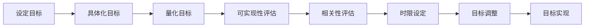
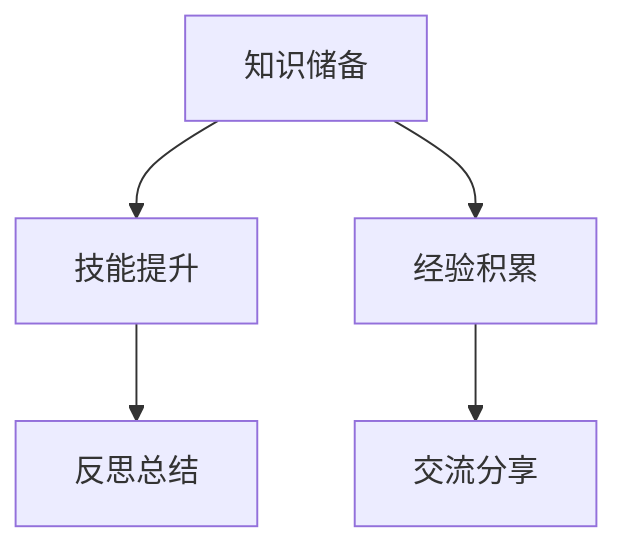
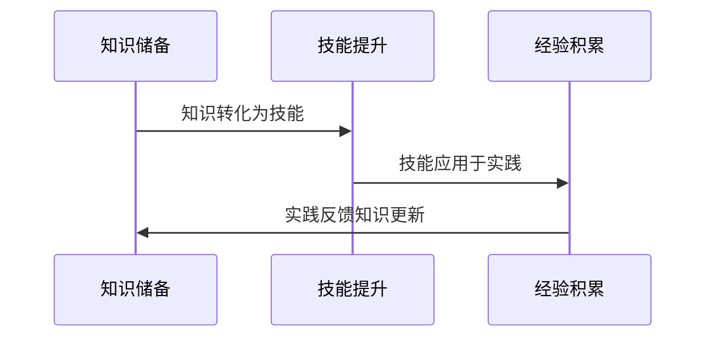

                 

# 成为内心的舵手：掌控人生方向的能力

> 关键词：人生方向、自我认知、目标设定、行动力、持续成长

> 摘要：本文将探讨如何在纷繁复杂的生活中找到自己的定位，成为自己人生的舵手。我们将从自我认知、目标设定、行动力、持续成长四个方面展开讨论，帮助读者逐步掌握人生方向的能力。

## 引言

在快速发展的现代社会中，人们面临着越来越多的选择和挑战。在这个充满变数的世界里，如何找到自己的位置，明确人生方向，成为了许多人关注的问题。本文旨在通过自我认知、目标设定、行动力和持续成长四个方面的探讨，帮助读者成为自己内心的舵手，掌控人生方向。

## 第1章 自我认知：探寻内心的声音

### 背景介绍
自我认知是了解自己、发现潜能、明确人生方向的基础。在这个信息爆炸的时代，我们需要静下心来，倾听内心的声音，找到真正适合自己的道路。

### 问题背景
很多人在成长过程中，受到外界环境的影响，往往迷失了自己。如何摆脱这种迷茫，找到内心的真实需求，成为我们面临的问题。

### 问题解决
通过自我反思、价值观梳理、兴趣爱好分析等方法，我们可以逐步了解自己，找到内心的声音。

### 边界与外延
自我认知不仅包括个人的兴趣爱好、能力特长，还包括性格特点、人生观、价值观等方面。

### 概念结构与核心要素组成
自我认知的核心要素包括：价值观、兴趣爱好、性格特点、人生目标等。

### 核心概念与联系
| 概念          | 属性特征           |
| ------------- | ----------------- |
| 价值观        | 对事物的判断标准   |
| 兴趣爱好      | 个人喜好           |
| 性格特点      | 个性表现           |
| 人生目标      | 人生追求           |

```mermaid
erDiagram
    目标 --> 价值观
    目标 --> 兴趣爱好
    目标 --> 性格特点
    价值观 ||--|| 兴趣爱好
    价值观 ||--|| 性格特点
    兴趣爱好 ||--|| 性格特点
```

## 第2章 目标设定：明确人生航向

### 背景介绍
目标设定是人生规划的重要环节，明确的目标能够指引我们前进的方向，激发我们的潜能。

### 问题背景
很多人在设定目标时，往往过于理想化，缺乏实际可操作性。如何设定合理的目标，成为我们面临的问题。

### 问题解决
通过SMART目标设定法则，我们可以将目标具体化、量化，提高目标的可实现性。

### 算法原理讲解
SMART目标设定法则包括：具体（Specific）、可衡量（Measurable）、可实现（Achievable）、相关（Relevant）、时限（Time-bound）。



```python
def set_smart_goal(goal):
    """
    设定SMART目标
    :param goal: 目标内容
    :return: SMART目标
    """
    specific = goal + "具体化描述"
    measurable = goal + "量化描述"
    achievable = goal + "可实现性评估"
    relevant = goal + "相关性评估"
    time_bound = goal + "时限设定"
    return {
        "具体": specific,
        "可衡量": measurable,
        "可实现": achievable,
        "相关": relevant,
        "时限": time_bound
    }

goal = "成为一名优秀的程序员"
smart_goal = set_smart_goal(goal)
print(smart_goal)
```

## 第3章 行动力：迈向成功的基石

### 背景介绍
行动力是实现目标的动力源泉，只有付诸实践，才能将梦想变成现实。

### 问题背景
很多人在实现目标的过程中，往往因为缺乏行动力而停滞不前。如何培养和提升行动力，成为我们面临的问题。

### 问题解决
通过制定计划、分解任务、克服拖延等方法，我们可以逐步提升自己的行动力。

### 算法原理讲解
行动力提升算法包括：计划制定、任务分解、执行力训练。


```python
def plan_and_action(goal):
    """
    制定计划并付诸行动
    :param goal: 目标内容
    :return: 行动计划
    """
    plan = "为实现" + goal + "，制定以下计划："
    tasks = ["学习相关技能", "参加相关培训", "实践项目经验"]
    for task in tasks:
        plan += task + "；"
    return plan

goal = "成为一名优秀的程序员"
action_plan = plan_and_action(goal)
print(action_plan)
```

## 第4章 持续成长：人生的不断追求

### 背景介绍
持续成长是人生的不竭动力，只有不断学习、提升自己，才能在竞争中立于不败之地。

### 问题背景
在竞争激烈的社会中，很多人因为停滞不前而逐渐被淘汰。如何保持持续成长，成为我们面临的问题。

### 问题解决
通过终身学习、不断反思、积极进取等方法，我们可以实现持续成长。

### 系统分析与架构设计方案
为了实现持续成长，我们需要建立一个完整的学习体系，包括以下几个方面：

1. **知识储备**：通过阅读书籍、参加培训、在线课程等方式，不断丰富自己的知识储备。
2. **技能提升**：通过实践项目、参与竞赛、团队合作等方式，提升自己的技能水平。
3. **经验积累**：通过反思总结、交流分享、求助他人等方式，积累宝贵的人生经验。

### 系统架构设计mermaid架构图



### 系统接口设计和系统交互mermaid序列图



## 第5章 项目实战：从理论到实践

### 环境安装
1. 安装Python环境
2. 安装相关依赖库（如numpy、matplotlib等）

### 系统核心实现源代码
```python
# 导入相关库
import numpy as np
import matplotlib.pyplot as plt

# 定义目标函数
def objective_function(x):
    return x**2

# 定义优化算法
def gradient_descent(x, learning_rate, epochs):
    for _ in range(epochs):
        gradient = 2 * x
        x -= learning_rate * gradient
    return x

# 实现算法
x = 0
learning_rate = 0.01
epochs = 1000
x_optimized = gradient_descent(x, learning_rate, epochs)

# 结果展示
print("Optimized x:", x_optimized)
plt.plot(x_optimized, objective_function(x_optimized), 'ro')
plt.show()
```

### 代码应用解读与分析
1. 目标函数：二次函数，表示优化问题的一个目标。
2. 优化算法：梯度下降算法，用于求解目标函数的最小值。
3. 算法原理：通过迭代计算梯度，更新参数，逐步逼近最优解。
4. 结果分析：通过可视化，展示了优化过程和最终结果。

### 实际案例分析和详细讲解剖析
1. 案例背景：优化一个二次函数的最小值。
2. 案例分析：通过梯度下降算法，逐步逼近最优解。
3. 讲解剖析：详细解释了算法原理和代码实现过程。

### 项目小结
1. 理论与实践相结合，加深了对算法原理的理解。
2. 提升了编程能力和实际问题解决能力。

## 最佳实践 tips

1. 坚持学习，不断提升自己的知识和技能。
2. 养成反思和总结的习惯，善于从经验中学习。
3. 保持积极进取的心态，勇于面对挑战。
4. 建立良好的学习体系，实现持续成长。

## 小结

本文从自我认知、目标设定、行动力和持续成长四个方面，探讨了如何成为自己人生的舵手。通过不断自我提升，明确人生方向，付诸实践，实现持续成长，我们可以更好地掌控自己的人生。

## 注意事项

1. 在人生道路上，需要不断调整和优化自己的方向。
2. 保持耐心和毅力，不断克服困难和挑战。

## 拓展阅读

1. 《深度学习》
2. 《影响力》
3. 《高效能人士的七个习惯》

## 作者信息

作者：AI天才研究院/AI Genius Institute & 禅与计算机程序设计艺术 /Zen And The Art of Computer Programming

---

本文旨在帮助读者成为自己人生的舵手，通过自我认知、目标设定、行动力和持续成长，掌控人生方向。希望本文能对您的个人成长有所帮助。在追求人生目标的过程中，不断反思、调整和优化，相信您一定能够找到属于自己的道路。祝愿您在人生的航行中一帆风顺！

