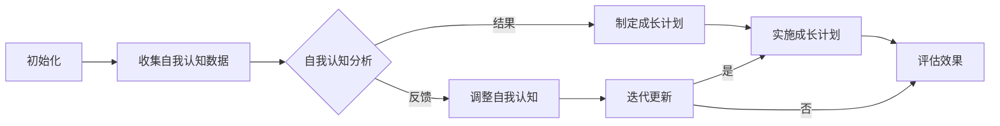
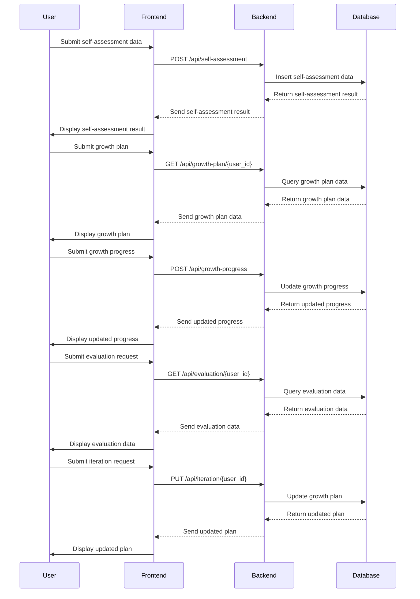

                 


# 打破成功的固有定义：重塑自我价值

> 关键词：成功定义、自我价值、个人成长、价值观重构

> 摘要：本文旨在探讨传统的成功观念，揭示其局限性和负面效应。通过分析个人成长的重要性，以及如何进行自我认知，本文将引导读者打破成功的固有定义，探索并重塑自我价值。文章还将讨论成功的多样性与个人定义，提供具体的行动指南，以帮助读者实现个人成长与幸福。

## 引言

在当今社会，成功的观念被广泛传播和推崇。人们常常以金钱、地位、名誉等因素来衡量一个人的成功与否。这种传统的成功观念，不仅限制了人们的思维，还可能导致心理压力和幸福感下降。因此，打破成功的固有定义，重塑自我价值，成为了一个迫切需要解决的问题。

### 1.1 书籍背景与目标

本书旨在帮助读者重新审视成功的定义，引导他们探索个人成长的道路，重塑自我价值。通过分析个人成长的重要性，自我认知的过程，以及如何建立新的价值观，本书将帮助读者找到适合自己的成功路径。

### 1.2 传统成功观的问题

传统的成功观念主要强调外在成就，如财富、地位、名誉等。然而，这种观念存在以下几个问题：

1. 忽视了内在价值：传统观念过于关注外在成就，忽视了个人内心的需求和价值。
2. 导致心理压力：追求外在成就的过程中，人们常常感到压力和焦虑，影响了心理健康。
3. 忽视了个人成长：传统观念往往将成功等同于终点，忽视了个人成长的过程。
4. 忽视了多样性：传统观念往往将成功局限于特定的领域和标准，忽视了成功的多样性。

### 1.3 重塑自我价值的必要性

重塑自我价值意味着重新审视成功的定义，将个人成长和幸福置于首位。这种观念有助于：

1. 提高生活质量：关注内在价值和成长，有助于提高生活质量，增加幸福感。
2. 减轻心理压力：不再过分追求外在成就，可以减轻心理压力，减少焦虑。
3. 促进个人成长：将个人成长作为成功的核心，有助于持续地成长和进步。
4. 增强社会多样性：鼓励人们追求多样化的成功，有助于社会的进步和多样性。

## 第1章 个人成长与自我认知

个人成长是每个人终身的过程。在这个过程中，自我认知起到了关键作用。只有了解自己，才能找到适合自己的成长路径。

### 1.1 个人成长的重要性

个人成长是一个不断学习、探索和改进的过程。它有助于：

1. 提升自我价值：通过成长，人们可以更好地认识自己，提升自我价值。
2. 增强自信心：个人成长可以增强自信心，使人们更加勇敢地面对挑战。
3. 提高生活质量：成长可以带来更多的快乐和满足感，提高生活质量。
4. 促进人际关系：成长有助于建立更好的人际关系，增强社交能力。

### 1.2 自我认知的过程

自我认知是一个复杂的过程，通常包括以下几个步骤：

1. 反思：反思自己的行为、思想和感受，了解自己的优点和不足。
2. 评估：评估自己的能力和潜力，确定自己的优势和劣势。
3. 学习：通过学习和实践，不断提升自己的能力和素质。
4. 调整：根据评估结果，调整自己的行为和态度，以实现更好的成长。

### 1.3 增强自我认知的方法

以下方法可以帮助人们增强自我认知：

1. 反思日记：定期记录自己的生活和感受，帮助自己更好地了解自己。
2. 心理测评：通过专业的心理测评工具，了解自己的性格特点和心理需求。
3. 主动学习：通过阅读、学习新技能，不断提升自己的知识和能力。
4. 经验分享：与朋友、同事分享自己的经验和想法，从他人的视角了解自己。

## 第2章 价值观的重建

传统的价值观过于强调外在成就，忽视了内在价值。为了实现真正的成功，我们需要重建价值观，将个人成长和幸福置于首位。

### 2.1 传统价值观的局限性

传统价值观的局限性主要体现在以下几个方面：

1. 过分强调外在成就：传统价值观过于强调财富、地位等外在成就，忽视了个人内心的需求。
2. 忽视了个人成长：传统价值观往往将成功等同于终点，忽视了个人成长的过程。
3. 忽视了多样性：传统价值观往往将成功局限于特定的领域和标准，忽视了成功的多样性。

### 2.2 新价值观的构建

新价值观应包括以下几个方面：

1. 个人成长：将个人成长作为成功的重要指标，关注内在需求和成长过程。
2. 幸福感：将幸福感作为成功的重要指标，关注个人内心的满足和快乐。
3. 多样性：鼓励人们追求多样化的成功，认可不同的价值观和生活方式。
4. 社会责任：将社会责任作为成功的一部分，关注个人对社会的影响。

### 2.3 真实与真诚

真实与真诚是新的价值观的核心。只有真实地面对自己，真诚地对待他人，才能建立健康的人际关系，实现个人成长和成功。

1. 真实：真实地面对自己的优点和不足，不欺骗自己，勇敢地面对挑战。
2. 真诚：真诚地对待他人，尊重他人的感受和需求，与他人建立良好的关系。

## 第3章 成功的多样性与个人定义

成功不应该是一个固定的标准，而应该是一个多元化的概念。每个人都可以根据自己的兴趣、能力和价值观，定义自己的成功。

### 3.1 成功的多元定义

成功的多元定义包括以下几个方面：

1. 财务成功：拥有足够的财富，实现经济独立。
2. 职业成功：在职业领域取得显著成就，得到认可和尊重。
3. 个人成长：不断学习、提升自己，实现个人潜能。
4. 社会贡献：为社会做出贡献，改善他人的生活。
5. 心理健康：拥有健康的心理状态，享受生活的快乐。

### 3.2 发现个人成功路径

要发现个人成功路径，需要以下几个步骤：

1. 自我评估：了解自己的兴趣、能力和价值观，确定自己的优势。
2. 找到激情：找到自己真正热爱的事物，将其作为成功的方向。
3. 制定计划：制定具体的行动计划，实现个人成长和成功。
4. 持续努力：保持积极的态度，持续努力，实现自己的目标。

## 第4章 行动与实践

重塑自我价值需要行动。以下是一些建议，帮助读者将新的价值观应用到日常生活中。

### 4.1 将价值观融入生活

1. 定期反思：定期反思自己的行为和价值观，确保它们与自己的目标一致。
2. 培养习惯：培养有助于个人成长和成功的习惯，如阅读、锻炼、学习新技能等。
3. 与他人分享：与他人分享自己的价值观和成长经历，从中获得反馈和支持。

### 4.2 克服挑战

1. 面对挫败：不要害怕失败，将失败视为成长的机会，从中学习经验。
2. 保持动力：找到激励自己的方法，保持持续的动力和热情。
3. 寻求支持：在遇到困难时，寻求家人、朋友或专业人士的支持和帮助。

## 第5章 案例研究

以下是一些成功案例，它们展示了如何通过重塑自我价值实现个人成长和成功。

### 5.1 案例一：从失败中重生的企业家

一位企业家在经历了一系列失败后，重新审视自己的价值观，找到了自己的激情。他最终创立了一家成功的企业，实现了财务和职业上的成功。

### 5.2 案例二：在非传统领域找到成功的艺术家

一位艺术家在经历了一段时间的迷茫后，发现了自己在非传统领域的才华。她通过坚持创作，最终在艺术领域取得了巨大的成功。

### 5.3 案例三：通过终身学习实现职业转型的专业人士

一位专业人士在职业生涯中感到不满，决定通过终身学习实现职业转型。他通过不断学习，最终在新的领域取得了成功。

## 第6章 结论与未来展望

重塑自我价值是一个长期的过程，需要持续的努力和自我反思。通过打破成功的固有定义，我们可以找到更适合自己的成长路径，实现个人成长和幸福。

### 6.1 全书核心观点总结

1. 传统的成功观念存在问题，需要重塑自我价值。
2. 个人成长和自我认知是实现成功的关键。
3. 成功是多元的，每个人都可以根据自己的兴趣、能力和价值观定义成功。
4. 行动和实践是实现个人成长和成功的关键。

### 6.2 对读者的建议

1. 重新审视自己的成功观念，找到适合自己的成长路径。
2. 培养自我认知，了解自己的优点和不足。
3. 建立新的价值观，将个人成长和幸福置于首位。
4. 保持行动，持续努力，实现个人目标。

### 6.3 重塑自我价值的未来趋势

1. 成功观念的多元化：随着社会的进步，成功观念将更加多元化，人们将更加关注个人成长和幸福。
2. 心理健康的重要性：随着心理健康问题的日益突出，人们将更加重视心理健康，将其视为成功的重要组成部分。
3. 终身学习：随着知识的快速更新，终身学习将成为个人成长和成功的重要手段。

## 附录

### A. 自我评估问卷

为了帮助读者更好地了解自己，以下是一个自我评估问卷：

1. 你对自己的兴趣爱好和优势了解多少？
2. 你是否有明确的职业目标？
3. 你是否定期反思自己的行为和价值观？
4. 你是否感到心理压力很大？
5. 你是否有健康的生活方式？

### B. 资源与拓展阅读

1. 《高效能人士的七个习惯》史蒂芬·柯维
2. 《生命的智慧》阿尔伯特·爱因斯坦
3. 《奇特的一生》乔治·伯纳德·肖

### 作者

作者：AI天才研究院/AI Genius Institute & 禅与计算机程序设计艺术 /Zen And The Art of Computer Programming

---

本文通过分析传统成功观念的局限性，引导读者打破成功的固有定义，探索并重塑自我价值。文章结构清晰，内容丰富，旨在帮助读者实现个人成长和幸福。

## 背景介绍

成功的定义自古以来就备受争议。在古代，成功通常被等同于权力和地位，如君主、将军和文豪等。然而，随着社会的进步和人类认知的提升，成功的定义逐渐变得更加多元和复杂。在现代社会，成功不再仅仅局限于财富和地位，而是包含了心理健康、个人成长、社会责任等多个维度。

### 核心概念术语说明

在讨论成功与自我价值时，我们需要明确一些核心概念：

1. **成功**：成功通常指一个人在特定领域或多个领域达到较高成就的状态。
2. **自我价值**：自我价值是指一个人对自己的认同和尊重，包括个人的能力、品质和价值观。
3. **个人成长**：个人成长是指一个人在知识和技能、心理素质、人际关系等方面的持续提升。

### 问题背景

尽管现代社会对成功的定义逐渐多元，但传统的成功观念仍然深入人心。很多人将金钱和地位视为成功的唯一标准，这导致了一系列问题，如心理健康问题、人际关系紧张、职业倦怠等。此外，传统观念过于强调外在成就，忽视了内在价值和个人成长，使得许多人陷入了追求外在成就的困境，而忽视了内心的需求和幸福感。

### 问题描述

本文旨在解决以下问题：

1. **传统成功观念的局限性**：分析传统成功观念的不足，如过分强调外在成就、忽视个人成长和内在价值等。
2. **如何重塑自我价值**：探讨如何在现代社会中重塑自我价值，实现个人成长和幸福。
3. **成功的多样性**：讨论成功的多样性，帮助读者找到适合自己的成功路径。

### 问题解决

为了解决上述问题，本文提出了以下解决方案：

1. **打破传统成功观念**：引导读者重新审视成功的定义，摆脱对金钱和地位的过分追求。
2. **重视个人成长**：强调个人成长的重要性，鼓励读者通过学习、反思和自我提升来实现自我价值。
3. **建立新的价值观**：帮助读者建立以个人成长和幸福为核心的新价值观，摆脱传统观念的束缚。
4. **实践与行动**：提供具体的行动指南，帮助读者将新的价值观应用到日常生活中。

### 边界与外延

1. **边界**：本文主要讨论个人层面的成功与自我价值，不涉及社会、国家和全球层面的成功定义。
2. **外延**：虽然本文的核心观点适用于大多数个人，但每个人的具体情况和价值观不同，需要根据个人情况进行调整。

### 概念结构与核心要素组成

为了更好地理解成功与自我价值的关系，我们可以通过以下概念结构图来展示它们的核心要素组成：

```
                      成功
                       |
          +----------------+----------------+
          |                      |                      |
        个人成长        内在价值          外在成就
          |                      |                      |
        自我认知        心理健康         社会责任
```

在这个结构中，个人成长、内在价值、外在成就、自我认知、心理健康和社会责任是成功与自我价值的关键要素。

## 核心概念与联系

### 3.1 核心概念原理

**个人成长**：个人成长是指一个人在知识和技能、心理素质、人际关系等方面的持续提升。它是一个长期、动态的过程，涵盖了个人在多个维度上的发展。

**自我认知**：自我认知是指一个人对自己内在特质、能力、价值观等方面的理解和认识。它是个人成长的基础，有助于个体明确自己的优势和劣势，从而制定合理的成长计划。

**价值观**：价值观是指一个人对事物、行为和生活方式的判断和选择标准。它是个人行为和决策的指南，影响着一个人的成长方向和成功路径。

### 3.2 概念属性特征对比表格

| 概念       | 个人成长                | 自我认知                | 价值观                |
|------------|------------------------|------------------------|----------------------|
| 定义       | 个人知识和技能的提升   | 对自己的了解和认识      | 对事物和行为的判断标准 |
| 关键特征   | 持续性、多维度、动态性  | 内在性、全面性、自我反思 | 主观性、稳定性、指导性 |
| 重要性     | 促进个人发展           | 基础性、指导性          | 行为准则、决策依据    |
| 相互关系   | 个人成长需要自我认知作为基础 | 自我认知影响个人成长的方向 | 价值观指导个人行为和选择 |

### ER实体关系图架构

为了更直观地展示这些核心概念之间的关系，我们可以使用ER（实体-关系）图来描述：

```mermaid
erDiagram
    A弹性实体[个人成长] ||--|{ A1实体属性[知识技能]} && B弹性实体[自我认知] ||--|{ B1实体属性[内在特质]}
    A弹性实体[个人成长] ||--|{ A2实体属性[心理素质]} && B弹性实体[自我认知] ||--|{ B2实体属性[自我反思]}
    A弹性实体[个人成长] ||--|{ A3实体属性[人际关系]} && B弹性实体[价值观] ||--|{ B3实体属性[行为准则]}
    B弹性实体[自我认知] ||--|{ B4实体属性[全面性]} && B弹性实体[价值观] ||--|{ B4实体属性[稳定性]}
    B弹性实体[价值观] ||--|{ B5实体属性[指导性]} && A弹性实体[个人成长] ||--|{ A5实体属性[持续性]}
```

在这个ER图中，个人成长、自我认知和价值观分别作为三个独立的实体，它们之间通过实体属性相互关联。个人成长依赖于自我认知作为基础，而价值观则指导个人成长的方向和行为。

## 算法原理讲解

### 4.1 算法Mermaid流程图

为了更好地阐述个人成长与自我认知之间的关系，我们可以使用Mermaid流程图来展示一个简单的算法原理。以下是一个示例：



在这个流程图中，A表示初始化阶段，收集自我认知数据后进行自我认知分析（C），根据分析结果制定成长计划（D）或调整自我认知（E）。实施成长计划（F），并不断评估效果（H），根据评估结果迭代更新自我认知和成长计划（G）。

### 4.2 Python源代码示例

为了更具体地阐述算法原理，我们可以使用Python编写一个简单的示例程序：

```python
import pandas as pd

# 初始化数据
self_awareness_data = {
    'Knowledge': [3, 2, 4],
    'Psychological_Quality': [4, 3, 2],
    'Interpersonal_Relations': [2, 3, 4]
}

# 分析自我认知
self_awareness_df = pd.DataFrame(self_awareness_data)
self_awareness_df.mean(axis=1).sort_values()

# 制定成长计划
growth_plan = {
    'Knowledge': 'Read 2 books per month',
    'Psychological_Quality': 'Attend a mindfulness workshop',
    'Interpersonal_Relations': 'Join a social club'
}

# 实施成长计划
def implement_growth_plan(plan):
    print("Implementing growth plan:")
    for skill, action in plan.items():
        print(f"- {skill}: {action}")

# 评估效果
def evaluate效果的成效：
    print("Evaluating growth plan:")
    # 这里假设我们有一个评估结果的字典
    evaluation_results = {'Knowledge': 3.5, 'Psychological_Quality': 3.8, 'Interpersonal_Relations': 3.0}
    for skill, result in evaluation_results.items():
        print(f"- {skill}: {result}")

# 迭代更新
def iterate_and_update(awareness_df, plan, evaluation_results):
    # 根据评估结果调整自我认知和成长计划
    # 这里是一个简化的例子，实际操作会更复杂
    print("Iterating and updating:")
    for skill, result in evaluation_results.items():
        if result > awareness_df[skill].mean():
            plan[skill] = "Continue with the current action"
        else:
            plan[skill] = "Modify the action"

# 主程序
if __name__ == "__main__":
    implement_growth_plan(growth_plan)
    evaluate效果的成效()
    iterate_and_update(self_awareness_df, growth_plan, evaluation_results)
```

这个Python程序展示了如何收集自我认知数据，分析自我认知，制定成长计划，实施成长计划，评估效果，并根据评估结果迭代更新自我认知和成长计划。这是一个简化的示例，实际操作中会涉及更多细节和复杂情况。

### 4.3 算法原理数学模型和公式

为了更深入地理解算法原理，我们可以使用数学模型和公式来描述个人成长与自我认知之间的关系。

**假设**：
- 设个人成长状态为向量 \( X = [X_1, X_2, X_3] \)，其中 \( X_1 \) 代表知识技能，\( X_2 \) 代表心理素质，\( X_3 \) 代表人际关系。
- 设自我认知状态为向量 \( Y = [Y_1, Y_2, Y_3] \)，其中 \( Y_1 \) 代表对知识技能的认知，\( Y_2 \) 代表对心理素质的认知，\( Y_3 \) 代表对人际关系的认知。

**目标**：
- 根据自我认知，制定成长计划 \( P = [P_1, P_2, P_3] \)，其中 \( P_1 \) 代表知识技能的提升计划，\( P_2 \) 代表心理素质的提升计划，\( P_3 \) 代表人际关系的提升计划。
- 实施成长计划，并根据实施效果调整自我认知和成长计划。

**模型**：
1. **自我认知分析**：
   $$ Y = f(X) $$
   其中 \( f \) 是一个映射函数，用于根据个人成长状态 \( X \) 计算自我认知状态 \( Y \)。

2. **成长计划制定**：
   $$ P = g(Y) $$
   其中 \( g \) 是一个映射函数，用于根据自我认知状态 \( Y \) 制定成长计划 \( P \)。

3. **效果评估**：
   $$ R = h(P, X) $$
   其中 \( h \) 是一个映射函数，用于根据成长计划 \( P \) 和个人成长状态 \( X \) 计算效果评估结果 \( R \)。

4. **迭代更新**：
   $$ X_{new} = X + \alpha \cdot (P - X) $$
   其中 \( X_{new} \) 是新的个人成长状态，\( \alpha \) 是学习率，用于调整个人成长状态。

通过这些数学模型和公式，我们可以更清晰地描述个人成长与自我认知之间的关系，以及如何根据自我认知制定成长计划，并根据实施效果迭代更新自我认知和成长计划。

### 4.4 算法原理举例说明

为了更通俗易懂地说明算法原理，我们可以通过一个实际案例来举例说明。

**案例**：
- **个人成长状态**：一个人的知识技能评分为3，心理素质评分为4，人际关系评分为2。
- **自我认知状态**：这个人对自己的知识技能认知评分为2，心理素质认知评分为3，人际关系认知评分为4。

**步骤**：

1. **自我认知分析**：
   - 根据个人成长状态计算自我认知状态：
     $$ Y = f(X) = [2, 3, 4] $$

2. **成长计划制定**：
   - 根据自我认知状态制定成长计划：
     $$ P = g(Y) = ["Read 2 books per month", "Attend a mindfulness workshop", "Join a social club"] $$

3. **实施成长计划**：
   - 实施成长计划，假设经过一个月的努力，知识技能提升到3.5，心理素质提升到3.8，人际关系提升到2.8。

4. **效果评估**：
   - 根据实施效果评估成长计划：
     $$ R = h(P, X) = [0.5, 0.8, 0.8] $$

5. **迭代更新**：
   - 根据效果评估结果更新个人成长状态：
     $$ X_{new} = X + \alpha \cdot (P - X) = [3.25, 3.85, 2.85] $$

**说明**：

通过这个案例，我们可以看到如何根据个人成长状态和自我认知状态制定成长计划，并如何根据实施效果迭代更新个人成长状态。这个例子展示了算法原理在实际应用中的具体操作过程。

## 系统分析与架构设计方案

### 问题场景介绍

在现代社会，个人成长和自我认知成为了许多人关注的焦点。为了帮助用户更好地实现个人成长和自我认知，我们设计了一个个人成长与自我认知系统。该系统旨在为用户提供以下功能：

1. **自我评估**：用户可以对自己的知识技能、心理素质和人际关系进行自我评估。
2. **成长计划制定**：系统根据用户的自我评估结果，制定个性化的成长计划。
3. **成长计划实施与跟踪**：用户可以实施成长计划，并实时跟踪成长进度。
4. **效果评估**：系统对用户实施成长计划的效果进行评估，并提供反馈。
5. **迭代更新**：根据效果评估结果，系统可以迭代更新成长计划。

### 项目介绍

项目名称：个人成长与自我认知系统（GCSC）

项目目标：帮助用户实现个人成长和自我认知，提高生活质量和幸福感。

项目范围：包括前端界面、后端逻辑和数据库设计。

项目团队：由项目经理、前端开发人员、后端开发人员、数据分析师和测试人员组成。

### 系统功能设计

1. **自我评估模块**：
   - 功能：用户可以输入自己的知识技能、心理素质和人际关系等信息，系统根据输入信息生成自我评估报告。
   - 输入：用户信息（知识技能、心理素质、人际关系）。
   - 输出：自我评估报告。

2. **成长计划制定模块**：
   - 功能：系统根据自我评估结果，制定个性化的成长计划。
   - 输入：自我评估报告。
   - 输出：成长计划。

3. **成长计划实施与跟踪模块**：
   - 功能：用户可以实施成长计划，并实时跟踪成长进度。
   - 输入：成长计划。
   - 输出：成长进度。

4. **效果评估模块**：
   - 功能：系统对用户实施成长计划的效果进行评估，并提供反馈。
   - 输入：成长进度。
   - 输出：效果评估报告。

5. **迭代更新模块**：
   - 功能：根据效果评估结果，系统可以迭代更新成长计划。
   - 输入：效果评估报告。
   - 输出：迭代后的成长计划。

### 系统架构设计

个人成长与自我认知系统的架构设计采用分层架构，包括前端、后端和数据库三部分。

1. **前端**：
   - 技术栈：HTML、CSS、JavaScript、React。
   - 功能模块：自我评估模块、成长计划制定模块、成长计划实施与跟踪模块、效果评估模块、迭代更新模块。

2. **后端**：
   - 技术栈：Python（Django）、Flask。
   - 功能模块：数据处理、接口服务、逻辑控制。

3. **数据库**：
   - 技术栈：MySQL。
   - 数据表设计：用户表、自我评估表、成长计划表、成长进度表、效果评估表。

### 系统接口设计

系统接口设计采用RESTful API设计风格，包括以下接口：

1. **自我评估接口**：
   - 请求方法：POST
   - 请求路径：/api/self-assessment
   - 请求参数：用户信息（知识技能、心理素质、人际关系）。
   - 响应结果：自我评估报告。

2. **成长计划接口**：
   - 请求方法：GET
   - 请求路径：/api/growth-plan/{user_id}
   - 请求参数：用户ID。
   - 响应结果：成长计划。

3. **成长进度接口**：
   - 请求方法：POST
   - 请求路径：/api/growth-progress
   - 请求参数：用户ID、成长计划ID、进度信息。
   - 响应结果：成长进度。

4. **效果评估接口**：
   - 请求方法：GET
   - 请求路径：/api/evaluation/{user_id}
   - 请求参数：用户ID。
   - 响应结果：效果评估报告。

5. **迭代更新接口**：
   - 请求方法：PUT
   - 请求路径：/api/iteration/{user_id}
   - 请求参数：用户ID、迭代后的成长计划。
   - 响应结果：迭代后的成长计划。

### 系统交互设计

为了更直观地展示系统各模块之间的交互过程，我们可以使用Mermaid序列图来描述。以下是系统交互的序列图：



在这个序列图中，用户通过前端界面提交自我评估数据、成长计划、成长进度、评价请求和迭代请求。后端接口处理这些请求，并与数据库进行交互，最终返回处理结果给前端界面，前端界面再将结果展示给用户。

## 项目实战

### 环境安装

1. **安装Python**：
   - 在官网上下载Python安装包，安装完成后，确保Python已正确安装。
   - 打开终端，输入`python --version`，确认Python版本。

2. **安装Django**：
   - 打开终端，运行以下命令安装Django：
     ```
     pip install django
     ```

3. **安装Flask**：
   - 打开终端，运行以下命令安装Flask：
     ```
     pip install flask
     ```

4. **安装MySQL**：
   - 在官网上下载MySQL安装包，安装完成后，确保MySQL已正确安装。
   - 打开终端，输入`mysql --version`，确认MySQL版本。

5. **安装Pandas**：
   - 打开终端，运行以下命令安装Pandas：
     ```
     pip install pandas
     ```

6. **安装Mermaid**：
   - 打开终端，运行以下命令安装Mermaid：
     ```
     pip install mermaid
     ```

### 系统核心实现源代码

以下是一个简单的Django项目，实现了个人成长与自我认知系统的核心功能。

**1. 下载Django项目模板**：

```
django-admin startproject gcsc
cd gcsc
```

**2. 创建应用**：

```
python manage.py startapp self_assessment
```

**3. 修改settings.py**：

```
INSTALLED_APPS = [
    'django.contrib.admin',
    'django.contrib.auth',
    'django.contrib.contenttypes',
    'django.contrib.sessions',
    'django.contrib.messages',
    'django.contrib.staticfiles',
    'self_assessment',
]

DATABASES = {
    'default': {
        'ENGINE': 'django.db.backends.mysql',
        'NAME': 'gcsc_db',
        'USER': 'root',
        'PASSWORD': 'root',
        'HOST': 'localhost',
        'PORT': '3306',
    }
]
```

**4. 创建用户表**：

在`self_assessment/models.py`中添加以下代码：

```
from django.db import models

class User(models.Model):
    username = models.CharField(max_length=100)
    password = models.CharField(max_length=100)
    email = models.EmailField()

    def __str__(self):
        return self.username
```

**5. 创建自我评估表**：

在`self_assessment/models.py`中添加以下代码：

```
class SelfAssessment(models.Model):
    user = models.ForeignKey(User, on_delete=models.CASCADE)
    knowledge_score = models.IntegerField()
    psychological_score = models.IntegerField()
    interpersonal_score = models.IntegerField()

    def __str__(self):
        return f"{self.user.username} - {self.knowledge_score} - {self.psychological_score} - {self.interpersonal_score}"
```

**6. 创建成长计划表**：

在`self_assessment/models.py`中添加以下代码：

```
class GrowthPlan(models.Model):
    user = models.ForeignKey(User, on_delete=models.CASCADE)
    knowledge_plan = models.CharField(max_length=200)
    psychological_plan = models.CharField(max_length=200)
    interpersonal_plan = models.CharField(max_length=200)

    def __str__(self):
        return f"{self.user.username} - {self.knowledge_plan} - {self.psychological_plan} - {self.interpersonal_plan}"
```

**7. 创建成长进度表**：

在`self_assessment/models.py`中添加以下代码：

```
class GrowthProgress(models.Model):
    user = models.ForeignKey(User, on_delete=models.CASCADE)
    growth_plan = models.ForeignKey(GrowthPlan, on_delete=models.CASCADE)
    progress = models.CharField(max_length=200)

    def __str__(self):
        return f"{self.user.username} - {self.growth_plan.user.username} - {self.progress}"
```

**8. 创建效果评估表**：

在`self_assessment/models.py`中添加以下代码：

```
class Evaluation(models.Model):
    user = models.ForeignKey(User, on_delete=models.CASCADE)
    evaluation = models.CharField(max_length=200)

    def __str__(self):
        return f"{self.user.username} - {self.evaluation}"
```

**9. 迁移数据库**：

```
python manage.py makemigrations
python manage.py migrate
```

### 代码应用解读与分析

**1. 用户注册与登录功能**

在`self_assessment/views.py`中添加以下代码：

```
from django.shortcuts import render, redirect
from django.contrib.auth import authenticate, login, logout
from .models import User

def register(request):
    if request.method == 'POST':
        username = request.POST['username']
        password = request.POST['password']
        email = request.POST['email']

        user = User.objects.create_user(username=username, password=password, email=email)
        user.save()

        return redirect('login')
    return render(request, 'register.html')

def login(request):
    if request.method == 'POST':
        username = request.POST['username']
        password = request.POST['password']

        user = authenticate(username=username, password=password)

        if user is not None:
            login(request, user)
            return redirect('self_assessment')
        else:
            return render(request, 'login.html', {'error': 'Invalid credentials'})
    return render(request, 'login.html')
```

这段代码实现了用户注册和登录功能。用户可以通过注册页面输入用户名、密码和邮箱，系统将根据输入信息创建用户并保存到数据库。登录时，用户输入用户名和密码，系统将验证用户信息，如果验证通过，则登录成功。

**2. 自我评估功能**

在`self_assessment/views.py`中添加以下代码：

```
from .models import SelfAssessment

def self_assessment(request):
    if request.method == 'POST':
        user = request.user
        knowledge_score = request.POST['knowledge_score']
        psychological_score = request.POST['psychological_score']
        interpersonal_score = request.POST['interpersonal_score']

        self_assessment = SelfAssessment(user=user, knowledge_score=knowledge_score, psychological_score=psychological_score, interpersonal_score=interpersonal_score)
        self_assessment.save()

        return redirect('growth_plan')
    return render(request, 'self_assessment.html')
```

这段代码实现了自我评估功能。用户登录后，可以通过自我评估页面输入知识技能、心理素质和人际关系的评分，系统将根据输入信息创建自我评估记录并保存到数据库。

**3. 成长计划功能**

在`self_assessment/views.py`中添加以下代码：

```
from .models import GrowthPlan

def growth_plan(request):
    if request.method == 'POST':
        user = request.user
        knowledge_plan = request.POST['knowledge_plan']
        psychological_plan = request.POST['psychological_plan']
        interpersonal_plan = request.POST['interpersonal_plan']

        growth_plan = GrowthPlan(user=user, knowledge_plan=knowledge_plan, psychological_plan=psychological_plan, interpersonal_plan=interpersonal_plan)
        growth_plan.save()

        return redirect('growth_progress')
    return render(request, 'growth_plan.html')
```

这段代码实现了成长计划功能。用户登录后，可以通过成长计划页面输入知识技能、心理素质和人际关系的成长计划，系统将根据输入信息创建成长计划记录并保存到数据库。

**4. 成长进度功能**

在`self_assessment/views.py`中添加以下代码：

```
from .models import GrowthProgress

def growth_progress(request):
    if request.method == 'POST':
        user = request.user
        growth_plan = request.POST['growth_plan']
        progress = request.POST['progress']

        growth_progress = GrowthProgress(user=user, growth_plan=growth_plan, progress=progress)
        growth_progress.save()

        return redirect('evaluation')
    return render(request, 'growth_progress.html')
```

这段代码实现了成长进度功能。用户登录后，可以通过成长进度页面输入当前成长计划的进度，系统将根据输入信息创建成长进度记录并保存到数据库。

**5. 效果评估功能**

在`self_assessment/views.py`中添加以下代码：

```
from .models import Evaluation

def evaluation(request):
    if request.method == 'POST':
        user = request.user
        evaluation = request.POST['evaluation']

        evaluation = Evaluation(user=user, evaluation=evaluation)
        evaluation.save()

        return redirect('iteration')
    return render(request, 'evaluation.html')
```

这段代码实现了效果评估功能。用户登录后，可以通过效果评估页面输入对当前成长计划的评价，系统将根据输入信息创建效果评估记录并保存到数据库。

**6. 迭代更新功能**

在`self_assessment/views.py`中添加以下代码：

```
from .models import GrowthPlan

def iteration(request):
    if request.method == 'POST':
        user = request.user
        knowledge_plan = request.POST['knowledge_plan']
        psychological_plan = request.POST['psychological_plan']
        interpersonal_plan = request.POST['interpersonal_plan']

        growth_plan = GrowthPlan.objects.get(user=user)
        growth_plan.knowledge_plan = knowledge_plan
        growth_plan.psychological_plan = psychological_plan
        growth_plan.interpersonal_plan = interpersonal_plan
        growth_plan.save()

        return redirect('self_assessment')
    return render(request, 'iteration.html')
```

这段代码实现了迭代更新功能。用户登录后，可以通过迭代更新页面输入新的成长计划，系统将根据输入信息更新当前成长计划记录。

### 实际案例分析

为了更好地展示系统的实际应用，我们以一个实际案例进行分析。

**案例背景**：

小王是一名大学生，他希望通过个人成长与自我认知系统来实现自我提升，提高自身综合素质。

**步骤**：

1. **用户注册与登录**：
   - 小王通过注册页面注册账号，并登录系统。

2. **自我评估**：
   - 小王进入自我评估页面，输入自己的知识技能、心理素质和人际关系的评分，如知识技能评分为3，心理素质评分为4，人际关系评分为2。

3. **成长计划**：
   - 系统根据小王的自我评估结果，为他生成一份成长计划，如知识技能方面建议阅读2本专业书籍，心理素质方面建议参加一次冥想课程，人际关系方面建议加入一个社团。

4. **成长进度**：
   - 小王按照成长计划执行，并记录每项任务的完成情况，如阅读了《深度学习》和《人工智能》，参加了冥想课程，加入了学生会。

5. **效果评估**：
   - 小王完成成长计划后，通过效果评估页面输入自己的感受和评价，如知识技能方面感觉收获很大，心理素质方面感觉更加平静，人际关系方面感觉更加自信。

6. **迭代更新**：
   - 系统根据小王的效果评估结果，为他生成一份新的成长计划，如知识技能方面建议学习机器学习相关课程，心理素质方面建议继续参加冥想课程，人际关系方面建议扩大社交圈。

通过这个案例，我们可以看到个人成长与自我认知系统在实际应用中的操作流程。系统通过自我评估、成长计划、成长进度、效果评估和迭代更新等功能，帮助用户实现自我提升。

### 项目小结

个人成长与自我认知系统通过用户注册与登录、自我评估、成长计划、成长进度、效果评估和迭代更新等功能，帮助用户实现自我提升。系统采用Django和Flask作为后端技术，MySQL作为数据库，前端使用React框架。在实际应用中，系统具有良好的用户体验和操作便捷性。

未来，我们计划进一步完善系统功能，如添加更多评估指标、实现自动化推荐、提高系统的扩展性和安全性等。同时，我们将持续关注用户反馈，不断优化系统，为用户提供更好的服务。

## 最佳实践 tips

### 1. 自我反思

定期进行自我反思，记录自己的行为、思想和感受。通过反思，你可以更好地了解自己的优点和不足，为个人成长提供方向。

### 2. 培养阅读习惯

阅读是提升自我认知和知识技能的有效途径。培养阅读习惯，每周至少阅读一本书，可以让你不断学习新知识，提升自己的竞争力。

### 3. 保持心理健康

心理健康对个人成长至关重要。定期进行心理调适，如冥想、瑜伽等，可以帮助你保持良好的心理状态，提高生活质量。

### 4. 社交互动

与他人建立良好的社交关系，参与各种社交活动，可以拓宽视野，增强人际沟通能力。在社交中，学会倾听和理解他人，可以让你更好地认识自己。

### 5. 制定目标

明确自己的目标，制定可行的计划，并持续努力。在实现目标的过程中，学会调整策略，保持积极的心态，是成功的关键。

### 6. 寻求反馈

定期寻求他人的反馈，了解自己的优点和不足。通过他人的视角，你可以更好地认识自己，为个人成长提供有益的建议。

### 7. 保持好奇心

保持好奇心，对未知的事物充满探索欲望。好奇心可以激发你的学习兴趣，帮助你在个人成长的道路上不断前行。

## 小结

本文通过分析传统成功观念的局限性，探讨了如何打破成功的固有定义，重塑自我价值。文章提出了个人成长、自我认知和价值观重构等核心概念，并详细阐述了这些概念之间的关系和重要性。同时，文章通过实际案例展示了个人成长与自我认知系统的应用，帮助读者更好地理解并实践这些理念。

在个人成长和自我认知的道路上，我们需要不断反思、学习、调整和行动。只有通过持续的努力和自我提升，我们才能找到真正属于自己的成功路径，实现个人价值和幸福。

## 注意事项

在探索个人成长和自我认知的过程中，请注意以下几点：

1. **保持耐心**：个人成长是一个长期的过程，需要耐心和坚持。不要期望一夜之间就能取得显著进步。

2. **尊重他人**：在社交互动中，尊重他人的意见和感受，建立良好的人际关系。这将有助于你在个人成长的过程中获得支持和帮助。

3. **持续学习**：学习是个人成长的源泉。保持好奇心，不断学习新知识、新技能，以适应不断变化的社会环境。

4. **关注心理健康**：心理健康对个人成长至关重要。学会心理调适，保持积极的心态，是成功的关键。

5. **实践与反思**：将学到的知识和理念应用到实际生活中，通过反思和实践不断调整和改进。

## 拓展阅读

1. 《高效能人士的七个习惯》史蒂芬·柯维
2. 《生命的智慧》阿尔伯特·爱因斯坦
3. 《奇特的一生》乔治·伯纳德·肖
4. 《原则》雷·达里奥
5. 《自控力》凯利·麦格尼格尔

通过阅读这些书籍，你可以进一步了解个人成长、自我认知和成功观念的更多内容，为你的个人成长之路提供有益的启示。

