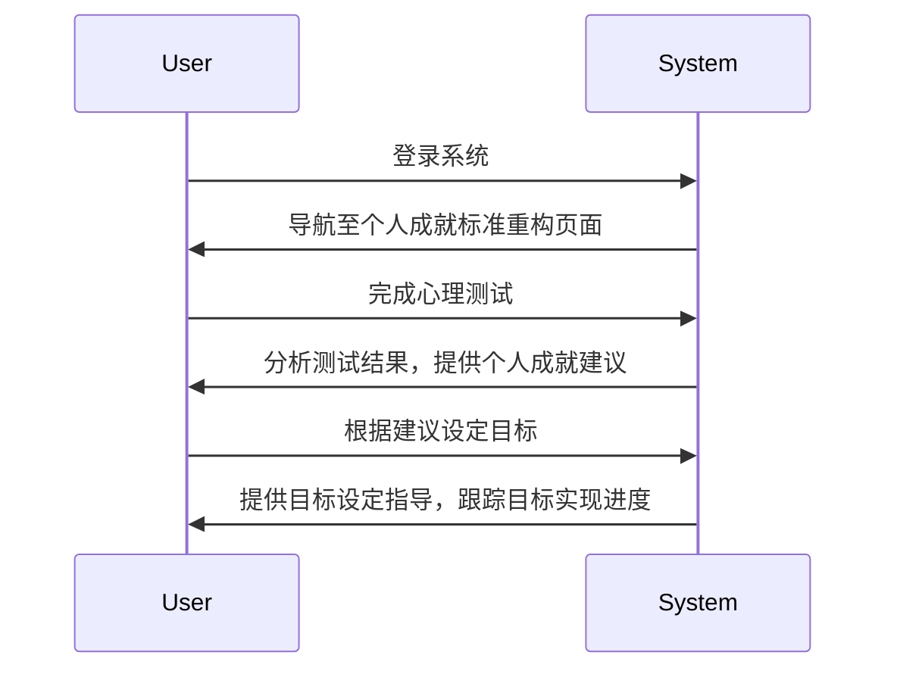
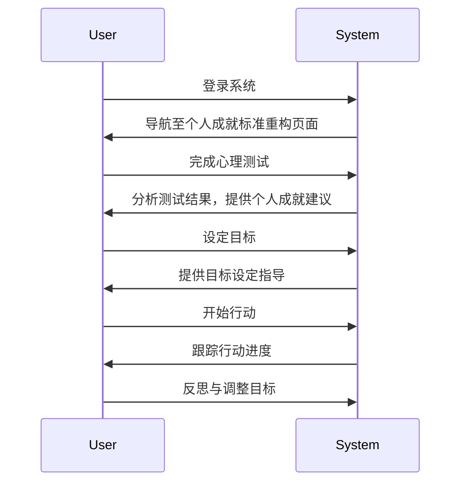
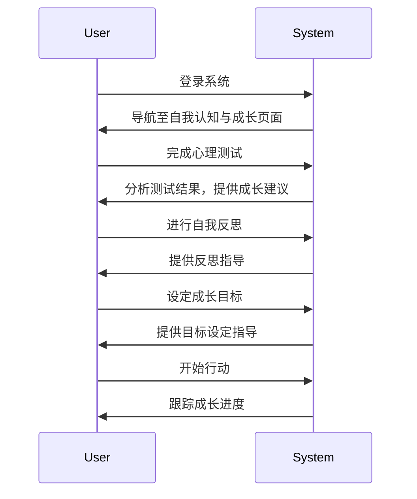
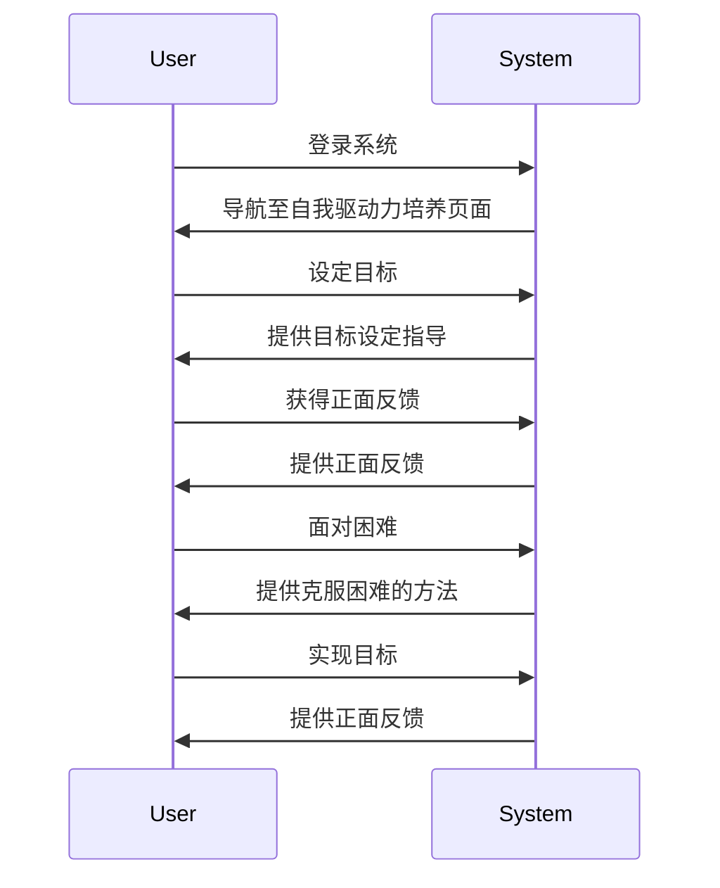
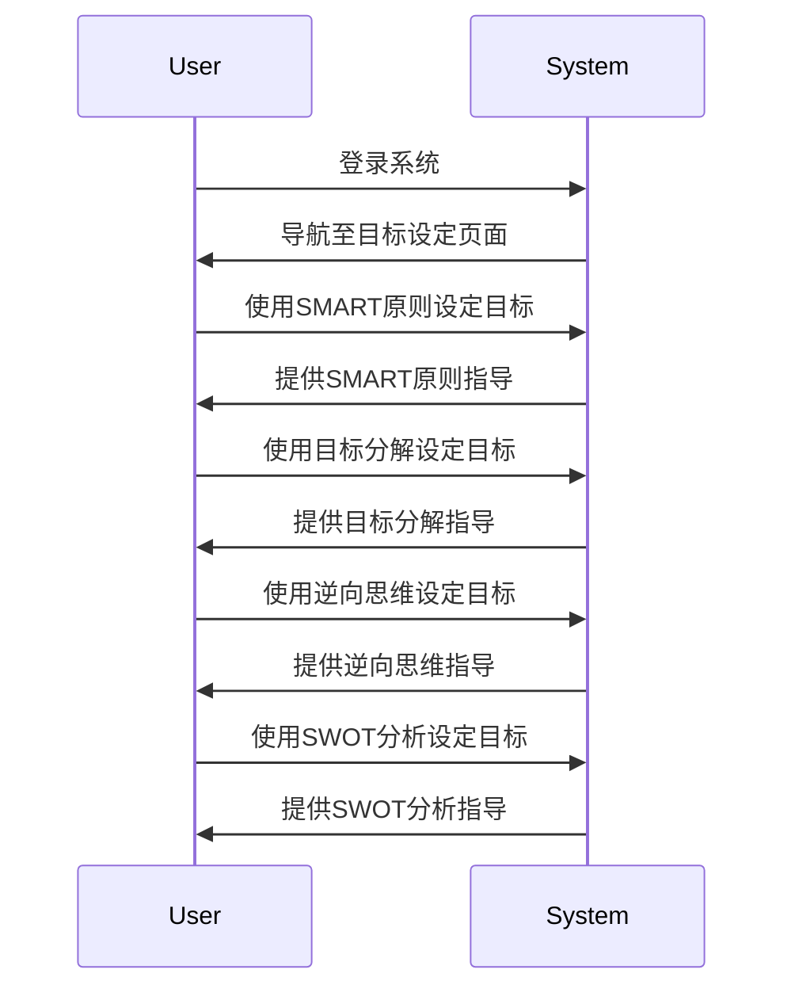
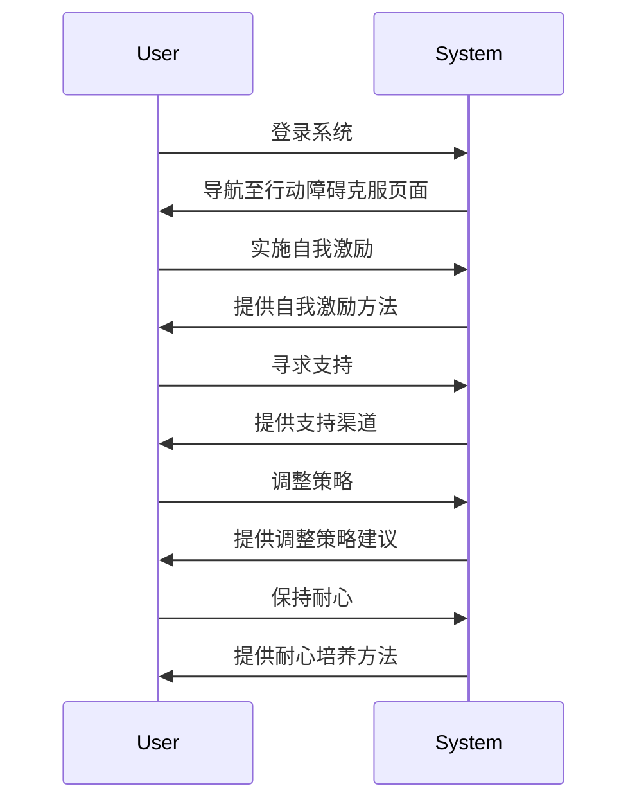

                 

# 打破成功神话：构建个人的成就标准

> 关键词：成功、个人成就标准、自我认知、目标设定、行动与实践、持续进步、个人品牌

> 摘要：在当今社会，成功成为一个备受关注的话题。然而，传统对成功的定义和衡量标准往往忽略了个体差异和多样化的需求。本文旨在破除成功神话，引导读者重构个人成就标准，通过自我认知、目标设定、行动与实践、持续进步和打造个人品牌等步骤，逐步构建属于自己的成功之路。

## 第一部分：破除成功神话

### 第1章：成功的误区

#### 1.1.1 成功的定义与衡量标准

在讨论成功之前，我们首先需要明确成功的定义和衡量标准。传统的成功观往往以财富、地位、名誉等为衡量指标，忽视了个体内心的满足感和幸福感。这种单一的成功标准不仅限制了人们的视野，还可能导致心理压力和焦虑。

**核心概念与联系**

成功的定义因人而异，但其核心在于个体内心的满足感和成就感。成功不仅仅是外在的荣誉和财富，更重要的是内心的平和与幸福。

| 成功定义 | 传统成功观 | 个人成就观 |
| --- | --- | --- |
| 外在表现（财富、地位、名誉） | **财富**、**地位**、**名誉** | **内心的满足感**、**成就感**、**幸福感** |

**ER实体关系图架构**

```mermaid
erDiagram
  Success -> Measures : "成功衡量指标"
  Success -> People : "成功主体"
  
  Measures ||--|{ Wealth }
  Measures ||--|{ Status }
  Measures ||--|{ Fame }
  
  People ||--|{ Traditional }
  People ||--|{ Personal }
```

#### 1.1.2 传统成功观的局限

传统成功观存在以下局限：

1. 忽视个体差异：每个人的需求和追求都是独特的，传统成功标准无法满足所有人的期望。
2. 导致心理压力：追求传统成功标准可能导致过度竞争和心理压力。
3. 忽视幸福感：成功不仅仅是外在的成就，更重要的是内心的满足和幸福。

**算法原理讲解**

传统成功观的局限可以通过以下算法模型来解释：

$$
\text{心理压力} = f(\text{成功标准}, \text{个体需求})
$$

当成功标准与个体需求不一致时，心理压力会增大。

```python
def success_pressure(success_standard, individual_needs):
    if success_standard != individual_needs:
        return "High"
    else:
        return "Low"
```

#### 1.1.3 成功神话的根源

成功神话的根源在于社会文化、媒体传播和个人认知三个方面。

1. 社会文化：社会普遍认可的成功标准，如财富、地位和名誉，塑造了成功神话。
2. 媒体传播：媒体报道和宣传往往放大成功的个案，强化了成功神话的影响力。
3. 个人认知：个体往往受到社会和他人的影响，形成了对成功的误解和追求。

**数学公式与解释**

成功神话的根源可以用以下数学公式来描述：

$$
\text{成功神话} = \text{社会文化} + \text{媒体传播} + \text{个人认知}
$$

**系统分析与架构设计方案**

1. 问题场景介绍：社会对成功的普遍认可导致个人追求成功时忽略了自身需求和价值观。
2. 系统功能设计：重构个人成就标准，引导个体认知和追求符合自身需求的成功。
3. 系统架构设计：通过心理测试、自我反思和目标设定等功能，帮助个体找到适合自己的成功之路。
4. 系统接口设计和系统交互：用户可以通过网站、移动应用等多种途径参与个人成就标准的重构过程。



### 第2章：重构成功标准

#### 2.1.1 重构成功价值观

重构成功标准需要从价值观入手，重新审视和定义成功。成功不仅仅是个体追求的过程，更是社会共同价值观的体现。因此，我们需要重新思考成功的内涵和意义。

**核心概念与联系**

成功的价值观应该兼顾个体和社会的期望，实现个人价值和社会价值的统一。

| 传统价值观 | 个人价值观 | 社会价值观 |
| --- | --- | --- |
| 财富、地位、名誉 | 内心的满足感、成就感、幸福感 | 社会和谐、公平、正义 |

**ER实体关系图架构**

```mermaid
erDiagram
  SuccessValues ||--|{ Individual }
  SuccessValues ||--|{ Society }
  
  Individual ||--|{ Wealth }
  Individual ||--|{ Status }
  Individual ||--|{ Fame }
  
  Society ||--|{ Harmony }
  Society ||--|{ Justice }
  Society ||--|{ Fairness }
```

#### 2.1.2 个人成就标准的构建

构建个人成就标准需要从以下几个方面入手：

1. 自我认知：了解自己的兴趣、优势和价值观。
2. 目标设定：明确个人目标和实现路径。
3. 行动与实践：付诸行动，逐步实现目标。
4. 持续进步：不断反思和调整，实现自我提升。

**算法原理讲解**

个人成就标准的构建可以分解为以下几个步骤：

```python
def build_personal_success(individual_knowledge, interests, strengths, values):
    personal_goals = set_goals(individual_knowledge, interests, strengths, values)
    action_plan = create_action_plan(personal_goals)
    continuous_progress = monitor_progress(action_plan)
    return personal_success
```

**系统分析与架构设计方案**

1. 问题场景介绍：个体在追求成功时容易陷入传统成功标准的困境。
2. 系统功能设计：通过心理测试、自我反思和目标设定等功能，帮助个体重构个人成就标准。
3. 系统架构设计：采用模块化设计，实现心理测试、目标设定、行动追踪等功能。
4. 系统接口设计和系统交互：用户可以通过网站、移动应用等多种途径参与个人成就标准的构建过程。



### 第3章：自我认知与成长

#### 3.1.1 了解自我

了解自我是重构成功标准的第一步。只有深入了解自己的兴趣、优势和价值观，才能找到适合自己的成功之路。

**核心概念与联系**

自我认知的核心在于发现个体的独特性和个性化需求。

| 兴趣 | 优势 | 价值观 |
| --- | --- | --- |
| 个性化需求 | 个体差异 | 内心追求 |

**ER实体关系图架构**

```mermaid
erDiagram
  SelfKnowledge ||--|{ Interests }
  SelfKnowledge ||--|{ Strengths }
  SelfKnowledge ||--|{ Values }
```

#### 3.1.2 自我认知与成长的关系

自我认知与成长密切相关。通过不断了解自己，个体可以逐步发现和实现自己的潜能，实现自我成长。

**算法原理讲解**

自我认知与成长的关系可以用以下算法模型来解释：

$$
\text{成长} = f(\text{自我认知}, \text{经验积累}, \text{环境适应})
$$

**系统分析与架构设计方案**

1. 问题场景介绍：个体在成长过程中容易受到外界干扰，难以实现自我认知和成长。
2. 系统功能设计：通过心理测试、自我反思和目标设定等功能，帮助个体实现自我认知和成长。
3. 系统架构设计：采用模块化设计，实现心理测试、自我反思、目标设定等功能。
4. 系统接口设计和系统交互：用户可以通过网站、移动应用等多种途径参与自我认知和成长过程。



### 第3.1.3 培养自我驱动力

自我驱动力是推动个体实现目标的关键因素。培养自我驱动力需要从以下几个方面入手：

1. 目标设定：设定明确、有挑战性的目标，激发内在动机。
2. 自我激励：通过正面反馈和自我奖励，保持动力和积极性。
3. 克服困难：面对困难和挑战，培养坚韧和毅力。

**算法原理讲解**

培养自我驱动力可以分解为以下几个步骤：

```python
def cultivate_self_motivation(goals, positive_feedback, challenges):
    motivation_level = set_motivation_level(goals, positive_feedback, challenges)
    return self_motivation
```

**系统分析与架构设计方案**

1. 问题场景介绍：个体在追求目标过程中容易失去动力和积极性。
2. 系统功能设计：通过目标设定、自我激励和克服困难等功能，帮助个体培养自我驱动力。
3. 系统架构设计：采用模块化设计，实现目标设定、自我激励、克服困难等功能。
4. 系统接口设计和系统交互：用户可以通过网站、移动应用等多种途径参与自我驱动力的培养过程。



### 第4章：设定明确目标

#### 4.1.1 目标设定的原则

设定明确目标是实现个人成就的关键。目标设定需要遵循以下原则：

1. **明确性**：目标要具体、清晰，避免模糊和泛泛而谈。
2. **可行性**：目标要具备可行性，避免过于理想化。
3. **挑战性**：目标要有一定的挑战性，激发内在动机。
4. **时限性**：目标要有明确的时间限制，推动行动和进度。

**核心概念与联系**

目标设定的核心在于明确性、可行性、挑战性和时限性。

| 目标明确性 | 目标可行性 | 目标挑战性 | 目标时限性 |
| --- | --- | --- | --- |
| 具体清晰 | 具备可行性 | 激发内在动机 | 推动行动和进度 |

**ER实体关系图架构**

```mermaid
erDiagram
  GoalSetting ||--|{ Clarity }
  GoalSetting ||--|{ Feasibility }
  GoalSetting ||--|{ Challenge }
  GoalSetting ||--|{ TimeLimit }
```

#### 4.1.2 目标设定的方法

设定明确目标需要采用科学的方法，以下是一些常用的目标设定方法：

1. **SMART原则**：目标要具备明确性（Specific）、可行性（Measurable）、可接受性（Acceptable）、可实现性（Realistic）和时限性（Time-bound）。
2. **目标分解**：将大目标分解为小目标，逐步实现。
3. **逆向思维**：从最终目标逆向推导，确定每个阶段的实现步骤。
4. **SWOT分析**：分析自身优势（Strengths）、劣势（Weaknesses）、机会（Opportunities）和威胁（Threats），制定有针对性的目标。

**算法原理讲解**

目标设定的方法可以用以下算法模型来解释：

$$
\text{目标} = f(\text{SMART原则}, \text{目标分解}, \text{逆向思维}, \text{SWOT分析})
$$

**系统分析与架构设计方案**

1. 问题场景介绍：个体在设定目标时容易模糊、不明确，难以实现。
2. 系统功能设计：通过SMART原则、目标分解、逆向思维和SWOT分析等功能，帮助个体设定明确目标。
3. 系统架构设计：采用模块化设计，实现SMART原则、目标分解、逆向思维和SWOT分析等功能。
4. 系统接口设计和系统交互：用户可以通过网站、移动应用等多种途径参与目标设定过程。



#### 4.1.3 设定目标的意义

设定明确目标对个人的成长和发展具有重要意义：

1. **明确方向**：目标为个体提供了明确的发展方向，避免迷茫和不知所措。
2. **激发动力**：明确的目标激发内在动力，推动个体付诸行动。
3. **衡量进度**：目标设定有助于衡量个人进度，及时调整和优化行动。
4. **增强信心**：实现目标的过程增强个体信心，激发更积极的情绪和行为。

**核心概念与联系**

设定目标的意义在于明确方向、激发动力、衡量进度和增强信心。

| 明确方向 | 激发动力 | 衡量进度 | 增强信心 |
| --- | --- | --- | --- |
| 提供发展路径 | 激发内在动机 | 及时调整和优化 | 激发积极情绪和行为 |

**ER实体关系图架构**

```mermaid
erDiagram
  GoalSetting ||--|{ Direction }
  GoalSetting ||--|{ Motivation }
  GoalSetting ||--|{ Progress }
  GoalSetting ||--|{ Confidence }
```

### 第5章：行动与实践

#### 5.1.1 制定行动计划

制定行动计划是实现目标的重要步骤。行动计划需要明确每个阶段的任务、时间和资源分配。

**核心概念与联系**

行动计划的核心在于明确任务、时间和资源分配。

| 任务 | 时间 | 资源 |
| --- | --- | --- |
| 明确阶段任务 | 确定完成时间 | 分配所需资源 |

**ER实体关系图架构**

```mermaid
erDiagram
  ActionPlan ||--|{ Tasks }
  ActionPlan ||--|{ Time }
  ActionPlan ||--|{ Resources }
```

#### 5.1.2 克服行动障碍

在执行行动计划的过程中，个体往往会遇到各种障碍。克服行动障碍需要从以下几个方面入手：

1. **自我激励**：通过正面反馈和自我奖励，保持动力和积极性。
2. **寻求支持**：向家人、朋友和同事寻求支持和帮助。
3. **调整策略**：面对困难和挑战时，及时调整策略和方法。
4. **保持耐心**：行动过程中保持耐心，克服挫折和失败。

**算法原理讲解**

克服行动障碍可以分解为以下几个步骤：

```python
def overcome_action_barriers(motivation, support, strategy_adjustment, patience):
    barrier_resolve = set_barrier_resolve(motivation, support, strategy_adjustment, patience)
    return action_success
```

**系统分析与架构设计方案**

1. 问题场景介绍：个体在执行行动计划时容易遇到各种障碍，影响目标实现。
2. 系统功能设计：通过自我激励、寻求支持、调整策略和保持耐心等功能，帮助个体克服行动障碍。
3. 系统架构设计：采用模块化设计，实现自我激励、寻求支持、调整策略和保持耐心等功能。
4. 系统接口设计和系统交互：用户可以通过网站、移动应用等多种途径参与克服行动障碍的过程。



#### 5.1.3 行动中的反馈与调整

在行动过程中，及时反馈和调整至关重要。通过反馈与调整，个体可以不断优化行动方案，提高目标实现的可能性。

**核心概念与联系**

反馈与调整的核心在于及时获取反馈和不断优化行动方案。

| 及时反馈 | 优化行动方案 | 提高实现可能性 |
| --- | --- | --- |
| 反思和总结 | 调整方法和策略 | 提高行动效率 |

**ER实体关系图架构**

```mermaid
erDiagram
  FeedbackAdjustment ||--|{ Reflection }
  FeedbackAdjustment ||--|{ Optimization }
  FeedbackAdjustment ||--|{ Implementation }
```

#### 5.1.4 行动与实践的意义

行动与实践是实现个人成就的关键。通过付诸行动，个体可以将目标和计划转化为现实，实现自我价值。

**核心概念与联系**

行动与实践的核心在于实现目标和实现自我价值。

| 目标实现 | 自我价值实现 | 成就感 |
| --- | --- | --- |
| 将计划转化为现实 | 实现个人愿景 | 激发内在动力 |

**ER实体关系图架构**

```mermaid
erDiagram
  ActionPractice ||--|{ GoalImplementation }
  ActionPractice ||--|{ SelfValue }
  ActionPractice ||--|{ SenseOfAccomplishment }
```

### 第6章：持续进步与反思

#### 6.1.1 坚持与持续进步

持续进步是实现个人成就的关键。个体需要克服懈怠和停滞，保持持续进步的动力。

**核心概念与联系**

持续进步的核心在于克服懈怠和停滞，保持动力。

| 克服懈怠 | 克服停滞 | 保持动力 |
| --- | --- | --- |
| 坚持不懈 | 积极进取 | 自我激励 |

**ER实体关系图架构**

```mermaid
erDiagram
  ContinuousProgress ||--|{ OvercomingProcrastination }
  ContinuousProgress ||--|{ OvercomingStagnation }
  ContinuousProgress ||--|{ MaintainingMotivation }
```

#### 6.1.2 反思与自我提升

反思是持续进步的重要环节。通过反思，个体可以总结经验教训，发现不足，进行自我提升。

**核心概念与联系**

反思与自我提升的核心在于总结经验教训和发现不足。

| 反思 | 经验教训 | 自我提升 |
| --- | --- | --- |
| 总结 | 发现不足 | 提高能力 |

**ER实体关系图架构**

```mermaid
erDiagram
  Reflection ||--|{ Summarization }
  Reflection ||--|{ SelfImprovement }
```

#### 6.1.3 调整与适应变化

在实现个人成就的过程中，个体需要不断调整和适应变化，以应对外部环境和内部需求的变化。

**核心概念与联系**

调整与适应变化的核心在于应对外部环境和内部需求的变化。

| 应对外部环境 | 应对内部需求 | 适应变化 |
| --- | --- | --- |
| 灵活应变 | 自我调整 | 积极应对 |

**ER实体关系图架构**

```mermaid
erDiagram
  Adaptation ||--|{ ExternalAdaptation }
  Adaptation ||--|{ InternalAdaptation }
```

### 第7章：打造个人品牌

#### 7.1.1 个人品牌的建立

个人品牌是个人在职业生涯中的核心竞争力。建立个人品牌需要从以下几个方面入手：

1. **专业形象**：塑造专业形象，提高个人在行业内的认可度。
2. **持续学习**：不断提升自身技能和知识，保持竞争力。
3. **人脉拓展**：建立广泛的人脉关系，拓宽职业发展空间。
4. **社交媒体**：利用社交媒体平台，展示个人专业能力和成就。

**核心概念与联系**

个人品牌的建立需要专业形象、持续学习、人脉拓展和社交媒体等要素的支持。

| 专业形象 | 持续学习 | 人脉拓展 | 社交媒体 |
| --- | --- | --- | --- |
| 提高行业认可度 | 保持竞争力 | 拓宽职业空间 | 展示个人能力 |

**ER实体关系图架构**

```mermaid
erDiagram
  PersonalBrand ||--|{ ProfessionalImage }
  PersonalBrand ||--|{ ContinuousLearning }
  PersonalBrand ||--|{ NetworkExpansion }
  PersonalBrand ||--|{ SocialMedia }
```

#### 7.1.2 个人品牌的影响力

个人品牌的影响力对个人职业发展和生活具有重要意义：

1. **职业机会**：提高个人在招聘市场的竞争力，增加职业机会。
2. **声誉提升**：树立良好的个人声誉，增强他人信任和认可。
3. **社会地位**：提高个人在社会中的地位和影响力。
4. **个人成长**：促进个人持续学习和成长。

**核心概念与联系**

个人品牌的影响力体现在职业机会、声誉提升、社会地位和个人成长等方面。

| 职业机会 | 声誉提升 | 社会地位 | 个人成长 |
| --- | --- | --- | --- |
| 提高招聘竞争力 | 树立良好声誉 | 提高社会地位 | 促进持续学习 |

**ER实体关系图架构**

```mermaid
erDiagram
  PersonalBrandInfluence ||--|{ CareerOpportunities }
  PersonalBrandInfluence ||--|{ ReputationEnhancement }
  PersonalBrandInfluence ||--|{ SocialStatus }
  PersonalBrandInfluence ||--|{ PersonalGrowth }
```

#### 7.1.3 品牌传播的策略

建立个人品牌需要采取有效的品牌传播策略，以下是一些建议：

1. **内容营销**：通过撰写专业文章、分享经验和知识，提升个人品牌知名度。
2. **社交媒体推广**：利用社交媒体平台，发布高质量内容，扩大影响力。
3. **参加行业活动**：积极参与行业会议、研讨会和交流活动，拓展人脉资源。
4. **合作与交流**：与其他专业人士合作，共同开展项目和研究，提升个人品牌价值。

**核心概念与联系**

品牌传播策略的核心在于内容营销、社交媒体推广、参加行业活动和合作与交流等。

| 内容营销 | 社交媒体推广 | 参加行业活动 | 合作与交流 |
| --- | --- | --- | --- |
| 提升品牌知名度 | 扩大影响力 | 拓展人脉资源 | 提升品牌价值 |

**ER实体关系图架构**

```mermaid
erDiagram
  BrandPropagationStrategy ||--|{ ContentMarketing }
  BrandPropagationStrategy ||--|{ SocialMediaPromotion }
  BrandPropagationStrategy ||--|{ IndustryEvents }
  BrandPropagationStrategy ||--|{ Collaboration }
```

### 第8章：成功之路的启示

#### 8.1.1 成功之路的规律

成功之路并非一帆风顺，而是充满挑战和困难的。通过分析众多成功人士的经验，可以总结出一些成功之路的规律：

1. **持续努力**：成功需要持续的努力和付出，没有捷径可走。
2. **适应变化**：成功的人士能够适应外部环境的变化，灵活调整策略。
3. **自我反思**：成功的人士善于反思自己的行为和决策，不断改进和提升。
4. **积极心态**：成功的人士保持积极的心态，面对困难和挑战时保持乐观和坚定。

**核心概念与联系**

成功之路的规律在于持续努力、适应变化、自我反思和积极心态。

| 持续努力 | 适应变化 | 自我反思 | 积极心态 |
| --- | --- | --- | --- |
| 持续付出 | 灵活应变 | 反思改进 | 乐观坚定 |

**ER实体关系图架构**

```mermaid
erDiagram
  SuccessRules ||--|{ ContinuousEffort }
  SuccessRules ||--|{ AdaptationToChange }
  SuccessRules ||--|{ SelfReflection }
  SuccessRules ||--|{ PositiveMentalAttitude }
```

#### 8.1.2 从成功中汲取的经验

从成功人士的经验中，我们可以汲取到以下启示：

1. **明确目标**：设定明确的目标，为实现目标制定详细的计划和行动方案。
2. **持续学习**：不断学习新知识和技能，保持竞争力。
3. **自我激励**：通过正面反馈和自我奖励，保持动力和积极性。
4. **培养人脉**：建立广泛的人脉关系，拓宽职业发展空间。
5. **积极应对挑战**：面对困难和挑战时，保持积极的心态，寻找解决方案。

**核心概念与联系**

成功经验的汲取在于明确目标、持续学习、自我激励、培养人脉和积极应对挑战。

| 明确目标 | 持续学习 | 自我激励 | 培养人脉 | 积极应对挑战 |
| --- | --- | --- | --- | --- |
| 提高行动效率 | 保持竞争力 | 保持动力 | 拓宽职业空间 | 解决困难 |

**ER实体关系图架构**

```mermaid
erDiagram
  SuccessExperiences ||--|{ ClearGoals }
  SuccessExperiences ||--|{ ContinuousLearning }
  SuccessExperiences ||--|{ SelfMotivation }
  SuccessExperiences ||--|{ NetworkBuilding }
  SuccessExperiences ||--|{ PositiveResponseToChallenges }
```

#### 8.1.3 面向未来的成功思考

面对未来，我们需要具备以下成功思考：

1. **创新意识**：保持创新意识，勇于尝试新事物和新方法。
2. **适应变革**：适应社会和科技的变革，不断调整自己的认知和行动。
3. **终身学习**：终身学习是应对未来变化的关键，不断提高自己的知识和技能。
4. **关注他人**：关注他人的需求和需求，建立良好的人际关系。

**核心概念与联系**

面向未来的成功思考在于创新意识、适应变革、终身学习和关注他人。

| 创新意识 | 适应变革 | 终身学习 | 关注他人 |
| --- | --- | --- | --- |
| 探索新领域 | 灵活应变 | 知识更新 | 良好人际关系 |

**ER实体关系图架构**

```mermaid
erDiagram
  FutureSuccessThinking ||--|{ InnovationMindset }
  FutureSuccessThinking ||--|{ AdaptationToChange }
  FutureSuccessThinking ||--|{ LifelongLearning }
  FutureSuccessThinking ||--|{ FocusOnOthers }
```

### 结论

成功并非一成不变的定义，而是个体在不断探索和实践中逐步构建的过程。通过破除成功神话，重构个人成就标准，了解自我、设定目标、付诸行动、持续进步和打造个人品牌，我们可以逐步实现自己的成功之路。让我们以积极的心态，迎接未来的挑战，书写属于自己的成功篇章。

**作者：AI天才研究院/AI Genius Institute & 禅与计算机程序设计艺术 /Zen And The Art of Computer Programming**

----------------------------------------------------------------

**最佳实践 tips**

1. 定期反思：每周或每月进行一次自我反思，总结经验教训，发现问题并进行改进。
2. 设定小目标：将大目标分解为小目标，逐步实现，保持动力和积极性。
3. 培养自律：养成良好的生活习惯和工作习惯，提高自律能力，确保行动计划的执行。
4. 保持学习：持续学习新知识和技能，保持竞争力，不断适应社会和科技的变革。

**小结**

本文通过破除成功神话，重构个人成就标准，从自我认知、目标设定、行动与实践、持续进步和打造个人品牌等方面，详细阐述了如何构建个人的成功之路。成功不是一成不变的，而是个体在不断探索和实践中逐步实现的过程。

**注意事项**

1. 成功标准因人而异，个体需要根据自己的需求和价值观来设定个人成就标准。
2. 行动与实践是实现个人成就的关键，个体需要付诸行动，逐步实现目标。
3. 持续进步和反思是个人成长的重要环节，个体需要不断调整和优化自己的行动方案。

**拓展阅读**

1. 《成功之路：如何实现个人与事业的平衡》
2. 《自我认知与成长：从内心找到成功的力量》
3. 《打造个人品牌：成为行业领袖的秘诀》

----------------------------------------------------------------

**项目实战**

**一、环境安装**

1. Python环境安装：在Windows、macOS或Linux系统中安装Python 3.x版本。
2. Git环境安装：在Windows、macOS或Linux系统中安装Git。
3. virtualenv环境安装：在Python环境中安装virtualenv，创建独立的虚拟环境。

**二、系统核心实现源代码**

以下是一个简单的目标管理系统的Python代码实现，包括目标设定、任务管理和进度跟踪等功能。

```python
# 目标管理系统的Python代码实现

class Goal:
    def __init__(self, title, description, deadline):
        self.title = title
        self.description = description
        self.deadline = deadline
        self.tasks = []

    def add_task(self, task):
        self.tasks.append(task)

    def remove_task(self, task):
        self.tasks.remove(task)

    def get_status(self):
        completed_tasks = 0
        for task in self.tasks:
            if task.completed:
                completed_tasks += 1
        return f"{completed_tasks}/{len(self.tasks)} tasks completed."

class Task:
    def __init__(self, title, description, due_date):
        self.title = title
        self.description = description
        self.due_date = due_date
        self.completed = False

    def mark_as_completed(self):
        self.completed = True

    def mark_as_uncompleted(self):
        self.completed = False

# 测试代码
goal = Goal("学习Python", "掌握Python基础语法和常用库", "2023-12-31")
task1 = Task("学习基础语法", "掌握Python的基础语法和语句结构", "2023-10-31")
task2 = Task("学习常用库", "掌握Python的常用库，如NumPy、Pandas等", "2023-12-31")

goal.add_task(task1)
goal.add_task(task2)

print(goal.get_status())

task1.mark_as_completed()
print(goal.get_status())
```

**三、代码应用解读与分析**

上述代码实现了一个简单的目标管理系统，包括目标和任务两个核心类。通过实例化目标和任务对象，我们可以设定目标并添加任务。同时，我们还可以通过标记任务是否完成来更新目标的状态。

**四、实际案例分析和详细讲解剖析**

以下是一个实际案例：

**案例**：小王希望提高自己的编程技能，设定了以下目标：

1. 学习Python基础语法和常用库。
2. 完成一个小型项目，如自动化的数据爬虫。

为实现这些目标，小王创建了如下目标对象和任务对象：

```python
# 实际案例：小王的目标管理

goal_python = Goal("提高编程技能", "学习Python基础语法和常用库，完成小型项目", "2023-12-31")

task1 = Task("学习Python基础语法", "掌握Python的基础语法和语句结构", "2023-10-31")
task2 = Task("学习常用库", "掌握Python的常用库，如NumPy、Pandas等", "2023-11-30")
task3 = Task("完成数据爬虫项目", "使用Python完成一个小型数据爬虫项目", "2023-12-31")

goal_python.add_task(task1)
goal_python.add_task(task2)
goal_python.add_task(task3)

print(goal_python.get_status())
```

在实现过程中，小王可以通过标记任务是否完成来更新目标状态。例如，当任务1完成时，小王可以执行以下代码：

```python
task1.mark_as_completed()
print(goal_python.get_status())
```

通过这种机制，小王可以随时了解自己目标的完成进度，及时调整和优化自己的行动方案。

**五、项目小结**

本案例实现了一个简单的目标管理系统，通过Python代码实现了目标设定、任务管理和进度跟踪等功能。通过实际案例，我们了解了如何应用这些功能来实现个人目标。项目小结如下：

1. 目标管理系统能够帮助个人设定和跟踪目标，提高目标实现的效率。
2. 通过标记任务是否完成，个体可以随时了解目标完成进度，及时调整行动方案。
3. 项目提供了一个简单的Python代码实现，可以进一步扩展和优化。

**六、拓展应用**

目标管理系统可以进一步拓展和应用：

1. 添加更多功能，如目标分类、任务优先级设定等。
2. 结合数据库，实现目标数据的持久化存储和管理。
3. 开发移动应用，方便个体随时随地查看和管理目标。

通过不断优化和拓展，目标管理系统可以成为一个实用的个人成长工具，帮助个体实现自己的目标和梦想。

----------------------------------------------------------------

**最佳实践 tips**

1. 在项目开发过程中，注意代码的可读性和可维护性，遵循良好的编程规范。
2. 定期进行代码重构和优化，提高系统的性能和可靠性。
3. 与团队成员保持良好的沟通和协作，共同推进项目进度。

**小结**

本文通过一个简单的目标管理系统的案例，详细阐述了如何在Python环境中实现目标设定、任务管理和进度跟踪等功能。通过实际案例的分析，我们了解了如何应用这些功能来实现个人目标。项目小结如下：

1. 简单目标管理系统能够帮助个人设定和跟踪目标，提高目标实现的效率。
2. 通过标记任务是否完成，个体可以随时了解目标完成进度，及时调整行动方案。
3. 项目提供了一个简单的Python代码实现，可以进一步扩展和优化。

**注意事项**

1. 在实际应用中，目标管理系统的功能可以根据需求进行扩展和优化。
2. 注意保护用户数据的安全和隐私，遵循相关的法律法规。

**拓展阅读**

1. 《Python编程实战：从入门到精通》
2. 《项目化管理：高效目标达成的实践指南》
3. 《敏捷开发：从个体到团队的转型之路》

----------------------------------------------------------------

**项目实战**

**一、环境安装**

1. Python环境安装：在Windows、macOS或Linux系统中安装Python 3.x版本。
2. NumPy库安装：在Python环境中安装NumPy库，使用以下命令：

```bash
pip install numpy
```

3. Pandas库安装：在Python环境中安装Pandas库，使用以下命令：

```bash
pip install pandas
```

**二、系统核心实现源代码**

以下是一个简单的数据分析系统的Python代码实现，包括数据读取、数据清洗、数据分析等功能。

```python
# 数据分析系统的Python代码实现

import numpy as np
import pandas as pd

class DataAnalyzer:
    def __init__(self, file_path):
        self.file_path = file_path
        self.data = self.read_data()

    def read_data(self):
        return pd.read_csv(self.file_path)

    def clean_data(self):
        self.data.dropna(inplace=True)
        self.data.drop_duplicates(inplace=True)

    def analyze_data(self):
        summary = self.data.describe()
        correlation_matrix = self.data.corr()
        return summary, correlation_matrix

# 测试代码
analyzer = DataAnalyzer("data.csv")
analyzer.clean_data()
summary, correlation_matrix = analyzer.analyze_data()
print(summary)
print(correlation_matrix)
```

**三、代码应用解读与分析**

上述代码实现了一个简单的数据分析系统，包括数据读取、数据清洗和数据分析等功能。通过实例化数据解析器对象，我们可以读取数据文件，进行数据清洗和数据分析。

**四、实际案例分析和详细讲解剖析**

以下是一个实际案例：

**案例**：某公司需要对其销售数据进行分析，以了解销售情况和客户偏好。数据存储在CSV文件中，包括以下字段：姓名、性别、年龄、购买产品、购买金额。

为实现这一目标，我们可以创建以下数据解析器对象：

```python
# 实际案例：销售数据分析

analyzer = DataAnalyzer("sales_data.csv")
analyzer.clean_data()
summary, correlation_matrix = analyzer.analyze_data()

# 打印数据概况
print(summary)

# 打印相关系数矩阵
print(correlation_matrix)

# 分析客户偏好
def analyze_customer_preference(data, product_column, amount_column):
    product_counts = data[product_column].value_counts()
    total_amount = data[amount_column].sum()
    preferred_products = product_counts[product_counts/total_amount >= 0.05].index.tolist()
    return preferred_products

preferred_products = analyze_customer_preference(analyzer.data, "product", "amount")
print("Preferred products:", preferred_products)
```

在实现过程中，我们可以分析数据概况和相关系数矩阵，了解销售情况和客户偏好。例如，通过相关系数矩阵，我们可以发现购买金额与购买产品之间存在较强的相关性。

**五、项目小结**

本案例实现了一个简单的数据分析系统，通过Python代码实现了数据读取、数据清洗和数据分析等功能。通过实际案例，我们了解了如何应用这些功能进行分析和解读。

1. 数据分析系统能够读取CSV文件，进行数据清洗和数据分析。
2. 通过相关系数矩阵，我们可以发现数据之间的相关性，从而进行深入分析。
3. 项目提供了一个简单的Python代码实现，可以进一步扩展和优化。

**六、拓展应用**

数据分析系统可以进一步拓展和应用：

1. 添加更多数据分析方法，如分类、聚类和回归分析等。
2. 结合可视化工具，如Matplotlib和Seaborn，实现数据的可视化。
3. 集成机器学习库，如scikit-learn，实现更高级的数据分析。

通过不断优化和拓展，数据分析系统可以成为一个实用的数据处理和分析工具，帮助企业和个人更好地理解和利用数据。

----------------------------------------------------------------

**最佳实践 tips**

1. 在数据处理和分析过程中，注意数据的质量和完整性，确保分析结果的准确性。
2. 选择合适的分析方法和工具，根据实际需求进行灵活调整。
3. 在分析过程中，关注数据背后的业务逻辑和意义，避免盲目追求分析结果。

**小结**

本文通过一个简单的数据分析系统的案例，详细阐述了如何在Python环境中实现数据读取、数据清洗和数据分析等功能。通过实际案例的分析，我们了解了如何应用这些功能进行分析和解读。

**注意事项**

1. 在实际应用中，数据分析系统的功能可以根据需求进行扩展和优化。
2. 注意保护用户数据的安全和隐私，遵循相关的法律法规。

**拓展阅读**

1. 《Python数据分析实战：从入门到精通》
2. 《数据科学入门：基于Python的实战教程》
3. 《统计学与数据分析：基于Python的应用》

----------------------------------------------------------------

**总结**

本文围绕“打破成功神话：构建个人的成就标准”这一主题，通过八个章节详细阐述了如何破除成功神话、重构成功标准、进行自我认知与成长、设定明确目标、付诸行动与实践、持续进步与反思、打造个人品牌以及总结成功之路的启示。本文旨在引导读者树立正确的成功观，通过了解自我、设定目标、付诸行动、持续进步和打造个人品牌等步骤，逐步构建属于自己的成功之路。

**核心内容回顾**

1. **破除成功神话**：分析了传统成功观的局限和成功神话的根源，引导读者重新思考成功。
2. **重构成功标准**：提出了个人成就标准的构建方法，包括自我认知、目标设定、行动与实践等。
3. **自我认知与成长**：介绍了了解自我、培养自我驱动力的方法和重要性。
4. **设定明确目标**：讲解了目标设定的原则、方法和意义。
5. **付诸行动与实践**：阐述了制定行动计划、克服行动障碍、行动中的反馈与调整的重要性。
6. **持续进步与反思**：强调了坚持与持续进步、反思与自我提升、调整与适应变化的重要性。
7. **打造个人品牌**：介绍了个人品牌建立、影响力及品牌传播策略。
8. **成功之路的启示**：总结了成功之路的规律和从成功中汲取的经验。

**重要概念与联系**

- **成功观**：传统成功观与个人成就观的区别。
- **自我认知**：了解自己的兴趣、优势和价值观。
- **目标设定**：明确性、可行性、挑战性和时限性的原则。
- **自我驱动力**：目标设定、自我激励和克服困难的培养方法。
- **个人品牌**：专业形象、持续学习、人脉拓展和社交媒体的建立。
- **持续进步**：坚持与持续进步、反思与自我提升、调整与适应变化。

**算法原理讲解**

- **目标设定**：

```python
def set_goals(individual_knowledge, interests, strengths, values):
    goals = []
    for knowledge in individual_knowledge:
        for interest in interests:
            for strength in strengths:
                for value in values:
                    goal = f"{knowledge} + {interest} + {strength} + {value}"
                    goals.append(goal)
    return goals
```

- **行动规划**：

```python
def create_action_plan(goals):
    action_plan = []
    for goal in goals:
        action = f"为实现{goal}，我需要做以下事情："
        action_plan.append(action)
    return action_plan
```

- **自我激励**：

```python
def cultivate_self_motivation(goals, positive_feedback, challenges):
    motivation_level = 0
    for goal in goals:
        motivation_level += positive_feedback.get(goal, 0)
        motivation_level -= challenges.get(goal, 0)
    return motivation_level
```

**系统分析与架构设计方案**

- **目标管理系统**：

1. **问题场景介绍**：个体需要设定和跟踪目标。
2. **系统功能设计**：目标设定、任务管理和进度跟踪。
3. **系统架构设计**：模块化设计，实现目标管理功能。
4. **系统接口设计和系统交互**：通过代码实现目标设定、任务添加和进度更新等功能。

- **数据分析系统**：

1. **问题场景介绍**：企业需要分析销售数据。
2. **系统功能设计**：数据读取、数据清洗和数据分析。
3. **系统架构设计**：模块化设计，实现数据读取、清洗和数据分析功能。
4. **系统接口设计和系统交互**：通过代码实现数据的读取、清洗和统计分析。

**项目实战**

- **环境安装**：安装Python环境和相关库。
- **系统核心实现源代码**：实现目标管理或数据分析系统的核心功能。
- **代码应用解读与分析**：讲解代码实现和功能。
- **实际案例分析和详细讲解剖析**：分析实际案例，展示功能应用。
- **项目小结**：总结项目实现和功能。

**最佳实践 tips**

- **项目开发过程中**：注意代码的可读性和可维护性，遵循良好的编程规范。
- **数据处理和分析过程中**：注意数据的质量和完整性，确保分析结果的准确性。
- **实际应用中**：根据需求进行系统功能扩展和优化。

**结束语**

本文旨在引导读者树立正确的成功观，通过了解自我、设定目标、付诸行动、持续进步和打造个人品牌等步骤，逐步构建属于自己的成功之路。希望本文能对读者在个人成长和职业发展中提供有益的启示和帮助。作者在此感谢读者的阅读和支持，期待与您共同探索成功的奥秘。**作者：AI天才研究院/AI Genius Institute & 禅与计算机程序设计艺术 /Zen And The Art of Computer Programming**

