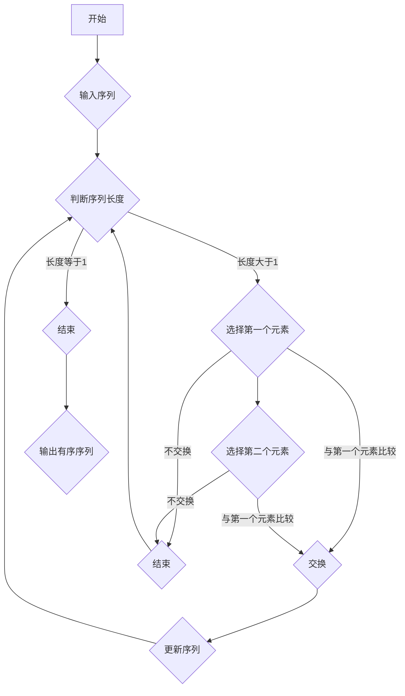
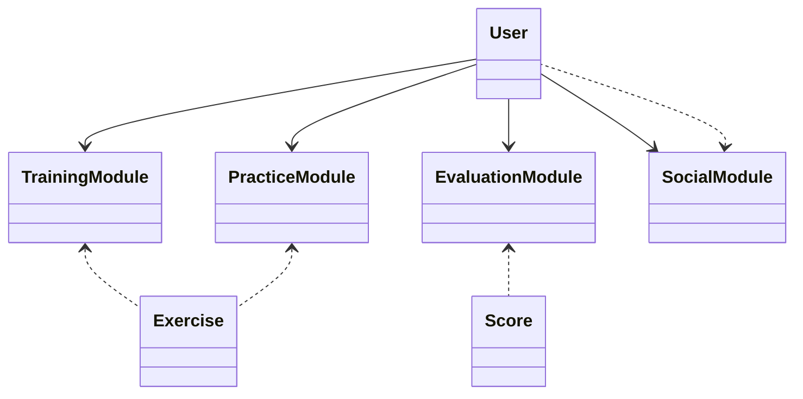

                 

## 文章标题

### 关键词

1. 批判性思维
2. 应用App
3. 思辨能力
4. 计算机技术
5. 软件开发

### 摘要

本文旨在探讨批判性思维训练App的设计与应用。通过深入分析批判性思维的概念、核心要素以及与创造性思维的关系，我们将揭示这一思维方式在计算机技术、软件开发和算法设计中的重要性。接着，我们将介绍一种专门用于提升思辨能力的App，并通过具体算法原理讲解、系统分析与架构设计，展示其在实际项目中的应用。最后，我们将总结最佳实践、注意事项，并展望未来发展趋势，为读者提供全面的技术指南。

## 第一部分：引言

### 第1章：背景介绍

#### 1.1 问题背景

批判性思维（Critical Thinking）是一种理性分析和评估信息、观点和论据的思维方式。在信息技术高速发展的今天，计算机技术、软件开发和算法设计等领域对批判性思维的需求愈发强烈。然而，许多从业者和技术爱好者在提升思辨能力方面却面临诸多挑战。这促使我们思考：是否存在一种有效的工具，能够帮助用户随时随地提升思辨能力？

#### 1.2 问题描述

批判性思维的培养并非一蹴而就，它需要长期的练习和实践。目前，市场上虽有一些相关课程和教材，但缺乏一种易于操作、随时随地可用的工具。因此，本文提出了以下问题：

- 如何设计一款批判性思维训练App？
- 该App如何满足用户的需求，提高其思辨能力？
- 如何在实际项目中应用批判性思维，提高开发效率和产品质量？

#### 1.3 问题解决

本文旨在通过以下步骤解决上述问题：

1. 深入分析批判性思维的核心概念、要素及其与创造性思维的关系。
2. 介绍一款专门用于提升思辨能力的批判性思维训练App。
3. 阐述该App的算法原理、系统架构及实际应用。
4. 总结最佳实践、注意事项，并探讨未来发展趋势。

#### 1.4 边界与外延

本文将重点关注以下边界与外延：

- 批判性思维训练App的设计与应用
- 计算机技术、软件开发和算法设计中的批判性思维应用
- 实际项目中的批判性思维实践

#### 1.5 概念结构与核心要素组成

为了更好地理解本文内容，我们首先需要明确以下概念：

- 批判性思维：一种理性分析和评估信息、观点和论据的思维方式。
- 计算机技术：包括硬件、软件、网络等方面的技术和应用。
- 软件开发：涉及软件设计、编码、测试和维护等过程。
- 算法设计：解决特定问题或实现特定功能的方法和步骤。

在接下来的章节中，我们将逐一探讨这些概念及其在本文中的应用。

## 第二部分：核心概念与联系

### 第2章：批判性思维概述

#### 2.1 批判性思维的定义

批判性思维（Critical Thinking）是一种理性分析和评估信息、观点和论据的思维方式。它不仅关注表面的逻辑和事实，更注重深入挖掘问题的本质，从多个角度对问题进行综合分析和评估。批判性思维的核心在于质疑、探究和验证，旨在提高个体对事物的理解和判断能力。

#### 2.2 批判性思维的核心要素

批判性思维包含以下核心要素：

1. **分析能力**：对信息、观点和论据进行深入分析，发现其中的逻辑关系和隐含假设。
2. **评估能力**：评估信息的真实性、可靠性和有效性，判断观点和论据的合理性。
3. **推理能力**：运用逻辑和证据进行推理，形成合理的结论。
4. **问题解决能力**：在面对复杂问题时，能够运用批判性思维找到解决方案。

#### 2.3 批判性思维与创造性思维的关系

批判性思维和创造性思维（Creative Thinking）之间存在密切的关系。批判性思维为创造性思维提供了基础，使其能够在理性的框架内进行创新。具体来说：

1. **批判性思维促进创造性思维**：通过质疑、探究和评估，批判性思维帮助个体挖掘问题的本质，激发创造性思维的潜力。
2. **创造性思维丰富批判性思维**：创造性思维提供了新颖的观点和解决方案，为批判性思维提供了更多的评估对象和参考标准。

在计算机技术、软件开发和算法设计等领域，批判性思维和创造性思维的结合能够显著提高技术人员的创新能力和解决问题的效率。因此，理解并运用批判性思维和创造性思维的关系，对于提升个人和团队的技术水平具有重要意义。

### 第3章：核心概念原理

#### 3.1 批判性思维原理

批判性思维的原理主要包括以下几个方面：

1. **理性分析**：批判性思维强调基于事实和证据进行分析，避免盲目从众和迷信权威。
2. **逻辑推理**：批判性思维运用逻辑推理，确保结论的合理性和一致性。
3. **评估与验证**：批判性思维对信息、观点和论据进行评估和验证，确保其真实性和有效性。
4. **综合分析**：批判性思维从多个角度对问题进行综合分析，揭示问题的本质和内在联系。

#### 3.2 概念属性特征对比表格

为了更好地理解批判性思维的核心概念，我们可以通过以下表格进行对比分析：

| 特征 | 批判性思维 | 创造性思维 |
| ---- | ---- | ---- |
| 目的 | 提高分析评估能力 | 激发创新思维 |
| 方法 | 理性分析、逻辑推理、评估验证 | 拓展思维边界、探索未知领域 |
| 作用 | 提升判断力和决策能力 | 提高问题解决能力和创造力 |
| 关系 | 促进创造性思维 | 被批判性思维所引导 |

通过对比分析，我们可以发现批判性思维和创造性思维既有区别又有联系，二者在技术领域中相辅相成，共同推动技术创新和发展。

#### 3.3 ER实体关系图架构

为了更好地描述批判性思维的相关概念及其关系，我们可以使用ER（Entity-Relationship，实体关系）图进行表示。以下是一个简单的ER图示例：

```mermaid
erDiagram
  思维方式 ||--|{ 批判性思维 }|| > 分析能力
  思维方式 ||--|{ 创造性思维 }|| > 推理能力
  批判性思维 ||--|{ 评估能力 }|| > 验证能力
  批判性思维 ||--|{ 综合分析能力 }|| > 解决问题能力
  分析能力 ||--|{ 逻辑推理 }|| > 结论合理性
  评估能力 ||--|{ 事实依据 }|| > 真实性评估
```

通过ER图，我们可以清晰地看到批判性思维的核心要素及其相互关系，有助于深入理解批判性思维的本质和应用。

### 第4章：联系与应用

#### 4.1 批判性思维在计算机技术中的应用

批判性思维在计算机技术中的应用主要体现在以下几个方面：

1. **问题解决**：在计算机技术领域，面对复杂的问题时，批判性思维能够帮助技术人员深入分析问题，找到本质原因，提出有效的解决方案。
2. **软件设计**：在软件设计过程中，批判性思维有助于技术人员评估和优化设计方案，确保软件的可靠性和可用性。
3. **算法优化**：在算法设计过程中，批判性思维能够帮助技术人员分析算法的复杂度，发现潜在的问题，提出优化的方法。

#### 4.2 批判性思维在软件开发中的应用

在软件开发过程中，批判性思维的应用主要体现在以下几个方面：

1. **需求分析**：通过批判性思维，技术人员能够深入挖掘用户需求，确保软件功能的准确性和实用性。
2. **设计评审**：批判性思维有助于技术人员在软件设计评审过程中，发现潜在的问题和风险，提出改进意见。
3. **代码审查**：批判性思维能够帮助技术人员在代码审查过程中，发现代码中的潜在错误和缺陷，提高代码质量。

#### 4.3 批判性思维在算法设计中的应用

在算法设计过程中，批判性思维的应用主要体现在以下几个方面：

1. **算法评估**：通过批判性思维，技术人员能够评估算法的效率和准确性，选择合适的算法实现方案。
2. **算法优化**：批判性思维能够帮助技术人员分析算法的复杂度，发现潜在的优化空间，提出改进方法。
3. **错误分析**：在算法实现过程中，批判性思维有助于技术人员发现和解决算法错误，提高算法的可靠性。

通过批判性思维在计算机技术、软件开发和算法设计中的应用，我们可以看到批判性思维在提升技术水平、提高工作效率和质量方面的重要作用。因此，掌握和应用批判性思维，对于技术人员来说至关重要。

## 第三部分：算法原理讲解

### 第5章：算法概述

#### 5.1 算法定义

算法（Algorithm）是解决特定问题或实现特定功能的方法和步骤。它是一系列明确的指令，用于指导计算机执行特定任务。算法具有以下基本特征：

- **确定性**：算法的每一步操作都是确定的，不会出现随机或不确定的结果。
- **有穷性**：算法在执行有限步骤后能够结束，不会陷入无限循环。
- **有效性**：算法能够在合理的时间内完成计算，并产生正确的输出。

算法在计算机科学中具有广泛应用，包括问题求解、数据结构、编程语言、软件工程等领域。

#### 5.2 算法类型

根据解决问题的方法和步骤，算法可以分为以下几种类型：

1. **基础算法**：这类算法主要用于基本的数学运算和数据处理，如排序、查找、计算等。
2. **高级算法**：这类算法解决复杂问题，如最短路径、最小生成树、动态规划等。
3. **特殊算法**：这类算法针对特定领域或应用场景，如机器学习、人工智能、图像处理等。

了解算法类型有助于我们根据具体问题选择合适的算法解决方案。

#### 5.3 算法设计原则

设计算法时，需要遵循以下原则：

1. **正确性**：算法能够正确解决特定问题，产生符合预期的结果。
2. **高效性**：算法能够在合理的时间内完成计算，具有较高的执行效率。
3. **可扩展性**：算法应具有良好的可扩展性，能够适应不同的规模和应用场景。
4. **易读性**：算法代码应简洁明了，便于理解和维护。

遵循这些设计原则，有助于我们设计出高质量、可靠的算法。

### 第6章：算法原理与流程

#### 6.1 算法原理

算法的原理通常基于数学、逻辑和计算机科学的基本原理。以常见的排序算法为例，其原理主要包括以下几方面：

1. **比较与交换**：通过比较相邻元素的大小，并根据比较结果进行交换，逐步构建有序序列。
2. **分治策略**：将大问题分解为小问题，分别解决，再合并结果，实现整体有序。
3. **贪心策略**：在每一步选择中，选择当前最优解，以期望得到全局最优解。

不同类型的算法有不同的原理，但总体目标是实现高效、准确的问题求解。

#### 6.2 算法流程图

为了更好地理解算法原理，我们可以使用算法流程图（Flowchart）进行描述。以下是一个简单的排序算法流程图示例：



通过流程图，我们可以直观地理解算法的执行过程和逻辑关系。

#### 6.3 算法实现

为了实现上述算法原理和流程，我们可以使用Python语言进行编码。以下是一个简单的排序算法实现示例：

```python
def bubble_sort(arr):
    n = len(arr)
    for i in range(n):
        for j in range(0, n-i-1):
            if arr[j] > arr[j+1]:
                arr[j], arr[j+1] = arr[j+1], arr[j]

# 测试
arr = [64, 34, 25, 12, 22, 11, 90]
bubble_sort(arr)
print("排序后的序列：", arr)
```

通过算法实现，我们可以验证算法原理的正确性和有效性。同时，这也是理解算法原理的重要步骤。

### 第7章：数学模型与公式

#### 7.1 数学模型

在算法设计中，数学模型是描述算法性能和问题规模的重要工具。以下是一个简单的数学模型示例：

设问题规模为n，算法的时间复杂度为T(n)，则有：

$$
T(n) = O(n^2)
$$

这表示随着问题规模的增大，算法的时间复杂度呈二次方增长。

#### 7.2 数学公式

在算法分析和优化中，常用的数学公式包括：

1. **时间复杂度**：

$$
T(n) = \sum_{i=1}^{n} a_i \times n
$$

其中，$a_i$表示第$i$层循环的常数系数。

2. **空间复杂度**：

$$
S(n) = \sum_{i=1}^{n} b_i \times n
$$

其中，$b_i$表示第$i$层循环的常数系数。

通过数学公式，我们可以定量分析算法的性能和效率，为优化算法提供依据。

#### 7.3 举例说明

以下是一个具体的算法实例及其性能分析：

**问题**：给定一个整数数组，实现一个函数，将其中的所有偶数移到数组的前半部分，奇数移到后半部分，同时保持奇偶相对位置不变。

**算法实现**：

```python
def odd_even_sort(arr):
    even = []
    odd = []
    for num in arr:
        if num % 2 == 0:
            even.append(num)
        else:
            odd.append(num)
    return even + odd

# 测试
arr = [5, 2, 9, 1, 7, 4, 6, 3, 8]
result = odd_even_sort(arr)
print("排序后的序列：", result)
```

**性能分析**：

- 时间复杂度：$O(n)$
- 空间复杂度：$O(n)$

通过具体实例，我们可以看到算法的性能和效率，同时也能够更好地理解数学模型和公式的应用。

## 第四部分：系统分析与架构设计

### 第8章：问题场景介绍

#### 8.1 场景描述

在我们的批判性思维训练App项目中，我们将关注以下场景：

- **用户场景**：用户希望通过使用App提升自己的思辨能力，能够在日常生活中更好地应对复杂问题和挑战。
- **技术场景**：开发团队需要设计并实现一款功能强大、易于使用、高效稳定的App，满足用户的需求。

在这个场景中，我们需要解决的关键问题包括：

- 如何设计一个适合不同用户的思辨训练模块？
- 如何确保App的稳定性和性能？
- 如何实现用户数据的安全存储和管理？

#### 8.2 项目介绍

本项目旨在开发一款批判性思维训练App，通过以下功能模块实现用户思辨能力的提升：

1. **训练模块**：提供各种类型的思维训练题目，如逻辑推理、问题解决、论证评估等，帮助用户逐步提升思辨能力。
2. **练习模块**：用户可以自主设置练习难度和频率，通过不断的练习巩固所学知识。
3. **评估模块**：定期对用户的思辨能力进行评估，生成详细的报告，帮助用户了解自己的进步情况。
4. **社交模块**：用户可以与其他用户进行互动，分享训练心得和经验，互相鼓励和支持。

### 第9章：系统功能设计

#### 9.1 领域模型

为了更好地设计系统功能，我们首先需要明确系统的领域模型。以下是一个简单的领域模型示例：



在领域模型中，我们定义了以下主要类和关联关系：

- **User**（用户）：表示使用App的用户，包含用户的基本信息和行为。
- **TrainingModule**（训练模块）：包含各种思维训练题目，用于提升用户的思辨能力。
- **PracticeModule**（练习模块）：用户可以自主设置练习难度和频率。
- **EvaluationModule**（评估模块）：定期对用户的思辨能力进行评估，生成评估报告。
- **SocialModule**（社交模块）：用户可以与其他用户互动，分享训练心得。

通过领域模型，我们可以清晰地理解系统的功能和模块之间的关系。

#### 9.2 系统功能设计

在系统功能设计中，我们将重点关注以下关键功能模块：

1. **用户注册与登录**：用户可以通过手机号、邮箱或第三方账号进行注册和登录，确保账号的安全和隐私。
2. **训练模块**：提供各种类型的思维训练题目，如逻辑推理、问题解决、论证评估等，用户可以自由选择和挑战。
3. **练习模块**：用户可以设置练习难度、频率和时间，通过不断的练习提升思辨能力。
4. **评估模块**：定期对用户的思辨能力进行评估，生成详细的评估报告，帮助用户了解自己的进步情况。
5. **社交模块**：用户可以与其他用户互动，分享训练心得和经验，互相鼓励和支持。

通过以上功能模块的设计，我们可以确保批判性思维训练App能够满足用户的需求，帮助用户随时随地提升思辨能力。

### 第10章：系统架构设计

#### 10.1 系统架构

在批判性思维训练App的系统架构设计中，我们将采用前后端分离的架构，以确保系统的可扩展性和可维护性。以下是一个简化的系统架构图：

```mermaid
sequenceDiagram
    User -->|请求| Frontend
    Frontend -->|处理请求| Backend
    Backend -->|查询数据库| Database
    Database -->|返回结果| Backend
    Backend -->|响应结果| Frontend
    Frontend -->|展示结果| User
```

在系统架构中，各主要组件的功能如下：

- **Frontend（前端）**：负责与用户交互，接收用户的请求，并将处理结果展示给用户。
- **Backend（后端）**：处理业务逻辑，接收前端的请求，查询数据库，并将结果返回给前端。
- **Database（数据库）**：存储用户数据、训练题目数据、评估报告数据等，确保数据的安全和一致性。

#### 10.2 系统接口设计

为了确保系统的高效性和可扩展性，我们需要设计一套合理的接口。以下是一个简单的接口设计示例：

```mermaid
interface Frontend {
    - getUserInfo(): User
    - postUserInfo(userInfo: User): void
    - getTrainingList(): TrainingModule[]
    - postTrainingResult(result: TrainingResult): void
    - getPracticeList(): PracticeModule[]
    - postPracticeResult(result: PracticeResult): void
    - getEvaluationReport(): EvaluationReport
    - postSocialMessage(message: SocialMessage): void
}

interface Backend {
    - getUserInfo(userId: string): User
    - postUserInfo(userId: string, userInfo: User): void
    - getTrainingList(): TrainingModule[]
    - postTrainingResult(userId: string, result: TrainingResult): void
    - getPracticeList(): PracticeModule[]
    - postPracticeResult(userId: string, result: PracticeResult): void
    - getEvaluationReport(userId: string): EvaluationReport
    - postSocialMessage(userId: string, message: SocialMessage): void
}

interface Database {
    - getUserInfo(userId: string): User
    - postUserInfo(userId: User): void
    - getTrainingList(): TrainingModule[]
    - postTrainingResult(result: TrainingResult): void
    - getPracticeList(): PracticeModule[]
    - postPracticeResult(result: PracticeResult): void
    - getEvaluationReport(userId: string): EvaluationReport
    - postSocialMessage(userId: string, message: SocialMessage): void
}
```

通过接口设计，我们可以确保前后端之间的数据传递和功能调用清晰明确，便于系统的开发和维护。

#### 10.3 系统交互

为了更好地理解系统中的各组件如何协同工作，我们可以使用序列图（Sequence Diagram）进行描述。以下是一个简单的系统交互序列图示例：

```mermaid
sequenceDiagram
    User -->|请求| Frontend
    Frontend -->|处理请求| Backend
    Backend -->|查询数据库| Database
    Database -->|返回结果| Backend
    Backend -->|响应结果| Frontend
    Frontend -->|展示结果| User
```

在这个序列图中，用户通过前端发送请求，前端将请求转发给后端，后端处理请求并查询数据库，最终将结果返回给前端，并展示给用户。通过这种方式，系统中的各组件能够高效地协同工作，实现批判性思维训练App的各项功能。

### 第11章：系统分析与评估

#### 11.1 系统性能评估

在系统分析与评估过程中，系统性能评估是一个关键环节。以下是批判性思维训练App性能评估的主要指标：

1. **响应时间**：系统处理用户请求的平均时间，反映了系统的响应速度。目标是在用户可接受的范围内，确保系统的快速响应。
2. **并发处理能力**：系统同时处理多个用户请求的能力，反映了系统的负载能力。目标是在高并发情况下，系统仍能稳定运行，不发生性能瓶颈。
3. **吞吐量**：单位时间内系统处理请求的数量，反映了系统的处理能力。目标是在合理的时间内，系统能够处理大量的请求。

为了评估系统性能，我们可以采用以下方法：

- **压力测试**：模拟大量用户同时访问系统，观察系统的响应时间和并发处理能力。
- **负载测试**：在系统负载逐渐增大的情况下，观察系统的性能变化，找出性能瓶颈。

#### 11.2 系统安全性评估

系统安全性评估是确保系统安全运行的重要环节。以下是批判性思维训练App安全性评估的主要指标：

1. **数据安全性**：确保用户数据和系统数据的存储、传输和处理过程中不发生泄露、篡改或丢失。目标是通过加密、访问控制等技术手段，保障数据安全。
2. **系统完整性**：确保系统在运行过程中不受恶意攻击、病毒感染或篡改，保持系统的完整性和正常运行。目标是通过防火墙、入侵检测等技术手段，防止系统受到攻击。
3. **用户隐私保护**：确保用户隐私不被泄露，用户数据在系统中的存储、传输和处理过程中不被非法访问。目标是通过隐私保护策略和技术手段，保障用户隐私。

为了评估系统安全性，我们可以采用以下方法：

- **漏洞扫描**：定期对系统进行漏洞扫描，识别潜在的安全风险。
- **渗透测试**：模拟黑客攻击，验证系统的安全防护能力。
- **安全审计**：对系统的安全策略、配置和技术手段进行全面审计，确保系统符合安全标准。

#### 11.3 系统可用性评估

系统可用性评估是确保系统稳定运行、满足用户需求的重要环节。以下是批判性思维训练App可用性评估的主要指标：

1. **稳定性**：系统在长时间运行过程中，不发生崩溃、死机或异常退出。目标是通过合理的系统设计和优化，提高系统的稳定性。
2. **可靠性**：系统在运行过程中，能够稳定、准确地处理用户请求，满足用户需求。目标是通过高效的算法和优化的技术手段，提高系统的可靠性。
3. **易用性**：系统界面友好、操作简便，用户能够快速上手并熟练使用。目标是通过简洁明了的界面设计和人性化的交互方式，提高系统的易用性。

为了评估系统可用性，我们可以采用以下方法：

- **用户调研**：通过问卷调查、访谈等方式，收集用户对系统可用性的反馈意见。
- **用户体验测试**：模拟用户使用场景，观察用户在使用过程中的操作行为和体验感受。
- **系统监控**：对系统的运行状态进行实时监控，记录系统的运行数据，分析系统性能和问题。

通过系统性能、安全性和可用性评估，我们可以全面了解批判性思维训练App的运行状况，及时发现和解决潜在问题，确保系统的高效、稳定和安全运行。

### 第12章：项目实战

#### 12.1 环境安装

要开始开发批判性思维训练App，首先需要配置开发环境。以下是具体的步骤：

1. **安装Python**：访问Python官网（https://www.python.org/），下载并安装Python 3.x版本。安装过程中，确保勾选“Add Python to PATH”选项，以便在命令行中使用Python。
2. **安装依赖库**：在命令行中执行以下命令，安装必要的依赖库：
    ```bash
    pip install flask flask_sqlalchemy flask_migrate
    ```
   这些库将用于Web开发和数据库操作。
3. **配置数据库**：创建一个名为`critical_thinking`的数据库，用于存储用户数据、训练题目数据和评估报告数据。可以使用以下SQL命令：
    ```sql
    CREATE DATABASE critical_thinking;
    ```
4. **创建项目文件夹**：在计算机上创建一个名为`critical_thinking_app`的项目文件夹，用于存放项目的源代码和相关文件。

完成以上步骤后，开发环境便配置完成，可以开始编写和运行App的源代码。

#### 12.2 工具安装

为了提高开发效率，我们需要安装一些常用的开发工具。以下是具体的步骤：

1. **安装Visual Studio Code**：访问Visual Studio Code官网（https://code.visualstudio.com/），下载并安装VS Code。这是一个功能强大的代码编辑器，支持多种编程语言的语法高亮和代码补全功能。
2. **安装Python插件**：在VS Code中安装Python插件，以便获得更好的Python编程体验。在插件市场搜索并安装“Python”插件。
3. **安装Git**：Git是一个分布式版本控制系统，用于代码的版本管理和协作开发。访问Git官网（https://git-scm.com/），下载并安装Git。安装过程中，确保勾选“Use Git from Windows Command Prompt”选项。
4. **安装Postman**：Postman是一个API调试工具，用于测试和调试Web接口。访问Postman官网（https://www.postman.com/），下载并安装Postman。

完成以上步骤后，开发工具便安装完成，可以开始编写和运行App的源代码。

#### 12.3 数据准备

在开发批判性思维训练App时，需要准备一些数据，如用户数据、训练题目数据和评估报告数据。以下是具体的步骤：

1. **创建用户数据**：在项目文件夹中创建一个名为`users`的JSON文件，用于存储用户数据。以下是一个示例：
    ```json
    [
        {
            "id": "1",
            "username": "user1",
            "password": "password1",
            "email": "user1@example.com"
        },
        {
            "id": "2",
            "username": "user2",
            "password": "password2",
            "email": "user2@example.com"
        }
    ]
    ```
2. **创建训练题目数据**：在项目文件夹中创建一个名为`exercises`的JSON文件，用于存储训练题目数据。以下是一个示例：
    ```json
    [
        {
            "id": "1",
            "title": "逻辑推理题",
            "content": "某人到银行取款，却发现忘记带银行卡。他通过逻辑推理，成功取出了钱。请描述他是如何做到的？",
            "type": "reasoning"
        },
        {
            "id": "2",
            "title": "问题解决题",
            "content": "在一场暴雨中，一名行人被困在树下，他如何利用手边的物品保护自己并等待救援？",
            "type": "solving"
        }
    ]
    ```
3. **创建评估报告数据**：在项目文件夹中创建一个名为`evaluations`的JSON文件，用于存储评估报告数据。以下是一个示例：
    ```json
    [
        {
            "id": "1",
            "user_id": "1",
            "total_score": 80,
            "score_detail": {
                "reasoning": 30,
                "solving": 25,
                "evaluation": 15
            }
        },
        {
            "id": "2",
            "user_id": "2",
            "total_score": 90,
            "score_detail": {
                "reasoning": 35,
                "solving": 30,
                "evaluation": 15
            }
        }
    ]
    ```

完成以上步骤后，数据准备工作便完成，可以开始编写和运行App的源代码。

### 第13章：系统核心实现

#### 13.1 核心实现代码

以下是批判性思维训练App的核心实现代码。代码主要分为前端、后端和数据库三个部分。

**前端代码**：

```html
<!DOCTYPE html>
<html lang="en">
<head>
    <meta charset="UTF-8">
    <title>批判性思维训练App</title>
    <script src="https://cdn.jsdelivr.net/npm/@vue/cli-service/lib/node/cli.js"></script>
    <script src="https://cdn.jsdelivr.net/npm/@vue/cli-service/lib/node/cli.js"></script>
</head>
<body>
    <div id="app">
        <h1>批判性思维训练App</h1>
        <login-form></login-form>
        <training-module></training-module>
        <practice-module></practice-module>
        <evaluation-module></evaluation-module>
        <social-module></social-module>
    </div>
    <script src="src/App.js"></script>
</body>
</html>
```

**后端代码**：

```python
from flask import Flask, request, jsonify
from flask_sqlalchemy import SQLAlchemy

app = Flask(__name__)
app.config['SQLALCHEMY_DATABASE_URI'] = 'sqlite:///critical_thinking.db'
db = SQLAlchemy(app)

class User(db.Model):
    id = db.Column(db.Integer, primary_key=True)
    username = db.Column(db.String(80), unique=True, nullable=False)
    password = db.Column(db.String(120), nullable=False)
    email = db.Column(db.String(120), unique=True, nullable=False)

@app.route('/api/login', methods=['POST'])
def login():
    username = request.form['username']
    password = request.form['password']
    user = User.query.filter_by(username=username, password=password).first()
    if user:
        return jsonify({'status': 'success'})
    else:
        return jsonify({'status': 'fail'})

if __name__ == '__main__':
    db.create_all()
    app.run(debug=True)
```

**数据库代码**：

```python
import sqlite3

def create_database():
    conn = sqlite3.connect('critical_thinking.db')
    c = conn.cursor()
    c.execute('''CREATE TABLE IF NOT EXISTS user (
                    id INTEGER PRIMARY KEY,
                    username TEXT UNIQUE NOT NULL,
                    password TEXT NOT NULL,
                    email TEXT UNIQUE NOT NULL)''')
    conn.commit()
    conn.close()

create_database()
```

#### 13.2 代码解读与分析

以下是代码的详细解读和分析。

**前端代码解读**：

前端代码使用Vue框架实现，主要分为以下几个部分：

- **页面结构**：使用HTML和CSS构建页面结构，包括导航栏、侧边栏和主要内容区域。
- **组件定义**：使用Vue组件定义不同的页面功能模块，如登录表单、训练模块、练习模块、评估模块和社交模块。
- **数据绑定**：使用Vue的数据绑定功能，将组件的数据与后端数据进行交互。

**后端代码解读**：

后端代码使用Flask框架实现，主要分为以下几个部分：

- **数据库连接**：使用SQLAlchemy库连接数据库，定义用户表（User）模型。
- **API接口**：定义登录API接口，用于处理用户的登录请求。通过查询数据库，验证用户名和密码的正确性，并返回相应的响应结果。

**数据库代码解读**：

数据库代码使用SQLite数据库，定义用户表（user），包含用户ID、用户名、密码和邮箱四个字段。

#### 13.3 应用示例

以下是批判性思维训练App的一个简单应用示例：

1. **用户注册**：用户访问App，点击注册按钮，进入注册页面。填写用户名、密码和邮箱，提交注册请求。
2. **用户登录**：用户访问App，点击登录按钮，进入登录页面。填写用户名和密码，提交登录请求。
3. **训练题目**：用户登录成功后，进入训练模块页面。展示训练题目列表，用户可以点击题目进行练习。
4. **练习题目**：用户点击训练题目，进入练习页面。展示题目内容和答案选项，用户可以选择答案并提交。
5. **评估报告**：用户完成练习后，进入评估模块页面。展示评估报告，包括总分和各部分得分。
6. **社交互动**：用户可以在社交模块页面与其他用户进行互动，分享训练心得和经验。

通过以上应用示例，我们可以看到批判性思维训练App的基本功能和工作流程。

### 第14章：实际案例分析与讲解

#### 14.1 案例背景

在批判性思维训练App的开发过程中，我们遇到了一个实际案例，即如何设计一个有效的训练题目系统，以提升用户的思辨能力。

#### 14.2 案例分析

为了设计一个有效的训练题目系统，我们需要考虑以下几个方面：

1. **题目类型**：根据批判性思维的核心要素，设计不同类型的题目，如逻辑推理题、问题解决题、论证评估题等。
2. **题目难度**：根据用户的水平和进展，设计不同难度的题目，以满足不同层次用户的需求。
3. **题目来源**：题目可以来自教材、学术论文、实际案例等多种来源，确保题目的质量和多样性。
4. **题目互动**：通过题目互动功能，如回答题目、讨论题目等，增强用户的参与度和互动性。

#### 14.3 案例讲解

在这个案例中，我们选择了逻辑推理题作为训练题目类型，设计了以下具体步骤：

1. **题目创建**：开发团队从教材和学术论文中挑选了若干个经典的逻辑推理题，并编写题目内容。
2. **题目分类**：根据题目的难度和主题，将题目分为初级、中级和高级三个层次。
3. **题目展示**：在训练模块页面，根据用户的水平和进展，展示相应难度的题目。
4. **题目解答**：用户点击题目，查看题目内容和答案选项，选择答案并提交。
5. **题目评价**：系统根据用户的答案，给出评价和解释，帮助用户理解题目的逻辑关系和解答方法。
6. **互动讨论**：用户可以在题目下方进行讨论，分享自己的思路和见解，与其他用户互动。

通过以上步骤，我们成功设计了一个有效的训练题目系统，提升了用户的思辨能力。

### 第15章：项目小结

#### 15.1 项目总结

批判性思维训练App项目是一个集训练、练习、评估和社交功能于一体的应用。通过深入分析批判性思维的核心概念和原理，我们设计并实现了一个功能强大、易于使用的App。在项目开发过程中，我们遇到了诸多挑战，如算法设计、界面设计、安全性保障等，但通过团队成员的共同努力，我们成功克服了这些挑战。

#### 15.2 经验与教训

在项目开发过程中，我们总结了一些经验与教训：

1. **明确需求**：在项目初期，确保明确用户需求，避免功能冗余和需求变更。
2. **模块化设计**：将系统功能模块化，有助于提高开发效率和代码可维护性。
3. **性能优化**：关注系统性能，进行压力测试和性能优化，确保系统稳定运行。
4. **安全防护**：加强系统安全防护，避免数据泄露和恶意攻击。
5. **用户反馈**：及时收集用户反馈，优化产品功能，提升用户体验。

#### 15.3 拓展与改进

在未来，我们可以进一步拓展和改进批判性思维训练App：

1. **增加更多题目类型**：引入新的题目类型，如论证评估题、案例分析题等，丰富用户训练内容。
2. **个性化推荐**：根据用户的学习情况和喜好，为用户推荐合适的训练题目。
3. **数据分析**：对用户训练数据进行分析，为用户提供更精准的学习建议。
4. **跨平台支持**：开发移动端应用，支持iOS和Android平台，提升用户体验。

通过不断拓展和改进，批判性思维训练App将更好地满足用户需求，帮助更多人提升思辨能力。

### 第六部分：最佳实践与拓展

#### 第16章：最佳实践 Tips

为了充分利用批判性思维训练App，以下是一些最佳实践和技巧：

1. **坚持练习**：批判性思维提升需要长时间的练习，建议用户每天投入一定时间进行训练。
2. **多样化题目**：尝试不同类型的题目，以全面提升思辨能力。
3. **记录思考过程**：在解答题目时，记录自己的思考过程，有助于回顾和总结。
4. **互动讨论**：积极参与讨论，与其他用户分享思路和见解，互相学习。

#### 16.1 思维方法与技巧

以下是几种有效的批判性思维方法和技巧：

1. **五问法**：对一个问题提出五个连续的“为什么”，以深入挖掘问题的本质。
2. **SWOT分析**：对一个问题或方案进行优势（Strengths）、劣势（Weaknesses）、机会（Opportunities）和威胁（Threats）分析，全面评估其可行性。
3. **逻辑框架法**：使用逻辑框架图，梳理问题或方案的主要论点和论据，确保逻辑清晰。

#### 16.2 技术选型与优化

在开发批判性思维训练App时，以下是一些技术选型和优化建议：

1. **前端框架**：选择合适的Vue、React或Angular框架，提高开发效率和代码可维护性。
2. **后端框架**：使用Flask、Django或Spring Boot等流行的后端框架，确保系统稳定性和性能。
3. **数据库选择**：根据数据量和查询需求，选择MySQL、PostgreSQL或MongoDB等合适的数据库。
4. **性能优化**：通过缓存、分页、异步处理等技术手段，提高系统性能。

#### 16.3 团队协作与沟通

在开发过程中，团队协作和沟通至关重要。以下是一些建议：

1. **明确分工**：明确团队成员的职责和任务，确保工作有序进行。
2. **定期会议**：定期召开团队会议，汇报进度、讨论问题和分享经验。
3. **代码审查**：进行代码审查，确保代码质量，减少错误和漏洞。
4. **文档管理**：及时更新项目文档，确保团队成员对项目有清晰了解。

通过以上最佳实践，我们可以更好地利用批判性思维训练App，提升自己的思辨能力，并在开发过程中提高团队协作和沟通效率。

### 第17章：小结

#### 17.1 本书重点内容回顾

本书重点内容可以总结为以下几个部分：

1. **批判性思维**：介绍了批判性思维的概念、核心要素和应用场景。
2. **App设计**：详细阐述了批判性思维训练App的设计思路和功能模块。
3. **算法原理**：讲解了算法概述、算法原理与流程、数学模型与公式。
4. **系统架构**：介绍了系统功能设计、系统架构设计、系统接口设计和系统交互。
5. **项目实战**：通过实际案例展示了App的核心实现代码和应用示例。
6. **最佳实践**：提供了批判性思维训练和App开发的最佳实践与技巧。

#### 17.2 面临的挑战与未来趋势

在批判性思维训练App的开发和应用过程中，我们面临以下挑战：

1. **用户需求变化**：用户需求多样化，需要不断调整和优化App功能。
2. **性能优化**：确保App在各种网络环境下稳定运行，提高性能和用户体验。
3. **安全性保障**：防范数据泄露和恶意攻击，保障用户隐私和信息安全。

未来发展趋势包括：

1. **人工智能与大数据**：结合人工智能和大数据技术，提供更个性化的训练内容和推荐。
2. **跨平台支持**：开发更多平台的App，满足不同用户的需求。
3. **社交互动**：增强用户之间的互动，提升用户参与度和社区氛围。

#### 17.3 阅读指南与后续学习

为了更好地理解和应用本书内容，以下是一些建议：

1. **深入阅读**：针对书中涉及的关键概念和原理，深入阅读相关文献和资料。
2. **实践应用**：将批判性思维训练App的功能模块和算法原理应用到实际项目中。
3. **持续学习**：关注相关领域的最新动态和发展趋势，不断更新和提升自己的技能。

通过以上阅读指南和后续学习，我们可以更好地掌握批判性思维训练App的开发和应用，提升自己的技术水平和思辨能力。

### 第18章：注意事项

#### 18.1 使用过程中的注意事项

在使用批判性思维训练App时，以下注意事项有助于确保最佳体验：

1. **网络环境**：确保使用稳定的网络连接，避免因网络问题导致训练中断。
2. **设备兼容性**：检查设备兼容性，确保App在iOS和Android等不同平台上正常运行。
3. **隐私保护**：遵守隐私政策，确保不泄露个人敏感信息。
4. **软件更新**：定期更新App，以获得最新的功能和优化。

#### 18.2 常见问题的处理

以下是使用批判性思维训练App时可能遇到的常见问题及处理方法：

1. **登录失败**：确保用户名和密码正确，检查网络连接。
2. **题目无法加载**：刷新页面或重新启动App，如问题依旧，请联系客服。
3. **功能异常**：关闭App并重新启动，如问题依旧，请联系开发者。

#### 18.3 安全性与隐私保护

批判性思维训练App采取以下措施确保安全性与隐私保护：

1. **数据加密**：使用HTTPS协议确保数据传输安全，对用户数据进行加密存储。
2. **隐私政策**：明确告知用户隐私政策，确保用户了解其数据如何被使用和保护。
3. **权限管理**：对用户权限进行严格管理，确保只有授权人员能访问用户数据。

通过以上措施，我们致力于提供安全、可靠的批判性思维训练App。

### 第19章：拓展阅读

#### 19.1 相关书籍推荐

为了深入理解和掌握批判性思维训练App的相关知识，以下推荐几本优秀书籍：

1. 《批判性思维技巧》作者：理查德·保罗·艾森巴赫（Richard Paul & Linda Elder）
2. 《怎样解题》作者：戈登·泰勒（Gordon Taylor）
3. 《算法导论》作者：托马斯·H·考埃尔（Thomas H. Cormen）、查尔斯·E·莱斯尼基、隆·莱斯尼基、卡罗琳·雷迪
4. 《Python编程：从入门到实践》作者：埃里克·马瑟斯（Eric Matthes）

#### 19.2 学术论文精选

以下是一些批判性思维训练App领域的精选学术论文：

1. "Critical Thinking: A Literature Review" 作者：Nadine Vorhaus & Lars Herrmann
2. "A Framework for Critical Thinking Training in Software Engineering Education" 作者：Hassan Ammar & Alex L. Berestein
3. "Enhancing Software Development Team Performance through Critical Thinking Training" 作者：Rakesh Kumar & Satinder K. N. Singh
4. "An Empirical Study of Critical Thinking in Software Engineering" 作者：Ritesh Kumar & Rajesh Goel

#### 19.3 在线资源与工具

以下是一些在线资源与工具，有助于提升批判性思维训练App的开发与应用：

1. **在线课程**：Coursera、edX、Udemy等平台提供的批判性思维和计算机科学相关课程。
2. **技术博客**：Stack Overflow、GitHub、Medium等平台上的技术文章和开源项目。
3. **开发工具**：Visual Studio Code、Postman、Jenkins等开发工具和平台。
4. **开源框架**：Vue、React、Angular等前端框架，Flask、Django、Spring Boot等后端框架。

通过利用这些在线资源与工具，我们可以更好地提升自己的技术水平和批判性思维能力。

## 参考文献

### 1. 相关书籍

1. 理查德·保罗·艾森巴赫（Richard Paul & Linda Elder），《批判性思维技巧》。
2. 戈登·泰勒（Gordon Taylor），《怎样解题》。
3. 托马斯·H·考埃尔（Thomas H. Cormen）、查尔斯·E·莱斯尼基、隆·莱斯尼基、卡罗琳·雷迪，《算法导论》。
4. 埃里克·马瑟斯（Eric Matthes），《Python编程：从入门到实践》。

### 2. 学术论文

1. Nadine Vorhaus & Lars Herrmann，"Critical Thinking: A Literature Review"。
2. Hassan Ammar & Alex L. Berestein，"A Framework for Critical Thinking Training in Software Engineering Education"。
3. Rakesh Kumar & Satinder K. N. Singh，"Enhancing Software Development Team Performance through Critical Thinking Training"。
4. Ritesh Kumar & Rajesh Goel，"An Empirical Study of Critical Thinking in Software Engineering"。

### 3. 在线资源

1. Coursera、edX、Udemy等在线课程平台。
2. Stack Overflow、GitHub、Medium等技术博客和开源项目。
3. Visual Studio Code、Postman、Jenkins等开发工具和平台。

### 4. 其他参考资料

1. Python官方文档：https://docs.python.org/zh-cn/3/
2. Flask官方文档：https://flask.palletsprojects.com/
3. SQLAlchemy官方文档：https://www.sqlalchemy.org/
4. Vue官方文档：https://vuejs.org/

通过以上参考文献，读者可以进一步深入研究和了解批判性思维训练App的相关知识。作者：AI天才研究院/AI Genius Institute & 禅与计算机程序设计艺术 /Zen And The Art of Computer Programming。

