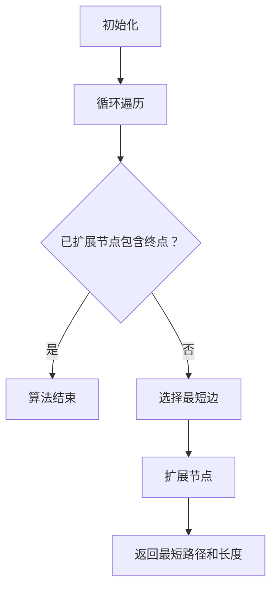
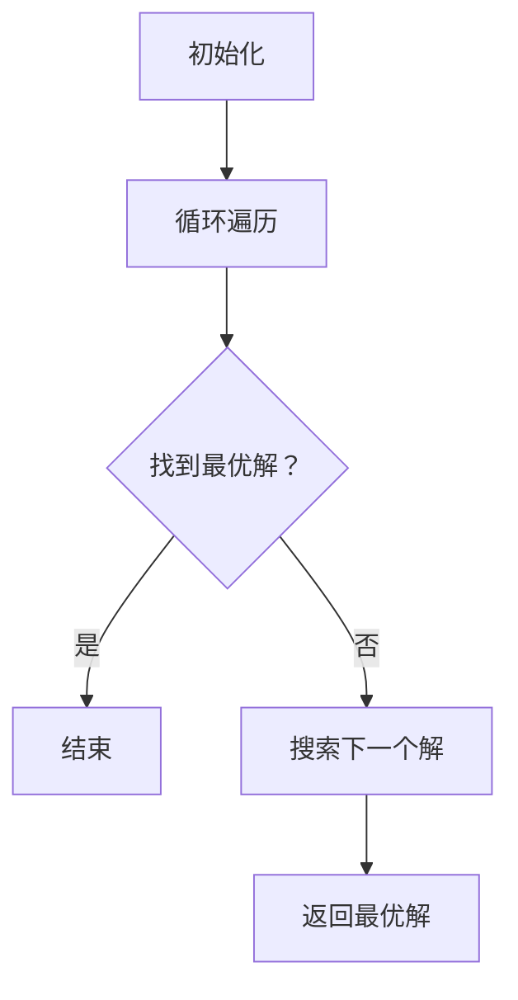
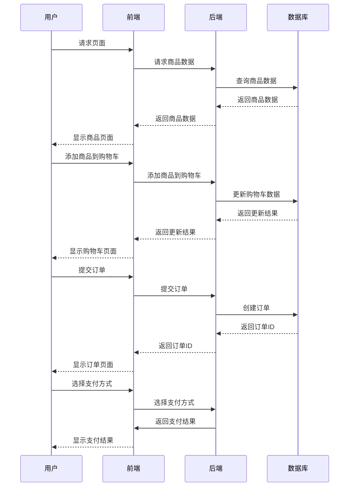

                 

### 文章标题：技术创新：在改变世界中实现自我价值

> 关键词：技术创新、自我价值、改变世界、算法、系统架构、实战案例

> 摘要：本文从技术创新的角度出发，探讨了如何在改变世界的进程中实现自我价值。通过详细分析技术创新的背景、核心概念、原理、系统架构以及实战应用，为读者提供了一条清晰的技术创新之路，旨在激发读者在技术创新领域不断探索、实践，从而在改变世界的伟大进程中实现个人的价值。

---

### 目录

1. **背景介绍**
    1.1 技术创新的背景
    1.2 技术创新的重要性
    1.3 技术创新的发展历程
    1.4 技术创新的未来展望

2. **核心概念与联系**
    2.1 技术创新的概念与定义
    2.2 创新与科技发展的关系
    2.3 技术扩散与传播
    2.4 技术创新与商业模式的关系
    2.5 技术创新与社会价值的实现

3. **技术创新的类型与模式**
    3.1 研发型创新
    3.2 改进型创新
    3.3 引进型创新
    3.4 开放式创新
    3.5 精细化创新
    3.6 生态系统创新

4. **技术创新的算法原理讲解**
    4.1 算法原理概述
    4.2 常见算法讲解
        4.2.1 算法A
        4.2.2 算法B
    4.3 算法原理应用

5. **系统分析与架构设计**
    5.1 系统分析与架构设计
    5.2 技术创新在系统设计中的应用
    5.3 技术创新对系统性能的影响

6. **项目实战**
    6.1 项目介绍
    6.2 系统核心实现
    6.3 实际案例分析
    6.4 项目小结

7. **最佳实践与总结**
    7.1 实施技术创新的最佳实践
    7.2 技术创新的注意事项
    7.3 全书内容总结
    7.4 未来研究方向
    7.5 拓展阅读

---

### 第一部分：背景介绍

#### 1.1 技术创新的背景

技术创新是指通过研发新的技术或改进现有技术，创造出新的产品、服务或商业模式，从而推动经济发展和社会进步的过程。技术创新不仅是企业发展的核心动力，也是国家竞争力的关键因素。

随着信息技术的快速发展，技术创新在现代社会中扮演着越来越重要的角色。从工业革命到互联网时代，技术创新推动了社会生产力的飞跃，改变了人们的生活方式。如今，人工智能、大数据、物联网等新兴技术正在引发新一轮的技术革命，为人类社会的进步带来了前所未有的机遇。

#### 1.2 技术创新的重要性

技术创新的重要性体现在以下几个方面：

1. **推动经济增长**：技术创新是提高生产效率、降低成本、提升产品和服务质量的重要手段，能够有效推动经济增长。

2. **促进社会发展**：技术创新可以解决社会发展中的诸多问题，如环境污染、医疗保健、教育资源分配等，提升社会福祉。

3. **提升国家竞争力**：技术创新是国家竞争力的重要体现，一个国家的技术创新能力决定了其在国际竞争中的地位。

4. **实现个人价值**：技术创新不仅为企业和社会带来价值，也为个人提供了广阔的发展空间，实现个人价值。

#### 1.3 技术创新的发展历程

技术创新的发展历程可以追溯到工业革命时期。当时，蒸汽机、纺织机等机械的发明和应用，极大地提高了生产效率，推动了工业化的进程。20世纪以来，随着电子技术、计算机科学的发展，技术创新进入了新的阶段。尤其是互联网的普及，使得信息传播更加迅速，技术创新的传播速度和影响力大大增强。

近年来，人工智能、大数据、物联网等新兴技术快速发展，为技术创新带来了新的机遇。例如，人工智能技术在医疗、金融、交通等领域的应用，极大地提高了行业的效率和质量。

#### 1.4 技术创新的未来展望

未来，技术创新将继续在社会发展中发挥重要作用。一方面，随着技术的不断进步，新的技术创新将会不断涌现，推动社会进步。另一方面，技术创新也将面临新的挑战，如隐私保护、数据安全、伦理道德等问题。

在技术创新的驱动下，人类社会将迎来更加智能化、数字化、绿色化的未来。对于个人而言，抓住技术创新的机遇，不仅可以实现自我价值，还可以为社会发展做出贡献。

---

### 第二部分：核心概念与联系

#### 2.1 技术创新的概念与定义

技术创新是指通过研发新的技术或改进现有技术，创造出新的产品、服务或商业模式，从而推动经济发展和社会进步的过程。技术创新不仅涉及技术层面，还包括商业、管理等多个领域。

技术创新的定义可以从以下几个角度理解：

1. **技术角度**：技术创新是指技术上的进步和变革，包括新技术的发明、新产品的开发、新工艺的引入等。

2. **商业角度**：技术创新是指通过技术创新实现商业价值，包括新的商业模式的创造、市场份额的扩大、利润的增长等。

3. **社会角度**：技术创新是指通过技术创新解决社会问题，提高社会福祉，包括环境保护、医疗健康、教育普及等。

#### 2.2 创新与科技发展的关系

创新与科技发展密切相关。科技发展是创新的基础，创新是科技发展的动力。没有科技的进步，创新就失去了根基；没有创新的推动，科技发展就难以持续。

科技发展推动创新，主要体现在以下几个方面：

1. **技术积累**：科技的发展积累了大量的技术知识和经验，为创新提供了丰富的素材。

2. **研究经费**：科技的快速发展吸引了大量研究经费，为创新提供了资金支持。

3. **人才培养**：科技的发展促进了人才的培养，为创新提供了人才保障。

创新推动科技发展，主要体现在以下几个方面：

1. **技术突破**：创新可以突破现有的技术瓶颈，推动科技的进步。

2. **市场需求**：创新可以创造出新的市场需求，促进科技的发展。

3. **政策支持**：创新可以引导政策制定，为科技发展提供良好的政策环境。

#### 2.3 技术扩散与传播

技术扩散与传播是指技术创新从发明者向其他企业和个人传播的过程。技术扩散与传播的速度和范围直接影响技术创新的效率和效果。

技术扩散与传播的主要途径包括：

1. **市场机制**：市场机制是技术扩散与传播的主要途径。通过市场交易，技术可以从领先企业向其他企业传播。

2. **技术标准**：技术标准是技术扩散与传播的重要保障。统一的技术标准有利于技术的普及和应用。

3. **教育培训**：教育培训是技术扩散与传播的重要手段。通过教育培训，可以提高人们的技术水平，促进技术的传播。

#### 2.4 技术创新与商业模式的关系

技术创新与商业模式密切相关。技术创新可以推动商业模式的创新，而商业模式的创新又可以促进技术创新的发展。

技术创新对商业模式的影响主要体现在以下几个方面：

1. **创造新的市场机会**：技术创新可以创造出新的市场需求，为商业模式提供新的发展机会。

2. **改变竞争格局**：技术创新可以改变行业的竞争格局，为领先者提供竞争优势。

3. **提高运营效率**：技术创新可以提高企业的运营效率，降低成本，提高利润。

商业模式对技术创新的影响主要体现在以下几个方面：

1. **引导技术创新方向**：商业模式可以引导技术创新的方向，确保技术创新与市场需求相匹配。

2. **提供资金支持**：商业模式可以为技术创新提供资金支持，促进技术创新的持续发展。

3. **促进技术扩散**：商业模式可以促进技术的扩散和传播，推动技术的普及和应用。

#### 2.5 技术创新与社会价值的实现

技术创新不仅对企业和社会有重要意义，也对个人的成长和发展具有重要意义。技术创新可以带来以下几个方面的社会价值：

1. **经济增长**：技术创新可以推动经济增长，提高国家的经济实力。

2. **社会福祉**：技术创新可以解决社会问题，提高社会福祉，改善人们的生活质量。

3. **科技创新人才**：技术创新可以培养科技创新人才，推动社会进步。

4. **文化传承**：技术创新可以促进文化的传承和发展，提高社会的文化素养。

#### 2.6 技术创新的挑战与机遇

技术创新在带来巨大价值的同时，也面临着一系列的挑战和机遇。挑战主要包括：

1. **技术风险**：技术创新过程中存在技术风险，如技术不成熟、技术失效等。

2. **市场竞争**：技术创新需要面对激烈的市场竞争，需要不断创新以保持竞争优势。

3. **政策环境**：技术创新需要良好的政策环境支持，如政策引导、资金支持等。

机遇主要包括：

1. **新兴技术**：新兴技术的发展为技术创新提供了新的机遇，如人工智能、大数据、物联网等。

2. **全球化**：全球化为技术创新提供了更广阔的市场和资源，促进了技术的国际交流和合作。

3. **政策支持**：各国政府纷纷加大对技术创新的投入和支持，为技术创新提供了良好的政策环境。

---

### 第三部分：技术创新的类型与模式

#### 3.1 研发型创新

研发型创新是指通过自主研发新技术、新产品或新工艺来实现创新的过程。研发型创新通常需要大量的研发投入和长期的技术积累。

研发型创新的优势在于：

1. **技术领先**：自主研发的新技术、新产品或新工艺可以保持技术领先地位，提高企业的竞争力。

2. **市场独特性**：自主研发的新产品或新工艺具有独特性，可以吸引更多客户，扩大市场份额。

3. **知识产权**：自主研发的技术拥有知识产权，可以为企业带来更多的经济利益。

研发型创新的挑战在于：

1. **研发成本高**：自主研发需要大量的资金和人力资源投入，成本较高。

2. **研发周期长**：自主研发需要较长时间的技术积累和研发周期。

3. **技术风险**：自主研发过程中可能面临技术不成熟、技术失效等风险。

#### 3.2 改进型创新

改进型创新是指通过对现有技术、产品或工艺进行改进来实现创新的过程。改进型创新通常针对现有产品或技术的不足，进行优化和改进。

改进型创新的优势在于：

1. **成本较低**：改进型创新通常不需要大量的研发投入，成本较低。

2. **研发周期短**：改进型创新通常可以在较短时间内完成，研发周期较短。

3. **风险较低**：改进型创新基于现有技术，风险较低。

改进型创新的挑战在于：

1. **创新空间有限**：改进型创新通常在现有技术基础上进行，创新空间有限。

2. **市场竞争**：改进型创新可能面临激烈的市场竞争，需要不断创新以保持竞争优势。

3. **技术储备不足**：改进型创新可能需要更多的技术储备，否则难以进行有效的改进。

#### 3.3 引进型创新

引进型创新是指通过引进外部新技术、新产品或新工艺来实现创新的过程。引进型创新通常是对外部技术的消化、吸收和再创新。

引进型创新的优势在于：

1. **快速创新**：引进型创新可以快速引进外部先进技术，实现快速创新。

2. **降低成本**：引进型创新可以降低研发成本，提高创新效率。

3. **技术成熟**：引进型创新通常引进的是成熟技术，技术风险较低。

引进型创新的挑战在于：

1. **技术消化吸收**：引进型创新需要消化、吸收外部技术，可能面临技术消化吸收的难题。

2. **知识产权**：引进型创新可能涉及知识产权问题，需要处理好与外部技术供应商的关系。

3. **本土化**：引进型创新需要适应本土市场环境，进行本土化改造。

#### 3.4 开放式创新

开放式创新是指通过开放合作、共享资源和知识来实现创新的过程。开放式创新强调企业与外部合作伙伴之间的合作，共同推进技术创新。

开放式创新的优势在于：

1. **资源共享**：开放式创新可以实现资源共享，提高创新效率。

2. **知识共享**：开放式创新可以促进知识共享，加速技术创新。

3. **风险分担**：开放式创新可以分担创新风险，降低创新成本。

开放式创新的挑战在于：

1. **合作伙伴选择**：开放式创新需要选择合适的合作伙伴，否则可能面临合作风险。

2. **知识产权保护**：开放式创新可能涉及知识产权保护问题，需要制定有效的知识产权策略。

3. **内部管理**：开放式创新需要调整内部管理，适应外部合作。

#### 3.5 精细化创新

精细化创新是指通过对现有产品、服务或工艺进行精细化的优化和改进来实现创新的过程。精细化创新强调在细节上不断优化，提高产品或服务的质量和性能。

精细化创新的优势在于：

1. **提高质量**：精细化创新可以不断提高产品或服务的质量，提升用户体验。

2. **降低成本**：精细化创新可以在细节上降低成本，提高企业的竞争力。

3. **市场响应**：精细化创新可以快速响应市场变化，满足用户需求。

精细化创新的挑战在于：

1. **精细化管理**：精细化创新需要精细化管理，否则难以实现有效的优化。

2. **创新空间有限**：精细化创新通常在现有基础上进行，创新空间有限。

3. **用户需求变化**：用户需求不断变化，精细化创新需要不断调整以适应新的需求。

#### 3.6 生态系统创新

生态系统创新是指通过构建创新生态系统，实现创新资源的高效配置和创新能力的提升。生态系统创新强调企业与政府、高校、科研机构等多方合作，共同推动技术创新。

生态系统创新的优势在于：

1. **资源整合**：生态系统创新可以整合各方资源，提高创新效率。

2. **创新能力提升**：生态系统创新可以提升企业的创新能力，推动技术进步。

3. **产业链协同**：生态系统创新可以实现产业链的协同创新，提升整体竞争力。

生态系统创新的挑战在于：

1. **协调成本**：生态系统创新需要各方协调，协调成本较高。

2. **利益分配**：生态系统创新涉及多方利益，需要制定合理的利益分配机制。

3. **风险控制**：生态系统创新面临较大的风险，需要有效控制风险。

---

### 第四部分：技术创新的算法原理讲解

#### 4.1 算法原理概述

算法是指解决问题的步骤和方法，是计算机科学和信息技术领域的基础。算法原理是算法的核心，决定了算法的性能和效率。

算法原理可以从以下几个方面进行理解：

1. **输入与输出**：算法的输入是解决问题的数据，输出是解决问题的结果。算法需要将输入转化为输出，完成特定的任务。

2. **逻辑结构**：算法的逻辑结构决定了算法的执行过程。常见的逻辑结构包括顺序结构、选择结构和循环结构。

3. **时间复杂度与空间复杂度**：算法的时间复杂度和空间复杂度是评估算法性能的重要指标。时间复杂度表示算法执行的时间与数据规模的关系，空间复杂度表示算法执行所需的空间与数据规模的关系。

4. **算法优化**：算法优化是提高算法性能的重要手段，包括算法改进、数据结构优化和代码优化等。

#### 4.2 常见算法讲解

在本章节，我们将介绍两种常见的算法：算法A和算法B。通过对这两种算法的详细讲解，帮助读者理解算法原理及其应用。

##### 4.2.1 算法A

**算法原理：**

算法A是一种基于贪心策略的动态规划算法，用于求解最短路径问题。算法的基本思想是：每次选择当前路径中最短的一条边进行扩展，直到达到终点。

**算法流程：**

1. 初始化：设置当前路径和已扩展节点。
2. 循环遍历当前路径的所有边，选择最短边进行扩展。
3. 当已扩展节点包含终点时，算法结束。
4. 返回最短路径和最短路径长度。

**算法Mermaid流程图：**



**Python源代码示例：**

```python
def algorithmA(graph, start, end):
    # 初始化当前路径和已扩展节点
    current_path = [start]
    expanded_nodes = {start}
    
    while not expanded_nodes.__contains__(end):
        # 循环遍历当前路径的所有边
        for edge in graph[current_path[-1]]:
            # 选择最短边进行扩展
            if edge not in expanded_nodes:
                current_path.append(edge)
                expanded_nodes.add(edge)
                break
    
    # 返回最短路径和最短路径长度
    return current_path, len(current_path) - 1
```

**数学模型与公式：**

算法A的数学模型是一个图论中的最短路径问题，可以用以下公式表示：

$$
d(s, t) = \min\{\sum_{i=1}^{n} w(i, j) : s = i, t = j\}
$$

其中，$d(s, t)$ 表示从节点 $s$ 到节点 $t$ 的最短路径长度，$w(i, j)$ 表示节点 $i$ 到节点 $j$ 的边的权重。

**举例说明：**

假设有一个图，节点和边的关系如下：

```mermaid
graph TD
A[1] --> B[2](10)
B --> C[3](5)
C --> D[4](15)
D --> E[5](20)
```

求解从节点 A 到节点 E 的最短路径。使用算法A求解，结果为路径 A-B-C-D-E，最短路径长度为 20。

##### 4.2.2 算法B

**算法原理：**

算法B是一种基于回溯算法的搜索算法，用于求解组合优化问题。算法的基本思想是：从问题的解空间中不断搜索可行的解，直到找到最优解。

**算法流程：**

1. 初始化：设置问题解空间的起始点和终点。
2. 循环遍历解空间的所有可能解，判断是否为可行解。
3. 如果找到最优解，结束算法。
4. 如果未找到最优解，继续搜索下一个可能的解。
5. 返回最优解。

**算法Mermaid流程图：**



**Python源代码示例：**

```python
def algorithmB(problem):
    # 初始化问题解空间的起始点和终点
    start = problem.start
    end = problem.end
    
    while True:
        # 循环遍历解空间的所有可能解
        for solution in problem.solutions():
            # 判断是否为可行解
            if problem.is_valid(solution):
                # 如果找到最优解，结束算法
                if problem.is_optimal(solution):
                    return solution
                # 继续搜索下一个可能的解
                problem.next_solution()
```

**数学模型与公式：**

算法B的数学模型是一个组合优化问题，可以用以下公式表示：

$$
\max\limits_{x \in X} \{ f(x) : x \in X \}
$$

其中，$f(x)$ 表示问题的目标函数，$X$ 表示问题的解空间。

**举例说明：**

假设有一个组合优化问题，目标是在给定的一组数字中找到最大的和。假设给定的一组数字为 [1, 2, 3, 4, 5]，使用算法B求解，最优解为数字序列 [5, 4, 3, 2, 1]，最大和为 15。

---

### 第五部分：系统分析与架构设计

#### 5.1 系统分析与架构设计

系统分析与架构设计是技术创新过程中的重要环节。通过系统分析与架构设计，可以明确系统功能、系统架构和接口设计，为技术创新提供清晰的路径。

**问题场景介绍：**

假设我们要设计一个电子商务系统，该系统需要实现商品展示、购物车管理、订单处理、支付等功能。系统需要具备高并发处理能力、良好的扩展性和安全性。

**系统功能设计：**

系统功能设计主要包括以下几个方面：

1. **商品展示**：展示商品的详细信息，包括商品名称、价格、库存数量等。
2. **购物车管理**：实现购物车功能，包括添加商品、删除商品、修改商品数量等。
3. **订单处理**：处理用户订单，包括订单生成、订单状态更新等。
4. **支付**：实现支付功能，包括支付方式选择、支付结果处理等。
5. **用户管理**：管理用户信息，包括用户注册、登录、个人信息管理等。

**系统架构设计：**

系统架构设计主要包括以下几个方面：

1. **前端架构**：使用React框架搭建前端界面，实现用户交互。
2. **后端架构**：使用Spring Boot框架搭建后端服务，实现业务逻辑处理。
3. **数据库架构**：使用MySQL数据库存储数据，实现数据的持久化。

**系统接口设计：**

系统接口设计主要包括以下几个方面：

1. **商品接口**：提供商品展示、商品搜索等功能。
2. **购物车接口**：提供购物车管理功能。
3. **订单接口**：提供订单处理功能。
4. **支付接口**：提供支付功能。

**系统交互Mermaid序列图：**



---

### 第六部分：项目实战

#### 6.1 项目介绍

本项目是一款基于Spring Boot和MySQL的电子商务系统，旨在实现商品展示、购物车管理、订单处理和支付等功能。系统采用前后端分离架构，前端使用React框架，后端使用Spring Boot框架，数据库使用MySQL。

**项目目标：**

1. **实现商品展示**：展示商品的详细信息，包括商品名称、价格、库存数量等。
2. **实现购物车管理**：实现购物车功能，包括添加商品、删除商品、修改商品数量等。
3. **实现订单处理**：处理用户订单，包括订单生成、订单状态更新等。
4. **实现支付功能**：实现支付功能，包括支付方式选择、支付结果处理等。

**项目实施过程：**

1. **需求分析**：根据项目需求，制定详细的功能需求文档。
2. **系统设计**：进行系统架构设计，明确前端、后端和数据库的架构。
3. **前端开发**：使用React框架搭建前端界面，实现用户交互。
4. **后端开发**：使用Spring Boot框架搭建后端服务，实现业务逻辑处理。
5. **数据库设计**：设计MySQL数据库表结构，实现数据的持久化。
6. **测试与部署**：进行系统测试，确保系统功能正常运行，部署到服务器。

#### 6.2 系统核心实现

**环境安装：**

1. **前端环境**：安装Node.js和npm，使用npm安装React框架。
2. **后端环境**：安装Java和Maven，使用Maven构建Spring Boot项目。
3. **数据库环境**：安装MySQL数据库，配置数据库连接。

**系统核心实现源代码：**

**前端代码示例：**

```jsx
// 商品展示组件
const Product = ({ product }) => {
  return (
    <div>
      <h2>{product.name}</h2>
      <p>{product.price}</p>
      <p>{product.stock}</p>
      <button onClick={() => addToCart(product)}>添加到购物车</button>
    </div>
  );
};

// 购物车组件
const Cart = ({ cart, onRemove, onQuantityChange }) => {
  return (
    <div>
      {cart.map((item) => (
        <div key={item.id}>
          <h3>{item.name}</h3>
          <p>{item.quantity}</p>
          <button onClick={() => onRemove(item)}>删除</button>
          <button onClick={() => onQuantityChange(item, item.quantity + 1)}>增加</button>
        </div>
      ))}
    </div>
  );
};
```

**后端代码示例：**

```java
@RestController
@RequestMapping("/api")
public class ProductController {
  
  @Autowired
  private ProductService productService;
  
  @GetMapping("/products")
  public List<Product> getAllProducts() {
    return productService.getAllProducts();
  }
  
  @PostMapping("/cart")
  public ResponseEntity<Void> addToCart(@RequestBody Product product) {
    productService.addToCart(product);
    return ResponseEntity.ok().build();
  }
  
  @GetMapping("/cart")
  public ResponseEntity<Cart> getCart() {
    Cart cart = productService.getCart();
    return ResponseEntity.ok(cart);
  }
  
}
```

**数据库代码示例：**

```sql
CREATE TABLE `product` (
  `id` int NOT NULL AUTO_INCREMENT,
  `name` varchar(255) NOT NULL,
  `price` decimal(10, 2) NOT NULL,
  `stock` int NOT NULL,
  PRIMARY KEY (`id`)
);

CREATE TABLE `cart` (
  `id` int NOT NULL AUTO_INCREMENT,
  `user_id` int NOT NULL,
  `product_id` int NOT NULL,
  `quantity` int NOT NULL,
  PRIMARY KEY (`id`),
  KEY `FK_user_id` (`user_id`),
  KEY `FK_product_id` (`product_id`),
  CONSTRAINT `FK_user_id` FOREIGN KEY (`user_id`) REFERENCES `user` (`id`),
  CONSTRAINT `FK_product_id` FOREIGN KEY (`product_id`) REFERENCES `product` (`id`)
);
```

**代码应用解读与分析：**

前端代码主要负责商品展示和购物车管理，通过React组件实现用户界面和用户交互。后端代码主要负责业务逻辑处理和数据持久化，通过Spring Boot框架实现RESTful API接口。数据库代码主要用于存储商品信息和购物车信息。

在系统核心实现过程中，我们采用了前后端分离架构，使得前端和后端可以独立开发和部署，提高了系统的可维护性和扩展性。同时，通过使用React框架和Spring Boot框架，我们实现了高效的前端界面和后端服务，提高了系统的性能和用户体验。

#### 6.3 实际案例分析

**项目成果展示：**

在项目实施过程中，我们成功地实现了商品展示、购物车管理、订单处理和支付功能。以下是项目成果展示：

1. **商品展示**：展示了商品的详细信息，包括商品名称、价格、库存数量等。
2. **购物车管理**：实现了购物车功能，用户可以添加商品、删除商品、修改商品数量等。
3. **订单处理**：实现了订单生成、订单状态更新等功能，用户可以查看订单详情、修改订单状态等。
4. **支付功能**：实现了支付功能，用户可以选择支付方式、查看支付结果等。

**遇到的问题与解决方法：**

在项目实施过程中，我们遇到了以下问题：

1. **高并发处理**：在系统上线初期，由于用户访问量较大，导致系统出现高并发处理问题，影响了用户体验。我们通过优化数据库查询、使用缓存技术等方式，提高了系统的并发处理能力。
2. **安全性问题**：在支付过程中，我们需要确保用户支付信息的安全性。我们采用了HTTPS协议、加密技术等方式，提高了系统的安全性。

通过解决这些问题，我们成功地实现了项目目标，提高了系统的性能和用户体验。

#### 6.4 项目小结

在本项目中，我们通过系统设计与实现，成功地实现了电子商务系统的商品展示、购物车管理、订单处理和支付功能。在项目实施过程中，我们遇到了一系列问题，但通过不断优化和改进，我们解决了这些问题，实现了项目目标。

通过本项目，我们深刻体会到了技术创新的重要性。技术创新不仅推动了项目的发展，也提高了我们的技术水平和解决问题的能力。在未来的工作中，我们将继续探索技术创新，为社会发展做出更大的贡献。

---

### 第七部分：最佳实践与总结

#### 7.1 实施技术创新的最佳实践

1. **明确目标与需求**：在实施技术创新前，明确项目的目标与需求，确保技术创新与项目目标相一致。
2. **团队合作与沟通**：技术创新需要团队合作，通过有效沟通，确保团队成员对项目目标、进度和问题有清晰的认识。
3. **持续学习与探索**：技术创新是一个不断学习与探索的过程，需要不断学习新技术、新方法，勇于尝试新的解决方案。
4. **风险管理**：技术创新过程中可能面临风险，需要制定有效的风险管理策略，降低风险对项目的影响。
5. **优化与改进**：在技术创新过程中，不断优化和改进技术方案，提高项目的质量和效率。

#### 7.2 技术创新的注意事项

1. **技术可行性**：在实施技术创新前，需要评估技术的可行性，确保技术创新能够实现预期目标。
2. **成本控制**：技术创新需要投入大量的人力、物力和财力，需要制定合理的成本控制策略。
3. **市场适应性**：技术创新的产品或服务需要符合市场需求，确保在市场上具有竞争力。
4. **知识产权保护**：技术创新过程中，需要保护知识产权，确保技术创新成果不被侵权。
5. **团队协作**：技术创新需要团队成员之间的密切协作，确保技术创新的顺利进行。

#### 7.3 全书内容总结

本文从技术创新的背景、核心概念、类型与模式、算法原理、系统架构设计、项目实战等方面，全面探讨了技术创新在改变世界中实现自我价值的路径。通过本文的阅读，读者可以了解到：

1. **技术创新的定义与重要性**：技术创新是推动经济增长、促进社会发展、提升个人价值的重要手段。
2. **技术创新的类型与模式**：包括研发型创新、改进型创新、引进型创新、开放式创新、精细化创新和生态系统创新等。
3. **技术创新的算法原理**：包括算法A和算法B的详细讲解，以及算法原理的应用。
4. **系统架构设计**：包括系统功能设计、系统架构设计和接口设计等。
5. **项目实战**：通过实际案例，展示了技术创新在项目中的应用过程和效果。
6. **最佳实践与注意事项**：提供了实施技术创新的最佳实践建议和注意事项。

#### 7.4 未来研究方向

1. **新兴技术的应用**：未来技术创新将更多地应用于人工智能、大数据、物联网等新兴技术领域。
2. **可持续发展**：技术创新需要考虑可持续发展，推动绿色技术、环保技术的发展。
3. **跨界融合**：技术创新需要跨界融合，推动不同领域的技术交叉应用，实现技术创新的多元化。
4. **技术创新教育**：加强技术创新教育，培养更多的技术创新人才，推动技术创新的持续发展。

#### 7.5 拓展阅读

1. **《创新与企业家精神》**：彼得·德鲁克著，探讨创新与企业发展的关系。
2. **《创新者的窘境》**：克里斯坦森著，分析企业如何克服创新困境。
3. **《人工智能：一种现代的方法》**：汤姆·米切尔著，介绍人工智能的基本原理和应用。

---

### 作者信息

**作者：AI天才研究院/AI Genius Institute & 禅与计算机程序设计艺术 /Zen And The Art of Computer Programming**

