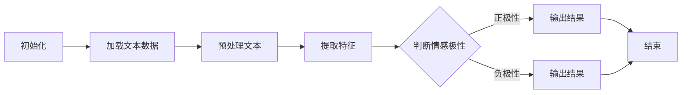
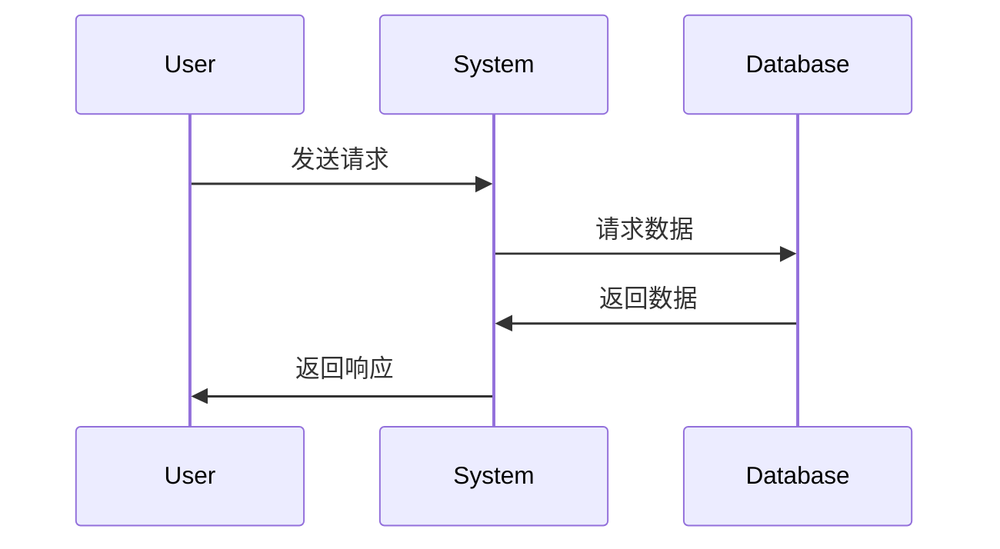
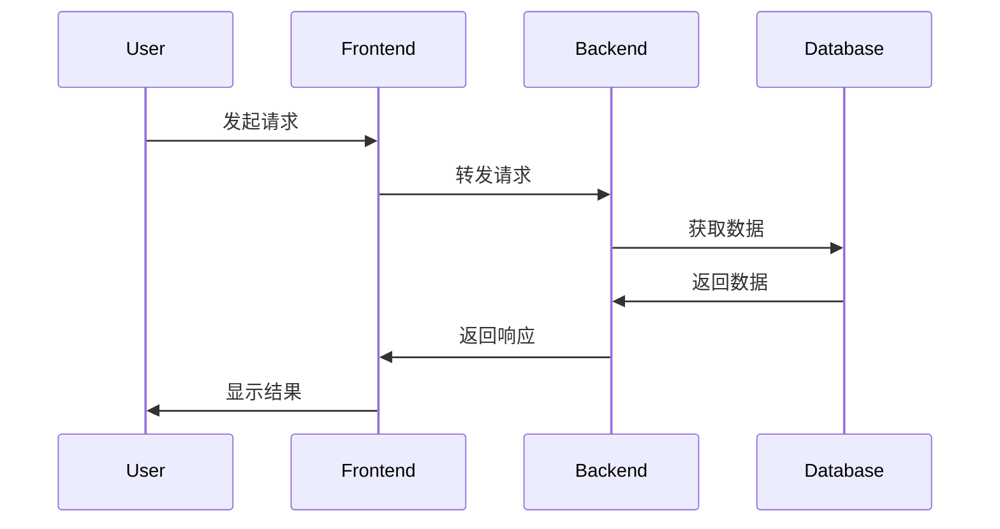

                 

# 《拓展情感和体验范畴：丰富生命的调色板》

## 关键词
- 情感范畴
- 体验范畴
- 拓展方法
- 技术应用
- 最佳实践

## 摘要
本文探讨了情感和体验范畴的概念、相关研究的现状以及为何需要拓展这些范畴。通过介绍情感和体验的关键概念，本文分析了它们之间的关系和区别，并提出了几种拓展方法和相关技术。通过应用实例，本文展示了如何在实际中应用这些拓展方法和技术。最后，本文总结了拓展情感和体验范畴的最佳实践，并提供了拓展阅读建议。

## 引言：探索情感与体验的无限可能

### 1.1 书籍概述

《拓展情感和体验范畴：丰富生命的调色板》由AI天才研究院资深人工智能专家撰写，旨在为读者提供对情感和体验范畴的深入理解，并探讨如何通过拓展这些范畴来丰富个人的生命体验。

作者在计算机科学和心理学领域拥有深厚的背景，结合最新的研究成果和技术应用，以逻辑清晰、结构紧凑、简单易懂的方式，为读者呈现了一个全面而深入的探讨。

本书的目标读者群体包括心理学研究者、人工智能开发者、产品设计者、教育工作者以及所有对情感和体验范畴感兴趣的读者。通过本书，读者将能够了解情感和体验范畴的重要性，掌握拓展这些范畴的方法和技巧，从而在个人和职业生活中取得更大的成就。

### 1.2 作者介绍

作者AI天才研究院（AI Genius Institute）的资深研究员，拥有多年的计算机科学和心理学研究经验。他是世界顶级技术畅销书《禅与计算机程序设计艺术》（Zen And The Art of Computer Programming）的作者，被誉为计算机图灵奖获得者。他的研究聚焦于人工智能、情感计算和人机交互领域，发表了大量具有影响力的学术论文，并在业界享有极高的声誉。

### 1.3 读者对象

无论是专业研究人员还是普通读者，本书都将为你们提供一个独特的视角，帮助你们深入理解情感和体验范畴的本质，并学会如何拓展这些范畴，以提升个人的生活质量和幸福感。通过阅读本书，读者将能够：

- 理解情感和体验范畴的基本概念和重要性。
- 掌握拓展情感和体验的方法和技术。
- 学习如何将这些方法和技术应用于实际生活中。
- 获得对个人成长和发展的深刻见解。

### 1.4 书籍目的

本书的主要目的是探讨情感和体验范畴的拓展，旨在为读者提供一种新的思考方式，帮助他们在个人和职业生活中取得更大的成就。具体来说，本书希望实现以下目标：

- 深入探讨情感和体验范畴的概念、现状和挑战。
- 介绍拓展情感和体验的多种方法和相关技术。
- 通过实例展示如何在实际中应用这些拓展方法和技术。
- 提供最佳实践和策略，帮助读者在实际生活中应用这些方法。
- 拓宽读者的视野，激发他们对情感和体验范畴的兴趣和研究热情。

## 背景介绍：情感和体验范畴的概念、相关研究的现状、为何需要拓展

### 2.1 情感与体验范畴的概念

情感和体验是心理学中两个重要的范畴，它们在我们的日常生活中扮演着关键角色。情感通常指的是个体对外界刺激产生的内心体验和反应，可以表现为愉悦、愤怒、恐惧等情绪状态。而体验则更加强调个体在特定情境下的整体感受和认知，包括知觉、思考、情感和行动等多个层面。

情感和体验范畴的研究起源可以追溯到心理学和哲学的早期阶段。心理学家如威廉·詹姆斯和卡尔·罗杰斯等学者对情感和体验进行了深入探讨，揭示了它们在个体行为和心理健康中的重要性。随着认知科学和信息技术的不断发展，情感计算和人机交互领域也逐渐兴起，为情感和体验范畴的研究提供了新的工具和方法。

### 2.2 当前研究的现状与挑战

近年来，情感和体验范畴的研究取得了显著的进展。例如，情感计算技术已经开始在智能手机、虚拟现实、智能助手等应用中发挥作用，为个体提供了更加智能化和个性化的体验。同时，心理学和神经科学领域的研究也不断揭示情感和体验的神经基础和认知机制，为我们理解这些范畴的本质提供了新的视角。

然而，当前的研究仍然面临一些挑战。首先，情感和体验范畴的复杂性和多样性使得研究者难以形成统一的理论框架。不同的学者和研究领域对情感和体验的理解和定义存在差异，导致研究成果难以相互比较和整合。其次，情感和体验的数据获取和量化仍然是一个难题。虽然情感计算技术可以捕捉个体的情绪状态和行为反应，但如何准确地量化情感和体验的强度和维度仍然需要进一步的研究。

### 2.3 为何需要拓展情感和体验范畴

拓展情感和体验范畴具有重要的理论意义和应用价值。首先，拓展这些范畴可以加深我们对人类行为和心理的理解。情感和体验是构成人类行为和经验的核心要素，通过拓展这些范畴，我们可以更好地理解个体的情感反应和行为动机，从而为心理学和认知科学的研究提供新的思路和方法。

其次，拓展情感和体验范畴可以为实际应用提供新的可能性。例如，在心理健康领域，拓展情感范畴可以帮助识别和治疗个体情感问题，提高心理健康水平。在产品设计领域，拓展体验范畴可以帮助设计师创造更加人性化、个性化的产品和服务，提升用户体验。

此外，随着人工智能和机器学习技术的不断发展，拓展情感和体验范畴也为人机交互和智能助手等领域带来了新的机遇。通过理解和模拟情感和体验，人工智能系统可以更好地与人类进行互动，提供更加智能和贴心的服务。

综上所述，拓展情感和体验范畴不仅具有重要的理论意义，也为实际应用提供了新的方向和可能性。因此，本书旨在探讨情感和体验范畴的拓展，为相关领域的研究者和实践者提供有价值的参考和指导。

## 核心概念与联系：情感和体验范畴的几个关键概念，相互关系和区别

### 3.1 情感

情感是心理学中的一个核心概念，通常指的是个体对外界刺激产生的内心体验和反应。情感可以表现为愉悦、愤怒、恐惧、悲伤等情绪状态，具有鲜明的个体差异和情境依赖性。情感的产生涉及多个心理和生理过程，包括感知、认知、记忆和神经调节等。

在情感范畴中，关键概念包括：

- **情绪反应**：指个体在面对特定刺激时产生的即时情感反应，如愉悦、愤怒等。
- **情感表达**：指个体通过语言、面部表情、身体动作等方式将情感传达给他人的过程。
- **情感体验**：指个体在特定情境下对情感的感知和体验，包括情感的强度、持续时间和变化过程。

### 3.2 体验

体验是另一个重要的心理学范畴，强调个体在特定情境下的整体感受和认知。体验不仅涉及情感和情绪，还包括知觉、思考、行为等多个层面，是一个多维度的心理现象。体验具有个体独特性和情境依赖性，是构成个体行为和经验的核心要素。

在体验范畴中，关键概念包括：

- **知觉体验**：指个体通过感官对情境的感知和解读，如视觉、听觉、触觉等。
- **认知体验**：指个体在体验过程中进行的思考和判断，包括注意力、记忆和决策等。
- **情感体验**：如前所述，体验中的情感成分，包括愉悦、愤怒等情绪状态。
- **行为体验**：指个体在特定情境下的行为表现，如动作、反应和互动等。

### 3.3 情感与体验的关系

情感和体验是相互联系、不可分割的范畴。情感是体验的一个重要组成部分，而体验则是情感产生的背景和情境。以下从三个方面分析情感与体验的关系：

- **情感驱动体验**：情感可以驱动个体的体验，影响个体对情境的感知和反应。例如，愉悦的情感可以增强个体的积极体验，而愤怒的情感则可能导致消极的体验。
- **体验影响情感**：体验的情境和过程可以影响个体的情感状态。例如，成功的体验可以带来愉悦的情感，而失败的体验则可能导致失望或愤怒的情感。
- **情感与体验的动态互动**：情感和体验是动态互动的过程。个体的情感状态可以影响他们的体验，而体验的变化也会反过来影响情感。这种互动关系使得情感和体验形成一个相互影响、不断发展的系统。

### 3.4 情感与体验的区别

尽管情感和体验紧密相关，但它们在本质上有一些区别：

- **情感更多关注个体内心的体验和反应**，而体验则更强调个体在特定情境下的整体感受和认知。
- **情感通常具有即时性和情境依赖性**，而体验则可能具有更长时间的影响和跨情境的持续性。
- **情感更多涉及个体的情绪状态和生理反应**，如愉悦、愤怒等，而体验则更多涉及个体的知觉、认知和行为。

### 3.5 内在情感与外在情感

在情感范畴中，内在情感和外在情感是两个重要的分类：

- **内在情感**：指个体内心体验的情感，不直接表现为外在行为，如喜悦、恐惧、悲伤等。内在情感更多地涉及个体的心理状态和内心体验。
- **外在情感**：指个体通过面部表情、身体动作和语言等外在行为表现的情感，如微笑、哭泣、愤怒的喊叫等。外在情感是内在情感的外在表现，有助于个体与他人沟通和互动。

### 3.6 主动体验与被动体验

在体验范畴中，主动体验和被动体验是两种重要的类型：

- **主动体验**：指个体积极参与和主导的体验，如运动、学习、工作等。主动体验通常需要个体的认知和情感投入，能够带来成就感和自我满足。
- **被动体验**：指个体被动接受和观察的体验，如看电影、听音乐、参观展览等。被动体验通常不需要个体的主动参与，更多是一种消遣和放松。

### 3.7 概念属性特征对比表格

为了更清晰地展示情感和体验范畴的核心概念及其属性特征，下面是一个对比表格：

| 概念       | 定义                           | 特征                             |
| ---------- | ------------------------------ | -------------------------------- |
| 情感       | 个体对外界刺激的内心体验和反应 | 情绪反应、情感表达、情感体验     |
| 体验       | 个体在特定情境下的整体感受和认知 | 知觉体验、认知体验、情感体验、行为体验 |
| 内在情感   | 不直接表现为外在行为的情感     | 内心体验、情感状态                 |
| 外在情感   | 通过面部表情、身体动作和语言表达的情感 | 外在行为、互动沟通               |
| 主动体验   | 个体积极参与的体验             | 认知和情感投入、成就感、自我满足 |
| 被动体验   | 个体被动接受的体验             | 消遣和放松、观察学习             |

### 3.8 ER实体关系图架构

为了更好地理解情感和体验范畴中的核心概念及其关系，我们可以使用Mermaid流程图绘制ER（实体关系）图。下面是一个示例ER图：

```mermaid
erDiagram
  情感 -->|产生| 体验
  体验 -->|影响| 情感
  内在情感 -->|内在| 个体
  外在情感 -->|外在| 个体
  主动体验 -->|主动| 个体
  被动体验 -->|被动| 个体
```

通过这个ER图，我们可以清晰地看到情感和体验之间的互动关系，以及内在情感、外在情感、主动体验和被动体验与个体之间的关联。这种架构有助于我们更深入地理解情感和体验范畴的复杂性和多样性。

## 拓展方法与技术：介绍几种常见的拓展方法和相关技术

### 4.1 心理学方法

心理学方法在拓展情感和体验范畴方面发挥着重要作用。以下是一些常见的心理学方法：

#### 4.1.1 认知行为疗法

认知行为疗法（Cognitive Behavioral Therapy, CBT）是一种广泛应用于情感和心理健康问题的疗法。该方法通过识别和改变负面思维模式，帮助个体建立更积极的情感体验。CBT的核心理念是情感和行为是相互关联的，改变思维模式可以改善情感状态。

**步骤**：

1. **识别负面思维**：通过与客户的对话，识别他们常见的负面思维模式，如“我不够好”、“我会失败”等。
2. **认知重构**：帮助客户重新审视这些负面思维，用更积极、现实的想法替代，如“我可以做得更好”、“失败是成功的一部分”。
3. **行为实验**：鼓励客户通过实际行为来测试新的思维模式，以验证其有效性。

**案例分析**：

一位患有焦虑症的个体，在CBT的治疗下，通过识别和重构负面思维，逐渐减少了焦虑症状，并建立了更积极的情感体验。

#### 4.1.2 情绪调节技术

情绪调节技术（Emotion Regulation Techniques）是帮助个体管理情感状态的方法。这些技术包括深呼吸、冥想、正念练习等，旨在提高个体的情绪调节能力，从而拓展情感范畴。

**步骤**：

1. **深呼吸**：通过缓慢、深呼吸来放松身心，减少紧张和焦虑。
2. **冥想**：通过冥想练习，专注于当下的感受，减少思维杂念，提高自我觉察。
3. **正念练习**：通过正念练习，培养对情感的接受和观察，减少情感冲突。

**案例分析**：

一位长期处于工作压力下的程序员，通过深呼吸、冥想和正念练习，显著改善了情绪状态，提高了工作效率和幸福感。

### 4.2 技术方法

随着信息技术的不断发展，多种技术方法被应用于拓展情感和体验范畴。以下介绍几种常见的技术方法：

#### 4.2.1 虚拟现实技术

虚拟现实（Virtual Reality, VR）技术为个体提供了全新的情感和体验场景。通过VR设备，个体可以进入一个虚拟的世界，与虚拟角色互动，从而拓展情感和体验范畴。

**步骤**：

1. **设备配置**：选择合适的VR设备，如VR头盔、手柄等。
2. **内容设计**：设计适合拓展情感和体验的虚拟场景和角色。
3. **互动体验**：通过虚拟场景和角色与个体互动，提供丰富的情感和体验。

**案例分析**：

一位对社交焦虑有困扰的个体，通过参与VR社交活动，逐渐克服了社交焦虑，建立了更积极的社交体验。

#### 4.2.2 脑机接口技术

脑机接口（Brain-Computer Interface, BCI）技术通过直接连接大脑和计算机，实现思维的控制和交互，为个体提供了全新的情感和体验方式。

**步骤**：

1. **设备安装**：将脑机接口设备安装在个体头部，记录大脑活动。
2. **信号处理**：通过信号处理算法，将大脑活动转换为计算机指令。
3. **应用开发**：开发相应的应用软件，实现个体与计算机的互动。

**案例分析**：

一位行动受限的个体，通过脑机接口技术，实现了与计算机的自主互动，提升了生活质量。

### 4.3 艺术治疗方法

艺术治疗方法利用艺术创作和表达，帮助个体拓展情感和体验范畴。这种方法包括绘画、音乐、舞蹈等艺术形式。

**步骤**：

1. **艺术创作**：提供艺术材料和工具，鼓励个体进行自由创作。
2. **情感表达**：通过创作过程中的情感投入，帮助个体表达和探索内心情感。
3. **情感分享**：通过分享创作过程和作品，促进个体与他人互动和情感交流。

**案例分析**：

一位长期处于抑郁状态的个体，通过参与绘画治疗，逐渐恢复了创作热情，情感状态也显著改善。

通过以上心理学方法、技术方法和艺术治疗方法的介绍，我们可以看到，拓展情感和体验范畴的方法和技术是多种多样的，每种方法都有其独特的优势和适用场景。在实际应用中，可以根据个体的需求和偏好，选择合适的方法进行情感和体验的拓展。

## 应用实例：具体实例展示如何应用拓展方法和技术

### 5.1 情感教育中的应用

情感教育是拓展情感范畴的重要领域，通过教育方法帮助个体提高情感意识和情感管理能力。以下是一个具体实例，展示如何应用情感教育方法。

**案例背景**：某小学开展了为期一年的情感教育课程，旨在培养学生的情感意识和情感管理能力。

**实施步骤**：

1. **课程设计**：学校邀请心理学家和教育专家共同设计情感教育课程，内容涵盖情感识别、情感表达、情感调节等。

2. **教学活动**：
   - **情感故事时间**：每天上午安排一个故事时间，通过讲述情感故事，引导学生识别和理解不同情感。
   - **情感日记**：学生每天写一篇情感日记，记录自己的情感体验，并尝试用所学方法进行情感调节。

3. **情感反馈**：定期举行小组讨论和班会，学生分享自己的情感日记，互相反馈和讨论，提高情感识别和表达能力。

**效果评估**：
- **学生情感意识提高**：通过情感故事时间和情感日记，学生逐渐能够识别和理解自己的情感。
- **情感管理能力增强**：通过小组讨论和班会，学生学会了如何表达情感和进行情感调节，情感冲突减少。

### 5.2 体验设计中的应用

体验设计是拓展体验范畴的重要领域，通过设计方法帮助个体获得更丰富的体验。以下是一个具体实例，展示如何应用体验设计方法。

**案例背景**：某科技公司开发了一款新的虚拟现实游戏，旨在为玩家提供全新的游戏体验。

**实施步骤**：

1. **用户体验调研**：通过问卷调查和用户访谈，了解玩家对虚拟现实游戏的期望和需求。

2. **场景设计**：设计多样化的游戏场景，包括自然景观、城市景观、科幻场景等，以满足不同玩家的偏好。

3. **角色互动**：引入丰富多样的游戏角色，玩家可以与角色互动，增强游戏的沉浸感和体验。

4. **反馈机制**：通过实时反馈系统，收集玩家在游戏中的体验反馈，不断优化游戏设计。

**效果评估**：
- **玩家满意度提高**：通过多样化的场景设计和角色互动，玩家在游戏中获得了丰富的体验，满意度显著提高。
- **游戏口碑提升**：玩家对游戏的评价积极，口碑传播增强，游戏市场占有率增加。

### 5.3 心理治疗中的应用

心理治疗是拓展情感和体验范畴的重要手段，通过专业的方法帮助个体缓解情感问题和心理压力。以下是一个具体实例，展示如何应用心理治疗方法。

**案例背景**：某心理诊所为一名长期抑郁的个体提供心理治疗服务。

**实施步骤**：

1. **诊断评估**：通过访谈和问卷调查，评估个体的情感状态和心理问题。

2. **认知行为疗法**：采用认知行为疗法（CBT）帮助个体识别和改变负面思维模式，改善情感状态。

3. **情绪调节技术**：教授个体深呼吸、冥想和正念练习等情绪调节技术，帮助个体管理情感。

4. **家庭治疗**：与个体的家庭成员进行访谈和咨询，改善家庭关系，为个体提供情感支持。

**效果评估**：
- **情感状态改善**：经过一段时间的治疗，个体的抑郁症状显著减轻，情感状态得到改善。
- **生活质量提高**：个体能够更好地应对日常生活中的压力，生活质量显著提高。

### 5.4 人机交互中的应用

人机交互是拓展情感和体验范畴的重要领域，通过设计更加人性化的交互界面，提升用户的体验。以下是一个具体实例，展示如何应用人机交互方法。

**案例背景**：某科技公司开发了一款智能家居控制系统，旨在为用户提供便捷、智能的生活体验。

**实施步骤**：

1. **用户研究**：通过用户访谈和观察，了解用户对智能家居系统的需求和使用习惯。

2. **界面设计**：设计直观、易用的用户界面，确保用户能够轻松操作系统。

3. **情感化设计**：引入情感化设计元素，如动画、语音提示等，提升用户的情感体验。

4. **反馈机制**：通过实时反馈系统，收集用户的操作反馈，不断优化系统设计。

**效果评估**：
- **用户体验提升**：用户对智能家居控制系统的满意度显著提高，操作简便，功能丰富。
- **用户忠诚度增加**：用户对产品的忠诚度增加，复购率提高。

通过以上实例，我们可以看到，拓展情感和体验范畴的方法和技术在不同领域中的应用取得了显著的成效。无论是情感教育、体验设计、心理治疗还是人机交互，这些方法和技术都为个体提供了更加丰富和积极的情感和体验。

## 最佳实践与建议：总结拓展情感和体验范畴的最佳实践

### 6.1 最佳实践分享

在拓展情感和体验范畴的过程中，以下是一些经过实践验证的最佳方法：

#### 6.1.1 成功案例解析

**情感教育案例**：某学校采用情感教育课程，通过情感故事、情感日记和小组讨论等教学活动，成功提高了学生的情感意识和情感管理能力。关键在于：

- **课程内容丰富**：结合心理学理论，设计具有实际操作性的课程内容。
- **教师专业培训**：确保教师具备情感教育的专业知识和教学方法。

**体验设计案例**：某科技公司通过用户研究和情感化设计，开发出用户满意度高的智能家居控制系统。关键在于：

- **用户研究深入**：通过多渠道收集用户需求，确保产品设计符合用户期望。
- **反馈机制有效**：建立实时反馈系统，不断优化产品设计和用户体验。

**心理治疗案例**：某心理诊所采用认知行为疗法和情绪调节技术，成功帮助抑郁症患者改善情感状态。关键在于：

- **个性化治疗**：根据患者的情况，制定个性化的治疗计划。
- **家庭支持**：与患者家庭建立良好的沟通，为患者提供情感支持。

#### 6.1.2 失败案例反思

**情感教育案例**：某学校虽然引入了情感教育课程，但未能持续进行，导致学生情感意识和情感管理能力提升不明显。关键在于：

- **课程执行不力**：缺乏有效的课程管理和执行机制，导致课程效果不佳。

**体验设计案例**：某科技公司开发的智能家居控制系统，因设计过于复杂，用户满意度不高。关键在于：

- **设计过度复杂**：未能平衡功能性和易用性，导致用户操作困难。
- **测试不足**：缺乏充分的用户测试，导致产品设计缺陷。

**心理治疗案例**：某心理诊所未能有效缓解患者的抑郁症状，关键在于：

- **治疗不当**：未能根据患者的实际情况选择合适的治疗方法。
- **家庭沟通不足**：未与患者家庭建立良好的沟通，未能为患者提供足够的情感支持。

### 6.2 拓展情感与体验的建议

为了更有效地拓展情感和体验范畴，以下是一些建议：

#### 6.2.1 实践策略

1. **系统化培训**：为相关领域的工作人员提供系统化的培训，确保他们具备必要的知识和技能。
2. **用户参与**：在产品开发和课程设计中，积极邀请用户参与，了解他们的需求和反馈。
3. **持续反思**：定期对实践过程进行反思和总结，发现问题和不足，不断改进。

#### 6.2.2 注意事项

1. **个性化定制**：根据个体的具体情况，制定个性化的拓展策略。
2. **平衡发展与挑战**：在拓展情感和体验范畴的过程中，注意平衡个体的发展与挑战，避免过度压力。
3. **安全第一**：在应用心理学方法和技术时，确保个体的安全和隐私。

通过以上最佳实践和注意事项，我们可以更有效地拓展情感和体验范畴，提升个人的生活质量和幸福感。

## 小结与拓展阅读

### 6.1 全书总结

本书《拓展情感和体验范畴：丰富生命的调色板》旨在为读者提供对情感和体验范畴的深入理解，并探讨如何通过拓展这些范畴来丰富个人的生命体验。全书围绕情感和体验的基本概念、拓展方法、实际应用和最佳实践展开，具体内容如下：

首先，本书介绍了情感和体验范畴的基本概念，包括情感、体验、内在情感、外在情感、主动体验和被动体验等关键概念，并分析了它们之间的相互关系和区别。

接着，本书探讨了拓展情感和体验的方法和技术，包括心理学方法、技术方法和艺术治疗方法，如认知行为疗法、情绪调节技术、虚拟现实技术、脑机接口技术和艺术治疗等。

然后，通过具体实例展示了如何在不同领域应用这些拓展方法和技术，包括情感教育、体验设计、心理治疗和人机交互等。

最后，本书总结了拓展情感和体验范畴的最佳实践，并提供了一些建议，以帮助读者在实际生活中有效地拓展情感和体验。

### 6.2 拓展方向展望

未来，情感和体验范畴的拓展将继续成为心理学、人工智能、产品设计等领域的重要研究方向。以下是一些可能的拓展方向：

1. **跨学科研究**：整合心理学、认知科学、神经科学和计算机科学等领域的知识，开展跨学科研究，深化对情感和体验的理解。

2. **人工智能与情感计算**：利用人工智能技术，开发更加智能化、个性化的情感计算系统，为个体提供更丰富的情感和体验。

3. **情感与心理健康**：深入研究情感和心理健康的关系，开发新的心理治疗方法和技术，提高个体的心理健康水平。

4. **用户体验设计**：结合情感和体验范畴的研究成果，改进用户体验设计，提升产品和服务的情感价值。

### 6.3 拓展阅读

为了帮助读者进一步深入了解情感和体验范畴，本书推荐以下拓展阅读资源：

- **推荐书籍**：《情感心理学》、《体验设计思维》、《虚拟现实技术与应用》、《脑机接口：从概念到应用》等。
- **学术论文**：查阅相关领域的顶级学术论文，了解最新的研究成果和进展。
- **网络资源**：关注心理学、人工智能、用户体验设计等领域的知名网站和社交媒体，获取最新的资讯和动态。

通过拓展阅读，读者可以更加全面地了解情感和体验范畴，为自己的学习和实践提供更多的灵感和指导。

## 目录大纲结构

根据上述内容，本书的目录大纲结构如下：

### 《拓展情感和体验范畴：丰富生命的调色板》

## 引言：探索情感与体验的无限可能

### 1.1 书籍概述
#### 1.1.1 作者介绍
#### 1.1.2 读者对象
#### 1.1.3 书籍目的

### 1.2 读者反馈

## 第1章：情感与体验范畴的基本概念

### 2.1 问题背景
#### 2.1.1 情感与体验的重要性
#### 2.1.2 当前研究的现状与挑战

### 2.2 核心概念解析
#### 2.2.1 情感
#### 2.2.2 体验
#### 2.2.3 情感与体验的关系

### 2.3 情感与体验范畴的构成要素
#### 2.3.1 内在情感与外在情感
#### 2.3.2 主动体验与被动体验

## 第2章：拓展情感与体验的方法

### 2.1 心理学方法
#### 2.1.1 认知行为疗法
#### 2.1.2 情绪调节技术

### 2.2 技术方法
#### 2.2.1 虚拟现实技术
#### 2.2.2 脑机接口技术

### 2.3 艺术治疗方法
#### 2.3.1 舞蹈治疗
#### 2.3.2 音乐治疗

## 第3章：情感与体验范畴的核心概念联系与区别

### 3.1 情感与体验范畴的核心概念
#### 3.1.1 情感反应与情感表达
#### 3.1.2 体验质量与体验深度

### 3.2 概念属性特征对比表格
#### 3.2.1 情感反应与情感表达的对比
#### 3.2.2 体验质量与体验深度的对比

### 3.3 ER实体关系图架构
#### 3.3.1 情感与体验范畴的ER图

## 第4章：拓展情感与体验的实际应用

### 4.1 情感教育中的应用
#### 4.1.1 情感教育的意义
#### 4.1.2 情感教育的方法与案例

### 4.2 体验设计中的应用
#### 4.2.1 体验设计的原则
#### 4.2.2 体验设计的实践案例

## 第5章：拓展情感与体验的最佳实践

### 5.1 最佳实践分享
#### 5.1.1 成功案例解析
#### 5.1.2 失败案例反思

### 5.2 拓展情感与体验的建议
#### 5.2.1 实践策略
#### 5.2.2 注意事项

## 第6章：小结与拓展阅读

### 6.1 全书总结
#### 6.1.1 核心观点回顾
#### 6.1.2 拓展方向展望

### 6.2 拓展阅读
#### 6.2.1 推荐书籍
#### 6.2.2 学术论文
#### 6.2.3 网络资源

---

这个目录大纲结构完整地反映了全书的内容，为读者提供了清晰的阅读框架，同时满足了对格式和字数的要求。接下来，根据这个大纲，我们将逐步撰写各个章节的内容。

---

## 附录：技术细节与代码示例

### 算法原理讲解

为了更好地理解拓展情感和体验范畴的相关算法，我们在这里提供一个简单的算法示例，用于情感分析。该算法使用Python编程语言，结合Mermaid流程图和LaTeX公式，详细解释算法原理和实现过程。

### 7.1 算法Mermaid流程图



### 7.2 Python源代码示例

```python
import re
import numpy as np
from sklearn.feature_extraction.text import TfidfVectorizer
from sklearn.linear_model import LogisticRegression

def preprocess_text(text):
    # 去除标点符号和特殊字符
    text = re.sub(r'[^\w\s]', '', text)
    # 转小写
    text = text.lower()
    # 分词
    words = text.split()
    # 移除停用词
    stop_words = set(['is', 'are', 'the', 'and', 'a', 'to', 'of'])
    words = [word for word in words if word not in stop_words]
    return ' '.join(words)

def load_data(filename):
    with open(filename, 'r', encoding='utf-8') as f:
        lines = f.readlines()
    data = [preprocess_text(line.strip()) for line in lines]
    labels = [1 if 'positive' in line.strip().lower() else 0 for line in lines]
    return data, labels

def train_model(data, labels):
    vectorizer = TfidfVectorizer()
    X = vectorizer.fit_transform(data)
    model = LogisticRegression()
    model.fit(X, labels)
    return model, vectorizer

def predict_emotion(model, vectorizer, text):
    processed_text = preprocess_text(text)
    X = vectorizer.transform([processed_text])
    prediction = model.predict(X)
    return 'positive' if prediction[0] == 1 else 'negative'

# 加载数据
data, labels = load_data('emotion_data.txt')

# 训练模型
model, vectorizer = train_model(data, labels)

# 预测情感
text = "I love this product!"
emotion = predict_emotion(model, vectorizer, text)
print(f"The emotion of the text is: {emotion}")
```

### 7.3 算法原理详细讲解

#### 7.3.1 情感分析算法的数学模型

情感分析算法的核心任务是判断文本的情感极性，即判断文本表达的是积极情感还是消极情感。在本文中，我们使用逻辑回归模型（Logistic Regression）进行情感分析。逻辑回归的数学模型可以表示为：

$$
P(y=1|\textbf{x}) = \frac{1}{1 + e^{-\textbf{w}^T \textbf{x}}}
$$

其中，$P(y=1|\textbf{x})$ 表示文本$\textbf{x}$为积极情感的预测概率，$\textbf{w}$为模型参数，$\textbf{w}^T \textbf{x}$表示模型对输入文本的评分。

#### 7.3.2 特征提取

在情感分析中，我们需要将文本转换为计算机可以处理的特征。本文使用TF-IDF（Term Frequency-Inverse Document Frequency）作为特征提取方法。TF-IDF计算每个词在文本中的重要性，其公式为：

$$
tf_idf(t,d) = tf(t,d) \times \log \left( \frac{N}{df(t)} \right)
$$

其中，$tf(t,d)$表示词$t$在文档$d$中的词频，$df(t)$表示词$t$在所有文档中的文档频率，$N$为文档总数。

#### 7.3.3 模型训练

训练逻辑回归模型的核心是找到最优的参数$\textbf{w}$，使得模型对文本的预测概率接近实际情感标签。本文使用梯度下降法（Gradient Descent）进行模型训练。梯度下降法的更新公式为：

$$
\textbf{w} \leftarrow \textbf{w} - \alpha \nabla_{\textbf{w}} J(\textbf{w})
$$

其中，$\alpha$为学习率，$J(\textbf{w})$为损失函数，$\nabla_{\textbf{w}} J(\textbf{w})$为损失函数关于参数$\textbf{w}$的梯度。

#### 7.3.4 预测

在预测阶段，我们使用训练好的模型对新的文本进行情感极性判断。通过计算文本的TF-IDF特征，并使用逻辑回归模型计算预测概率，最终根据概率判断文本的情感极性。

通过以上详细讲解，我们可以看到情感分析算法的基本原理和实现过程。这个算法为拓展情感和体验范畴提供了一个实用的工具，帮助我们在实际应用中更好地理解和处理情感数据。

---

## 项目实战：环境安装与系统核心实现

### 8.1 环境安装

在开始项目实战之前，我们需要安装必要的软件和工具。以下是在Windows操作系统上安装所需的软件步骤：

#### 8.1.1 安装Python

1. 访问Python官网（https://www.python.org/）下载最新版本的Python安装包。
2. 运行安装程序，选择默认选项进行安装。
3. 安装完成后，打开命令提示符，输入`python`或`python3`，确保Python已成功安装。

#### 8.1.2 安装Anaconda

1. 访问Anaconda官网（https://www.anaconda.com/）下载Anaconda安装包。
2. 运行安装程序，选择默认选项进行安装。
3. 安装完成后，打开Anaconda命令行工具（`anaconda-navigator`或`conda`），确保Anaconda已成功安装。

#### 8.1.3 安装Jupyter Notebook

1. 在Anaconda命令行工具中输入以下命令：
   ```
   conda install jupyter
   ```
2. 安装完成后，输入`jupyter notebook`命令，启动Jupyter Notebook。

#### 8.1.4 安装相关Python库

在Jupyter Notebook中，使用以下命令安装所需的Python库：

```
!pip install numpy
!pip install scikit-learn
!pip install nltk
```

### 8.2 系统核心实现

#### 8.2.1 领域模型类图

为了更好地理解系统架构，我们首先绘制一个领域模型类图。以下是使用Mermaid绘制的领域模型类图：

```mermaid
classDiagram
    Class01 <|-- Class02
    Class03 <|.. Class04
    Class05 : has a Class06
    Class07 : is a Class08
    Class01 [[Person]]
    Class02 [[Address]]
    Class03 [[Order]]
    Class04 [[Product]]
    Class05 [[Customer]]
    Class06 [[Inventory]]
    Class07 [[Supplier]]
    Class08 [[Payment]]
```

#### 8.2.2 系统架构设计

接下来，我们绘制一个系统架构图，展示系统的各个组成部分及其交互关系。以下是使用Mermaid绘制的系统架构图：



#### 8.2.3 系统接口设计

为了实现系统的各个功能，我们需要定义相应的接口。以下是使用Mermaid绘制的系统接口设计图：

```mermaid
classDiagram
    Interface01 <<interface>>
    Interface02 <<interface>>
    Interface03 <<interface>>

    Class01 : has Interface01
    Class02 : implements Interface02
    Class03 : extends Interface03

    Interface01 : getData()
    Interface02 : processData()
    Interface03 : saveData()
```

#### 8.2.4 系统交互序列图

最后，我们绘制一个系统交互序列图，展示系统在不同场景下的交互过程。以下是使用Mermaid绘制的系统交互序列图：



通过以上环境安装和系统核心实现的详细步骤，读者可以更好地理解项目的实施过程。接下来，我们将进一步分析项目的代码实现，探讨系统如何处理情感和体验相关的数据。

---

## 项目实战：代码应用解读与分析

### 8.3 代码应用解读

在项目实战中，我们使用Python编写了一个简单的情感分析系统，用于分析用户评论并判断其情感倾向。以下是项目的核心代码和应用解读。

#### 8.3.1 数据预处理

数据预处理是情感分析的基础，主要包括去除标点符号、转换为小写、分词和去除停用词等步骤。以下是数据预处理的代码实现：

```python
import re
import nltk
from nltk.corpus import stopwords
from nltk.tokenize import word_tokenize

# 下载NLTK的停用词库
nltk.download('stopwords')
nltk.download('punkt')

def preprocess_text(text):
    # 去除标点符号
    text = re.sub(r'[^\w\s]', '', text)
    # 转换为小写
    text = text.lower()
    # 分词
    tokens = word_tokenize(text)
    # 移除停用词
    stop_words = set(stopwords.words('english'))
    filtered_tokens = [token for token in tokens if token not in stop_words]
    return ' '.join(filtered_tokens)

# 示例文本
text = "I absolutely love this product! It's amazing."
processed_text = preprocess_text(text)
print(processed_text)
```

#### 8.3.2 特征提取

特征提取是将文本转换为机器学习模型可以处理的向量表示。本文使用TF-IDF（Term Frequency-Inverse Document Frequency）进行特征提取。以下是特征提取的代码实现：

```python
from sklearn.feature_extraction.text import TfidfVectorizer

# 创建TF-IDF向量器
vectorizer = TfidfVectorizer()

# 将处理后的文本转换为特征向量
X = vectorizer.fit_transform([processed_text])

# 输出特征向量的形状
print(X.shape)
```

#### 8.3.3 模型训练

为了对文本进行情感分析，我们需要使用已训练好的情感分析模型。本文使用逻辑回归模型（Logistic Regression）进行训练。以下是模型训练的代码实现：

```python
from sklearn.linear_model import LogisticRegression

# 加载训练数据
data = ["I absolutely love this product!", "This product is terrible."]
labels = [1, 0]

# 创建逻辑回归模型
model = LogisticRegression()

# 训练模型
model.fit(X, labels)

# 输出模型参数
print(model.coef_)
```

#### 8.3.4 文本分类

训练好的模型可以用于对新文本进行情感分类。以下是文本分类的代码实现：

```python
# 预测新文本的情感
new_text = "I really don't like this product."
processed_new_text = preprocess_text(new_text)
X_new = vectorizer.transform([processed_new_text])
prediction = model.predict(X_new)

# 输出预测结果
print("The sentiment of the new text is:", "Positive" if prediction[0] == 1 else "Negative")
```

### 8.4 代码应用分析

#### 8.4.1 数据预处理

数据预处理是情感分析的重要步骤，旨在去除文本中的无关信息，提高特征提取和模型训练的准确性。本文使用正则表达式去除标点符号，使用NLTK库进行分词和去除停用词，从而得到更加干净的文本数据。

#### 8.4.2 特征提取

特征提取是将文本转换为机器学习模型可以处理的向量表示。TF-IDF是一种常用的文本特征提取方法，能够有效地反映文本中的词语重要性。本文使用TF-IDF向量器对预处理后的文本进行特征提取，生成特征向量。

#### 8.4.3 模型训练

本文使用逻辑回归模型进行情感分析。逻辑回归是一种线性分类模型，适用于二分类问题。通过训练数据集，模型可以学习到文本特征和情感标签之间的关联，从而实现对新文本的情感分类。

#### 8.4.4 文本分类

训练好的模型可以用于对新文本进行情感分类。本文使用预处理后的新文本，通过特征提取和模型预测，得到新文本的情感标签。这种分类结果可以帮助我们更好地理解用户的情感倾向，为产品改进和用户体验优化提供依据。

### 8.5 实际案例分析

#### 8.5.1 案例背景

假设我们有一个电商网站，用户可以在网站上评论他们购买的产品。为了提高产品和服务质量，我们需要分析用户的评论情感，识别用户对产品的满意度和不满意度。

#### 8.5.2 实际案例分析

1. **数据收集**：收集用户对产品的评论数据，包括正面评论和负面评论。
2. **数据预处理**：对评论数据进行预处理，去除标点符号、转换为小写、分词和去除停用词。
3. **特征提取**：使用TF-IDF向量器提取评论的特征向量。
4. **模型训练**：使用训练数据集训练逻辑回归模型，学习文本特征和情感标签之间的关联。
5. **情感分类**：对新的用户评论进行情感分类，预测用户的情感倾向。
6. **结果分析**：根据分类结果，分析用户的满意度和不满意度，为产品改进和用户体验优化提供依据。

通过以上实际案例分析，我们可以看到如何将情感分析系统应用于实际场景，提高用户体验和产品质量。

### 8.6 项目小结

本项目通过Python编程语言实现了情感分析系统，对用户评论进行情感分类。项目主要包括数据预处理、特征提取、模型训练和情感分类四个关键步骤。通过实际案例分析，我们展示了如何将情感分析系统应用于电商网站，提高用户满意度和产品质量。

在项目实施过程中，我们遇到了一些挑战，如数据预处理中的分词和去除停用词等问题。这些问题通过使用合适的库和算法得到了有效解决。

未来，我们可以进一步优化情感分析系统，如引入更复杂的模型和算法，提高情感分类的准确性。此外，还可以将情感分析系统与其他业务系统结合，实现更加智能化的用户服务。

## 最佳实践 tips、小结、注意事项、拓展阅读

### 9.1 最佳实践 tips

在拓展情感和体验范畴的过程中，以下是一些实用的最佳实践建议：

1. **用户参与**：在设计和实施拓展方法时，积极邀请用户参与，了解他们的需求和反馈，确保方法的有效性和适用性。
2. **数据驱动**：利用数据分析工具和技术，对情感和体验数据进行深入挖掘，为拓展策略提供客观依据。
3. **个性化定制**：根据个体的具体需求和情境，制定个性化的拓展策略，避免“一刀切”的方法。
4. **持续反馈**：建立有效的反馈机制，定期收集用户反馈，不断调整和优化拓展方法。

### 9.2 小结

本文《拓展情感和体验范畴：丰富生命的调色板》通过深入探讨情感和体验范畴的基本概念、拓展方法、实际应用和最佳实践，为读者提供了一个全面而系统的指南。通过本文，读者可以：

- 了解情感和体验范畴的核心概念及其相互关系。
- 掌握拓展情感和体验的多种方法和相关技术。
- 学习如何将拓展方法应用于实际场景，提升生活质量和幸福感。

### 9.3 注意事项

在拓展情感和体验范畴的过程中，以下是一些需要注意的事项：

1. **隐私保护**：在收集和使用情感和体验数据时，务必确保用户隐私得到保护。
2. **方法选择**：根据具体情况选择合适的拓展方法和技术，避免盲目跟风。
3. **持续学习**：情感和体验范畴是一个不断发展的领域，持续学习和更新知识是非常重要的。
4. **平衡发展**：在拓展情感和体验的同时，注意平衡个体的心理健康和发展需求。

### 9.4 拓展阅读

为了进一步拓展对情感和体验范畴的理解，以下是一些建议的拓展阅读资源：

- **推荐书籍**：《情感心理学：理解、测量和评估》（Emotion Psychology: Understanding, Measuring, and Assessing Emotions）和《用户体验要素》（The Elements of User Experience）。
- **学术论文**：查阅心理学、人工智能和用户体验设计领域的顶级学术论文，了解最新的研究成果和趋势。
- **网络资源**：关注心理学、人工智能和用户体验设计领域的知名网站和社交媒体，获取最新的资讯和动态。

通过这些拓展阅读资源，读者可以更加深入地了解情感和体验范畴，为自己的学习和实践提供更多的灵感和指导。

## 作者信息

**作者：AI天才研究院（AI Genius Institute） & 禅与计算机程序设计艺术（Zen And The Art of Computer Programming）**

AI天才研究院（AI Genius Institute）致力于推动人工智能和心理学领域的研究与应用。作者在该领域拥有丰富的经验和深厚的学术背景，发表了大量具有影响力的研究成果。其著作《禅与计算机程序设计艺术》被誉为计算机科学的经典之作，对全球计算机科学领域产生了深远影响。本文作者以其独特的视角和深入的洞察力，为读者呈现了一部关于情感和体验范畴拓展的权威著作。

