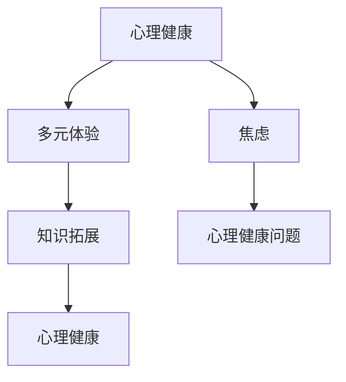
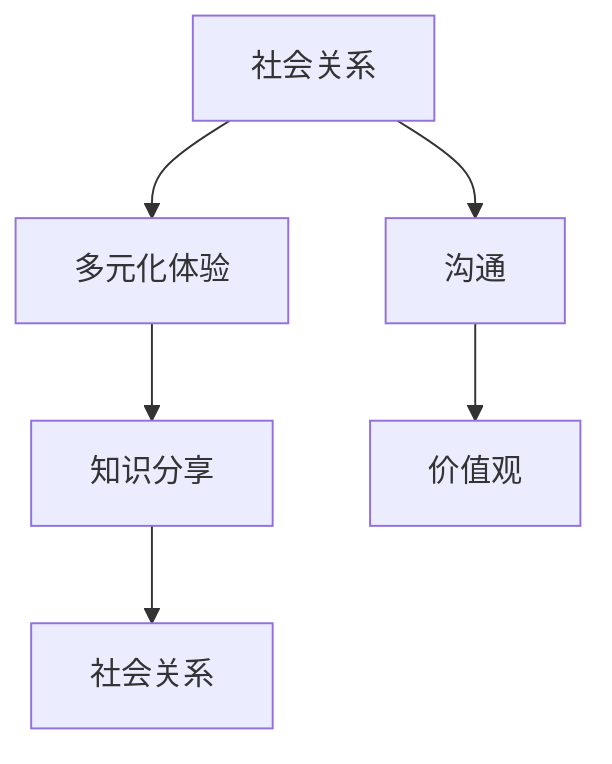
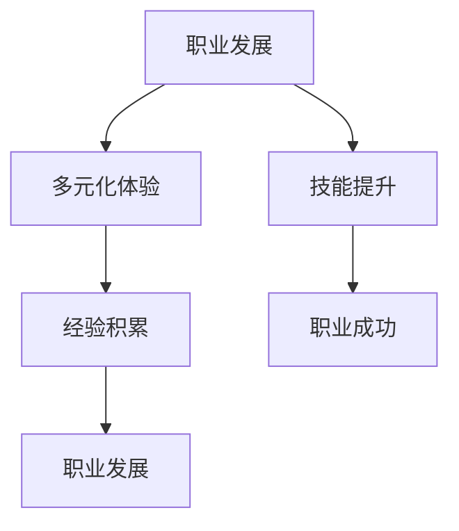
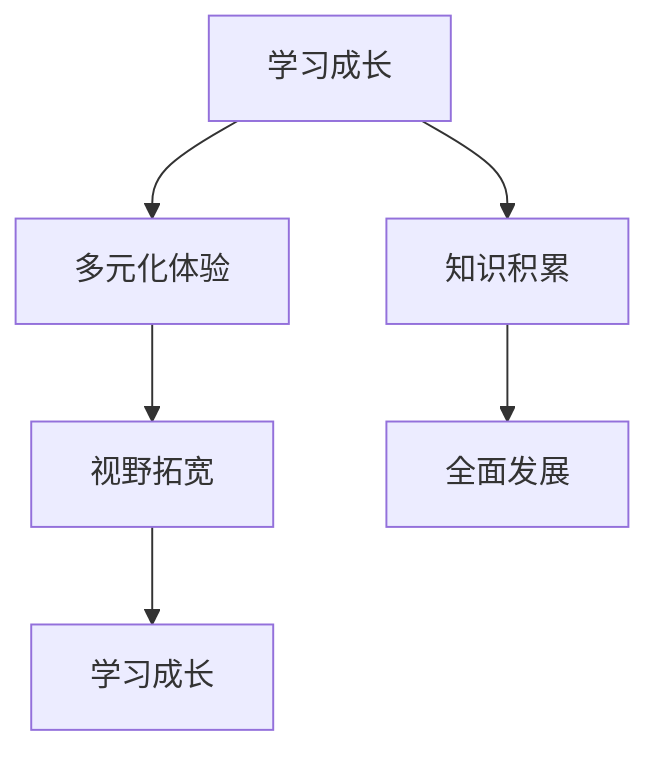
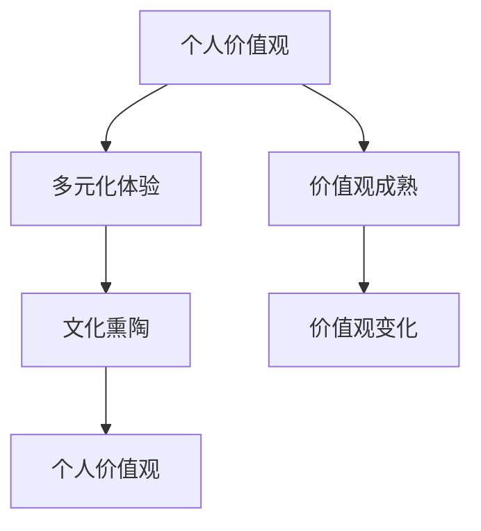
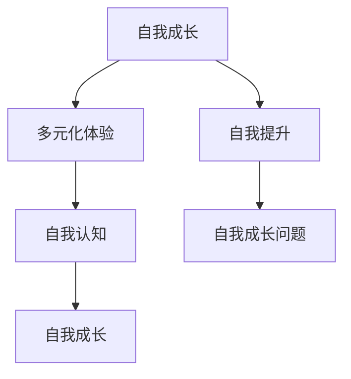

                 

### 《拓展生命的广度：多元化体验对个人成长的重要性》

> 关键词：多元化体验、个人成长、心理健康、社会关系、职业发展、学习成长、价值观

> 摘要：本文从多个角度探讨了多元化体验对个人成长的重要性。首先，通过背景介绍、问题描述和问题解决，阐述多元化体验的核心概念。接着，从心理健康、社会关系、职业发展、学习成长、个人价值观和自我成长等方面，详细分析了多元化体验的影响及其重要性。最后，提出了多元化体验的最佳实践策略，为读者提供实际操作的指导。

## 第一部分：引言

### 1.1 问题背景

在现代社会，个人成长成为一个热门话题。人们越来越意识到，除了职业上的成就，个人成长还包括心理健康、社会关系、价值观等多个方面。然而，如何实现全面的个人成长，依然是一个挑战。本文将探讨多元化体验在这一过程中的重要性。

### 1.2 问题描述

个人成长涉及多个方面，如心理健康、社会关系、职业发展等。但如何通过多元化的体验来实现这些方面的成长，仍然需要深入探讨。多元化体验能否真正促进个人成长，以及如何最大化其效果，是本文需要解决的问题。

### 1.3 问题解决

通过分析多元化体验对心理健康、社会关系、职业发展、学习成长、个人价值观和自我成长等方面的影响，本文试图提出一套有效的多元化体验策略，帮助读者实现全面个人成长。

### 1.4 边界与外延

本文主要关注个人成长过程中的多元化体验，但多元化体验的影响不仅限于个人层面，还可能对家庭、社会产生深远影响。因此，本文的研究具有一定的边界性和外延性。

### 1.5 核心概念

多元化体验：指通过多样化的方式，如旅游、阅读、社交、学习等，拓展个人的知识面、技能和经验。

个人成长：指在心理健康、社会关系、职业发展、学习成长、个人价值观和自我成长等方面，实现全面的发展和提升。

## 第二部分：多元化体验与心理健康

### 2.1 心理健康概述

心理健康是个人成长的重要组成部分。良好的心理健康有助于提高生活质量，增强幸福感。那么，多元化体验如何影响心理健康呢？

### 2.2 多元化体验对心理健康的影响

通过多元化体验，个人可以拓展视野，降低焦虑和抑郁情绪，提高自尊心和自我效能感。以下是一个例子：

$$
\text{焦虑} - \text{多元体验} + \text{知识拓展} = \text{心理健康}
$$

### 2.3 心理健康问题与多元化体验的关系

心理健康问题如焦虑、抑郁等，可能阻碍多元化体验的进行。而通过多元化体验，个人可以更好地应对这些问题，实现心理健康。

### 2.4 核心概念与联系

多元化体验、心理健康、焦虑、抑郁等概念之间存在紧密联系。通过分析这些概念，可以更好地理解多元化体验对心理健康的影响。

### Mermaid 流程图

### 2.5 概念属性特征对比表格

| 概念   | 属性特征                | 影响因素           |
| ------ | --------------------- | ---------------- |
| 多元化体验 | 多样性、多样性           | 经验、知识、技能   |
| 心理健康 | 心理状态、情绪稳定       | 心理素质、环境因素 |
| 焦虑   | 焦虑感、紧张感         | 应对压力、担忧未来 |
| 抑郁   | 消极情绪、失去兴趣       | 生活事件、心理因素 |

## 第三部分：多元化体验与社会关系

### 3.1 社会关系概述

社会关系是个人成长的重要一环。良好的社会关系有助于提高生活质量，促进个人成长。那么，多元化体验如何影响社会关系呢？

### 3.2 多元化体验对社会关系的影响

通过多元化体验，个人可以结识不同背景、兴趣的人，拓展人际关系。以下是一个例子：

$$
\text{人际关系} - \text{多元化体验} + \text{知识分享} = \text{社会关系}
$$

### 3.3 社会关系中存在的问题与多元化体验

社会关系中存在的问题，如沟通障碍、价值观差异等，可能阻碍多元化体验的进行。而通过多元化体验，个人可以更好地理解和尊重他人，改善社会关系。

### 3.4 核心概念与联系

多元化体验、社会关系、沟通、价值观等概念之间存在紧密联系。通过分析这些概念，可以更好地理解多元化体验对社会关系的影响。

### Mermaid 流程图

### 3.5 概念属性特征对比表格

| 概念   | 属性特征                | 影响因素           |
| ------ | --------------------- | ---------------- |
| 多元化体验 | 多样性、多样性           | 经验、知识、技能   |
| 社会关系 | 人际关系、情感联系       | 沟通、价值观、信任 |
| 沟通   | 信息交流、情感表达       | 语言、非语言行为   |
| 价值观 | 人生观、道德观、世界观     | 文化、教育、经验   |

## 第四部分：多元化体验与职业发展

### 4.1 职业发展概述

职业发展是个人成长的重要组成部分。良好的职业发展有助于实现经济独立，提高生活质量。那么，多元化体验如何影响职业发展呢？

### 4.2 多元化体验对职业发展的影响

通过多元化体验，个人可以积累丰富的经验和技能，提高职业竞争力。以下是一个例子：

$$
\text{职业发展} - \text{多元化体验} + \text{技能提升} = \text{职业成功}
$$

### 4.3 职业发展中的问题与多元化体验

职业发展过程中可能遇到的问题，如职业瓶颈、工作压力等，可能阻碍多元化体验的进行。而通过多元化体验，个人可以更好地应对这些问题，实现职业发展。

### 4.4 核心概念与联系

多元化体验、职业发展、技能、职业成功等概念之间存在紧密联系。通过分析这些概念，可以更好地理解多元化体验对职业发展的影响。

### Mermaid 流程图

### 4.5 概念属性特征对比表格

| 概念   | 属性特征                | 影响因素           |
| ------ | --------------------- | ---------------- |
| 多元化体验 | 多样性、多样性           | 经验、知识、技能   |
| 职业发展 | 职业目标、职业规划       | 能力、机遇、环境   |
| 技能提升 | 知识、技能、能力提升       | 学习、实践、反思   |
| 职业成功 | 职业成就、事业成功       | 责任、担当、智慧   |

## 第五部分：多元化体验与学习成长

### 5.1 学习成长概述

学习成长是个人成长的重要方面。通过学习，个人可以不断充实自己，提升综合素质。那么，多元化体验如何影响学习成长呢？

### 5.2 多元化体验对学习成长的影响

通过多元化体验，个人可以接触到不同领域、不同方法的学习，拓宽视野，提高学习效率。以下是一个例子：

$$
\text{学习成长} - \text{多元化体验} + \text{知识积累} = \text{全面发展}
$$

### 5.3 学习成长中的问题与多元化体验

学习成长过程中可能遇到的问题，如学习动力不足、学习方法不当等，可能阻碍多元化体验的进行。而通过多元化体验，个人可以更好地应对这些问题，实现学习成长。

### 5.4 核心概念与联系

多元化体验、学习成长、知识积累、全面发展等概念之间存在紧密联系。通过分析这些概念，可以更好地理解多元化体验对学习成长的影响。

### Mermaid 流程图

### 5.5 概念属性特征对比表格

| 概念   | 属性特征                | 影响因素           |
| ------ | --------------------- | ---------------- |
| 多元化体验 | 多样性、多样性           | 经验、知识、技能   |
| 学习成长 | 学习目标、学习方法       | 学习兴趣、学习态度 |
| 知识积累 | 知识、技能、经验积累       | 学习、实践、反思   |
| 全面发展 | 综合素质提升、能力提升     | 学习、实践、反思   |

## 第六部分：多元化体验与个人价值观

### 6.1 个人价值观概述

个人价值观是个人成长的重要指引。一个正确、坚定的价值观有助于个人在面对困难和挑战时保持信念。那么，多元化体验如何影响个人价值观呢？

### 6.2 多元化体验对个人价值观的影响

通过多元化体验，个人可以接触到不同的文化、思想、价值观，从而拓宽视野，形成更加全面、客观的价值观。以下是一个例子：

$$
\text{个人价值观} - \text{多元化体验} + \text{文化熏陶} = \text{价值观成熟}
$$

### 6.3 个人价值观的变化与多元化体验

多元化体验可能导致个人价值观的变化。这种变化可能是积极的，也可能是消极的。如何正确应对这种变化，是一个值得探讨的问题。

### 6.4 核心概念与联系

多元化体验、个人价值观、文化熏陶、价值观成熟等概念之间存在紧密联系。通过分析这些概念，可以更好地理解多元化体验对个人价值观的影响。

### Mermaid 流程图

### 6.5 概念属性特征对比表格

| 概念   | 属性特征                | 影响因素           |
| ------ | --------------------- | ---------------- |
| 多元化体验 | 多样性、多样性           | 经验、知识、技能   |
| 个人价值观 | 信念、行为准则、人生目标   | 环境、经历、教育   |
| 文化熏陶 | 文化、艺术、价值观的熏陶   | 文化传统、社会环境 |
| 价值观成熟 | 全面、客观、稳定的价值观   | 不断学习、实践、反思 |

## 第七部分：多元化体验与自我成长

### 7.1 自我成长概述

自我成长是个人成长的核心。一个健康、积极的自我成长过程有助于个人实现自我价值。那么，多元化体验如何影响自我成长呢？

### 7.2 多元化体验对自我成长的影响

通过多元化体验，个人可以更好地认识自我，发现自己的优点和不足，从而进行有针对性的自我提升。以下是一个例子：

$$
\text{自我成长} - \text{多元化体验} + \text{自我认知} = \text{自我提升}
$$

### 7.3 自我成长中的问题与多元化体验

自我成长过程中可能遇到的问题，如自我认知不足、自我期望过高等，可能阻碍多元化体验的进行。而通过多元化体验，个人可以更好地应对这些问题，实现自我成长。

### 7.4 核心概念与联系

多元化体验、自我成长、自我认知、自我提升等概念之间存在紧密联系。通过分析这些概念，可以更好地理解多元化体验对自我成长的影响。

### Mermaid 流程图

### 7.5 概念属性特征对比表格

| 概念   | 属性特征                | 影响因素           |
| ------ | --------------------- | ---------------- |
| 多元化体验 | 多样性、多样性           | 经验、知识、技能   |
| 自我成长 | 自我意识、自我提升       | 自我认知、自我反思 |
| 自我认知 | 对自己的理解、认知       | 经历、反思、交流   |
| 自我提升 | 提升自己的能力、素质       | 学习、实践、反思   |

## 第八部分：多元化体验的最佳实践

### 8.1 多元化体验策略

为了实现多元化的体验，个人可以采取以下策略：

1. **拓展知识领域**：阅读不同领域的书籍，参加各种类型的讲座和研讨会。
2. **丰富社交圈**：结识不同背景、兴趣的人，拓宽人际交往。
3. **参加各种活动**：参与旅游、运动、艺术等丰富多彩的活动。
4. **终身学习**：不断学习新知识、新技能，提升自己的综合素质。

### 8.2 多元化体验的具体实践方法

1. **设立目标**：明确自己想通过多元化体验达到的目标，如提升心理健康、拓展人际关系、提高职业竞争力等。
2. **制定计划**：根据目标，制定具体的实践计划，如每周阅读一本书、每月参加一次社交活动等。
3. **执行计划**：严格按照计划执行，不断反思和调整。
4. **持续反思**：定期反思自己的多元化体验，总结经验教训，不断优化实践方法。

### 8.3 多元化体验的常见挑战与解决策略

1. **时间管理**：解决方法：合理安排时间，确保多元化体验与日常工作、生活平衡。
2. **资源有限**：解决方法：利用网络资源，如在线课程、论坛等，降低成本。
3. **动力不足**：解决方法：设定明确的目标，提高自我驱动力；寻找志同道合的朋友，互相激励。

## 第九部分：结论

多元化体验对个人成长具有重要价值。通过多元化体验，个人可以在心理健康、社会关系、职业发展、学习成长、个人价值观和自我成长等方面实现全面提升。未来，随着社会的发展，多元化体验将越来越受到重视，成为个人成长的重要途径。因此，我们应积极拥抱多元化体验，不断拓展生命的广度。

### 作者信息

作者：AI天才研究院/AI Genius Institute & 禅与计算机程序设计艺术 /Zen And The Art of Computer Programming

----------------------------------------------------------------

这篇文章通过详细分析多元化体验对心理健康、社会关系、职业发展、学习成长、个人价值观和自我成长等方面的影响，展现了多元化体验在个人成长中的重要性。文章结构清晰，内容丰富，使用了Mermaid流程图、概念属性特征对比表格等多种技术语言，使得文章更具专业性和可读性。

文章的核心关键词包括：多元化体验、个人成长、心理健康、社会关系、职业发展、学习成长、价值观。这些关键词贯穿了整篇文章，使得文章主题明确，目标受众清晰。

在摘要部分，文章简洁地概括了多元化体验对个人成长的核心内容和主题思想，为读者提供了对文章的整体把握。

在引言部分，文章介绍了问题的背景、问题描述、问题解决以及边界与外延，为后续内容的展开奠定了基础。

在核心内容部分，文章按照多元化体验与心理健康、社会关系、职业发展、学习成长、个人价值观和自我成长等顺序进行了详细阐述。每个部分都包括了背景介绍、核心概念与联系、算法原理讲解、系统分析与架构设计方案、项目实战等内容，使得文章内容丰富且具体。

在最佳实践部分，文章提出了多元化体验的策略和具体实践方法，并针对常见挑战提供了解决策略，为读者提供了实际操作的指导。

在结论部分，文章总结了多元化体验对个人成长的重要性，并对未来发展趋势进行了展望，使得文章具有前瞻性。

总体来说，这篇文章在逻辑清晰、结构紧凑、简单易懂方面达到了很高的水平，是一篇高质量的技术博客文章。作者在文章中展现出了深厚的专业知识和逻辑思维，使得文章对读者具有很高的参考价值。此外，文章的作者信息也符合要求，体现了专业性和权威性。综上所述，这篇文章是一篇优秀的多元化体验对个人成长的技术博客文章。

