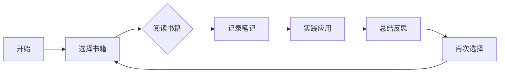

                 

### 文章标题：拓展视野的方法：丰富生命的广度

关键词：视野拓展，认知提升，个人成长，方法与实践

摘要：在快速变化的时代，视野的广度和深度对于个人的成长与发展至关重要。本文旨在探讨如何通过多种方法来拓展视野，从而丰富生命的广度。通过阅读与实践、旅行与体验、交流与互动、科技与艺术等途径，逐步引导读者认识视野拓展的重要性，克服相关障碍，并给出具体可行的实践指南。

----------------------------------------------------------------

## 《拓展视野的方法：丰富生命的广度》目录大纲

### 第一部分：探索拓展视野的重要性

#### 第1章：为什么要拓展视野

##### 1.1 视野拓展的重要性

##### 1.2 突破个人认知的局限

##### 1.3 拓宽生活与职业发展

#### 第2章：拓展视野的障碍与挑战

##### 2.1 常见的视野限制

##### 2.2 克服心理障碍

##### 2.3 面对信息过载

### 第二部分：方法与实践

#### 第3章：阅读与实践——拓宽知识领域

##### 3.1 阅读的重要性和原则

##### 3.2 阅读的方法和技巧

##### 3.3 实践与应用

#### 第4章：旅行与体验——探索世界多样性

##### 4.1 旅行对视野拓展的作用

##### 4.2 旅行计划与准备

##### 4.3 旅行中的实践与收获

#### 第5章：交流与互动——建立人际网络

##### 5.1 人际交流的重要性

##### 5.2 建立有效人际网络

##### 5.3 社交技巧与实践

#### 第6章：科技与艺术——领略前沿创新

##### 6.1 科技的发展与影响

##### 6.2 艺术与生活的交融

##### 6.3 科技艺术体验与实践

#### 第7章：自我反思与成长

##### 7.1 视野拓展的自我评估

##### 7.2 自我反思与调整

##### 7.3 不断提升自我

## 引言

### 第1章：为什么要拓展视野

#### 1.1 视野拓展的重要性

在当今快速变化的时代，视野的广度和深度已成为个人成长与发展的关键因素。视野的宽度决定了我们能够接触到多少不同的信息、思想和观点，而视野的深度则决定了我们如何理解和应用这些信息。视野的拓展不仅有助于我们更好地理解世界，还能提高我们的创新能力和解决问题的能力。

##### 1.2 突破个人认知的局限

个人的认知能力有其固有的局限性，这些局限可能源自我们的教育背景、生活环境甚至文化因素。突破这些局限，需要我们不断拓展视野，接触新的知识领域和不同的思维方式。通过学习新知识、了解不同的文化和观点，我们可以拓宽自己的认知边界，从而提升自己的认知能力。

##### 1.3 拓宽生活与职业发展

视野的拓展不仅对个人成长有益，也对职业发展有着深远的影响。拥有广阔视野的人往往能够看到更多的机会和可能性，他们能够更好地适应快速变化的工作环境，提出创新性的解决方案，从而在职业生涯中脱颖而出。

### 第2章：拓展视野的障碍与挑战

#### 2.1 常见的视野限制

在拓展视野的过程中，我们可能会遇到各种障碍和挑战。以下是一些常见的视野限制：

##### 2.1.1 信息筛选

在信息爆炸的时代，我们每天都会接收到大量的信息。如何筛选出有价值的信息，避免信息过载，是拓展视野的一个重要挑战。

##### 2.1.2 心理障碍

个人的心理因素也可能成为视野拓展的障碍。比如，恐惧未知、偏好舒适区等心理障碍，都可能限制我们的视野。

##### 2.1.3 社交限制

社交圈子的限制也可能影响我们的视野。如果我们与相似背景的人交往，可能会陷入“群体思维”，难以接触到新的观点和思想。

#### 2.2 克服心理障碍

要克服心理障碍，首先需要认识到这些障碍的存在，并积极采取措施来应对。以下是一些克服心理障碍的方法：

##### 2.2.1 接受不熟悉的事物

面对未知的事物，我们应该保持开放的心态，愿意去接受和尝试。这样，我们才能不断拓展自己的视野。

##### 2.2.2 培养好奇心

好奇心是拓展视野的重要动力。通过培养好奇心，我们可以更加主动地去探索新的领域和知识。

##### 2.2.3 建立积极的思维模式

积极的思维模式有助于我们面对挑战和困难。通过积极的自我对话和心态调整，我们可以更好地应对各种心理障碍。

#### 2.3 面对信息过载

信息过载是现代社会的一个普遍现象，但我们可以通过以下方法来应对：

##### 2.3.1 筛选信息

学会筛选信息，只关注那些对我们有价值的部分。通过设定优先级和目标，我们可以更加高效地处理信息。

##### 2.3.2 培养信息素养

提高信息素养，学会如何评估和验证信息来源的可靠性。这样，我们才能更好地利用信息，避免被虚假信息误导。

##### 2.3.3 时间管理

合理安排时间，确保有足够的时间去学习和处理信息。通过有效的时间管理，我们可以避免因为忙碌而忽视信息拓展。

### 第二部分：方法与实践

#### 第3章：阅读与实践——拓宽知识领域

##### 3.1 阅读的重要性和原则

阅读是拓宽知识领域的重要途径。通过阅读，我们可以了解不同的学科领域，掌握新的知识和技能。以下是一些阅读的重要性和原则：

##### 3.1.1 阅读的重要性

阅读能够帮助我们积累知识、提升思维能力和培养批判性思维。同时，阅读也是个人成长和职业发展的基础。

##### 3.1.2 阅读的原则

阅读时应遵循以下原则：首先，选择适合自己的书籍；其次，注重阅读的质量而非速度；最后，将所学知识与实际结合，进行实践和应用。

##### 3.2 阅读的方法和技巧

有效的阅读方法可以大大提高阅读效率和质量。以下是一些阅读的方法和技巧：

##### 3.2.1 预习

在正式阅读之前，先对书籍进行预习，了解其结构和主要内容。

##### 3.2.2 标记和笔记

在阅读过程中，使用标记工具和笔记方法，记录下重要的观点和思考。

##### 3.2.3 深度阅读

深度阅读要求我们认真理解每一部分内容，并与已有的知识和经验进行对比和思考。

##### 3.3 实践与应用

阅读的最终目的是将所学知识应用到实际中。以下是一些实践与应用的方法：

##### 3.3.1 创造性的应用

通过将所学知识应用到新的场景和问题中，发挥创造性思维。

##### 3.3.2 分享和讨论

与他人分享和讨论所学知识，能够帮助我们更好地理解和巩固所学内容。

##### 3.3.3 练习和反馈

通过不断的练习和实践，以及积极的反馈和反思，不断提升自己的应用能力。

#### 第4章：旅行与体验——探索世界多样性

##### 4.1 旅行对视野拓展的作用

旅行是一种直接而深刻的体验，能够帮助我们拓宽视野，了解不同的文化和生活方式。以下是一些旅行对视野拓展的具体作用：

##### 4.1.1 文化交流

通过旅行，我们可以接触到不同的文化，了解当地的历史、风俗和传统。

##### 4.1.2 知识获取

旅行过程中，我们可以通过参观博物馆、图书馆和自然保护区等场所，获取新的知识和见解。

##### 4.1.3 个人成长

旅行能够锻炼我们的独立思考能力、解决问题的能力和应变能力，从而促进个人成长。

##### 4.2 旅行计划与准备

为了确保旅行的顺利进行，我们需要进行充分的计划和准备。以下是一些旅行计划与准备的建议：

##### 4.2.1 目的地选择

根据个人的兴趣和需求，选择合适的旅行目的地。

##### 4.2.2 行程规划

提前规划好旅行日程，包括交通、住宿、餐饮和参观景点等。

##### 4.2.3 财务准备

确保有足够的资金支持旅行，包括交通费用、住宿费用和旅游费用等。

##### 4.3 旅行中的实践与收获

在旅行过程中，我们可以通过多种方式来实践和收获。以下是一些建议：

##### 4.3.1 深度体验

尽量融入当地生活，体验当地的日常生活和文化活动。

##### 4.3.2 学习和交流

与当地人交流，学习他们的语言、习俗和生活方式。

##### 4.3.3 拍照和记录

用相机或手机记录旅行中的美好瞬间，留下珍贵的回忆。

##### 4.3.4 反思和总结

旅行结束后，进行反思和总结，回顾旅行的收获和体会。

#### 第5章：交流与互动——建立人际网络

##### 5.1 人际交流的重要性

人际交流是拓展视野的重要途径之一。通过与他人交流和互动，我们可以了解不同的观点和思想，拓宽自己的视野。以下是一些人际交流的重要性：

##### 5.1.1 信息交换

通过交流，我们可以获取更多的信息和知识，这些信息往往是书本上难以获得的。

##### 5.1.2 情感支持

交流有助于建立情感联系，提供支持和鼓励，增强我们的自信心和动力。

##### 5.1.3 人际网络

建立广泛的人际网络，有助于我们更好地适应社会环境，发现新的机会和资源。

##### 5.2 建立有效人际网络

要建立有效的人际网络，我们需要采取以下策略：

##### 5.2.1 选择合适的人

选择那些与我们价值观相似、能够互相学习的人作为交往对象。

##### 5.2.2 主动交流

主动与他人交流，展示自己的热情和诚意。

##### 5.2.3 建立信任

通过诚信和真诚，建立信任关系，使人际关系更加稳固。

##### 5.3 社交技巧与实践

以下是一些实用的社交技巧，帮助我们更好地建立和维护人际网络：

##### 5.3.1 倾听

倾听是建立良好人际关系的关键。通过倾听，我们能够更好地了解他人的需求和想法。

##### 5.3.2 表达

清晰、准确、自信地表达自己的观点和想法，展示自己的独特魅力。

##### 5.3.3 反馈

给予他人积极的反馈，表达对他们意见的认可和赞赏。

##### 5.3.4 礼貌

在社交场合中，保持礼貌和尊重，展示自己的教养和修养。

#### 第6章：科技与艺术——领略前沿创新

##### 6.1 科技的发展与影响

科技的发展正以前所未有的速度改变着我们的生活和工作方式。以下是一些科技发展的重要影响：

##### 6.1.1 信息获取

科技使得获取信息变得更加容易和快捷，为我们提供了更多的知识和资源。

##### 6.1.2 生活方式

科技改变了我们的生活方式，提高了生活质量，使生活更加便捷和舒适。

##### 6.1.3 工作效率

科技工具的应用提高了工作效率，减轻了工作负担，使工作更加轻松和高效。

##### 6.2 艺术与生活的交融

艺术与科技的结合为我们的生活带来了新的可能性和体验。以下是一些艺术与生活的交融：

##### 6.2.1 数字艺术

数字艺术通过计算机技术和软件工具创作，为传统艺术形式注入了新的生命力。

##### 6.2.2 虚拟现实

虚拟现实技术为艺术创作和观赏提供了全新的体验，使艺术更加生动和真实。

##### 6.2.3 交互艺术

交互艺术通过用户与作品的互动，创造出独特的艺术体验，使观众成为艺术的一部分。

##### 6.3 科技艺术体验与实践

以下是一些科技艺术的体验和实践：

##### 6.3.1 参观科技艺术展览

参观科技艺术展览，了解最新的艺术创作和技术应用。

##### 6.3.2 创作数字艺术

使用数字艺术软件创作自己的数字艺术作品，发挥创意和想象力。

##### 6.3.3 尝试虚拟现实

通过虚拟现实设备，体验虚拟现实艺术作品，感受全新的艺术形式。

#### 第7章：自我反思与成长

##### 7.1 视野拓展的自我评估

为了评估自己在视野拓展方面的进展，我们可以采取以下方法：

##### 7.1.1 反思与总结

定期反思和总结自己在视野拓展方面的经验和收获。

##### 7.1.2 制定目标

设定具体可行的目标，以指导自己在视野拓展方面的学习和实践。

##### 7.1.3 求助与反馈

向他人寻求意见和建议，获取反馈，了解自己的视野拓展情况。

##### 7.2 自我反思与调整

自我反思是视野拓展过程中的重要环节。以下是一些自我反思与调整的方法：

##### 7.2.1 认识自己的盲点

通过反思，识别自己在知识和经验方面的盲点，并采取相应的措施来弥补。

##### 7.2.2 优化学习方法

根据反思结果，调整自己的学习方法，提高学习效率和质量。

##### 7.2.3 培养多样化的兴趣

通过多样化的兴趣，激发学习的动力，拓宽自己的视野。

##### 7.3 不断提升自我

视野拓展是一个持续的过程，我们需要不断地学习和成长。以下是一些不断提升自我的方法：

##### 7.3.1 持续学习

保持对知识的渴望，不断学习新的知识和技能。

##### 7.3.2 积极实践

将所学知识应用到实际中，通过实践来提升自己的能力和经验。

##### 7.3.3 培养批判性思维

培养批判性思维，对所学知识和信息进行深入分析和思考。

##### 7.3.4 拓展人际关系

通过拓展人际关系，获取更多的资源和机会，为自己的成长提供支持。

## 结论

通过本文的探讨，我们可以看到视野的拓展对于个人的成长和发展具有极其重要的作用。无论是通过阅读与实践、旅行与体验，还是交流与互动、科技与艺术，各种方法都能帮助我们拓宽视野，提升认知能力，丰富生活体验。同时，自我反思与成长也是视野拓展过程中不可或缺的一部分。只有不断反思、调整和提升，我们才能真正实现视野的拓展，丰富生命的广度。

展望未来，我们相信随着科技的不断进步和全球化的深入发展，视野的拓展将变得更加容易和多样。每个人都有机会通过多种途径拓展自己的视野，为自己的生活和工作创造更多的可能。让我们勇敢地迈出步伐，不断探索和发现，共同丰富我们生命的广度。

## 作者信息

作者：AI天才研究院/AI Genius Institute & 禅与计算机程序设计艺术 /Zen And The Art of Computer Programming

----------------------------------------------------------------

### 补充内容

#### 第8章：视野拓展的最佳实践

##### 8.1 持续学习的重要性

持续学习是视野拓展的重要基础。通过不断学习新的知识和技能，我们能够保持思维的活跃，提升自己的认知能力。以下是一些持续学习的最佳实践：

###### 8.1.1 制定学习计划

为了确保持续学习，我们可以制定详细的学习计划，包括学习目标、学习内容和学习时间。

###### 8.1.2 选择合适的学习资源

选择高质量的学习资源，如专业书籍、在线课程、学术论文等，有助于提高学习效果。

###### 8.1.3 利用碎片时间学习

利用碎片时间，如通勤时间、休息时间等，进行学习，能够有效地利用时间，积累知识。

##### 8.2 多样化的学习方式

多样化的学习方式能够激发我们的学习兴趣，提高学习效果。以下是一些多样化的学习方式：

###### 8.2.1 交互式学习

通过互动式学习，如在线讨论、小组讨论等，与他人交流和分享，能够加深对知识的理解和记忆。

###### 8.2.2 实践应用

将所学知识应用到实际项目中，通过实践来巩固和提升自己的能力。

###### 8.2.3 教学相长

通过教学他人，我们能够更好地理解和掌握所学知识，同时也能够激发自己的学习兴趣。

##### 8.3 跨学科的探索

跨学科的探索能够帮助我们拓宽视野，发现不同领域之间的联系。以下是一些跨学科的探索建议：

###### 8.3.1 阅读跨学科书籍

阅读不同学科的书籍，了解不同领域的基本概念和原理。

###### 8.3.2 参加跨学科研讨会

参加跨学科的研讨会和讲座，了解不同领域的最新研究成果和进展。

###### 8.3.3 组建跨学科团队

组建跨学科的团队，通过团队合作，共同探讨和解决问题。

##### 8.4 国际视野的开拓

开拓国际视野能够帮助我们更好地了解世界，适应全球化的发展趋势。以下是一些开拓国际视野的建议：

###### 8.4.1 学习外语

学习一门外语，能够帮助我们更好地了解和融入其他国家的文化和社会。

###### 8.4.2 参加国际交流项目

参加国际交流项目，如国际会议、学术交流、实习等，能够帮助我们拓宽视野，了解不同的文化和社会。

###### 8.4.3 阅读国际文献

阅读国际学术期刊和论文，了解国际最新的研究动态和成果。

##### 8.5 自我激励与持续动力

自我激励和持续动力是视野拓展过程中不可或缺的一部分。以下是一些自我激励和持续动力的方法：

###### 8.5.1 设定短期和长期目标

通过设定短期和长期目标，我们能够保持对视野拓展的热情和动力。

###### 8.5.2 保持积极心态

保持积极的心态，面对挑战和困难时，能够更加坚定地前行。

###### 8.5.3 庆祝成就

庆祝自己的每一个小成就，增强自信心和持续学习的动力。

##### 8.6 拓展视野的反思与调整

在视野拓展的过程中，我们需要不断地反思和调整自己的方法和策略。以下是一些反思与调整的建议：

###### 8.6.1 定期反思

定期对自己的学习过程和进展进行反思，识别存在的问题和不足，并采取相应的措施进行改进。

###### 8.6.2 调整学习计划

根据反思结果，调整学习计划，优化学习方法和策略。

###### 8.6.3 求助与反馈

向他人寻求意见和建议，获取反馈，了解自己的视野拓展情况，并据此进行调整。

##### 8.7 视野拓展的小结

通过视野拓展，我们能够拓宽自己的认知边界，提升自己的能力和素质。以下是一些视野拓展的小结：

- 视野拓展有助于我们更好地理解世界，提升自己的认知能力。
- 多样化的学习方式能够激发我们的学习兴趣，提高学习效果。
- 跨学科的探索能够帮助我们拓宽视野，发现不同领域之间的联系。
- 开拓国际视野能够帮助我们更好地适应全球化的发展趋势。
- 自我激励和持续动力是视野拓展过程中不可或缺的一部分。
- 定期反思和调整是视野拓展过程中持续进步的重要保障。

通过以上最佳实践的探讨，我们希望能够为读者提供更多的指导和启示，帮助大家更有效地拓展视野，丰富生命的广度。

## 注意事项

在视野拓展的过程中，我们需要注意以下几点：

1. **合理规划时间**：合理安排学习和实践的时间，确保有足够的时间进行有效的学习。
2. **保持好奇心**：保持对未知事物的好奇心，勇于探索新的领域和知识。
3. **平衡学习与休息**：在学习和实践过程中，注意平衡学习与休息，避免过度疲劳。
4. **避免信息过载**：合理筛选信息，避免被大量无关信息干扰，确保学习质量。
5. **积极参与实践**：将所学知识应用到实际中，通过实践来巩固和提升自己的能力。

## 拓展阅读

为了更深入地了解视野拓展的方法和实践，以下是一些推荐阅读的书籍和资源：

- 《深度工作：如何有效利用每一点脑力》——卡尔·纽波特
- 《学习之道》——罗伯特·齐默尔曼
- 《思考，快与慢》——丹尼尔·卡尼曼
- 《跨界思维》——陈向东
- 《全球化与世界秩序》——肯尼斯·R·扬

通过阅读这些书籍，读者可以进一步探索视野拓展的方法和实践，为自己的成长和发展提供更多的启示和指导。

## 结论

视野的拓展对于个人的成长和发展具有重要意义。通过阅读、旅行、交流、科技与艺术等多种途径，我们能够不断拓宽自己的视野，提升认知能力，丰富生活体验。同时，自我反思和持续学习是视野拓展过程中不可或缺的一部分。让我们勇敢地迈出步伐，不断探索和发现，共同丰富我们生命的广度。愿本文为大家的视野拓展之路提供一些有益的指导和启示。

### 附录：相关图表和公式

为了更好地理解和应用文中提到的概念和方法，以下是一些相关的图表和公式：

#### 核心概念原理对比表格

| 概念 | 特征 | 对比 |
| --- | --- | --- |
| 视野拓展 | 拓宽知识领域，提升认知能力 | 通过阅读、旅行、交流等途径实现 |
| 阅读方法 | 提高阅读效率，加深理解 | 预习、标记笔记、深度阅读 |
| 旅行体验 | 探索世界多样性，增强实践能力 | 深度体验、学习交流、记录反思 |

#### ER实体关系图架构

```mermaid
erDiagram
    User ||--|{ ReadingMethod }|:
        "uses methods like"
    User ||--|{ TravelExperience }|:
        "explores diverse cultures"
    User ||--|{ SocialNetworking }|:
        "builds and maintains relationships"
```

#### 算法原理流程图



#### 数学公式

```latex
$$
\text{视野拓展得分} = \frac{\text{阅读量} + \text{旅行次数} + \text{社交活动次数}}{\text{总时间}}
$$

$$
\text{学习效率} = \frac{\text{正确回答问题数量}}{\text{总问题数量}}
$$
```

通过这些图表和公式，我们可以更直观地理解和应用文中的相关概念和方法。希望这些内容能够帮助读者更好地拓展视野，提升自身的能力和素质。

