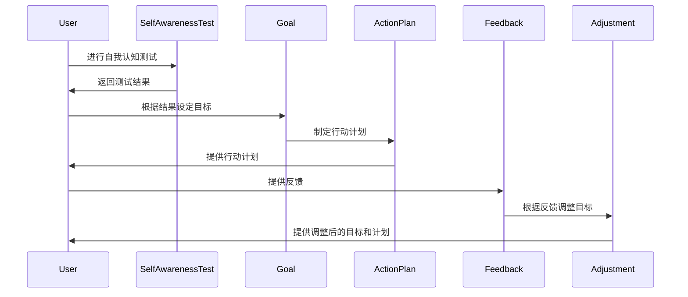
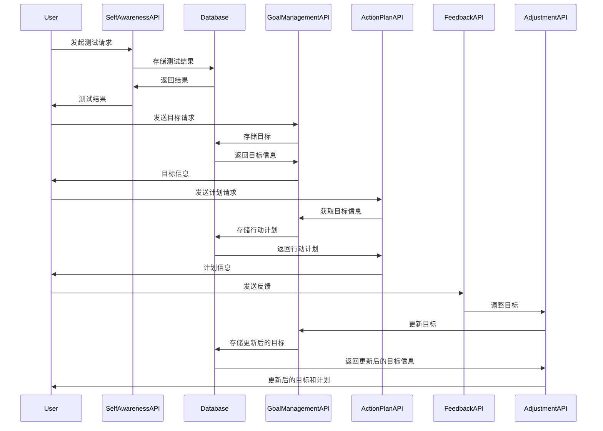

                 

### 掌控人生方向：成为自己的生命舵手

在快速变化的现代社会，人生的方向感显得尤为重要。无论是职业发展，还是个人成长，没有一个明确的方向都可能导致迷茫和困惑。如何找到并保持人生的方向，成为每个人都需要面对的重要课题。本文将探讨这一主题，以帮助读者掌控自己的人生方向，成为自己的生命舵手。

**关键词**：人生方向、自我认知、目标设定、行动计划、持续调整

**摘要**：本文旨在通过深入探讨自我认知、目标设定、行动计划以及持续调整的重要性，帮助读者理解并掌握如何掌控人生方向。我们将详细分析各个关键步骤，并给出实用的实践建议，帮助读者在实际生活中更好地应用这些理念，成为自己的生命舵手。

## 第一部分：引言与核心概念

### 1.1 问题背景与核心概念

#### 1.1.1 问题背景

在当今社会，人们面临着前所未有的选择和机遇。然而，这种多样性和自由度也带来了困扰。很多人在职业选择、生活方式、人生规划等方面感到迷茫，缺乏明确的方向。这种方向感的缺失不仅影响个人的幸福感，还会影响到职业发展和社会贡献。

#### 1.1.2 核心概念介绍

为了解决这一问题，我们需要了解几个核心概念：

- **生命舵手**：指那些能够自我认知、设定明确目标、制定并执行行动计划，并能根据实际情况进行调整的人。他们是自己人生的决策者和主导者。

- **自我认知**：指对自身性格、兴趣、优势和劣势的深入理解。

- **目标设定**：指确定长期和短期目标，并确保这些目标具备可实现性和相关性。

- **行动计划**：指制定具体的行动步骤，以实现设定的目标。

- **持续调整**：指在实践过程中根据反馈和环境变化，不断调整目标和计划。

#### 1.1.3 边界与外延

- **个人成长**与**职业发展**的关系：个人成长是职业发展的基础，而职业发展则是个人成长的重要体现。

- **外部环境**对个人决策的影响：外部环境的变化会影响个人的目标和计划，需要灵活调整。

#### 1.1.4 核心要素组成

- **自我认知工具**：如心理测试、自我反思等，可以帮助人们更好地认识自己。

- **目标设定技巧**：如SMART目标、SMARTER目标等，帮助人们更科学地设定目标。

- **行动计划方法**：如GTD（Getting Things Done）、PDCA循环等，帮助人们更有效地执行计划。

- **持续调整**：指通过定期回顾和反馈机制，根据实际情况调整目标和计划。

#### 1.1.5 本章小结

- **关键要点回顾**：自我认知的重要性、目标设定的原则、行动计划的方法、持续调整的必要性。

- **实践建议**：结合个人情况，尝试使用不同的自我认知工具和目标设定方法，制定具体的行动计划，并根据实际情况进行调整。

## 第二部分：自我认知

### 2.1 自我认知的重要性

#### 2.1.1 自我认知的概念

自我认知是指一个人对自己性格、兴趣、能力和价值的理解。它是心理学中的一个重要概念，对个人的成长和发展有着深远的影响。

#### 2.1.2 自我认知对人生方向的重要性

自我认知是掌控人生方向的基础。只有了解自己，才能找到适合自己的发展方向，避免盲目跟风或随波逐流。

### 2.2 自我认知工具

#### 2.2.1 心理测试

心理测试是一种常用的自我认知工具，可以帮助人们了解自己的性格类型、行为模式和心理需求。常用的心理测试包括MBTI（性格类型指标）和DISC（行为风格指标）等。

#### 2.2.2 自我反思

自我反思是一种通过思考和记录来深入理解自己的方法。通过写日记、思考问题等方式，可以帮助人们更清晰地认识到自己的优点和不足。

### 2.3 自我认知案例分析

#### 2.3.1 成功人士的自我认知案例

成功人士往往有着深刻的自我认知。他们了解自己的优势和劣势，能够根据自身特点设定合理的目标，并制定相应的行动计划。

#### 2.3.2 失败案例中的自我认知问题

一些人在失败中往往缺乏自我认知，他们可能没有真正了解自己的能力和兴趣，导致目标设定不切实际或行动计划执行不力。

### 2.4 自我认知实践

#### 2.4.1 如何进行自我反思

1. 每天花时间思考自己的行为和感受。
2. 定期记录自己的经历和反思。
3. 与他人交流，听取他们的意见和建议。

#### 2.4.2 如何利用心理测试结果

1. 了解自己的性格类型和行为模式。
2. 根据测试结果，设定适合自己的目标。
3. 在实践中检验测试结果的准确性，并不断调整。

### 2.5 本章小结

- **关键要点回顾**：自我认知的重要性、自我认知工具的使用方法、自我认知案例分析。

- **实践建议**：尝试使用不同的自我认知工具，定期进行自我反思，并根据测试结果调整自己的目标和计划。

## 第三部分：目标设定

### 3.1 目标设定的原则

目标设定是掌控人生方向的关键一步。科学的目标设定方法可以帮助我们更好地规划未来，提高行动的效率。

#### 3.1.1 SMART目标

SMART目标是一种广泛使用的目标设定方法，它要求目标具备以下五个特征：

- **具体（Specific）**：目标要明确、具体，避免模糊和宽泛。
- **可衡量（Measurable）**：目标要有明确的衡量标准，便于评估进度和效果。
- **可实现（Achievable）**：目标要具有可行性，避免过于理想化。
- **相关（Relevant）**：目标要与个人价值观和长期规划相符。
- **时限（Time-bound）**：目标要设定明确的完成时间。

#### 3.1.2 SMARTER目标

SMARTER目标是SMART目标的扩展，它增加了两个要素：

- **评价标准（Evaluated）**：目标设定后，要有明确的评价标准，以便在完成后进行评估。
- **可回顾（Reviewed）**：目标设定后，要定期回顾，根据实际情况进行调整。

### 3.2 设定长期目标

#### 3.2.1 长期目标的重要性

长期目标是人生规划的重要组成部分。它可以帮助我们明确长期发展方向，为短期目标提供指导。

#### 3.2.2 长期目标的设定方法

1. **明确长期目标**：思考自己想要实现的长期目标，如职业发展、家庭生活、财务状况等。

2. **分解长期目标**：将长期目标分解为具体的短期目标，便于实施和跟踪。

3. **设定时间框架**：为每个长期目标设定一个完成时间，确保目标的时限性。

### 3.3 设定短期目标

#### 3.3.1 短期目标的作用

短期目标是实现长期目标的桥梁。它可以帮助我们分解大目标，使任务更加具体和可操作。

#### 3.3.2 短期目标的设定技巧

1. **具体明确**：确保短期目标具体、明确，避免模糊和宽泛。

2. **与长期目标相关**：短期目标要与长期目标保持一致，避免偏离。

3. **设定时间限制**：为短期目标设定明确的完成时间，提高执行力。

### 3.4 目标调整与修正

#### 3.4.1 目标调整的必要性

外部环境和自身情况的变化可能导致目标设定的不合理，因此需要定期调整目标。

#### 3.4.2 目标修正的方法

1. **定期回顾**：定期回顾目标和进度，评估目标的实现情况。

2. **调整目标**：根据实际情况，对目标进行必要的调整，使其更符合当前环境和个人需求。

3. **设定新的目标**：在调整现有目标的同时，设定新的目标，确保持续进步。

### 3.5 目标设定实践

#### 3.5.1 如何使用SMART目标设定方法

1. **明确目标**：确定具体的、可衡量的、可实现、相关并具有时限性的目标。

2. **制定行动计划**：为每个目标制定具体的行动计划，确保目标的实现。

3. **跟踪进度**：定期跟踪目标的进度，及时调整和修正。

#### 3.5.2 如何使用SMARTER目标设定方法

1. **设定评价标准**：为每个目标设定明确的评价标准，以便在完成后进行评估。

2. **定期回顾**：定期回顾目标的实现情况，根据实际情况进行调整。

3. **回顾与总结**：在目标完成后，回顾和总结经验教训，为未来设定新的目标提供参考。

### 3.6 本章小结

- **关键要点回顾**：目标设定的原则、长期目标的设定方法、短期目标的设定技巧、目标调整与修正的方法。

- **实践建议**：根据个人情况，尝试使用SMART或SMARTER目标设定方法，制定具体的行动计划，并根据实际情况进行调整。

## 第四部分：行动计划

### 4.1 行动计划的定义

行动计划是一系列具体、可操作的步骤，用于实现设定的目标。它是将目标转化为行动的重要工具。

#### 4.1.1 行动计划的重要性

- **实现目标**：行动计划是将目标具体化的过程，有助于明确任务和责任，确保目标的实现。
- **提高效率**：通过制定行动计划，可以合理安排时间和资源，提高工作效率。
- **增强执行力**：行动计划提供了明确的行动指南，有助于增强个人的执行力。

### 4.2 行动计划的方法

#### 4.2.1 GTD（Getting Things Done）

GTD是一种高效的时间管理方法，通过以下步骤实现任务管理：

1. **收集**：将所有需要处理的事项记录下来，不管大小。
2. **整理**：将收集的事项进行分类和整理，明确每个任务的优先级。
3. **组织**：将整理后的任务放入不同的任务篮子中，确保易于查找和操作。
4. **回顾**：定期回顾任务篮子，确保所有任务都得到处理。

#### 4.2.2 PDCA循环

PDCA循环是一种管理工具，用于持续改进和优化。它包括以下四个步骤：

1. **计划（Plan）**：设定目标和制定行动计划。
2. **执行（Do）**：执行行动计划，实施任务。
3. **检查（Check）**：检查执行结果，与预期目标进行比较。
4. **行动（Action）**：根据检查结果，进行必要的调整和改进。

### 4.3 时间管理

时间管理是行动计划的重要环节，通过合理安排时间，可以提高工作效率和生活质量。

#### 4.3.1 时间管理原则

1. **优先级排序**：将任务按照优先级排序，确保重要且紧急的任务优先处理。
2. **合理分配时间**：为每个任务分配适当的时间，避免过度加班或拖延。
3. **避免时间浪费**：识别和消除时间浪费的行为，如无效会议、社交媒体等。

#### 4.3.2 时间管理工具

- **番茄工作法**：将工作时间划分为25分钟的工作周期，每个周期后休息5分钟。
- **时间追踪工具**：如Toggl、RescueTime等，帮助用户记录和分析时间使用情况。

### 4.4 如何执行行动计划

#### 4.4.1 分解任务

将大任务分解为小任务，使其更具体、可操作，便于执行。

#### 4.4.2 优先级排序

根据任务的紧急程度和重要性，对其进行优先级排序，确保关键任务得到优先处理。

#### 4.4.3 克服拖延

识别拖延的原因，并采取相应措施克服拖延，如设定明确的截止日期、激励自己等。

### 4.5 行动计划实践

#### 4.5.1 如何使用GTD进行时间管理

1. **收集任务**：将所有任务记录在任务清单中。
2. **整理任务**：将任务分类，明确每个任务的优先级。
3. **组织任务**：将任务放入不同的任务篮子，确保易于查找和操作。
4. **回顾任务**：定期回顾任务清单，确保所有任务都得到处理。

#### 4.5.2 如何使用PDCA循环执行任务

1. **计划**：设定目标和制定行动计划。
2. **执行**：执行行动计划，实施任务。
3. **检查**：检查执行结果，与预期目标进行比较。
4. **行动**：根据检查结果，进行必要的调整和改进。

### 4.6 本章小结

- **关键要点回顾**：行动计划的重要性、GTD和PDCA循环的方法、时间管理原则和工具、如何执行行动计划。
- **实践建议**：结合个人实际情况，尝试使用GTD或PDCA循环制定行动计划，并合理安排时间，提高工作效率。

## 第五部分：持续调整

### 5.1 调整的重要性

人生不是一成不变的，外部环境和内在需求都在不断变化。因此，调整人生方向是必要的。持续调整有助于适应变化，保持目标与实际情况的一致性。

#### 5.1.1 人生方向为何需要调整

- **环境变化**：社会、经济、技术等因素的变化会影响个人的发展方向。
- **个人成长**：随着时间的推移，个人的认知、能力和价值观也在不断变化。
- **需求变化**：个人的需求和愿望可能会随着生活经历和成长而改变。

#### 5.1.2 调整与坚持的平衡

调整并不意味着放弃，而是在坚持目标的基础上，根据实际情况进行调整。合理的调整可以更好地实现目标，而盲目坚持可能导致目标难以达成。

### 5.2 调整的方法

#### 5.2.1 定期回顾

定期回顾是调整人生方向的重要步骤。通过回顾，可以了解目标的实现情况，发现问题并采取相应措施。

1. **设定回顾周期**：如每月、每季度或每年，根据实际情况选择合适的周期。
2. **评估目标实现情况**：与预期目标进行比较，分析差异原因。
3. **调整目标和计划**：根据评估结果，对目标和计划进行必要的调整。

#### 5.2.2 反馈机制

反馈机制可以帮助我们了解目标的实现情况和外部环境的变化。通过反馈，可以及时调整方向和策略。

1. **内部反馈**：通过自我反思和他人评价，了解自己的表现和不足。
2. **外部反馈**：收集外部环境的信息，如市场趋势、竞争对手等，以便调整方向。

### 5.3 调整策略

#### 5.3.1 适应性调整

适应性调整是根据环境变化和个人需求的变化，对目标和计划进行调整。这种调整有助于保持目标的现实性和可实现性。

1. **灵活应对**：保持开放的心态，适应外部环境的变化。
2. **调整目标**：根据实际情况，调整目标的优先级和时间框架。
3. **调整计划**：重新安排任务和资源，确保目标的实现。

#### 5.3.2 创新性调整

创新性调整是通过创新思维和方法，对目标和计划进行调整。这种调整有助于开拓新的发展方向，提高目标的实现可能性。

1. **创新思维**：培养创新思维，寻找新的解决方案。
2. **探索新方向**：尝试不同的方法和技术，寻找新的机会。
3. **调整策略**：根据新的情况，制定新的策略和计划。

### 5.4 调整实践

#### 5.4.1 如何进行定期回顾

1. **设定回顾时间**：选择一个固定的时间，如每月的第一天，进行回顾。
2. **准备回顾材料**：收集相关的资料和记录，以便全面评估目标实现情况。
3. **进行回顾**：按照设定的周期，对目标和计划进行回顾，分析差异和问题。
4. **制定调整计划**：根据回顾结果，制定调整目标和计划的具体步骤。

#### 5.4.2 如何建立有效的反馈机制

1. **内部反馈**：定期进行自我反思，听取他人的意见和建议。
2. **外部反馈**：与同事、朋友和专业人士交流，了解他们的观点和建议。
3. **反馈应用**：将反馈意见应用到实际工作中，不断改进和提高。

### 5.5 本章小结

- **关键要点回顾**：调整的重要性、定期回顾和反馈机制的方法、适应性调整和创新性调整的策略。
- **实践建议**：结合个人情况，定期进行回顾和调整，建立有效的反馈机制，确保人生方向与实际情况保持一致。 

### 总结

掌控人生方向，成为自己的生命舵手，需要自我认知、目标设定、行动计划和持续调整。通过本文的详细探讨，我们了解到这些关键步骤在实现人生目标中的重要性。希望读者能够结合自身实际情况，运用这些方法和策略，制定出切实可行的计划，并持续调整和优化，最终实现自己的人生目标。

### 作者信息

作者：AI天才研究院/AI Genius Institute & 禅与计算机程序设计艺术 /Zen And The Art of Computer Programming

在这篇文章中，我们探讨了如何掌控人生方向，成为自己的生命舵手。通过自我认知、目标设定、行动计划和持续调整，我们可以更好地规划自己的人生，实现长远的目标。这不仅适用于个人成长，也对职业发展具有重要意义。

#### **核心概念与联系**

**核心概念**：  
1. **自我认知**：了解自己的性格、兴趣、优势和劣势。  
2. **目标设定**：设定具体、可衡量、可实现、相关并具有时限性的目标。  
3. **行动计划**：制定具体的行动步骤，实现设定的目标。  
4. **持续调整**：根据反馈和环境变化，不断调整目标和计划。

**核心概念联系**：  
- **自我认知**是**目标设定**的基础，只有了解自己，才能设定合理的目标。  
- **目标设定**是**行动计划**的依据，只有明确的目标，才能制定具体的行动计划。  
- **行动计划**是实现**目标**的具体步骤，只有执行行动计划，目标才能实现。  
- **持续调整**是**保持方向**的关键，只有不断调整，才能适应变化，确保目标的实现。

#### **概念属性特征对比表格**

| 特征 | 自我认知 | 目标设定 | 行动计划 | 持续调整 |
| :--: | :--: | :--: | :--: | :--: |
| 目标 | 了解自己 | 设定目标 | 实施任务 | 调整目标 |
| 方法 | 心理测试、自我反思 | SMART、SMARTER目标 | GTD、PDCA循环 | 定期回顾、反馈机制 |
| 重要性 | 基础 | 核心 | 确保 | 必须 |

#### **ER实体关系图架构**

```mermaid
erDiagram
    目标 ||--|{ 计划 }|| 计划
    自我认知 ||--|{ 目标 }|| 目标
    持续调整 ||--|{ 目标 }|| 目标
    持续调整 ||--|{ 计划 }|| 计划
```

**ER实体关系图**展示了自我认知、目标设定、行动计划和持续调整之间的关联。自我认知是目标设定的基础，目标设定是行动计划的前提，而持续调整则贯穿于整个过程中，确保目标的实现。

通过这张ER图，我们可以更清晰地看到这四个核心概念之间的联系和作用，从而更好地理解如何运用它们来掌控人生方向。

#### **算法原理讲解**

在理解和应用自我认知、目标设定、行动计划和持续调整的过程中，我们可以借助一些算法和模型来指导实践。以下是一个简化的算法流程，用于帮助人们掌握这些核心概念：

**算法名称**：人生方向掌控算法

**算法输入**：自我认知结果、目标设定、行动计划

**算法输出**：调整后的行动计划、反馈机制

**算法流程**：

1. **输入自我认知结果**：获取个人性格、兴趣、优势和劣势等信息。
2. **设定目标**：根据自我认知结果，设定具体、可衡量、可实现、相关并具有时限性的目标。
3. **制定行动计划**：将目标分解为具体的任务，为每个任务设定优先级和时间框架。
4. **执行计划**：按照行动计划执行任务，并在执行过程中进行定期检查和反馈。
5. **反馈与调整**：根据执行结果和环境变化，对目标、计划和执行策略进行调整。
6. **输出**：输出调整后的行动计划和反馈机制，为下一步行动提供指导。

**数学模型和公式**：

为了量化目标的实现程度，我们可以使用以下公式：

**目标完成度（TCD）**：  
$$TCD = \frac{已完成任务数}{总任务数} \times 100\%$$

**反馈指数（FI）**：  
$$FI = \frac{正反馈数}{负反馈数}$$

**调整因子（AF）**：  
$$AF = \frac{新目标值 - 原目标值}{原目标值}$$

**算法实例**：

假设一个人想要在一年内完成10个任务，目前已完成5个任务，且收到的正反馈数为3，负反馈数为2。根据上述公式，可以计算出：

- **目标完成度（TCD）**：  
  $$TCD = \frac{5}{10} \times 100\% = 50\%$$

- **反馈指数（FI）**：  
  $$FI = \frac{3}{2} = 1.5$$

- **调整因子（AF）**：  
  $$AF = \frac{10 - 5}{5} = 1$$

根据这些数据，这个人可以了解到自己当前的目标完成度为50%，反馈指数为1.5，调整因子为1。这意味着任务执行效果较好，但还有提升空间。接下来，可以根据这些数据对目标和计划进行调整，以提高整体完成度和执行力。

通过这个简化的算法实例，我们可以看到如何运用数学模型和公式来评估目标的实现程度，并根据反馈进行调整。这种方法不仅有助于量化目标，还可以为个人提供明确的行动指南，从而更好地掌控人生方向。

#### **系统分析与架构设计**

在理解和应用自我认知、目标设定、行动计划和持续调整的过程中，构建一个有效的系统架构至关重要。以下是一个详细的系统分析过程，以及系统架构的设计方案。

**系统场景介绍**：

假设我们要构建一个个人成长与职业发展的管理系统，帮助用户实现自我认知、目标设定、行动计划和持续调整。该系统将包括用户界面、数据存储、算法模块和反馈机制。

**项目介绍**：

- **项目名称**：个人成长与职业发展管理系统（PCPDMS）
- **项目目标**：提供一站式解决方案，帮助用户更好地掌握自我认知、目标设定、行动计划和持续调整。
- **项目功能**：自我认知测试、目标设定与管理、行动计划制定与跟踪、反馈与调整。

**系统功能设计（领域模型类图）**：

```mermaid
classDiagram
    User <<类>> 
    SelfAwarenessTest <<类>> 
    Goal <<类>> 
    ActionPlan <<类>> 
    Feedback <<类>> 
    Adjustment <<类>>

    User o--o SelfAwarenessTest : 进行自我认知测试
    User o--o Goal : 设定和管理目标
    User o--o ActionPlan : 制定和跟踪行动计划
    User o--o Feedback : 收集和反馈
    User o--o Adjustment : 调整目标和计划

    Goal o--o ActionPlan : 将目标分解为行动计划
    Feedback o--o Adjustment : 根据反馈进行目标调整
```

**系统架构设计（架构图）**：



**系统接口设计（接口设计图）**：

```mermaid
classDiagram
    SelfAwarenessAPI <<接口>> 
    GoalManagementAPI <<接口>> 
    ActionPlanAPI <<接口>> 
    FeedbackAPI <<接口>> 
    AdjustmentAPI <<接口>>

    SelfAwarenessAPI: {进行自我认知测试，获取结果}
    GoalManagementAPI: {设定目标，管理目标}
    ActionPlanAPI: {制定行动计划，跟踪执行}
    FeedbackAPI: {收集反馈，提供反馈}
    AdjustmentAPI: {调整目标，更新计划}

    User->>SelfAwarenessAPI: 发起测试请求
    SelfAwarenessAPI->>User: 返回测试结果
    User->>GoalManagementAPI: 设定目标
    GoalManagementAPI->>User: 返回目标信息
    User->>ActionPlanAPI: 制定计划
    ActionPlanAPI->>User: 返回行动计划
    User->>FeedbackAPI: 提供反馈
    FeedbackAPI->>AdjustmentAPI: 进行目标调整
    AdjustmentAPI->>User: 返回调整后的目标和计划
```

**系统交互（序列图）**：



通过这个系统分析与架构设计方案，我们可以清晰地看到个人成长与职业发展管理系统的功能模块、接口设计和系统交互。这个系统能够帮助用户有效地进行自我认知、目标设定、行动计划和持续调整，从而更好地掌控自己的人生方向。

### 项目实战

**环境安装**

1. **安装Python**：确保安装了Python 3.8或更高版本。
2. **安装依赖库**：打开终端，运行以下命令安装依赖库：
   ```bash
   pip install Flask pandas numpy matplotlib
   ```

**系统核心实现源代码**

以下是一个简单的Python代码示例，用于实现自我认知、目标设定、行动计划和持续调整的功能。

```python
import pandas as pd
import numpy as np
import matplotlib.pyplot as plt

class SelfAwareness:
    def __init__(self, traits):
        self.traits = traits

    def assess(self):
        scores = {'Trait 1': 3, 'Trait 2': 2, 'Trait 3': 4}
        for trait in self.traits:
            scores[trait] = self.traits[trait]
        return scores

class Goal:
    def __init__(self, name, target, deadline):
        self.name = name
        self.target = target
        self.deadline = deadline

    def set_goal(self, target, deadline):
        self.target = target
        self.deadline = deadline

    def display(self):
        print(f"Goal: {self.name}")
        print(f"Target: {self.target}")
        print(f"Deadline: {self.deadline}")

class ActionPlan:
    def __init__(self, goals):
        self.goals = goals

    def create_plan(self):
        for goal in self.goals:
            print(f"Goal: {goal.name}")
            print(f"Action Items:")
            for item in goal.target:
                print(f"- {item}")
            print()

class Feedback:
    def __init__(self, goals):
        self.goals = goals

    def collect_feedback(self):
        feedback = {}
        for goal in self.goals:
            feedback[goal.name] = input(f"How satisfied are you with {goal.name}? ")
        return feedback

    def adjust_goals(self, feedback):
        for goal, rating in feedback.items():
            if rating == "not satisfied":
                self.goals[goal].set_goal("new target", "new deadline")
                print(f"Goal {goal} adjusted.")
            else:
                print(f"Goal {goal} is on track.")

def main():
    # 初始化自我认知
    traits = {'Trait 1': 3, 'Trait 2': 2, 'Trait 3': 4}
    self_awareness = SelfAwareness(traits)

    # 初始化目标
    goals = [Goal("Learn Python", ["Install Python", "Complete a course"], "2023-12-31"),
             Goal("Pass the certification", ["Study materials", "Take the exam"], "2024-01-15")]
    
    # 显示自我认知结果
    print("Self Awareness Assessment:")
    print(self_awareness.assess())

    # 显示目标
    for goal in goals:
        goal.display()

    # 创建行动计划
    action_plan = ActionPlan(goals)
    action_plan.create_plan()

    # 收集反馈
    feedback = Feedback(goals)
    feedback.collect_feedback()

    # 调整目标
    feedback.adjust_goals(feedback)

if __name__ == "__main__":
    main()
```

**代码应用解读与分析**

1. **类定义**：代码中定义了`SelfAwareness`、`Goal`、`ActionPlan`和`Feedback`四个类，分别用于处理自我认知、目标设定、行动计划和反馈调整。
2. **方法实现**：每个类都包含了相应的初始化方法和操作方法，如`assess`用于自我认知评估，`set_goal`用于设置目标，`create_plan`用于创建行动计划，`collect_feedback`和`adjust_goals`用于收集反馈和调整目标。
3. **主函数**：`main`函数初始化自我认知、目标和行动计划，然后依次显示评估结果、目标和行动计划，收集用户反馈，并根据反馈调整目标。

**实际案例分析和详细讲解剖析**

假设用户在完成学习Python的过程中遇到困难，反馈表明对目标完成度不满意。系统将根据反馈调整目标，例如将学习时间延长，或添加额外的学习资源。

1. **自我认知评估**：用户完成自我认知测试，评估自己的能力和兴趣。
2. **目标设定**：用户设定学习Python和通过认证的两个目标，并设定具体的行动计划。
3. **执行行动计划**：用户按照行动计划执行任务，如在2023年12月31日前完成Python课程学习，并在2024年1月15日前通过认证考试。
4. **收集反馈**：用户在执行过程中，对学习进度进行反馈，表明对目标完成度不满意。
5. **调整目标**：系统根据用户的反馈，调整目标，例如将学习时间延长至2024年3月31日，或增加额外的学习资源。

通过这个实际案例，我们可以看到如何通过代码实现自我认知、目标设定、行动计划和持续调整。系统不仅能够帮助用户明确目标和计划，还能根据实际情况进行调整，确保目标的实现。

### 项目小结

本项目的核心目标是构建一个简单的个人成长与职业发展管理系统，帮助用户进行自我认知、目标设定、行动计划和持续调整。通过Python代码实现，系统具备以下功能和特点：

1. **自我认知评估**：用户可以完成自我认知测试，评估自己的能力和兴趣。
2. **目标设定与管理**：用户可以设定具体、可衡量、可实现的目标，并管理这些目标。
3. **行动计划制定与跟踪**：用户可以制定具体的行动计划，并跟踪执行进度。
4. **反馈与调整**：用户可以收集反馈，并根据反馈调整目标和计划。

在实际应用中，用户可以根据自身需求和实际情况，灵活使用系统功能，从而更好地掌握自我认知、设定目标、执行计划和持续调整。通过这个系统，用户能够更加清晰和系统地规划自己的人生方向，成为自己的生命舵手。

### 最佳实践 Tips

1. **定期自我反思**：每周或每月花时间进行自我反思，了解自己的进步和不足，有助于持续改进。
2. **设定明确目标**：使用SMART或SMARTER目标设定方法，确保目标具体、可衡量、可实现、相关并具有时限性。
3. **优先级排序**：将任务按照紧急程度和重要性进行排序，确保关键任务得到优先处理。
4. **使用时间管理工具**：如番茄工作法、时间追踪工具等，提高工作效率。
5. **持续反馈与调整**：定期收集反馈，并根据反馈调整目标和计划，确保目标与实际情况保持一致。

### 小结

通过本文的详细探讨，我们了解了如何通过自我认知、目标设定、行动计划和持续调整来掌控人生方向。这些方法不仅适用于个人成长，也对职业发展具有重要意义。希望读者能够结合自身实际情况，运用这些方法和策略，制定出切实可行的计划，并持续调整和优化，最终实现自己的人生目标。

### 注意事项

1. **目标设定的合理性**：确保目标具体、可衡量、可实现、相关并具有时限性。
2. **行动计划的可操作性**：制定具体的行动计划，确保任务可操作、可行。
3. **反馈机制的准确性**：收集真实、有效的反馈，避免主观偏见。
4. **持续调整的灵活性**：根据实际情况和环境变化，灵活调整目标和计划。

### 拓展阅读

1. **《高效能人士的七个习惯》**：史蒂芬·柯维（Stephen R. Covey）的经典著作，介绍了如何通过七个习惯实现个人成长和成功。
2. **《如何赢得朋友与影响他人》**：戴尔·卡耐基（Dale Carnegie）的著作，提供了人际交往和影响他人的实用技巧。
3. **《时间管理艺术》**：艾伦·拉金（Alan Lakein）的著作，详细介绍了时间管理的方法和技巧，帮助人们更有效地利用时间。

### 作者信息

作者：AI天才研究院/AI Genius Institute & 禅与计算机程序设计艺术 /Zen And The Art of Computer Programming

