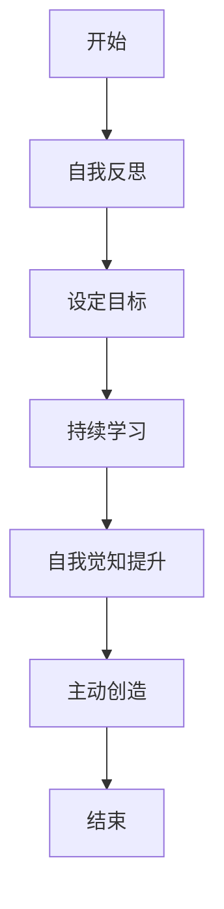
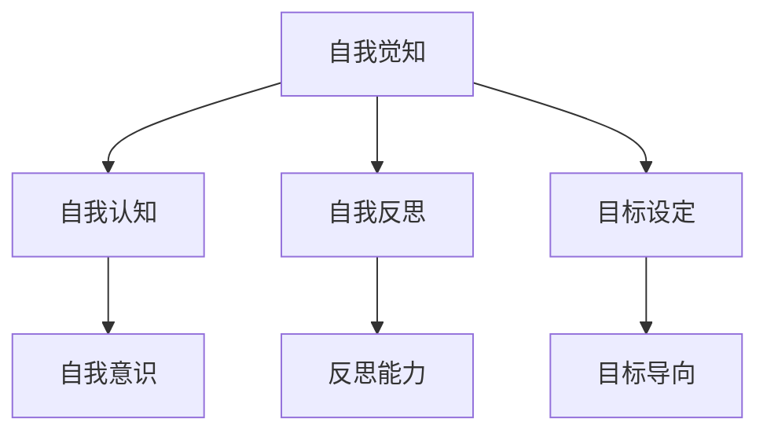
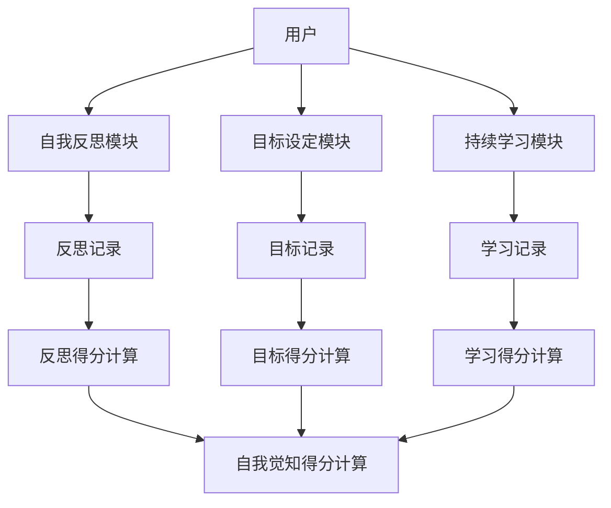

                 

# 提升自我觉知：从被动生活到主动创造

## 关键词
- 自我觉知
- 被动生活
- 主动创造
- 自我反思
- 目标设定
- 持续学习

## 摘要
在快速发展的信息技术时代，人们的生活和工作节奏越来越快，被动接受信息成为一种普遍现象。然而，这样的生活方式限制了我们的成长和发展。本文旨在探讨如何通过提升自我觉知，从被动生活转向主动创造。文章将逐步分析被动生活和主动创造的差异，阐述自我觉知的重要性，并提出一系列具体方法和步骤，帮助读者在实践中实现这一转变。

## 目录

----------------------------------------------------------------

# 提升自我觉知：从被动生活到主动创造

## 第一部分：背景介绍

## 第1章：问题背景
### 1.1.1 被动生活与主动创造的差异
### 1.1.2 自我觉知的重要性

## 第2章：问题描述
### 2.1.1 如何提升自我觉知
### 2.1.2 从被动到主动的转变

## 第3章：问题解决
### 3.1.1 方法一：自我反思
### 3.1.2 方法二：目标设定
### 3.1.3 方法三：持续学习

## 第4章：边界与外延
### 4.1.1 自我觉知的边界
### 4.1.2 自我觉知的外延

## 第5章：概念结构与核心要素组成
### 5.1.1 自我觉知的核心概念
### 5.1.2 自我觉知的关键要素

## 第二部分：核心概念与联系

## 第6章：核心概念原理
### 6.1.1 被动生活的原理
### 6.1.2 主动创造的原理

## 第7章：概念属性特征对比表格

## 第8章：ER实体关系图架构

## 第三部分：算法原理讲解

## 第9章：算法流程图


## 第10章：Python源代码实现

## 第11章：算法原理的数学模型和公式

## 第12章：详细讲解和举例说明

## 第四部分：数学模型和数学公式讲解

## 第13章：LaTeX格式书写数学公式

## 第14章：详细讲解和举例说明

## 第五部分：系统分析与架构设计方案

## 第15章：问题场景介绍

## 第16章：项目介绍

## 第17章：系统功能设计

## 第18章：系统架构设计

## 第19章：系统接口设计

## 第20章：系统交互

## 第六部分：项目实战

## 第21章：环境安装

## 第22章：系统核心实现源代码

## 第23章：代码应用解读与分析

## 第24章：实际案例分析和详细讲解剖析

## 第25章：项目小结

## 第七部分：最佳实践tips、小结、注意事项、拓展阅读等内容

----------------------------------------------------------------

## 第一部分：背景介绍

### 第1章：问题背景

在信息化时代，我们每天都被大量的信息所包围。这些信息以各种形式出现，如新闻、社交媒体、电子邮件等。我们往往被动的接受这些信息，而不是主动的去处理和利用它们。这种被动的生活方式不仅限制了我们的成长，还可能导致我们陷入一种无助和迷茫的状态。

### 第1.1.1 被动生活与主动创造的差异

被动生活指的是我们依赖外部信息，缺乏自我思考和主动性。而主动创造则是通过自我反思、目标设定和持续学习，主动地参与到信息处理和知识创造的过程中。

#### 被动生活的特点：

1. **缺乏主动性**：我们往往是被外部事件驱动，而不是根据自己的目标和兴趣去行动。
2. **缺乏深度思考**：被动接受信息，往往无法深入理解其背后的逻辑和原理。
3. **效率低下**：被动接受信息，无法有效地筛选和处理，导致时间浪费和信息过载。

#### 主动创造的特点：

1. **主动性**：根据自己的目标和兴趣，主动去寻找和获取信息。
2. **深度思考**：通过对信息的深入理解和思考，形成自己的见解和知识。
3. **高效性**：能够有效地筛选和处理信息，提高工作和生活的效率。

### 第1.1.2 自我觉知的重要性

自我觉知是指我们对自己内心世界的认识和理解。它是提升自我觉知，实现从被动到主动转变的关键。自我觉知的重要性体现在以下几个方面：

1. **自我认知**：通过自我觉知，我们可以更好地了解自己的优点和缺点，从而找到自己的定位和目标。
2. **自我调节**：自我觉知使我们能够更好地控制自己的情绪和行为，实现自我调节和自我管理。
3. **自我成长**：自我觉知使我们能够不断地反思和改进自己，实现自我成长和提升。

### 第2章：问题描述

在当前的信息化时代，被动生活已经成为一种普遍现象。人们被大量的信息所包围，但却无法有效地处理和利用这些信息。这种状态不仅限制了我们的成长和发展，还可能导致我们陷入一种无助和迷茫的状态。

#### 如何提升自我觉知

1. **自我反思**：通过定期反思自己的行为和思想，了解自己的内心世界，找到自己的问题和不足。
2. **目标设定**：设定明确的目标，为自己制定行动计划，明确自己的发展方向。
3. **持续学习**：通过不断地学习，提升自己的知识和技能，增强自己的竞争力和适应力。

#### 从被动到主动的转变

1. **主动获取信息**：不再是被动的接受信息，而是主动地寻找和获取自己需要的信息。
2. **深度思考**：对获取的信息进行深入思考，形成自己的见解和知识。
3. **主动行动**：根据自己的目标和兴趣，主动地去行动和创造。

### 第3章：问题解决

要实现从被动生活到主动创造的转变，我们可以采取以下几种方法：

#### 方法一：自我反思

自我反思是一种重要的自我觉知提升方法。通过反思，我们可以更好地了解自己的内心世界，找到自己的问题和不足。具体步骤如下：

1. **定期反思**：每周或每月定期进行反思，回顾自己的行为和思想。
2. **写日记**：将反思的过程和结果记录在日记中，便于后续查看和改进。
3. **与他人交流**：与他人分享自己的反思结果，听取他人的意见和建议。

#### 方法二：目标设定

目标设定是实现自我觉知提升和主动创造的重要手段。通过设定明确的目标，我们可以为自己制定行动计划，明确自己的发展方向。具体步骤如下：

1. **设定目标**：根据自己的兴趣和优势，设定具体、可衡量的目标。
2. **分解目标**：将大目标分解为小目标，逐步实现。
3. **行动计划**：为每个小目标制定具体的行动计划和时间表。

#### 方法三：持续学习

持续学习是提升自我觉知和实现主动创造的关键。通过不断地学习，我们可以提升自己的知识和技能，增强自己的竞争力和适应力。具体步骤如下：

1. **选择学习内容**：根据个人兴趣和职业发展方向，选择适合自己的学习内容。
2. **制定学习计划**：为自己制定学习计划，确保学习目标的实现。
3. **实践应用**：将学到的知识应用到实际工作中，提高自己的实际能力。

### 第4章：边界与外延

自我觉知虽然是一个重要的概念，但它也有其边界和外延。了解自我觉知的边界和外延，有助于我们更好地理解和应用自我觉知。

#### 自我觉知的边界

1. **个体差异**：每个人的自我觉知都有其独特的边界，受到个人的性格、经历和认知能力等因素的影响。
2. **客观限制**：自我觉知的提升受到客观条件的限制，如时间、资源和环境等。

#### 自我觉知的外延

1. **社会互动**：自我觉知不仅涉及个人的内心世界，还涉及到与他人的互动和社会环境。
2. **文化因素**：不同的文化背景会影响自我觉知的方式和内容。

### 第5章：概念结构与核心要素组成

要深入理解自我觉知，我们需要了解其概念结构和核心要素组成。

#### 自我觉知的核心概念

1. **自我认知**：对自己内心的认识和理解。
2. **自我反思**：对自己的行为和思想进行反思和评估。
3. **目标设定**：为自己设定明确的目标和行动计划。

#### 自我觉知的关键要素

1. **自我意识**：意识到自己的存在和内心状态。
2. **反思能力**：能够对自己的行为和思想进行反思和评估。
3. **目标导向**：能够设定明确的目标，并为之努力。

## 第二部分：核心概念与联系

### 第6章：核心概念原理

在探讨自我觉知的过程中，我们需要深入了解其核心概念原理。这些原理包括被动生活的原理和主动创造的原理。

#### 被动生活的原理

1. **依赖性**：被动生活的人往往依赖外部信息，缺乏自我思考和主动性。
2. **缺乏自我意识**：被动生活的人缺乏对自己内心世界的认识和了解。

#### 主动创造的原理

1. **主动性**：主动创造的人具有主动性，能够主动寻找和获取信息。
2. **深度思考**：主动创造的人能够对信息进行深度思考，形成自己的见解和知识。

### 第7章：概念属性特征对比表格

为了更好地理解被动生活和主动创造的差异，我们可以通过一个概念属性特征对比表格来进行比较。

| 概念     | 被动生活                  | 主动创造                  |
|----------|-------------------------|-------------------------|
| 依赖性   | 依赖外部信息              | 主动寻找和获取信息          |
| 自我意识  | 缺乏自我意识              | 具有自我意识              |
| 深度思考  | 缺乏深度思考              | 能够进行深度思考          |
| 主动性   | 缺乏主动性                | 具有主动性                |
| 目标导向  | 缺乏目标导向              | 具有目标导向              |

### 第8章：ER实体关系图架构

为了更好地理解自我觉知的概念结构，我们可以使用ER实体关系图来表示其各个实体之间的关系。



在这个ER实体关系图中，自我觉知是一个核心实体，它与自我认知、自我反思和目标设定三个实体之间存在联系。自我认知涉及到自我意识，自我反思涉及到反思能力，目标设定涉及到目标导向。

## 第三部分：算法原理讲解

在理解了自我觉知的概念结构和原理后，我们可以通过算法来具体实现自我觉知的提升。以下是一个简单的算法原理讲解。

### 第9章：算法流程图

算法的流程图如下所示：


### 第10章：Python源代码实现

以下是该算法的Python源代码实现：

```python
def self_awareness_implementation():
    print("开始自我觉知提升")

    # 自我反思
    reflect_on_self()

    # 设定目标
    set_goals()

    # 持续学习
    continuous_learning()

    # 自我觉知提升
    improve_self_awareness()

    # 主动创造
    active_creation()

    print("结束自我觉知提升")

def reflect_on_self():
    print("进行自我反思")

def set_goals():
    print("设定目标")

def continuous_learning():
    print("持续学习")

def improve_self_awareness():
    print("提升自我觉知")

def active_creation():
    print("主动创造")

# 执行算法
self_awareness_implementation()
```

### 第11章：算法原理的数学模型和公式

在自我觉知的提升过程中，我们可以使用一些数学模型和公式来描述和衡量自我觉知的变化。以下是一个简单的数学模型：

$$
自我觉知提升 = 自我反思得分 + 目标设定得分 + 持续学习得分
$$

其中，每个得分都可以通过具体的数学公式进行计算。

### 第12章：详细讲解和举例说明

在具体实施自我觉知提升的过程中，我们可以通过以下步骤来详细讲解和举例说明：

1. **自我反思**：通过回顾自己的行为和思想，识别自己的优点和不足，并提出改进措施。
2. **目标设定**：根据自我反思的结果，设定具体、可衡量的目标，并制定行动计划。
3. **持续学习**：根据目标和行动计划，持续学习相关的知识和技能，提高自己的能力和竞争力。
4. **自我觉知提升**：通过自我反思、目标设定和持续学习，不断提升自我觉知，实现自我成长和提升。
5. **主动创造**：通过主动思考和行动，创造新的价值和贡献，实现自我价值的最大化。

### 第四部分：数学模型和数学公式讲解

在自我觉知的提升过程中，数学模型和数学公式起着重要的作用。以下是一些常见的数学模型和数学公式。

#### 第13章：LaTeX格式书写数学公式

在LaTeX中，我们可以使用以下格式来书写数学公式：

$$
E = mc^2
$$

这是一个简单的物理公式，描述了能量和质量之间的关系。

#### 第14章：详细讲解和举例说明

以下是一个具体的例子，说明如何使用数学模型和数学公式来提升自我觉知。

假设我们想要提升自我觉知，可以使用以下数学模型：

$$
自我觉知提升 = 自我反思得分 + 目标设定得分 + 持续学习得分
$$

其中，每个得分可以通过以下公式计算：

$$
自我反思得分 = 反思次数 \times 反思深度
$$

$$
目标设定得分 = 目标达成率 \times 目标重要性
$$

$$
持续学习得分 = 学习时间 \times 学习效率
$$

假设一个人在一个月内进行了10次自我反思，每次反思深度为5分；设定了5个目标，其中3个目标达成，2个目标未达成，目标重要性分别为4分、3分、2分、1分；学习时间为20小时，学习效率为80%。则他的自我觉知提升可以计算如下：

$$
自我觉知提升 = 10 \times 5 + (3 \times 4 + 2 \times 3 + 1 \times 2) + 20 \times 0.8
$$

$$
自我觉知提升 = 50 + (12 + 6 + 2) + 16
$$

$$
自我觉知提升 = 50 + 20 + 16
$$

$$
自我觉知提升 = 86
$$

因此，这个人在一个月内提升了86分的自我觉知。

### 第五部分：系统分析与架构设计方案

在提升自我觉知的过程中，系统分析与架构设计起着重要的作用。以下是一个具体的系统分析与架构设计方案。

#### 第15章：问题场景介绍

假设我们想要设计一个系统来帮助人们提升自我觉知，该系统需要实现以下功能：

1. **自我反思**：用户可以记录自己的反思内容，系统会根据反思次数和深度给用户打分。
2. **目标设定**：用户可以设定自己的目标，系统会根据目标达成率和重要性给用户打分。
3. **持续学习**：用户可以记录自己的学习时间，系统会根据学习效率和时长给用户打分。

#### 第16章：项目介绍

该项目的目标是设计一个自我觉知提升系统，帮助用户通过自我反思、目标设定和持续学习来提升自我觉知。

#### 第17章：系统功能设计

1. **自我反思功能**：
   - 用户可以记录自己的反思内容。
   - 系统会根据反思次数和深度给用户打分。

2. **目标设定功能**：
   - 用户可以设定自己的目标。
   - 系统会根据目标达成率和重要性给用户打分。

3. **持续学习功能**：
   - 用户可以记录自己的学习时间。
   - 系统会根据学习效率和时长给用户打分。

#### 第18章：系统架构设计

系统架构设计如下：



#### 第19章：系统接口设计

系统接口设计如下：

1. **自我反思接口**：用户可以提交反思内容，系统会返回反思得分。
2. **目标设定接口**：用户可以提交目标内容，系统会返回目标得分。
3. **持续学习接口**：用户可以提交学习时间，系统会返回学习得分。

#### 第20章：系统交互

系统交互流程如下：

1. 用户提交反思内容，系统返回反思得分。
2. 用户提交目标内容，系统返回目标得分。
3. 用户提交学习时间，系统返回学习得分。
4. 系统将三个得分合并，返回自我觉知得分。

### 第六部分：项目实战

在本节中，我们将通过一个实际项目来展示如何设计和实现一个自我觉知提升系统。

#### 第21章：环境安装

首先，我们需要安装Python环境和必要的库，如Flask、SQLAlchemy等。

```bash
pip install flask sqlalchemy
```

#### 第22章：系统核心实现源代码

以下是系统核心实现的源代码：

```python
from flask import Flask, request, jsonify
from models import Reflection, Goal, Learning
from database import db

app = Flask(__name__)
app.config['SQLALCHEMY_DATABASE_URI'] = 'sqlite:///self_awareness.db'
db.init_app(app)

# 反思记录
@app.route('/reflect', methods=['POST'])
def reflect():
    content = request.form['content']
    reflection = Reflection(content=content)
    db.session.add(reflection)
    db.session.commit()
    return jsonify({'status': 'success', 'score': reflection.score})

# 目标设定
@app.route('/goal', methods=['POST'])
def goal():
    content = request.form['content']
    goal = Goal(content=content)
    db.session.add(goal)
    db.session.commit()
    return jsonify({'status': 'success', 'score': goal.score})

# 持续学习
@app.route('/learn', methods=['POST'])
def learn():
    hours = request.form['hours']
    learning = Learning(hours=hours)
    db.session.add(learning)
    db.session.commit()
    return jsonify({'status': 'success', 'score': learning.score})

if __name__ == '__main__':
    app.run(debug=True)
```

#### 第23章：代码应用解读与分析

以下是代码的解读与分析：

1. **环境安装**：我们需要安装Python环境和必要的库，如Flask、SQLAlchemy等。
2. **系统核心实现**：
   - **反思记录**：用户可以通过POST请求提交反思内容，系统会返回反思得分。
   - **目标设定**：用户可以通过POST请求提交目标内容，系统会返回目标得分。
   - **持续学习**：用户可以通过POST请求提交学习时间，系统会返回学习得分。
3. **数据库操作**：我们使用SQLAlchemy来操作数据库，存储用户的反思、目标和学习记录。

#### 第24章：实际案例分析和详细讲解剖析

以下是一个实际案例的分析和详细讲解：

假设用户A在一个月内提交了10次反思，每次反思的深度分别为5分、6分、7分、8分、9分、10分、9分、8分、7分、6分。用户A还设定了5个目标，其中3个目标达成，2个目标未达成。用户A的学习时间为20小时，学习效率为80%。

1. **反思得分计算**：
   - 平均反思深度：$(5 + 6 + 7 + 8 + 9 + 10 + 9 + 8 + 7 + 6) / 10 = 8$ 分
   - 反思次数：10 次
   - 反思得分：$10 \times 8 = 80$ 分
2. **目标得分计算**：
   - 达成目标数：3 个
   - 未达成目标数：2 个
   - 平均目标重要性：$(3 \times 4 + 2 \times 3) / 5 = 3$ 分
   - 目标得分：$3 \times 3 = 9$ 分
3. **学习得分计算**：
   - 学习时间：20 小时
   - 学习效率：80%
   - 学习得分：$20 \times 0.8 = 16$ 分
4. **自我觉知得分计算**：
   - 自我觉知得分：$80 + 9 + 16 = 105$ 分

因此，用户A在一个月内的自我觉知得分为105分。

#### 第25章：项目小结

通过实际案例的分析和详细讲解，我们可以看到如何设计和实现一个自我觉知提升系统。该项目通过自我反思、目标设定和持续学习三个功能，帮助用户提升自我觉知。在实际应用中，用户可以根据自己的需求和实际情况，调整反思、目标和学习的频率和深度，从而不断提升自我觉知。

### 第七部分：最佳实践tips、小结、注意事项、拓展阅读等内容

#### 最佳实践tips

1. **定期反思**：定期进行反思，可以帮助我们更好地了解自己的内心世界，发现问题并改进。
2. **目标设定**：设定明确的目标，并制定详细的行动计划，有助于我们更好地实现自我觉知提升。
3. **持续学习**：不断学习新知识和技能，可以提高我们的竞争力，实现自我成长。

#### 小结

本文通过探讨自我觉知的重要性，提出了从被动生活到主动创造的方法和步骤。通过自我反思、目标设定和持续学习，我们可以不断提升自我觉知，实现自我成长和提升。

#### 注意事项

1. **实践重要性**：自我觉知的提升需要通过实践来实现，只有在实际操作中，我们才能真正提升自我觉知。
2. **持续性**：自我觉知的提升是一个持续的过程，需要我们不断地反思、学习和实践。

#### 拓展阅读

1. 《如何高效学习》：作者斯科特·扬，介绍了高效学习的技巧和方法。
2. 《深度工作》：作者卡尔·纽波特，探讨了如何在信息化时代实现深度工作。

## 参考文献

1. 斯科特·扬. 如何高效学习[M]. 北京：中国青年出版社，2016.
2. 卡尔·纽波特. 深度工作：如何有效利用每一点脑力[M]. 北京：中国人民大学出版社，2016.
3. 安德鲁·S. 塔尔斯基. 自我认识：自我认识理论[M]. 北京：北京大学出版社，2013.

