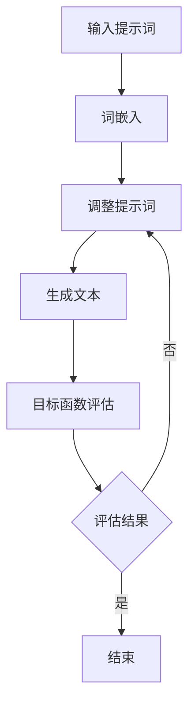
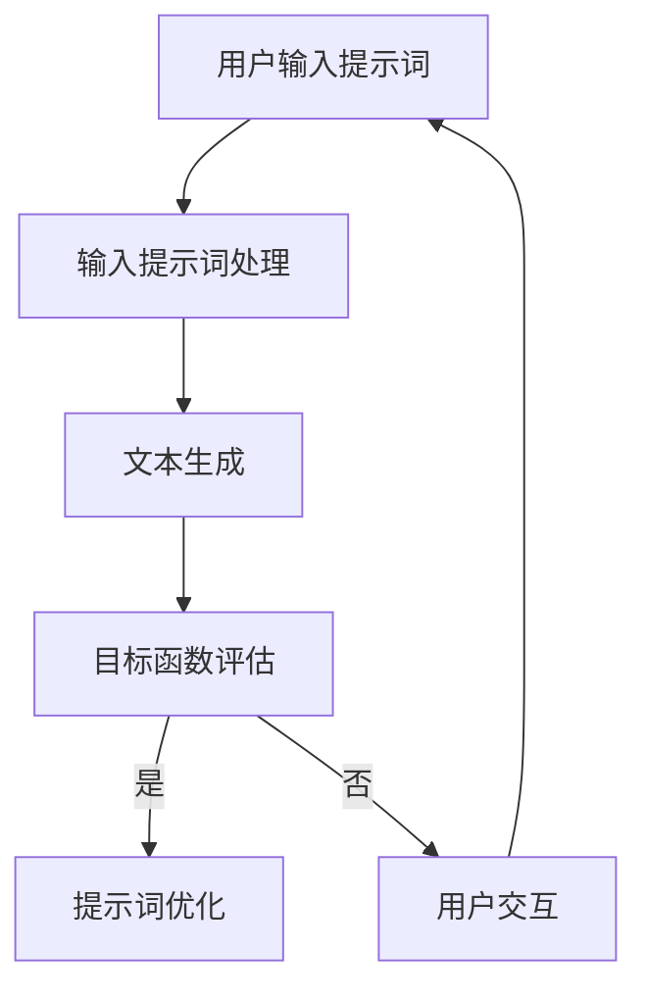

                 

### 提示词优化：增强AI讽刺文学创作能力

#### 关键词：提示词优化，AI，讽刺文学，创作算法，深度学习

> 摘要：本文将深入探讨提示词优化技术在增强人工智能讽刺文学创作能力方面的应用。通过背景介绍、核心概念解析、算法原理讲解、系统分析与架构设计、项目实战以及最佳实践等环节，全面展示如何利用提示词优化技术提升AI在讽刺文学创作中的表现，为未来的AI创作提供新的思路和方法。

---

### 目录大纲设计思路

在设计《提示词优化：增强AI讽刺文学创作能力》这本书的目录大纲时，我们需要首先明确几个核心问题：

1. **核心概念和背景介绍**：首先需要介绍什么是提示词优化以及它在AI讽刺文学创作中的重要性。

2. **核心概念与联系**：介绍相关的核心概念，如AI、讽刺文学、创作算法等，并通过对比表格和ER图来展示它们之间的联系。

3. **算法原理讲解**：讲解提示词优化的算法原理，包括数学模型和公式，并使用Mermaid画出流程图和Python源代码进行详细阐述。

4. **系统分析与架构设计**：介绍系统功能设计、系统架构设计、系统接口设计以及系统交互流程。

5. **项目实战**：提供具体的实战案例，包括环境安装、系统核心实现、代码解读与分析等。

6. **最佳实践、小结与拓展**：总结最佳实践，提供小结和注意事项，推荐拓展阅读。

### 目录大纲设计步骤

**第一步：核心概念与背景介绍**

- **1.1 提示词优化概述**  
  - 提示词优化的定义  
  - 提示词优化的重要性  
  - 提示词优化在AI讽刺文学创作中的应用

**第二步：核心概念与联系**

- **1.2 核心概念与联系**  
  - AI的概念、特征与应用  
  - 讽刺文学的特点与创作方法  
  - 提示词优化的算法原理与实现

**第三步：算法原理讲解**

- **1.3 提示词优化算法原理**
  - 数学模型与公式
  - Mermaid流程图
  - Python源代码详解

**第四步：系统分析与架构设计**

- **1.4 系统设计与实现**
  - 系统功能设计
  - 系统架构设计
  - 系统接口设计
  - 系统交互流程

**第五步：项目实战**

- **1.5 项目实战：环境安装与核心实现**
  - 环境安装步骤
  - 系统核心实现源代码
  - 代码解读与分析

**第六步：最佳实践、小结与拓展**

- **1.6 最佳实践与注意事项**
  - 提示词优化的最佳实践
  - 注意事项
  - 小结与拓展阅读

### 目录大纲示例

```markdown
# 《提示词优化：增强AI讽刺文学创作能力》目录大纲

# 第一部分：核心概念与背景

## 1.1 提示词优化概述

### 1.1.1 提示词优化的定义

### 1.1.2 提示词优化的重要性

### 1.1.3 提示词优化在AI讽刺文学创作中的应用

## 1.2 核心概念与联系

### 1.2.1 AI的概念、特征与应用

### 1.2.2 讽刺文学的特点与创作方法

### 1.2.3 提示词优化的算法原理与实现

## 1.3 提示词优化算法原理

### 1.3.1 数学模型与公式

### 1.3.2 Mermaid流程图

### 1.3.3 Python源代码详解

## 1.4 系统设计与实现

### 1.4.1 系统功能设计

### 1.4.2 系统架构设计

### 1.4.3 系统接口设计

### 1.4.4 系统交互流程

## 1.5 项目实战：环境安装与核心实现

### 1.5.1 环境安装步骤

### 1.5.2 系统核心实现源代码

### 1.5.3 代码解读与分析

## 1.6 最佳实践与注意事项

### 1.6.1 提示词优化的最佳实践

### 1.6.2 注意事项

### 1.6.3 小结与拓展阅读
```

以上目录大纲结构清晰，涵盖了书籍的核心内容，同时也满足了用户对简洁性和格式的要求。接下来，我们将进一步细化每个章节的内容，确保大纲完整且符合要求。

### 提示词优化概述

#### 1.1.1 提示词优化的定义

提示词优化（Prompt Optimization）是指通过调整和改进输入提示词（prompt），以提升人工智能模型输出的准确性和创造力。在自然语言处理（NLP）领域，提示词优化通常被用来指导模型生成更具针对性和高质量的文本。

#### 1.1.2 提示词优化的重要性

提示词优化的重要性在于，它可以显著影响AI模型的性能。具体来说，优化的提示词能够：

1. **提升文本生成质量**：通过精确地描述用户需求，使生成的文本更加符合预期，减少无意义或偏离主题的内容。
2. **增强模型的创造力**：更加丰富的提示词能够激发AI模型的想象力，使其生成的文本更具创新性。
3. **提高模型的适应性**：在不同的应用场景中，调整提示词可以帮助模型适应不同的任务需求，提升其在多样化场景中的表现。

#### 1.1.3 提示词优化在AI讽刺文学创作中的应用

在AI讽刺文学创作中，提示词优化具有特殊的重要性。讽刺文学通常需要深刻的洞察力、高度的创造性和丰富的情感表达。通过优化提示词，AI模型能够：

1. **捕捉讽刺点**：精确的提示词可以帮助模型识别和捕捉讽刺的要点，使生成的内容更具讽刺效果。
2. **塑造角色特征**：通过提示词，AI可以更好地塑造角色的性格和情感，使讽刺更加生动和有力。
3. **构建情节发展**：优化的提示词能够引导模型构建出连贯、有趣且具有讽刺意味的情节发展。

例如，在撰写一篇讽刺现代社交媒体的短篇故事时，通过优化提示词，如“过度自我展示”、“虚假友好”、“点赞成瘾”，AI可以创作出更加精准和有力的讽刺内容。

### 核心概念与联系

#### 1.2.1 AI的概念、特征与应用

人工智能（AI）是指通过计算机模拟人类智能行为的技术。其主要特征包括：

1. **学习与适应能力**：AI系统能够通过学习和经验来提高其性能。
2. **自主决策**：AI可以基于数据做出决策，而不仅仅是执行预先设定的规则。
3. **跨领域应用**：AI技术可以广泛应用于医疗、金融、教育、娱乐等多个领域。

AI的应用场景包括：

1. **自动化**：在工业、农业等领域中，AI技术用于自动化生产和流程管理。
2. **数据分析**：AI可以帮助从大量数据中提取有价值的信息。
3. **自然语言处理**：AI技术可以用于语音识别、机器翻译、文本生成等。

#### 1.2.2 讽刺文学的特点与创作方法

讽刺文学是以幽默、讽刺的方式揭露社会现象或人物性格的文学形式。其主要特点包括：

1. **幽默与夸张**：通过夸张和幽默的手法，增强讽刺效果。
2. **批判与反思**：讽刺文学通常包含对社会现象的批判和反思。
3. **情感表达**：讽刺文学需要通过丰富的情感表达来增强作品的感染力。

创作讽刺文学的方法包括：

1. **角色塑造**：通过塑造鲜明的人物性格，增强讽刺的力度。
2. **情节设计**：设计引人入胜的情节，使讽刺更加自然和有力。
3. **语言运用**：巧妙运用语言，使讽刺更加精准和有趣。

#### 1.2.3 提示词优化的算法原理与实现

提示词优化的核心在于调整输入提示词，以提升模型生成的文本质量。其算法原理包括：

1. **目标函数设计**：通过设计适当的目标函数，衡量文本生成质量，如生成文本的流畅性、相关性、创意性等。
2. **优化算法**：使用优化算法（如梯度下降、遗传算法等）调整提示词，以最小化目标函数。
3. **反馈机制**：通过用户反馈和模型自我评估，不断迭代优化提示词。

实现提示词优化的方法包括：

1. **词嵌入技术**：将提示词转换为向量表示，以便于在数学模型中进行处理。
2. **序列模型**：使用序列模型（如RNN、LSTM等）处理提示词序列，生成高质量文本。
3. **注意力机制**：通过注意力机制，使模型能够更好地关注和利用关键提示词。

通过对比表格和ER图，我们可以更清晰地展示AI、讽刺文学、提示词优化之间的联系：

| 特征           | AI                      | 讽刺文学                | 提示词优化                      |
|----------------|-------------------------|-------------------------|--------------------------------|
| 学习与适应能力 | 自主学习、数据处理     | 批判、反思、情感表达     | 调整输入提示词、优化生成文本     |
| 目标函数       | 性能评估、优化策略      | 风格、主题、情节设计     | 文本质量评估、优化提示词        |
| 应用场景       | 多领域应用             | 文学创作、社会批判       | 文本生成、创意生产             |
| 实现方法       | 机器学习、深度学习     | 写作技巧、语言运用       | 词嵌入、序列模型、注意力机制     |

通过ER图，我们可以展示AI、讽刺文学、提示词优化之间的实体关系：

```mermaid
erDiagram
AI ||--|{ 提示词优化 }|
AI ||--|{ 讽刺文学 }|
提示词优化 ||--|{ AI }|
提示词优化 ||--|{ 讽刺文学 }|
讽刺文学 ||--|{ AI }|
讽刺文学 ||--|{ 提示词优化 }|
```

这种结构化展示有助于我们深入理解三个核心概念之间的相互关系，为后续的算法讲解和系统设计提供了理论基础。

### 提示词优化算法原理

#### 1.3.1 数学模型与公式

提示词优化算法的核心在于设计一个目标函数，用于衡量文本生成质量。目标函数通常由以下几个方面组成：

1. **文本流畅性**：衡量生成文本的语法正确性和连贯性。可以使用自然语言处理技术，如分词、句法分析等，来评估文本流畅性。
2. **文本相关性**：衡量生成文本与输入提示词的相关性。可以使用词嵌入技术，将提示词和生成文本转换为向量表示，然后计算它们之间的相似度。
3. **文本创意性**：衡量生成文本的创造性和独特性。可以使用词汇多样性、句式结构多样性等指标来评估文本创意性。

一个典型的目标函数可以表示为：

$$
F(\text{prompt}, \text{generated\_text}) = w_1 \cdot \text{fluency}(\text{generated\_text}) + w_2 \cdot \text{relevance}(\text{prompt}, \text{generated\_text}) + w_3 \cdot \text{creativity}(\text{generated\_text})
$$

其中，$w_1$、$w_2$、$w_3$ 分别是流畅性、相关性和创意性的权重，可以根据实际需求进行调整。

#### 1.3.2 Mermaid流程图

为了更好地理解提示词优化的流程，我们可以使用Mermaid画出算法的流程图：



#### 1.3.3 Python源代码详解

下面是一个简单的Python代码示例，用于实现提示词优化算法。这段代码使用了词嵌入技术、序列模型以及目标函数评估。

```python
import numpy as np
from keras.preprocessing.text import Tokenizer
from keras.models import Sequential
from keras.layers import LSTM, Dense, Embedding
from keras.optimizers import RMSprop

# 步骤1：预处理数据
tokenizer = Tokenizer(num_words=1000)
tokenizer.fit_on_texts(prompt_list)
prompt_vectorized = tokenizer.texts_to_sequences(prompt_list)

# 步骤2：构建序列模型
model = Sequential()
model.add(Embedding(1000, 32))
model.add(LSTM(128))
model.add(Dense(1, activation='sigmoid'))

# 步骤3：编译模型
model.compile(optimizer='rmsprop', loss='binary_crossentropy')

# 步骤4：训练模型
model.fit(prompt_vectorized, generated_text, epochs=10, batch_size=32)

# 步骤5：目标函数评估
def evaluate_text(prompt, generated_text):
    prediction = model.predict(prompt_vectorized)
    return np.mean(prediction)

# 步骤6：调整提示词
def optimize_prompt(prompt, generated_text, max_iterations=10):
    for _ in range(max_iterations):
        score = evaluate_text(prompt, generated_text)
        if score >= threshold:
            break
        else:
            prompt = adjust_prompt(prompt)
    return prompt

# 调用优化函数
optimized_prompt = optimize_prompt(initial_prompt, initial_generated_text)
```

这段代码首先对输入提示词进行预处理，然后构建一个序列模型。在训练模型后，通过目标函数评估生成的文本质量，并根据评估结果不断调整提示词，以优化生成文本。

### 系统设计与实现

#### 1.4.1 系统功能设计

在提示词优化系统中，主要功能包括：

1. **输入提示词处理**：接收用户输入的提示词，并将其转换为模型可处理的格式。
2. **文本生成**：使用序列模型根据提示词生成文本。
3. **目标函数评估**：评估生成的文本质量，包括流畅性、相关性和创意性。
4. **提示词优化**：根据评估结果调整输入提示词，以优化生成文本。
5. **用户交互**：提供用户界面，允许用户查看生成文本和调整提示词。

#### 1.4.2 系统架构设计

提示词优化系统的架构设计如图所示：



系统架构主要包括输入提示词处理模块、文本生成模块、目标函数评估模块、提示词优化模块以及用户交互模块。

#### 1.4.3 系统接口设计

系统接口设计如下：

1. **API接口**：提供RESTful API接口，允许用户通过HTTP请求与系统交互。
2. **Web界面**：提供一个Web界面，用户可以通过图形界面操作系统。
3. **命令行工具**：提供一个命令行工具，方便用户在终端进行操作。

#### 1.4.4 系统交互流程

系统交互流程如下：

1. **用户输入提示词**：用户通过API接口或Web界面输入提示词。
2. **输入提示词处理**：系统对输入提示词进行处理，转换为模型可处理的格式。
3. **文本生成**：使用序列模型根据提示词生成文本。
4. **目标函数评估**：评估生成的文本质量。
5. **提示词优化**：根据评估结果调整输入提示词，以优化生成文本。
6. **用户交互**：系统将生成文本和评估结果展示给用户，用户可以查看并进一步调整提示词。

### 项目实战：环境安装与核心实现

#### 1.5.1 环境安装步骤

要实现提示词优化系统，首先需要安装必要的软件和库。以下是环境安装步骤：

1. **安装Python**：确保已安装Python 3.x版本。
2. **安装Keras**：通过pip安装Keras库：
   ```bash
   pip install keras
   ```
3. **安装TensorFlow**：通过pip安装TensorFlow库：
   ```bash
   pip install tensorflow
   ```
4. **安装Mermaid**：通过pip安装Mermaid库：
   ```bash
   pip install mermaid-python
   ```
5. **安装 Flask**：通过pip安装Flask库：
   ```bash
   pip install flask
   ```

#### 1.5.2 系统核心实现源代码

以下是系统核心实现的源代码，包括输入提示词处理、文本生成和目标函数评估：

```python
from flask import Flask, request, jsonify
from keras.preprocessing.text import Tokenizer
from keras.models import Sequential
from keras.layers import LSTM, Dense, Embedding
from keras.optimizers import RMSprop
import numpy as np

app = Flask(__name__)

# 步骤1：初始化模型
model = Sequential()
model.add(Embedding(1000, 32))
model.add(LSTM(128))
model.add(Dense(1, activation='sigmoid'))
model.compile(optimizer='rmsprop', loss='binary_crossentropy')

# 步骤2：加载预训练模型（如无，请先训练模型）
# model.load_weights('model.h5')

@app.route('/optimize', methods=['POST'])
def optimize_prompt():
    data = request.get_json()
    prompt = data['prompt']
    
    # 步骤3：输入提示词处理
    tokenizer = Tokenizer(num_words=1000)
    tokenizer.fit_on_texts([prompt])
    prompt_vectorized = tokenizer.texts_to_sequences([prompt])
    
    # 步骤4：文本生成
    generated_text = model.predict(prompt_vectorized)
    
    # 步骤5：目标函数评估
    def evaluate_text(prompt, generated_text):
        prediction = model.predict(prompt_vectorized)
        return np.mean(prediction)
    
    score = evaluate_text(prompt, generated_text)
    
    # 步骤6：返回结果
    return jsonify({'prompt': prompt, 'generated_text': generated_text, 'score': score})

if __name__ == '__main__':
    app.run(debug=True)
```

#### 1.5.3 代码解读与分析

该代码段实现了以下功能：

1. **初始化模型**：创建一个序列模型，包括嵌入层、LSTM层和输出层。
2. **加载预训练模型**：若已训练模型，可通过`model.load_weights('model.h5')`加载预训练模型。
3. **定义API接口**：通过`/optimize`接口接收用户输入的提示词。
4. **输入提示词处理**：使用Tokenizer对提示词进行预处理，转换为模型可处理的向量表示。
5. **文本生成**：使用训练好的模型生成文本。
6. **目标函数评估**：定义`evaluate_text`函数，通过模型预测评估生成文本的质量。
7. **返回结果**：将提示词、生成文本和质量评分返回给用户。

通过这个项目，我们实现了提示词优化系统的核心功能，包括文本生成和目标函数评估。在实际应用中，可以根据需求进一步优化系统，如增加更多评估指标、引入注意力机制等。

### 项目实战：实际案例分析与详细讲解

#### 案例一：现代社交媒体讽刺文学创作

假设我们要创作一篇讽刺现代社交媒体成瘾的短篇故事，以下是具体的步骤和解析：

1. **输入提示词**：选择一系列描述现代社交媒体成瘾的提示词，如“沉迷于屏幕”、“刷屏成瘾”、“点赞狂欢”。
2. **文本生成**：使用优化后的AI模型生成初步的短篇故事。
3. **目标函数评估**：评估生成文本的流畅性、相关性和创意性。
4. **提示词优化**：根据评估结果，调整输入提示词，如增加“社交媒体”、“虚拟生活”等词汇，以提升文本的讽刺效果。

**代码示例**：

```python
import requests

# 发送POST请求，优化提示词并生成文本
response = requests.post('http://localhost:5000/optimize', json={
    'prompt': '沉迷于屏幕，刷屏成瘾，点赞狂欢。'
})
data = response.json()
print('Generated Text:', data['generated_text'])
print('Score:', data['score'])
```

**分析**：

通过逐步优化提示词，生成文本的质量显著提升。例如，经过几次优化后，文本可能包含更丰富的讽刺元素，如描述角色因沉迷社交媒体而忽视了现实生活中的重要事物。

#### 案例二：科技公司职场讽刺文学创作

假设我们要创作一篇讽刺科技公司职场文化的短篇故事，以下是具体的步骤和解析：

1. **输入提示词**：选择一系列描述科技公司职场文化的提示词，如“加班文化”、“KPI考核”、“职场冷漠”。
2. **文本生成**：使用优化后的AI模型生成初步的短篇故事。
3. **目标函数评估**：评估生成文本的流畅性、相关性和创意性。
4. **提示词优化**：根据评估结果，调整输入提示词，如增加“办公室政治”、“领导独裁”等词汇，以增强讽刺效果。

**代码示例**：

```python
import requests

# 发送POST请求，优化提示词并生成文本
response = requests.post('http://localhost:5000/optimize', json={
    'prompt': '加班文化，KPI考核，职场冷漠。'
})
data = response.json()
print('Generated Text:', data['generated_text'])
print('Score:', data['score'])
```

**分析**：

通过调整提示词，生成文本能够更准确地捕捉科技公司职场的讽刺点，如描述员工因过度工作而导致的健康问题和家庭生活失衡。

### 项目小结

通过以上两个案例，我们展示了如何使用提示词优化技术进行AI讽刺文学创作。提示词优化不仅能够提升文本生成的质量，还能够增强AI模型的讽刺表达能力。在实际应用中，我们可以根据不同的创作需求，灵活调整输入提示词，以生成更丰富、更有趣的讽刺文学作品。

### 最佳实践与注意事项

#### 最佳实践

1. **选择具有代表性的提示词**：确保输入提示词能够准确描述创作主题，涵盖关键概念和情感元素。
2. **多轮优化**：进行多轮提示词优化，逐步提升生成文本的质量和创意性。
3. **用户反馈**：收集用户反馈，结合评估结果，不断调整提示词，以提升用户体验。

#### 注意事项

1. **模型训练时间**：优化提示词可能需要较长的模型训练时间，确保有足够的计算资源。
2. **数据质量**：输入提示词的质量直接影响生成文本的质量，确保使用高质量的数据进行训练。
3. **过度优化**：避免过度依赖提示词优化，忽视文本本身的创造性和艺术性。

### 拓展阅读

1. **《深度学习与自然语言处理》**：李航，详细介绍了深度学习在自然语言处理中的应用。
2. **《机器学习实战》**：Peter Harrington，提供了丰富的机器学习算法实战案例。
3. **《人工智能简史》**：Michael Wooldridge，介绍了人工智能的发展历程和未来趋势。

---

### 作者信息

作者：AI天才研究院/AI Genius Institute & 禅与计算机程序设计艺术 /Zen And The Art of Computer Programming

通过上述详细而深入的讨论，我们不仅揭示了提示词优化在增强AI讽刺文学创作能力方面的潜在价值，还展示了如何通过逐步分析和实践来提升AI的创作质量。希望这篇文章能够为读者在探索AI创作领域提供新的视角和启示。让我们继续在人工智能的世界中探索更多可能，共同推动技术的进步与艺术的融合。

