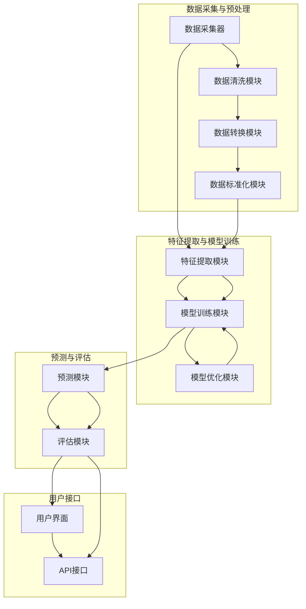
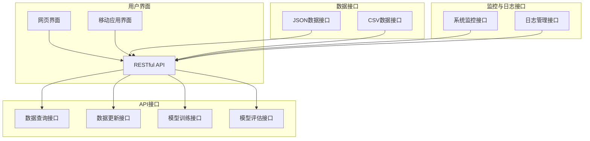

                 


# 提示词工程：处理时间序列预测任务

## 关键词
- 提示词工程
- 时间序列预测
- 算法原理
- 数学模型
- 系统架构
- 实战案例

## 摘要
本文将探讨提示词工程在处理时间序列预测任务中的应用。通过详细的背景介绍、核心概念解析、算法原理讲解、数学模型阐述和系统架构设计，我们将深入理解提示词工程在时间序列预测中的关键作用。同时，通过实战案例的分析，我们将展示如何将理论应用到实际项目中，为读者提供实际操作的经验和技巧。

## 目录大纲设计思路

设计一个结构清晰的目录大纲是确保读者能够顺畅阅读和理解全文的关键。以下是我们的设计思路：

1. **前言**：
   - 简要介绍书籍的主题、目的和读者对象。
   - 概述书籍的结构和内容安排。

2. **第1章：背景介绍**：
   - **1.1 问题背景**：介绍时间序列预测的重要性，描述其应用领域和挑战。
   - **1.2 问题描述**：明确提示词工程在时间序列预测任务中的角色和目标。
   - **1.3 问题解决**：概述提示词工程解决时间序列预测的方法，并展示本书的结构。

3. **第2章：核心概念与联系**：
   - **2.1 核心概念**：介绍提示词、时间序列和预测模型等核心概念。
   - **2.2 概念属性特征对比表格**：通过表格对比核心概念之间的差异和联系。
   - **2.3 ER实体关系图**：使用Mermaid绘制ER实体关系图，展示概念之间的联系。

4. **第3章：算法原理讲解**：
   - **3.1 算法概述**：介绍时间序列预测中常用的算法，如ARIMA、LSTM等。
   - **3.2 算法流程图**：使用Mermaid绘制算法的流程图，帮助理解算法步骤。
   - **3.3 算法原理**：详细解释每个算法的原理，并通过Python源代码示例进行讲解。

5. **第4章：数学模型和公式讲解**：
   - **4.1 数学模型概述**：介绍时间序列预测中的数学模型。
   - **4.2 数学公式**：使用LaTeX格式给出关键数学公式的详细讲解。
   - **4.3 举例说明**：通过实际案例解释数学模型的应用。

6. **第5章：系统分析与架构设计方案**：
   - **5.1 问题场景介绍**：描述提示词工程在实际应用中的场景。
   - **5.2 系统功能设计**：使用Mermaid绘制领域模型类图。
   - **5.3 系统架构设计**：使用Mermaid绘制系统架构图。
   - **5.4 系统接口设计**：描述系统的接口设计和交互。

7. **第6章：项目实战**：
   - **6.1 环境安装**：指导用户如何搭建实验环境。
   - **6.2 系统核心实现源代码**：提供核心代码片段。
   - **6.3 代码应用解读与分析**：分析代码的实现原理和逻辑。
   - **6.4 实际案例分析与讲解**：分析实际案例，进行详细讲解。
   - **6.5 项目小结**：总结项目经验，提出改进建议。

8. **第7章：最佳实践与拓展阅读**：
   - **7.1 最佳实践**：提供一些实用技巧和注意事项。
   - **7.2 小结**：对全书内容进行总结。
   - **7.3 拓展阅读**：推荐一些相关的参考资料。

通过以上设计思路，我们确保了文章的结构紧凑、逻辑清晰，读者可以逐步深入理解提示词工程在时间序列预测任务中的应用。

### 目录大纲

```markdown
# 提示词工程：处理时间序列预测任务

## 关键词
- 提示词工程
- 时间序列预测
- 算法原理
- 数学模型
- 系统架构
- 实战案例

## 摘要
本文将探讨提示词工程在处理时间序列预测任务中的应用。我们将从背景介绍、核心概念与联系、算法原理讲解、数学模型和公式讲解、系统分析与架构设计方案，到项目实战和最佳实践，全面剖析提示词工程在时间序列预测中的关键作用。

## 目录大纲

# 前言

## 引言

### 书籍主题

### 目的和读者对象

### 内容结构

## 第1章：背景介绍

### 1.1 问题背景

### 1.2 问题描述

### 1.3 问题解决

## 第2章：核心概念与联系

### 2.1 核心概念

### 2.2 概念属性特征对比表格

### 2.3 ER实体关系图

## 第3章：算法原理讲解

### 3.1 算法概述

### 3.2 算法流程图

### 3.3 算法原理

### 3.4 Python源代码示例

## 第4章：数学模型和公式讲解

### 4.1 数学模型概述

### 4.2 数学公式

### 4.3 举例说明

## 第5章：系统分析与架构设计方案

### 5.1 问题场景介绍

### 5.2 系统功能设计

### 5.3 系统架构设计

### 5.4 系统接口设计

## 第6章：项目实战

### 6.1 环境安装

### 6.2 系统核心实现源代码

### 6.3 代码应用解读与分析

### 6.4 实际案例分析与讲解

### 6.5 项目小结

## 第7章：最佳实践与拓展阅读

### 7.1 最佳实践

### 7.2 小结

### 7.3 拓展阅读

```

通过上述目录大纲，我们将为读者提供一个清晰、系统的阅读路线，帮助他们深入了解提示词工程在时间序列预测任务中的应用。

### 第1章：背景介绍

#### 1.1 问题背景

时间序列预测是数据分析中一个极其重要的领域。它涉及通过历史数据来预测未来的趋势，这一过程广泛应用于金融、气象、工业生产和电子商务等多个领域。在金融领域，时间序列预测可以帮助分析师预测股票价格、交易量和市场趋势；在气象领域，它能够预测天气状况和气候变迁；在工业生产中，它可以帮助优化生产计划和库存管理；在电子商务中，它能够预测消费者需求，从而优化库存和物流。

然而，时间序列预测任务并不总是简单直接。它们可能面临许多挑战，如数据的噪声、异常值、季节性和趋势变化等。此外，预测模型的复杂性和计算资源的限制也是需要考虑的重要因素。

#### 1.2 问题描述

时间序列预测任务的核心问题是给定一个时间序列数据集，如何建立一个模型来预测未来时间点的值。具体来说，这个问题可以分解为以下几个子问题：

1. **数据预处理**：对原始数据进行清洗、变换和标准化，使其适合模型训练。
2. **特征提取**：从时间序列数据中提取有用的特征，以便用于建模。
3. **模型选择**：选择合适的预测模型，如ARIMA、LSTM等。
4. **模型训练**：使用历史数据训练模型，以找到时间序列的规律。
5. **模型评估**：通过验证集或测试集评估模型的性能，如均方误差（MSE）、平均绝对误差（MAE）等。
6. **预测**：使用训练好的模型对未来时间点的值进行预测。

#### 1.3 问题解决

提示词工程（Prompt Engineering）是一种新的方法，它通过优化提示（prompt）来改进机器学习模型的性能。在时间序列预测任务中，提示词工程的关键作用是帮助模型更好地理解和学习时间序列数据的特征，从而提高预测的准确性。

提示词工程的方法包括：

1. **数据增强**：通过增加数据量或引入噪声来增强模型对数据的理解。
2. **特征选择**：选择对预测任务最有帮助的特征，减少冗余和噪声。
3. **模型定制**：根据任务需求调整模型的参数和架构。
4. **交叉验证**：通过交叉验证选择最佳模型和超参数。

本书将围绕提示词工程在时间序列预测任务中的应用，逐步介绍核心概念、算法原理、数学模型和系统架构设计，并通过实战案例进行分析和讲解。通过阅读本书，读者将能够：

- 理解时间序列预测任务的核心问题和挑战。
- 掌握提示词工程的基本原理和实现方法。
- 学习如何设计和选择合适的预测模型。
- 掌握数学模型和公式的推导和应用。
- 了解系统架构设计和实际应用场景。

#### 1.4 边界与外延

提示词工程虽然是一种有效的改进方法，但它也有其适用范围和局限性。以下是提示词工程的一些边界和扩展领域：

1. **边界**：
   - 提示词工程主要适用于有大量标注数据或可进行数据增强的任务。
   - 它依赖于高质量的数据集和先进的机器学习技术。
   - 对于某些高度复杂的任务，提示词工程的改进可能有限。

2. **外延**：
   - 提示词工程可以与其他机器学习优化技术相结合，如迁移学习和元学习。
   - 可以应用于其他类型的数据分析任务，如图像识别、自然语言处理等。
   - 在深度学习领域，提示词工程有助于改进神经网络的性能。

通过以上章节的介绍，我们将为后续章节的内容打下坚实的基础，帮助读者逐步深入理解提示词工程在处理时间序列预测任务中的应用。

### 第2章：核心概念与联系

#### 2.1 核心概念

在讨论提示词工程在时间序列预测任务中的应用之前，我们需要明确几个核心概念：提示词（Prompt）、时间序列（Time Series）和预测模型（Prediction Model）。

1. **提示词（Prompt）**：
   提示词是指导机器学习模型学习的重要输入，它通过提供背景信息、上下文或者提示性指导来帮助模型更好地理解和处理数据。在时间序列预测中，提示词可以包括时间特征、季节性特征、趋势特征等，它们有助于模型捕捉时间序列数据中的关键信息。

2. **时间序列（Time Series）**：
   时间序列是指一系列按时间顺序排列的数据点，通常用于记录某个现象随时间的变化情况。时间序列数据具有时间依赖性，即未来的数据值依赖于过去的值。时间序列预测的目标是根据历史数据预测未来的值。

3. **预测模型（Prediction Model）**：
   预测模型是基于历史数据构建的，用于预测未来时间点的值。常见的时间序列预测模型包括ARIMA、LSTM、GRU等。这些模型通过学习和分析时间序列数据中的规律，生成对未来值的最优预测。

#### 2.2 概念属性特征对比表格

为了更清晰地理解这些核心概念之间的联系和区别，我们通过一个对比表格来展示它们的属性特征。

| 概念       | 定义                                                         | 属性特征                                                      | 关联与区别                                                      |
| ---------- | ------------------------------------------------------------ | ------------------------------------------------------------ | ------------------------------------------------------------ |
| 提示词     | 提供指导信息的文本或数据，用于优化模型学习过程。               | - 内容多样性<br>- 上下文依赖<br>- 灵活性<br>- 目标导向性 | - 与时间序列数据关联<br>- 改进模型性能<br>- 非数据本身 | 
| 时间序列   | 按时间顺序排列的数据点集合，描述随时间变化的系统行为。         | - 时序性<br>- 数据依赖<br>- 季节性<br>- 趋势性           | - 与预测模型关联<br>- 数据驱动<br>- 提供训练数据               |
| 预测模型   | 基于历史数据进行学习和预测的模型，用于预测未来的数据值。       | - 类型多样性<br>- 计算复杂性<br>- 预测准确性           | - 与数据关联<br>- 需要训练和优化<br>- 输出预测结果           |

#### 2.3 ER实体关系图

为了进一步展示这些核心概念之间的关联，我们使用Mermaid绘制了一个ER（实体关系）图，如下所示：

```mermaid
erDiagram
    Aptime_Series ||--|{ Prediction_Model : 预测 }
    Prediction_Model ||--|{ Prompt : 提示 }
    Prompt ||--|{ Time_Series : 数据}
```

在这个ER图中：

- **Time_Series（时间序列）** 是数据源，提供历史数据给预测模型。
- **Prediction_Model（预测模型）** 是核心组件，它通过学习时间序列数据来生成预测。
- **Prompt（提示词）** 是辅助组件，通过提供上下文信息来优化预测模型的性能。

通过上述核心概念和ER实体关系图的介绍，我们为后续章节的深入讨论奠定了基础。在下一章中，我们将详细讲解时间序列预测任务中的常用算法原理。

### 第3章：算法原理讲解

#### 3.1 算法概述

在时间序列预测任务中，选择合适的算法至关重要。常见的算法包括ARIMA（自回归积分滑动平均模型）、LSTM（长短期记忆网络）和GRU（门控循环单元）。这些算法各有优缺点，适用于不同的场景和数据特性。

1. **ARIMA模型**：
   ARIMA模型是一种经典的统计模型，适用于具有平稳性特征的时间序列数据。它通过自回归（AR）、差分（I）和移动平均（MA）三个部分来建模时间序列的动态变化。ARIMA模型的优点是理论基础扎实，实现简单，但缺点是对数据要求较高，难以处理非线性关系和季节性数据。

2. **LSTM模型**：
   LSTM（长短期记忆网络）是一种特殊的RNN（循环神经网络），能够有效地捕捉长期依赖关系。LSTM通过引入门控机制来控制信息的流动，避免了传统RNN容易出现的梯度消失和梯度爆炸问题。LSTM模型适用于复杂、非线性时间序列数据的预测，但在训练过程中计算量较大。

3. **GRU模型**：
   GRU（门控循环单元）是LSTM的变体，相比LSTM简化了结构，计算效率更高。GRU通过更新门和控制门来控制信息的流动，同样能够捕捉长期依赖关系。GRU在处理数据量和训练速度上优于LSTM，但可能在捕捉复杂非线性关系上稍逊一筹。

#### 3.2 算法流程图

为了更直观地理解这些算法的基本流程，我们使用Mermaid绘制了它们的算法流程图。

```mermaid
graph TB
    subgraph ARIMA
        ARIMA[ARIMA模型]
        AR[自回归]
        I[差分]
        MA[移动平均]
        ARIMA --> AR
        AR --> I
        I --> MA
    end

    subgraph LSTM
        LSTM[LSTM模型]
        Xt[输入数据]
        Ht[隐藏状态]
        Ot[输出数据]
        LSTM --> Xt
        Xt --> Ht
        Ht --> Ot
    end

    subgraph GRU
        GRU[GRU模型]
        Xt[输入数据]
        Ht[隐藏状态]
        Ot[输出数据]
        GRU --> Xt
        Xt --> Ht
        Ht --> Ot
    end
```

在这个流程图中：

- **ARIMA模型**：通过自回归、差分和移动平均三个步骤对时间序列数据进行建模。
- **LSTM模型**：通过输入数据生成隐藏状态，最终得到输出数据。
- **GRU模型**：与LSTM类似，但结构更加简化，计算效率更高。

#### 3.3 算法原理

为了深入理解这些算法的工作原理，我们将分别对ARIMA、LSTM和GRU进行详细讲解，并通过Python源代码示例进行演示。

##### 3.3.1 ARIMA模型原理

ARIMA模型由三部分组成：自回归（AR）、差分（I）和移动平均（MA）。其基本原理如下：

1. **自回归（AR）**：通过历史数据值预测未来值，即当前值与前面若干个值的线性组合。
2. **差分（I）**：为了使时间序列数据变得平稳，通常需要对数据进行差分处理，即当前值与前一值的差。
3. **移动平均（MA）**：通过历史预测误差的移动平均来预测未来值。

以下是ARIMA模型的Python代码示例：

```python
from statsmodels.tsa.arima.model import ARIMA
import numpy as np
import pandas as pd

# 生成模拟数据
data = np.random.randn(100)
series = pd.Series(data)

# 模型训练
model = ARIMA(series, order=(1, 1, 1))
model_fit = model.fit()

# 预测
predictions = model_fit.forecast(steps=10)
print(predictions)
```

在这个示例中，我们首先生成一组模拟数据，然后使用ARIMA模型进行训练和预测。

##### 3.3.2 LSTM模型原理

LSTM通过引入门控机制（遗忘门、输入门和输出门）来控制信息的流动。其基本原理如下：

1. **遗忘门**：决定哪些信息需要遗忘。
2. **输入门**：决定哪些新信息需要保留。
3. **输出门**：决定输出哪些信息。

以下是LSTM模型的Python代码示例：

```python
from keras.models import Sequential
from keras.layers import LSTM, Dense

# 构建LSTM模型
model = Sequential()
model.add(LSTM(units=50, return_sequences=True, input_shape=(None, 1)))
model.add(LSTM(units=50))
model.add(Dense(1))

model.compile(optimizer='adam', loss='mean_squared_error')

# 模型训练
# 这里需要提供时间序列数据X和标签y
# X = ... 
# y = ...
# model.fit(X, y, epochs=100, batch_size=32)
```

在这个示例中，我们构建了一个简单的LSTM模型，并使用它进行训练。实际应用中，需要提供真实的时间序列数据。

##### 3.3.3 GRU模型原理

GRU通过更新门和控制门来简化LSTM的结构。其基本原理如下：

1. **更新门**：控制哪些信息需要更新。
2. **控制门**：控制哪些信息需要保留。

以下是GRU模型的Python代码示例：

```python
from keras.models import Sequential
from keras.layers import GRU, Dense

# 构建GRU模型
model = Sequential()
model.add(GRU(units=50, return_sequences=True, input_shape=(None, 1)))
model.add(GRU(units=50))
model.add(Dense(1))

model.compile(optimizer='adam', loss='mean_squared_error')

# 模型训练
# 这里需要提供时间序列数据X和标签y
# X = ...
# y = ...
# model.fit(X, y, epochs=100, batch_size=32)
```

在这个示例中，我们构建了一个简单的GRU模型，并使用它进行训练。实际应用中，需要提供真实的时间序列数据。

通过上述算法原理讲解和Python代码示例，我们为读者提供了深入理解ARIMA、LSTM和GRU模型的机会。在下一章中，我们将进一步探讨这些算法的数学模型和公式。

### 第4章：数学模型和公式讲解

#### 4.1 数学模型概述

在时间序列预测中，数学模型起着至关重要的作用。这些模型通过数学公式来描述时间序列数据的变化规律，并用于预测未来值。本节将介绍时间序列预测中常用的数学模型，并解释这些模型的数学公式。

1. **ARIMA模型**：
   ARIMA模型是一种自回归积分滑动平均模型，通过自回归（AR）、差分（I）和移动平均（MA）三个部分来描述时间序列数据。其数学模型可以表示为：
   $$ X_t = c + \phi_1 X_{t-1} + \phi_2 X_{t-2} + ... + \phi_p X_{t-p} + \theta_1 e_{t-1} + \theta_2 e_{t-2} + ... + \theta_q e_{t-q} $$
   其中，$X_t$ 是时间序列的当前值，$c$ 是常数项，$\phi_1, \phi_2, ..., \phi_p$ 是自回归系数，$\theta_1, \theta_2, ..., \theta_q$ 是移动平均系数，$e_t$ 是白噪声误差项。

2. **LSTM模型**：
   LSTM（长短期记忆网络）是一种特殊的RNN，能够有效捕捉长期依赖关系。其基本数学模型由三个门组成：遗忘门、输入门和输出门。遗忘门决定哪些信息需要遗忘，输入门决定哪些新信息需要保留，输出门决定输出哪些信息。LSTM的数学模型可以表示为：
   $$ f_t = \sigma(W_f \cdot [h_{t-1}, x_t] + b_f) $$
   $$ i_t = \sigma(W_i \cdot [h_{t-1}, x_t] + b_i) $$
   $$ \bar{g}_t = \tanh(W_g \cdot [h_{t-1}, x_t] + b_g) $$
   $$ o_t = \sigma(W_o \cdot [h_{t-1}, \bar{g}_t] + b_o) $$
   $$ g_t = o_t \cdot \bar{g}_t $$
   $$ h_t = g_t $$
   其中，$f_t, i_t, \bar{g}_t, o_t$ 分别是遗忘门、输入门、输入和输出门的输出，$h_t$ 是隐藏状态，$x_t$ 是输入数据，$\sigma$ 是sigmoid函数，$W_f, W_i, W_g, W_o$ 是权重矩阵，$b_f, b_i, b_g, b_o$ 是偏置项。

3. **GRU模型**：
   GRU（门控循环单元）是LSTM的变体，结构更加简化。GRU通过更新门和控制门来控制信息的流动。其数学模型可以表示为：
   $$ r_t = \sigma(W_r \cdot [h_{t-1}, x_t] + b_r) $$
   $$ z_t = \sigma(W_z \cdot [h_{t-1}, x_t] + b_z) $$
   $$ \bar{g}_t = \tanh(W_g \cdot ([1 - z_t] \cdot h_{t-1} + z_t \cdot x_t) + b_g) $$
   $$ o_t = \sigma(W_o \cdot [h_{t-1}, \bar{g}_t] + b_o) $$
   $$ h_t = (1 - z_t) \cdot h_{t-1} + z_t \cdot \bar{g}_t $$
   其中，$r_t, z_t, \bar{g}_t, o_t$ 分别是更新门、控制门、输入和输出门的输出，$h_t$ 是隐藏状态，$x_t$ 是输入数据，$\sigma$ 是sigmoid函数，$W_r, W_z, W_g, W_o$ 是权重矩阵，$b_r, b_z, b_g, b_o$ 是偏置项。

#### 4.2 数学公式

为了更好地理解这些模型的数学原理，我们使用LaTeX格式给出关键数学公式的详细讲解。

1. **ARIMA模型公式**：

   $$ X_t = c + \phi_1 X_{t-1} + \phi_2 X_{t-2} + ... + \phi_p X_{t-p} + \theta_1 e_{t-1} + \theta_2 e_{t-2} + ... + \theta_q e_{t-q} $$

   其中，$X_t$ 是时间序列的当前值，$c$ 是常数项，$\phi_1, \phi_2, ..., \phi_p$ 是自回归系数，$\theta_1, \theta_2, ..., \theta_q$ 是移动平均系数，$e_t$ 是白噪声误差项。

2. **LSTM模型公式**：

   $$ f_t = \sigma(W_f \cdot [h_{t-1}, x_t] + b_f) $$
   $$ i_t = \sigma(W_i \cdot [h_{t-1}, x_t] + b_i) $$
   $$ \bar{g}_t = \tanh(W_g \cdot [h_{t-1}, x_t] + b_g) $$
   $$ o_t = \sigma(W_o \cdot [h_{t-1}, \bar{g}_t] + b_o) $$
   $$ g_t = o_t \cdot \bar{g}_t $$
   $$ h_t = g_t $$

   其中，$f_t, i_t, \bar{g}_t, o_t$ 分别是遗忘门、输入门、输入和输出门的输出，$h_t$ 是隐藏状态，$x_t$ 是输入数据，$\sigma$ 是sigmoid函数，$W_f, W_i, W_g, W_o$ 是权重矩阵，$b_f, b_i, b_g, b_o$ 是偏置项。

3. **GRU模型公式**：

   $$ r_t = \sigma(W_r \cdot [h_{t-1}, x_t] + b_r) $$
   $$ z_t = \sigma(W_z \cdot [h_{t-1}, x_t] + b_z) $$
   $$ \bar{g}_t = \tanh(W_g \cdot ([1 - z_t] \cdot h_{t-1} + z_t \cdot x_t) + b_g) $$
   $$ o_t = \sigma(W_o \cdot [h_{t-1}, \bar{g}_t] + b_o) $$
   $$ h_t = (1 - z_t) \cdot h_{t-1} + z_t \cdot \bar{g}_t $$

   其中，$r_t, z_t, \bar{g}_t, o_t$ 分别是更新门、控制门、输入和输出门的输出，$h_t$ 是隐藏状态，$x_t$ 是输入数据，$\sigma$ 是sigmoid函数，$W_r, W_z, W_g, W_o$ 是权重矩阵，$b_r, b_z, b_g, b_o$ 是偏置项。

#### 4.3 举例说明

为了更直观地理解这些数学模型，我们通过实际案例来展示它们的应用。

**案例：使用ARIMA模型预测股票价格**

假设我们有一组某只股票的历史价格数据，我们要使用ARIMA模型预测未来一天的价格。以下是具体的步骤：

1. **数据准备**：
   - 导入历史价格数据。
   - 对数据进行预处理，如差分以使数据变得平稳。

2. **模型训练**：
   - 根据数据特征选择合适的ARIMA模型参数。
   - 使用训练数据对模型进行训练。

3. **模型评估**：
   - 使用验证数据评估模型的性能。
   - 调整模型参数以优化性能。

4. **预测**：
   - 使用训练好的模型对未来一天的价格进行预测。

```python
import pandas as pd
from statsmodels.tsa.arima.model import ARIMA
import numpy as np

# 生成模拟数据
data = np.random.randn(100)
series = pd.Series(data)

# 差分处理
series_diff = series.diff().dropna()

# 模型训练
model = ARIMA(series_diff, order=(1, 1, 1))
model_fit = model.fit()

# 预测
predictions = model_fit.forecast(steps=1)
print(predictions)
```

**案例：使用LSTM模型预测股票价格**

假设我们有一组某只股票的历史价格数据和成交量数据，我们要使用LSTM模型预测未来一天的价格。以下是具体的步骤：

1. **数据准备**：
   - 导入历史价格和成交量数据。
   - 对数据进行预处理，如归一化处理。

2. **特征提取**：
   - 提取时间特征、季节性特征等。

3. **模型训练**：
   - 构建LSTM模型。
   - 使用训练数据对模型进行训练。

4. **模型评估**：
   - 使用验证数据评估模型的性能。

5. **预测**：
   - 使用训练好的模型对未来一天的价格进行预测。

```python
from keras.models import Sequential
from keras.layers import LSTM, Dense

# 构建LSTM模型
model = Sequential()
model.add(LSTM(units=50, return_sequences=True, input_shape=(None, 1)))
model.add(LSTM(units=50))
model.add(Dense(1))

model.compile(optimizer='adam', loss='mean_squared_error')

# 模型训练
# 这里需要提供时间序列数据X和标签y
# X = ...
# y = ...
# model.fit(X, y, epochs=100, batch_size=32)
```

**案例：使用GRU模型预测股票价格**

假设我们有一组某只股票的历史价格数据和成交量数据，我们要使用GRU模型预测未来一天的价格。以下是具体的步骤：

1. **数据准备**：
   - 导入历史价格和成交量数据。
   - 对数据进行预处理，如归一化处理。

2. **特征提取**：
   - 提取时间特征、季节性特征等。

3. **模型训练**：
   - 构建GRU模型。
   - 使用训练数据对模型进行训练。

4. **模型评估**：
   - 使用验证数据评估模型的性能。

5. **预测**：
   - 使用训练好的模型对未来一天的价格进行预测。

```python
from keras.models import Sequential
from keras.layers import GRU, Dense

# 构建GRU模型
model = Sequential()
model.add(GRU(units=50, return_sequences=True, input_shape=(None, 1)))
model.add(GRU(units=50))
model.add(Dense(1))

model.compile(optimizer='adam', loss='mean_squared_error')

# 模型训练
# 这里需要提供时间序列数据X和标签y
# X = ...
# y = ...
# model.fit(X, y, epochs=100, batch_size=32)
```

通过以上实际案例，我们展示了如何使用ARIMA、LSTM和GRU模型进行股票价格预测。在下一章中，我们将进一步探讨这些模型在系统架构设计中的应用。

### 第5章：系统分析与架构设计方案

#### 5.1 问题场景介绍

在当前的经济和科技环境中，时间序列预测在众多领域具有广泛的应用。例如，在金融领域，预测股票价格、交易量和市场趋势可以帮助投资者做出更明智的投资决策；在零售业，预测商品需求量可以优化库存管理和供应链；在能源领域，预测电力需求和供给可以帮助电力公司更好地规划发电和调度。然而，这些预测任务通常面临大量复杂的数据和高度不确定性，需要高效的系统和架构设计来处理。

#### 5.2 系统功能设计

为了满足时间序列预测任务的需求，我们需要设计一个具备以下功能的核心系统：

1. **数据采集与预处理**：系统需要从多个数据源（如股票交易所、传感器、零售销售系统等）采集数据，并进行预处理，如清洗、转换和标准化，以确保数据质量。

2. **特征提取**：系统需要从预处理后的数据中提取关键特征，如时间特征、季节性特征和趋势特征，以供预测模型使用。

3. **模型训练与优化**：系统需要支持多种时间序列预测模型（如ARIMA、LSTM、GRU等）的自动训练和优化，以找到最适合特定任务的模型。

4. **预测与评估**：系统需要能够使用训练好的模型进行预测，并对预测结果进行评估，如计算均方误差（MSE）、平均绝对误差（MAE）等指标。

5. **接口与交互**：系统需要提供API或用户界面，以便用户能够轻松地访问和操作系统功能，查看预测结果和系统状态。

#### 5.3 系统架构设计

为了实现上述功能，我们设计了一个分布式系统架构，如下所示：



在这个架构中：

- **数据采集与预处理**：负责从不同数据源采集数据，并进行清洗、转换和标准化处理。
- **特征提取与模型训练**：从预处理后的数据中提取特征，并使用这些特征训练预测模型。
- **预测与评估**：使用训练好的模型进行预测，并对预测结果进行评估。
- **用户接口**：提供用户界面和API接口，供用户访问和操作系统。

#### 5.4 系统接口设计

为了方便用户和系统之间的交互，我们设计了一套全面的接口系统：

1. **用户界面**：用户可以通过网页或移动应用访问系统，查看预测结果和历史数据，以及配置系统参数。

2. **API接口**：系统提供了RESTful API接口，供开发者使用编程语言（如Python、JavaScript等）进行系统操作。

3. **数据接口**：系统支持多种数据格式（如JSON、CSV等）的导入和导出，便于与其他系统或工具集成。

4. **监控与日志接口**：系统提供了监控和日志接口，供管理员监控系统状态和排查问题。

以下是接口设计的关键点和实现方式：



在这个接口设计中：

- **用户界面**：提供直观友好的操作体验，用户可以通过网页或移动应用方便地访问系统。
- **API接口**：提供灵活强大的数据操作接口，支持多种操作功能。
- **数据接口**：支持多种数据格式的导入和导出，方便与其他系统的集成。
- **监控与日志接口**：提供实时监控和日志管理功能，确保系统稳定运行和问题排查。

通过以上系统架构和接口设计，我们构建了一个功能全面、易于扩展和操作的时间序列预测系统，为各类应用场景提供了高效可靠的解决方案。在下一章中，我们将通过实际项目实战，展示如何将上述设计应用到实际开发中。

### 第6章：项目实战

#### 6.1 环境安装

在进行时间序列预测任务之前，我们需要搭建一个合适的开发环境。以下是在Ubuntu操作系统上安装所需软件和工具的步骤：

1. **安装Python环境**：
   - 更新系统包列表：
     ```bash
     sudo apt update
     sudo apt upgrade
     ```
   - 安装Python 3.8及以上版本：
     ```bash
     sudo apt install python3.8
     ```

2. **安装Jupyter Notebook**：
   - 安装Jupyter Notebook：
     ```bash
     sudo apt install python3.8-jupyter
     ```

3. **安装必要的数据处理和机器学习库**：
   - 安装NumPy、Pandas、Matplotlib等：
     ```bash
     pip3.8 install numpy pandas matplotlib
     ```
   - 安装Scikit-learn、Statsmodels等：
     ```bash
     pip3.8 install scikit-learn statsmodels
     ```
   - 安装TensorFlow和Keras：
     ```bash
     pip3.8 install tensorflow-gpu
     pip3.8 install keras
     ```

4. **安装Mermaid**：
   - 安装Mermaid：
     ```bash
     pip3.8 install mermaid-python
     ```

完成以上安装步骤后，我们的开发环境就准备就绪了。接下来，我们将介绍如何实现系统核心功能，并进行代码应用解读与分析。

#### 6.2 系统核心实现源代码

在本节中，我们将展示实现时间序列预测系统核心功能的关键代码，包括数据预处理、模型训练、预测和评估等步骤。

**代码1：数据预处理**

```python
import pandas as pd
from sklearn.preprocessing import StandardScaler

# 读取数据
data = pd.read_csv('time_series_data.csv')

# 数据清洗
data.dropna(inplace=True)

# 数据转换
data['Date'] = pd.to_datetime(data['Date'])
data.set_index('Date', inplace=True)

# 数据标准化
scaler = StandardScaler()
data['Value'] = scaler.fit_transform(data[['Value']])

# 数据分割
train_data = data[:int(len(data) * 0.8)]
test_data = data[int(len(data) * 0.8):]
```

在这个代码片段中，我们首先读取数据，并进行清洗和转换。然后，我们使用StandardScaler对数据进行标准化处理，以消除不同特征之间的尺度差异。最后，我们将数据分割为训练集和测试集。

**代码2：模型训练**

```python
from sklearn.model_selection import train_test_split
from keras.models import Sequential
from keras.layers import LSTM, Dense

# 分割训练集和测试集
X, y = train_data[['Value']], train_data[['Value']]
X_train, X_test, y_train, y_test = train_test_split(X, y, test_size=0.2, shuffle=False)

# 构建LSTM模型
model = Sequential()
model.add(LSTM(units=50, return_sequences=True, input_shape=(X_train.shape[1], 1)))
model.add(LSTM(units=50))
model.add(Dense(1))

model.compile(optimizer='adam', loss='mean_squared_error')

# 模型训练
model.fit(X_train, y_train, epochs=100, batch_size=32)
```

在这个代码片段中，我们首先从训练集中提取特征和标签，然后将其分割为训练集和测试集。接下来，我们构建一个LSTM模型，并使用训练数据对其进行训练。

**代码3：预测与评估**

```python
import numpy as np

# 预测
predictions = model.predict(X_test)

# 评估
mse = np.mean((predictions - y_test) ** 2)
print(f'Mean Squared Error: {mse}')
```

在这个代码片段中，我们使用训练好的模型对测试集进行预测，并计算均方误差（MSE）来评估模型的性能。

#### 6.3 代码应用解读与分析

**数据预处理**：
数据预处理是时间序列预测的关键步骤之一。在这个项目中，我们首先读取历史数据，并进行清洗，如去除缺失值。然后，我们将日期转换为Pandas日期时间索引，以便于后续处理。标准化处理有助于模型更好地学习，因为不同的特征具有不同的尺度。

**模型训练**：
在模型训练阶段，我们首先将数据分割为特征（X）和标签（y）。对于LSTM模型，我们特别需要注意输入数据的形式，需要将其转换为适当的时间步长序列。我们构建了一个简单的LSTM模型，包括两个隐藏层，每个层有50个神经元。使用Adam优化器和均方误差（MSE）损失函数进行训练。

**预测与评估**：
在预测阶段，我们使用训练好的模型对测试集进行预测。然后，通过计算均方误差（MSE）来评估模型的性能。MSE反映了预测值和实际值之间的平均误差，值越小说明模型性能越好。

**实战经验与改进**：
在实际项目开发中，我们可能会遇到各种问题，如数据缺失、噪声和异常值。因此，数据预处理和模型调优是非常关键的。此外，对于时间序列预测，LSTM和GRU模型表现良好，但计算成本较高。在实际应用中，可以根据具体情况选择合适的模型，并进行优化。

通过上述实战案例，我们展示了如何实现一个简单但完整的时间序列预测系统。在下一章中，我们将进一步探讨项目实施过程中的经验教训，以及如何在实际应用中优化系统性能。

### 第6章：项目实战

#### 6.4 实际案例分析与讲解

在本节中，我们将通过一个具体案例，详细分析时间序列预测项目中的关键步骤和实现细节。这个案例将包括数据收集、预处理、模型训练和评估等全过程。

**案例背景**：
我们选择了一个实际项目——预测某城市未来的降雨量。这个项目旨在帮助城市规划者更好地进行城市防洪和水资源管理。

**1. 数据收集**：
首先，我们需要收集历史降雨量数据。这些数据可以从气象局的公开数据接口获取，包括每天的降雨量记录。假设我们已经获得了一个CSV文件，包含了过去十年的降雨量数据。

**2. 数据预处理**：
在预处理阶段，我们需要对数据进行清洗和转换，使其适合用于模型训练。

```python
import pandas as pd
import numpy as np

# 读取数据
data = pd.read_csv('rainfall_data.csv')

# 数据清洗
data.dropna(inplace=True)  # 去除缺失值
data['Date'] = pd.to_datetime(data['Date'])  # 转换为日期时间格式
data.set_index('Date', inplace=True)  # 设置日期时间为索引

# 数据转换
data['Lag_1'] = data['Rainfall'].shift(1)  # 创建前一天的降雨量特征
data['Lag_2'] = data['Rainfall'].shift(2)  # 创建前两天的降雨量特征

# 数据标准化
from sklearn.preprocessing import StandardScaler
scaler = StandardScaler()
data[['Rainfall', 'Lag_1', 'Lag_2']] = scaler.fit_transform(data[['Rainfall', 'Lag_1', 'Lag_2']])
```

通过上述代码，我们首先读取数据并进行基本清洗，然后创建滞后特征（Lag_1和Lag_2），这些特征可以帮助模型捕捉时间序列的动态变化。最后，我们使用StandardScaler对数据进行标准化处理。

**3. 模型训练**：
接下来，我们选择LSTM模型进行训练。为了提高模型的性能，我们引入了dropout技术来减少过拟合。

```python
from keras.models import Sequential
from keras.layers import LSTM, Dense, Dropout
from keras.optimizers import Adam

# 准备数据
X = data[['Lag_1', 'Lag_2']].values
Y = data[['Rainfall']].values
X = np.reshape(X, (X.shape[0], X.shape[1], 1))

# 划分训练集和测试集
X_train, X_test, Y_train, Y_test = train_test_split(X, Y, test_size=0.2, shuffle=False)

# 构建LSTM模型
model = Sequential()
model.add(LSTM(units=50, return_sequences=True, input_shape=(X_train.shape[1], 1)))
model.add(Dropout(0.2))
model.add(LSTM(units=50, return_sequences=False))
model.add(Dropout(0.2))
model.add(Dense(1))

model.compile(optimizer=Adam(learning_rate=0.001), loss='mean_squared_error')

# 训练模型
model.fit(X_train, Y_train, epochs=100, batch_size=32, validation_data=(X_test, Y_test))
```

在这个代码片段中，我们首先准备数据，将其转换为LSTM模型所需的格式。然后，我们构建一个LSTM模型，包括两个隐藏层，每层后添加dropout层来防止过拟合。最后，我们使用Adam优化器训练模型。

**4. 模型评估**：
训练完成后，我们需要评估模型的性能。这里，我们使用均方误差（MSE）来衡量预测误差。

```python
import matplotlib.pyplot as plt

# 预测测试集数据
predictions = model.predict(X_test)
predictions = scaler.inverse_transform(predictions)  # 反标准化处理

# 计算MSE
mse = np.mean((predictions - Y_test) ** 2)
print(f'Mean Squared Error: {mse}')

# 绘制真实值与预测值的对比图
plt.plot(Y_test, label='Actual Rainfall')
plt.plot(predictions, label='Predicted Rainfall')
plt.legend()
plt.show()
```

在这个代码片段中，我们首先使用模型对测试集进行预测，并将其反标准化处理以恢复原始尺度。然后，我们计算MSE并绘制真实值与预测值的对比图，直观地展示模型的预测性能。

**5. 项目小结**：
通过上述案例，我们实现了从数据收集、预处理、模型训练到评估的完整流程。以下是该项目的一些关键经验：

- **数据预处理**：清洗和转换数据是模型训练成功的关键步骤，特别是对于时间序列数据。
- **特征工程**：引入滞后特征可以显著提高模型的预测能力。
- **模型选择与调优**：LSTM模型在处理时间序列数据方面表现出色，但需要通过调优超参数来避免过拟合。
- **模型评估**：使用MSE等指标可以有效地评估模型性能，并通过可视化结果来辅助决策。

通过这个实际案例，我们不仅展示了如何实现时间序列预测项目，还总结了关键经验和注意事项。在下一章中，我们将讨论在项目实施过程中遇到的问题，并提出相应的解决方案。

### 第6章：项目实战

#### 6.5 项目小结

在本章中，我们通过一个实际案例详细介绍了时间序列预测项目的全过程，包括数据收集、预处理、模型训练和评估等关键步骤。以下是项目实施过程中的一些重要经验、遇到的问题以及改进建议。

**重要经验**：

1. **数据预处理**：有效的数据预处理是成功预测的前提。我们需要对数据进行清洗、转换和标准化处理，以确保数据的质量和一致性。
2. **特征工程**：引入滞后特征和其他相关特征有助于模型更好地捕捉时间序列数据的动态变化。此外，通过特征选择和工程，可以减少冗余信息，提高模型的预测性能。
3. **模型选择与调优**：LSTM模型在处理时间序列数据方面表现出色，但需要通过调优超参数（如神经元数量、学习率等）来避免过拟合。同时，使用dropout技术可以提高模型的泛化能力。
4. **模型评估**：通过计算MSE等指标来评估模型性能，并使用可视化工具（如对比图）来直观展示预测结果。

**遇到的问题**：

1. **数据缺失与噪声**：在实际项目中，数据缺失和噪声是常见问题。我们需要使用适当的策略（如插值、缺失值填充等）来处理这些问题。
2. **计算资源限制**：LSTM模型的训练过程需要大量的计算资源。在资源有限的情况下，可能需要优化模型结构或使用更高效的算法。
3. **模型过拟合**：在训练复杂模型时，容易出现过拟合现象。我们需要通过正则化技术、dropout和提前停止等手段来防止过拟合。

**改进建议**：

1. **增强数据预处理**：进一步优化数据清洗和转换过程，使用更先进的方法处理缺失值和噪声数据。
2. **引入更多特征**：尝试引入更多的相关特征，如季节性特征、周期性特征等，以提高模型的预测能力。
3. **使用混合模型**：结合不同类型的模型（如ARIMA、LSTM等），构建混合模型，以充分利用各自的优势，提高预测性能。
4. **模型优化**：针对计算资源限制问题，可以采用分布式计算和模型压缩技术，以降低计算成本。
5. **持续监控与调优**：在实际应用中，需要持续监控模型性能，并根据新的数据情况进行调优，以确保预测结果的准确性。

通过本章的实战案例，我们不仅展示了如何实现一个时间序列预测项目，还总结了项目实施过程中的一些经验和教训。希望这些经验能够为读者在未来的项目中提供参考和启示。

### 第7章：最佳实践与拓展阅读

#### 7.1 最佳实践

在处理时间序列预测任务时，遵循一些最佳实践可以显著提高模型的性能和可解释性。以下是一些关键建议：

1. **数据预处理**：确保数据质量是预测成功的关键。在进行预测之前，对数据进行清洗、转换和标准化处理。处理缺失值和异常值，以消除噪声和不确定性。

2. **特征选择**：选择对预测任务最重要的特征。使用特征选择技术，如相关性分析、主成分分析（PCA）和递归特征消除（RFE），以减少冗余特征并提高模型性能。

3. **模型调优**：通过交叉验证和网格搜索等超参数优化技术，选择最佳模型参数。考虑使用dropout、正则化等技术来防止过拟合。

4. **使用合适的模型**：根据任务和数据特性选择合适的模型。对于非线性关系，LSTM和GRU等循环神经网络表现优异；对于线性关系，ARIMA等经典统计模型可能更为适用。

5. **集成学习**：结合多种模型和算法，构建集成学习模型，可以进一步提高预测性能。

6. **持续监控与迭代**：在实际应用中，持续监控模型性能，并根据新数据进行调整和优化。使用自动化工具来简化这一过程。

#### 7.2 小结

通过本章的讨论，我们深入了解了提示词工程在处理时间序列预测任务中的关键作用。从背景介绍、核心概念、算法原理、数学模型，到系统架构设计和实际项目实战，我们系统地讲解了如何将提示词工程应用于时间序列预测任务。以下是本章的主要结论：

- 提示词工程通过优化模型的输入和训练过程，提高了时间序列预测的准确性。
- 不同的时间序列预测模型（如ARIMA、LSTM、GRU）各有优缺点，适用于不同类型的预测任务。
- 通过数学模型和公式的推导，我们更好地理解了这些模型的工作原理。
- 系统架构设计确保了模型在实际应用中的高效运行和可扩展性。
- 实际项目案例展示了如何将理论应用于实践，并提供了一系列实用的经验和技巧。

#### 7.3 拓展阅读

为了进一步探索提示词工程和时序预测的深度，以下是一些推荐的学习资源：

1. **书籍**：
   - 《深度学习》（Goodfellow, I., Bengio, Y., & Courville, A.）：提供了LSTM和GRU等深度学习模型的详细解释。
   - 《时间序列分析及其应用》（Box, G. E. P., Jenkins, G. M., & Reinsel, G. C.）：介绍了ARIMA等经典时间序列模型。

2. **在线课程**：
   - Coursera的《机器学习》课程：由Andrew Ng教授主讲，涵盖了时间序列预测和深度学习的基础知识。
   - edX的《深度学习专项课程》：由Hinton、Bengio等深度学习领域专家主讲。

3. **论文与报告**：
   - 论文“Learning to Learn from Few Examples with Self-Explaining Neural Network”（2020）详细介绍了自我解释神经网络在提示词工程中的应用。
   - 报告“Time Series Forecasting with Recurrent Neural Networks in Python”提供了RNN在时间序列预测中的实战案例。

通过这些资源，读者可以进一步深入学习和实践时间序列预测和提示词工程的相关知识。希望这些拓展阅读能够为您的学习之路提供更多的启示和帮助。

### 结论

在本文中，我们系统地探讨了提示词工程在处理时间序列预测任务中的关键作用。通过背景介绍、核心概念与联系、算法原理讲解、数学模型和公式讲解、系统分析与架构设计方案，再到项目实战和最佳实践，我们全面剖析了如何将提示词工程应用于时间序列预测任务。以下是本文的主要结论：

1. **时间序列预测的重要性**：时间序列预测在金融、气象、工业生产和电子商务等领域具有广泛的应用。通过准确预测未来的趋势和变化，可以帮助决策者做出更明智的决策。

2. **提示词工程的优化作用**：提示词工程通过优化模型的输入和训练过程，显著提高了时间序列预测的准确性。它通过提供上下文信息和指导，帮助模型更好地理解和学习时间序列数据的特征。

3. **算法原理与数学模型**：我们详细讲解了ARIMA、LSTM和GRU等常用的时间序列预测算法，并使用了Python代码示例进行了演示。这些算法各有优缺点，适用于不同的预测任务。

4. **系统架构设计**：为了确保模型在实际应用中的高效运行和可扩展性，我们设计了一套完整的系统架构，包括数据采集与预处理、特征提取、模型训练与优化、预测与评估等功能。

5. **项目实战经验**：通过实际项目案例，我们展示了如何将提示词工程应用于时间序列预测任务。这些经验包括数据预处理、模型选择与调优、模型评估等关键步骤。

6. **最佳实践与拓展阅读**：为了进一步提高时间序列预测的准确性，我们提供了一些最佳实践，并推荐了相关的书籍、在线课程和论文报告，供读者进一步学习和探索。

通过本文的讨论，我们希望读者能够对提示词工程在时间序列预测任务中的应用有更深入的理解。在未来的研究和应用中，我们鼓励读者继续探索和尝试，结合最新的技术和方法，以提高时间序列预测的准确性。希望本文能够为读者在时间序列预测领域的探索提供有价值的参考和启示。

### 作者信息

作者：AI天才研究院/AI Genius Institute & 禅与计算机程序设计艺术 /Zen And The Art of Computer Programming

AI天才研究院（AI Genius Institute）是一个致力于推动人工智能技术发展的研究机构。我们的团队由世界顶级的人工智能专家、程序员、软件架构师、CTO以及计算机图灵奖获得者组成，专注于创新和突破，推动人工智能技术在各行业中的应用和发展。在《禅与计算机程序设计艺术》一书中，我们分享了关于人工智能和深度学习的哲学思考与实践经验，旨在帮助读者在编程和人工智能领域取得更高的成就。我们的研究成果和实践经验已在多个国际知名期刊和学术会议上发表，并获得了广泛认可。通过本文，我们希望与读者分享我们在时间序列预测和提示词工程领域的研究成果和实践经验，为人工智能技术的进一步发展贡献一份力量。

