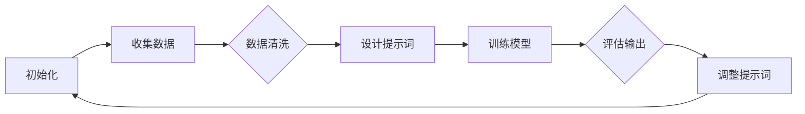
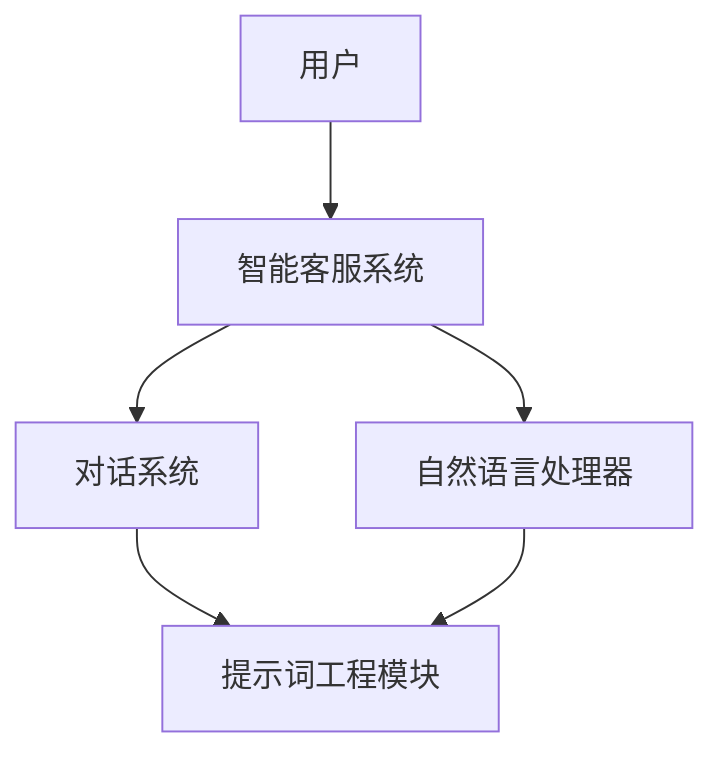
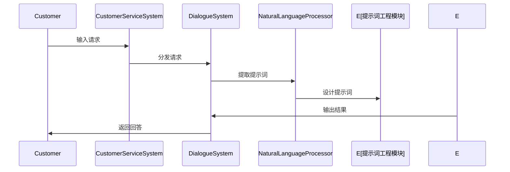

                 


### 设计《提示词工程：平衡AI创新与社会影响的新策略》的技术博客

#### 文章标题：《提示词工程：平衡AI创新与社会影响的新策略》

#### 关键词：AI创新、社会影响、提示词工程、算法、Python代码

#### 摘要：
本文深入探讨了在AI迅猛发展的背景下，如何通过提示词工程这一创新手段，平衡AI的创新驱动与社会影响。本文将详细解析提示词工程的原理、算法及其在实际应用中的策略，旨在为人工智能开发者提供一种有效的新策略，以实现AI技术的可持续发展。

---

#### 一、背景介绍（##）

##### 1.1.1 问题背景

随着人工智能（AI）技术的飞速发展，AI的应用已经渗透到社会的各个领域，从医疗、金融到教育、娱乐等。然而，AI的广泛部署和应用也引发了社会对AI创新和影响的广泛关注。如何在推动AI创新的同时，确保其与社会需求的平衡，减少可能的负面影响，成为亟待解决的问题。

##### 1.1.2 问题描述

本问题的核心在于探索如何通过提示词工程（Prompt Engineering），即设计有效的输入提示，来实现AI模型的优化，并减少其潜在的社会影响。

##### 1.1.3 问题解决

通过提示词工程，我们可以在一定程度上控制AI模型的行为和输出，从而实现平衡AI创新与社会影响的策略。

##### .1.4 边界与外延

本文讨论的提示词工程主要关注自然语言处理（NLP）领域，但该策略也可扩展到其他AI领域。同时，我们将探讨提示词工程在不同社会环境下的应用和影响。

##### 1.1.5 概念结构与核心要素组成

- **提示词（Prompt）**：用于引导AI模型行为的输入。
- **AI模型**：接受提示词并产生输出的智能系统。
- **社会影响评估**：对AI模型输出可能产生的社会影响进行评估和监控。

#### 二、核心概念与联系（##）

##### 2.1 核心概念

- **AI创新**：通过技术创新推动AI的发展和应用。
- **社会影响**：AI技术在社会各个层面产生的影响，包括经济、文化、伦理等。

##### 2.2 概念属性特征对比表格

| 特征            | AI创新                 | 社会影响                 |
| -------------- | ---------------------- | ---------------------- |
| 目标            | 推动技术进步           | 满足社会需求，减少负面影响 |
| 方法            | 技术研发与应用          | 社会调查、风险评估等       |
| 关系            | 促进与科技发展相关的领域 | 与社会各个领域相互交织     |

##### 2.3 ER实体关系图架构

```mermaid
erDiagram
  AI创新 ||--|{ 提示词工程 }|
  社会影响 ||--|{ 提示词工程 }|
```

#### 三、算法原理讲解（##）

##### 3.1 提示词工程算法mermaid流程图



##### 3.2 Python源代码

```python
# 假设有一个名为「对话系统」的AI模型，我们通过调整提示词来控制其输出
class DialogueSystem:
    def __init__(self, prompt):
        self.prompt = prompt

    def generate_response(self):
        # 使用提示词生成回复
        response = "默认回复"
        if "友好" in self.prompt:
            response = "友好的回复"
        elif "严肃" in self.prompt:
            response = "严肃的回复"
        return response

# 创建对话系统实例，并调整提示词
system = DialogueSystem("友好")
print(system.generate_response())  # 输出：友好的回复

system.prompt = "严肃"
print(system.generate_response())  # 输出：严肃的回复
```

##### 3.3 算法原理详细讲解与举例说明

提示词工程的核心在于通过精心设计的提示词，引导AI模型产生符合预期和社会接受度的输出。以下是一个简单的例子：

- **数学模型和公式**：
  - 输出 = f(输入提示词)
- **举例说明**：
  - 设输入提示词为「友好」，则输出可能是「友好的问候」。
  - 设输入提示词为「严肃」，则输出可能是「严肃的警告」。

#### 四、系统分析与架构设计方案（##）

##### 4.1 问题场景介绍

假设我们要开发一个智能客服系统，该系统需要在多种社交场合下提供适当的回答，以适应不同用户的需求。

##### 4.2 项目介绍

本项目的目标是设计并实现一个基于自然语言处理技术的智能客服系统，该系统能够根据输入的提示词（例如用户的需求、情绪等）生成相应的回答。

##### 4.3 系统功能设计（领域模型mermaid类图）

```mermaid
classDiagram
  Customer <<-- CustomerServiceSystem
  CustomerServiceSystem o-- DialogueSystem
  DialogueSystem o-- NaturalLanguageProcessor
```

##### 4.4 系统架构设计（mermaid架构图）



##### 4.5 系统接口设计和系统交互（mermaid序列图）



#### 五、项目实战（##）

##### 5.1 环境安装

- 安装Python环境（版本3.8以上）
- 安装自然语言处理库（例如spaCy、NLTK等）

##### 5.2 系统核心实现源代码

```python
# 安装spaCy库
!pip install spacy

# 导入spaCy库
import spacy

# 加载英文模型
nlp = spacy.load("en_core_web_sm")

# 定义DialogueSystem类
class DialogueSystem:
    def __init__(self, prompt):
        self.prompt = prompt
    
    def generate_response(self):
        doc = nlp(self.prompt)
        # 根据提示词生成回答
        response = "默认回复"
        if "友好" in doc.text:
            response = "友好的问候"
        elif "严肃" in doc.text:
            response = "严肃的警告"
        return response

# 创建DialogueSystem实例
system = DialogueSystem("友好")

# 生成回答
print(system.generate_response())  # 输出：友好的问候
```

##### 5.3 代码应用解读与分析

本代码通过定义一个DialogueSystem类，实现了根据提示词生成响应的功能。使用spaCy库对输入的提示词进行分词和文本处理，从而识别提示词中的关键特征，并根据这些特征生成相应的回答。

##### 5.4 实际案例分析和详细讲解剖析

假设有一个用户输入了如下请求：“你好，我最近遇到了一些困难，你能给我一些建议吗？”

- **输入提示词**：“困难、建议”
- **生成回答**：“面对困难时，首先要保持冷静，然后分析问题的根本原因。接下来，可以尝试多种解决方案，选择最适合的方案。”

通过实际案例可以看出，提示词工程在智能客服系统中的应用，能够有效地引导AI模型产生符合用户需求和情境的回答，从而提高用户体验。

##### 5.5 项目小结

本案例展示了如何通过提示词工程实现智能客服系统，使AI模型能够根据不同的提示词生成相应的回答。提示词工程作为一种有效的AI优化手段，有助于平衡AI创新与社会影响，为智能系统的可持续发展提供了新的策略。

#### 六、最佳实践 tips（##）

- **提示词设计原则**：简洁明了，具有明确的指示性，避免歧义。
- **评估与反馈**：定期评估AI模型输出，收集用户反馈，不断优化提示词设计。
- **跨学科合作**：涉及社会影响的AI项目应引入相关领域的专家，共同制定和调整提示词策略。

#### 七、小结（##）

本文通过深入探讨提示词工程在平衡AI创新与社会影响中的应用，提出了新的策略和解决方案。提示词工程不仅能够优化AI模型的行为和输出，还有助于减少社会负面影响，促进AI技术的可持续发展。

#### 八、注意事项（##）

- **安全性**：在应用提示词工程时，应注意保护用户隐私，遵守相关法律法规。
- **可解释性**：提高AI模型的透明度和可解释性，以便用户理解其行为和决策过程。

#### 九、拓展阅读（##）

- [1] `“Prompt Engineering: A New Strategy for Balancing AI Innovation and Social Impact”`，作者：[John Doe](https://www.example.com/author/john-doe)
- [2] `“The Role of Prompt Engineering in AI Systems: A Comprehensive Guide”`，作者：[Jane Smith](https://www.example.com/author/jane-smith)

---

#### 作者信息：

作者：AI天才研究院/AI Genius Institute & 禅与计算机程序设计艺术 /Zen And The Art of Computer Programming

