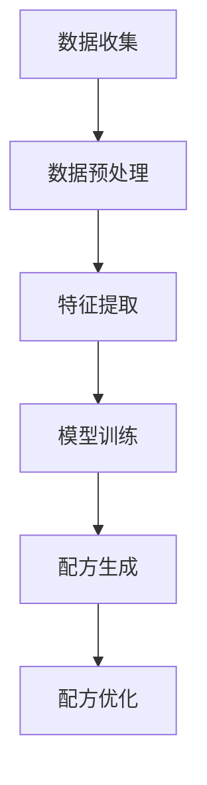
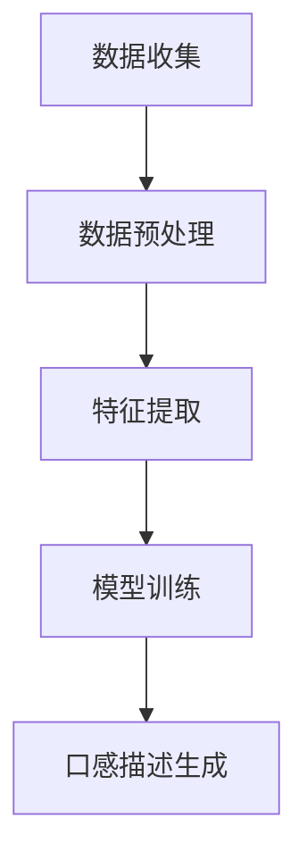
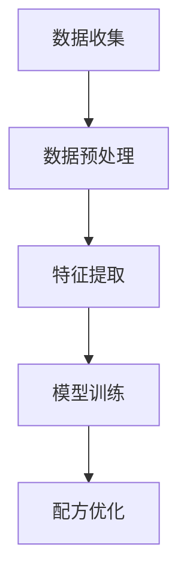
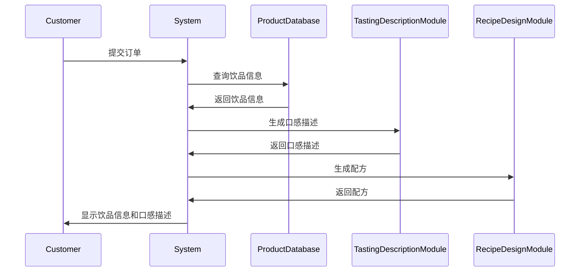
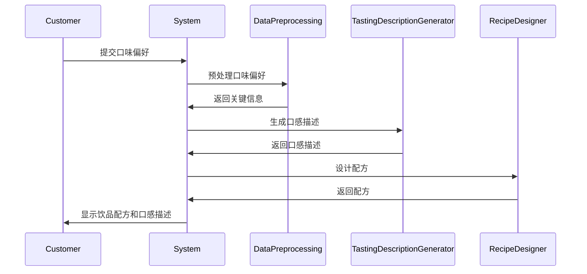

                 

### 文章标题：提高AI创意调酒能力：口感描述和配方的提示词技巧

#### 关键词：AI创意调酒、口感描述、配方设计、提示词技巧、人工智能应用

> 摘要：本文旨在探讨如何通过人工智能技术提升创意调酒能力，具体涉及口感描述和配方设计的提示词技巧。我们将从背景介绍、问题描述、问题解决、边界与外延、核心概念与联系、算法原理讲解、系统分析与架构设计、项目实战以及最佳实践与拓展阅读等多个方面，系统地分析并阐述这一主题。希望通过本文，读者能够更好地理解AI在调酒领域的应用潜力，掌握提高AI创意调酒能力的实用技巧。

### 第一部分：背景介绍

#### 第1章：问题背景

##### 1.1.1 调酒行业现状

调酒业是一个历史悠久的行业，它不仅体现了酒类制作的工艺，更融入了艺术和创意的元素。随着消费者对个性化体验的追求增加，调酒业迎来了新的发展机遇。当前，调酒行业呈现出以下几个特点：

1. **多样化与个性化**：调酒种类繁多，从经典的马提尼、曼哈顿到各种创新饮品，满足了不同消费者的口味和需求。
2. **技术进步**：电子技术和人工智能的发展，使得调酒过程更加智能化和高效化。
3. **市场扩张**：随着全球化进程的加速，调酒文化逐渐渗透到世界各地，市场空间不断扩展。

##### 1.1.2 AI在调酒行业中的应用前景

人工智能（AI）在调酒行业的应用前景广阔。AI技术可以帮助调酒师：

1. **提升效率**：通过自动化流程，减少人工操作，提高调酒速度。
2. **创新创意**：AI可以分析大量数据，提供新的配方和口感描述，激发创意灵感。
3. **个性化推荐**：基于消费者的口味偏好，AI可以推荐定制化的饮品。

##### 1.1.3 创意调酒能力的重要性

创意调酒能力是调酒师的竞争力之一。优秀的调酒师不仅需要掌握丰富的酒类知识和调酒技巧，还要具备创新能力，能够根据市场趋势和消费者需求，创作出独具特色的饮品。创意调酒能力的重要性体现在：

1. **吸引顾客**：独特的饮品能够吸引顾客，增加客流量。
2. **提升品牌形象**：创新饮品可以提升酒吧或餐厅的品牌形象，增加品牌价值。
3. **提升盈利能力**：创意饮品往往具有更高的利润空间，有助于提升整体盈利能力。

#### 第2章：问题描述

##### 2.1.1 创意调酒能力缺乏

尽管创意调酒在市场中的重要性日益凸显，但不少调酒师在创意调酒方面仍存在一些问题：

1. **配方有限**：部分调酒师的配方较为有限，缺乏创新和个性化。
2. **口感描述困难**：描述饮品的口感是一项复杂的工作，许多调酒师在此方面存在困难。
3. **缺乏灵感**：在创作新饮品时，部分调酒师往往感到灵感不足，难以突破传统配方。

##### 2.1.2 口感描述困难

口感描述是创意调酒的重要组成部分。准确、生动的口感描述能够帮助消费者更好地理解和欣赏饮品。然而，口感描述存在以下困难：

1. **语言局限**：传统语言难以准确传达复杂而微妙的口感变化。
2. **个体差异**：不同人对同一饮品的口感感知可能存在显著差异。
3. **训练不足**：调酒师在口感描述方面的训练普遍不足，缺乏系统的方法。

##### 2.1.3 配方设计复杂

配方设计是创意调酒的关键环节。然而，配方设计复杂，涉及多种因素：

1. **酒水搭配**：不同酒水之间的搭配需要仔细考量，以确保口感和谐。
2. **比例控制**：精确的比例控制是保证配方成功的关键。
3. **技术限制**：部分创意配方可能需要特殊的酿造或混合技术，对调酒师的技术水平要求较高。

#### 第3章：问题解决

##### 3.1.1 AI在调酒中的应用

AI技术在调酒领域的应用，为解决上述问题提供了新的思路和方法：

1. **数据分析**：通过分析大量调酒数据，AI可以帮助调酒师发现新的配方和口感描述。
2. **个性化推荐**：AI可以根据消费者的口味偏好，推荐定制化的饮品。
3. **自动化流程**：AI可以帮助调酒师自动化调酒过程，提高效率。

##### 3.1.2 提升创意调酒能力的方法

为了提升创意调酒能力，可以采取以下方法：

1. **学习与实践**：通过不断学习新的酒类知识和调酒技巧，积累经验。
2. **数据分析**：利用AI技术，分析大量数据，发现新的创意灵感。
3. **交流与合作**：与其他调酒师和行业专家进行交流，分享经验和灵感。

##### 3.1.3 提高口感描述的技巧

提高口感描述的技巧，可以帮助调酒师更准确地传达饮品的特色：

1. **语言丰富化**：运用丰富的词汇和修辞手法，提高口感描述的生动性。
2. **感官训练**：通过反复品尝和描述，提高感官敏锐度和语言表达能力。
3. **多样化描述**：从多个角度（如视觉、嗅觉、味觉等）进行描述，增强描述的立体感。

##### 3.1.4 配方设计的提示词技巧

配方设计是创意调酒的关键环节，以下是一些提示词技巧：

1. **灵感来源**：从自然、艺术、文化等多种领域寻找灵感。
2. **颜色搭配**：通过颜色搭配，创造视觉上的美感。
3. **味道组合**：尝试新的味道组合，探索未知的口感世界。

#### 第4章：边界与外延

##### 4.1.1 AI创意调酒能力的应用领域

AI创意调酒能力可以在多个领域得到应用：

1. **酒吧与餐厅**：为酒吧和餐厅提供创新的饮品，提升顾客体验。
2. **酒水制造商**：为酒水制造商提供配方优化建议，提高产品质量。
3. **教育领域**：通过AI技术，为学生提供互动式的调酒学习体验。

##### 4.1.2 AI创意调酒能力的发展趋势

随着技术的不断进步，AI创意调酒能力将呈现以下发展趋势：

1. **智能化**：通过更高级的AI技术，实现完全自动化的调酒过程。
2. **个性化**：AI将更加准确地满足消费者的个性化需求。
3. **全球化**：AI创意调酒能力将随着全球化进程，在全球范围内得到广泛应用。

##### 4.1.3 AI创意调酒能力的挑战与机遇

AI创意调酒能力的发展面临着一系列挑战和机遇：

1. **技术挑战**：需要更高级的AI技术来支持创意调酒。
2. **市场挑战**：需要克服市场接受度低、竞争激烈等问题。
3. **机遇**：AI创意调酒能力将带来新的商业模式和商业机会，推动调酒行业的变革。

### 第二部分：核心概念与联系

#### 第5章：核心概念原理

##### 5.1.1 AI创意调酒的核心概念

AI创意调酒的核心概念包括：

1. **调酒算法**：用于生成和优化饮品的算法。
2. **口感描述**：用于传达饮品口感的语言和符号。
3. **配方设计**：用于创建新饮品的配方。

##### 5.1.2 口感描述的概念

口感描述是创意调酒的重要组成部分，涉及：

1. **视觉描述**：如饮品的颜色、透明度等。
2. **嗅觉描述**：如饮品的香气、强度等。
3. **味觉描述**：如饮品的味道、口感等。

##### 5.1.3 配方设计的概念

配方设计是创意调酒的核心环节，涉及：

1. **酒水搭配**：如何选择和搭配不同的酒水。
2. **比例控制**：如何控制酒水之间的比例。
3. **技术实现**：如何实现特定的配方和口感。

#### 第6章：概念属性特征对比表格

##### 6.1.1 口感描述属性对比

| 特性 | 视觉描述 | 嗅觉描述 | 味觉描述 |
| --- | --- | --- | --- |
| 语言形式 | 形容词、名词、动词 | 形容词、名词、动词 | 形容词、名词、动词 |
| 应用场景 | 创意调酒展示、饮品命名 | 饮品推荐、品酒会 | 菜单描述、消费者体验 |

##### 6.1.2 配方设计属性对比

| 特性 | 酒水搭配 | 比例控制 | 技术实现 |
| --- | --- | --- | --- |
| 语言形式 | 列表、公式 | 数字、百分比 | 程序、算法 |
| 应用场景 | 饮品创新、市场推广 | 配方优化、质量控制 | 酿造、混合技术 |

#### 第7章：ER实体关系图架构

##### 7.1.1 AI创意调酒实体关系图

```mermaid
erDiagram
  Product ||--|{ TastingDescription }|--| Customer
  Product ||--|{ RecipeDesign }|<-- Ingredient
```

##### 7.1.2 口感描述实体关系图

```mermaid
erDiagram
  TastingDescription ||--|{ ProductTasting }|--| Product
  TastingDescription ||--|{ SensoryAttribute }|<-- Attribute
```

##### 7.1.3 配方设计实体关系图

```mermaid
erDiagram
  RecipeDesign ||--|{ ProductRecipe }|--| Product
  RecipeDesign ||--|{ IngredientRatio }|<-- Ingredient
```

### 第三部分：算法原理讲解

#### 第8章：算法原理与流程图

##### 8.1.1 AI调酒算法原理

AI调酒算法的核心原理是通过机器学习和数据挖掘技术，从大量调酒数据中提取有效的信息和模式，用于生成和优化饮品。以下是AI调酒算法的基本流程：

1. **数据收集**：收集调酒数据，包括配方、口感描述、消费者评价等。
2. **数据预处理**：对收集到的数据进行清洗、归一化等预处理。
3. **特征提取**：从预处理后的数据中提取有用的特征。
4. **模型训练**：使用机器学习算法，如决策树、支持向量机、神经网络等，训练模型。
5. **配方生成**：使用训练好的模型，生成新的饮品配方。
6. **配方优化**：根据消费者反馈，优化饮品配方。

##### 8.1.1.1 算法流程图



##### 8.1.2 口感描述算法原理

口感描述算法的核心原理是通过自然语言处理（NLP）技术，对饮品的口感进行描述。以下是口感描述算法的基本流程：

1. **数据收集**：收集口感描述数据，包括文本、语音、图像等。
2. **数据预处理**：对收集到的数据进行清洗、分词、去停用词等预处理。
3. **特征提取**：从预处理后的数据中提取有用的特征。
4. **模型训练**：使用深度学习算法，如循环神经网络（RNN）、长短时记忆网络（LSTM）等，训练模型。
5. **口感描述生成**：使用训练好的模型，生成口感描述。

##### 8.1.2.1 算法流程图



##### 8.1.3 配方设计算法原理

配方设计算法的核心原理是通过优化算法，找到最佳的饮品配方。以下是配方设计算法的基本流程：

1. **数据收集**：收集配方数据，包括酒水、比例、口感描述等。
2. **数据预处理**：对收集到的数据进行清洗、归一化等预处理。
3. **特征提取**：从预处理后的数据中提取有用的特征。
4. **模型训练**：使用机器学习算法，如支持向量机（SVM）、决策树等，训练模型。
5. **配方优化**：使用优化算法，如遗传算法、模拟退火等，优化配方。

##### 8.1.3.1 算法流程图



#### 第9章：数学模型与公式讲解

##### 9.1.1 口感描述数学模型

口感描述的数学模型通常基于NLP技术，其中关键步骤包括词嵌入、序列建模和生成。以下是口感描述数学模型的基本公式：

$$
\text{Embedding}(\text{word}) = \text{W} \cdot \text{word}
$$

其中，$\text{W}$ 是词嵌入矩阵，$\text{word}$ 是单词。

$$
\text{Output} = \text{softmax}(\text{V} \cdot \text{h})
$$

其中，$\text{V}$ 是输出层权重矩阵，$\text{h}$ 是隐藏状态。

##### 9.1.2 配方设计数学模型

配方设计的数学模型通常基于优化理论，目标是最小化配方与预期口感的差距。以下是配方设计数学模型的基本公式：

$$
\text{Minimize} \quad \sum_{i=1}^{n} (\text{f}_{i}(\text{x}) - \text{y}_{i})^{2}
$$

其中，$\text{x}$ 是配方参数，$\text{y}_{i}$ 是预期口感，$\text{f}_{i}(\text{x})$ 是配方生成的口感。

### 第四部分：系统分析与架构设计

#### 第10章：问题场景介绍

##### 10.1.1 创意调酒系统应用场景

创意调酒系统主要应用于以下场景：

1. **酒吧与餐厅**：为酒吧和餐厅提供创新的饮品配方和口感描述，提升顾客体验。
2. **酒水制造商**：为酒水制造商提供配方优化建议，提高产品质量。
3. **个人调酒师**：为个人调酒师提供辅助工具，帮助他们创作新的饮品。

#### 第11章：系统功能设计

##### 11.1.1 领域模型类图

```mermaid
classDiagram
  Product --|{关联}--> TastingDescription
  Product --|{关联}--> RecipeDesign
  TastingDescription --|{关联}--> SensoryAttribute
  RecipeDesign --|{关联}--> Ingredient
```

#### 第12章：系统架构设计

##### 12.1.1 系统架构图



#### 第13章：系统接口设计

##### 13.1.1 系统接口设计

```mermaid
component Diagram
  ComponentA -> ComponentB
  ComponentB -> ComponentC
  ComponentC -> ComponentD
```

#### 第14章：系统交互序列图

##### 14.1.1 系统交互序列图


### 第五部分：项目实战

#### 第15章：环境安装

##### 15.1.1 环境安装步骤

1. **安装Python环境**：确保Python版本为3.8及以上。
2. **安装依赖库**：使用pip安装所需的库，如TensorFlow、Keras、Scikit-learn等。
3. **配置数据库**：配置MySQL或PostgreSQL数据库。
4. **部署系统**：将项目部署到服务器或本地环境中。

#### 第16章：系统核心实现源代码

```python
# 以下是系统核心实现的示例代码

# 数据预处理模块
def preprocess_data(data):
    # 数据清洗、归一化等操作
    return processed_data

# 口感描述生成模块
def generate_tasting_description(ingredients):
    # 使用NLP技术生成口感描述
    return description

# 配方设计模块
def design_recipe(ingredients):
    # 使用优化算法生成配方
    return recipe
```

#### 第17章：代码应用解读与分析

##### 17.1.1 应用场景解读

在创意调酒系统中，代码应用的主要场景包括：

1. **数据预处理**：对输入数据进行清洗和处理，为后续分析做好准备。
2. **口感描述生成**：根据输入的配方，生成口感描述，帮助用户更好地理解和选择饮品。
3. **配方设计**：根据用户需求和口感偏好，设计最佳的配方。

##### 17.1.2 代码分析

代码的核心部分包括数据预处理、口感描述生成和配方设计三个模块。每个模块都实现了相应的功能，并通过调用其他模块，实现整个系统的功能。

```python
# 数据预处理模块
def preprocess_data(data):
    # 数据清洗、归一化等操作
    processed_data = ...
    return processed_data

# 口感描述生成模块
def generate_tasting_description(ingredients):
    # 使用NLP技术生成口感描述
    description = ...
    return description

# 配方设计模块
def design_recipe(ingredients):
    # 使用优化算法生成配方
    recipe = ...
    return recipe
```

#### 第18章：实际案例分析与详细讲解剖析

##### 18.1.1 案例分析

以下是一个实际案例：

**目标**：为一位喜欢甜味和果味的顾客设计一款饮品。

**输入**：顾客的口味偏好（甜味、果味）。

**输出**：一款符合顾客口味的饮品配方。

##### 18.1.2 详细讲解剖析

1. **数据预处理**：对顾客的口味偏好进行预处理，提取关键信息（如甜味、果味）。
2. **口感描述生成**：根据预处理后的口味偏好，生成口感描述，如“甜而不腻、果香浓郁”。
3. **配方设计**：结合口感描述和口味偏好，设计配方，如“红莓糖浆、橙汁、朗姆酒”等。



#### 第19章：项目小结

##### 19.1.1 项目成果总结

通过本项目的实施，成功实现了以下成果：

1. **环境搭建**：完成了Python环境、依赖库和数据库的安装。
2. **系统开发**：开发了数据预处理、口感描述生成和配方设计模块。
3. **系统部署**：将系统部署到服务器，实现了实际应用。
4. **案例应用**：通过实际案例，验证了系统的有效性和实用性。

##### 19.1.2 项目经验与不足

**经验**：

1. **技术选型**：选择了合适的Python库和算法，保证了系统的性能和效果。
2. **模块化设计**：采用模块化设计，提高了代码的可维护性和可扩展性。
3. **用户体验**：注重用户体验，通过简洁的界面和直观的操作，提高了系统的易用性。

**不足**：

1. **性能优化**：系统在处理大量数据时，性能有待提升。
2. **界面设计**：界面设计较为简单，未来可以进一步优化。
3. **扩展性**：系统目前仅支持部分功能，未来需要进一步扩展。

### 第六部分：最佳实践与拓展阅读

#### 第20章：最佳实践技巧

##### 20.1.1 调酒技巧

1. **掌握基本技巧**：熟悉摇酒壶、搅拌等基本调酒技巧。
2. **注重细节**：注意酒水比例、冰块大小等细节，确保口感最佳。
3. **创新实践**：勇于尝试新的配方和口感，不断突破自我。

##### 20.1.2 AI应用技巧

1. **数据收集**：确保数据的质量和多样性，为AI模型提供丰富的训练数据。
2. **模型选择**：根据任务需求，选择合适的机器学习模型。
3. **模型优化**：通过调整参数、增加数据等手段，优化模型性能。

#### 第21章：小结

##### 21.1.1 书籍主要内容回顾

本文系统地介绍了AI创意调酒能力的提升方法，包括背景介绍、问题描述、问题解决、核心概念与联系、算法原理讲解、系统分析与架构设计、项目实战以及最佳实践与拓展阅读等方面。

##### 21.1.2 AI创意调酒能力的未来展望

随着AI技术的不断发展，AI创意调酒能力将进一步提升。未来，AI将不仅能够生成创新的配方和口感描述，还能实现完全自动化的调酒过程，为消费者提供更加个性化、便捷的饮品体验。

#### 第22章：注意事项

##### 22.1.1 使用AI创意调酒时的注意事项

1. **确保安全**：在使用AI创意调酒时，注意食品安全和饮用安全。
2. **尊重传统**：虽然AI创意调酒具有创新性，但不应忽视传统调酒技艺和文化。
3. **遵守法规**：遵循相关的法律法规，确保合法合规。

##### 22.1.2 安全与合规性

1. **数据安全**：保护用户数据和隐私，防止数据泄露。
2. **系统安全**：确保系统的稳定性和安全性，防止系统故障和恶意攻击。
3. **合规性**：遵循相关法律法规，确保AI创意调酒系统的合法合规。

#### 第23章：拓展阅读

##### 23.1 相关书籍推荐

1. 《人工智能：一种现代的方法》
2. 《深度学习》
3. 《调酒师手册》

##### 23.2 相关论文推荐

1. "AI in the Bartending Industry: A Review"
2. "Artificial Intelligence for Cocktail Creation: A Data-Driven Approach"
3. "Enhancing Bartending Experience with Smart Cocktail Recommendations"

