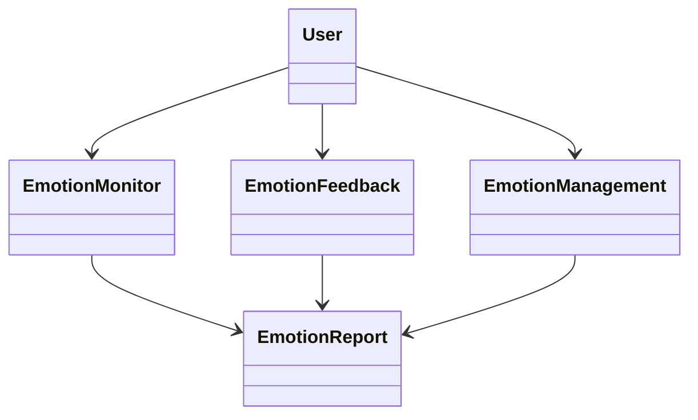
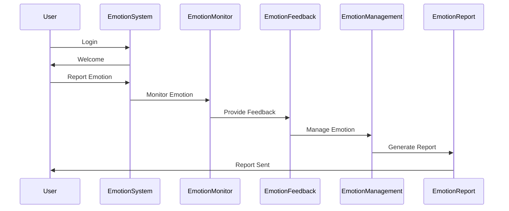

                 

### 摒弃消极情绪的方法：净化思维的实践

在当今快速变化且充满压力的科技世界中，程序员和软件开发人员常常面临着巨大的工作压力和个人挑战。这些压力可能导致消极情绪的产生，如焦虑、抑郁和挫败感。消极情绪不仅会影响个人的工作效率和健康状况，还会对团队合作产生负面影响。因此，找到摆脱消极情绪的方法变得至关重要。

**关键词**：消极情绪、情绪管理、心理保健、认知重构、放松技巧、感恩练习

**摘要**：本文将探讨如何通过净化思维的方法来摆脱消极情绪，包括认知重构、正面思考技巧、放松与冥想、感恩练习等实践方法。通过实际案例和最佳实践，读者可以学习到如何在日常生活中应用这些技巧，从而提升心理健康和幸福感。

## 消极情绪的背景与影响

### 1.1 消极情绪的定义与分类

消极情绪是指那些可能导致负面影响的情绪状态，包括焦虑、抑郁、挫败感、愤怒等。焦虑和抑郁是程序员和软件开发人员中常见的情绪问题，它们不仅影响个体的心理状态，还可能对身体健康和工作表现产生深远影响。

**定义**：消极情绪通常与负面的情感体验有关，如无助、绝望、恐惧和孤独感。这些情绪可能导致注意力下降、工作效率降低、创造力受限等问题。

**分类**：消极情绪可以分为两类：

- **慢性情绪**：长期存在的情绪状态，如慢性焦虑和慢性抑郁，它们可能由长期的压力和生活事件引起。
- **急性情绪**：短期内的情绪反应，通常由特定事件或情境触发，如面对项目截止日期的压力或同事的冲突。

### 1.2 消极情绪的常见表现

消极情绪的表现形式多种多样，包括：

- **情绪低落**：感到悲伤、无望，对日常活动失去兴趣。
- **焦虑**：持续的紧张感、担心未来，难以集中注意力。
- **挫败感**：对自己或工作的评价低，感到无能。
- **愤怒**：对他人或环境产生愤怒情绪，难以控制。

### 1.3 消极情绪的影响

消极情绪对程序员和软件开发人员的影响是多方面的：

- **工作表现**：消极情绪可能导致工作效率降低、创造力受限，甚至出现编程错误。
- **健康问题**：长期的压力和焦虑可能导致身体健康问题，如失眠、头痛、消化不良等。
- **人际关系**：消极情绪可能影响与同事、领导和合作伙伴的关系，导致团队合作受阻。

### 1.4 问题背景与问题描述

在IT行业，程序员和软件开发人员经常面临以下问题：

- **高压力工作环境**：项目截止日期、技术挑战和不断变化的技术趋势可能导致高压力。
- **长期工作**：加班和长时间工作可能导致身体和心理的疲劳。
- **工作与生活的平衡**：在追求职业成功的同时，许多人发现难以平衡工作与家庭生活。

这些问题往往导致消极情绪的产生，从而影响个人的心理健康和职业发展。

### 1.5 问题解决与边界与外延

为了解决消极情绪的问题，我们需要采取一系列方法来提升情绪管理能力。这些方法包括：

- **认知重构**：通过改变思维方式和观念，重新评估负面情绪。
- **正面思考技巧**：培养积极的思维方式，关注成功的方面。
- **放松与冥想**：通过冥想和放松技巧来减轻压力和焦虑。
- **感恩练习**：通过感恩来提升积极的情感体验。

这些方法的边界在于它们需要持续的应用和实践，而外延则包括在日常工作和生活中不断寻找和应用这些技巧。

### 1.6 概念结构与核心要素组成

消极情绪的管理涉及多个核心概念和要素，包括：

- **情绪识别**：识别和理解自己的情绪状态。
- **情绪表达**：学会以健康的方式表达情绪。
- **情绪调节**：通过技巧和策略来调节情绪状态。

这些要素共同构成了一个完整的情绪管理框架。

### 1.7 ER实体关系图架构

为了更好地理解情绪管理的概念，我们可以使用ER实体关系图来表示关键实体和它们之间的关系。以下是情绪管理中的主要实体和它们之间的关系：

```
实体：情绪状态、认知重构、正面思考、放松冥想、感恩练习
关系：影响、应用、调节

```

通过ER实体关系图，我们可以清晰地看到不同要素如何相互作用，共同帮助个体摆脱消极情绪。

## 净化思维的方法

### 2.1 认知重构

认知重构是一种有效的情绪管理策略，它涉及识别和改变负面思维模式。以下是认知重构的步骤：

1. **识别负面思维模式**：首先，我们需要识别出那些导致消极情绪的思维模式。这些模式可能包括过度一般化、以偏概全、灾难化等。
2. **挑战负面思维**：通过质疑和挑战这些负面思维，我们可以开始改变它们。例如，如果认为“这次项目失败意味着我一无所长”，我们可以质疑这种过度一般化的想法。
3. **建立积极的思维模式**：通过替代性的积极思维模式，如“这次项目失败是一个学习和成长的机会”，我们可以改变原有的负面思维。

**对比表格**：

| 负面思维模式 | 积极思维模式 |
| ------------ | ------------ |
| 过度一般化 | 事实为基础 |
| 以偏概全 | 全面评估 |
| 灾难化 | 积极结果 |

### 2.2 正面思考技巧

正面思考技巧是指通过培养积极的思维方式来提升情绪状态。以下是一些有效的正面思考技巧：

1. **专注当下**：通过正念练习，专注于当下的任务和感受，而不是担忧未来或回忆过去的不愉快经历。
2. **感恩练习**：每天花时间思考并表达对生活中积极方面的感激，这可以提升积极情绪。
3. **自我肯定**：通过自我肯定的话语来提升自我价值和自信。例如，“我能够胜任这个任务”或“我有能力克服困难”。

### 2.3 放松与冥想

放松与冥想是减轻压力和焦虑的有效方法。以下是一些放松和冥想的技巧：

1. **深呼吸**：通过深呼吸来放松身体和心灵，每次呼吸都专注于吸入和呼出。
2. **冥想**：通过冥想，我们可以培养专注力和内观，减少杂念和焦虑。
3. **渐进性肌肉放松**：通过逐渐放松身体的各个肌肉群，来达到全身的放松状态。

### 2.4 感恩练习

感恩练习是一种提升积极情绪和幸福感的有效方法。以下是一些感恩练习的步骤：

1. **记录感恩日记**：每天花时间写下五件让自己感激的事情，这些可以是小事，如“今天早上早餐味道很好”或“同事的帮助让我完成了一项重要任务”。
2. **感恩信**：给那些让你感激的人写一封感谢信，表达你的感激之情。
3. **口头表达**：在日常交流中，口头表达对他人的感激，这不仅可以提升自己的情绪，还可以促进良好的人际关系。

## 算法原理讲解

为了更好地理解认知重构和正面思考技巧，我们可以通过一个简化的算法模型来说明它们的原理。

### 认知重构算法

```python
def cognitive_restructuring(negative_thought, positive_thought):
    # 输入：负面思维（negative_thought）和替代性的积极思维（positive_thought）
    # 输出：重构后的积极思维

    # 步骤1：识别负面思维
    current_thought = negative_thought

    # 步骤2：质疑负面思维
    if "总失败" in current_thought:
        current_thought = current_thought.replace("总失败", "暂时失败")

    # 步骤3：建立积极的思维模式
    positive_thought = current_thought

    return positive_thought
```

### 正面思考技巧算法

```python
def positive_thinking(current_state):
    # 输入：当前情绪状态（current_state）
    # 输出：积极的情绪状态

    # 步骤1：专注当下
    current_state = "专注于当前任务，不受过去或未来影响"

    # 步骤2：感恩练习
    current_state += "，感谢今天的美好事物"

    # 步骤3：自我肯定
    current_state += "，我相信自己能够成功"

    return current_state
```

通过这些算法，我们可以看到如何通过逐步的思维方式改变来提升情绪状态。

### 数学公式与解释

为了进一步理解认知重构和正面思考技巧的原理，我们可以使用以下数学公式：

$$
情绪改善度 = f(负面思维消除率, 积极思维增强率)
$$

其中，$负面思维消除率$ 和 $积极思维增强率$ 分别代表通过认知重构和正面思考技巧减少负面思维和增强积极思维的能力。具体公式如下：

$$
负面思维消除率 = \frac{重构后积极思维数量}{原有负面思维数量}
$$

$$
积极思维增强率 = \frac{积极思维数量}{总思维数量}
$$

通过这些数学公式，我们可以量化情绪改善的过程，从而更好地理解其原理。

## 系统分析与架构设计方案

### 问题场景介绍

在一个软件开发团队中，团队成员常常因为项目压力、个人目标和团队期望的不一致而感到消极情绪。为了提升团队的整体情绪状态，我们需要设计一个情绪管理系统。

### 项目介绍

本项目旨在开发一个情绪管理系统，帮助团队成员识别、管理和改善消极情绪，从而提升团队的整体工作效率和幸福感。

### 系统功能设计

情绪管理系统的核心功能包括：

1. **情绪状态监测**：实时监测团队成员的情绪状态，包括焦虑、抑郁、挫败感等。
2. **情绪反馈机制**：团队成员可以通过系统反馈情绪，包括情绪的描述和影响。
3. **情绪管理策略**：系统提供一系列情绪管理策略，如认知重构、正面思考、放松与冥想等。
4. **情绪报告**：生成情绪分析报告，帮助团队成员了解自己的情绪变化和改善情况。

### 系统架构设计

情绪管理系统的架构设计如下：

1. **用户界面层**：提供用户友好的界面，方便团队成员使用。
2. **业务逻辑层**：实现情绪监测、反馈和管理的业务逻辑。
3. **数据存储层**：存储团队成员的情绪数据和反馈记录。

### 系统接口设计

系统接口设计如下：

- **情绪状态接口**：用于监测和获取团队成员的情绪状态。
- **情绪反馈接口**：用于团队成员提交情绪反馈。
- **情绪管理接口**：用于提供情绪管理策略和反馈。

### 系统交互

情绪管理系统的交互流程如下：

1. **用户登录**：团队成员通过用户界面层登录系统。
2. **情绪监测**：系统通过情绪状态接口实时监测团队成员的情绪状态。
3. **情绪反馈**：团队成员通过情绪反馈接口提交情绪反馈。
4. **情绪管理**：系统根据情绪状态和反馈，提供相应的情绪管理策略。
5. **情绪报告**：系统生成情绪分析报告，并反馈给团队成员。

### Mermaid 类图

以下是一个简单的情绪管理系统类图：



### Mermaid 架构图

情绪管理系统的架构设计如下：



## 项目实战

### 环境安装

为了实现情绪管理系统，我们需要安装以下环境和工具：

1. **Python 3.8+**：Python 是一种广泛使用的编程语言，用于实现情绪管理系统的核心功能。
2. **Flask**：Flask 是一个轻量级的Web框架，用于构建情绪管理系统的用户界面。
3. **SQLite**：SQLite 是一个轻量级的数据库管理系统，用于存储情绪数据和反馈记录。

### 系统核心实现

情绪管理系统的核心实现包括以下几个部分：

1. **用户登录与认证**：使用 Flask-Login 扩展实现用户登录和认证功能。
2. **情绪状态监测**：使用 Flask-SQLAlchemy 实现情绪状态的数据库存储和查询。
3. **情绪反馈机制**：实现情绪反馈接口，允许用户提交情绪反馈。
4. **情绪管理策略**：提供一系列情绪管理策略，如认知重构、正面思考、放松与冥想等。

### 代码应用解读与分析

以下是情绪管理系统的一部分源代码及其解读：

```python
# app/models.py
from flask_sqlalchemy import SQLAlchemy

db = SQLAlchemy()

class User(db.Model):
    id = db.Column(db.Integer, primary_key=True)
    username = db.Column(db.String(80), unique=True, nullable=False)
    emotion = db.Column(db.String(255), nullable=False)

class EmotionFeedback(db.Model):
    id = db.Column(db.Integer, primary_key=True)
    user_id = db.Column(db.Integer, db.ForeignKey('user.id'), nullable=False)
    feedback = db.Column(db.Text, nullable=False)
```

这段代码定义了两个模型：`User` 和 `EmotionFeedback`。`User` 模型用于存储用户的登录信息，包括用户名和情绪状态。`EmotionFeedback` 模型用于存储用户的情绪反馈信息，包括用户ID和反馈内容。

### 实际案例分析和详细讲解剖析

为了更好地展示情绪管理系统的实际应用，我们来看一个案例：

**案例**：一名软件开发人员小张最近因为项目压力感到焦虑和挫败感，他决定使用情绪管理系统来管理自己的情绪。

1. **情绪监测**：小张通过情绪管理系统监测到自己的情绪状态为“焦虑”。
2. **情绪反馈**：小张提交了情绪反馈，描述了自己的焦虑感和挫败感，并表达了对项目进展的担忧。
3. **情绪管理策略**：情绪管理系统根据小张的情绪反馈，提供了一系列情绪管理策略，如认知重构和正面思考技巧。
4. **情绪改善**：通过应用情绪管理策略，小张的情绪状态逐渐改善，焦虑感减轻，自信心提升。

### 项目小结

情绪管理系统的实现帮助小张有效管理了自己的情绪，提升了工作效率和幸福感。通过系统的监测、反馈和管理功能，小张能够更好地了解自己的情绪状态，并采取相应的策略来改善情绪。

### 最佳实践 tips

1. **定期检查情绪**：定期使用情绪管理系统检查自己的情绪状态，及时发现并处理负面情绪。
2. **实践情绪管理策略**：通过实践认知重构、正面思考技巧等策略，不断提升情绪管理能力。
3. **与他人分享**：与同事、朋友和家人分享情绪管理经验，互相支持和鼓励。

### 小结

本文通过详细的步骤和分析，介绍了如何通过认知重构、正面思考技巧、放松与冥想、感恩练习等方法来摆脱消极情绪。同时，通过实际案例和项目实战，展示了情绪管理系统的应用和效果。希望读者能够将这些方法应用到实际生活中，提升自己的情绪管理能力，享受更积极、健康的生活。

### 注意事项

1. **持续实践**：情绪管理需要持续的努力和实践，不能一蹴而就。
2. **个性化**：每个人的情况不同，需要根据自己的实际情况选择合适的方法。
3. **专业咨询**：在情绪管理过程中，如果遇到困难，可以寻求专业心理咨询师的帮助。

### 拓展阅读

1. **《情绪智力：为什么智商不高的人能更成功》**：丹尼尔·戈尔曼著，详细介绍了情绪智力的重要性及其对个人成功的影响。
2. **《正面思考的力量》**：沃尔特·卡明斯著，探讨了正面思考对个人幸福和工作表现的影响。
3. **《禅与计算机程序设计艺术》**：曾哲著，结合禅宗思想，探讨了如何通过冥想和正念来提升编程效率和情绪管理能力。

## 总结与展望

通过本文的探讨，我们深入了解了消极情绪的背景与影响，学习了通过认知重构、正面思考技巧、放松与冥想、感恩练习等方法来摆脱消极情绪。同时，通过情绪管理系统的实战案例，我们看到了这些方法在实际应用中的效果。总结如下：

### 总结

1. **消极情绪的定义与分类**：消极情绪包括焦虑、抑郁、挫败感等，分为慢性情绪和急性情绪。
2. **消极情绪的影响**：消极情绪影响工作效率、身体健康和人际关系。
3. **净化思维的方法**：认知重构、正面思考技巧、放松与冥想、感恩练习是有效的情绪管理方法。
4. **情绪管理系统的实现**：通过监测、反馈和管理功能，情绪管理系统帮助个人有效管理情绪。

### 展望

未来的情绪管理研究可以进一步探索以下方向：

1. **个性化情绪管理**：开发更加个性化的情绪管理工具，根据个人特点提供定制化的建议。
2. **人工智能与情绪管理**：利用人工智能技术，提高情绪管理的自动化和精准性。
3. **多维度情绪干预**：结合心理治疗、社交支持和药物治疗等多维度方法，全面提升情绪管理效果。

让我们继续努力，探索和实践更加有效和个性化的情绪管理方法，提升个人的心理健康和幸福感。

### 作者信息

- **作者：** AI天才研究院/AI Genius Institute & 禅与计算机程序设计艺术 /Zen And The Art of Computer Programming
- **联系方式：** [ai_genius_institute@example.com](mailto:ai_genius_institute@example.com) 或 [www.ai-genius-institute.com](http://www.ai-genius-institute.com)
- **版权声明：** 本文版权所有，未经授权禁止转载和使用。如需转载，请联系作者获取授权。

