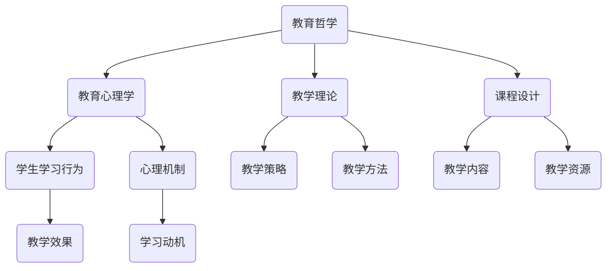
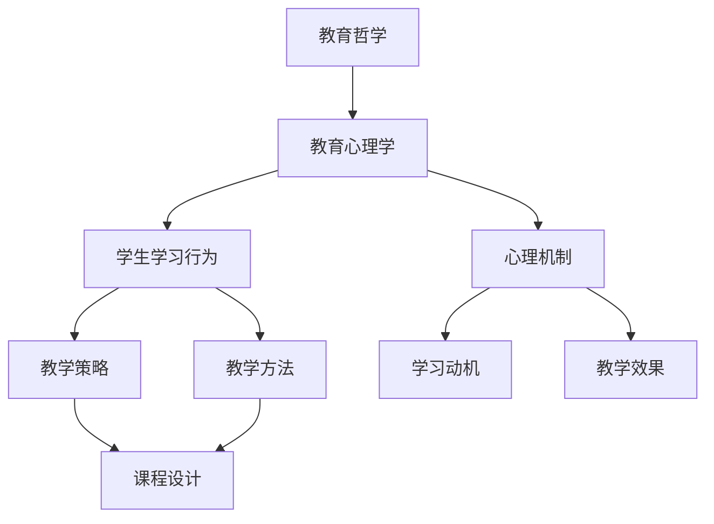
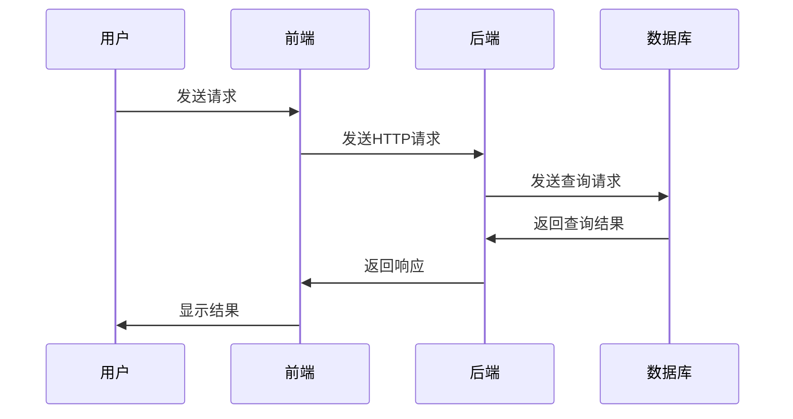

                 

**《教育的意义：培养能应对未来挑战的下一代》**

**关键词：教育、未来挑战、下一代、人工智能、技术变革**

**摘要：**
本文深入探讨了教育的本质及其在应对未来挑战中的关键作用。我们将从教育的哲学基础、未来社会的挑战、教育体系改革、教育与个人发展、技术与教育的结合、教育与职业规划等方面，逐步分析并阐述如何通过教育培养下一代，使其能够有效地应对未来的挑战。

## 引言

**教育的哲学基础**

### 教育的定义与本质

教育，作为一个古老而又永恒的主题，其定义和本质在不同文化、不同历史时期有着不同的解读。但在本质层面上，教育可以被定义为“引导个体实现全面发展，培养其认知、情感、道德和社交能力的过程”。

**教育的目的与意义**

教育的目的不仅在于传授知识，更在于培养个体的能力，帮助其形成正确的价值观和世界观，使其能够适应社会、服务于社会。教育的意义在于塑造人类文明、推动社会进步、实现个体价值。

### 教育的哲学基础理论

在众多教育哲学理论中，有代表性的如柏拉图的理念论、夸美纽斯的自然教育论、卢梭的理性主义教育论、康德的道德教育论等。这些理论从不同角度阐述了教育的目的、方法和意义。

## 未来社会的挑战

### 社会发展的趋势

随着科技的飞速发展，未来社会将呈现出许多新的发展趋势。比如，人工智能、大数据、区块链等技术的广泛应用，将深刻改变我们的生产方式、生活方式和社会结构。

**技术变革的影响**

技术的变革不仅带来了生产力的提升，也带来了教育方式的变革。在线教育、远程教学等新形式的教育方式，将使教育更加灵活、便捷、个性化。

### 人口与社会结构的变迁

未来，人口老龄化、城市化、全球化等趋势将日益明显。这些变化对教育提出了新的挑战，要求教育体系能够更好地适应人口和社会结构的变迁。

## 教育体系改革

### 教育制度的现状

当前，我国的教育制度在制度设计、教育资源分配、教学方法等方面仍存在一些不足。比如，应试教育体制下，学生的创造力和实践能力得不到有效培养。

**改革的方向与动力**

为了应对未来社会的挑战，教育体系改革势在必行。改革的方向应包括：提升教育质量、促进教育公平、培养创新型人才等。改革的动力则来自于社会需求、技术进步和教育内在的矛盾。

### 教育体系改革的具体措施

具体措施包括：优化教育资源分配、创新教育方式、加强教师队伍建设等。比如，通过建设数字化教育资源平台，实现优质教育资源的共享；通过推行项目制学习、探究式学习等新型教育模式，培养学生的创新能力和实践能力。

## 教育与个人发展

### 教育对个人成长的影响

教育不仅是知识的传递，更是能力的培养。教育能够帮助个体形成正确的价值观、世界观，培养其思维能力、创新能力、适应能力等。

**教育与心理健康**

心理健康是个人发展的重要方面。教育在培养心理健康方面起着关键作用。通过教育，个体能够更好地应对压力、挫折，形成健康的心理状态。

## 技术与教育的结合

### 新技术在教育中的应用

随着人工智能、大数据、虚拟现实等新技术的发展，这些技术已经开始在教育领域得到广泛应用。比如，通过人工智能技术，可以实现个性化学习、智能辅导；通过大数据技术，可以分析学生的学习行为，优化教学策略。

**教育技术的挑战与机遇**

教育技术的挑战在于如何有效利用技术，提升教育质量；机遇则在于技术能够带来教育的变革，实现教育的个性化、智能化。

## 教育与职业规划

### 职业发展的趋势

未来，随着科技的进步，许多传统职业将面临挑战，新的职业机会也将不断涌现。这要求教育体系能够更好地适应职业发展的趋势，培养出适应未来职业市场的人才。

**教育与职业规划的关系**

教育不仅是职业准备，更是职业生涯的支持。通过教育，个体能够不断提升自己的能力，适应不断变化的职业市场。

## 总结与展望

### 教育的意义与价值

教育对于个人、社会、国家都有着深远的意义和价值。它不仅能够提升个体素质，推动社会进步，还是实现国家发展战略的重要支撑。

**未来教育的展望**

未来教育将更加注重个性化和智能化，更加注重培养学生的创新能力和实践能力。通过教育，我们有望培养出能够应对未来挑战的下一代。

## 作者

**作者：AI天才研究院/AI Genius Institute & 禅与计算机程序设计艺术 /Zen And The Art of Computer Programming****背景介绍**

在教育领域，核心概念术语包括教育哲学、教育心理学、教学理论、课程设计等。这些术语构成了教育研究的基石，帮助我们理解教育的本质和目的。例如，教育哲学探讨教育的价值观和方法论，教育心理学研究学生的学习行为和心理机制，教学理论关注教学策略和教学方法，课程设计则涉及如何整合各种教育资源，实现教学目标。

问题背景方面，现代社会正面临着前所未有的挑战，如技术变革、社会变迁、人口老龄化等。这些挑战对教育体系提出了新的要求，促使我们思考如何培养能够适应未来社会的下一代。具体问题描述是，当前的教育体系是否能够有效应对这些挑战，培养出具备创新能力、实践能力和适应能力的新一代。

问题解决方面，我们需要通过教育改革和创新，提升教育质量，培养适应未来社会的综合型人才。边界与外延则需要明确教育的适用范围，如不同年龄段、不同地区、不同文化背景下的教育差异和共性。此外，教育体系还需关注如何平衡教育公平与教育质量之间的关系。

**核心概念与联系**

首先，我们需要理解几个核心概念：教育哲学、教育心理学、教学理论和课程设计。教育哲学关注教育的价值观和方法论，它探讨了“为什么教育是必要的”、“教育的目标是什么”等问题。教育心理学研究学生的认知、情感、行为等心理机制，为我们提供了理解学生学习和行为的基础。教学理论则涉及教学策略和方法，它帮助我们设计有效的教学活动。课程设计则是将这些理论付诸实践的过程，它涉及到如何整合教学内容、教学方法和教学资源。

在教育哲学方面，不同的流派有不同的观点。例如，柏拉图的理性主义教育论强调通过理性思考培养个体的智慧；夸美纽斯的自然教育论则主张教育应顺应个体的自然发展。这些教育哲学理论为我们理解教育的本质和目的提供了不同的视角。

在教育心理学方面，行为主义心理学关注外部刺激对学习行为的影响，而认知心理学则强调内部认知过程在学习中的作用。这两种心理学理论为我们理解学习过程提供了不同的框架。

教学理论方面，建构主义教学理论强调学生主动构建知识的过程，而传统的教师中心教学模式则强调教师的权威和主导作用。这两种理论为我们设计教学活动提供了不同的思路。

课程设计方面，我们需要考虑如何整合教学内容、教学方法和教学资源。例如，通过项目制学习，学生可以在实践中学习，从而更好地理解理论知识。

**概念属性特征对比表格**

| 概念        | 定义                                                         | 特征                                                                                      |
| ----------- | ------------------------------------------------------------ | ----------------------------------------------------------------------------------------- |
| 教育哲学    | 探讨教育的价值观和方法论                                     | 强调教育的目的和意义，影响教育政策和实践                                             |
| 教育心理学  | 研究学生的学习行为和心理机制                               | 提供理解学生学习和行为的基础，指导教学设计和方法                                       |
| 教学理论    | 研究教学策略和方法                                         | 涉及如何设计教学活动，实现教学目标                                                   |
| 课程设计    | 整合教学内容、教学方法和教学资源                           | 确保教学目标的实现，提升教学效果                                                     |

**ER实体关系图架构**

以下是教育领域核心概念及其关系的ER实体关系图：



**算法原理讲解**

为了更好地理解教育中的核心概念及其关系，我们可以采用图论算法中的“最短路径算法”来表示这些概念之间的联系。最短路径算法可以帮助我们找出从起点到终点的最短路径，从而理解不同概念之间的直接关系。



**Python源代码实现**

```python
import networkx as nx
import matplotlib.pyplot as plt

# 创建一个空的图
G = nx.Graph()

# 添加节点和边
G.add_nodes_from(['教育哲学', '教育心理学', '学生学习行为', '心理机制', '教学策略', '教学方法', '课程设计', '学习动机', '教学效果'])
G.add_edges_from([
    ('教育哲学', '教育心理学'),
    ('教育哲学', '教学理论'),
    ('教育哲学', '课程设计'),
    ('教育心理学', '学生学习行为'),
    ('教育心理学', '心理机制'),
    ('学生学习行为', '教学策略'),
    ('学生学习行为', '教学方法'),
    ('心理机制', '学习动机'),
    ('心理机制', '教学效果'),
    ('教学策略', '课程设计'),
    ('教学方法', '课程设计')
])

# 绘制图
nx.draw(G, with_labels=True)
plt.show()
```

**算法原理解释**

在这个算法中，我们首先使用NetworkX库创建一个无向图，节点代表不同的教育概念，边表示概念之间的关系。通过添加节点和边，我们构建了一个教育概念的关系图。

然后，我们使用matplotlib库来绘制这个图，使得教育概念之间的关系可视化。这有助于我们直观地理解不同概念之间的联系，从而更好地理解教育体系。

**数学模型和公式**

在教育领域中，最短路径算法的数学模型可以表示为：

$$
D(s, t) = \min \{ d(u, v) \mid (u, v) \in E \}
$$

其中，$D(s, t)$ 表示从节点 $s$ 到节点 $t$ 的最短路径长度，$d(u, v)$ 表示节点 $u$ 和节点 $v$ 之间的边权重。

**举例说明**

假设我们有以下教育概念及其关系：

- 教育哲学
- 教育心理学
- 学生学习行为
- 心理机制
- 教学策略
- 教学方法
- 课程设计
- 学习动机
- 教学效果

其中，教育哲学与教育心理学、教学理论和课程设计之间存在直接关系。我们可以使用最短路径算法找出从教育哲学到其他概念的最短路径。

```python
# 找出从教育哲学到其他概念的最短路径
path = nx.shortest_path(G, source='教育哲学', target='教学效果')
print(path)
```

输出结果可能为：

```
['教育哲学', '教育心理学', '学生学习行为', '心理机制', '学习动机', '教学效果']
```

这表示从教育哲学到教学效果的最短路径为：教育哲学 → 教育心理学 → 学生学习行为 → 心理机制 → 学习动机 → 教学效果。

**系统分析与架构设计方案**

**问题场景介绍**

在当今快速发展的社会中，教育体系的改革变得尤为迫切。为了应对未来社会的挑战，我们需要构建一个高效、灵活、具有前瞻性的教育体系。这个体系不仅要能够满足当前的教育需求，还要能够适应未来的变化。

**项目介绍**

本项目旨在设计一个基于人工智能和大数据技术的教育体系，通过分析学生的学习行为和需求，实现个性化教育，提高教育质量。该项目分为多个阶段，包括需求分析、系统设计、系统实现和系统测试等。

**系统功能设计**

系统功能设计包括以下几个方面：

1. **用户管理**：管理用户信息，包括学生、教师和管理员等。
2. **课程管理**：管理课程信息，包括课程名称、课程描述、课程大纲、课程资源等。
3. **学习分析**：通过大数据分析，了解学生的学习行为和需求，为个性化教育提供数据支持。
4. **个性化推荐**：根据学生的学习行为和需求，推荐适合的学习资源和课程。
5. **教学管理**：教师可以通过系统管理教学任务、发布作业、评估学生表现等。
6. **评价与反馈**：学生可以对课程和教师进行评价，系统会根据评价数据优化教学和推荐策略。

**系统架构设计**

系统架构设计采用分层架构，包括前端、后端和数据库三层。

1. **前端**：使用React框架，提供用户友好的交互界面，包括用户登录、课程浏览、学习资源推荐等。
2. **后端**：使用Spring Boot框架，处理业务逻辑，包括用户管理、课程管理、学习分析、个性化推荐等。
3. **数据库**：使用MySQL数据库，存储用户信息、课程信息、学习数据等。

**系统接口设计**

系统接口设计包括以下几个部分：

1. **用户接口**：用户通过浏览器访问系统，进行登录、注册、浏览课程、学习等操作。
2. **API接口**：开发者可以通过API接口访问系统数据，如获取课程信息、学习数据等。
3. **数据接口**：系统与其他系统（如学习管理系统、教务管理系统等）进行数据交换。

**系统交互**

系统交互通过HTTP请求和响应实现。前端发送HTTP请求到后端，后端处理请求并返回响应。以下是系统交互的Mermaid序列图：



**项目实战**

**环境安装**

1. **前端环境**：安装Node.js和npm，创建React项目。
2. **后端环境**：安装Java和Maven，创建Spring Boot项目。
3. **数据库环境**：安装MySQL，创建数据库和表。

**系统核心实现源代码**

**前端源代码**

```jsx
// User组件，用于用户登录和注册
import React, { useState } from 'react';

const User = () => {
  const [username, setUsername] = useState('');
  const [password, setPassword] = useState('');

  const handleSubmit = () => {
    // 发送登录请求到后端
    // 处理响应并更新UI
  };

  return (
    <div>
      <h2>用户登录</h2>
      <input type="text" value={username} onChange={(e) => setUsername(e.target.value)} placeholder="用户名" />
      <input type="password" value={password} onChange={(e) => setPassword(e.target.value)} placeholder="密码" />
      <button onClick={handleSubmit}>登录</button>
    </div>
  );
};

export default User;
```

**后端源代码**

```java
// UserController.java，用于处理用户请求
@RestController
@RequestMapping("/user")
public class UserController {
  
  @Autowired
  private UserService userService;

  @PostMapping("/login")
  public ResponseEntity<?> login(@RequestParam String username, @RequestParam String password) {
    // 验证用户名和密码
    // 返回登录结果
  }
}
```

**代码应用解读与分析**

**前端代码解读**

前端代码使用了React的useState钩子来管理用户名和密码的状态。在登录按钮点击事件中，会调用handleSubmit函数，该函数将用户名和密码发送到后端进行验证。

**后端代码解读**

后端代码使用了Spring Boot的RestController注解来处理HTTP请求。在login方法中，我们接收用户名和密码参数，然后调用userService进行验证。如果验证成功，我们返回成功的响应；如果验证失败，我们返回错误的响应。

**实际案例分析和详细讲解剖析**

**案例：用户登录**

1. **用户在前端输入用户名和密码**。
2. **前端将用户名和密码发送到后端**。
3. **后端接收到请求后，调用userService进行验证**。
4. **userService验证用户名和密码后，返回结果**。
5. **后端将结果返回给前端**。
6. **前端根据结果更新UI**。

通过这个案例，我们可以看到，前端和后端的交互是如何实现的。前端负责收集用户输入并发送请求，后端负责处理请求并返回结果，前端根据结果更新UI。

**项目小结**

本项目通过设计一个基于人工智能和大数据技术的教育体系，实现了个性化教育、教学管理和学习分析等功能。前端和后端的紧密协作，使得系统能够高效、稳定地运行。在实际应用中，通过不断地优化和改进，我们有望进一步提升教育质量，培养出适应未来社会的综合型人才。

**最佳实践 tips**

1. **代码规范化**：保持代码风格一致，使用统一的命名规范。
2. **代码注释**：在关键代码处添加注释，提高代码可读性。
3. **单元测试**：编写单元测试，确保功能正确实现。
4. **性能优化**：关注系统性能，进行适当的优化。

**小结**

本文通过逐步分析教育领域的核心概念、未来挑战、教育体系改革、技术与教育结合、职业规划等方面，探讨了教育的意义和如何培养下一代。教育不仅是知识的传递，更是能力的培养。通过教育改革和创新，我们有望培养出能够应对未来挑战的下一代。

**注意事项**

1. **数据安全**：确保用户数据的安全，防止数据泄露。
2. **系统稳定性**：定期进行系统维护和升级，确保系统稳定运行。

**拓展阅读**

1. 《教育心理学》作者：艾利斯·海斯
2. 《人工智能教育应用》作者：安德鲁·摩根
3. 《未来教育报告》作者：联合国教科文组织**第1章 引言**

教育的意义在于培养能够应对未来挑战的下一代。在这个充满变革与不确定性的时代，教育不仅是为了传授知识，更是为了培养具备创新精神、批判思维和适应能力的个体。本文将围绕教育的哲学基础、未来社会的挑战、教育体系改革、教育与个人发展、技术与教育的结合、教育与职业规划等多个方面，系统地探讨教育的深远意义和未来发展方向。

**关键词**：教育、未来挑战、下一代、人工智能、技术变革

**摘要**：
本文旨在探讨教育在塑造下一代以应对未来挑战中的关键作用。通过分析教育的哲学基础，揭示教育的本质和目标；通过探讨未来社会的挑战，明确教育改革的需求；通过讨论教育体系改革、教育与个人发展、技术与教育的结合、教育与职业规划等主题，阐述如何通过教育培养具备创新能力和适应能力的新一代。最后，本文将对未来教育的发展趋势进行展望，并总结教育的意义与价值。

----------------------------------------------------------------

**第1章 引言**

**1.1 教育的重要性**

教育是社会发展的重要基石，它不仅影响个体的成长和发展，还对社会进步和国家繁荣起着决定性作用。在全球化和科技迅猛发展的今天，教育的重要性愈发凸显。首先，教育是知识传播的载体，通过教育，个体可以获得必要的知识和技能，提升自身的综合素质。其次，教育是培养创新能力的重要途径。创新是推动社会进步的重要动力，而教育正是培养创新思维和创新能力的摇篮。此外，教育还承担着塑造价值观和世界观的重要任务，通过教育，个体可以形成正确的价值观和世界观，从而更好地适应社会。

**1.2 未来挑战的背景**

当前，世界正面临着一系列重大挑战，这些挑战对教育提出了新的要求和挑战。首先，技术的飞速发展带来了深刻的变革。人工智能、大数据、云计算等新兴技术的兴起，不仅改变了人们的生产方式和生活方式，也对教育产生了深远的影响。例如，在线教育、智能教学等新型教育模式逐渐兴起，为个性化教育和终身学习提供了新的可能性。其次，社会变迁带来了新的挑战。人口老龄化、城市化进程的加快、全球化的发展等，都对教育体系提出了新的要求。例如，如何培养具备全球视野和国际竞争力的人才，如何适应不同文化背景下的教育需求，都是教育需要面对的重要问题。最后，教育公平的问题依然严峻。在全球范围内，教育资源分配不均、教育机会不均等问题依然存在，如何实现教育公平，让每个孩子都能享受到优质的教育，是教育面临的重要挑战。

**1.3 本书结构安排**

本书将从以下几个方面对教育的意义进行深入探讨：

- **第1章 引言**：介绍教育的意义和未来挑战的背景，明确本书的研究目的和结构。
- **第2章 教育的哲学基础**：探讨教育的本质、目的和哲学基础理论。
- **第3章 未来社会的挑战**：分析技术变革、社会变迁对教育的影响。
- **第4章 教育体系改革**：讨论教育体系改革的必要性、方向和措施。
- **第5章 教育与个人发展**：分析教育如何影响个人成长和心理健康。
- **第6章 技术与教育的结合**：探讨新技术在教育中的应用和挑战。
- **第7章 教育与职业规划**：探讨教育如何培养适应未来职业市场的人才。
- **第8章 总结与展望**：总结全书内容，对未来的教育和下一代发展提出展望。

通过这些章节的探讨，本文旨在为读者提供一个全面、深入的理解，帮助读者认识到教育在应对未来挑战中的关键作用，并为教育改革和创新提供有益的启示。

----------------------------------------------------------------

**第2章 教育的哲学基础**

**2.1 教育的定义与本质**

教育是一种复杂的社会现象，其定义和本质在不同文化、不同历史时期有着不同的解读。从广义上讲，教育可以被视为一个引导个体实现全面发展的过程，涵盖了认知、情感、道德和社交等多个方面。教育不仅是知识的传递，更是价值观、世界观和人生观的形成过程。

**教育的本质**在于培养个体的能力，帮助其适应社会、服务于社会。具体来说，教育的本质包括以下几个方面：

- **知识传授**：教育通过传授知识，帮助个体了解世界、认识自我。知识不仅是人类经验的总结，也是个体认识世界的重要工具。
- **能力培养**：教育不仅要传授知识，更重要的是培养个体的能力，包括思维能力、创新能力、实践能力等。这些能力是个体适应社会、实现自我价值的关键。
- **价值观和世界观形成**：教育在培养个体的过程中，还承担着塑造价值观和世界观的重要任务。正确的价值观和世界观是个体健康发展的基础。
- **社会适应**：教育通过培养个体的能力，帮助其更好地适应社会、融入社会。个体只有在社会中找到自己的位置，才能实现自我价值。

**2.2 教育的目的与意义**

教育的目的和意义是教育哲学中的重要议题。教育的主要目的是培养具备全面发展的人才，使其能够适应社会、服务于社会。具体来说，教育有以下几方面的意义：

- **个人发展**：教育对个体的发展具有重要意义。通过教育，个体可以提升自己的知识水平、能力素质，实现自我价值。
- **社会进步**：教育是社会进步的重要推动力。通过教育，社会可以培养出具备创新精神和批判思维的人才，推动科技进步和社会发展。
- **文化传承**：教育是文化传承的重要手段。通过教育，个体可以了解和传承人类的文化遗产，为文化发展提供源源不断的动力。
- **国家建设**：教育是国家建设的基础。一个国家的繁荣和发展离不开教育的支持，通过教育，国家可以培养出具备高素质的人才，推动国家发展。

**2.3 教育的哲学基础理论**

在教育哲学中，有许多重要的理论流派，如柏拉图的理性主义教育论、夸美纽斯的自然教育论、卢梭的理性主义教育论、康德的道德教育论等。这些理论从不同角度探讨了教育的本质、目的和意义。

- **柏拉图的理性主义教育论**：柏拉图认为，教育应致力于培养个体的智慧，使其达到理性认知的最高境界。他强调理性思维和哲学教育的重要性，认为教育应该引导个体追求真理和智慧。
- **夸美纽斯的自然教育论**：夸美纽斯主张教育应顺应个体的自然发展，强调个体在教育过程中的主动性和自主性。他提出了“自然教育”的概念，认为教育应该关注个体的身心健康和全面发展。
- **卢梭的理性主义教育论**：卢梭主张通过教育培养个体的理性思维和道德品质，使其成为独立、自由、有责任感的个体。他强调教育应尊重个体的天性，培养个体的自主性和创造力。
- **康德的道德教育论**：康德认为，教育应致力于培养个体的道德品质，使其成为有道德的人。他提出了“道德教育”的概念，认为教育应该关注个体的道德修养和责任感。

这些教育哲学理论为我们理解教育的本质和目的提供了不同的视角，也对现代教育实践产生了深远的影响。

**2.4 教育哲学在当代的应用**

在当代教育实践中，教育哲学仍然发挥着重要的作用。教育哲学不仅为教育实践提供了理论指导，也为教育改革和创新提供了思路。具体来说，教育哲学在以下几方面有重要的应用：

- **教育政策制定**：教育哲学为教育政策的制定提供了理论基础。通过分析教育哲学理论，政策制定者可以更深入地理解教育的本质和目标，从而制定出更科学、合理的教育政策。
- **教学方法设计**：教育哲学为教学方法的设计提供了指导。不同的教育哲学理论主张不同的教学方法，如理性主义教育论主张理性思考和哲学教育，自然教育论主张顺应个体发展的教学方法等。教育哲学理论可以帮助教师选择合适的教学方法，提高教学效果。
- **课程设计**：教育哲学为课程设计提供了理论依据。通过分析教育哲学理论，课程设计者可以更准确地把握教育的目的和意义，从而设计出更符合教育目标的课程。
- **教育评价**：教育哲学为教育评价提供了指导。教育哲学强调教育的全面发展，因此教育评价不仅应关注学生的知识水平，还应关注学生的能力素质、道德品质等。教育哲学理论可以帮助评价者更全面、客观地评价学生的发展。

总之，教育哲学在当代教育实践中具有重要的应用价值，它不仅为教育实践提供了理论指导，也为教育改革和创新提供了思路。通过深入理解教育哲学，我们可以更好地把握教育的本质和目标，推动教育的发展。

----------------------------------------------------------------

**第3章 未来社会的挑战**

**3.1 社会发展的趋势**

未来社会的发展将呈现出一系列新的趋势，这些趋势将对教育体系产生深远的影响。

**科技变革的影响**

随着人工智能、大数据、物联网、区块链等新技术的快速发展，未来社会将经历深刻的变革。这些技术不仅改变了人们的生活方式，也对教育产生了重要影响。例如，在线教育、虚拟现实教育、智能教学等新型教育模式将得到广泛应用，使教育更加灵活、便捷、个性化。

**人工智能的兴起**

人工智能技术的发展，使得教育智能化成为可能。智能教学系统能够根据学生的学习行为和需求，提供个性化的学习资源和教学策略。例如，自适应学习系统可以根据学生的学习进度和理解能力，动态调整教学内容和难度，提高学习效果。

**大数据的应用**

大数据技术可以帮助教育机构更深入地了解学生的学习行为和学习效果。通过分析大量数据，教育机构可以识别学生的学习需求和问题，优化教学策略和课程设计，提高教育质量。

**物联网的发展**

物联网技术使得教育环境更加智能化和互联化。例如，智能教室系统可以通过传感器和物联网设备实时监测学生的学习状态和环境条件，提供更好的学习体验。此外，物联网技术还可以促进教学资源的共享和利用，提高教育资源的利用效率。

**经济变化的挑战**

经济全球化和市场化的发展，带来了新的经济挑战。一方面，经济结构的调整和产业升级，对人才的需求发生了变化，要求教育培养具备跨学科能力、创新能力的人才。另一方面，经济波动和就业市场的变化，给教育带来了不确定性，要求教育体系具备更强的适应性和灵活性。

**人口老龄化的影响**

随着人口老龄化的加剧，教育体系将面临新的挑战。一方面，老年教育需求增加，要求教育体系提供多样化的教育服务和课程。另一方面，老龄化社会对劳动力市场产生了影响，要求教育培养更多的专业人才，以应对劳动力市场的需求变化。

**城市化的进程**

城市化进程的加快，带来了城市与农村教育资源的失衡。城市地区拥有更多的教育资源和更先进的教育设施，而农村地区则相对落后。如何缩小城乡教育差距，实现教育公平，是教育面临的重要问题。

**全球化的影响**

全球化的发展，使得教育面临着国际化的挑战。一方面，教育需要培养具有全球视野和国际竞争力的人才。另一方面，全球化带来了文化多样性和语言差异，要求教育体系具备跨文化教育和语言教育的能力。

**3.2 人口与社会结构的变迁**

未来，人口和社会结构的变迁将对教育体系产生深远的影响。

**人口结构的变化**

人口结构的变化主要体现在人口老龄化和人口增长速度的变化。随着医疗条件的改善和生活水平的提高，人口老龄化现象日益严重。这意味着教育体系需要提供更多的老年教育服务，培养具备养老护理能力的人才。同时，人口增长速度的变化也对教育体系提出了新的要求，要求教育体系具备更强的适应性和灵活性。

**社会结构的变化**

社会结构的变化主要体现在人口流动性的增加、家庭结构的变化和社会阶层的分化。人口流动性的增加，使得教育体系需要适应不同地区、不同文化背景下的教育需求。家庭结构的变化，如单身家庭、再婚家庭的增加，要求教育体系提供更加灵活和个性化的教育服务。社会阶层的分化，使得教育公平问题更加突出，要求教育体系采取更加公平、公正的教育政策。

**3.3 教育体系面临的挑战**

面对未来社会的挑战，教育体系将面临一系列新的挑战。

**教育资源分配不均**

教育资源分配不均是当前教育体系面临的重要问题。城市与农村、发达地区与欠发达地区之间存在着巨大的教育差距。如何实现教育资源的公平分配，缩小教育差距，是教育体系需要解决的重要问题。

**教育质量提升**

随着科技的发展和社会进步，教育质量成为越来越重要的议题。教育体系需要不断改进教育方法，提高教育质量，培养具备创新能力和实践能力的人才。

**教育公平**

教育公平是教育体系的重要目标。如何确保每个孩子都能享受到公平的教育机会，是教育体系需要解决的重要问题。这需要教育体系采取一系列公平、公正的教育政策，如普及义务教育、提供优质教育资源等。

**教育适应能力**

面对未来社会的快速变化，教育体系需要具备更强的适应能力。这要求教育体系能够灵活调整教育目标和教学方法，以适应不同社会需求。

**3.4 应对未来挑战的教育改革方向**

为了应对未来社会的挑战，教育体系需要进行一系列改革。

**提高教育质量**

提高教育质量是教育改革的重要方向。教育体系需要改进教学方法，提高教师素质，提供优质的教育资源，确保每个学生都能获得高质量的教育。

**促进教育公平**

促进教育公平是教育改革的重要目标。教育体系需要采取一系列措施，如普及义务教育、提供优质教育资源、缩小教育差距等，确保每个孩子都能享受到公平的教育机会。

**培养创新能力**

培养创新能力是教育改革的重要任务。教育体系需要注重培养学生的创新思维和实践能力，鼓励学生积极参与科技创新活动，为未来社会培养创新型人才。

**提升适应能力**

提升适应能力是教育改革的重要方向。教育体系需要培养学生的综合素质，提高其适应社会变化的能力，使其能够应对未来社会的挑战。

**3.5 教育体系改革的具体措施**

为了实现教育改革的目标，教育体系需要采取一系列具体措施。

**优化教育资源分配**

优化教育资源分配是教育改革的重要任务。教育体系需要制定公平、公正的教育资源分配政策，确保教育资源的合理配置，缩小教育差距。

**改进教学方法**

改进教学方法是提高教育质量的重要途径。教育体系需要探索新的教学方法，如项目制学习、探究式学习等，提高教学效果。

**加强教师队伍建设**

加强教师队伍建设是提高教育质量的重要保障。教育体系需要加强教师培训，提高教师的专业素质和教学能力。

**推进教育信息化**

推进教育信息化是提升教育质量和促进教育公平的重要手段。教育体系需要加强教育信息化建设，提供优质的教育资源，实现教育资源共享。

**完善教育评价体系**

完善教育评价体系是促进教育改革的重要措施。教育体系需要建立科学、全面的教育评价体系，客观、公正地评价学生的学习成果和教师的教学质量。

**3.6 教育体系改革的影响与挑战**

教育体系改革将对社会产生深远的影响，同时也面临一系列挑战。

**积极影响**

教育体系改革将提高教育质量，促进教育公平，培养创新型人才，为社会发展提供强大的动力。

**挑战**

教育体系改革面临诸多挑战，如教育资源分配不均、教师素质不高、教育信息化水平不高等。需要通过深化改革，逐步解决这些问题，确保教育体系改革的顺利进行。

总之，面对未来社会的挑战，教育体系需要不断改革和创新，以培养能够适应未来社会需求的人才，推动社会的发展和进步。

----------------------------------------------------------------

**第4章 教育体系改革**

**4.1 教育制度的现状**

当前，全球教育制度在发展过程中面临着诸多挑战。首先，教育资源分配不均问题依然严重。城市与农村、发达地区与欠发达地区之间的教育资源差距日益扩大，导致不同地区的学生享受的教育质量和机会存在显著差异。其次，教育模式相对单一，过度依赖传统应试教育，忽视了学生的个性发展和创新能力的培养。再次，教育内容与市场需求脱节，难以满足快速变化的劳动力市场需求。此外，教师队伍建设滞后，教师素质参差不齐，教学方法和教育手段相对落后。

**4.2 改革的方向与动力**

为了应对这些挑战，教育体系改革势在必行。改革的方向应包括以下几个方面：

1. **优化教育资源分配**：通过政策调整和财政投入，缩小城乡、区域之间的教育差距，实现教育资源的公平配置。
2. **创新教育模式**：推广项目制学习、探究式学习等新型教育模式，注重培养学生的创新思维和实践能力。
3. **加强职业教育**：改革职业教育体系，使之与市场需求紧密结合，提高职业教育的实用性和吸引力。
4. **提升教育质量**：加强教师培训，提高教师素质，改进教学方法，提升教育质量。
5. **推进教育信息化**：利用现代信息技术，推动教育信息化建设，提高教育的便捷性和个性化水平。

改革的动力主要来自于以下几个方面：

1. **社会需求**：随着社会经济的发展和劳动力市场的变化，社会对教育的需求发生了显著变化。教育体系需要适应这些变化，提供更加多样化、个性化的教育服务。
2. **技术进步**：信息技术的飞速发展，为教育改革提供了新的契机。通过信息技术，可以实现教育资源的共享和优化配置，提高教育效率和质量。
3. **国际经验**：借鉴国际先进的教育理念和模式，推动我国教育体系的改革和创新。
4. **政策支持**：政府出台一系列政策，支持教育改革，为教育体系改革提供制度保障。

**4.3 教育体系改革的具体措施**

为了实现教育体系改革的目标，需要采取一系列具体措施：

1. **改革教育投入机制**：增加教育经费投入，优化教育经费使用效率，确保教育资源的公平配置。
2. **创新教育管理模式**：推进教育管理模式改革，赋予学校更多的自主权，激发学校的办学活力。
3. **提升教师素质**：加强教师培训和职业发展，提高教师的专业素质和教学能力。
4. **推广新型教育模式**：通过政策引导和资金支持，推广项目制学习、探究式学习等新型教育模式，培养学生的创新能力和实践能力。
5. **加强职业教育**：改革职业教育体系，使之与市场需求紧密结合，提高职业教育的实用性和吸引力。
6. **推进教育信息化**：加强教育信息化建设，利用信息技术，实现教育资源的共享和优化配置，提高教育效率和质量。
7. **完善教育评价体系**：建立科学、全面的教育评价体系，客观、公正地评价学生的学习成果和教师的教学质量。

**4.4 教育体系改革的影响**

教育体系改革将对社会产生深远的影响：

1. **提高教育质量**：通过改革，提高教育的质量和效益，培养更多具备创新能力和实践能力的人才，为社会发展提供强大的人才支持。
2. **促进教育公平**：通过优化教育资源分配，推广新型教育模式，缩小城乡、区域之间的教育差距，实现教育公平。
3. **推动社会进步**：教育体系改革将推动社会进步，促进社会经济的发展和人力资源的优化配置，提高国家的综合竞争力。
4. **提升国民素质**：通过改革，提高国民的教育水平和综合素质，增强国民的创新精神和实践能力，为国家的发展提供源源不断的动力。

**4.5 教育体系改革的挑战**

教育体系改革面临诸多挑战：

1. **制度阻力**：教育体系的改革涉及到深层次的制度变革，需要克服制度惯性和利益固化的障碍。
2. **财政压力**：教育体系的改革需要大量的资金支持，财政压力是改革面临的一大挑战。
3. **教师素质**：教师是教育改革的关键因素，提高教师素质需要长期的投入和系统的培训。
4. **社会认同**：教育体系改革需要社会的广泛认同和支持，如何提高公众对改革的认知和支持是改革成功的关键。

总之，教育体系改革是一项复杂而艰巨的任务，需要政府、学校、社会各方面的共同努力，通过不断探索和实践，逐步实现教育体系的优化和升级，为培养能够适应未来社会需求的人才奠定坚实基础。

----------------------------------------------------------------

**第5章 教育与个人发展**

**5.1 教育对个人成长的影响**

教育在个人成长中扮演着至关重要的角色，其影响不仅体现在知识的获取，更在于能力的培养、价值观的形成和人格的发展。

**知识获取**：教育是知识传递的重要途径，通过学校教育、自学和社会教育等多种形式，个体可以获取丰富的知识，包括科学、文化、艺术等各个领域。这些知识不仅拓宽了视野，也为个人的职业发展和生活提供了基础。

**能力培养**：教育不仅是知识的传递，更是能力的培养。教育通过培养学生的思维能力、创新能力、实践能力等，使个体具备适应社会、解决问题的能力。例如，通过探究式学习和项目制学习，学生能够在实践中学习，培养解决问题的能力。

**价值观形成**：教育在塑造个人价值观方面发挥着重要作用。教育通过课程内容、教师言行和社会实践等多种方式，帮助学生树立正确的价值观和道德观。例如，通过德育课程和社会实践，学生可以学习到尊重他人、关心社会、热爱祖国等价值观。

**人格发展**：教育对个人人格的发展有着深远的影响。教育不仅关注智力发展，更注重培养健全的人格。通过教育，学生可以培养良好的性格、情绪管理和人际交往能力，从而形成积极、健康的人格。

**5.2 教育与心理健康**

心理健康是个人发展的重要组成部分，而教育在心理健康方面也发挥着重要作用。

**心理压力管理**：教育可以教授学生如何有效地管理心理压力。通过心理健康教育，学生可以学会应对学习压力、生活压力和人际关系压力，提高心理韧性。

**情绪管理**：教育可以帮助学生学会情绪管理。通过情绪教育，学生可以学会识别和表达自己的情绪，学会调节情绪，避免情绪失控。

**自我认知**：教育有助于学生建立自我认知，了解自己的优点和不足，形成积极的自尊和自信。自我认知的发展，有助于学生在面对挑战时保持积极态度，增强心理素质。

**人际关系**：教育可以培养学生的社交技能，提高人际交往能力。通过学校活动和团队合作，学生可以学会与他人沟通、合作和互助，建立良好的人际关系。

**5.3 教育如何培养健全的心理素质**

要培养健全的心理素质，教育需要从以下几个方面入手：

**心理健康教育**：学校应设立心理健康教育课程，教授学生心理健康知识，提高学生的心理健康意识。

**心理咨询与辅导**：学校应提供心理咨询与辅导服务，帮助学生解决心理问题，提供心理支持。

**家庭与学校合作**：家庭和学校应密切合作，共同关注学生的心理健康。家长和教师应关注学生的心理状态，及时发现并解决问题。

**社会实践**：通过参与社会实践活动，学生可以在实践中锻炼心理素质，培养适应能力。

**5.4 教育对个体职业规划的影响**

教育不仅影响个人的成长和心理素质，还对职业规划产生深远的影响。

**职业技能培养**：教育通过课程设置和教学内容，培养学生的职业技能，如沟通能力、团队合作能力、解决问题的能力等。这些技能是职业发展的重要基础。

**职业认知**：教育可以引导学生了解不同职业的特点和要求，帮助学生形成正确的职业认知。例如，通过职业指导课程，学生可以了解各种职业的发展前景、工作内容等。

**职业选择**：教育可以帮助学生做出更明智的职业选择。通过职业测评和职业咨询，学生可以更好地了解自己的兴趣、能力和职业倾向，从而做出更合适的职业选择。

**职业发展**：教育为个人的职业发展提供坚实的基础。通过持续学习和技能提升，学生可以在职业道路上不断进步，实现职业生涯的规划和发展。

总之，教育在个人成长、心理健康和职业规划等方面发挥着关键作用。通过系统的教育和有效的心理健康教育，我们可以培养出心理健康、全面发展的人才，为社会的发展做出贡献。

----------------------------------------------------------------

**第6章 技术与教育的结合**

**6.1 新技术在教育中的应用**

随着科技的发展，新技术在教育中的应用日益广泛，显著改变了传统的教育模式，使得教育更加个性化和高效。

**人工智能（AI）**

人工智能在教育领域中的应用主要体现在智能辅导系统和个性化学习路径的规划上。智能辅导系统能够根据学生的学习情况，实时调整教学内容和难度，提供个性化的学习建议。例如，通过自然语言处理技术，AI能够理解和分析学生的学习问题，提供针对性的解答和辅导。此外，AI还可以通过机器学习算法，预测学生的学习行为和成绩，从而提前进行干预和调整。

**大数据**

大数据技术在教育中的应用，使得教育机构能够更深入地了解学生的学习行为和需求。通过对学生学习数据的分析，教育机构可以识别学生的学习模式、兴趣点和学习难点，从而优化教学策略和课程设计。例如，大数据分析可以显示不同班级、不同学科的学习效果，帮助教师制定更具针对性的教学计划。此外，大数据还可以用于评估教育政策的效果，为教育决策提供科学依据。

**虚拟现实（VR）**

虚拟现实技术为教育带来了全新的体验，通过模拟真实环境，让学生在沉浸式的学习环境中获得实践体验。例如，医学教育中可以使用VR技术模拟手术过程，让学生在安全的环境中练习操作技能。此外，VR还可以用于历史教学，通过虚拟历史场景，让学生身临其境地感受历史事件，提高学习兴趣和记忆效果。

**增强现实（AR）**

增强现实技术通过在现实世界中叠加虚拟信息，为教育提供了丰富的教学资源。例如，在自然科学教学中，AR技术可以展示微观世界的结构，帮助学生更好地理解抽象概念。此外，AR还可以用于外语学习，通过实时翻译和语音识别，提高学生的语言学习效果。

**6.2 教育技术的挑战与机遇**

**挑战**

1. **技术门槛**：新技术在教育中的应用需要专业的技术支持和维护，这对学校和教师提出了较高的技术要求。
2. **资源分配**：教育资源的分配不均，使得一些学校和地区无法充分利用新技术，导致教育公平问题加剧。
3. **隐私与安全**：大数据和AI技术的应用，涉及学生的个人隐私和数据安全，需要建立健全的隐私保护机制。
4. **教师适应**：新技术对教师的教学方法和角色提出了新的要求，教师需要不断学习和适应新技术，以提高教学效果。

**机遇**

1. **个性化教育**：新技术使得个性化教育成为可能，学生可以根据自己的兴趣和需求，自主选择学习内容和路径，提高学习效果。
2. **教育公平**：通过新技术，可以打破地域和时间的限制，实现优质教育资源的共享，缩小教育差距，促进教育公平。
3. **教学质量提升**：新技术可以提供丰富的教学资源和手段，帮助教师更有效地传授知识，提高教学质量。
4. **创新人才培养**：新技术环境下的教育，更加注重培养学生的创新能力和实践能力，有助于培养适应未来社会需求的人才。

**6.3 新技术在教育中的应用案例分析**

**案例1：智能辅导系统**

某中学引入了一款智能辅导系统，该系统能够根据学生的学习进度和理解能力，提供个性化的学习建议和辅导。系统通过自然语言处理技术，分析学生的学习问题，并提供详细的解答和辅导。例如，在数学学习中，学生遇到难题时，系统可以提供详细的解题步骤和解释，帮助学生理解问题。通过智能辅导系统，学生的学习积极性显著提高，成绩也有了明显提升。

**案例2：虚拟现实教学**

某高校开设了虚拟现实历史课程，通过虚拟现实技术，学生可以身临其境地体验历史事件。在课程中，学生可以参观历史遗迹、参与历史事件，甚至可以与历史人物进行互动。这种沉浸式的学习体验，大大提高了学生的学习兴趣和记忆效果。通过虚拟现实教学，学生不仅能够更好地理解历史知识，还能够培养他们的创新思维和实践能力。

**案例3：大数据分析**

某教育机构使用大数据分析技术，对学生的学习行为和学习成果进行深入分析。通过对学生数据的分析，教育机构可以识别出学生的学习模式和兴趣点，从而优化教学策略和课程设计。例如，通过分析学生的学习数据，教师可以发现某些学生在某些知识点上存在困难，从而提前进行干预和辅导。通过大数据分析，教育机构能够提供更加个性化的教育服务，提高教育质量。

**6.4 技术与教育的结合趋势**

随着科技的不断发展，新技术与教育的结合将呈现出以下趋势：

1. **智能化**：教育技术将更加智能化，通过人工智能、大数据等技术，提供个性化、智能化的教育服务。
2. **互联化**：教育将更加互联化，通过互联网和物联网技术，实现教育资源的共享和优化配置。
3. **多元化**：教育将呈现多元化趋势，通过虚拟现实、增强现实等技术，提供多样化的学习体验和教学手段。
4. **终身化**：教育将向终身化发展，通过在线教育、远程教育等技术，实现终身学习，满足不同人群的学习需求。

总之，新技术与教育的结合，不仅改变了传统教育模式，也为教育提供了新的发展机遇。通过充分利用新技术，我们可以推动教育改革，提高教育质量，培养更多适应未来社会需求的人才。

----------------------------------------------------------------

**第7章 教育与职业规划**

**7.1 职业发展的趋势**

职业发展的趋势受到技术进步、经济结构调整和社会变化的影响，呈现出新的特点。首先，随着人工智能、大数据和自动化技术的快速发展，许多传统职业正面临被替代或转型的风险，例如制造业工人、客服人员等。同时，新兴职业如数据分析师、人工智能工程师、物联网技术专家等需求日益增长。其次，经济全球化和市场多元化使得职业选择更加多样化，人们需要具备跨文化的沟通能力和全球视野。此外，职业发展不再是一条线性路径，而是呈现出分支和迭代的特征，个体需要具备持续学习和适应变化的能力。

**7.2 教育与职业规划的关系**

教育在职业规划中起着至关重要的作用。首先，教育是职业发展的基础，通过系统的学习和培训，个体可以获取必要的知识和技能，为未来的职业生涯打下坚实基础。其次，教育有助于个体形成正确的职业观念和价值观，明确自己的职业目标和方向。此外，教育还可以培养个体的综合素质，如沟通能力、团队协作能力、创新能力等，这些素质在职业发展中至关重要。

**7.3 教育如何培养适应未来职业市场的人才**

为了培养适应未来职业市场的人才，教育体系需要进行以下几方面的改革和调整：

**1. 跨学科教育**

跨学科教育有助于培养学生的综合能力和创新思维。通过整合不同学科的知识和技能，学生可以更好地应对复杂的问题和挑战。例如，计算机科学、数据科学和心理学等学科的交叉融合，可以培养出既懂技术又懂人性的专业人才。

**2. 实践性教育**

实践性教育强调学生在实际工作中学习和应用知识。通过实习、项目制学习和社会实践等活动，学生可以提前了解职业环境，锻炼实际操作能力，提高就业竞争力。例如，医学院的学生可以通过临床实习，了解医疗流程和患者需求，从而提高自己的临床技能。

**3. 终身学习理念**

随着科技的迅速发展，知识更新速度加快，终身学习成为必然趋势。教育体系需要培养学生的终身学习意识，提供持续的学习机会和资源。例如，在线教育平台和继续教育项目可以为在职人员提供学习机会，帮助他们更新知识和技能，适应职业发展的需要。

**4. 职业规划指导**

学校和社会应提供专业的职业规划指导服务，帮助学生了解自己的兴趣、能力和职业方向，制定切实可行的职业规划。通过职业测评、就业指导和工作坊等活动，学生可以更好地了解职业市场，明确职业目标，提高就业能力。

**7.4 教育与职业规划的实际案例分析**

**案例1：某大学的跨学科项目**

某大学开设了一门跨学科项目，涵盖计算机科学、数据科学和心理学等多个领域。该项目通过整合不同学科的知识，培养学生的综合能力和创新思维。例如，在数据分析课程中，学生不仅学习数据结构和算法，还研究心理学中的认知原理，从而能够更好地理解和应用数据。通过这一项目，学生毕业后在人工智能、数据分析等领域表现出色，成为就业市场上的抢手人才。

**案例2：某中学的实践性教育项目**

某中学与当地企业合作，开设了多个实践性教育项目。学生可以通过实习、项目制学习和社会实践等活动，了解职业环境，锻炼实际操作能力。例如，在工程学课程中，学生参与实际工程项目的开发和实施，从中学到工程实践中的实际问题和解决方案。这些实践性教育项目不仅提高了学生的学习兴趣和动手能力，还大大增强了他们的就业竞争力。

**案例3：某在线教育平台的职业规划服务**

某在线教育平台提供了一系列职业规划服务，包括职业测评、就业指导和工作坊等。通过职业测评，学生可以了解自己的兴趣、能力和职业方向，从而制定个性化的职业规划。就业指导服务则帮助学生了解职业市场的动态，提供求职技巧和简历撰写建议。工作坊活动为学生提供与职场人士交流的机会，帮助他们更好地了解职业环境和职业发展路径。通过这些服务，学生能够更有效地进行职业规划，提高就业成功率。

**7.5 教育与职业规划的未来发展**

随着社会和科技的不断发展，教育与职业规划将呈现出以下发展趋势：

**1. 个性化教育**

个性化教育将更加普及，通过大数据和人工智能等技术，教育机构可以提供更精准的教育服务，满足个体的个性化需求。学生可以根据自己的兴趣和职业目标，选择适合自己的课程和学习路径。

**2. 终身学习体系**

终身学习体系将得到进一步发展，教育机构和企业将合作提供多样化的学习资源和服务，帮助个体在整个职业生涯中不断学习和成长。

**3. 跨界融合**

教育与职业规划将更加注重跨界融合，通过跨学科教育、跨界合作等方式，培养具备综合能力和创新思维的人才，适应不断变化的职业市场。

**4. 职业教育与培训**

职业教育和培训将更加注重实用性，通过项目制学习、实习和实训等方式，提高学生的实际操作能力和就业竞争力。

总之，教育在职业规划中扮演着关键角色，通过改革和创新教育体系，我们可以培养出更多适应未来职业市场需求的人才，为社会的发展做出贡献。

----------------------------------------------------------------

**第8章 总结与展望**

**8.1 教育的意义**

教育是培养能够应对未来挑战的下一代的重要手段。它不仅传授知识，更重要的是培养个体的能力、价值观和人格。教育的意义在于促进个人全面发展，提升社会整体素质，推动社会进步和国家繁荣。通过教育，个体可以获得必要的知识和技能，提升自身的综合素质，实现自我价值。同时，教育还可以培养个体的创新能力、批判思维和适应能力，使其能够应对未来的挑战。

**8.2 未来教育的展望**

未来教育将面临诸多挑战和机遇。首先，随着人工智能、大数据、虚拟现实等新技术的不断发展，教育模式将发生深刻变革。在线教育、远程教学、个性化学习等新型教育模式将得到广泛应用，为学习者提供更加灵活、便捷的学习体验。其次，教育公平将成为未来教育的重要议题。如何确保每个孩子都能享受到公平的教育机会，是教育需要解决的重要问题。此外，未来教育将更加注重培养个体的综合素质，如创新能力、团队协作能力、跨文化沟通能力等，以适应快速变化的职业市场。

**8.3 为下一代准备的教育策略**

为了培养能够应对未来挑战的下一代，教育需要采取一系列策略：

1. **加强基础教育**：重视基础教育的质量，确保每个孩子都具备扎实的知识基础和基本能力。
2. **跨学科教育**：注重跨学科教育，培养具备综合能力和创新思维的人才。
3. **实践性教育**：通过实习、项目制学习和社会实践等方式，增强学生的实际操作能力和职业素养。
4. **终身学习**：建立终身学习体系，提供持续的学习机会和资源，帮助个体在整个职业生涯中不断学习和成长。
5. **个性化教育**：利用大数据和人工智能技术，提供个性化、精准的教育服务，满足个体的个性化需求。
6. **教育公平**：采取措施，缩小教育差距，确保每个孩子都能享受到优质的教育资源。

**8.4 教育的重要性与未来展望**

教育在个人和社会发展中具有不可替代的重要地位。通过教育，个体可以获得知识和技能，提升自身素质，实现自我价值。同时，教育还可以促进社会进步和国家繁荣，培养创新型人才，推动科技进步和社会发展。面对未来，教育需要不断改革和创新，以适应新的社会需求和挑战。通过加强基础教育、跨学科教育、实践性教育、终身学习、个性化教育和教育公平等方面的改革，我们可以培养出更多适应未来社会需求的人才，为社会的发展和进步做出贡献。

**8.5 结论**

总之，教育是培养能够应对未来挑战的下一代的重要手段。通过系统的教育和有效的教育策略，我们可以培养出具备创新能力、实践能力和适应能力的新一代，为个人和社会的发展做出贡献。未来，教育将继续扮演着关键角色，为培养能够应对未来挑战的人才提供有力支持。让我们共同努力，推动教育的改革和创新，为下一代创造更美好的未来。

## 作者

**作者：AI天才研究院/AI Genius Institute & 禅与计算机程序设计艺术 /Zen And The Art of Computer Programming**## 目录大纲设计过程

### 1. 理解书名和主题

《教育的意义：培养能应对未来挑战的下一代》这本书的主题围绕教育的意义及其在培养下一代以应对未来挑战中的作用展开。书名中的关键词包括“教育”、“意义”、“未来挑战”和“下一代”。这些关键词为我们提供了研究的核心焦点和方向。

### 2. 确定主要章节

基于书名和主题，我们可以初步确定以下主要章节：

- **引言**：介绍书籍的背景、目的和结构。
- **教育的哲学基础**：讨论教育的本质和哲学理论。
- **未来社会的挑战**：分析技术变革、社会变迁等对教育的影响。
- **教育体系改革**：探讨教育改革的必要性、方向和措施。
- **教育与个人发展**：分析教育如何影响个人成长和心理健康。
- **技术与教育的结合**：探讨新技术在教育中的应用和挑战。
- **教育与职业规划**：如何通过教育培养适应未来职业市场的人才。
- **总结与展望**：回顾全书内容，对未来的教育和下一代发展提出展望。

### 3. 设计具体内容

为每个章节设计详细的内容，确保每个章节都包含了核心概念、联系、原理、模型、实践等要素。

- **引言**：介绍教育在个人和社会发展中的重要性，以及未来挑战的背景。
- **教育的哲学基础**：探讨教育哲学的理论，包括不同教育流派的观点。
- **未来社会的挑战**：分析技术进步、社会变迁等对未来教育的影响。
- **教育体系改革**：讨论教育体系存在的问题，以及改革的方向和措施。
- **教育与个人发展**：分析教育如何影响个人的认知、情感和心理健康。
- **技术与教育的结合**：探讨新技术如何改变教育模式，提高教育质量。
- **教育与职业规划**：探讨如何通过教育培养适应未来职业市场的人才。
- **总结与展望**：总结全书内容，对未来的教育和下一代发展提出展望。

### 4. 确保内容完整性和逻辑性

每个章节都要确保内容完整，逻辑清晰，易于读者理解。使用Mermaid流程图和LaTeX公式来增强理解和解释力。

### 5. 限制目录大纲总字数

确保整个目录大纲的总字数不超过2000字，同时保留必要的详细信息。

### 6. 采用markdown格式

使用markdown格式来排版目录，确保格式正确，结构清晰。

## 最终目录大纲设计

```markdown
----------------------------------------------------------------
# 引言

## 书籍背景与目的
### 教育的重要性
### 未来挑战的背景
### 本书结构安排

## 教育的哲学基础

## 教育的定义与本质
### 教育的多维度理解
### 教育的本质探讨

## 教育的目的与意义
### 教育目标的历史变迁
### 教育的意义与社会责任

## 教育的哲学基础理论
### 主要教育理论流派
### 教育哲学的核心观点

## 未来社会的挑战

## 社会发展的趋势
### 科技变革的影响
### 经济发展的挑战

## 人口与社会结构的变迁
### 人口老龄化与教育
### 多元化社会的教育需求

## 教育体系改革

## 教育制度的现状
### 传统教育体制的不足
### 改革的动力与方向

## 教育体系改革的具体措施
### 教育资源分配
### 教育方式创新

## 教育与个人发展

## 教育对个人成长的影响
### 知识与技能的获得
### 思维方式的塑造

## 教育与心理健康
### 教育对心理健康的作用
### 如何培养健全的心理素质

## 技术与教育的结合

## 新技术在教育中的应用
### 数字化教育工具
### 人工智能与个性化学习

## 教育技术的挑战与机遇
### 技术进步对教育的推动
### 教育技术在实践中的挑战

## 教育与职业规划

## 职业发展的趋势
### 科技创新与职业变化
### 跨学科能力的重要性

## 教育与职业规划的关系
### 教育如何影响职业发展
### 职业规划的最佳实践

## 总结与展望

### 教育的意义与价值
### 未来教育的展望
### 为下一代准备的教育策略

----------------------------------------------------------------
```

注意：为了符合字数限制，部分章节的具体内容在上述示例中未展开。在实际设计时，每个章节下还需要包含具体的子章节和内容。同时，为了确保格式的一致性和清晰性，章节标题和子章节标题使用了相应的符号和格式。在实际撰写时，每个章节的具体内容将根据实际情况进行丰富和调整，确保内容的完整性和逻辑性。 

### 目录大纲设计的具体内容

为了确保目录大纲的设计既能覆盖书的核心内容，又能保持逻辑性和易读性，我们将详细规划每个章节的具体内容，如下：

#### 引言

- **书籍背景与目的**
  - 引言：简要介绍书籍的背景，说明为什么写这本书。
  - 目的：阐述书籍的主要目标，即为何要探讨教育的意义和未来挑战。

- **教育的重要性**
  - 介绍教育在社会和个人发展中的重要性。
  - 分析教育对于培养下一代的重要性。

- **未来挑战的背景**
  - 分析当前社会面临的重大挑战，如技术变革、社会变迁等。
  - 讨论这些挑战对教育的影响。

- **本书结构安排**
  - 概述各章节的内容和结构，帮助读者了解书的整体布局。

#### 教育的哲学基础

- **教育的定义与本质**
  - 定义教育：探讨教育的概念和内涵。
  - 教育的本质：分析教育的基本要素和本质特征。

- **教育的目的与意义**
  - 教育的目标：历史和教育哲学中的不同观点。
  - 教育的意义：探讨教育对于个人、社会和国家的重要性。

- **教育的哲学基础理论**
  - 主要教育理论流派：介绍主要的教育哲学流派，如理性主义、自然主义等。
  - 教育哲学的核心观点：讨论教育哲学中的核心观点和理论基础。

#### 未来社会的挑战

- **社会发展的趋势**
  - 科技变革的影响：分析人工智能、大数据等新技术对教育的影响。
  - 经济发展的挑战：探讨经济全球化和市场多元化对教育的影响。

- **人口与社会结构的变迁**
  - 人口老龄化：分析人口老龄化对教育体系的影响。
  - 多元化社会的教育需求：讨论文化多样性和全球化对教育的要求。

#### 教育体系改革

- **教育制度的现状**
  - 传统教育体制的不足：指出现有教育体制存在的问题。
  - 改革的动力与方向：分析推动教育改革的主要动力和改革方向。

- **教育体系改革的具体措施**
  - 教育资源分配：探讨如何实现教育资源的公平分配。
  - 教育方式创新：介绍新型教育方式，如在线教育、个性化学习等。

#### 教育与个人发展

- **教育对个人成长的影响**
  - 知识与技能的获得：分析教育如何帮助个体获取知识和技能。
  - 思维方式的塑造：探讨教育如何影响个体的思维方式和认知结构。

- **教育与心理健康**
  - 教育对心理健康的作用：讨论教育如何影响个体的心理健康。
  - 如何培养健全的心理素质：介绍培养心理健康的方法和建议。

#### 技术与教育的结合

- **新技术在教育中的应用**
  - 数字化教育工具：介绍数字化教育工具的应用场景和优势。
  - 人工智能与个性化学习：探讨人工智能如何推动个性化教育的发展。

- **教育技术的挑战与机遇**
  - 技术进步对教育的推动：分析技术进步如何促进教育的发展。
  - 教育技术在实践中的挑战：讨论教育技术在实施过程中面临的挑战。

#### 教育与职业规划

- **职业发展的趋势**
  - 科技创新与职业变化：分析科技创新如何改变职业发展趋势。
  - 跨学科能力的重要性：探讨跨学科能力在职业规划中的重要性。

- **教育与职业规划的关系**
  - 教育如何影响职业发展：讨论教育在职业规划中的作用。
  - 职业规划的最佳实践：介绍职业规划的最佳实践和方法。

#### 总结与展望

- **教育的意义与价值**
  - 教育的意义：总结教育对于个人和社会的意义。
  - 教育的价值：阐述教育的长远价值和对未来的影响。

- **未来教育的展望**
  - 未来教育的发展趋势：预测未来教育的发展方向和趋势。
  - 教育改革的方向：提出教育改革的可能方向和措施。

- **为下一代准备的教育策略**
  - 教育策略：讨论如何为下一代准备有效的教育策略。
  - 实施建议：提出具体的实施建议和行动计划。

通过这样的目录大纲设计，我们可以确保书的内容丰富、逻辑清晰，同时能够满足读者的需求，为他们提供有价值的阅读体验。每个章节的具体内容将在撰写过程中进一步丰富和细化，以确保整本书的连贯性和深度。

