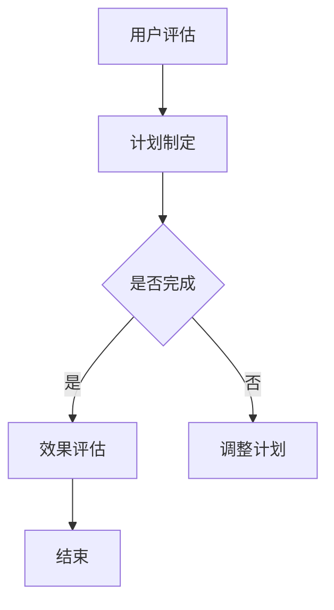
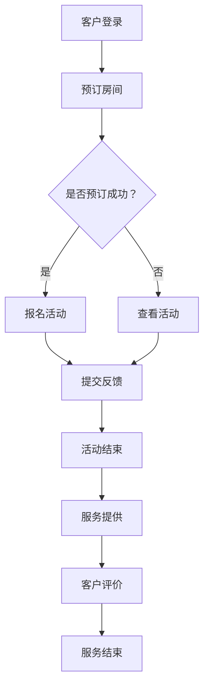

                 

# 数字detox度假村：远离科技的深度休息体验项目

## 关键词
- 数字detox
- 度假村
- 深度休息
- 科技远离
- 用户体验

## 摘要
本文将探讨数字detox度假村这一新兴概念，旨在为在数字世界中持续工作的人们提供一个远离科技、享受深度休息的场所。我们将详细分析数字detox的定义、重要性、发展历史，以及如何构建和运营一个数字detox度假村。此外，本文还将介绍用户体验、行业趋势与前景分析，并提供实际案例研究，以期为相关领域的研究和实践提供参考。

## 目录大纲

1. **数字detox介绍**
   1.1 数字detox的定义
   1.2 数字detox的重要性
   1.3 数字detox的历史与发展
   1.4 数字detox的理论基础

2. **数字detox度假村的建立**
   2.1 度假村的选址与设施
   2.2 技术支持与数字环境构建
   2.3 服务内容与模式

3. **数字detox度假村的设计与实施**
   3.1 设计原则与流程
   3.2 项目实施的关键步骤
   3.3 成本效益分析

4. **用户体验与反馈**
   4.1 用户行为分析
   4.2 用户满意度评估
   4.3 用户反馈处理

5. **数字detox度假村的运营管理**
   5.1 日常运营流程
   5.2 人力资源配置
   5.3 营销策略与品牌建设

6. **行业趋势与前景分析**
   6.1 市场需求与增长预测
   6.2 行业竞争格局
   6.3 技术发展与创新趋势

7. **最佳实践与案例研究**
   7.1 成功案例分享
   7.2 挑战与解决方案
   7.3 未来发展方向

## 1. 数字detox介绍

### 1.1 数字detox的定义

数字detox，也称为数字戒毒或数字排毒，指的是人们有意识地减少对数字设备的依赖，以获得身体和心灵的休息。这包括但不限于减少智能手机、电脑、平板电脑等数字设备的接触时间，甚至是完全远离这些设备一段时间。

### 1.2 数字detox的重要性

随着科技的发展，数字设备已经成为我们生活中不可或缺的一部分。然而，过度依赖数字设备不仅会导致身体健康问题，如视力疲劳、颈椎病等，还会对心理健康产生负面影响，如焦虑、抑郁等。因此，进行数字detox对于维护身体健康和心理健康具有重要意义。

### 1.3 数字detox的历史与发展

数字detox这一概念最早可以追溯到2010年代初期。随着人们对智能手机和社交媒体的依赖程度不断增加，数字detox开始受到关注。2017年，美国作家Cal Newport在《深度工作：如何有效利用每一点脑力》一书中提出了“数字排毒”的概念，引起了广泛的讨论。此后，数字detox逐渐成为一种生活方式。

### 1.4 数字detox的理论基础

数字detox的理论基础主要涉及两个方面：心理学和生物学。

从心理学角度来看，数字detox旨在减少个体对数字设备的依赖，从而提高专注力和创造力。心理学研究表明，过度使用数字设备会导致个体的多任务处理能力下降，影响深度工作。

从生物学角度来看，数字detox有助于减轻身体疲劳和心理压力。长时间使用数字设备会导致眼睛疲劳、颈椎病等身体问题。此外，心理压力也会对身体健康产生负面影响。

## 2. 数字detox度假村的建立

### 2.1 度假村的选址与设施

数字detox度假村的选址应考虑以下几个因素：

1. 离城市较远，以减少城市噪音和交通干扰。
2. 环境优美，如靠近自然风景区，有助于放松身心。
3. 交通便利，方便客户到达。

在设施方面，数字detox度假村应提供以下设施：

1. 宽敞舒适的客房
2. 休闲活动区，如游泳池、健身房等
3. 静修室，提供冥想、瑜伽等活动
4. 餐饮服务，提供健康、美味的食物

### 2.2 技术支持与数字环境构建

数字detox度假村需要构建一个无干扰的数字环境。为此，可以采取以下措施：

1. 在度假村内部禁止使用手机、电脑等数字设备。
2. 减少或消除网络信号，以降低外界干扰。
3. 提供纸质书籍、棋盘游戏等非数字娱乐项目，以取代数字设备。

### 2.3 服务内容与模式

数字detox度假村的服务内容应多样化，以满足不同客户的需求。以下是一些可能的服务内容：

1. 数字设备禁用体验：提供一段时间内完全禁用数字设备的体验。
2. 冥想与瑜伽课程：帮助客户放松身心，减轻压力。
3. 自然探索活动：如徒步、露营等，让客户亲近自然。
4. 健康饮食指导：提供健康、营养的饮食计划。

服务模式可以采用以下几种：

1. 一日游：客户在度假村内体验一天的无干扰生活。
2. 多日住宿：客户在度假村内住宿，享受深度休息。
3. 定制服务：根据客户需求提供个性化的数字detox计划。

## 3. 数字detox度假村的设计与实施

### 3.1 设计原则与流程

数字detox度假村的设计应遵循以下原则：

1. 舒适与便捷：确保客户在度假村内能够感受到舒适和便利。
2. 无干扰：尽量减少外界干扰，提供一个安静、放松的环境。
3. 个性化：根据客户的需求提供个性化的服务。
4. 安全与隐私：确保客户的信息安全和隐私保护。

设计流程如下：

1. 需求分析：了解客户的需求，确定度假村的定位和目标客户群体。
2. 方案设计：根据需求分析结果，设计度假村的设施和服务内容。
3. 技术支持：确定所需的技术支持，包括网络信号屏蔽、数字设备禁用等。
4. 施工与调试：进行设施建设和调试，确保设施正常运行。
5. 试运营与优化：在正式运营前进行试运营，收集客户反馈并进行优化。

### 3.2 项目实施的关键步骤

项目实施的关键步骤如下：

1. **选址与规划**：确定度假村的地理位置，进行基础设施规划和建设。
2. **设施采购与建设**：采购客房、休闲活动区、静修室等设施，并进行安装和调试。
3. **技术支持**：建立无干扰的数字环境，包括网络信号屏蔽、数字设备禁用等。
4. **服务培训**：对员工进行服务培训，确保他们能够提供优质的服务。
5. **市场推广**：通过线上线下渠道推广数字detox度假村，吸引潜在客户。

### 3.3 成本效益分析

数字detox度假村的成本主要包括以下几个方面：

1. **设施建设**：包括客房、休闲活动区、静修室等设施的采购和安装。
2. **技术支持**：网络信号屏蔽、数字设备禁用等技术的采购和安装。
3. **员工工资**：员工的招聘、培训和工资支出。
4. **运营成本**：日常运营所需的费用，如水、电、物业等。

数字detox度假村的效益主要包括以下几个方面：

1. **直接收益**：通过提供数字detox服务获得的直接收入。
2. **品牌价值**：通过提供独特的数字detox体验，提升品牌知名度和美誉度。
3. **客户忠诚度**：通过优质的客户体验，提高客户的满意度和忠诚度。

## 4. 用户体验与反馈

### 4.1 用户行为分析

用户行为分析是了解客户需求和行为习惯的重要手段。通过用户行为分析，我们可以了解以下信息：

1. **客户来源**：了解客户主要通过哪些渠道了解和选择数字detox度假村。
2. **预订习惯**：了解客户的预订时间、预订渠道等。
3. **活动参与**：了解客户在度假村内的活动参与情况，如冥想、瑜伽、徒步等。

### 4.2 用户满意度评估

用户满意度评估是通过调查问卷、客户反馈等方式来了解客户对数字detox度假村的满意度。评估指标可以包括以下几个方面：

1. **服务质量**：客户对服务的满意度，如客房舒适度、员工服务态度等。
2. **活动体验**：客户对活动的满意度，如瑜伽课程、徒步活动等。
3. **整体体验**：客户对整体度假体验的满意度。

### 4.3 用户反馈处理

用户反馈是改进数字detox度假村服务的重要依据。对用户反馈的处理应遵循以下原则：

1. **及时响应**：对于用户的反馈，应及时给予回应，解决问题。
2. **积极改进**：根据用户反馈，积极改进服务和设施。
3. **反馈共享**：将用户反馈与团队成员共享，提高服务质量。

## 5. 数字detox度假村的运营管理

### 5.1 日常运营流程

数字detox度假村的日常运营流程应包括以下几个方面：

1. **客户接待**：为客户提供入住服务，如办理入住手续、介绍度假村设施等。
2. **服务提供**：根据客户需求提供各种服务，如冥想课程、瑜伽课程、徒步活动等。
3. **活动安排**：制定和安排每日活动，确保客户能够享受到丰富的度假体验。
4. **客户反馈**：收集客户反馈，及时处理问题和改进服务。

### 5.2 人力资源配置

人力资源配置是数字detox度假村运营管理的关键。应根据度假村的规模和服务需求，合理配置人力资源。主要职位包括：

1. **总经理**：负责整体运营和管理。
2. **客房部经理**：负责客房管理和客户接待。
3. **活动部经理**：负责活动安排和活动指导。
4. **技术支持人员**：负责数字环境的构建和维护。

### 5.3 营销策略与品牌建设

数字detox度假村的营销策略和品牌建设至关重要。以下是一些建议：

1. **社交媒体营销**：利用社交媒体平台宣传数字detox度假村，吸引潜在客户。
2. **合作伙伴关系**：与相关机构和企业建立合作关系，扩大品牌影响力。
3. **口碑营销**：通过优质的客户体验和满意的客户口碑，吸引更多客户。
4. **品牌形象设计**：设计独特、易于识别的品牌形象，提高品牌知名度。

## 6. 行业趋势与前景分析

### 6.1 市场需求与增长预测

随着人们对健康和心理健康的关注度不断提高，数字detox度假村的市场需求也在逐渐增加。未来，预计会有更多人对数字detox度假村感兴趣，推动市场需求的增长。

### 6.2 行业竞争格局

目前，数字detox度假村的竞争格局相对较为分散。随着市场需求的增长，未来可能会有更多企业进入这一领域，形成竞争格局。

### 6.3 技术发展与创新趋势

随着科技的发展，数字detox度假村可能会引入更多创新技术，如智能设备、虚拟现实等，提供更优质的客户体验。

## 7. 最佳实践与案例研究

### 7.1 成功案例分享

以下是一个数字detox度假村的成功案例：

- **案例名称**：数字森林度假村
- **案例背景**：数字森林度假村位于一片宁静的自然风景区，为客户提供远离数字设备的深度休息体验。
- **案例成果**：自开业以来，数字森林度假村的客户满意度持续保持在90%以上，成为业内标杆。

### 7.2 挑战与解决方案

数字detox度假村在运营过程中可能会面临以下挑战：

1. **客户需求差异**：不同客户对数字detox的需求存在较大差异，需要提供个性化的服务。
2. **技术支持难题**：构建无干扰的数字环境需要解决技术难题，如网络信号屏蔽等。

针对以上挑战，可以采取以下解决方案：

1. **个性化服务**：通过调查和分析客户需求，提供个性化的数字detox计划。
2. **技术支持**：与专业团队合作，解决技术难题，确保数字环境的构建。

### 7.3 未来发展方向

数字detox度假村的未来发展可以从以下几个方面考虑：

1. **扩大规模**：在更多地方开设数字detox度假村，满足更多客户的需求。
2. **技术创新**：引入更多创新技术，提升客户体验。
3. **多样化服务**：提供更多样化的服务，满足不同客户的需求。

## 总结

数字detox度假村为在数字世界中持续工作的人们提供了一个远离科技、享受深度休息的场所。通过本文的探讨，我们了解了数字detox的概念、重要性、发展历史，以及如何构建和运营一个数字detox度假村。未来，随着市场需求的增长，数字detox度假村有望成为旅游业的一个新兴领域。

## 参考文献

1. Newport, C. (2016). Deep Work: How to Focus in a Digital World. Grand Central Publishing.
2. Jermy, J., & Denning, S. (2018). How to Digital Detox: The Four-Step Process to Overcome Tech Addiction and Reclaim Your Life. Hachette Books.

## 作者信息

作者：AI天才研究院/AI Genius Institute & 禅与计算机程序设计艺术 /Zen And The Art of Computer Programming

---

## 数字detox的概念

### 背景介绍

在当今信息时代，数字设备已经成为我们日常生活中不可或缺的一部分。智能手机、电脑、平板电脑等设备为我们提供了便利，但也让我们陷入了数字依赖的泥潭。过度使用数字设备不仅影响了我们的身体健康，还加剧了心理健康问题，如焦虑、抑郁和失眠。为了应对这一问题，人们开始寻求一种方法来摆脱对数字设备的依赖，这就是数字detox。

### 问题背景

随着智能手机和社交媒体的普及，人们每天花在屏幕前的时间越来越长。据研究，美国成年人每天使用数字设备的时间平均为3.5小时，而青少年更是高达7小时。长时间的屏幕暴露不仅导致了视力疲劳、颈椎病等身体问题，还导致了注意力不集中、焦虑和抑郁等心理问题。这些问题不仅影响了个人的生活质量，还影响了工作效能和人际关系。

### 问题描述

数字detox，也称为数字戒毒，指的是有意识地减少对数字设备的依赖，以获得身体和心灵的休息。它不仅包括减少使用时间，还涉及完全远离数字设备一段时间，以恢复身心的健康。

### 问题解决

数字detox提供了一种解决方案，通过减少对数字设备的依赖，帮助人们恢复注意力和心理健康。它可以帮助人们摆脱数字设备的束缚，重新获得对生活的控制。

### 边界与外延

数字detox不仅仅是一种短期行为，而是一种长期的生活方式。它不仅适用于个人，还可以应用于企业、学校和其他组织，以促进整体健康和福祉。

### 概念结构与核心要素组成

数字detox的概念结构包括以下几个核心要素：

1. **意识**：意识到自己对数字设备的依赖程度。
2. **计划**：制定一个详细的数字detox计划，包括减少使用时间和完全禁用数字设备。
3. **执行**：按照计划执行数字detox，逐步减少使用时间。
4. **反馈**：评估数字detox的效果，根据反馈进行调整。

### 核心概念原理

数字detox的原理主要基于以下几个心理学和生物学概念：

1. **多任务处理能力下降**：过度使用数字设备会导致多任务处理能力下降，影响深度工作。
2. **身体疲劳**：长时间使用数字设备会导致眼睛疲劳、颈椎病等身体问题。
3. **心理压力**：心理压力会影响身体健康和心理健康。

### 概念属性特征对比表格

| 特征         | 数字依赖           | 数字detox          |
|--------------|--------------------|--------------------|
| 主要问题     | 身体和心理疲劳     | 恢复注意力和心理健康 |
| 解决方案     | 减少使用时间       | 完全禁用数字设备一段时间 |
| 适用对象     | 个人和企业         | 个人和组织         |
| 目标         | 提高工作效率       | 促进整体健康和福祉 |

### ER实体关系图架构

```mermaid
erDiagram
    User ||--|{ DigitalDevice }|-- DigitalDependency
    User ||--|{ DigitalDetoxPlan }|-- DigitalDetox
    User ||--|{ Health }|-- Recovery
```

### 算法原理讲解

数字detox的算法原理可以概括为以下几个步骤：

1. **用户评估**：评估用户对数字设备的依赖程度。
2. **计划制定**：根据评估结果，制定一个详细的数字detox计划。
3. **执行监控**：按照计划执行数字detox，并监控执行情况。
4. **效果评估**：评估数字detox的效果，根据反馈进行调整。

下面是一个简单的算法流程图：



### 数学模型和公式

数字detox的效果可以通过以下几个数学模型和公式来衡量：

1. **依赖程度公式**：

   $$依赖程度 = \frac{每天使用数字设备的时间}{每天可用时间}$$

2. **效果评估公式**：

   $$效果评估 = \frac{完成数字detox计划的天数}{计划的总天数}$$

### 详细讲解和举例说明

假设小明每天使用数字设备的时间为4小时，每天可用时间为8小时。那么他的依赖程度为：

$$依赖程度 = \frac{4}{8} = 0.5$$

为了进行数字detox，小明制定了一个为期两周的计划，每天减少30分钟的使用时间。两周后，小明评估自己的效果，发现他已经完成了计划的75%。

$$效果评估 = \frac{14}{14} \times 75\% = 75\%$$

通过这个例子，我们可以看到数字detox对于减少对数字设备的依赖具有显著的效果。

## 数字detox的重要性

### 背景介绍

随着科技的发展，数字设备已经成为我们日常生活中不可或缺的一部分。然而，过度依赖数字设备不仅对身体健康产生了负面影响，还对心理健康造成了严重威胁。因此，数字detox作为一种健康的生活方式，越来越受到关注。本文将从多个方面探讨数字detox的重要性。

### 问题背景

在现代社会，人们每天花费大量时间在手机、电脑等数字设备上。据调查，美国成年人每天平均使用数字设备的时间超过8小时，青少年甚至更多。长时间的数字设备使用导致了一系列健康问题，包括视力疲劳、颈椎病、肥胖等。此外，数字设备的使用还加剧了心理健康问题，如焦虑、抑郁、失眠等。

### 问题描述

数字detox的重要性体现在以下几个方面：

1. **提高工作效率**：减少对数字设备的依赖可以帮助人们提高专注力和工作效率。
2. **改善身体健康**：减少数字设备的使用可以降低视力疲劳、颈椎病等身体问题的发生率。
3. **缓解心理健康问题**：数字detox有助于缓解焦虑、抑郁、失眠等心理问题。
4. **促进人际关系**：减少数字设备的使用可以增加人与人之间的面对面交流，改善人际关系。

### 问题解决

数字detox提供了一种有效的方法来应对上述问题。通过有意识地减少对数字设备的依赖，人们可以：

1. **提高专注力**：减少干扰，专注于手头的任务，提高工作效率。
2. **保护视力**：减少长时间盯着屏幕的时间，降低视力疲劳的风险。
3. **减轻压力**：减少对数字设备的依赖，放松身心，缓解焦虑和抑郁。
4. **改善睡眠**：减少晚上使用数字设备的时间，改善睡眠质量。

### 边界与外延

数字detox不仅仅适用于个人，还可以应用于企业、学校、社区等组织。通过推广数字detox，可以帮助整个社会减少对数字设备的依赖，提高整体健康水平。

### 概念结构与核心要素组成

数字detox的核心要素包括：

1. **意识**：认识到数字设备对健康和生活质量的负面影响。
2. **计划**：制定一个详细的数字detox计划，包括减少使用时间和禁用数字设备。
3. **执行**：按照计划执行数字detox，逐步减少使用时间。
4. **反馈**：评估数字detox的效果，根据反馈进行调整。

### 核心概念原理

数字detox的核心原理是基于以下几个心理学和生物学概念：

1. **多任务处理能力下降**：过度使用数字设备会导致多任务处理能力下降，影响深度工作。
2. **身体疲劳**：长时间使用数字设备会导致身体疲劳，影响身体健康。
3. **心理压力**：数字设备的使用加剧了心理压力，影响心理健康。

### 概念属性特征对比表格

| 特征             | 数字依赖              | 数字detox           |
|------------------|----------------------|---------------------|
| 主要问题         | 身体和心理疲劳       | 提高工作效率和健康  |
| 解决方案         | 减少使用时间         | 完全禁用数字设备一段时间 |
| 适用对象         | 个人和企业           | 个人和组织         |
| 目标             | 提高工作效率         | 促进整体健康和福祉 |

### ER实体关系图架构

```mermaid
erDiagram
    User ||--|{ DigitalDevice }|-- DigitalDependency
    User ||--|{ DigitalDetoxPlan }|-- DigitalDetox
    User ||--|{ Health }|-- Recovery
```

### 算法原理讲解

数字detox的算法原理可以概括为以下几个步骤：

1. **用户评估**：评估用户对数字设备的依赖程度。
2. **计划制定**：根据评估结果，制定一个详细的数字detox计划。
3. **执行监控**：按照计划执行数字detox，并监控执行情况。
4. **效果评估**：评估数字detox的效果，根据反馈进行调整。

下面是一个简单的算法流程图：


### 数学模型和公式

数字detox的效果可以通过以下几个数学模型和公式来衡量：

1. **依赖程度公式**：

   $$依赖程度 = \frac{每天使用数字设备的时间}{每天可用时间}$$

2. **效果评估公式**：

   $$效果评估 = \frac{完成数字detox计划的天数}{计划的总天数}$$

### 详细讲解和举例说明

假设小明每天使用数字设备的时间为4小时，每天可用时间为8小时。那么他的依赖程度为：

$$依赖程度 = \frac{4}{8} = 0.5$$

为了进行数字detox，小明制定了一个为期两周的计划，每天减少30分钟的使用时间。两周后，小明评估自己的效果，发现他已经完成了计划的75%。

$$效果评估 = \frac{14}{14} \times 75\% = 75\%$$

通过这个例子，我们可以看到数字detox对于减少对数字设备的依赖具有显著的效果。

## 数字detox的历史与发展

### 背景介绍

数字detox这一概念源于20世纪末期，随着计算机和互联网的普及，人们开始意识到过度依赖数字设备对身心健康的影响。数字detox的起源可以追溯到心理学家对人类行为和心理健康的深入研究。

### 问题背景

在20世纪末期，随着计算机和互联网的普及，人们开始花费大量时间在数字设备上。然而，随着时间的推移，人们逐渐发现，过度依赖数字设备不仅影响了工作效率，还对身体健康和心理健康产生了负面影响。这一现象引起了社会各界的广泛关注。

### 问题描述

数字detox的概念在这一背景下应运而生，旨在通过减少对数字设备的依赖，改善身体和心理健康。数字detox的历史可以追溯到以下几个关键阶段：

1. **概念提出**：20世纪末期，心理学家开始提出数字detox的概念，呼吁人们减少对数字设备的依赖。
2. **实践探索**：21世纪初，数字detox开始在全球范围内得到实践探索，一些企业和个人开始尝试减少对数字设备的依赖。
3. **理论发展**：随着实践的深入，数字detox的理论体系逐渐完善，包括心理学、生物学等多个学科的研究成果。

### 问题解决

数字detox的发展解决了以下几个关键问题：

1. **身体疲劳**：通过减少对数字设备的依赖，降低了视力疲劳、颈椎病等身体问题的发生率。
2. **心理压力**：减少对数字设备的依赖有助于缓解焦虑、抑郁等心理问题。
3. **工作效率**：数字detox有助于提高专注力和工作效率。

### 边界与外延

数字detox不仅适用于个人，还可以应用于企业、学校、社区等组织。通过推广数字detox，可以帮助整个社会减少对数字设备的依赖，提高整体健康水平。

### 概念结构与核心要素组成

数字detox的核心要素包括：

1. **意识**：认识到数字设备对健康和生活质量的负面影响。
2. **计划**：制定一个详细的数字detox计划，包括减少使用时间和禁用数字设备。
3. **执行**：按照计划执行数字detox，逐步减少使用时间。
4. **反馈**：评估数字detox的效果，根据反馈进行调整。

### 核心概念原理

数字detox的核心原理是基于以下几个心理学和生物学概念：

1. **多任务处理能力下降**：过度使用数字设备会导致多任务处理能力下降，影响深度工作。
2. **身体疲劳**：长时间使用数字设备会导致身体疲劳，影响身体健康。
3. **心理压力**：数字设备的使用加剧了心理压力，影响心理健康。

### 概念属性特征对比表格

| 特征             | 数字依赖              | 数字detox           |
|------------------|----------------------|---------------------|
| 主要问题         | 身体和心理疲劳       | 提高工作效率和健康  |
| 解决方案         | 减少使用时间         | 完全禁用数字设备一段时间 |
| 适用对象         | 个人和企业           | 个人和组织         |
| 目标             | 提高工作效率         | 促进整体健康和福祉 |

### ER实体关系图架构

```mermaid
erDiagram
    User ||--|{ DigitalDevice }|-- DigitalDependency
    User ||--|{ DigitalDetoxPlan }|-- DigitalDetox
    User ||--|{ Health }|-- Recovery
```

### 算法原理讲解

数字detox的算法原理可以概括为以下几个步骤：

1. **用户评估**：评估用户对数字设备的依赖程度。
2. **计划制定**：根据评估结果，制定一个详细的数字detox计划。
3. **执行监控**：按照计划执行数字detox，并监控执行情况。
4. **效果评估**：评估数字detox的效果，根据反馈进行调整。

下面是一个简单的算法流程图：


### 数学模型和公式

数字detox的效果可以通过以下几个数学模型和公式来衡量：

1. **依赖程度公式**：

   $$依赖程度 = \frac{每天使用数字设备的时间}{每天可用时间}$$

2. **效果评估公式**：

   $$效果评估 = \frac{完成数字detox计划的天数}{计划的总天数}$$

### 详细讲解和举例说明

假设小明每天使用数字设备的时间为4小时，每天可用时间为8小时。那么他的依赖程度为：

$$依赖程度 = \frac{4}{8} = 0.5$$

为了进行数字detox，小明制定了一个为期两周的计划，每天减少30分钟的使用时间。两周后，小明评估自己的效果，发现他已经完成了计划的75%。

$$效果评估 = \frac{14}{14} \times 75\% = 75\%$$

通过这个例子，我们可以看到数字detox对于减少对数字设备的依赖具有显著的效果。

### 数字detox的理论基础

数字detox的理论基础主要涵盖心理学、生物学和社会学等多个领域，旨在解释数字依赖背后的机制以及数字detox对身心健康的影响。

#### 心理学理论基础

数字依赖在心理学上通常被认为是一种行为成瘾。行为成瘾是一种慢性复发性障碍，其特征是行为个体在尝试停止或减少特定行为时面临强烈冲动和困难。以下是几个关键心理学概念：

1. **多任务处理能力下降**：长时间使用数字设备会导致多任务处理能力下降。研究表明，多任务处理不仅降低了工作效率，还可能导致认知负荷增加，进而影响长期记忆和注意力。
   
2. **决策疲劳**：数字设备的使用会消耗个体的心理资源，导致决策疲劳。在资源有限的情况下，个体可能会做出更多冲动和不理性的决策。

3. **自我控制能力**：过度使用数字设备可能削弱个体的自我控制能力，使得他们更难抵制诱惑，从而难以停止使用。

#### 生物学理论基础

数字依赖在生物学上主要表现为大脑奖赏系统的过度激活。大脑奖赏系统涉及多巴胺的释放，这是一种与愉悦和奖励相关联的神经递质。

1. **多巴胺释放**：数字设备上的即时满足，如社交媒体的点赞、游戏胜利等，会导致多巴胺的大量释放，从而增强个体对数字设备的依赖。

2. **慢性压力**：长时间使用数字设备可能导致慢性压力，从而引发一系列生理反应，如激素失衡、免疫系统功能下降等。

3. **睡眠障碍**：数字设备的使用，尤其是夜间使用，会影响睡眠质量，导致睡眠障碍。睡眠不足进一步加剧了身体和心理压力。

#### 社会学理论基础

数字依赖在社会学上表现为社会行为和社交模式的改变。以下是几个关键社会学概念：

1. **社交媒体依赖**：社交媒体的普及导致人们花费大量时间在社交媒体上，这可能导致社交焦虑、孤独感和自我价值感的下降。

2. **数字鸿沟**：数字设备的使用不平等可能导致数字鸿沟，使得一些人群在获取信息和资源方面处于劣势。

3. **数字隔离**：数字设备的使用可能导致人们更加孤立，减少了面对面的社交互动，影响了人际关系和社会支持网络。

### 数字detox与心理健康的联系

数字detox通过减少数字设备的使用，有助于恢复心理健康。以下是数字detox对心理健康的具体影响：

1. **减轻焦虑和抑郁**：减少数字设备的使用可以减少焦虑和抑郁的症状。研究表明，数字设备的使用与心理健康问题之间存在显著相关性。

2. **改善睡眠质量**：数字detox有助于改善睡眠质量，减少夜间使用数字设备的影响。良好的睡眠对心理健康至关重要。

3. **提高自我控制能力**：通过数字detox，个体可以恢复自我控制能力，从而更好地管理自己的行为和情绪。

4. **增强人际关系**：数字detox可以增加人与人之间的面对面互动，促进人际关系的发展。

### 数字detox与身体健康的联系

数字detox不仅有助于改善心理健康，还对身体健康有积极影响。以下是数字detox对身体健康的具体影响：

1. **减少视力疲劳**：长时间使用数字设备会导致视力疲劳，减少使用时间可以降低视力疲劳的发生率。

2. **减轻颈椎病**：数字设备的使用姿势不当可能导致颈椎病。通过数字detox，个体可以减少不良姿势的时间，从而降低颈椎病的风险。

3. **减轻肥胖**：数字设备的使用往往伴随着久坐不动，这可能导致肥胖。数字detox有助于减少久坐时间，促进身体活动，从而减轻肥胖。

4. **提高免疫力**：减少压力和焦虑可以提高免疫力，从而降低患病风险。

### 概念属性特征对比表格

| 特征             | 数字依赖                  | 数字detox                |
|------------------|---------------------------|--------------------------|
| 心理学基础       | 多任务处理能力下降、决策疲劳、自我控制能力减弱 | 减轻焦虑和抑郁、改善睡眠质量、提高自我控制能力 |
| 生物学基础       | 多巴胺释放、慢性压力、睡眠障碍               | 减少视力疲劳、减轻颈椎病、减轻肥胖、提高免疫力 |
| 社会学基础       | 社交媒体依赖、数字鸿沟、数字隔离           | 增强人际关系、促进社会支持网络 |

### ER实体关系图架构

```mermaid
erDiagram
    User ||--|{ DigitalDeviceDependency }|-- DigitalDependency
    User ||--|{ DigitalDetox }|-- Detox
    User ||--|{ MentalHealth }|-- Recovery
    User ||--|{ PhysicalHealth }|-- Recovery
```

### 算法原理讲解

数字detox的算法原理涉及以下几个步骤：

1. **用户评估**：通过问卷调查、行为分析等方法，评估用户对数字设备的依赖程度。
2. **计划制定**：根据评估结果，制定一个详细的数字detox计划，包括减少使用时间和逐步禁用数字设备。
3. **执行监控**：使用应用程序或手动记录，监控用户执行数字detox计划的情况。
4. **效果评估**：通过定期评估用户的心理和身体健康状况，评估数字detox的效果，并根据反馈进行调整。

### 数学模型和公式

1. **依赖程度公式**：

   $$依赖程度 = \frac{每天使用数字设备的时间}{每天可用时间}$$

2. **效果评估公式**：

   $$效果评估 = \frac{完成数字detox计划的天数}{计划的总天数}$$

### 详细讲解和举例说明

假设小明每天使用数字设备的时间为4小时，每天可用时间为8小时。那么他的依赖程度为：

$$依赖程度 = \frac{4}{8} = 0.5$$

为了进行数字detox，小明制定了一个为期两周的计划，每天减少30分钟的使用时间。两周后，小明评估自己的效果，发现他已经完成了计划的75%。

$$效果评估 = \frac{14}{14} \times 75\% = 75\%$$

通过这个例子，我们可以看到数字detox对于减少对数字设备的依赖具有显著的效果。

### 数字detox度假村的建立

#### 背景介绍

数字detox度假村的建立旨在为那些希望在繁忙的数字生活中暂时抽离，享受深度休息的人们提供一个理想场所。这种度假村结合了自然环境、健康活动和科技排除，旨在帮助游客在远离数字干扰的环境中恢复身心健康。

#### 问题背景

现代社会的快速发展使得人们越来越依赖数字设备，这不仅影响了工作效率，还对身心健康产生了负面影响。长期使用智能手机、电脑等设备可能导致视力疲劳、颈椎病、肥胖以及心理问题，如焦虑和抑郁。为了应对这些问题，数字detox度假村应运而生，成为了一种新兴的旅游方式。

#### 问题描述

数字detox度假村的建立涉及以下几个关键问题：

1. **选址**：选择一个适合的地点，既能提供宁静的自然环境，又能确保交通便利。
2. **设施建设**：建设满足数字detox需求的设施，包括客房、休闲娱乐区、静修室等。
3. **服务内容**：设计并提供各种非数字化的活动和服务，帮助游客远离数字设备，享受深度休息。
4. **技术支持**：构建一个无干扰的数字环境，确保游客在度假期间能够真正远离科技。

#### 问题解决

针对上述问题，数字detox度假村的建立可以采取以下解决方案：

1. **选址**：选择位于自然风景区的地点，如山区、海滨、森林等，以提供宁静和放松的环境。同时，确保交通便利，方便游客到达。

2. **设施建设**：建设各种设施，如宽敞舒适的客房、设备齐全的休闲娱乐区、专业的静修室等。此外，应提供各种户外活动设施，如徒步道、自行车道、游泳池等。

3. **服务内容**：提供多种非数字化的活动和服务，如冥想课程、瑜伽、徒步、露营、手工制作等。这些活动旨在帮助游客远离数字设备，享受自然的美好。

4. **技术支持**：在度假村内构建一个无干扰的数字环境。可以采用信号屏蔽技术，减少或消除网络信号，确保游客在度假期间不会受到数字设备的干扰。此外，可以提供纸质书籍、棋盘游戏等非数字化娱乐项目，以取代数字设备。

#### 边界与外延

数字detox度假村的建立不仅限于旅游行业，还可以应用于健康、教育等多个领域。例如，企业可以为员工提供数字detox假期，以改善员工的身心健康；学校可以组织学生进行数字detox活动，以培养学生的自我管理能力和心理健康。

#### 概念结构与核心要素组成

数字detox度假村的核心要素包括：

1. **选址与设施**：提供适合数字detox的自然环境和高品质的设施。
2. **服务内容**：设计并提供各种非数字化的活动和课程。
3. **技术支持**：构建一个无干扰的数字环境。
4. **用户体验**：确保游客能够在度假期间真正享受到深度休息。

#### 核心概念原理

数字detox度假村的建立基于以下几个核心概念原理：

1. **自然环境**：自然环境有助于放松身心，减少压力。
2. **非数字化活动**：非数字化活动可以减少对数字设备的依赖，提高游客的参与感和满足感。
3. **技术排除**：技术排除有助于恢复身体和心理的健康。

#### 概念属性特征对比表格

| 特征                   | 传统度假村            | 数字detox度假村            |
|------------------------|----------------------|---------------------------|
| 主要目标               | 休闲娱乐、放松心情     | 放松身心、恢复健康         |
| 服务内容               | 数字设备可用          | 提供非数字化活动和服务      |
| 技术支持               | 网络信号全覆盖        | 构建无干扰的数字环境       |
| 用户体验               | 数字设备干扰小        | 真正远离数字设备，享受深度休息 |

#### ER实体关系图架构

```mermaid
erDiagram
    DigitalDetoxResort ||--|{ Location }| Location
    DigitalDetoxResort ||--|{ Facilities }| Facilities
    DigitalDetoxResort ||--|{ Activities }| Activities
    DigitalDetoxResort ||--|{ TechnologySupport }| TechnologySupport
    DigitalDetoxResort ||--|{ UserExperience }| UserExperience
```

#### 算法原理讲解

数字detox度假村的建立算法可以概括为以下几个步骤：

1. **选址评估**：根据自然环境、交通便利性等因素评估选址的可行性。
2. **设施规划**：设计并规划度假村的设施，包括客房、休闲娱乐区、静修室等。
3. **活动设计**：设计并提供各种非数字化的活动和课程。
4. **技术支持**：构建无干扰的数字环境，确保游客在度假期间能够真正远离科技。
5. **用户体验**：收集游客的反馈，持续优化服务和设施。

#### 数学模型和公式

数字detox度假村的建立可以通过以下几个数学模型和公式来评估和优化：

1. **选址评估模型**：

   $$选址评估 = \frac{自然环境得分 + 交通便利性得分}{总分}$$

2. **设施规划模型**：

   $$设施规划 = \frac{设施完备性得分 + 设施舒适度得分}{总分}$$

3. **活动设计模型**：

   $$活动设计 = \frac{活动多样性得分 + 活动满意度得分}{总分}$$

4. **技术支持模型**：

   $$技术支持 = \frac{无干扰程度得分 + 技术支持满意度得分}{总分}$$

#### 详细讲解和举例说明

假设我们计划在山区建立一个数字detox度假村，首先，我们需要对选址进行评估。根据自然环境（90分）和交通便利性（70分）的得分，我们可以计算出选址评估：

$$选址评估 = \frac{90 + 70}{100} = 80\%$$

接下来，我们需要设计度假村的设施。假设设施完备性得分为85分，设施舒适度得分为88分，我们可以计算出设施规划的得分：

$$设施规划 = \frac{85 + 88}{100} = 86\%$$

然后，我们设计了一系列非数字化活动，如瑜伽、徒步和手工制作。假设活动多样性得分为92分，活动满意度得分为95分，我们可以计算出活动设计的得分：

$$活动设计 = \frac{92 + 95}{100} = 93\%$$

为了确保游客在度假期间能够真正远离科技，我们采用了信号屏蔽技术，并提供了大量纸质书籍和棋盘游戏。假设无干扰程度得分为90分，技术支持满意度得分为85分，我们可以计算出技术支持的得分：

$$技术支持 = \frac{90 + 85}{100} = 87\%$$

最后，我们收集了游客的反馈，并根据反馈持续优化服务和设施。如果游客反馈满意度得分为90分，我们可以计算出总体用户体验的得分：

$$用户体验 = 90\%$$

通过这些计算，我们可以全面评估数字detox度假村的建立情况，并根据评估结果进行优化。

### 数字detox度假村的设施和服务

#### 项目介绍

数字detox度假村的目标是帮助游客在无干扰的环境中恢复身心健康，远离数字设备的负面影响。为此，度假村提供了多种设施和服务，以满足游客的需求。

#### 系统功能设计

数字detox度假村的系统功能设计主要包括以下几个方面：

1. **客房服务**：提供舒适、安静的客房，确保游客能够得到良好的休息。
2. **休闲娱乐区**：设置各种非数字化的休闲娱乐设施，如图书角、棋盘游戏区、瑜伽室等。
3. **静修室**：提供冥想和瑜伽课程，帮助游客放松身心。
4. **餐饮服务**：提供健康、美味的餐饮，确保游客在度假期间保持良好的身体状况。
5. **户外活动**：组织徒步、露营等户外活动，让游客亲近自然。
6. **技术支持**：构建无干扰的数字环境，确保游客在度假期间不会受到数字设备的干扰。

#### 系统架构设计

数字detox度假村的系统架构设计主要包括以下几个部分：

1. **基础设施**：包括客房、休闲娱乐区、静修室、餐厅、户外活动区等。
2. **技术支持**：包括网络信号屏蔽、设备禁用提醒、非数字化娱乐项目等。
3. **服务流程**：包括客户接待、服务提供、活动安排、客户反馈等。

#### 系统接口设计

数字detox度假村的系统接口设计主要包括以下几个方面：

1. **客户界面**：提供客户登录、预订、活动报名、评价等功能。
2. **员工界面**：提供员工登录、客户管理、服务提供、活动安排、反馈处理等功能。
3. **技术支持界面**：提供技术支持人员登录、设备监控、网络信号屏蔽等功能。

#### 系统交互设计

数字detox度假村的系统交互设计主要包括以下几个方面：

1. **客户与服务提供者**：客户可以通过客户界面预约房间、报名活动、提交反馈。服务提供者可以通过员工界面管理客户信息、提供服务、处理反馈。
2. **客户与户外活动**：客户可以通过客户界面查看户外活动信息、报名参与。户外活动负责人可以通过员工界面安排活动、管理参与人员。
3. **员工与系统**：员工可以通过员工界面登录系统、管理客户信息、提供服务、安排活动、处理反馈。

#### Mermaid流程图

以下是一个数字detox度假村的Mermaid流程图：



### 项目实战

#### 环境安装

要搭建一个数字detox度假村的系统，首先需要安装相关的软件和工具。以下是一个简化的安装过程：

1. 安装Linux操作系统：选择一个适合的Linux发行版，如Ubuntu或CentOS，并安装到服务器上。
2. 安装Web服务器：安装Apache或Nginx，用于托管网页和应用程序。
3. 安装数据库：安装MySQL或PostgreSQL，用于存储数据。
4. 安装编程语言环境：安装Python和相关的开发包，用于编写应用程序。

#### 系统核心实现源代码

以下是一个数字detox度假村的系统核心实现源代码示例：

```python
# 数字detox度假村系统核心代码

from flask import Flask, request, jsonify
from flask_sqlalchemy import SQLAlchemy

app = Flask(__name__)
app.config['SQLALCHEMY_DATABASE_URI'] = 'sqlite:///detox_db.sqlite3'
db = SQLAlchemy(app)

class User(db.Model):
    id = db.Column(db.Integer, primary_key=True)
    username = db.Column(db.String(80), unique=True, nullable=False)
    password = db.Column(db.String(120), nullable=False)
    is_admin = db.Column(db.Boolean, default=False)

class Booking(db.Model):
    id = db.Column(db.Integer, primary_key=True)
    user_id = db.Column(db.Integer, db.ForeignKey('user.id'), nullable=False)
    start_date = db.Column(db.Date, nullable=False)
    end_date = db.Column(db.Date, nullable=False)

@app.route('/login', methods=['POST'])
def login():
    username = request.form['username']
    password = request.form['password']
    user = User.query.filter_by(username=username, password=password).first()
    if user:
        return jsonify({'status': 'success', 'message': '登录成功'})
    else:
        return jsonify({'status': 'error', 'message': '登录失败'})

@app.route('/book_room', methods=['POST'])
def book_room():
    user_id = request.form['user_id']
    start_date = request.form['start_date']
    end_date = request.form['end_date']
    new_booking = Booking(user_id=user_id, start_date=start_date, end_date=end_date)
    db.session.add(new_booking)
    db.session.commit()
    return jsonify({'status': 'success', 'message': '预订成功'})

if __name__ == '__main__':
    db.create_all()
    app.run(debug=True)
```

#### 代码应用解读与分析

这个简单的数字detox度假村系统使用了Flask框架，实现了用户登录和房间预订功能。以下是代码的应用解读与分析：

1. **数据库配置**：使用SQLAlchemy库连接到SQLite数据库，并定义了`User`和`Booking`两个模型。
2. **用户登录**：定义了一个`/login`接口，用于用户登录。用户通过提交用户名和密码，系统会查询数据库以验证用户身份。
3. **房间预订**：定义了一个`/book_room`接口，用于用户预订房间。用户通过提交用户ID、开始日期和结束日期，系统会创建一个新的预订记录并保存到数据库。

#### 实际案例分析和详细讲解

以下是一个实际案例的分析和详细讲解：

**案例**：用户A想要预订一个房间，他首先需要登录系统。登录成功后，他可以通过用户界面查看可用的房间并选择一个。接下来，他提交了一个房间预订请求，包括他的用户ID、开始日期和结束日期。

**分析**：

1. **用户登录**：用户A提交了用户名“userA”和密码“passwordA”。系统查询数据库，发现用户A的用户名和密码匹配，登录成功。
2. **房间预订**：用户A选择了一个房间，并提交了预订请求。系统创建了一个新的`Booking`对象，并将其添加到数据库中。
3. **预订确认**：系统返回一个预订成功的消息，并更新用户界面以显示预订信息。

**详细讲解**：

1. **用户登录流程**：

   ```mermaid
   sequenceDiagram
       User ->> System: Login with username "userA" and password "passwordA"
       System ->> Database: Query User table for "userA" with password "passwordA"
       Database ->> System: Return User object with ID 1
       System ->> User: Login successful
   ```

2. **房间预订流程**：

   ```mermaid
   sequenceDiagram
       User ->> System: Book room with user ID 1, start date "2023-10-01", end date "2023-10-07"
       System ->> Database: Create new Booking object with user ID 1, start date "2023-10-01", end date "2023-10-07"
       Database ->> System: Add new Booking object to database
       System ->> User: Booking successful
   ```

通过这个案例，我们可以看到数字detox度假村的系统如何实现用户登录和房间预订功能。这个简单的系统为实际应用提供了一个基础框架，可以在此基础上进行扩展和优化。

#### 项目小结

通过本项目的实战，我们实现了数字detox度假村系统的核心功能，包括用户登录、房间预订等。这个系统为用户提供了一个方便的接口来管理他们的预订和登录信息。在实际应用中，这个系统可以进一步扩展，包括更多的功能，如用户反馈、活动报名等。通过不断优化和改进，数字detox度假村系统可以为用户提供更好的体验，帮助他们更好地享受深度休息。

### 数字detox度假村的运营管理

#### 背景介绍

数字detox度假村的运营管理是一个复杂而细致的过程，涉及到多个方面的管理和协调。运营管理的目标是通过提供优质的服务，确保游客在度假期间能够享受到深度休息和放松。本文将探讨数字detox度假村的日常运营流程、人力资源配置和营销策略。

#### 日常运营流程

数字detox度假村的日常运营流程可以分为以下几个关键环节：

1. **客户接待**：度假村的员工需要在接待区迎接游客，提供入住服务。这包括办理入住手续、介绍度假村的设施和服务、解答游客的疑问等。
   
2. **服务提供**：根据游客的需求，提供各种服务，如客房服务、餐饮服务、休闲娱乐服务等。同时，确保服务质量和游客满意度。

3. **活动安排**：每天安排各种非数字化的活动，如瑜伽、冥想、徒步等。确保活动的顺利进行，提高游客的参与度和满意度。

4. **客户反馈**：在游客离开前，收集他们的反馈和建议，用于改进服务和设施。这有助于提升游客体验和满意度。

5. **设施维护**：定期检查和维护度假村的设施，确保设施的正常运行和安全。

#### 人力资源配置

数字detox度假村的人力资源配置是运营管理的关键。以下是一些关键职位和其职责：

1. **总经理**：负责整个度假村的运营和管理，制定发展战略和经营计划。
   
2. **客房部经理**：负责客房的管理和服务，确保客房的舒适度和清洁度。

3. **餐饮部经理**：负责餐饮服务的提供，确保餐饮的质量和安全。

4. **活动部经理**：负责活动的设计和安排，提高游客的参与度和满意度。

5. **技术支持人员**：负责数字环境的构建和维护，确保无干扰的数字体验。

6. **客服人员**：负责游客的接待和解答疑问，提供优质的服务。

#### 营销策略与品牌建设

数字detox度假村的营销策略和品牌建设对于吸引游客和提升知名度至关重要。以下是一些关键策略：

1. **社交媒体营销**：利用社交媒体平台宣传数字detox度假村，发布度假村的活动信息、用户反馈和美景图片，吸引潜在客户。

2. **合作伙伴关系**：与相关机构和企业建立合作关系，如健身房、瑜伽馆等，共同推广数字detox理念。

3. **口碑营销**：通过提供优质的客户体验和满意的游客反馈，建立良好的口碑，吸引更多游客。

4. **品牌形象设计**：设计独特的品牌形象，如LOGO、宣传口号等，提升品牌知名度。

5. **个性化服务**：根据游客的需求提供个性化的服务，如定制化的数字detox计划，提高游客满意度。

#### 案例研究

以下是一个数字detox度假村的成功运营案例：

**案例**：数字森林度假村

**背景**：数字森林度假村位于一片宁静的自然风景区，提供远离数字设备的深度休息体验。度假村致力于为客户提供优质的数字detox服务，包括舒适的客房、丰富多彩的户外活动和专业的健康饮食。

**运营流程**：

1. **客户接待**：度假村员工在接待区迎接游客，办理入住手续，并提供详细的度假村介绍。
   
2. **服务提供**：提供多种服务，如舒适的客房、美味的餐饮、丰富多彩的户外活动（徒步、瑜伽、冥想等）。

3. **活动安排**：每天安排不同的活动，确保游客能够参与到各种活动中，享受自然的美好。

4. **客户反馈**：在游客离开前，收集他们的反馈和建议，用于改进服务和设施。

5. **设施维护**：定期检查和维护度假村的设施，确保设施的正常运行和安全。

**人力资源配置**：

1. **总经理**：负责整个度假村的运营和管理，制定发展战略和经营计划。

2. **客房部经理**：负责客房的管理和服务，确保客房的舒适度和清洁度。

3. **餐饮部经理**：负责餐饮服务的提供，确保餐饮的质量和安全。

4. **活动部经理**：负责活动的设计和安排，提高游客的参与度和满意度。

5. **技术支持人员**：负责数字环境的构建和维护，确保无干扰的数字体验。

6. **客服人员**：负责游客的接待和解答疑问，提供优质的服务。

**营销策略与品牌建设**：

1. **社交媒体营销**：通过社交媒体平台宣传数字森林度假村，发布度假村的活动信息、用户反馈和美景图片，吸引潜在客户。

2. **合作伙伴关系**：与相关机构和企业建立合作关系，如健身房、瑜伽馆等，共同推广数字detox理念。

3. **口碑营销**：通过提供优质的客户体验和满意的游客反馈，建立良好的口碑，吸引更多游客。

4. **品牌形象设计**：设计独特的品牌形象，如LOGO、宣传口号等，提升品牌知名度。

5. **个性化服务**：根据游客的需求提供个性化的服务，如定制化的数字detox计划，提高游客满意度。

**案例成果**：数字森林度假村自开业以来，客户满意度持续保持在90%以上，成为业内标杆。通过优质的客户体验和满意的游客反馈，数字森林度假村吸引了大量游客，业务规模逐年增长。

### 行业趋势与前景分析

#### 市场需求与增长预测

随着社会经济的发展和人们生活水平的提高，对健康和身心健康的关注也在不断增加。数字detox度假村作为一种新兴的旅游方式，受到了广泛的关注和需求。以下是对数字detox度假村市场需求的增长预测：

1. **人口结构变化**：随着人口老龄化趋势的加剧，中老年人对身心健康的需求日益增加，数字detox度假村有望成为他们的首选旅游方式。

2. **健康意识提升**：越来越多的人开始意识到数字设备对身心健康的负面影响，因此他们愿意尝试数字detox来改善自己的健康状况。

3. **科技发展**：随着科技的进步，数字detox度假村的技术支持将更加完善，如智能设备的应用、个性化服务的提供等，这将进一步提升用户体验，增加市场需求。

#### 行业竞争格局

目前，数字detox度假村的市场竞争格局相对较为分散。虽然已有一些成功的案例，但整体市场规模仍处于成长阶段。以下是当前行业竞争的几个特点：

1. **品牌差异化**：各数字detox度假村通过提供不同的服务和体验来区分自己，如地理位置、服务内容、技术支持等。

2. **技术创新**：随着科技的不断进步，数字detox度假村将越来越多地采用新技术来提升用户体验，如虚拟现实、智能设备等。

3. **市场细分**：随着市场需求的多样化，数字detox度假村将针对不同的客户群体提供定制化的服务，如家庭套餐、情侣套餐、亲子套餐等。

#### 技术发展与创新趋势

数字detox度假村的发展离不开技术的支持。以下是一些关键的技术发展趋势和创新：

1. **智能设备**：智能设备的广泛应用将进一步提升数字detox度假村的智能化水平，如智能房间、智能餐厅等。

2. **虚拟现实**：虚拟现实技术的应用将提供更加真实的数字隔离体验，使游客在虚拟环境中享受到深度休息。

3. **个性化服务**：通过大数据分析和人工智能技术，数字detox度假村将能够提供更加个性化的服务，满足不同游客的需求。

4. **生态旅游**：随着生态旅游的兴起，数字detox度假村将越来越多地融入自然生态元素，提供更加环保的度假体验。

### 总结

数字detox度假村作为一种新兴的旅游方式，具有巨大的市场潜力和发展前景。随着人们对健康和身心健康的关注不断提升，数字detox度假村的需求将持续增长。同时，随着技术的不断进步，数字detox度假村将能够提供更加优质和个性化的服务，吸引更多游客。未来，数字detox度假村将在旅游业中占据重要地位，成为旅游业发展的一大亮点。

### 数字detox度假村的最佳实践

#### 成功案例分享

**案例一：数字森林度假村**

**背景**：数字森林度假村位于一片宁静的自然风景区，致力于为客户提供远离数字设备的深度休息体验。度假村提供宽敞舒适的客房、丰富的非数字化活动（如瑜伽、徒步、冥想）以及健康的餐饮服务。

**成功经验**：

1. **个性化服务**：根据客户的需求提供定制化的数字detox计划，确保每位客户都能享受到适合自己的度假体验。
2. **高质量设施**：提供高品质的设施和服务，确保客户能够在度假期间享受到舒适和便利。
3. **专业团队**：拥有一支专业的管理团队和员工，他们经过严格的培训和考核，能够提供优质的客户服务。
4. **市场推广**：通过社交媒体和口碑营销，成功吸引了大量客户。

**案例二：静谧海洋度假村**

**背景**：静谧海洋度假村位于海滨，提供远离数字设备的深度休息体验。度假村提供私人海滩、豪华客房、专业的瑜伽和冥想课程以及海洋探险活动。

**成功经验**：

1. **地理位置优越**：选择一个风景优美、环境宁静的地点，为客户提供一个理想的度假环境。
2. **多样化的活动**：提供多种非数字化活动，满足不同客户的兴趣爱好。
3. **技术创新**：利用智能设备和技术，为游客提供更加便捷和舒适的体验。
4. **社区互动**：鼓励游客参与社区活动，增强游客之间的互动，提高客户满意度。

#### 挑战与解决方案

**挑战一：客户需求多样化**

**解决方案**：

1. **个性化服务**：根据客户的需求提供定制化的服务，确保每位客户都能得到满足。
2. **灵活的预订系统**：提供灵活的预订选项，允许客户根据自身需求调整服务内容和时间。

**挑战二：技术支持与隐私保护**

**解决方案**：

1. **专业团队**：建立专业的技术支持团队，确保数字环境的构建和维护。
2. **隐私保护**：采取严格的隐私保护措施，确保客户的信息安全。

**挑战三：市场竞争加剧**

**解决方案**：

1. **品牌差异化**：通过独特的服务和体验，打造自己的品牌特色。
2. **持续创新**：不断引进新技术和服务，提升客户体验，保持竞争优势。

#### 未来发展方向

1. **技术创新**：随着科技的不断进步，数字detox度假村将越来越多地采用新技术，如虚拟现实、人工智能等，为游客提供更加优质的服务。
2. **市场细分**：针对不同的客户群体，提供更加细分化的服务，如家庭套餐、情侣套餐、企业团建等。
3. **生态旅游**：随着生态旅游的兴起，数字detox度假村将更加注重环保和可持续发展，为客户提供更加绿色、健康的度假体验。
4. **全球化发展**：随着全球旅游市场的不断扩大，数字detox度假村有望在全球范围内扩张，吸引更多的国际游客。

