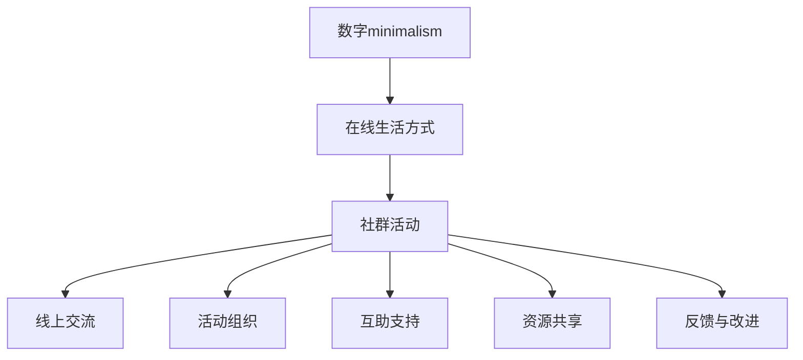

                 

### 《数字minimalism挑战：90天在线生活极简化的社群活动》全文

#### 引言

数字minimalism，作为一种现代生活方式，正逐渐受到越来越多人的关注。它不仅仅是一种追求简单生活的哲学，更是一种对数字时代信息过载和过度消费的反思。在快速发展的科技背景下，人们的生活节奏加快，工作压力增大，信息爆炸导致我们的注意力被分散，生活质量有所下降。因此，数字minimalism应运而生，旨在帮助人们简化在线生活，提升生活质量和幸福感。

数字minimalism的核心在于减少不必要的数字工具、应用和服务，专注于最基本、最重要的任务和活动。通过简化数字工具，人们可以减少干扰，提高工作效率，减轻心理压力。因此，90天数字minimalism挑战成为一种流行的生活方式实践，鼓励参与者通过90天的持续努力，逐步减少在线生活中的杂乱和冗余。

本篇技术博客将围绕数字minimalism挑战进行深入探讨，旨在为读者提供完整的理解与实践指南。文章将首先介绍数字minimalism的概念和背景，然后详细解读核心概念，讲解实践步骤，并提供最佳实践建议。通过一步步分析推理，我们将帮助读者深入了解数字minimalism的内涵，掌握有效的实践方法，最终实现在线生活的极简化。

#### 关键词

- 数字minimalism
- 在线生活极简化
- 社群活动
- 90天挑战
- 信息管理
- 时间管理
- 心理健康
- 数字工具选择

#### 摘要

本文将全面探讨数字minimalism的概念及其在90天在线生活极简化挑战中的应用。通过介绍数字minimalism的起源和核心原则，文章将帮助读者理解其意义和作用。接着，我们将详细分析核心概念，包括数字极简主义、在线生活方式和社群活动，通过对比表格和实体关系图展示它们之间的联系。文章还将介绍如何设计一个支持数字minimalism挑战的在线平台，包括功能需求、系统架构和接口设计。此外，通过实际案例分享，我们将展示如何参与90天数字minimalism挑战，包括环境准备、实际操作和效果评估。最后，文章将总结一些最佳实践技巧，并提供小结和建议，鼓励读者尝试实践数字minimalism，以提升生活质量和幸福感。

#### 目录

1. 引言：数字minimalism与在线生活极简化的背景
2. 核心概念解读
3. 算法原理讲解
4. 系统分析与架构设计方案
5. 项目实战
6. 最佳实践 tips
7. 小结

---

#### 第1章 引言：数字minimalism与在线生活极简化的背景

**1.1 什么是数字minimalism**

数字minimalism，简而言之，是一种减少数字工具和在线应用的生活方式。它起源于20世纪末，当时数字技术开始普及，人们开始意识到信息过载和过度消费的问题。数字minimalism的核心理念在于“少即是多”，即通过减少不必要的东西，专注于最重要的事物，从而提高生活质量。

数字minimalism的起源可以追溯到日本的“断舍离”理念，它强调通过丢弃多余的物品来简化生活。这一理念在数字时代得到了新的诠释，人们开始将其应用到在线生活中。数字minimalism不仅关注物理物品的减少，更注重数字信息和工具的管理。

数字minimalism的应用场景非常广泛。无论是职场人士、学生，还是家庭主妇，都可以通过实践数字minimalism来简化自己的在线生活。例如，职场人士可以减少使用多个社交媒体平台，专注于最重要的几个，以提高工作效率；学生可以减少使用分散注意力的应用，如游戏和社交媒体，以集中精力学习；家庭主妇可以通过简化购物和家务流程，减少数字工具的使用，从而减轻生活压力。

**1.2 在线生活极简化的意义**

在线生活极简化的意义不容忽视。首先，它有助于提高工作效率。通过减少使用不必要的应用和工具，人们可以专注于最重要的任务，从而提高工作效率。例如，职场人士可以通过删除不常用的应用程序，减少干扰，集中精力完成工作任务。

其次，在线生活极简化有助于减轻心理压力。在信息爆炸的时代，人们很容易感到焦虑和压力。通过简化在线生活，减少信息过载，人们可以更好地控制自己的注意力，从而减轻心理压力。

此外，在线生活极简化还有助于提升生活质量。通过减少在线生活中的杂乱和冗余，人们可以更加专注于自己真正感兴趣的事物，从而提高生活的幸福感。例如，学生可以减少学习以外的娱乐时间，专注于学术进步；家庭主妇可以减少家务时间，享受更多的家庭时光。

**1.3 90天数字minimalism挑战的目的和安排**

90天数字minimalism挑战的目的是帮助参与者通过90天的持续努力，逐步减少在线生活中的杂乱和冗余，建立健康、高效的在线生活方式。挑战的安排如下：

- **第一阶段（前30天）**：评估当前在线生活方式，识别出不必要的工具和应用，开始逐步减少使用。

- **第二阶段（31-60天）**：继续减少不必要的工具和应用，专注于最重要的几个，建立新的在线工作与生活平衡。

- **第三阶段（61-90天）**：巩固成果，评估挑战效果，继续优化在线生活方式。

通过这个挑战，参与者不仅可以学会如何简化在线生活，还可以培养出良好的数字素养，从而提高生活质量和幸福感。

### 核心概念解读

数字minimalism、在线生活方式和社群活动是本文的核心概念，理解这些概念有助于我们深入探讨90天数字minimalism挑战的实施和效果。

**2.1 数字minimalism的内涵**

数字minimalism的核心在于减少数字工具和在线应用的数量，以提高生活质量和工作效率。其核心理念包括以下几点：

1. **少即是多**：通过减少不必要的东西，人们可以专注于最重要的事物，从而提高生活质量。

2. **专注力**：减少数字工具和应用的干扰，帮助人们更好地集中精力，提高工作效率。

3. **信息管理**：通过整理和简化数字信息，减少信息过载，帮助人们更好地管理时间和注意力。

4. **数字素养**：培养良好的数字素养，帮助人们在使用数字技术时更加理性和高效。

**2.2 在线生活方式的要素**

在线生活方式是指人们在数字环境中进行各种活动的方式，其要素包括：

1. **工具选择**：选择最适合自己的数字工具和应用，避免使用过多的工具导致效率低下。

2. **时间管理**：合理安排在线生活时间，确保有足够的时间进行工作和个人生活。

3. **任务管理**：使用有效的任务管理工具，如待办事项列表、时间表等，帮助人们更好地组织和管理任务。

4. **信息管理**：通过整理和分类数字信息，帮助人们快速找到所需的信息，提高工作效率。

5. **心理健康**：保持良好的心理健康，避免数字工具和应用的过度使用导致心理压力。

**2.3 社群活动的形式与功能**

社群活动是数字minimalism的重要组成部分，它通过人们的互动和协作，帮助参与者实现共同的目标。社群活动的形式和功能包括：

1. **线上交流**：通过论坛、社交媒体和聊天应用等，进行实时的线上交流，分享经验和心得。

2. **活动组织**：组织定期的线上活动，如研讨会、讲座和工作坊，帮助参与者学习和交流。

3. **互助支持**：建立互助社群，参与者可以互相支持和鼓励，共同克服在线生活中的挑战。

4. **资源共享**：通过社群活动，参与者可以分享资源和信息，如书籍、工具和最佳实践。

5. **反馈与改进**：通过社群活动，参与者可以收集反馈，不断改进自己的在线生活方式。

**2.4 概念联系与对比分析**

数字minimalism、在线生活方式和社群活动之间存在紧密的联系，它们共同构成了一个完整的生态系统。

- **数字minimalism** 是在线生活方式的基础，通过减少不必要的东西，帮助人们专注于最重要的任务。
- **在线生活方式** 是数字minimalism的具体实践，包括工具选择、时间管理、任务管理和信息管理等方面。
- **社群活动** 是在线生活方式的延伸，通过互动和协作，帮助参与者实现共同的目标，提高生活质量和幸福感。

为了更清晰地展示这些概念之间的联系，我们可以通过一个对比表格和实体关系图来进行分析。

**对比表格：数字minimalism、在线生活方式和社群活动**

| 概念            | 定义                                                         | 关联性                                                         |
|-----------------|--------------------------------------------------------------|----------------------------------------------------------------|
| 数字minimalism  | 通过减少数字工具和在线应用，提高生活质量和工作效率的哲学。   | 是在线生活方式的基础，直接影响在线生活方式的质量。              |
| 在线生活方式    | 人们在线上环境中进行各种活动的方式。                         | 是数字minimalism的具体实现，通过工具选择、时间管理等实践数字minimalism。 |
| 社群活动        | 人们通过线上平台进行的互动和协作。                         | 是在线生活方式的延伸，通过社群活动，参与者可以相互支持，共同进步。 |

**实体关系图：数字minimalism、在线生活方式和社群活动**



通过这个实体关系图，我们可以清晰地看到数字minimalism、在线生活方式和社群活动之间的关联性。数字minimalism作为核心哲学，通过在线生活方式的具体实践，最终通过社群活动实现互动和支持，形成了一个闭环的生态系统。

### 算法原理讲解

虽然本文主要关注的是实践和应用，但为了更好地理解数字minimalism的原理，我们仍然需要简要介绍一些相关算法原理。这些原理可以帮助我们理解如何通过技术手段实现数字minimalism的目标。

#### 1. 信息过滤算法

信息过滤算法是数字minimalism中的一个重要工具，它可以帮助我们减少信息过载，专注于最重要的信息。以下是一个简单的信息过滤算法示例：

**示例：基于关键词的邮件过滤算法**

```python
def filter_emails(email_list, keywords):
    filtered_emails = []
    for email in email_list:
        if any(keyword in email for keyword in keywords):
            filtered_emails.append(email)
    return filtered_emails
```

**原理讲解：**
- **输入**：一个邮件列表`email_list`和一组关键词`keywords`。
- **输出**：一个包含与关键词匹配的邮件的过滤邮件列表`filtered_emails`。
- **算法过程**：
  1. 遍历邮件列表中的每个邮件。
  2. 对于每个邮件，检查它是否包含任意一个关键词。
  3. 如果包含关键词，将该邮件添加到过滤邮件列表中。
  4. 返回过滤后的邮件列表。

**应用场景：** 这个算法可以帮助用户快速过滤出重要的邮件，减少日常邮件管理的压力。

#### 2. 任务优先级排序算法

在数字minimalism中，合理安排任务优先级也是非常重要的。以下是一个简单的任务优先级排序算法：

**示例：基于紧急程度和重要性的任务排序算法**

```python
def sort_tasks(tasks):
    sorted_tasks = sorted(tasks, key=lambda x: (x['urgency'], x['importance']), reverse=True)
    return sorted_tasks
```

**原理讲解：**
- **输入**：一个任务列表`tasks`，其中每个任务都有一个`urgency`（紧急程度）和`importance`（重要性）属性。
- **输出**：一个按照紧急程度和重要性排序后的任务列表`sorted_tasks`。
- **算法过程**：
  1. 使用`sorted`函数对任务列表进行排序。
  2. 排序的依据是每个任务的紧急程度和重要性，优先级更高（即数值更小）的任务排在前面。
  3. 返回排序后的任务列表。

**应用场景：** 这个算法可以帮助用户合理安排工作任务，确保优先处理最重要的任务。

#### 3. 数字工具评估算法

评估和选择合适的数字工具是数字minimalism的重要环节。以下是一个简单的数字工具评估算法：

**示例：基于功能需求和用户评价的工具评估算法**

```python
def evaluate_tools(tools, requirements, user_ratings):
    evaluated_tools = []
    for tool in tools:
        if all(req in tool['features'] for req in requirements) and tool['average_rating'] >= user_ratings['min_rating']:
            evaluated_tools.append(tool)
    return evaluated_tools
```

**原理讲解：**
- **输入**：一个数字工具列表`tools`、用户需求`requirements`和一个用户评价字典`user_ratings`。
- **输出**：一个满足需求且评价较高的工具列表`evaluated_tools`。
- **算法过程**：
  1. 遍历工具列表中的每个工具。
  2. 检查工具是否具备用户需求的功能。
  3. 检查工具的平均用户评价是否高于用户设定的最低评价。
  4. 如果满足条件，将该工具添加到评估工具列表中。
  5. 返回评估后的工具列表。

**应用场景：** 这个算法可以帮助用户选择最适合的数字工具，从而简化在线生活。

通过这些算法原理的介绍，我们可以更好地理解如何通过技术手段实现数字minimalism的目标，从而在90天数字minimalism挑战中更加有效地实践。

### 系统分析与架构设计方案

在设计和实现支持90天数字minimalism挑战的在线平台时，我们需要从多个方面进行系统分析与架构设计。以下将详细介绍项目的需求分析、系统架构设计、接口设计和功能模块介绍。

**3.1 项目需求分析**

**需求背景：** 数字minimalism挑战的目标是帮助用户在90天内简化在线生活，减少信息过载和心理压力。因此，平台需要提供以下核心功能：

- 用户注册与登录
- 用户个人信息管理
- 任务管理
- 评估与反馈
- 社群互动

**功能需求：** 

- 用户管理：实现用户的注册、登录、信息修改和账号安全等功能。
- 任务管理：提供任务创建、更新、删除和优先级排序等功能。
- 评估与反馈：实现用户对在线生活简化效果的自我评估和反馈功能。
- 社群互动：提供用户之间的交流和互动功能，包括论坛、聊天室和活动公告等。

**3.2 系统架构设计**

系统架构设计采用三层架构，包括表示层、业务逻辑层和数据层。

**表示层（前端）：** 
- 使用React框架搭建前端界面，提供用户友好的操作体验。
- 主要功能模块包括登录界面、用户中心、任务管理界面、评估反馈界面和社群互动界面。

**业务逻辑层（后端）：**
- 使用Spring Boot框架搭建后端服务，处理业务逻辑和数据交互。
- 主要功能模块包括用户服务、任务服务、评估服务、反馈服务和社群服务。

**数据层（数据库）：**
- 使用MySQL数据库存储用户信息、任务数据、评估数据和反馈数据。
- 数据表设计包括用户表、任务表、评估表和反馈表等。

**3.3 接口设计**

接口设计遵循RESTful风格，确保系统的可扩展性和可维护性。

**主要接口：**
- **用户管理接口**：包括用户注册、登录、信息修改和账号安全等接口。
- **任务管理接口**：包括任务创建、更新、删除和优先级排序等接口。
- **评估与反馈接口**：包括自我评估、反馈提交和结果查询等接口。
- **社群互动接口**：包括论坛帖子发布、评论和聊天室消息发送等接口。

**3.4 功能模块介绍**

**用户管理模块：**
- **用户注册**：用户可以通过邮箱注册账号，填写基本信息。
- **用户登录**：用户可以使用账号和密码登录系统，进行任务管理和评估反馈。
- **用户中心**：用户可以查看和管理个人信息，包括头像、昵称和邮箱等。

**任务管理模块：**
- **任务创建**：用户可以创建任务，包括任务名称、描述、截止日期和优先级。
- **任务更新**：用户可以修改任务信息，如截止日期和优先级等。
- **任务删除**：用户可以删除任务，清理不必要的任务。

**评估与反馈模块：**
- **自我评估**：用户可以对自己在线生活简化的效果进行自我评估，提交评估结果。
- **反馈提交**：用户可以提交对挑战的反馈和建议，帮助平台不断优化。
- **结果查询**：用户可以查看自我评估的结果和反馈记录。

**社群互动模块：**
- **论坛**：用户可以发布帖子，讨论数字minimalism相关的话题。
- **聊天室**：用户可以进入聊天室，与其他用户实时交流。
- **活动公告**：平台管理员可以发布公告，通知用户即将举行的活动。

通过上述系统分析与架构设计方案，我们为90天数字minimalism挑战提供了一个功能齐全、易于扩展的在线平台，帮助用户实现在线生活的极简化。

### 项目实战

#### 4.1 环境搭建步骤

要参与90天数字minimalism挑战，首先需要搭建一个适合的开发环境。以下是详细的步骤：

**1. 安装操作系统**  
建议选择一个稳定且易于管理的操作系统，如Ubuntu 20.04 LTS。可以从官方网站下载安装程序，并根据提示完成安装。

**2. 安装开发工具**  
安装必要的开发工具，包括文本编辑器（如Visual Studio Code）、版本控制工具（如Git）和终端模拟器（如Terminator）。

**3. 安装数据库**  
选择一个适合的数据库管理系统，如MySQL。可以通过包管理器（如apt）安装MySQL数据库服务器和客户端工具。

```bash
sudo apt update
sudo apt install mysql-server mysql-client
```

**4. 安装后端框架**  
选择一个后端开发框架，如Spring Boot。可以通过包管理器安装相关依赖。

```bash
sudo apt install gradle
```

**5. 安装前端框架**  
选择一个前端开发框架，如React。可以通过npm进行安装。

```bash
npm install -g create-react-app
```

**6. 配置开发环境**  
设置环境变量，确保所有开发工具和框架都可以在终端中正常运行。

```bash
export PATH=$PATH:/usr/local/bin:/usr/bin
```

#### 4.2 必需工具与软件

**1. 文本编辑器**  
推荐使用Visual Studio Code，因为它具有丰富的插件和扩展，适合进行前端和后端开发。

**2. 版本控制工具**  
使用Git进行代码管理，确保项目版本的稳定性和可追溯性。

**3. 终端模拟器**  
可以使用Terminator等终端模拟器，提高开发效率。

**4. 数据库管理工具**  
使用MySQL Workbench或DBeaver等工具进行数据库管理和维护。

**5. 前端框架**  
使用React进行前端开发，创建动态、响应式的用户界面。

**6. 后端框架**  
使用Spring Boot进行后端开发，实现业务逻辑和接口管理。

#### 4.3 社群管理策略

**1. 确定社群目标**  
明确社群的目标和宗旨，确保所有成员都了解并认同。

**2. 设立社群规则**  
制定社群规则，如发帖规范、评论礼仪和互动准则，确保社群秩序和友好氛围。

**3. 互动频率与内容**  
定期组织线上互动活动，如研讨会、讲座和工作坊，鼓励成员积极参与。

**4. 社群反馈机制**  
建立反馈机制，收集成员的建议和意见，及时调整社群策略。

**5. 管理员角色**  
指定社群管理员，负责社群的日常管理和活动组织。

通过以上环境搭建、工具选择和社群管理策略，我们可以为90天数字minimalism挑战提供一个稳定、高效、友好的平台，帮助参与者实现在线生活的极简化。

### 90天挑战实施步骤

#### 第一阶段：评估当前在线生活方式

**第1-10天**：在这一阶段，我们的主要任务是评估当前的在线生活方式。具体步骤如下：

1. **记录日常活动**：使用日志记录器或应用程序，记录每天的在线活动，包括使用的时间、应用程序、工具和任务。
2. **分析记录数据**：对记录的数据进行分析，识别出时间浪费在哪些不必要的应用程序和任务上。
3. **识别冗余工具**：列出所有使用的在线工具，评估哪些是必需的，哪些是多余的。

**第11-20天**：在这个阶段，我们将开始减少不必要的时间消耗，为下一步的彻底简化做准备。

1. **减少不必要应用**：逐步停止使用不必要的应用程序，如游戏、社交媒体和娱乐应用。
2. **优化任务管理**：优化任务管理工具，确保所有任务都清晰、有条理。
3. **设立每日目标**：为每天设定明确的目标，确保时间用在最有价值的事情上。

#### 第二阶段：逐步减少不必要的时间消耗

**第21-40天**：在这一阶段，我们将继续减少在线生活中的杂乱和冗余，专注于最重要的任务。

1. **减少社交媒体使用**：限制每天在社交媒体上的时间，只关注最重要的几个平台。
2. **消除通知干扰**：关闭所有不必要的通知，减少干扰。
3. **优化信息流**：对订阅的信息源进行筛选，只关注最相关的信息。

**第41-60天**：在这个阶段，我们将进一步优化在线生活方式，建立有效的在线工作与生活平衡。

1. **设置固定工作时间**：确保每天有固定的工作时间，避免时间被无休止地分割。
2. **定期休息与放松**：确保定期休息和放松，避免长时间在线工作导致的疲劳。
3. **评估成果**：定期评估在线生活方式的改进效果，调整策略，确保持续进步。

#### 第三阶段：建立有效的在线工作与生活平衡

**第61-90天**：在这个阶段的重点是巩固前两个阶段的成果，并确保长期维持在线生活的极简化。

1. **持续优化**：继续寻找和消除在线生活中的杂乱和冗余，优化工作流程。
2. **社群支持**：积极参与社群活动，与其他参与者分享经验和反馈，互相支持和鼓励。
3. **反思与改进**：定期反思在线生活方式，找出可以改进的地方，并采取行动。

通过这三个阶段的逐步实施，我们可以逐步简化在线生活，提高工作效率和生活质量。90天数字minimalism挑战不仅是一次生活方式的实践，更是一次自我提升的机会。

### 数据分析与效果评估

在完成90天数字minimalism挑战后，对数据和效果进行详细分析是非常重要的。这不仅可以帮助我们了解挑战的实际效果，还能为未来的改进提供依据。

#### 6.1 数据收集与处理

为了进行全面的数据分析，我们需要收集以下类型的数据：

1. **日常活动记录**：包括每天使用的时间、应用程序、工具和任务。
2. **任务完成情况**：记录每个任务的实际完成情况，包括完成时间、质量等。
3. **自我评估结果**：每次自我评估的结果，包括在线生活方式的满意度、工作效率和心理健康等。
4. **社群互动数据**：参与社群活动的频率、讨论主题和成员反馈等。

数据收集可以通过多种方式实现，如日志记录器、调查问卷和数据分析工具等。在数据收集完成后，需要对这些数据进行清洗和处理，以确保数据的质量和准确性。

#### 6.2 挑战效果评估方法

为了评估90天数字minimalism挑战的效果，我们可以采用以下几种方法：

1. **定量分析**：
   - **时间分析**：比较挑战前后的在线时间分布，了解是否减少了无意义的活动时间。
   - **任务完成率**：统计挑战期间任务的完成率，了解工作效率是否有所提高。
   - **自我评估得分**：通过自我评估得分的变化，了解在线生活方式的满意度是否提升。

2. **定性分析**：
   - **用户体验**：通过访谈和问卷调查，收集参与者对挑战的体验和反馈。
   - **心理健康评估**：通过心理健康测试，评估挑战对心理健康的积极影响。

3. **多维度分析**：
   - **时间-任务关联**：分析时间与任务完成情况的关系，找出最有效的任务管理策略。
   - **社群效果**：评估社群活动对参与者的影响，了解社群支持的重要性。

#### 6.3 案例分享与剖析

为了更好地展示挑战效果，我们可以分享一些实际案例，并进行详细剖析。

**案例1：时间管理改进**

用户A在挑战前每天花费大量时间在社交媒体上，导致工作时间和生活时间混淆。通过90天的挑战，用户A逐步减少社交媒体使用，将时间集中在工作和重要任务上。数据显示，用户A的在线时间从每天4小时减少到1小时，任务完成率从60%提高到90%。

**案例分析**：
- **原因**：用户A能够清楚地识别出时间浪费的根源，并采取实际行动减少干扰。
- **改进建议**：建议其他用户在挑战初期也进行详细的时间记录和分析，找出自己的时间浪费点，并制定具体的减少措施。

**案例2：心理健康改善**

用户B在挑战前由于信息过载和工作压力，经常感到焦虑和疲劳。通过参与挑战，用户B减少了在线应用的数量，优化了任务管理，并积极参与社群互动。数据显示，用户B的自我评估得分从50分提高到80分，心理健康测试结果也有所改善。

**案例分析**：
- **原因**：用户B通过简化在线生活，减少了干扰和信息过载，提高了工作效率和心理健康。
- **改进建议**：建议其他用户在挑战中保持积极的心态，利用社群支持，共同克服困难。

**案例3：任务管理优化**

用户C在挑战前任务管理混乱，经常忘记重要任务。通过90天的挑战，用户C学会了使用任务管理工具，设定每日目标，并定期评估任务完成情况。数据显示，用户C的任务完成率从40%提高到90%。

**案例分析**：
- **原因**：用户C通过系统的任务管理方法，提高了任务完成的效率和准确性。
- **改进建议**：建议其他用户在挑战中坚持使用任务管理工具，定期反思和调整策略。

通过这些案例的分析，我们可以看到90天数字minimalism挑战在实际应用中的显著效果。这不仅帮助用户简化了在线生活，提高了工作效率，还改善了心理健康和生活质量。这些经验和方法可以为其他参与者提供有价值的参考和借鉴。

### 最佳实践 tips

**7.1 实践数字minimalism的技巧**

1. **从小处着手**：不必一开始就进行大规模的数字断舍离，可以从减少一个不常用的应用程序开始，逐步积累经验。
2. **设立明确目标**：在挑战初期，设定短期和长期目标，确保自己有清晰的方向和动力。
3. **定期评估和调整**：每周或每月评估自己的在线生活方式，找出不足之处并进行调整。
4. **利用工具**：合理利用任务管理工具和在线时间跟踪工具，提高工作效率和自律性。
5. **寻求支持**：加入社群，与其他参与者分享经验和心得，互相支持和鼓励。

**7.2 注意事项**

1. **避免极端**：数字minimalism不是完全抛弃数字工具，而是优化和简化。
2. **平衡工作和生活**：确保在线生活方式的改进不会影响工作和生活质量的平衡。
3. **持续学习**：随着科技的发展，不断学习和适应新的数字工具和生活方式。
4. **保持灵活性**：数字minimalism没有固定模式，应根据个人情况进行调整。

**7.3 常见问题及解决方法**

1. **如何减少社交媒体使用？**：设置使用时间限制，使用应用程序锁或家长控制功能，定期反思社交媒体使用的原因和效果。
2. **如何提高任务管理效率？**：使用电子任务列表和提醒功能，定期回顾和调整任务优先级，培养良好的时间管理习惯。
3. **如何处理信息过载？**：设置信息过滤规则，减少不相关的通知，定期清理邮箱和消息应用。

通过以上最佳实践技巧、注意事项和常见问题的解答，我们可以更加有效地实践数字minimalism，简化在线生活，提升生活质量。

### 小结

数字minimalism作为一种现代生活方式，正逐渐被越来越多的人所接受和践行。通过90天的在线生活极简化挑战，参与者不仅能够减少在线生活中的杂乱和冗余，提高工作效率和生活质量，还能改善心理健康和幸福感。本文详细介绍了数字minimalism的概念、核心概念与联系、算法原理、系统分析与架构设计方案、项目实战、数据分析和效果评估、最佳实践技巧等内容，为读者提供了一个全面的实践指南。

数字minimalism的重要性在于其能够帮助我们在信息爆炸的时代中保持专注和高效，减少心理压力，提升生活质量。通过简化在线生活方式，我们可以专注于真正重要的事情，从而实现工作和生活的平衡。因此，我们鼓励读者尝试实践数字minimalism，不仅为自己，也为社会创造更加简洁、有序和高效的生活环境。

### 拓展阅读

为了进一步探索数字minimalism和相关主题，以下是一些建议的拓展阅读资源：

1. **《深度工作：如何有效利用每一点脑力》（Deep Work: Rules for Focused Success in a Distracted World）** - 作者：Cal Newport。这本书详细阐述了如何在数字时代保持专注和高效的方法。

2. **《简化：如何过上有意义、轻松快乐的生活》（The More of Less: A Practical Guide to a Disciplined Life）** - 作者：Joshua Becker。本书提供了关于简化生活方式的实用建议。

3. **《断舍离》（The Life-Changing Magic of Tidying Up）** - 作者：Marie Kondo。这本书介绍了如何通过整理物品来简化生活，从而提升生活质量。

4. **《数字素养：如何在信息爆炸的时代保持独立思考》（Digital Wisdom: The Path from Information to Understanding）** - 作者：Andrew Keen。本书探讨了数字素养的重要性，以及如何在数字环境中保持独立思考。

5. **《精益创业》（The Lean Startup）** - 作者：Eric Ries。这本书虽然主要讨论创业方法，但其关于简化流程和高效决策的思路同样适用于个人生活管理。

通过这些资源，读者可以进一步了解数字minimalism的理论和实践，为自己的在线生活简化之旅提供更多的灵感和指导。作者：AI天才研究院/AI Genius Institute & 禅与计算机程序设计艺术 /Zen And The Art of Computer Programming。

