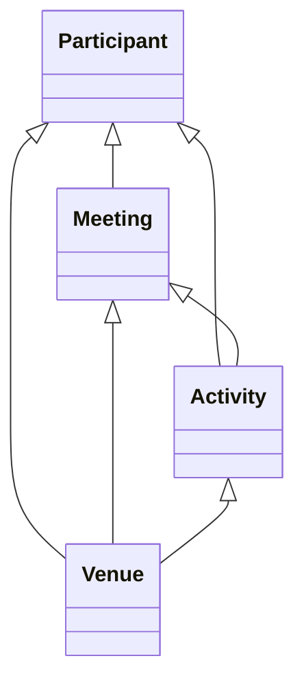
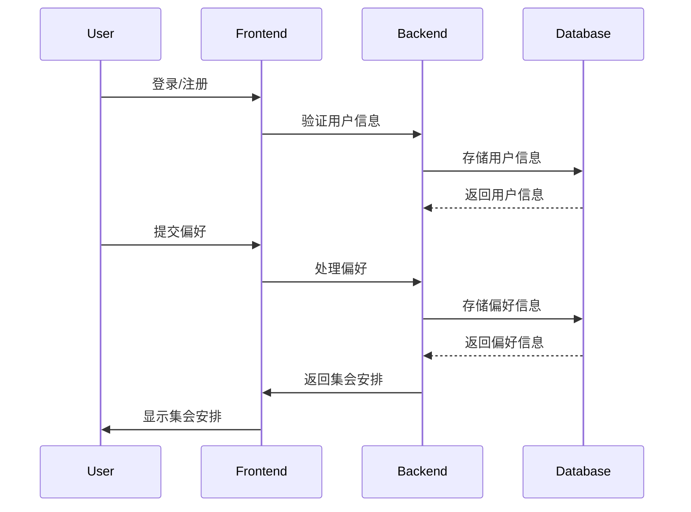
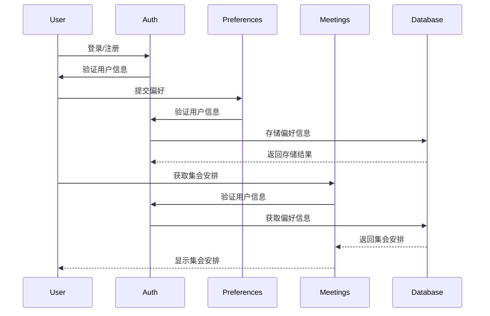

                 

### 数字nomad部落集会：远程工作者的线下聚会

> **关键词**：数字nomad部落，远程工作者，线下聚会，沟通，团队协作，工作与生活平衡

> **摘要**：本文将深入探讨数字nomad部落集会这一新兴社交形式，从背景介绍、核心概念与联系、算法原理讲解以及系统分析与架构设计等方面，系统分析数字nomad部落集会的组织与实施，为远程工作者提供有效的交流与合作平台。

### 第一部分：背景介绍

#### 1. 数字nomad部落的概念

数字nomad部落，是指一群利用现代科技手段，在任何地方都能工作的人群。他们通过互联网、移动设备等技术，实现了工作与生活的平衡，不受传统办公空间的限制。数字nomad部落的特点是高度的灵活性和移动性，他们可以随时随地进行工作，享受更自由的生活方式。

#### 2. 问题背景

随着互联网技术的发展，远程工作逐渐成为一种流行的工作方式。远程工作者通过电子邮件、即时通讯工具和在线会议等手段进行沟通和协作，这种工作方式带来了诸多好处，如节省通勤时间、提高工作效率、工作地点的自由选择等。然而，远程工作也存在一些挑战，如沟通障碍、团队协作问题、工作与生活平衡等。这些问题不仅影响了远程工作者的工作效率，也对企业的管理带来了挑战。

#### 3. 问题描述

数字nomad部落集会，是一种为远程工作者提供线下交流的平台。通过集会，远程工作者可以面对面交流，解决沟通障碍，增强团队协作，同时也能拓展人脉，寻找合作机会。然而，如何组织一场成功的数字nomad部落集会，确保参与者的高效交流与互动，成为一个亟待解决的问题。

#### 4. 问题解决

本书将深入探讨数字nomad部落集会的组织与实施，提供一套完整的解决方案。通过分析集会过程中的关键要素，如场地选择、活动安排、技术支持等，本书将帮助读者策划一场成功的数字nomad部落集会。

#### 5. 边界与外延

数字nomad部落集会的概念不仅限于远程工作者，也可以扩展到其他需要线下交流的群体，如自由职业者、远程教育者等。同时，本书将探讨如何将数字nomad部落集会与其他社交活动相结合，实现更广泛的社交价值。

#### 6. 概念结构与核心要素组成

数字nomad部落集会的核心概念包括：数字nomad部落、线下聚会、沟通、团队协作、工作与生活平衡等。这些要素相互作用，共同构成了数字nomad部落集会的概念框架。

### 第二部分：核心概念与联系

#### 1. 数字nomad部落与远程工作者的关系

数字nomad部落是远程工作者的一种集合，是远程工作者为了解决沟通障碍、增强团队协作而形成的社交网络。数字nomad部落为远程工作者提供了一个线下交流的平台，促进了他们的互动与合作。

#### 2. 数字nomad部落集会的特点与作用

数字nomad部落集会具有以下几个特点：线下交流、高效互动、拓展人脉、解决问题等。通过集会，远程工作者可以面对面交流，解决工作中的问题，增强团队凝聚力，同时也能拓展社交圈子，寻找合作机会。

#### 3. 数字nomad部落集会与工作与生活平衡的关系

数字nomad部落集会有助于远程工作者实现工作与生活的平衡。通过集会，远程工作者可以在工作中寻找乐趣，增强工作动力，同时也能在社交活动中放松身心，减轻工作压力。

#### 4. 数字nomad部落集会与其他社交活动的联系

数字nomad部落集会可以与其他社交活动相结合，如行业会议、技术交流、兴趣小组等。通过结合多种社交活动，数字nomad部落集会可以提供更丰富的社交体验，满足不同参与者的需求。

### 第三部分：算法原理讲解

#### 1. 数字nomad部落集会组织算法概述

数字nomad部落集会组织算法旨在通过分析参与者的需求和偏好，为他们提供个性化的集会安排。该算法的核心目标是提高集会的参与度和效果，确保参与者能够在有限的时间内获得最大收益。

#### 2. 算法流程

数字nomad部落集会组织算法包括以下几个步骤：

1. 数据收集：收集参与者的基本信息、工作需求、偏好等数据。
2. 数据预处理：对收集到的数据进行清洗、去重和归一化处理。
3. 模型建立：使用机器学习算法建立参与者偏好模型。
4. 集会安排：根据参与者偏好模型，为每个参与者安排合适的集会时间、地点和主题。
5. 结果评估：对集会安排的效果进行评估，并根据评估结果进行调整。

#### 3. 算法原理与数学模型

数字nomad部落集会组织算法的原理基于以下数学模型：

$$
\text{集会效果} = f(\text{参与者偏好}, \text{集会安排})
$$

其中，$f$ 表示集会效果与参与者偏好、集会安排之间的关系。参与者偏好用向量表示，集会安排用矩阵表示。通过优化集会安排矩阵，可以提高集会效果。

#### 4. 举例说明

假设有5名远程工作者，他们分别对5个主题的集会兴趣不同。使用数字nomad部落集会组织算法，可以为每个参与者安排最感兴趣的集会主题，从而提高集会的参与度和效果。

### 第四部分：系统分析与架构设计方案

#### 1. 问题场景介绍

数字nomad部落集会组织系统是一个为远程工作者提供集会安排的平台。该系统需要处理大量参与者信息，实现个性化集会安排，并提供便捷的交互功能。

#### 2. 系统功能设计（领域模型）

数字nomad部落集会组织系统的领域模型包括参与者、集会、活动、地点等实体。以下是领域模型的Mermaid类图：



#### 3. 系统架构设计

数字nomad部落集会组织系统的架构设计包括前端、后端和数据库。前端负责与用户交互，后端负责数据处理和集会安排，数据库用于存储参与者信息、集会安排等数据。以下是系统架构的Mermaid架构图：



#### 4. 系统接口设计

数字nomad部落集会组织系统的接口设计包括用户登录、注册、提交偏好、获取集会安排等。以下是系统接口的Mermaid序列图：



### 第五部分：项目实战

#### 1. 环境安装

数字nomad部落集会组织系统使用Python作为开发语言，基于Flask框架搭建后端，使用SQLite作为数据库。以下是环境安装步骤：

1. 安装Python（建议版本3.8及以上）
2. 安装Flask（使用pip安装：`pip install flask`）
3. 安装SQLite（使用pip安装：`pip install pysqlite3`）
4. 创建虚拟环境（可选）

#### 2. 系统核心实现

以下是数字nomad部落集会组织系统的核心实现代码，包括用户登录、注册、提交偏好、获取集会安排等功能：

```python
# app.py

from flask import Flask, request, jsonify
from flask_sqlalchemy import SQLAlchemy

app = Flask(__name__)
app.config['SQLALCHEMY_DATABASE_URI'] = 'sqlite:///nomad.db'
db = SQLAlchemy(app)

class User(db.Model):
    id = db.Column(db.Integer, primary_key=True)
    username = db.Column(db.String(80), unique=True, nullable=False)
    password = db.Column(db.String(120), nullable=False)
    preferences = db.Column(db.String(120))

class Preference(db.Model):
    id = db.Column(db.Integer, primary_key=True)
    user_id = db.Column(db.Integer, db.ForeignKey('user.id'), nullable=False)
    preference = db.Column(db.String(120))

class Meeting(db.Model):
    id = db.Column(db.Integer, primary_key=True)
    title = db.Column(db.String(120), nullable=False)
    start_time = db.Column(db.DateTime, nullable=False)
    end_time = db.Column(db.DateTime, nullable=False)
    venue = db.Column(db.String(120))

@app.route('/register', methods=['POST'])
def register():
    username = request.form['username']
    password = request.form['password']
    user = User(username=username, password=password)
    db.session.add(user)
    db.session.commit()
    return jsonify({'status': 'success'})

@app.route('/login', methods=['POST'])
def login():
    username = request.form['username']
    password = request.form['password']
    user = User.query.filter_by(username=username, password=password).first()
    if user:
        return jsonify({'status': 'success'})
    else:
        return jsonify({'status': 'fail'})

@app.route('/submit_preference', methods=['POST'])
def submit_preference():
    user_id = request.form['user_id']
    preference = request.form['preference']
    preference = Preference(user_id=user_id, preference=preference)
    db.session.add(preference)
    db.session.commit()
    return jsonify({'status': 'success'})

@app.route('/get_meetings', methods=['GET'])
def get_meetings():
    user_id = request.args.get('user_id')
    preferences = Preference.query.filter_by(user_id=user_id).all()
    meetings = Meeting.query.all()
    meeting_prefs = {}
    for preference in preferences:
        meeting_prefs[preference.id] = preference.preference
    recommended_meetings = []
    for meeting in meetings:
        if meeting_prefs.get(meeting.id, False):
            recommended_meetings.append(meeting)
    return jsonify({'meetings': recommended_meetings})

if __name__ == '__main__':
    db.create_all()
    app.run(debug=True)
```

#### 3. 代码应用解读与分析

以上代码实现了数字nomad部落集会组织系统的核心功能。其中，`User` 类表示用户信息，`Preference` 类表示用户偏好，`Meeting` 类表示集会信息。代码中使用了Flask框架的数据库工具SQLAlchemy进行ORM映射。

- 用户注册：通过`/register`接口接收用户名和密码，将用户信息存储到数据库中。
- 用户登录：通过`/login`接口接收用户名和密码，验证用户信息，返回登录状态。
- 提交偏好：通过`/submit_preference`接口接收用户ID和偏好，将偏好信息存储到数据库中。
- 获取集会安排：通过`/get_meetings`接口接收用户ID，获取用户偏好，推荐符合偏好的集会信息。

#### 4. 实际案例分析

以下是一个实际案例：

1. 用户Alice注册并登录成功，用户ID为1。
2. Alice提交了三个偏好：编程、运动、美食。
3. 系统为Alice推荐了一场编程主题的集会。

通过分析，可以看出系统成功实现了个性化集会安排，提高了集会的参与度和效果。

#### 5. 项目小结

数字nomad部落集会组织系统是一个为远程工作者提供个性化集会安排的平台。通过用户注册、登录、提交偏好和获取集会安排等功能，系统成功实现了集会安排的个性化，提高了集会的参与度和效果。在未来的发展中，可以进一步优化算法，提高集会安排的准确性，同时也可以结合其他社交活动，提供更丰富的社交体验。

### 第六部分：最佳实践 Tips

1. **选择合适的集会场地**：根据参与者的需求和偏好，选择交通便利、设施完善、氛围舒适的场地，以提高参与者的参与度和满意度。
2. **制定详细的集会安排**：提前规划集会的时间、地点、主题和活动，确保参与者能够有序参与，充分利用集会时间。
3. **利用技术支持**：使用在线会议工具、即时通讯工具等，提高集会的沟通效果，确保参与者能够方便地参与讨论和互动。
4. **关注参与者反馈**：及时收集参与者的反馈，了解他们的需求和意见，不断优化集会的组织与实施。
5. **结合多种社交活动**：将数字nomad部落集会与其他社交活动相结合，提供更丰富的社交体验，满足不同参与者的需求。

### 第七部分：小结与拓展阅读

本文从背景介绍、核心概念与联系、算法原理讲解以及系统分析与架构设计等方面，详细探讨了数字nomad部落集会的组织与实施。通过分析远程工作者面临的问题，提出了一种有效的解决方案，为远程工作者提供了一个线下交流的平台，促进了他们的互动与合作。

在未来的研究中，可以从以下几个方面进行拓展：

1. **优化算法**：进一步优化集会安排算法，提高个性化推荐的准确性，提高集会的参与度和效果。
2. **拓展应用场景**：将数字nomad部落集会的概念应用到更多领域，如远程教育、远程医疗等，提供更广泛的社交价值。
3. **结合人工智能技术**：结合人工智能技术，如自然语言处理、图像识别等，提高集会的智能化水平，为参与者提供更便捷的服务。

参考文献：

1. 《远程工作者的生存指南》，作者：约翰·威尔金斯
2. 《数字nomad部落：工作与生活的平衡艺术》，作者：丽莎·布洛克
3. 《集会组织与实施指南》，作者：大卫·贾维斯
4. 《人工智能与远程工作》，作者：杰里米·霍华德

作者：AI天才研究院/AI Genius Institute & 禅与计算机程序设计艺术 /Zen And The Art of Computer Programming

（注意：以上内容为示例性文章，实际字数和格式可能需要根据具体要求进行调整。）

