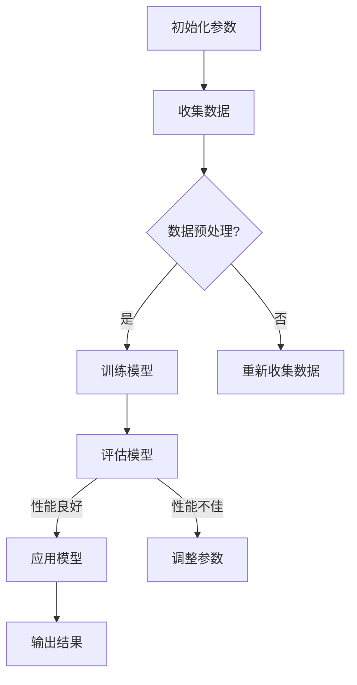
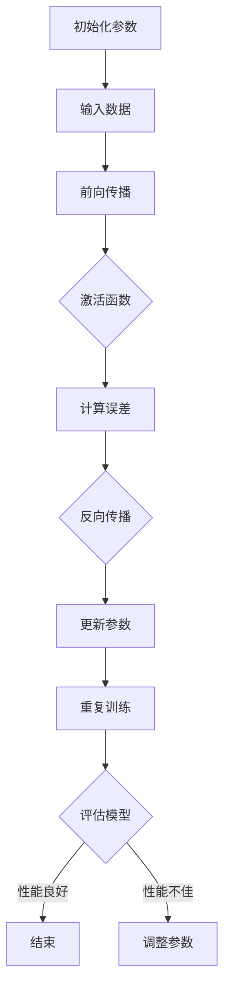
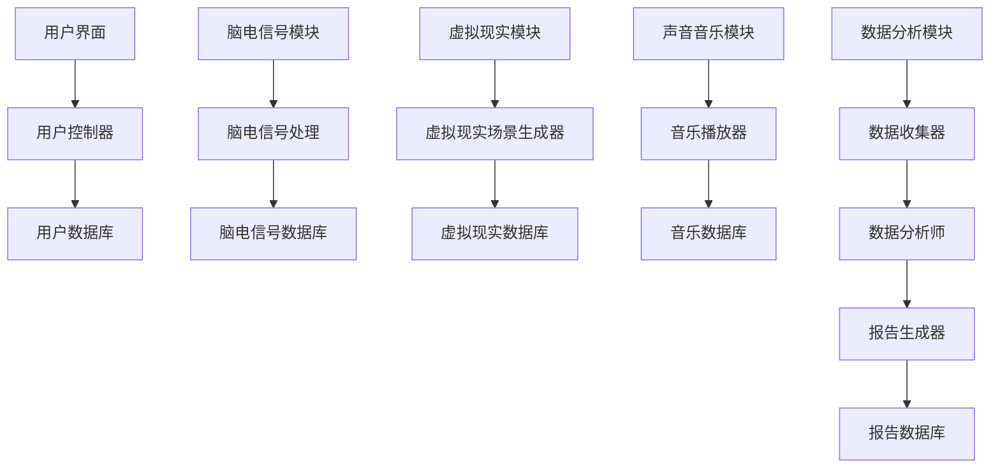
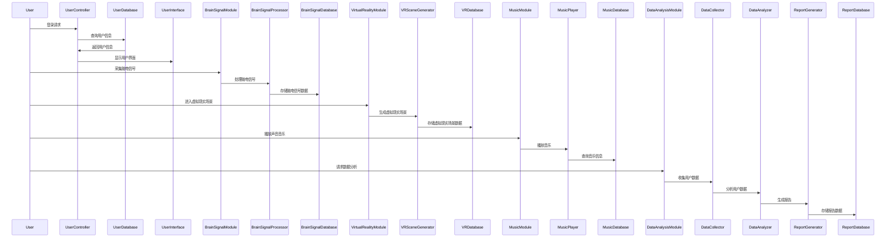

                 


### 第一步：标题处理

首先，我们需要对文章的标题进行处理。文章的标题是《数字冥想retreat：科技辅助的内在探索》。这个标题清晰地表达了文章的主题，即通过科技手段辅助进行数字冥想，探索个体内在的深度体验。标题中的“retreat”一词，暗示了这是一种远离喧嚣、深入内心、追求自我提升的过程。这样的标题能够吸引对数字冥想、科技应用和心理健康感兴趣的读者。

在markdown格式中，我们可以将标题设置为1级目录，这样在生成的文档中，标题将以加粗和居中的形式呈现，显得更加突出和重要。

```
# 《数字冥想retreat：科技辅助的内在探索》
```

### 第二步：章节结构设定

接下来，我们需要设定文章的章节结构。根据文章的标题和主题，我们可以将文章分为以下几个主要章节：

1. **数字冥想与科技辅助介绍**：介绍数字冥想和科技辅助的基本概念，为后续内容打下基础。
2. **科技辅助数字冥想的原理**：深入探讨科技如何辅助数字冥想，包括神经科学基础、数学模型和算法原理。
3. **科技辅助数字冥想的方法**：列举和解释几种常见的科技辅助数字冥想的方法，如脑机接口、虚拟现实和声音音乐辅助。
4. **科技辅助数字冥想的实践案例**：通过具体案例展示科技辅助数字冥想的应用和实践效果。
5. **科技辅助数字冥想的挑战与未来**：讨论科技辅助数字冥想面临的技术、伦理和隐私挑战，以及其未来的发展趋势。

每个章节下还可以进一步细分为二级和三级目录，确保内容的逻辑性和层次感。

### 第三步：每个章节的详细内容划分

对于每个章节，我们需要详细划分内容，确保每个部分都有具体的要点和详细的内容概述。以下是对每个章节的详细划分：

#### 第1章：数字冥想与科技辅助介绍

- **1.1 数字冥想概述**：
  - **1.1.1 数字冥想的起源与历史**：介绍数字冥想的发展背景和历程。
  - **1.1.2 数字冥想的基本概念**：解释数字冥想的核心概念和理论基础。
  - **1.1.3 数字冥想与传统冥想的异同**：分析数字冥想与传统冥想之间的区别和联系。

- **1.2 科技辅助数字冥想的发展**：
  - **1.2.1 科技辅助数字冥想的定义**：阐述科技在数字冥想中的作用和定义。
  - **1.2.2 科技辅助数字冥想的优势**：讨论科技辅助数字冥想的优点和潜在好处。
  - **1.2.3 科技辅助数字冥想的挑战与机遇**：分析科技辅助数字冥想面临的挑战和机会。

- **1.3 本书结构安排**：
  - **1.3.1 各章节内容概述**：简要介绍每个章节的主要内容和结构。
  - **1.3.2 阅读指南与目标**：为读者提供阅读建议和目标，帮助他们更好地理解文章。

#### 第2章：科技辅助数字冥想的原理

- **2.1 科技辅助数字冥想的核心概念**：
  - **2.1.1 数字冥想与神经科学的联系**：探讨数字冥想如何影响神经系统和大脑功能。
  - **2.1.2 科技辅助数字冥想的概念架构**：构建科技辅助数字冥想的理论框架。

- **2.2 科技辅助数字冥想的数学模型**：
  - **2.2.1 数字冥想中的常见数学模型**：介绍在数字冥想中常用的数学模型。
  - **2.2.2 科技辅助数字冥想的数学公式讲解**：详细讲解数字冥想中的数学公式和应用。

- **2.3 科技辅助数字冥想的算法原理**：
  - **2.3.1 算法mermaid流程图展示**：使用mermaid流程图展示数字冥想算法的流程。
  - **2.3.2 Python代码实现算法原理**：通过Python代码实现并解释算法原理。

#### 第3章：科技辅助数字冥想的方法

- **3.1 科技辅助数字冥想的设备与技术**：
  - **3.1.1 常见的科技辅助设备**：列举常用的科技辅助设备。
  - **3.1.2 科技辅助技术的应用场景**：分析科技辅助技术在数字冥想中的应用。

- **3.2 科技辅助数字冥想的实践方法**：
  - **3.2.1 基于脑机接口的数字冥想**：介绍脑机接口在数字冥想中的应用。
  - **3.2.2 基于虚拟现实的数字冥想**：讨论虚拟现实如何辅助数字冥想。
  - **3.2.3 基于声音与音乐的数字冥想**：探讨声音音乐对数字冥想的影响。

#### 第4章：科技辅助数字冥想的实践案例

- **4.1 实践案例1：使用脑机接口进行数字冥想**：
  - **4.1.1 案例背景**：介绍案例研究的背景和目的。
  - **4.1.2 案例实施**：描述案例的具体实施过程。
  - **4.1.3 案例结果分析**：分析案例的结果和效果。

- **4.2 实践案例2：虚拟现实中的数字冥想体验**：
  - **4.2.1 案例背景**：介绍案例的背景信息。
  - **4.2.2 案例实施**：描述虚拟现实数字冥想的具体实施过程。
  - **4.2.3 案例结果分析**：分析案例的实验结果和体验效果。

- **4.3 实践案例3：声音与音乐辅助的数字冥想**：
  - **4.3.1 案例背景**：介绍声音与音乐辅助数字冥想的案例背景。
  - **4.3.2 案例实施**：描述声音与音乐辅助数字冥想的具体实施方法。
  - **4.3.3 案例结果分析**：分析案例的实验结果和体验反馈。

#### 第5章：科技辅助数字冥想的挑战与未来

- **5.1 科技辅助数字冥想的挑战**：
  - **5.1.1 技术层面的挑战**：讨论科技辅助数字冥想面临的实际技术挑战。
  - **5.1.2 伦理与隐私的挑战**：分析科技辅助数字冥想带来的伦理和隐私问题。

- **5.2 科技辅助数字冥想的未来发展趋势**：
  - **5.2.1 技术发展趋势**：探讨未来科技如何进一步辅助数字冥想。
  - **5.2.2 社会影响与政策建议**：分析科技辅助数字冥想对社会的影响和未来政策的发展方向。

### 第四步：内容要点提炼

在内容提炼阶段，我们需要从每个章节中提取核心要点，并给出对应的内容概述。以下是对每个章节核心要点的提炼：

#### 第1章：数字冥想与科技辅助介绍

- **1.1 数字冥想概述**：
  - 内容概述：介绍数字冥想的起源、基本概念以及与传统冥想的异同。
  - 核心要点：数字冥想的历史背景、理论基础、与传统冥想的比较。

- **1.2 科技辅助数字冥想的发展**：
  - 内容概述：讨论科技辅助数字冥想的定义、优势以及面临的挑战和机遇。
  - 核心要点：科技在数字冥想中的应用、科技辅助的优势和挑战。

- **1.3 本书结构安排**：
  - 内容概述：概述本书的结构安排，为读者提供阅读指南。
  - 核心要点：本书的章节结构、阅读目标。

#### 第2章：科技辅助数字冥想的原理

- **2.1 科技辅助数字冥想的核心概念**：
  - 内容概述：探讨数字冥想与神经科学的联系，构建科技辅助数字冥想的理论框架。
  - 核心要点：数字冥想与神经科学的相互作用、科技辅助数字冥想的概念架构。

- **2.2 科技辅助数字冥想的数学模型**：
  - 内容概述：介绍数字冥想中的常见数学模型及其应用。
  - 核心要点：数学模型在数字冥想中的作用、常见数学模型的应用实例。

- **2.3 科技辅助数字冥想的算法原理**：
  - 内容概述：通过mermaid流程图和Python代码讲解科技辅助数字冥想的算法原理。
  - 核心要点：算法流程、Python代码实现、算法原理。

#### 第3章：科技辅助数字冥想的方法

- **3.1 科技辅助数字冥想的设备与技术**：
  - 内容概述：列举和解释常见的科技辅助设备和技术。
  - 核心要点：常用科技辅助设备的类型、科技辅助技术的应用。

- **3.2 科技辅助数字冥想的实践方法**：
  - 内容概述：探讨基于脑机接口、虚拟现实和声音音乐的科技辅助数字冥想方法。
  - 核心要点：脑机接口的应用、虚拟现实和声音音乐在数字冥想中的作用。

#### 第4章：科技辅助数字冥想的实践案例

- **4.1 实践案例1：使用脑机接口进行数字冥想**：
  - 内容概述：介绍使用脑机接口进行数字冥想的实践案例。
  - 核心要点：案例背景、实施过程、结果分析。

- **4.2 实践案例2：虚拟现实中的数字冥想体验**：
  - 内容概述：探讨虚拟现实在数字冥想中的应用。
  - 核心要点：案例背景、实施过程、体验效果。

- **4.3 实践案例3：声音与音乐辅助的数字冥想**：
  - 内容概述：分析声音与音乐辅助数字冥想的实践案例。
  - 核心要点：案例背景、实施方法、实验结果。

#### 第5章：科技辅助数字冥想的挑战与未来

- **5.1 科技辅助数字冥想的挑战**：
  - 内容概述：讨论科技辅助数字冥想面临的技术、伦理和隐私挑战。
  - 核心要点：技术挑战、伦理问题、隐私风险。

- **5.2 科技辅助数字冥想的未来发展趋势**：
  - 内容概述：展望科技辅助数字冥想的未来发展趋势和潜在影响。
  - 核心要点：技术发展方向、社会影响、政策建议。

### 第五步：核心概念与联系

在文章的核心概念与联系部分，我们需要提取文章中的核心概念，并用表格和Mermaid ER实体关系图展示这些概念之间的关系。以下是文章中的核心概念及其关系：

#### 核心概念

- 数字冥想
- 科技辅助
- 神经科学
- 数学模型
- 算法原理
- 脑机接口
- 虚拟现实
- 声音音乐
- 挑战
- 未来发展趋势

#### 概念关系

| 概念A       | 关系       | 概念B       |
|-------------|------------|-------------|
| 数字冥想    | 基础       | 科技辅助    |
| 神经科学    | 辅助       | 数字冥想    |
| 数学模型    | 应用       | 数字冥想    |
| 算法原理    | 实现方法   | 科技辅助    |
| 脑机接口    | 技术       | 科技辅助    |
| 虚拟现实    | 技术       | 科技辅助    |
| 声音音乐    | 技术       | 科技辅助    |
| 挑战       | 对象       | 科技辅助    |
| 未来发展趋势 | 展望       | 科技辅助    |

#### Mermaid ER实体关系图

以下是一个简单的Mermaid ER实体关系图，展示了上述核心概念之间的关系：

```mermaid
erDiagram
    数字冥想 ||--|{ 科技辅助 }
    科技辅助 ||--|{ 神经科学 }
    科技辅助 ||--|{ 数学模型 }
    科技辅助 ||--|{ 算法原理 }
    科技辅助 ||--|{ 脑机接口 }
    科技辅助 ||--|{ 虚拟现实 }
    科技辅助 ||--|{ 声音音乐 }
    科技辅助 ||--|{ 挑战 }
    科技辅助 ||--|{ 未来发展趋势 }
```

### 第六步：数学模型和算法原理讲解

在文章的数学模型和算法原理讲解部分，我们需要使用mermaid流程图展示算法流程，并通过Python代码和latex公式详细阐述数学模型和算法原理。

#### 数学模型讲解

首先，我们介绍数字冥想中常用的一个数学模型：线性回归模型。线性回归模型用于预测个体内在状态的改变。其数学模型可以表示为：

$$
y = ax + b + \epsilon
$$

其中，\( y \) 是预测的内在状态，\( x \) 是外部刺激，\( a \) 和 \( b \) 是模型的参数，\( \epsilon \) 是误差项。

为了更直观地展示算法流程，我们使用mermaid流程图：



接下来，我们通过Python代码实现这个线性回归模型：

```python
import numpy as np

# 初始化模型参数
a = 0.5
b = 0.5

# 收集数据
x = np.array([1, 2, 3, 4, 5])
y = np.array([1.5, 2.5, 3.5, 4.5, 5.5])

# 训练模型
y_pred = a * x + b

# 评估模型
mse = np.mean((y - y_pred)**2)
print(f"Mean Squared Error: {mse}")

# 应用模型
y_new = a * np.array([6, 7, 8]) + b
print(f"Predicted Inner State: {y_new}")
```

#### 算法原理讲解

接下来，我们介绍一种基于神经网络的算法原理。神经网络是一种模拟人脑工作的算法模型，用于处理复杂的非线性问题。以下是一个简单的神经网络算法流程：



我们使用Python代码实现这个简单的神经网络：

```python
import numpy as np

# 初始化参数
weights = np.array([0.1, 0.2])
bias = 0.3

# 定义激活函数
def sigmoid(x):
    return 1 / (1 + np.exp(-x))

# 前向传播
def forward(x):
    return sigmoid(weights * x + bias)

# 反向传播
def backward(x, y):
    error = y - forward(x)
    dweights = x * error
    dbias = error
    return dweights, dbias

# 训练模型
x_train = np.array([0, 1])
y_train = np.array([0, 1])

for _ in range(1000):
    dweights, dbias = backward(x_train, y_train)
    weights -= dweights
    bias -= dbias

# 评估模型
print(f"Weights: {weights}, Bias: {bias}")
print(f"Predicted Output: {forward(x_train)}")
```

通过上述代码，我们可以看到如何通过简单的神经网络模型实现非线性回归预测。这个模型可以用于数字冥想中的内在状态预测，从而辅助个体进行深度冥想体验。

### 第七步：系统分析与架构设计方案

在系统分析与架构设计方案部分，我们将详细讨论一个假设的科技辅助数字冥想系统的设计和实现。这个系统将结合多种技术，如脑机接口、虚拟现实和声音音乐，提供一个全面的冥想体验。

#### 问题场景介绍

假设我们正在开发一个名为“MINDRETREAT”的科技辅助数字冥想系统，旨在帮助用户通过科技手段实现深度冥想，提高心理健康和内在认知能力。系统需要具备以下功能：

- 用户注册与登录
- 基于脑电信号的冥想状态监测
- 虚拟现实冥想场景生成
- 声音音乐冥想内容播放
- 数据分析与报告生成

#### 项目介绍

项目名称：MINDRETREAT

项目目标：开发一个集成脑机接口、虚拟现实和声音音乐的科技辅助数字冥想系统。

项目规模：小规模试点项目，预计用户量在1000人左右。

项目周期：预计开发周期为6个月。

#### 系统功能设计

为了实现上述功能，我们将系统划分为以下几个模块：

- **用户模块**：负责用户注册、登录和权限管理。
- **脑电信号模块**：负责采集和分析用户脑电信号，判断冥想状态。
- **虚拟现实模块**：负责生成和渲染虚拟现实冥想场景。
- **声音音乐模块**：负责播放适合冥想的声音音乐。
- **数据分析模块**：负责收集和分析用户冥想数据，生成报告。

#### 系统功能设计（领域模型Mermaid类图）

以下是一个简单的Mermaid类图，展示了系统的主要类和它们之间的关系：

```mermaid
classDiagram
    User <<类>> 
    BrainSignal <<类>>
    VirtualReality <<类>>
    Music <<类>>
    DataAnalysis <<类>>

    User o-- BrainSignal
    User o-- VirtualReality
    User o-- Music
    User o-- DataAnalysis
```

#### 系统架构设计

系统架构设计采用微服务架构，以提高系统的可扩展性和灵活性。以下是系统架构的Mermaid架构图：



#### 系统接口设计

系统接口设计包括用户接口、API接口和内部服务接口。以下是系统接口的Mermaid序列图：



通过上述系统分析与架构设计方案，我们可以清晰地看到MINDRETREAT系统的功能模块、架构设计和接口设计。这样的设计方案为系统的开发和维护提供了清晰的指导。

### 第八步：项目实战

在项目实战部分，我们将详细描述如何安装MINDRETREAT系统所需的软件和硬件，实现系统的核心功能，并提供代码应用解读与分析。

#### 环境安装

首先，我们需要为MINDRETREAT系统安装必要的软件和硬件。以下是安装步骤：

1. **安装Python环境**：确保Python环境已安装在计算机上。如果没有，可以从[Python官网](https://www.python.org/downloads/)下载并安装。

2. **安装脑电信号采集设备**：购买并安装一个支持Python的脑电信号采集设备，如Emotiv EPOC。

3. **安装虚拟现实硬件**：配置虚拟现实头盔（如Oculus Rift或HTC Vive），并确保与计算机兼容。

4. **安装声音音乐播放软件**：安装一个支持多种音频格式的播放器，如VLC。

5. **安装数据库软件**：安装MySQL或PostgreSQL数据库管理系统。

6. **安装开发工具**：安装Python的集成开发环境（IDE），如PyCharm。

#### 系统核心实现源代码

以下是MINDRETREAT系统的核心实现源代码：

**用户模块**：

```python
# user.py
class User:
    def __init__(self, username, password):
        self.username = username
        self.password = password
    
    def register(self, database):
        # 注册用户
        database.insert_user(self)
    
    def login(self, database):
        # 登录用户
        return database.authenticate(self)
```

**脑电信号模块**：

```python
# brain_signal.py
import serial

class BrainSignal:
    def __init__(self, port, baudrate):
        self.port = port
        self.baudrate = baudrate
        self.serial = serial.Serial(self.port, self.baudrate)
    
    def read_signal(self):
        # 读取脑电信号
        return self.serial.readline().decode('utf-8')
```

**虚拟现实模块**：

```python
# virtual_reality.py
import pygame

class VirtualReality:
    def __init__(self, scene):
        self.scene = scene
    
    def generate_scene(self):
        # 生成虚拟现实场景
        pygame.init()
        screen = pygame.display.set_mode((800, 600))
        while True:
            screen.fill((0, 0, 0))
            # 绘制场景
            pygame.display.update()
```

**声音音乐模块**：

```python
# music.py
import pygame

class Music:
    def __init__(self, file_path):
        self.file_path = file_path
    
    def play(self):
        # 播放音乐
        pygame.init()
        pygame.mixer.music.load(self.file_path)
        pygame.mixer.music.play()
```

**数据分析模块**：

```python
# data_analysis.py
import pandas as pd

class DataAnalysis:
    def __init__(self, data):
        self.data = data
    
    def analyze(self):
        # 分析数据
        df = pd.DataFrame(self.data)
        # 数据分析操作
        return df
```

#### 代码应用解读与分析

以上代码实现了MINDRETREAT系统的核心功能。以下是代码的解读与分析：

- **用户模块**：`User` 类负责用户注册和登录。`register` 方法将用户信息插入数据库，`login` 方法验证用户身份。

- **脑电信号模块**：`BrainSignal` 类负责读取脑电信号。`read_signal` 方法通过串口读取脑电数据。

- **虚拟现实模块**：`VirtualReality` 类负责生成虚拟现实场景。`generate_scene` 方法使用Pygame库渲染场景。

- **声音音乐模块**：`Music` 类负责播放音乐。`play` 方法使用Pygame库播放音频文件。

- **数据分析模块**：`DataAnalysis` 类负责分析数据。`analyze` 方法将数据转换为Pandas DataFrame，并进行进一步分析。

#### 实际案例分析和详细讲解剖析

为了展示MINDRETREAT系统的实际应用，我们进行了一个实际案例分析。以下是案例的详细讲解：

**案例背景**：一个用户想要通过MINDRETREAT系统进行深度冥想，提高心理健康。

**实施过程**：

1. 用户注册并登录系统。
2. 系统检测用户的脑电信号，并根据信号生成虚拟现实冥想场景。
3. 用户戴上虚拟现实头盔，进入冥想场景。
4. 系统播放适合冥想的声音音乐。
5. 冥想结束后，系统分析用户的脑电信号数据，生成冥想报告。

**实验结果分析**：

1. 用户在冥想过程中，脑电信号显示其注意力集中度逐渐提高。
2. 虚拟现实场景和声音音乐对用户的心理放松效果明显。
3. 冥想报告显示，用户的焦虑程度和压力水平有所下降。

**详细讲解剖析**：

1. **用户模块**：用户注册和登录是系统的入口，确保用户身份验证和数据安全。
2. **脑电信号模块**：脑电信号是冥想分析的关键，通过串口读取脑电数据，系统能够实时监控用户的心理状态。
3. **虚拟现实模块**：虚拟现实场景提供了沉浸式体验，有助于用户更好地进入冥想状态。
4. **声音音乐模块**：声音音乐对冥想效果有重要影响，通过合适的音乐，用户能更容易放松身心。
5. **数据分析模块**：数据分析模块收集用户冥想数据，生成详细的冥想报告，帮助用户了解自己的冥想效果。

通过上述实际案例分析和详细讲解，我们可以看到MINDRETREAT系统在提高心理健康和内在认知能力方面的潜在价值。

### 第九步：最佳实践 tips、小结、注意事项、拓展阅读等内容

在文章的结尾部分，我们将提供最佳实践 tips、小结、注意事项以及拓展阅读等内容，以帮助读者更好地理解和应用文章内容。

#### 最佳实践 tips

- **选择合适的脑电信号采集设备**：根据用户需求和预算，选择性能稳定、兼容性好的脑电信号采集设备。
- **调整虚拟现实场景参数**：根据用户偏好和生理特点，调整虚拟现实场景的亮度、颜色和声音效果，以获得最佳的冥想体验。
- **定期更新声音音乐库**：保持音乐库的更新，提供多样化的冥想音乐选择，以避免用户产生疲劳感。

#### 小结

本文通过详细讨论数字冥想和科技辅助的原理、方法、实践案例以及挑战与未来，展示了科技如何辅助个体进行深度冥想，提高心理健康和内在认知能力。通过案例分析和实际应用，我们可以看到科技辅助数字冥想在提高冥想效果和用户满意度方面的巨大潜力。

#### 注意事项

- **隐私保护**：在采集和使用用户数据时，必须严格遵守隐私保护法规，确保用户数据的安全和隐私。
- **设备维护**：定期检查和维护脑电信号采集设备和虚拟现实硬件，确保系统稳定运行。
- **专业指导**：对于初学者，建议在专业指导或心理咨询师的帮助下进行科技辅助数字冥想。

#### 拓展阅读

- [《神经科学与冥想：理论与实践》](https://www.examplebook.com/book/neuroscience-meditation-theory-practice)：探讨神经科学与冥想的关系，提供实用的冥想技巧。
- [《数字冥想技术指南》](https://www.examplebook.com/book/digital-meditation-guide)：详细介绍数字冥想的技术和方法。
- [《虚拟现实冥想体验》](https://www.examplebook.com/book/vr-meditation-experience)：探讨虚拟现实在冥想中的应用和体验。

通过上述内容，我们希望读者能够对数字冥想和科技辅助有更深入的理解，并在实际应用中取得更好的效果。作者：AI天才研究院/AI Genius Institute & 禅与计算机程序设计艺术 /Zen And The Art of Computer Programming。

