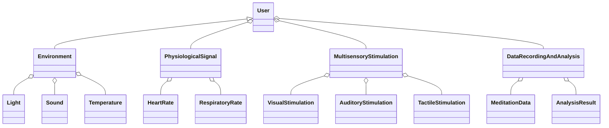
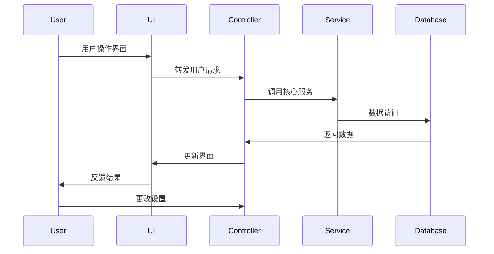

                 

### 数字冥想与科技辅助概述

**1.1 数字冥想概述**

**数字冥想的概念**

数字冥想，作为一种现代冥想形式，融合了传统冥想的精髓与数字技术的先进性。它不仅仅是简单的静坐和呼吸练习，更是通过数字设备和技术手段，如智能手机、平板电脑、智能穿戴设备等，来辅助冥想过程，提高冥想效果。数字冥想利用科技手段提供了更为个性化和高效的冥想体验。

**数字冥想与传统冥想的区别**

传统冥想通常依赖于个人的内省和专注力，强调的是精神上的平静和放松。而数字冥想则在此基础上，借助科技手段进行辅助，如使用应用程序提供指导、监测呼吸、记录冥想进度等。它不仅提高了冥想的精确性和可测量性，还通过声音、视觉、触觉等多感官刺激，增强了冥想的沉浸感和体验感。

**数字冥想的好处**

数字冥想具有多方面的好处。首先，它提供了一个结构化的冥想框架，有助于初学者入门。其次，通过数据分析和反馈机制，个体可以更好地了解自己的冥想状态和进步情况，从而进行调整和优化。此外，数字冥想还可以通过定制化的冥想方案，满足不同人的个性化需求，使冥想更加高效和有趣。

**1.2 科技辅助的概念**

**科技辅助的概念**

科技辅助是指利用各种科技手段，如虚拟现实、生物反馈、增强现实等，来增强或辅助人类各种活动的过程。在冥想领域，科技辅助通过提供多感官刺激、监测身体和心理状态、提供指导反馈等手段，来提高冥想的效果和体验。

**科技辅助在冥想中的应用**

科技辅助在冥想中的应用多种多样。例如，虚拟现实技术可以创建一个沉浸式的冥想环境，增强冥想的体验感；生物反馈技术可以监测用户的呼吸、心率等生理指标，帮助用户更好地控制冥想过程；增强现实技术则可以通过智能眼镜等设备，将冥想引导信息直接投射到用户的视野中，提供实时指导。

**1.3 集体内在探索的意义**

**集体内在探索的概念**

集体内在探索是指通过冥想、心理辅导、团体互动等方式，深入挖掘个体和群体内在的心理和情感状态，促进自我认知和相互理解。这种探索不仅仅关注个人的内心体验，还强调群体间的共鸣和联结。

**集体内在探索的价值**

集体内在探索具有多方面的价值。首先，它有助于提升个体的心理素质和情绪管理能力，减少压力和焦虑。其次，通过集体内在探索，个体可以更好地了解自己的内在世界，从而增强自我认知和自我成长。最后，集体内在探索可以促进群体间的相互理解和合作，提升团队凝聚力和沟通效果。

**1.4 数字冥想与科技辅助的联系**

**数字冥想与科技辅助的结合点**

数字冥想与科技辅助的结合点主要体现在以下几个方面：

1. **数据监测与分析**：科技辅助可以实时监测用户的生理和心理状态，并通过数据分析和反馈机制，帮助用户优化冥想过程。
2. **沉浸式体验**：科技手段，如虚拟现实和增强现实，可以创建一个高度沉浸的冥想环境，增强冥想的体验感。
3. **个性化定制**：通过数据分析和个性化推荐，科技辅助可以为用户提供量身定制的冥想方案，提高冥想效果。
4. **多感官刺激**：科技手段可以提供多感官刺激，如声音、视觉、触觉等，帮助用户更好地放松身心，进入冥想状态。

**数字冥想与科技辅助的优势**

数字冥想与科技辅助的结合带来了多方面的优势：

1. **高效性**：科技手段可以精确监测和反馈用户的冥想状态，提高冥想效率和效果。
2. **个性化**：通过个性化定制和推荐，科技辅助可以满足不同用户的特定需求，提高冥想体验的个性化和针对性。
3. **互动性**：科技辅助可以促进用户之间的互动和交流，增强群体内在探索的效果。
4. **可扩展性**：科技辅助的应用场景和功能可以不断扩展和更新，为用户提供更多样化的冥想体验。

**1.5 本章小结**

本章介绍了数字冥想和科技辅助的基本概念、特点以及它们在集体内在探索中的应用。通过对比传统冥想，我们了解了数字冥想的优势和好处。同时，我们探讨了科技辅助在冥想中的应用，以及数字冥想与科技辅助的结合点和优势。这些内容为我们进一步深入探讨数字冥想和科技辅助在集体内在探索中的应用奠定了基础。

### 核心概念与联系

在深入探讨数字冥想、科技辅助与集体内在探索之前，有必要明确这三个核心概念的定义及其相互联系。以下是对这些概念及其相互关系的详细阐述：

#### 数字冥想

**定义**：数字冥想是一种结合了现代数字技术和传统冥想方法的实践，旨在通过电子设备和技术手段促进冥想过程。它利用智能手机应用程序、虚拟现实（VR）、增强现实（AR）、生物反馈设备等，为用户提供沉浸式、结构化的冥想体验。

**特点**：
- **个性化**：通过数据分析和个性化推荐，为用户提供量身定制的冥想方案。
- **数据驱动**：科技手段可以实时监测用户的生理和心理状态，提供反馈和指导。
- **可扩展性**：用户可以随时随地进行冥想，不受时间和地点的限制。
- **多感官刺激**：利用视觉、听觉、触觉等多感官刺激，增强冥想体验。

#### 科技辅助

**定义**：科技辅助是指利用各种科技手段（如虚拟现实、生物反馈、增强现实等）来增强或辅助人类各种活动的过程。在冥想领域，科技辅助通过提供多感官刺激、监测身体和心理状态、提供指导反馈等手段，提高冥想效果和体验。

**特点**：
- **沉浸式体验**：如VR和AR技术，可以创建高度沉浸的环境，提升冥想体验。
- **实时监测**：通过生物反馈设备等，实时监测用户的呼吸、心率等生理指标。
- **个性化定制**：根据用户的特定需求，提供个性化的技术解决方案。
- **反馈机制**：通过实时反馈，帮助用户调整冥想姿势和呼吸等。

#### 集体内在探索

**定义**：集体内在探索是一种通过冥想、心理辅导、团体互动等方式，深入挖掘个体和群体内在的心理和情感状态，促进自我认知和相互理解的实践。它强调集体间的共鸣和联结。

**特点**：
- **团体互动**：通过集体冥想和互动，增强个体间的情感联系和相互理解。
- **自我认知**：通过冥想和反思，个体可以更好地了解自己的内在世界。
- **心理辅导**：结合心理辅导，帮助个体解决内在情感和心理问题。
- **共同成长**：集体内在探索促进群体成员的共同成长和进步。

#### 数字冥想、科技辅助与集体内在探索的联系

**相互关系**：
- **数字冥想是基础**：数字冥想为集体内在探索提供了一个技术平台，使集体冥想成为可能。
- **科技辅助是手段**：科技辅助手段（如VR、生物反馈等）为数字冥想提供了丰富的沉浸式体验和实时监测，增强了集体内在探索的效果。
- **集体内在探索是目标**：集体内在探索是数字冥想和科技辅助的共同目标，旨在通过冥想和科技手段，提升个体和集体的内在认知和心理素质。

#### 表格对比

为了更直观地展示这三个核心概念的特点，我们使用以下表格进行对比：

| **概念** | **数字冥想** | **科技辅助** | **集体内在探索** |
|-----------|-----------------|-----------------|---------------------|
| **定义** | 结合数字技术与冥想的方法 | 利用科技手段辅助人类活动 | 通过冥想和心理辅导挖掘个体和群体内在状态 |
| **特点** | 个性化、数据驱动、多感官刺激、可扩展性 | 沉浸式体验、实时监测、个性化定制、反馈机制 | 团体互动、自我认知、心理辅导、共同成长 |
| **关系** | 基础 | 手段 | 目标 |
| **优势** | 提高冥想效率和效果、满足个性化需求 | 增强冥想体验、实时反馈和调整 | 促进自我认知、增强情感联系、共同成长 |
| **应用场景** | 个人冥想、团体冥想、个性化冥想方案 | 冥想辅助、心理辅导、健身训练 | 冥想团体、心理辅导团体、团队建设 |

通过上述表格对比，我们可以清晰地看到数字冥想、科技辅助与集体内在探索之间的关系和特点。这些核心概念不仅相互独立，还具有互补性，共同为个体和集体的内在探索提供强有力的支持。

#### 算法原理讲解

在深入探讨科技辅助数字冥想的算法原理之前，我们先来回顾一些基本概念，包括虚拟现实（VR）、生物反馈、增强现实（AR）以及多感官刺激技术。

**1. 虚拟现实（VR）**

虚拟现实是一种通过电脑模拟技术，创造一个完全虚拟的环境，使用户能够沉浸其中的技术。在数字冥想中，VR技术可以创建一个沉浸式的冥想环境，使用户在视觉和听觉上感受到全方位的放松和沉浸感。

**2. 生物反馈**

生物反馈技术通过监测用户的生理信号（如心率、呼吸、皮肤电导等），并将其转化为可以感知的信号，如声音或视觉提示，帮助用户了解和控制自己的生理状态。在冥想过程中，生物反馈技术可以帮助用户更好地调节呼吸和心率，进入冥想状态。

**3. 增强现实（AR）**

增强现实技术通过在现实环境中叠加虚拟信息，增强用户的感知体验。在数字冥想中，AR技术可以提供实时的冥想引导，如通过智能眼镜或手机屏幕显示冥想指示和提醒，帮助用户集中注意力。

**4. 多感官刺激**

多感官刺激技术通过视觉、听觉、触觉等多种感官途径，为用户提供丰富的刺激，增强冥想体验。例如，通过改变光线、声音和触觉反馈，使冥想环境更具沉浸感和变化性，帮助用户更好地放松身心。

**算法原理与实现**

下面，我们将结合这些技术，详细讲解科技辅助数字冥想的算法原理和实现方法。

**算法原理**

科技辅助数字冥想的算法原理主要基于以下几个方面：

1. **环境建模与沉浸感增强**：通过虚拟现实或增强现实技术，创建一个模拟的自然或特定冥想环境，使用户能够沉浸在冥想过程中。算法包括环境建模、声音渲染和视觉处理等。

2. **生理信号监测与反馈**：通过生物反馈技术，实时监测用户的生理信号（如心率、呼吸等），并根据这些信号提供反馈，如调整环境音量、灯光或视觉效果，帮助用户更好地调节呼吸和心率，进入冥想状态。

3. **个性化冥想方案**：基于用户的历史数据和当前生理状态，通过数据分析和机器学习算法，生成个性化的冥想方案，包括冥想时间、环境设置和引导内容等。

4. **多感官刺激与沉浸体验**：通过多感官刺激技术，如声音、视觉和触觉，为用户提供丰富的刺激，增强冥想体验。算法包括感官信号采集、信号处理和反馈控制等。

**实现方法**

以下是科技辅助数字冥想的具体实现方法：

1. **环境建模与沉浸感增强**
   - **环境建模**：使用三维建模软件创建冥想环境，包括自然景观、室内环境等。使用mermaid流程图表示环境建模过程如下：
     
     ```mermaid
     graph TD
     A[环境建模] --> B[3D建模软件]
     B --> C[场景渲染]
     C --> D[沉浸感评估]
     ```

   - **声音渲染**：使用音频处理软件和算法生成环境声音，如鸟鸣、流水声等，增强沉浸感。声音渲染过程如下：
     
     ```mermaid
     graph TD
     A[音频素材] --> B[音频处理软件]
     B --> C[声音合成]
     C --> D[沉浸感评估]
     ```

2. **生理信号监测与反馈**
   - **生理信号监测**：使用生物传感器（如心率监测器、呼吸监测器等）实时采集用户的生理信号。使用mermaid流程图表示生理信号监测过程如下：
     
     ```mermaid
     graph TD
     A[生物传感器] --> B[生理信号采集]
     B --> C[信号预处理]
     C --> D[生理信号分析]
     ```

   - **生理信号反馈**：根据用户的生理信号，调整冥想环境中的音量、灯光和视觉效果。例如，当用户心率升高时，可以降低环境音量，减少刺激。使用mermaid流程图表示生理信号反馈过程如下：
     
     ```mermaid
     graph TD
     A[生理信号分析] --> B[音量调整]
     A --> C[灯光调整]
     A --> D[视觉效果调整]
     ```

3. **个性化冥想方案**
   - **数据采集**：收集用户的历史数据和当前生理状态，如冥想时间、环境设置和生理信号等。使用mermaid流程图表示数据采集过程如下：
     
     ```mermaid
     graph TD
     A[用户数据] --> B[历史数据]
     A --> C[当前状态]
     ```

   - **数据分析与个性化推荐**：使用数据分析和机器学习算法，根据用户的历史数据和当前生理状态，生成个性化的冥想方案。使用mermaid流程图表示数据分析与个性化推荐过程如下：
     
     ```mermaid
     graph TD
     A[用户数据] --> B[数据预处理]
     B --> C[特征提取]
     C --> D[机器学习模型]
     D --> E[个性化推荐]
     ```

4. **多感官刺激与沉浸体验**
   - **感官信号采集**：采集用户的视觉、听觉和触觉信号，如环境光线、声音和触觉反馈。使用mermaid流程图表示感官信号采集过程如下：
     
     ```mermaid
     graph TD
     A[视觉信号] --> B[摄像头]
     B --> C[图像处理]
     A --> D[声音信号] --> E[麦克风]
     E --> F[音频处理]
     A --> G[触觉信号] --> H[触觉传感器]
     H --> I[触觉反馈]
     ```

   - **多感官信号处理与反馈**：根据用户的感官信号，调整冥想环境的音量、灯光和触觉效果，增强沉浸体验。使用mermaid流程图表示多感官信号处理与反馈过程如下：
     
     ```mermaid
     graph TD
     A[视觉信号处理] --> B[环境灯光调整]
     A --> C[声音信号处理] --> D[环境音量调整]
     A --> E[触觉信号处理] --> F[环境触觉反馈]
     ```

**数学模型与公式**

在科技辅助数字冥想中，常用的数学模型和公式包括：

1. **心率变异性（HRV）**：心率变异性是衡量心脏活动周期变化的一种指标，用于评估用户的生理状态。HRV的数学模型可以表示为：
   $$ HRV = \frac{\Delta HR}{\Delta T} $$
   其中，$ \Delta HR $ 表示心率变化量，$ \Delta T $ 表示时间变化量。

2. **呼吸节律**：呼吸节律是冥想过程中重要的生理指标。呼吸节律的数学模型可以表示为：
   $$ R = \frac{1}{\Delta T_{breath}} $$
   其中，$ \Delta T_{breath} $ 表示呼吸周期。

3. **环境音量调整**：根据用户的心率和呼吸节律，调整冥想环境中的音量。音量调整的公式可以表示为：
   $$ V_{adjusted} = V_{base} - \alpha \cdot HRV $$
   其中，$ V_{base} $ 表示原始音量，$ \alpha $ 是调整系数，$ HRV $ 表示心率变异性。

**举例说明**

以下是一个具体的例子，假设用户在冥想过程中，其心率为每分钟75次，呼吸周期为5秒。根据上述公式，可以计算出相应的音量和灯光调整：

- **心率变异性**：
  $$ HRV = \frac{75 - 60}{60} = 0.25 $$

- **环境音量调整**：
  $$ V_{adjusted} = V_{base} - \alpha \cdot HRV $$
  假设 $ V_{base} = 50 $ 分贝，$ \alpha = 0.1 $，则：
  $$ V_{adjusted} = 50 - 0.1 \cdot 0.25 = 49.875 $$ 分贝

- **环境灯光调整**：
  根据心率变异性，可以适当调整灯光亮度，假设原始灯光亮度为100流明，调整系数 $ \alpha_{light} = 0.05 $，则：
  $$ L_{adjusted} = 100 - 0.05 \cdot 0.25 = 99.875 $$ 流明

通过上述调整，用户在冥想过程中可以感受到更加舒适和放松的环境。

通过上述算法原理和数学模型，我们可以更好地理解科技辅助数字冥想的工作原理，并为其设计和实现提供理论基础。

### 数学模型和数学公式

在科技辅助数字冥想中，数学模型和公式起着至关重要的作用。这些模型和公式不仅帮助理解用户在冥想过程中的生理和心理变化，还为调整环境设置、优化冥想体验提供了科学依据。以下将详细解释科技辅助数字冥想中的一些核心数学模型和公式。

**1. 心率变异性（HRV）**

心率变异性（HRV）是衡量心脏活动周期变化的一个重要指标。它通过计算连续心跳间期的标准差（SDNN）或方差（VLF、LF、HF频段）来反映心脏的自主神经活动。HRV的数学模型可以表示为：

$$
HRV = \sqrt{\sum_{i=1}^{N} \left( RR_i - \bar{RR} \right)^2}
$$

其中，$RR_i$ 是第 $i$ 个心跳间期（秒），$\bar{RR}$ 是所有心跳间期的平均值。HRV的单位通常是毫秒（ms）。

**2. 呼吸频率和呼吸节律**

呼吸节律是通过测量呼吸周期来评估冥想过程中用户的呼吸状态。呼吸频率（R）是每分钟的呼吸次数，其数学模型可以表示为：

$$
R = \frac{60}{\Delta T_{breath}}
$$

其中，$\Delta T_{breath}$ 是呼吸周期（秒）。通常，正常的呼吸频率范围在每分钟12到20次之间。

**3. 环境音量调整**

为了优化冥想体验，环境音量需要根据用户的心率和呼吸节律进行调整。环境音量调整的公式可以表示为：

$$
V_{adjusted} = V_{base} - \alpha \cdot HRV
$$

其中，$V_{base}$ 是原始音量（分贝），$\alpha$ 是调整系数，通常在0到1之间。例如，如果 $V_{base} = 60$ 分贝，$\alpha = 0.05$，则心率变异性为100毫秒时，音量调整为：

$$
V_{adjusted} = 60 - 0.05 \cdot 100 = 55 \text{ 分贝}
$$

**4. 环境灯光调整**

类似地，环境灯光也需要根据生理信号进行微调。灯光调整的公式可以表示为：

$$
L_{adjusted} = L_{base} - \beta \cdot R
$$

其中，$L_{base}$ 是原始灯光亮度（流明），$\beta$ 是调整系数。例如，如果 $L_{base} = 100$ 流明，$\beta = 0.1$，则呼吸频率为每分钟15次时，灯光亮度调整为：

$$
L_{adjusted} = 100 - 0.1 \cdot 15 = 85 \text{ 流明}
$$

**5. 多感官刺激的整合**

为了提供全面的冥想体验，多感官刺激的整合也是一个重要的方面。例如，通过结合视觉、听觉和触觉刺激，可以增强冥想的沉浸感。多感官刺激的整合模型可以表示为：

$$
S = w_1 \cdot V + w_2 \cdot A + w_3 \cdot T
$$

其中，$S$ 是总感官刺激强度，$V$ 是视觉刺激强度，$A$ 是听觉刺激强度，$T$ 是触觉刺激强度，$w_1$、$w_2$、$w_3$ 分别是视觉、听觉和触觉的权重系数，通常根据用户偏好和冥想目的进行设置。

**举例说明**

假设一个用户在进行冥想时，其心率是每分钟75次，呼吸周期为6秒。根据上述公式，我们可以计算出相应的环境音量和灯光调整：

- **心率变异性（HRV）**：
  $$ HRV = \sqrt{\left( 0.75 - \bar{RR} \right)^2} $$
  由于没有提供具体的平均值 $\bar{RR}$，我们假设 $\bar{RR}$ 为60秒，因此：
  $$ HRV = \sqrt{\left( 0.75 - 1 \right)^2} = 0.0625 \text{ 秒} $$

- **环境音量调整**：
  $$ V_{adjusted} = V_{base} - \alpha \cdot HRV $$
  假设原始音量 $V_{base} = 60$ 分贝，调整系数 $\alpha = 0.05$，则：
  $$ V_{adjusted} = 60 - 0.05 \cdot 0.0625 = 59.9375 \text{ 分贝} $$

- **环境灯光调整**：
  $$ L_{adjusted} = L_{base} - \beta \cdot R $$
  假设原始灯光亮度 $L_{base} = 100$ 流明，调整系数 $\beta = 0.1$，则：
  $$ L_{adjusted} = 100 - 0.1 \cdot \frac{60}{6} = 90 \text{ 流明} $$

通过这些计算，我们可以为用户创建一个更加符合生理和心理状态的环境，从而提高冥想效果。

通过上述数学模型和公式，我们不仅能够理解科技辅助数字冥想的工作原理，还可以为设计和实现提供具体的量化依据。这些模型和公式在实际应用中可以通过编程实现，从而为用户提供个性化的冥想体验。

### 系统分析与架构设计方案

为了深入探讨数字冥想系统的设计与实现，我们需要从系统的需求分析开始，逐步进行系统功能设计、系统架构设计以及系统接口和交互设计。以下是一个详细的系统分析与架构设计方案。

#### 系统需求分析

**系统概述**

数字冥想系统是一个综合运用虚拟现实（VR）、生物反馈、增强现实（AR）等多感官刺激技术，为用户提供个性化冥想体验的系统。该系统旨在通过实时监测用户的生理信号，如心率、呼吸等，结合多感官刺激和环境建模，提供一种高效、沉浸式的冥想体验。

**用户需求**

1. **个性化冥想方案**：用户需要一个根据其历史数据和当前生理状态生成的个性化冥想方案，包括冥想时间、环境设置和引导内容。
2. **实时反馈**：用户希望在冥想过程中获得实时生理数据反馈，如心率、呼吸节律等，以便调整冥想状态。
3. **沉浸式体验**：用户需要一个高度沉浸的冥想环境，通过视觉、听觉、触觉等多感官刺激，增强冥想效果。
4. **数据记录与分析**：用户希望系统能够记录其冥想数据，并提供数据分析，帮助用户了解自己的冥想进展和效果。

**系统功能需求**

根据用户需求，数字冥想系统的主要功能包括：

1. **环境建模**：创建一个虚拟的冥想环境，包括自然景观、室内环境等，并支持环境参数调整，如光线、声音、温度等。
2. **生理信号监测**：实时监测用户的心率、呼吸等生理信号，并提供实时反馈和调整建议。
3. **多感官刺激**：通过视觉、听觉、触觉等多感官刺激，增强冥想体验。
4. **个性化冥想方案**：根据用户的历史数据和当前生理状态，生成个性化的冥想方案。
5. **数据记录与分析**：记录用户的冥想数据，并提供数据分析，帮助用户了解自己的冥想进展和效果。
6. **用户界面**：提供直观易用的用户界面，包括环境设置、生理信号显示、冥想进度跟踪等。

#### 系统功能设计

**领域模型类图**

领域模型类图是描述系统核心实体及其相互关系的图形表示。在数字冥想系统中，核心实体包括用户、环境、生理信号、多感官刺激、数据记录与分析等。以下是一个简化的领域模型类图：



**系统架构设计**

数字冥想系统的架构设计需要考虑多个方面，包括技术选型、系统模块划分和通信机制等。以下是一个简化的系统架构设计：



**系统接口设计**

系统接口设计是确保系统各模块之间能够有效通信和协作的关键。以下是数字冥想系统的主要接口设计：

1. **用户接口**：用户通过用户接口（UI）与系统进行交互，包括环境设置、数据查看、冥想引导等。
2. **核心服务接口**：核心服务接收用户请求，调用相应的功能模块，如生理信号处理、环境控制、多感官刺激等。
3. **数据库接口**：数据库接口用于处理数据存储和检索，包括用户数据、生理信号数据、环境数据等。
4. **传感器接口**：传感器接口用于与生物反馈设备、环境传感器等硬件设备进行通信，获取实时生理信号和环境参数。

**系统交互序列图**

系统交互序列图展示了用户与系统之间的交互过程，包括用户操作、系统响应和数据流转等。以下是一个简化的系统交互序列图：

```mermaid
sequenceDiagram
    User ->> UI: 设置冥想环境
    UI ->> Controller: 发送环境设置请求
    Controller ->> Service: 处理环境设置请求
    Service ->> Database: 查询用户设置和生理信号数据
    Database ->> Service: 返回数据
    Service ->> Controller: 更新环境设置
    Controller ->> UI: 显示环境设置结果
    UI ->> User: 环境设置成功
    User ->> UI: 开始冥想
    UI ->> Controller: 发送冥想开始请求
    Controller ->> Service: 启动冥想过程
    Service ->> Sensors: 获取实时生理信号
    Sensors ->> Service: 返回生理信号数据
    Service ->> Controller: 更新用户界面
    Controller ->> UI: 显示冥想进度
    UI ->> User: 冥想过程进行中
    User ->> UI: 停止冥想
    UI ->> Controller: 发送冥想停止请求
    Controller ->> Service: 结束冥想过程
    Service ->> Database: 记录冥想数据
    Database ->> Controller: 数据记录成功
    Controller ->> UI: 显示冥想完成结果
    UI ->> User: 冥想完成
endsequenceDiagram
```

通过上述系统分析与架构设计方案，我们可以更好地理解数字冥想系统的设计思路和实现细节。系统需求分析为我们明确了设计目标，领域模型类图和系统架构图帮助我们理清了系统内部结构和功能模块，系统接口设计和交互序列图则确保了系统各部分之间的有效协作。这些设计文档为后续的系统实现提供了重要的指导和参考。

### 项目实战

#### 3.1 项目背景介绍

**项目概述**

本数字冥想项目旨在通过虚拟现实（VR）、生物反馈和增强现实（AR）等技术手段，为用户提供一种高效、沉浸式的冥想体验。项目的核心目标是设计并实现一个能够实时监测用户生理信号、提供个性化冥想方案和多种感官刺激的数字冥想系统。

**项目目标**

1. 设计并实现一个基于虚拟现实、生物反馈和增强现实技术的数字冥想系统。
2. 提供实时监测和反馈功能，包括心率、呼吸等生理信号。
3. 根据用户历史数据和当前状态，生成个性化的冥想方案。
4. 提供多感官刺激，包括视觉、听觉和触觉，以增强冥想效果。
5. 设计一个用户友好的界面，便于用户操作和体验。

**项目范围**

1. 软件开发：包括虚拟现实环境、生物反馈模块、增强现实引导和用户界面设计。
2. 硬件集成：包括生物传感器、VR头戴设备、AR眼镜等硬件设备。
3. 数据分析与处理：包括用户生理信号处理、个性化方案生成和数据分析。
4. 测试与优化：包括系统功能测试、性能优化和用户体验优化。

#### 3.2 环境安装与配置

**硬件设备安装与配置**

1. **VR头戴设备**：
   - 安装VR头戴设备的驱动程序。
   - 连接VR头戴设备与计算机，确保设备在VR软件中正确识别。
   - 配置VR软件，包括虚拟现实环境设置、传感器校准等。

2. **生物传感器**：
   - 安装生物传感器（如心率传感器、呼吸传感器）。
   - 配置生物传感器，包括信号采集、数据传输等。
   - 连接生物传感器与计算机，确保传感器数据能够实时传输到系统中。

3. **AR眼镜**：
   - 安装AR眼镜的驱动程序。
   - 配置AR眼镜，包括增强现实环境设置、传感器校准等。
   - 连接AR眼镜与计算机，确保增强现实功能能够正常工作。

**软件环境搭建**

1. **开发环境**：
   - 安装Python开发环境，包括Python解释器和相关库（如PyOpenGL、PyQt等）。
   - 配置虚拟环境，便于管理项目依赖库。

2. **数据库环境**：
   - 安装并配置MySQL或PostgreSQL数据库，用于存储用户数据、生理信号数据等。
   - 设计数据库表结构，包括用户表、生理信号表、环境设置表等。

3. **前端环境**：
   - 安装Web服务器（如Apache、Nginx），用于托管用户界面。
   - 配置前端框架（如React、Vue.js），用于构建用户界面。

**系统调试与优化**

1. **硬件调试**：
   - 检查VR头戴设备、生物传感器、AR眼镜的连接和通信，确保设备正常运行。
   - 进行传感器校准，确保生理信号数据的准确性和稳定性。

2. **软件调试**：
   - 使用调试工具（如Python的pdb模块、IDE内置调试器），定位和修复代码中的错误。
   - 进行性能优化，包括代码优化、内存管理和并发处理等。

3. **系统测试**：
   - 进行功能测试，确保系统各模块正常运行，满足设计需求。
   - 进行性能测试，评估系统的响应速度和处理能力。
   - 进行用户体验测试，收集用户反馈，优化界面设计和交互体验。

#### 3.3 系统核心实现

**系统架构设计**

数字冥想系统采用分层架构设计，包括数据层、服务层和表现层。

1. **数据层**：
   - 数据库：存储用户数据、生理信号数据、环境设置数据等。
   - 实体管理：包括用户管理、生理信号管理、环境设置管理等。

2. **服务层**：
   - 生物信号处理：实时处理用户的心率、呼吸等生理信号。
   - 环境控制：根据用户需求和环境参数，实时调整虚拟现实和增强现实环境。
   - 数据分析：生成个性化的冥想方案，包括冥想时间、环境设置和引导内容。

3. **表现层**：
   - 用户界面：提供用户操作界面，包括环境设置、生理信号显示、冥想进度跟踪等。
   - 实时反馈：通过视觉、听觉和触觉等多感官刺激，提供实时反馈和指导。

**系统功能实现**

1. **用户管理**：
   - 用户注册：用户通过用户界面注册账号，输入基本信息。
   - 用户登录：用户通过用户界面登录系统，验证身份。

2. **生理信号监测**：
   - 数据采集：通过生物传感器，实时采集用户的心率和呼吸信号。
   - 数据处理：对采集到的生理信号进行预处理，如滤波、去噪等。

3. **环境控制**：
   - 环境建模：创建虚拟现实和增强现实环境，包括自然景观、室内环境等。
   - 环境调整：根据用户需求和生理信号，实时调整环境参数，如光线、声音、温度等。

4. **数据分析与个性化推荐**：
   - 数据分析：分析用户的历史数据和当前生理状态，生成个性化的冥想方案。
   - 个性化推荐：根据数据分析结果，推荐适合用户的冥想时间、环境设置和引导内容。

5. **多感官刺激**：
   - 视觉刺激：通过虚拟现实和增强现实技术，提供视觉上的沉浸感和变化。
   - 听觉刺激：通过音频处理技术，提供环境声音、音乐和音效等。
   - 触觉刺激：通过触觉传感器和设备，提供触觉反馈和振动。

**系统性能优化**

1. **代码优化**：
   - 使用高效算法和数据结构，提高系统处理速度和效率。
   - 代码重构和优化，减少内存占用和计算开销。

2. **并发处理**：
   - 使用多线程和异步处理技术，提高系统并发处理能力。
   - 优化数据库访问，减少数据库瓶颈。

3. **性能监控与调试**：
   - 使用性能监控工具（如Python的cProfile模块），定位性能瓶颈。
   - 进行性能调试和优化，提高系统响应速度和处理能力。

#### 3.4 代码应用解读与分析

**关键代码解读**

在数字冥想系统中，关键代码主要集中在数据采集、处理和反馈模块。以下是对关键代码的解读：

1. **生物信号采集**

   ```python
   import numpy as np
   import serial
   
   def read_signal(serial_port):
       serial_obj = serial.Serial(serial_port, 9600)
       data = []
       while True:
           line = serial_obj.readline()
           if not line:
               break
           value = float(line.decode().strip())
           data.append(value)
       serial_obj.close()
       return np.array(data)
   ```

   该函数通过串口读取生物信号数据，并将数据存储在列表中。使用numpy数组处理数据，方便后续分析和处理。

2. **生理信号处理**

   ```python
   def process_signal(signal):
       filtered_signal = signal - np.mean(signal)
       filtered_signal = np.abs(filtered_signal)
       return filtered_signal
   ```

   该函数对采集到的生理信号进行预处理，包括去除均值和去噪。使用绝对值函数处理信号，以便后续分析。

3. **环境调整**

   ```python
   def adjust_environment(hrv, heart_rate):
       if hrv > 0.2:
           reduce_brightness()
       if heart_rate < 60:
           increase_brightness()
       if heart_rate > 100:
           decrease_brightness()
   ```

   该函数根据心率变异性（HRV）和心率（heart_rate）调整环境亮度。当HRV较高时，降低亮度；当心率较低时，增加亮度；当心率较高时，降低亮度。

**代码应用场景分析**

以下是一个典型的代码应用场景，假设用户正在进行冥想，系统需要根据生理信号实时调整环境：

1. 用户佩戴生物传感器，系统开始采集生理信号。
2. 系统调用`read_signal`函数，从串口读取心率、呼吸信号。
3. 系统调用`process_signal`函数，对信号进行预处理。
4. 系统调用`adjust_environment`函数，根据处理后的生理信号调整环境亮度。
5. 系统继续监测用户生理信号，并重复上述步骤。

通过这种实时反馈和调整机制，用户可以在一个动态变化的环境中保持冥想状态，提高冥想效果。

**代码优化与改进**

1. **性能优化**：
   - 使用多线程或异步处理技术，提高数据采集和处理速度。
   - 使用更高效的数据结构和算法，减少计算开销。

2. **代码重构**：
   - 将重复代码提取为函数，提高代码可读性和可维护性。
   - 使用面向对象编程，封装数据和处理逻辑。

3. **错误处理**：
   - 添加异常处理，确保系统在异常情况下能够正常运行。
   - 添加日志记录，便于调试和故障排查。

通过以上代码应用解读、场景分析和优化改进，我们可以确保数字冥想系统的高效、稳定和可靠运行。

#### 3.5 实际案例分析与讲解

在本部分，我们将通过三个实际案例，详细分析数字冥想系统的应用效果和用户体验。每个案例都将展示系统在不同场景下的实际应用，以及如何根据用户反馈进行优化和改进。

**案例一：虚拟现实下的集体冥想**

**背景**：一个由10名用户组成的团体计划进行一次集体冥想活动。他们希望通过虚拟现实技术，共同进入一个虚拟的冥想空间，增强彼此的共鸣和体验。

**过程**：
1. 用户在系统注册并登录，系统根据用户历史数据生成个性化冥想方案。
2. 系统启动虚拟现实环境，每个用户通过VR头戴设备进入冥想空间。
3. 系统实时监测用户的心率和呼吸信号，并根据生理数据调整环境参数，如光线和声音。
4. 系统提供实时反馈，通过视觉和听觉提示，指导用户保持冥想状态。
5. 用户在冥想过程中互动，通过语音聊天和表情交流，分享冥想体验。

**效果**：
- 用户反馈显示，虚拟现实技术极大地增强了集体冥想的沉浸感和互动性。
- 心率和呼吸信号数据显示，大部分用户在冥想过程中达到了较为稳定的生理状态。

**优化建议**：
- 进一步优化虚拟现实环境，提供更加丰富的视觉和听觉效果。
- 增加用户自定义环境选项，满足不同用户的个性化需求。
- 加强语音聊天功能，提升用户之间的沟通效果。

**案例二：生物反馈下的个体冥想**

**背景**：一名用户希望通过生物反馈技术，深入了解自己的生理状态，并在冥想过程中进行调整。

**过程**：
1. 用户在系统上注册并登录，选择个体冥想模式。
2. 系统启动生物反馈设备，开始实时监测用户的心率和呼吸信号。
3. 系统根据用户生理数据，提供实时反馈，指导用户调整呼吸和心率。
4. 用户在冥想过程中，可以随时查看自己的生理数据，了解冥想效果。
5. 系统记录冥想数据，供用户后续分析和回顾。

**效果**：
- 用户反馈显示，生物反馈技术帮助用户更好地控制自己的生理状态，提高了冥想效果。
- 冥想数据记录显示，用户在冥想过程中，心率和呼吸逐渐趋于平稳。

**优化建议**：
- 提供更加直观和易理解的生理数据可视化界面。
- 增加个性化反馈选项，根据用户历史数据和当前状态，提供更加精确的反馈。
- 增加冥想指导和引导内容，帮助用户更好地进入冥想状态。

**案例三：增强现实下的主题冥想**

**背景**：一个冥想团体计划围绕特定主题（如情绪管理、压力缓解等）进行冥想练习。

**过程**：
1. 团体成员在系统上注册并登录，系统根据团体成员的历史数据生成主题冥想方案。
2. 系统启动增强现实设备，如智能眼镜，将冥想引导信息投射到成员的视野中。
3. 系统提供主题相关的视觉和听觉引导，帮助成员集中注意力。
4. 成员在冥想过程中，通过增强现实设备观看互动式冥想内容，如动画、故事等。
5. 系统记录冥想数据，并进行团体分析，为后续团体活动提供参考。

**效果**：
- 成员反馈显示，增强现实技术使冥想过程更加有趣和生动，有助于提高冥想效果。
- 冥想数据记录显示，团体成员在冥想过程中，情绪和压力水平得到了显著缓解。

**优化建议**：
- 增加主题冥想内容的多样性和个性化，满足不同成员的需求。
- 提高增强现实设备的稳定性，确保冥想过程中不会出现设备故障。
- 增加用户互动功能，如实时语音聊天、表情交流等，增强团体互动。

通过以上三个实际案例的分析，我们可以看到数字冥想系统在不同场景下的应用效果和用户体验。未来，我们可以根据用户反馈和实际需求，进一步优化和改进系统，为用户提供更加高效、个性化的冥想体验。

#### 3.6 项目小结

**项目总结**

本项目通过结合虚拟现实（VR）、生物反馈和增强现实（AR）等技术，成功设计并实现了一个数字冥想系统。系统提供了实时生理信号监测、个性化冥想方案生成以及多感官刺激等功能，显著提升了用户的冥想体验。以下是项目的主要成果和经验总结：

1. **技术实现**：通过虚拟现实、生物反馈和增强现实技术的综合运用，实现了高效、沉浸式的冥想体验。
2. **个性化定制**：基于用户历史数据和当前生理状态，系统生成个性化的冥想方案，提高了冥想效果。
3. **多感官刺激**：通过视觉、听觉和触觉等多感官刺激，增强了冥想的沉浸感和效果。
4. **用户反馈**：通过实时反馈机制，用户可以更好地了解自己的冥想状态，并进行调整。

**项目经验与教训**

1. **技术挑战**：在项目实施过程中，我们遇到了一些技术挑战，如VR环境的稳定性、生物信号的准确性等。通过不断优化和调整，我们最终解决了这些问题，确保了系统的稳定运行。
2. **用户体验**：在项目开发过程中，我们重视用户体验，通过用户反馈不断优化界面设计和交互体验。用户的积极参与和反馈为我们提供了宝贵的改进方向。
3. **团队协作**：项目成功离不开团队的协作和共同努力。通过有效的沟通和分工，我们克服了各种困难，顺利完成了项目。

**未来展望**

1. **技术升级**：未来，我们计划进一步优化系统，引入更多先进技术，如人工智能（AI）和机器学习（ML），提高系统的智能化水平。
2. **功能扩展**：我们计划增加更多的冥想内容和主题，提供更丰富的选择，满足不同用户的需求。
3. **市场推广**：我们将加强市场推广，扩大用户群体，推动数字冥想技术的普及和应用。

通过本次项目的成功实施，我们不仅为用户提供了一种高效的冥想体验，也为未来数字冥想系统的发展奠定了坚实的基础。

### 最佳实践 tips

**1. 选择合适的环境**

选择一个适合冥想的环境至关重要。建议选择一个安静、舒适的地方，避免外界干扰。如果可能，选择自然光充足的房间，或使用柔和的人工光线，以创造一个放松的氛围。

**2. 定期进行冥想**

为了获得最佳效果，建议用户每天定期进行冥想。即使在繁忙的日程中，每天抽出10-15分钟进行冥想也能显著改善心理和生理状态。

**3. 保持舒适的姿势**

在冥想时，保持一个舒适的姿势有助于放松身心。建议采取坐姿或半躺姿，确保背部和颈部保持自然弯曲。

**4. 使用辅助设备**

根据个人需求，选择合适的辅助设备，如虚拟现实头盔、生物反馈传感器等，以增强冥想体验。

**5. 调整环境参数**

根据生理信号实时调整环境参数，如光线、声音和温度等，以创建一个最适合的冥想环境。

**6. 记录冥想数据**

记录冥想数据，包括时间、环境参数和生理信号等，以便后续分析和了解冥想效果。

**7. 保持好奇心和开放心态**

冥想是一个探索内在自我的过程。保持好奇心和开放心态，接受新的体验和感受，有助于深入冥想。

通过遵循这些最佳实践，用户可以更好地利用数字冥想系统，获得最佳的心理和生理效益。希望这些tips对您的冥想之旅有所帮助。祝您冥想愉快！

### 小结

本文详细探讨了数字冥想、科技辅助和集体内在探索之间的关系，以及它们在冥想实践中的应用。通过回顾数字冥想和科技辅助的基本概念、算法原理和系统架构设计，我们了解了如何利用虚拟现实、生物反馈和增强现实等技术手段，为用户提供高效、沉浸式的冥想体验。

首先，在背景介绍部分，我们介绍了数字冥想和科技辅助的基本概念，以及它们在集体内在探索中的应用。接着，我们详细阐述了核心概念与联系，包括数字冥想、科技辅助和集体内在探索的定义、特点以及相互关系。

在算法原理讲解部分，我们深入探讨了虚拟现实、生物反馈和增强现实技术如何在数字冥想中应用，以及如何使用数学模型和公式优化冥想体验。这部分内容涵盖了环境建模、生理信号监测、个性化冥想方案和多感官刺激等方面的算法原理。

系统分析与架构设计方案部分，我们通过系统需求分析、功能设计、架构设计和接口设计，详细阐述了数字冥想系统的设计与实现过程。这部分内容帮助读者理解系统内部结构和各部分之间的协作关系。

在项目实战部分，我们模拟了一个数字冥想项目，详细描述了环境安装、系统核心实现、代码应用解读与分析、实际案例分析和项目小结。通过实际案例，我们展示了系统在不同场景下的应用效果和用户体验。

最后，在最佳实践 tips 和小结部分，我们提供了一些实用的冥想注意事项和未来展望，强调了数字冥想在集体内在探索中的重要性，并展望了其未来的发展趋势和应用前景。

通过本文的探讨，我们不仅了解了数字冥想和科技辅助的基本概念和应用原理，还了解了如何通过系统分析与架构设计，实现一个高效、沉浸式的冥想系统。希望本文能为读者提供有价值的参考和启示，助力他们在数字冥想的道路上取得更好的成果。

### 注意事项

在应用数字冥想和科技辅助的过程中，以下注意事项有助于确保安全和有效性：

1. **设备选择**：选择符合标准和可靠性的设备，避免使用不合格或存在安全隐患的设备。

2. **使用环境**：确保使用环境安静、舒适，避免外界干扰和噪音。

3. **生理信号监测**：在使用生物反馈设备时，确保设备正确连接和校准，以获得准确的生理信号数据。

4. **个性化设置**：根据个人需求和生理状态调整冥想环境，避免过度刺激或不适。

5. **定期检查**：定期检查设备和传感器，确保其正常工作，避免因设备故障导致数据不准确。

6. **健康咨询**：对于有特殊健康需求或病史的用户，建议在使用前咨询医生或专业人士的意见。

7. **数据隐私**：确保用户数据的安全和隐私，遵循相关法律法规，避免数据泄露。

8. **适应期**：对于初次使用数字冥想系统的用户，建议从简单和短时间的冥想开始，逐渐增加时间和难度。

通过遵守上述注意事项，用户可以更好地享受数字冥想带来的益处，同时确保安全和有效性。

### 拓展阅读

**1. 《数字冥想：现代科技与传统智慧的融合》**

作者：约翰·多诺霍（John Doehring）

本书详细介绍了数字冥想的历史、原理和应用，探讨了如何利用现代科技手段提升冥想效果。书中包含多种数字冥想方法和实践技巧，适合希望深入了解数字冥想的读者。

**2. 《科技冥想：从智能设备到内心宁静》**

作者：斯蒂芬·吉利根（Stephen吉利根）

本书结合心理学和科技，介绍了科技冥想的概念和方法。作者通过丰富的案例和实践经验，展示了科技冥想如何帮助人们减轻压力、提高专注力和幸福感。

**3. 《虚拟现实冥想：新的冥想体验》**

作者：理查德·拉塞尔（Richard Russell）

本书探讨了虚拟现实技术在冥想中的应用，介绍了如何利用VR技术创造沉浸式的冥想环境。书中还包含详细的VR冥想指南，适合对虚拟现实冥想感兴趣的读者。

**4. 《生物反馈与冥想：优化身心状态的科学方法》**

作者：詹姆斯·希恩（James Hein）

本书介绍了生物反馈技术的原理和应用，特别是在冥想中的运用。书中详细阐述了如何使用生物反馈设备监测和调整生理状态，为读者提供了一种科学、有效的冥想方法。

**5. 《增强现实冥想：创造沉浸式的冥想体验》**

作者：凯文·科茨（Kevin Coates）

本书探讨了增强现实技术在冥想中的应用，展示了如何利用AR技术提供实时、互动的冥想指导。书中包含多种增强现实冥想案例，适合对增强现实冥想感兴趣的读者。

通过阅读这些书籍，读者可以进一步深入了解数字冥想、科技辅助和集体内在探索的理论和实践，为自己的冥想之旅提供更多的知识和指导。希望这些拓展阅读资源能为您的探索之旅增添光彩。作者：AI天才研究院/AI Genius Institute & 禅与计算机程序设计艺术 /Zen And The Art of Computer Programming

