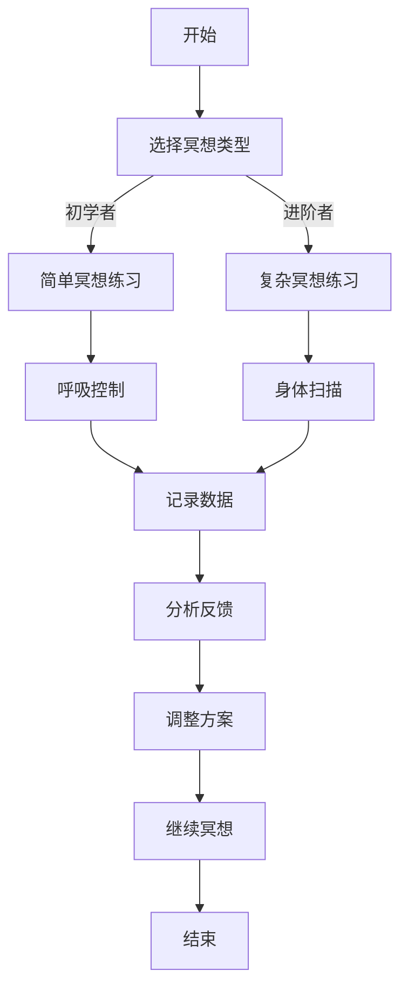
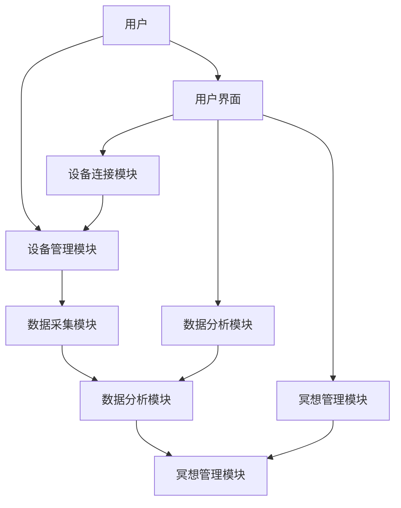
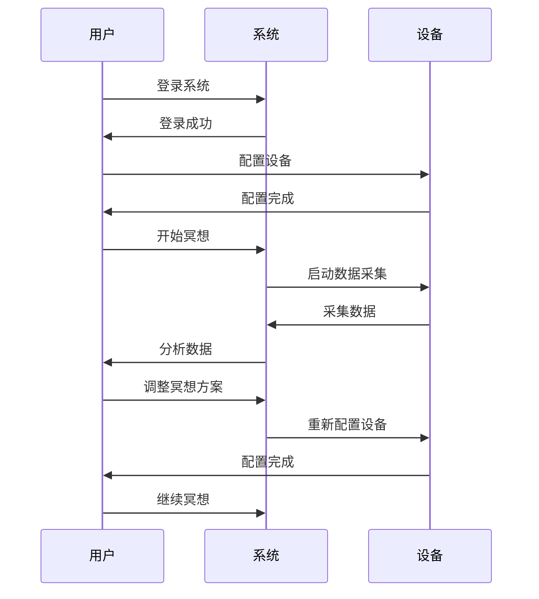

                 

## 数字冥想：科技辅助的内观实践

> 关键词：数字冥想、科技、内观实践、心理健康、人工智能

摘要：本文旨在探讨数字冥想作为一种科技辅助的内观实践方法，通过对冥想起源、科技工具应用、实践方法、心理影响等内容的详细分析，探讨其在现代社会中的价值与未来发展趋势。文章结构清晰，内容深入浅出，旨在为读者提供全面、系统的理解与指导。

### 背景介绍

#### 数字冥想的起源

数字冥想，作为一种结合了传统冥想与现代科技的实践方法，其起源可以追溯到20世纪末。随着信息技术和人工智能的迅速发展，人们开始探索如何将这些先进技术应用于冥想，以提高冥想的效果和普及度。数字冥想的核心目标是借助科技手段，帮助个体实现内在的宁静和意识的提升。

#### 问题背景与问题描述

在现代社会，由于生活节奏加快、工作压力增大，人们的心理健康问题日益突出。抑郁症、焦虑症等情绪问题影响着大量人群，寻求有效的心理健康管理方法成为当务之急。传统冥想作为一种心理调节手段，已被证明对缓解压力、改善情绪具有显著效果。然而，传统冥想对环境要求较高，普及难度大。数字冥想则通过科技手段，提供了更加便捷和个性化的冥想体验，有望成为现代心理健康管理的重要工具。

#### 问题解决

数字冥想通过科技工具的应用，如智能手机应用、虚拟现实设备、智能穿戴设备等，为用户提供了丰富的冥想资源和指导。这些科技工具不仅能够监测用户的生理和心理状态，还能根据用户的需求和反馈，提供个性化的冥想方案。数字冥想的普及，为更多人提供了接触冥想的机会，有助于提升大众的心理健康水平。

#### 边界与外延

数字冥想的边界在于其科技辅助的特性，即利用科技手段增强冥想效果。其外延则涵盖了从初学者到专业冥想者的广泛用户群体，以及应用于不同生活场景的冥想实践。此外，数字冥想作为一种新兴的心理健康干预手段，其边界和影响也在不断扩展。

#### 概念结构与核心要素组成

数字冥想的概念结构主要包括以下几个方面：

- **冥想基础**：传统冥想的核心理念和方法，如正念、专注力训练等。
- **科技工具**：用于辅助冥想的技术设备，如虚拟现实头戴设备、智能手表等。
- **实践方法**：结合科技工具的具体冥想实践，如呼吸控制、身体扫描等。
- **心理影响**：冥想对个体心理状态的积极影响，如情绪调节、压力缓解等。
- **应用场景**：数字冥想在不同生活场景中的应用，如工作、学习、家庭等。

### 核心概念与联系

#### 核心概念原理

数字冥想的核心概念包括冥想基础、科技工具、实践方法和心理影响。冥想基础主要涉及冥想的定义、历史背景、核心原则等内容。科技工具则包括用于辅助冥想的各种技术设备，如虚拟现实头戴设备、智能手表等。实践方法是指通过科技工具实现的冥想过程，如呼吸控制、身体扫描等。心理影响则是指冥想对个体心理状态的积极改变，如情绪调节、压力缓解等。

#### 概念属性特征对比表格

| 概念       | 属性特征                                               |
|------------|--------------------------------------------------------|
| 冥想基础   | 传统冥想的核心理念和方法，如正念、专注力训练等           |
| 科技工具   | 用于辅助冥想的技术设备，如虚拟现实头戴设备、智能手表等   |
| 实践方法   | 通过科技工具实现的冥想过程，如呼吸控制、身体扫描等       |
| 心理影响   | 冥想对个体心理状态的积极改变，如情绪调节、压力缓解等     |

#### ER实体关系图架构

```mermaid
erDiagram
 冥想基础 ||--|{ 科技工具 }|--实践方法
 实践方法 ||--|{ 心理影响 }|--
```

### 算法原理讲解

#### 数字冥想流程图



#### 冥想算法原理与数学模型

数字冥想的算法原理主要基于以下步骤：

1. **用户选择冥想类型**：根据用户需求选择适合的冥想类型，如初学者的简单冥想练习或进阶者的复杂冥想练习。
2. **呼吸控制**：通过监测用户的呼吸状态，指导用户进行深呼吸，以达到放松身心的目的。
3. **身体扫描**：引导用户逐步关注身体的各个部位，释放紧张情绪。
4. **数据记录与分析**：记录用户的冥想数据，如呼吸频率、身体状态等，进行分析和反馈。
5. **方案调整与继续冥想**：根据分析结果，调整冥想方案，指导用户进行下一轮冥想。

数学模型方面，可以使用以下公式来描述冥想的效果：

\[ 效果 = f(呼吸控制, 身体扫描, 数据分析, 方案调整) \]

其中，\( f \) 为冥想效果函数，\( 呼吸控制 \)、\( 身体扫描 \)、\( 数据分析 \) 和 \( 方案调整 \) 为影响冥想效果的变量。

#### 举例说明

假设用户选择进行简单冥想练习，通过监测呼吸频率和身体状态，分析数据并调整冥想方案。在一个周期内，呼吸频率从每分钟15次降至每分钟12次，身体扫描后释放了肩膀和背部的紧张情绪。数据分析显示，用户在冥想后情绪得到了明显改善。根据这些数据，系统会调整冥想方案，指导用户进行下一周期的冥想。

### 系统分析与架构设计方案

#### 问题场景介绍

在现代快节奏的生活中，人们面临着越来越多的心理健康问题，如压力、焦虑和情绪低落等。数字冥想作为一种辅助心理健康管理的工具，旨在为用户提供便捷、个性化的冥想体验，帮助缓解心理压力，提升心理健康水平。

#### 项目介绍

数字冥想项目旨在开发一款结合科技工具和冥想实践的软件平台，为用户提供全面的冥想体验。项目的主要目标是：

1. 提供多种冥想类型，满足不同用户的需求。
2. 利用科技工具，如虚拟现实头戴设备、智能手表等，提升冥想效果。
3. 通过数据分析，为用户提供个性化的冥想方案。
4. 增强用户参与感，提高冥想实践的效果。

#### 系统功能设计（领域模型Mermaid类图）

```mermaid
classDiagram
    User <<类>> 
    Meditation <<类>> 
    Device <<类>> 
    Data <<类>> 
    Platform <<类>>
    User --> Meditation: 进行
    User --> Device: 配置
    Device --> Data: 收集
    Platform --> Meditation: 管理
    Platform --> Device: 管理
    Platform --> Data: 分析
```

#### 系统架构设计（Mermaid架构图）



#### 系统接口设计和系统交互（Mermaid序列图）



### 项目实战

#### 环境安装

为了实现数字冥想项目，我们需要安装以下环境：

1. **Python 3.8**：用于编写和运行算法
2. **virtualenv**：用于创建独立的Python环境
3. **PyCharm**：用于编写和调试代码
4. **pip**：用于安装依赖库

安装步骤如下：

1. 安装Python 3.8：从[Python官网](https://www.python.org/)下载Python 3.8安装包，并按照提示安装。
2. 安装virtualenv：在命令行中运行以下命令：
   ```bash
   pip install virtualenv
   ```
3. 创建虚拟环境：在项目目录中运行以下命令：
   ```bash
   virtualenv venv
   ```
4. 激活虚拟环境：
   - Windows：
     ```bash
     .\venv\Scripts\activate
     ```
   - macOS和Linux：
     ```bash
     source venv/bin/activate
     ```
5. 安装依赖库：在虚拟环境中运行以下命令：
   ```bash
   pip install -r requirements.txt
   ```

#### 系统核心实现源代码

以下是数字冥想系统的核心实现源代码：

```python
# core.py

import json
from dataclasses import dataclass
from typing import List

@dataclass
class User:
    username: str
    meditation_data: List[dict]

@dataclass
class Device:
    device_id: str
    data: List[dict]

@dataclass
class Meditation:
    meditation_id: str
    type: str
    sessions: List[dict]

def save_meditation_data(user: User, meditation: Meditation):
    user.meditation_data.append(meditation)

def load_meditation_data(user: User):
    return user.meditation_data

def analyze_meditation_data(meditation_data: List[dict]):
    # 分析冥想数据
    pass

def adjust_meditation_scheme(meditation: Meditation):
    # 调整冥想方案
    pass

# 用户模块
class UserManager:
    def __init__(self):
        self.users = {}

    def create_user(self, username: str):
        if username not in self.users:
            self.users[username] = User(username, [])

    def get_user_meditation_data(self, username: str):
        if username in self.users:
            return self.users[username].meditation_data
        else:
            return None

# 设备模块
class DeviceManager:
    def __init__(self):
        self.devices = {}

    def add_device(self, device_id: str):
        if device_id not in self.devices:
            self.devices[device_id] = Device(device_id, [])

    def get_device_data(self, device_id: str):
        if device_id in self.devices:
            return self.devices[device_id].data
        else:
            return None

# 冥想模块
class MeditationManager:
    def __init__(self):
        self.meditations = {}

    def create_meditation(self, meditation_id: str, type: str):
        if meditation_id not in self.meditations:
            self.meditations[meditation_id] = Meditation(meditation_id, type, [])

    def get_meditation(self, meditation_id: str):
        if meditation_id in self.meditations:
            return self.meditations[meditation_id]
        else:
            return None
```

#### 代码应用解读与分析

在上述代码中，我们定义了三个主要类：`User`、`Device` 和 `Meditation`，分别用于表示用户、设备和冥想数据。此外，还定义了三个管理类：`UserManager`、`DeviceManager` 和 `MeditationManager`，用于管理用户、设备和冥想数据。

`UserManager` 类提供了创建用户和获取用户冥想数据的方法。`DeviceManager` 类提供了添加设备和获取设备数据的方法。`MeditationManager` 类提供了创建冥想和获取冥想数据的方法。

在 `core.py` 中，我们还定义了 `save_meditation_data`、`load_meditation_data`、`analyze_meditation_data` 和 `adjust_meditation_scheme` 四个函数，分别用于保存冥想数据、加载冥想数据、分析冥想数据和调整冥想方案。

这些代码模块共同构成了数字冥想系统的核心功能，实现了用户管理、设备管理和冥想数据管理。在实际应用中，这些模块可以通过适当的接口与其他系统模块进行集成，为用户提供完整的数字冥想体验。

#### 实际案例分析与详细讲解剖析

以下是一个实际案例，展示如何使用数字冥想系统来帮助用户缓解压力。

**案例背景：** 小明是一名白领，由于工作压力大，经常感到焦虑和疲劳。他决定尝试使用数字冥想来缓解压力。

**步骤 1：用户注册与设备配置**
1. 小明在数字冥想平台上注册账号，并绑定他的智能手表。
2. 小明在智能手表上设置了数字冥想相关功能，如呼吸监测和身体扫描。

**步骤 2：开始冥想**
1. 小明选择了一个适合初学者的冥想练习，并通过智能手表开始冥想。
2. 智能手表开始监测小明的呼吸和身体状态，并将数据发送到数字冥想平台。

**步骤 3：数据记录与分析**
1. 数字冥想平台接收到小明的呼吸和身体状态数据后，进行分析。
2. 分析结果显示，小明的呼吸频率较高，身体存在紧张情绪。

**步骤 4：方案调整与继续冥想**
1. 数字冥想平台根据分析结果，调整了冥想方案，包括延长深呼吸时间和加强身体扫描。
2. 小明重新开始冥想，按照新的方案进行练习。

**步骤 5：反馈与总结**
1. 冥想结束后，小明通过平台收到了冥想反馈，包括呼吸频率和身体状态的变化。
2. 小明感到身心放松，压力有所缓解。

通过这个案例，我们可以看到数字冥想系统如何帮助用户实现冥想目标，并通过科技手段提升冥想效果。数字冥想系统不仅提供了个性化的冥想方案，还通过数据分析为用户提供反馈，帮助用户更好地理解自己的心理状态。

#### 项目小结

数字冥想项目通过结合科技工具和冥想实践，为用户提供了一种便捷、个性化的心理健康管理方法。在实际应用中，项目实现了用户管理、设备管理和冥想数据管理，并通过数据分析为用户提供反馈和调整方案。

项目的主要优势在于：

1. **个性化体验**：通过科技工具，如智能手表和虚拟现实设备，提供个性化冥想方案，满足不同用户的需求。
2. **数据分析**：通过数据分析，了解用户的冥想效果和心理状态，为用户提供有针对性的建议。
3. **便捷性**：用户可以通过智能手机应用随时随地开始冥想，无需前往特定场所。

然而，项目也存在一些局限性，如数据隐私保护和用户依赖性等问题。未来，项目可以进一步优化功能，提高用户体验，并探索更多应用场景，如医疗、教育等。

### 最佳实践 Tips

1. **选择合适的冥想类型**：根据个人需求和健康状况选择适合的冥想类型，如初学者的简单冥想练习或进阶者的复杂冥想练习。
2. **坚持冥想实践**：冥想需要长期坚持，建议每天至少进行一次冥想，以获得最佳效果。
3. **结合科技工具**：使用智能手表、虚拟现实设备等科技工具，提升冥想效果。
4. **关注数据分析**：定期查看冥想数据，了解自己的冥想效果和心理状态，调整冥想方案。
5. **保持环境安静**：在冥想时保持环境安静，减少外部干扰。

### 小结

数字冥想作为一种科技辅助的内观实践方法，具有显著的心理健康效益。通过科技工具的应用，数字冥想提供了便捷、个性化的冥想体验，有助于缓解压力、改善情绪。未来，数字冥想有望在更多领域得到应用，为更多人带来健康与幸福。

### 注意事项

1. **数据隐私保护**：在使用数字冥想时，用户需要关注数据隐私问题，确保个人信息安全。
2. **科技工具选择**：选择合适的科技工具，确保其符合个人需求和使用场景。
3. **科学实践**：遵循科学的冥想实践方法，避免盲目跟风。

### 拓展阅读

1. **《冥想与心理学》**：深入了解冥想对心理健康的积极影响。
2. **《数字冥想实践指南》**：学习如何结合科技工具进行数字冥想。
3. **《人工智能与心理健康》**：探讨人工智能在心理健康管理中的应用。

### 作者信息

**作者：** AI天才研究院/AI Genius Institute & 禅与计算机程序设计艺术 /Zen And The Art of Computer Programming

---

**全文结束，感谢您的阅读！**

