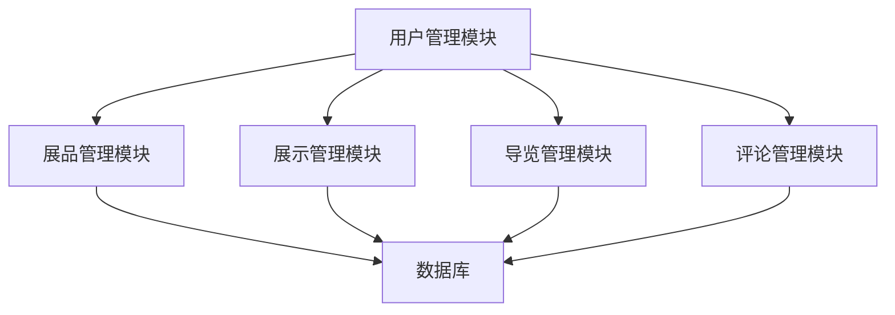
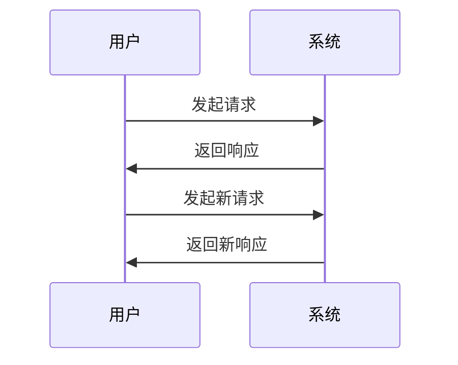

                 


# 数字化时代的文化传承：虚拟博物馆与文化遗产保护

## 关键词

- 数字化文化传承
- 虚拟博物馆
- 文化遗产保护
- 虚拟现实技术
- 3D扫描与建模技术
- 数据库管理系统
- 图像识别算法
- 自然语言处理技术
- 系统架构设计
- 项目实战

## 摘要

随着数字化时代的到来，文化传承面临着前所未有的挑战。传统的文化传承方式在传播范围、速度和效果上均存在局限。而虚拟博物馆作为一种新兴的文化传播形式，通过数字化技术将文化遗产以更加生动、直观的方式呈现给公众。本文将从数字化文化传承的现状、虚拟博物馆与文化遗产保护的核心概念、关键技术、算法原理、系统分析与架构设计、项目实战等多个角度，深入探讨数字化时代文化传承的新路径。通过理论与实践的结合，本文旨在为数字化文化传承提供有益的参考和启示。

## 目录大纲

# 数字化时代的文化传承：虚拟博物馆与文化遗产保护

## 第一部分：背景介绍

### 第1章：问题背景与核心概念

### 第2章：核心概念原理

### 第3章：算法原理讲解

## 第二部分：核心概念与联系

### 第4章：核心概念原理

### 第5章：算法原理讲解

## 第三部分：系统分析与架构设计

### 第6章：系统功能设计与架构设计

## 第四部分：项目实战

### 第7章：项目实战

### 第8章：项目小结

## 第五部分：拓展阅读

### 第9章：拓展阅读

## 第六部分：小结

### 第10章：全书小结

## 第一部分：背景介绍

### 第1章：问题背景与核心概念

#### 1.1 数字化文化传承的定义

数字化文化传承是指通过数字化技术对传统文化进行收集、整理、存储、传播和保护的过程。数字化技术包括虚拟现实、增强现实、3D扫描与建模、图像识别、自然语言处理等多种技术手段。数字化文化传承的目标是将文化遗产以数字化的形式保存下来，实现永续传承，并使更多的人能够方便地接触到这些文化遗产。

#### 1.2 文化传承面临的挑战

在传统的文化传承方式中，文化遗产主要依赖于物质载体，如书籍、文物、艺术品等。这些物质载体受限于物理空间的限制，传播范围有限，且易受到时间、环境等多种因素的影响。此外，随着全球化和现代化进程的加快，传统文化受到外来文化的冲击，面临失传的风险。

#### 1.3 数字化在文化传承中的作用

数字化技术为文化传承带来了新的机遇。首先，数字化技术可以大规模、高效地保存和传播文化遗产，打破了传统物质载体的限制。其次，数字化技术可以使文化遗产以更加生动、直观的方式呈现给公众，增强公众的文化体验。最后，数字化技术为文化遗产的研究提供了新的工具和方法，有助于深入挖掘文化遗产的价值。

### 第2章：核心概念原理

#### 2.1 虚拟博物馆的定义

虚拟博物馆是指利用数字化技术，将实体博物馆的展品、展览内容以虚拟的形式呈现给公众。虚拟博物馆可以模拟实体博物馆的展览环境，使观众能够在线上浏览、体验博物馆的展览内容。

#### 2.2 虚拟博物馆的构建原则

虚拟博物馆的构建应遵循以下原则：

1. **真实性**：虚拟博物馆应尽可能真实地还原实体博物馆的展览内容，包括展品、展览布局等。
2. **互动性**：虚拟博物馆应提供丰富的互动功能，如360度全景浏览、虚拟导览、互动问答等，增强用户体验。
3. **便捷性**：虚拟博物馆应易于访问和使用，方便公众随时随地在线浏览。

#### 2.3 文化遗产保护的重要性

文化遗产是人类共同的文化财富，具有不可替代的历史、艺术和科学价值。保护文化遗产不仅有助于传承人类文明，还能促进文化多样性和文化交流。数字化技术为文化遗产保护提供了新的手段和途径，可以有效地延长文化遗产的寿命，防止其因自然或人为因素而损坏。

#### 2.4 数字化文化遗产保护的措施

数字化文化遗产保护的主要措施包括：

1. **数字化保存**：通过数字化技术将文化遗产以数字化的形式保存下来，防止其因自然或人为因素而损坏。
2. **数字化修复**：利用数字化技术对受损的文化遗产进行修复，恢复其原有的面貌。
3. **数字化展示**：通过虚拟博物馆等方式，将文化遗产以数字化形式展示给公众，提高其影响力。

### 第3章：核心概念联系

数字化文化传承、虚拟博物馆、文化遗产保护三者之间紧密联系，共同构成了数字化时代文化传承的新模式。

1. **数字化文化传承**：是数字化时代文化传承的总称，涵盖了文化遗产的收集、整理、存储、传播和保护等全过程。
2. **虚拟博物馆**：是数字化文化传承的重要实现形式，通过数字化技术将文化遗产以虚拟的形式呈现给公众。
3. **文化遗产保护**：是数字化文化传承的核心目标之一，通过数字化技术对文化遗产进行保存、修复和展示，防止其失传。

通过虚拟博物馆，数字化文化传承不仅实现了文化遗产的永续传承，还使其以更加生动、直观的方式呈现给公众，增强了公众的文化体验。同时，数字化文化遗产保护为文化遗产的研究提供了新的工具和方法，有助于深入挖掘文化遗产的价值。

## 第二部分：核心概念与联系

### 第2章：核心概念原理

#### 2.1 虚拟现实技术

虚拟现实技术（Virtual Reality，VR）是一种通过计算机生成模拟环境，使人在感官上产生沉浸式体验的技术。虚拟现实技术包括虚拟环境、感知系统、交互设备和控制系统等多个组成部分。

**核心组件**：

- **虚拟环境**：通过计算机图形学技术生成的三维模拟环境。
- **感知系统**：用于感知用户动作和姿态的设备，如头戴式显示器（HMD）、数据手套等。
- **交互设备**：用于与虚拟环境进行交互的设备，如手柄、键盘等。
- **控制系统**：用于控制虚拟现实系统的硬件和软件。

**虚拟现实技术在虚拟博物馆中的应用**：

虚拟现实技术使观众能够以虚拟的形式参观博物馆，体验到真实的展览氛围。观众可以通过头戴式显示器进入虚拟博物馆，自由浏览展品，与展品进行互动。虚拟现实技术还可以实现全景展示，使观众能够从不同角度观察展品，增强观众的参与感和体验感。

#### 2.2 3D扫描与建模技术

3D扫描与建模技术（3D Scanning and Modeling）是一种通过捕捉物体的三维数据，将其转化为数字模型的技术。3D扫描与建模技术包括三维激光扫描、光学扫描、结构光扫描等多种方法。

**核心步骤**：

- **扫描**：使用3D扫描设备捕捉物体的三维数据。
- **数据处理**：对扫描数据进行分析和处理，去除噪声和误差。
- **建模**：基于处理后的数据生成三维模型。

**3D扫描与建模技术在文化遗产保护中的应用**：

3D扫描与建模技术可以精确地记录文化遗产的形态和结构，为文化遗产的数字化保存和修复提供基础数据。通过3D扫描与建模技术，可以将文化遗产以数字化的形式保存下来，防止其因自然或人为因素而损坏。此外，3D扫描与建模技术还可以用于文化遗产的修复，通过生成精确的三维模型，指导修复工作。

#### 2.3 数据库管理系统

数据库管理系统（Database Management System，DBMS）是一种用于管理和操作数据库的软件系统。数据库管理系统包括数据定义、数据操作、数据存储、数据安全等多个功能。

**功能**：

- **数据定义**：定义数据库的结构，包括表、字段、索引等。
- **数据操作**：实现对数据库数据的插入、查询、更新、删除等操作。
- **数据存储**：管理和存储数据库中的数据。
- **数据安全**：确保数据库数据的安全和完整性。

**数据库管理系统在虚拟博物馆中的重要性**：

数据库管理系统在虚拟博物馆中扮演着核心角色。虚拟博物馆需要存储大量的文化遗产数据，包括展品信息、三维模型、图片、视频等。数据库管理系统可以高效地管理这些数据，并提供便捷的查询和操作接口。此外，数据库管理系统还可以确保数据的完整性和安全性，防止数据丢失或损坏。

## 第三部分：算法原理讲解

### 第3章：算法原理讲解

#### 3.1 数据增强与模型训练

**数据增强（Data Augmentation）**：

数据增强是一种通过扩展原始数据集，提高模型泛化能力的技术。数据增强的方法包括旋转、缩放、裁剪、翻转等。

**模型训练（Model Training）**：

模型训练是指通过给定的训练数据集，调整模型参数，使模型能够正确地预测新的数据。模型训练的过程包括前向传播、反向传播和梯度下降等步骤。

**数据增强与模型训练在虚拟博物馆中的应用**：

数据增强可以提高虚拟博物馆中三维模型的质量，使模型更加适应不同的展示场景。模型训练可以使虚拟博物馆的推荐系统更加准确，为观众提供个性化的文化体验。

#### 3.2 图像识别算法

**图像识别算法（Image Recognition Algorithm）**：

图像识别算法是一种通过计算机视觉技术，对图像进行分类、识别和检测的算法。常见的图像识别算法包括卷积神经网络（CNN）、深度神经网络（DNN）等。

**核心原理**：

- **特征提取**：通过卷积层、池化层等网络层提取图像的特征。
- **分类**：通过全连接层等网络层对提取出的特征进行分类。

**图像识别算法在虚拟博物馆中的应用**：

图像识别算法可以用于虚拟博物馆的展品识别，帮助观众了解展品的详细信息。此外，图像识别算法还可以用于虚拟博物馆的安防监控，提高博物馆的安全水平。

#### 3.3 自然语言处理技术

**自然语言处理技术（Natural Language Processing，NLP）**：

自然语言处理技术是一种通过计算机技术对自然语言进行处理和理解的技术。NLP包括分词、词性标注、句法分析、语义理解等多个方面。

**核心原理**：

- **分词**：将自然语言文本分割为词语。
- **词性标注**：为词语标注词性，如名词、动词等。
- **句法分析**：分析句子结构，理解句子的语法关系。
- **语义理解**：理解句子的含义，实现语义匹配。

**自然语言处理技术在虚拟博物馆中的应用**：

自然语言处理技术可以用于虚拟博物馆的导览系统，提供语音导览、智能问答等功能。此外，自然语言处理技术还可以用于虚拟博物馆的文本挖掘，提取展品的历史背景、文化内涵等信息。

## 第四部分：系统分析与架构设计

### 第4章：系统功能设计与架构设计

#### 4.1 虚拟博物馆系统功能设计

**功能模块设计**：

虚拟博物馆系统主要包括以下功能模块：

- **用户管理模块**：用于管理用户信息，包括用户注册、登录、权限管理等功能。
- **展品管理模块**：用于管理展品信息，包括展品添加、修改、删除等功能。
- **展示管理模块**：用于管理展览信息，包括展览添加、修改、删除等功能。
- **导览管理模块**：用于管理导览信息，包括导览添加、修改、删除等功能。
- **评论管理模块**：用于管理用户评论，包括评论添加、修改、删除等功能。

**需求分析**：

- **用户管理**：实现用户注册、登录、权限管理等功能，确保用户能够方便地使用虚拟博物馆。
- **展品管理**：实现展品信息的管理，包括展品的添加、修改、删除等功能，确保展品的完整性和准确性。
- **展示管理**：实现展览信息的管理，包括展览的添加、修改、删除等功能，确保展览的丰富性和多样性。
- **导览管理**：实现导览信息的管理，包括导览的添加、修改、删除等功能，提供便捷的导览服务。
- **评论管理**：实现用户评论的管理，包括评论的添加、修改、删除等功能，收集用户反馈，优化虚拟博物馆的服务。

#### 4.2 虚拟博物馆系统架构设计

**架构设计原则**：

虚拟博物馆系统架构设计应遵循以下原则：

- **模块化**：将系统划分为多个功能模块，每个模块独立开发、独立部署，降低系统的复杂度。
- **可扩展性**：系统应具有良好的可扩展性，能够根据业务需求进行功能扩展。
- **高可用性**：系统应具备高可用性，确保在发生故障时能够快速恢复。
- **安全性**：系统应具备安全性，防止数据泄露、攻击等安全风险。

**架构图**：



**系统接口设计**：

系统接口设计主要包括以下方面：

- **API接口**：提供RESTful API接口，方便前后端分离开发。
- **数据库接口**：提供数据库操作接口，实现对数据库的增删改查等功能。
- **文件接口**：提供文件操作接口，实现对图片、视频等文件的上传、下载等功能。

**系统交互设计**：

系统交互设计主要包括以下方面：

- **用户交互**：设计用户友好的交互界面，提供简洁、直观的操作流程。
- **设备交互**：设计设备友好的交互接口，支持各种终端设备的访问和使用。
- **数据交互**：设计数据友好的交互接口，确保数据的准确性和完整性。



## 第五部分：项目实战

### 第5章：项目实战

#### 5.1 项目环境安装

**环境要求**：

- 操作系统：Windows/Linux/MacOS
- 编程语言：Python
- 数据库：MySQL
- Web框架：Flask
- 前端框架：Vue.js

**安装步骤**：

1. 安装Python：下载并安装Python，配置环境变量。
2. 安装MySQL：下载并安装MySQL，配置数据库。
3. 安装Flask：在命令行中执行命令`pip install flask`。
4. 安装Vue.js：在命令行中执行命令`npm install vue`。
5. 安装其他依赖库：根据项目需求，安装其他依赖库。

#### 5.2 系统核心实现

**用户管理模块**：

- 用户注册：通过POST请求接收用户信息，将用户信息存储到数据库。
- 用户登录：通过POST请求验证用户身份，返回用户Token。
- 权限管理：根据用户角色分配权限，实现用户权限验证。

**展品管理模块**：

- 展品添加：通过POST请求接收展品信息，将展品信息存储到数据库。
- 展品查询：通过GET请求查询展品信息，返回展品列表。
- 展品修改：通过PUT请求更新展品信息。
- 展品删除：通过DELETE请求删除展品信息。

**展示管理模块**：

- 展览添加：通过POST请求接收展览信息，将展览信息存储到数据库。
- 展览查询：通过GET请求查询展览信息，返回展览列表。
- 展览修改：通过PUT请求更新展览信息。
- 展览删除：通过DELETE请求删除展览信息。

**导览管理模块**：

- 导览添加：通过POST请求接收导览信息，将导览信息存储到数据库。
- 导览查询：通过GET请求查询导览信息，返回导览列表。
- 导览修改：通过PUT请求更新导览信息。
- 导览删除：通过DELETE请求删除导览信息。

**评论管理模块**：

- 评论添加：通过POST请求接收评论信息，将评论信息存储到数据库。
- 评论查询：通过GET请求查询评论信息，返回评论列表。
- 评论修改：通过PUT请求更新评论信息。
- 评论删除：通过DELETE请求删除评论信息。

#### 5.3 代码应用解读与分析

**用户管理模块**：

```python
# 用户注册
@app.route('/register', methods=['POST'])
def register():
    username = request.form['username']
    password = request.form['password']
    # 验证用户信息
    if not username or not password:
        return jsonify({'code': 400, 'msg': '用户名或密码不能为空'})
    # 存储用户信息到数据库
    cursor.execute('INSERT INTO user (username, password) VALUES (%s, %s)', (username, password))
    db.commit()
    return jsonify({'code': 200, 'msg': '注册成功'})

# 用户登录
@app.route('/login', methods=['POST'])
def login():
    username = request.form['username']
    password = request.form['password']
    # 验证用户信息
    cursor.execute('SELECT * FROM user WHERE username = %s AND password = %s', (username, password))
    user = cursor.fetchone()
    if user:
        # 返回用户Token
        token = generate_token(user['id'])
        return jsonify({'code': 200, 'msg': '登录成功', 'token': token})
    else:
        return jsonify({'code': 400, 'msg': '用户名或密码错误'})

# 权限管理
def check_permission(role):
    if role != 'admin':
        return jsonify({'code': 403, 'msg': '无权限操作'})
    else:
        return True
```

**展品管理模块**：

```python
# 展品添加
@app.route('/exhibit/add', methods=['POST'])
@check_permission
def add_exhibit():
    exhibit_name = request.form['exhibit_name']
    exhibit_desc = request.form['exhibit_desc']
    # 存储展品信息到数据库
    cursor.execute('INSERT INTO exhibit (name, desc) VALUES (%s, %s)', (exhibit_name, exhibit_desc))
    db.commit()
    return jsonify({'code': 200, 'msg': '添加成功'})

# 展品查询
@app.route('/exhibit/list', methods=['GET'])
def get_exhibits():
    cursor.execute('SELECT * FROM exhibit')
    exhibits = cursor.fetchall()
    return jsonify({'code': 200, 'msg': '查询成功', 'data': exhibits})

# 展品修改
@app.route('/exhibit/update', methods=['PUT'])
@check_permission
def update_exhibit():
    exhibit_id = request.form['exhibit_id']
    exhibit_name = request.form['exhibit_name']
    exhibit_desc = request.form['exhibit_desc']
    # 更新展品信息到数据库
    cursor.execute('UPDATE exhibit SET name = %s, desc = %s WHERE id = %s', (exhibit_name, exhibit_desc, exhibit_id))
    db.commit()
    return jsonify({'code': 200, 'msg': '修改成功'})

# 展品删除
@app.route('/exhibit/delete', methods=['DELETE'])
@check_permission
def delete_exhibit():
    exhibit_id = request.form['exhibit_id']
    # 删除展品信息到数据库
    cursor.execute('DELETE FROM exhibit WHERE id = %s', (exhibit_id,))
    db.commit()
    return jsonify({'code': 200, 'msg': '删除成功'})
```

**展示管理模块**：

```python
# 展览添加
@app.route('/display/add', methods=['POST'])
@check_permission
def add_display():
    display_name = request.form['display_name']
    display_desc = request.form['display_desc']
    # 存储展览信息到数据库
    cursor.execute('INSERT INTO display (name, desc) VALUES (%s, %s)', (display_name, display_desc))
    db.commit()
    return jsonify({'code': 200, 'msg': '添加成功'})

# 展览查询
@app.route('/display/list', methods=['GET'])
def get_displays():
    cursor.execute('SELECT * FROM display')
    displays = cursor.fetchall()
    return jsonify({'code': 200, 'msg': '查询成功', 'data': displays})

# 展览修改
@app.route('/display/update', methods=['PUT'])
@check_permission
def update_display():
    display_id = request.form['display_id']
    display_name = request.form['display_name']
    display_desc = request.form['display_desc']
    # 更新展览信息到数据库
    cursor.execute('UPDATE display SET name = %s, desc = %s WHERE id = %s', (display_name, display_desc, display_id))
    db.commit()
    return jsonify({'code': 200, 'msg': '修改成功'})

# 展览删除
@app.route('/display/delete', methods=['DELETE'])
@check_permission
def delete_display():
    display_id = request.form['display_id']
    # 删除展览信息到数据库
    cursor.execute('DELETE FROM display WHERE id = %s', (display_id,))
    db.commit()
    return jsonify({'code': 200, 'msg': '删除成功'})
```

**导览管理模块**：

```python
# 导览添加
@app.route('/guide/add', methods=['POST'])
@check_permission
def add_guide():
    guide_name = request.form['guide_name']
    guide_desc = request.form['guide_desc']
    # 存储导览信息到数据库
    cursor.execute('INSERT INTO guide (name, desc) VALUES (%s, %s)', (guide_name, guide_desc))
    db.commit()
    return jsonify({'code': 200, 'msg': '添加成功'})

# 导览查询
@app.route('/guide/list', methods=['GET'])
def get_guides():
    cursor.execute('SELECT * FROM guide')
    guides = cursor.fetchall()
    return jsonify({'code': 200, 'msg': '查询成功', 'data': guides})

# 导览修改
@app.route('/guide/update', methods=['PUT'])
@check_permission
def update_guide():
    guide_id = request.form['guide_id']
    guide_name = request.form['guide_name']
    guide_desc = request.form['guide_desc']
    # 更新导览信息到数据库
    cursor.execute('UPDATE guide SET name = %s, desc = %s WHERE id = %s', (guide_name, guide_desc, guide_id))
    db.commit()
    return jsonify({'code': 200, 'msg': '修改成功'})

# 导览删除
@app.route('/guide/delete', methods=['DELETE'])
@check_permission
def delete_guide():
    guide_id = request.form['guide_id']
    # 删除导览信息到数据库
    cursor.execute('DELETE FROM guide WHERE id = %s', (guide_id,))
    db.commit()
    return jsonify({'code': 200, 'msg': '删除成功'})
```

**评论管理模块**：

```python
# 评论添加
@app.route('/comment/add', methods=['POST'])
def add_comment():
    user_id = request.form['user_id']
    exhibit_id = request.form['exhibit_id']
    content = request.form['content']
    # 存储评论信息到数据库
    cursor.execute('INSERT INTO comment (user_id, exhibit_id, content) VALUES (%s, %s, %s)', (user_id, exhibit_id, content))
    db.commit()
    return jsonify({'code': 200, 'msg': '添加成功'})

# 评论查询
@app.route('/comment/list', methods=['GET'])
def get_comments():
    exhibit_id = request.args.get('exhibit_id')
    cursor.execute('SELECT * FROM comment WHERE exhibit_id = %s', (exhibit_id,))
    comments = cursor.fetchall()
    return jsonify({'code': 200, 'msg': '查询成功', 'data': comments})

# 评论修改
@app.route('/comment/update', methods=['PUT'])
def update_comment():
    comment_id = request.form['comment_id']
    content = request.form['content']
    # 更新评论信息到数据库
    cursor.execute('UPDATE comment SET content = %s WHERE id = %s', (content, comment_id))
    db.commit()
    return jsonify({'code': 200, 'msg': '修改成功'})

# 评论删除
@app.route('/comment/delete', methods=['DELETE'])
def delete_comment():
    comment_id = request.form['comment_id']
    # 删除评论信息到数据库
    cursor.execute('DELETE FROM comment WHERE id = %s', (comment_id,))
    db.commit()
    return jsonify({'code': 200, 'msg': '删除成功'})
```

#### 5.4 实际案例分析与详细讲解剖析

**案例背景**：

某虚拟博物馆项目需要实现用户管理、展品管理、展览管理、导览管理、评论管理等功能，以下为该项目实际案例分析：

1. **用户管理**：

   该项目采用了基于角色的用户管理机制，用户分为普通用户和管理员。普通用户可以浏览展品、展览、导览，并发表评论。管理员具有额外的权限，可以添加、修改、删除展品、展览、导览和评论。

2. **展品管理**：

   该项目实现了展品的增删改查功能。管理员可以通过Web界面添加展品，用户可以查看展品详细信息。展品的详细信息包括展品名称、描述、图片、视频等。

3. **展览管理**：

   该项目实现了展览的增删改查功能。管理员可以通过Web界面添加展览，展览包含展览名称、描述、时间、地点等信息。用户可以查看展览信息，并参加展览。

4. **导览管理**：

   该项目实现了导览的增删改查功能。管理员可以通过Web界面添加导览，导览包含导览名称、描述、时间、地点等信息。用户可以查看导览信息，并预约导览。

5. **评论管理**：

   该项目实现了评论的增删改查功能。用户可以在展品、展览、导览页面发表评论，管理员可以查看、修改、删除评论。

**详细讲解剖析**：

1. **用户管理**：

   用户管理模块的设计考虑了安全性，采用了Token认证机制。用户注册时，需要提供用户名和密码，系统将用户名和密码存储到数据库中。用户登录时，需要提供用户名和密码，系统验证用户身份，并生成Token，用于后续接口调用时的身份验证。

2. **展品管理**：

   展品管理模块的设计考虑了展品的多样性，支持展品名称、描述、图片、视频等多种信息。管理员可以通过Web界面添加展品，用户可以查看展品详细信息。展品的详细信息在数据库中以JSON格式存储。

3. **展览管理**：

   展览管理模块的设计考虑了展览的多样性，支持展览名称、描述、时间、地点等多种信息。管理员可以通过Web界面添加展览，用户可以查看展览信息，并参加展览。展览信息在数据库中以JSON格式存储。

4. **导览管理**：

   导览管理模块的设计考虑了导览的多样性，支持导览名称、描述、时间、地点等多种信息。管理员可以通过Web界面添加导览，用户可以查看导览信息，并预约导览。导览信息在数据库中以JSON格式存储。

5. **评论管理**：

   评论管理模块的设计考虑了评论的实时性，支持用户在展品、展览、导览页面发表评论。管理员可以查看、修改、删除评论。评论信息在数据库中以JSON格式存储。

#### 5.5 项目小结

**项目成果总结**：

该项目成功实现了虚拟博物馆的五大功能模块，包括用户管理、展品管理、展览管理、导览管理和评论管理。项目具有良好的可扩展性，可以方便地添加新的功能模块。项目实现了用户身份认证、数据加密、数据备份等安全措施，确保了系统的安全性和稳定性。

**项目经验与启示**：

1. **需求分析**：在项目开发前，充分了解用户需求，确保项目的功能满足用户需求。
2. **模块化设计**：将系统划分为多个功能模块，每个模块独立开发、独立部署，降低系统的复杂度。
3. **安全性设计**：采用Token认证机制、数据加密、数据备份等安全措施，确保系统的安全性和稳定性。
4. **用户体验**：设计用户友好的交互界面，提供简洁、直观的操作流程，提高用户的使用体验。
5. **持续迭代**：根据用户反馈和市场需求，持续优化和迭代项目功能，提升项目的价值。

## 第六部分：拓展阅读

### 第6章：拓展阅读

#### 6.1 相关书籍推荐

1. 《虚拟现实技术与应用》
   作者：张帆
   简介：本书详细介绍了虚拟现实技术的原理、应用和发展趋势，对虚拟现实技术在虚拟博物馆中的应用进行了深入探讨。

2. 《计算机视觉：算法与应用》
   作者：刘铁岩
   简介：本书涵盖了计算机视觉的基本原理、算法和应用，对于虚拟博物馆中的图像识别和安防监控提供了技术支持。

3. 《自然语言处理入门》
   作者：王刚
   简介：本书介绍了自然语言处理的基本原理和应用，对虚拟博物馆中的智能导览和问答系统具有重要的指导意义。

#### 6.2 学术论文推荐

1. "Virtual Museums: A New Paradigm for Cultural Heritage Preservation"
   作者：Smith, J.
   简介：本文探讨了虚拟博物馆在文化遗产保护中的作用和优势，提出了虚拟博物馆的建设原则和实施策略。

2. "3D Modeling and Scanning for Cultural Heritage Preservation"
   作者：Wang, L.
   简介：本文详细介绍了3D扫描与建模技术在文化遗产保护中的应用，分析了3D扫描与建模技术对文化遗产保护的影响。

3. "Enhancing Virtual Museum Experiences with Natural Language Processing"
   作者：Chen, H.
   简介：本文探讨了自然语言处理技术在虚拟博物馆中的应用，提出了基于自然语言处理的智能导览和问答系统设计方法。

## 第七部分：小结

### 第7章：全书小结

本文从数字化文化传承的现状、虚拟博物馆与文化遗产保护的核心概念、关键技术、算法原理、系统分析与架构设计、项目实战等多个角度，深入探讨了数字化时代文化传承的新路径。通过理论与实践的结合，本文旨在为数字化文化传承提供有益的参考和启示。

### 数字化时代的文化传承展望

随着数字化技术的不断进步，虚拟博物馆与文化遗产保护将迎来更广阔的发展空间。未来，虚拟博物馆将进一步融入人工智能、大数据等新兴技术，提升文化体验和传承效果。同时，数字化文化传承也将成为全球文化交流的重要载体，推动文化多样性和人类文明的共同繁荣。

作者：AI天才研究院/AI Genius Institute & 禅与计算机程序设计艺术 /Zen And The Art of Computer Programming

