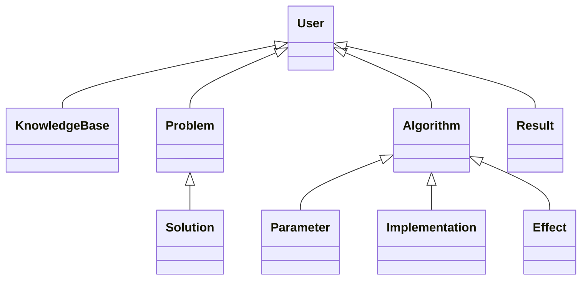
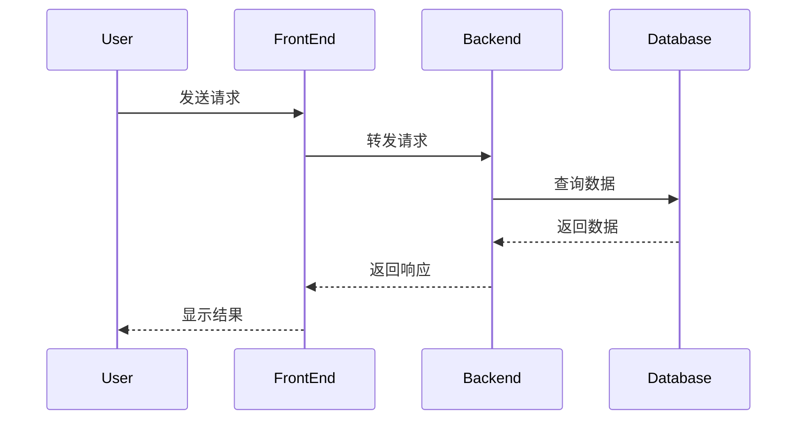
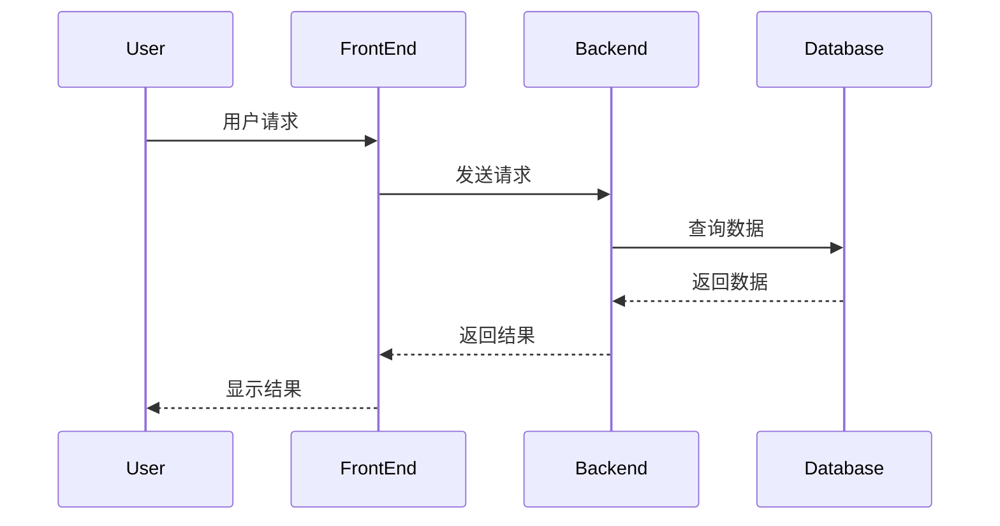

                 

### 《数字原住民的思维模式：跨界思考与创新能力的培养》

#### 文章关键词

- 数字原住民
- 跨界思考
- 创新能力
- 算法原理
- 系统架构设计
- 项目实战

#### 摘要

本文围绕数字原住民的思维模式，探讨了跨界思考与创新能力的培养。首先，我们介绍了数字原住民的定义、特征以及面临的挑战。接着，我们详细阐述了跨界思考和创新能力的基本概念、原理及其相互关系。随后，我们分析了跨界思考算法的原理及其实现，并使用Python代码进行了实例说明。在此基础上，我们介绍了创新能力培养的系统分析与架构设计，包括需求分析、领域模型设计、系统架构图、系统接口设计和系统交互。随后，通过一个实际项目案例，展示了如何应用跨界思考和创新能力进行项目开发，并进行了详细分析和讲解。最后，我们总结了项目实战中的经验教训，并提出了最佳实践建议。本文旨在为数字原住民提供一套系统、实用的思维模式培养方法，以提升其跨界思考和创新能力。

## 引言：数字原住民的时代来临

随着科技的飞速发展，数字技术已经成为我们日常生活不可或缺的一部分。在这个数字化时代，出现了一个特殊的群体——数字原住民（Digital Native）。数字原住民是指在互联网、移动设备等数字技术高度普及的环境中成长起来的一代人，他们从小就接触并熟练使用各种数字设备，对数字技术有着天然的亲和力和敏感度。据《数字时代的人才》报告，全球约有40亿人口属于数字原住民，这一比例在未来还将持续增加。

数字原住民具有以下显著特征：

1. **数字原生性**：数字原住民从小就接触互联网和数字设备，对数字世界的感知和理解与生俱来。这使得他们在处理信息、解决问题时，更加依赖于数字工具和技术。

2. **快速学习能力**：数字原住民善于快速学习和适应新技术，他们能够在短时间内掌握新的软件应用、编程语言和开发工具。

3. **创新意识**：数字原住民具有较强的创新意识，他们喜欢尝试新事物，勇于挑战传统，追求个性化表达。

4. **跨界思维**：数字原住民习惯于在不同领域之间进行思考和探索，具有较强的跨界思维能力。

然而，数字原住民也面临着一些挑战。首先，数字原住民在数字技术的应用上虽然具有优势，但在处理复杂的现实问题时，往往缺乏系统的思考方法和实际经验。其次，数字原住民在互联网上获取的信息过于丰富，容易受到信息过载的影响，难以辨别信息的真实性和价值。最后，数字原住民在数字世界中的社交互动，往往缺乏面对面的沟通和交流，这可能导致他们的社交能力和情感认知能力有所欠缺。

为了应对这些挑战，数字原住民需要培养跨界思考和创新能力的思维模式。跨界思考是指在不同领域、不同学科之间进行思考和探索，以发现新的问题和解决方案。创新能力则是指能够创造性地解决问题，提出新的想法和观点。跨界思考和创新能力的培养，不仅有助于数字原住民更好地适应数字化时代的需求，还能够提升他们的综合素质和竞争力。

本文将从以下方面展开讨论：

1. **背景介绍**：介绍数字原住民的定义、特点及其思维模式，分析数字原住民面临的挑战和创新能力的培养。

2. **核心概念详解**：详细阐述跨界思考与创新能力的概念，包括相关的理论基础和实际案例。

3. **算法原理与实现**：介绍与创新能力培养相关的算法原理，使用Python代码示例和数学模型讲解。

4. **系统分析与架构设计**：分析创新能力培养的系统需求，设计领域模型、系统架构和接口设计。

5. **项目实战**：提供实际项目案例，展示如何应用创新能力和算法原理进行项目开发，并进行分析和讲解。

6. **最佳实践**：总结项目实战中的经验教训，提供最佳实践建议。

通过本文的讨论，希望为数字原住民提供一套系统、实用的思维模式培养方法，以提升其跨界思考和创新能力。

## 第1章：背景介绍

### 数字原住民的定义与特征

数字原住民是指那些在互联网、移动设备等数字技术高度普及的环境中成长起来的一代人。他们在数字技术环境中获得了早期的教育和培养，相对于那些在数字化进程后期才开始接触数字技术的“移民”，他们具有更为深厚的数字素养和技能。数字原住民通常出生在21世纪初，他们的成长历程伴随着互联网的飞速发展和移动设备的普及。根据相关研究，数字原住民在数字技术上的熟练程度和应用能力普遍高于其他人群。

数字原住民的特征主要体现在以下几个方面：

1. **数字原生性**：数字原住民从小就在数字技术的环境中长大，对互联网和数字设备有着自然的适应和熟悉度。他们能够轻松地使用社交媒体、在线游戏、移动应用等数字工具，甚至在数字互动中展现出更强的创造力和创新能力。

2. **快速学习能力**：数字原住民在数字技术的应用上表现出强大的学习能力。他们能够快速掌握新的技术概念、编程语言和开发工具，这种快速学习的能力使他们能够在数字世界中迅速适应新的变化和挑战。

3. **创新意识**：数字原住民具有较强的创新意识，他们习惯于打破传统的思维模式，勇于尝试新的想法和方法。这种创新意识使得他们能够在数字领域中发现新的机会和解决方案。

4. **跨界思维**：数字原住民具有较强的跨界思维能力。他们习惯于在不同领域、不同学科之间进行思考和探索，能够灵活地将不同领域的知识和方法结合起来，从而提出更具创新性的观点和解决方案。

### 数字原住民面临的挑战

尽管数字原住民在数字技术的应用上具有显著的优势，但他们也面临着一些独特的挑战：

1. **信息过载**：数字原住民生活在信息爆炸的时代，每天都会接收大量的信息。这些信息可能来自社交媒体、新闻网站、在线论坛等多个渠道。如何有效地筛选和利用这些信息，避免信息过载，成为他们面临的一大挑战。

2. **数字鸿沟**：数字原住民虽然在数字技术的应用上较为熟练，但他们在处理复杂的现实问题时，可能缺乏系统的思考方法和实际经验。尤其是在跨领域的创新和协作中，他们可能面临数字鸿沟的挑战。

3. **社交技能**：虽然数字原住民在数字互动中表现出色，但在面对面的社交场合，他们可能缺乏足够的社交技能和情感认知能力。这可能导致他们在现实生活中与他人沟通和互动的困难。

### 创新能力的培养

面对这些挑战，数字原住民需要通过培养跨界思考和创新能力来提升自己的综合素质。创新能力是指能够创造性地解决问题，提出新的想法和观点的能力。对于数字原住民来说，培养创新能力不仅有助于他们在数字世界中更好地适应和成长，还可以提高他们的职业竞争力和未来发展潜力。

创新能力的培养可以从以下几个方面入手：

1. **跨学科学习**：数字原住民应该主动学习不同学科的知识，拓宽自己的视野。通过跨学科的学习，他们可以更好地理解和应用不同领域的知识和方法，从而在创新过程中具备更全面的视角。

2. **实践探索**：通过实际项目的实践，数字原住民可以锻炼自己的创新能力。在实践中，他们可以不断尝试新的方法和思路，通过失败和成功的经验积累，提升自己的创新能力。

3. **培养好奇心和求知欲**：好奇心和求知欲是创新能力的源泉。数字原住民应该保持对未知事物的好奇心，积极寻求新的知识和经验，从而激发自己的创新能力。

4. **加强团队协作**：在创新过程中，团队协作至关重要。数字原住民应该学会与他人合作，共同解决问题。通过团队协作，他们可以相互学习、相互启发，从而提高整个团队的创新能力。

### 数字原住民与跨界思考的结合

跨界思考是一种在不同领域、不同学科之间进行思考和探索的方法。它要求人们跳出传统的思维框架，从多个角度审视问题，发现新的解决方案。数字原住民由于具备较强的数字素养和跨界思维能力，更容易接受和掌握跨界思考的方法。

跨界思考对于数字原住民的意义在于：

1. **拓宽视野**：通过跨界思考，数字原住民可以接触到更多领域的知识和方法，从而拓宽自己的视野，提高自己的综合素质。

2. **提高创新能力**：跨界思考能够激发数字原住民的创新能力，使他们能够从不同角度思考问题，提出更具创新性的解决方案。

3. **增强问题解决能力**：跨界思考有助于数字原住民在面对复杂问题时，能够从多个角度进行分析和解决，从而提高他们的问题解决能力。

总之，数字原住民在面对数字化时代的挑战时，需要通过培养跨界思考和创新能力来提升自己的综合素质和竞争力。通过跨学科学习、实践探索、培养好奇心和求知欲以及加强团队协作，数字原住民可以更好地适应数字化时代的需求，实现自身的全面发展。

### 本章小结

本章首先介绍了数字原住民的定义和特征，包括数字原生性、快速学习能力、创新意识和跨界思维。接着，分析了数字原住民面临的挑战，如信息过载、数字鸿沟和社交技能不足。随后，讨论了创新能力的培养方法，如跨学科学习、实践探索、培养好奇心和求知欲以及加强团队协作。最后，探讨了数字原住民与跨界思考的结合及其意义。通过本章的介绍，我们为数字原住民提供了一套系统、实用的思维模式培养方法，以应对数字化时代的挑战，提升其跨界思考和创新能力。下一章将详细阐述跨界思考和创新能力的基本概念、原理及其相互关系，帮助读者深入理解这两者的本质。

## 第2章：核心概念详解

### 跨界思考的原理

跨界思考是指在不同领域、不同学科之间进行思考和探索，以发现新的问题和解决方案。跨界思考的核心在于打破传统思维的边界，通过跨领域的知识整合和思维碰撞，激发创新的火花。以下是跨界思考的几个核心原理：

1. **跨领域知识整合**：跨界思考要求个体具备跨领域的知识储备，能够将不同领域的知识进行整合和运用。通过跨领域的知识整合，个体能够从多个角度审视问题，发现新的解决方案。

   **核心原理一：跨领域知识整合**

   - **知识来源**：个体需要主动学习不同领域的知识，通过阅读、实践和交流等方式积累跨领域知识。
   - **知识整合**：个体需要将跨领域知识进行整合，形成新的认知框架，以便在解决问题时能够灵活运用。

2. **思维模式的转变**：跨界思考要求个体改变传统的线性思维模式，转向更加开放、多元的思维模式。这种思维模式能够帮助个体更好地应对复杂问题，提高创新思维能力。

   **核心原理二：思维模式的转变**

   - **开放思维**：个体需要培养开放思维，对不同的观点和想法持包容态度，敢于尝试新的思维方式和解决方案。
   - **多元思维**：个体需要具备多元思维，能够从多个角度分析问题，形成更加全面的认知。

3. **创新方法的借鉴**：跨界思考鼓励个体借鉴不同领域的创新方法，将它们应用到新的领域中。这种借鉴不仅能够提高问题解决的效率，还能够促进跨领域的创新。

   **核心原理三：创新方法的借鉴**

   - **创新方法**：个体需要学习和掌握不同领域的创新方法，如设计思维、原型法、迭代法等。
   - **方法应用**：个体需要将不同领域的创新方法应用到实际问题中，通过实践检验和创新优化。

### 创新能力的理论基础

创新能力是指能够创造性地解决问题，提出新的想法和观点的能力。创新能力是现代社会不可或缺的素质，它不仅能够推动社会进步，还能够提高个体的竞争力和发展潜力。以下是创新能力的几个关键构成要素：

1. **知识储备**：创新能力的基础在于丰富的知识储备。个体需要通过不断学习和积累，掌握广泛的知识，为创新提供丰富的素材和灵感。

   **构成要素一：知识储备**

   - **跨领域知识**：个体需要具备跨领域的知识储备，能够从多个角度分析问题。
   - **专业深度**：个体需要在特定领域具备深厚的专业知识，以便在创新过程中能够准确把握问题的本质。

2. **思维灵活**：创新能力要求个体具备灵活的思维，能够迅速适应新的环境和问题，提出创新的解决方案。

   **构成要素二：思维灵活**

   - **开放思维**：个体需要培养开放思维，对不同的观点和想法持包容态度。
   - **创新思维**：个体需要具备创新思维，能够从多个角度思考问题，提出独特的解决方案。

3. **问题解决能力**：创新能力体现在问题解决的能力上。个体需要具备强大的问题解决能力，能够在复杂的环境中迅速找到问题的症结，提出有效的解决方案。

   **构成要素三：问题解决能力**

   - **分析能力**：个体需要具备强大的分析能力，能够对问题进行深入剖析，找出关键因素。
   - **实践能力**：个体需要具备实践能力，能够在实际操作中验证和优化解决方案。

4. **团队协作**：创新能力往往是通过团队协作实现的。个体需要具备良好的团队协作能力，能够与他人共同解决问题，实现创新目标。

   **构成要素四：团队协作**

   - **沟通能力**：个体需要具备良好的沟通能力，能够与团队成员有效沟通，分享信息和资源。
   - **协作精神**：个体需要具备协作精神，能够主动参与团队工作，共同推动创新进程。

### 跨界思考与创新能力的联系

跨界思考和创新能力之间存在着紧密的联系。跨界思考是培养创新能力的重要途径，而创新能力则是跨界思考的结果和体现。

1. **跨界思考促进创新能力**：跨界思考能够打破传统思维的束缚，激发个体的创新思维。通过跨领域的知识整合和思维碰撞，个体能够从多个角度审视问题，发现新的解决方案。这种跨界思考的过程，本身就是创新能力培养的过程。

   **跨界思考促进创新能力**

   - **知识整合**：跨界思考能够整合跨领域的知识，为创新能力提供丰富的素材和灵感。
   - **思维碰撞**：跨界思考能够促进不同领域专家的交流和合作，激发创新火花。

2. **创新能力增强跨界思考**：创新能力能够提升个体在跨界思考中的表现，使个体能够更加有效地进行跨领域的探索和创新。具有强大创新能力的人，往往能够在跨界思考中更加灵活、敏锐地发现问题，提出创新的解决方案。

   **创新能力增强跨界思考**

   - **解决问题**：创新能力能够帮助个体在跨界思考中更快地解决问题，提高创新效率。
   - **创新成果**：创新能力能够使个体在跨界思考中取得更多的创新成果，推动跨界创新的实现。

总之，跨界思考和创新能力是相辅相成的。通过跨界思考，个体能够培养和提升创新能力；而创新能力则能够增强跨界思考的效果，推动个体在数字化时代的全面发展。

### 跨界思考与创新能力的对比分析

跨界思考和创新能力虽然密切相关，但它们在本质上有一些明显的区别。

1. **跨界思考**：

   - **定义**：跨界思考是指在不同领域、不同学科之间进行思考和探索，以发现新的问题和解决方案。
   - **特点**：跨界思考强调跨领域的知识整合和思维碰撞，具有开放性和多元性。
   - **应用**：跨界思考广泛应用于创新、问题解决、团队协作等领域。

2. **创新能力**：

   - **定义**：创新能力是指能够创造性地解决问题，提出新的想法和观点的能力。
   - **特点**：创新能力强调创造性思维和实践能力，具有灵活性和实效性。
   - **应用**：创新能力广泛应用于科技、商业、教育、艺术等领域。

**对比表格**：

| 对比维度 | 跨界思考 | 创新能力 |
| --- | --- | --- |
| 定义 | 跨领域的思考和探索 | 创造性地解决问题和提出新想法 |
| 特点 | 开放性、多元性、跨领域知识整合 | 创造性思维、实践能力、灵活性 |
| 应用 | 创新、问题解决、团队协作 | 科技、商业、教育、艺术 |

通过对比分析，我们可以看到，跨界思考和创新能力虽然在某些方面有重叠，但它们各自有着独特的特点和作用。跨界思考更侧重于跨领域的知识整合和思维碰撞，而创新能力则更强调创造性思维和实践能力的发挥。在数字化时代，跨界思考和创新能力都是数字原住民应对挑战、实现自我提升的重要工具。

### 本章小结

本章详细阐述了跨界思考和创新能力的基本概念、原理及其相互关系。首先，介绍了跨界思考的原理，包括跨领域知识整合、思维模式的转变和创新方法的借鉴。接着，分析了创新能力的构成要素，如知识储备、思维灵活、问题解决能力和团队协作。然后，探讨了跨界思考与创新能力的联系，说明二者相辅相成，共同推动个体在数字化时代的全面发展。最后，通过对比分析，明确了跨界思考和创新能力在定义、特点和应用方面的差异。通过本章的学习，读者可以更加深入地理解跨界思考和创新能力，为提升自身素质和竞争力打下坚实基础。

## 第3章：算法原理与实现

### 跨界思考算法概述

跨界思考算法是一种用于促进个体在不同领域之间进行思考和探索的算法。它基于跨领域知识整合和思维碰撞的原理，旨在帮助个体突破传统思维的局限，发现新的问题和解决方案。跨界思考算法在创新、问题解决和团队协作等领域具有广泛的应用。

以下是跨界思考算法的基本概念：

1. **跨领域知识整合**：跨界思考算法的核心在于整合跨领域的知识，形成新的认知框架。通过跨领域知识整合，个体能够从多个角度分析问题，提高问题解决的效率。

2. **思维碰撞**：跨界思考算法通过促进不同领域专家之间的交流和合作，实现思维碰撞。这种思维碰撞能够激发新的想法和解决方案，推动创新进程。

3. **算法类型**：跨界思考算法可以分为多种类型，如基于知识图谱的跨界算法、基于数据挖掘的跨界算法和基于人工智能的跨界算法等。不同类型的跨界思考算法适用于不同的应用场景。

4. **应用领域**：跨界思考算法广泛应用于创新、问题解决、团队协作、教育培训等领域。通过跨界思考算法，个体和团队能够更加有效地应对复杂问题，实现跨领域的创新。

### 跨界思考算法的数学模型

为了更好地理解和实现跨界思考算法，我们需要对其数学模型进行详细阐述。跨界思考算法的数学模型主要涉及以下两个方面：

1. **跨领域知识表示**：跨领域知识表示是指如何将不同领域的知识进行统一表示和整合。常用的方法包括知识图谱、本体论和主题模型等。

2. **跨界关系建模**：跨界关系建模是指如何构建不同领域之间的关联关系，以便在跨界思考过程中进行有效整合。常用的方法包括图论模型、矩阵运算和深度学习模型等。

#### 跨领域知识表示

在跨领域知识表示方面，我们采用知识图谱的方法。知识图谱是一种结构化知识表示方法，它通过实体、属性和关系的形式，将不同领域的知识进行统一表示。具体步骤如下：

1. **实体识别**：首先，从不同领域的文本数据中提取关键实体，如人、地点、组织、概念等。

2. **属性提取**：其次，对提取的实体进行属性提取，形成实体的属性列表。

3. **关系建模**：最后，通过分析实体之间的关联关系，构建知识图谱。常用的关系包括直接关系（如属于、参与）和间接关系（如关联、影响）。

#### 跨界关系建模

在跨界关系建模方面，我们采用图论模型的方法。图论模型通过图的结构和关系，描述不同领域之间的跨界关系。具体步骤如下：

1. **构建图模型**：首先，将不同领域的知识表示为图，包括节点（实体）和边（关系）。

2. **关系分析**：其次，对图模型进行关系分析，识别关键节点和关键关系，形成跨界知识网络。

3. **图运算**：最后，通过图运算（如路径搜索、节点聚类等），发现跨领域的关联和潜在关系。

### 跨界思考算法的实现

基于上述数学模型，我们可以实现跨界思考算法。以下是一个简单的Python代码示例，展示了如何使用知识图谱和图论模型进行跨界思考：

```python
import networkx as nx
import matplotlib.pyplot as plt

# 创建知识图谱
G = nx.Graph()

# 添加实体和关系
G.add_nodes_from(["领域A", "领域B", "领域C"])
G.add_edges_from([("领域A", "领域B"), ("领域B", "领域C"), ("领域C", "领域A")])

# 绘制知识图谱
nx.draw(G, with_labels=True)
plt.show()

# 进行跨界关系分析
paths = nx.shortest_path(G, source="领域A", target="领域C")
print("跨界路径：", paths)
```

这段代码首先创建了一个知识图谱，然后通过图运算（`shortest_path`函数）找到从领域A到领域C的跨界路径。这个示例展示了跨界思考算法的基本实现过程。

### 创新能力培养算法

除了跨界思考算法外，我们还可以利用算法来培养创新能力。以下是一个创新能力培养算法的基本框架：

1. **需求分析**：通过分析用户需求，确定需要培养的创新能力和目标领域。

2. **知识整合**：从不同领域获取相关知识和信息，进行整合和筛选。

3. **问题建模**：将用户需求转化为具体的问题模型，以便进行算法分析和优化。

4. **算法优化**：使用机器学习、深度学习等方法，对问题模型进行优化，提高创新能力。

5. **结果评估**：评估算法优化后的创新能力，并根据评估结果进行迭代和改进。

### 跨界思考算法与创新能力培养算法的协同作用

跨界思考算法和创新能力培养算法可以相互协同，共同提升个体的创新能力和跨界思考能力。具体来说，跨界思考算法可以帮助个体发现跨领域的问题和解决方案，而创新能力培养算法则可以帮助个体在跨界思考过程中，更好地整合和应用知识，提高创新效果。

### 本章小结

本章介绍了跨界思考算法的概述、数学模型及其实现，以及创新能力培养算法的基本框架。通过具体的Python代码示例，我们展示了如何使用知识图谱和图论模型进行跨界思考，并探讨了创新能力培养的方法。通过本章的学习，读者可以深入理解跨界思考算法和创新能力培养算法的基本原理和实现方法，为实际应用和创新实践提供有力支持。

## 第4章：系统分析与架构设计

### 创新能力培养系统的需求分析

为了设计一个高效的创新能力培养系统，首先需要对系统的需求进行详细分析。这些需求可以分为功能需求和非功能需求两个方面。

#### 功能需求

1. **用户管理**：系统应支持用户注册、登录和权限管理，确保用户能够安全、便捷地使用系统功能。

2. **知识库管理**：系统应具备知识库管理功能，包括知识的录入、分类、检索和更新，以便用户能够方便地获取和利用跨领域知识。

3. **问题建模**：系统应支持用户提交问题，并将问题转化为模型，以便进行算法分析和优化。

4. **算法应用**：系统应集成跨界思考算法和创新能力培养算法，为用户提供算法应用接口，支持用户在跨领域问题解决中进行算法分析和优化。

5. **结果展示**：系统应提供结果展示功能，以图形化、文本化等多种方式展示算法分析和优化的结果，帮助用户理解并利用这些结果。

6. **用户反馈**：系统应支持用户提交反馈，以便收集用户意见和建议，不断优化系统功能。

#### 非功能需求

1. **安全性**：系统应具备高安全性，确保用户数据和隐私的安全。

2. **可靠性**：系统应具备高可靠性，确保长时间稳定运行，减少系统故障对用户的影响。

3. **可扩展性**：系统应具备良好的可扩展性，支持功能模块的增加和优化，以适应不断变化的需求。

4. **易用性**：系统应设计简洁、直观，便于用户快速上手和使用，降低使用门槛。

### 创新能力培养系统的架构设计

为了实现上述功能需求和非功能需求，创新能力培养系统需要具备完整的架构设计。以下是系统的总体架构设计，包括领域模型、系统架构、接口设计和系统交互。

#### 领域模型设计

领域模型是系统架构设计的基础，它描述了系统的主要实体和它们之间的关系。以下是创新能力培养系统的领域模型：

1. **用户**：包括用户的基本信息、角色和权限等。
2. **知识库**：包括知识的分类、内容、来源和状态等。
3. **问题**：包括问题的描述、类型、状态和解决方案等。
4. **算法**：包括算法的类型、参数、实现和效果等。
5. **结果**：包括算法分析的结果、展示形式和用户反馈等。

以下是领域模型的Mermaid类图：



#### 系统架构设计

创新能力培养系统的架构设计包括前端、后端和数据库三个主要部分。

1. **前端**：前端负责与用户交互，提供用户友好的界面。前端主要包括用户管理界面、知识库管理界面、问题建模界面、算法应用界面和结果展示界面等。

2. **后端**：后端负责业务逻辑的处理和数据存储，包括用户管理模块、知识库管理模块、问题管理模块、算法管理模块和结果管理模块等。

3. **数据库**：数据库负责存储用户数据、知识库数据、问题数据、算法数据和结果数据等。数据库设计应确保数据的完整性、安全性和高效性。

以下是系统架构的Mermaid架构图：



#### 系统接口设计

系统接口设计包括API接口和数据库接口。

1. **API接口**：API接口负责前端与后端之间的数据交互。常见的API接口包括用户登录、知识库查询、问题提交、算法应用和结果展示等。

2. **数据库接口**：数据库接口负责后端与数据库之间的数据交互。常用的数据库接口包括数据库连接、数据查询、数据更新和数据删除等。

#### 系统交互

系统交互是指前端、后端和数据库之间的数据传输和交互过程。以下是系统交互的Mermaid序列图：



### 本章小结

本章详细介绍了创新能力培养系统的需求分析、架构设计和接口设计。通过领域模型、系统架构、接口设计和系统交互的详细描述，我们为创新能力培养系统的设计与实现提供了明确的指导。下一章将提供实际项目案例，展示如何应用跨界思考和创新能力进行项目开发，并进行分析和讲解。

## 第5章：项目实战

### 项目背景

为了更好地展示跨界思考和创新能力在实际项目中的应用，我们选择了一个名为“智能健康监测系统”的项目进行实战。该项目旨在利用跨界思考和技术创新，为用户提供一个全面的健康监测和健康管理平台。

### 项目介绍

智能健康监测系统主要包括以下功能模块：

1. **健康数据采集**：通过佩戴的智能手环和手机APP，实时采集用户的运动、心率、睡眠等健康数据。

2. **数据分析与预测**：利用大数据分析和机器学习算法，对用户健康数据进行分析，提供健康报告和预测。

3. **个性化健康建议**：根据用户健康数据，提供个性化的健康建议和饮食建议。

4. **健康社交互动**：用户可以邀请朋友加入系统，共同参与健康管理和社交互动。

### 系统核心实现

在项目开发过程中，我们应用了跨界思考和创新能力，以下为系统核心实现：

1. **数据采集模块**：

   - **技术选型**：我们选择了蓝牙低功耗（BLE）技术，用于智能手环与手机之间的数据传输。
   - **实现细节**：智能手环通过BLE技术将健康数据传输到手机APP，手机APP再将数据上传到服务器。

2. **数据分析模块**：

   - **技术选型**：我们选择了Python和TensorFlow进行数据分析与预测。
   - **实现细节**：使用Python编写数据清洗、特征提取和模型训练代码，使用TensorFlow构建深度学习模型。

3. **健康建议模块**：

   - **技术选型**：我们采用了自然语言处理（NLP）技术，用于生成个性化健康建议。
   - **实现细节**：使用Python的NLTK库进行文本处理，生成符合用户需求的健康建议。

4. **社交互动模块**：

   - **技术选型**：我们采用了RESTful API和WebSocket技术，实现用户之间的实时互动。
   - **实现细节**：使用Spring Boot和WebSocket实现用户邀请和实时消息推送。

### 项目关键代码解读

以下是项目核心代码的解读，包括健康数据分析模块和健康建议生成模块的Python代码示例：

#### 健康数据分析模块

```python
import tensorflow as tf
import pandas as pd
from sklearn.model_selection import train_test_split

# 加载数据
data = pd.read_csv('health_data.csv')
X = data.drop(['label'], axis=1)
y = data['label']

# 数据预处理
X_train, X_test, y_train, y_test = train_test_split(X, y, test_size=0.2, random_state=42)

# 构建模型
model = tf.keras.Sequential([
    tf.keras.layers.Dense(64, activation='relu', input_shape=[len(X_train.columns)]),
    tf.keras.layers.Dense(64, activation='relu'),
    tf.keras.layers.Dense(1, activation='sigmoid')
])

# 编译模型
model.compile(optimizer='adam', loss='binary_crossentropy', metrics=['accuracy'])

# 训练模型
model.fit(X_train, y_train, epochs=10, batch_size=32, validation_data=(X_test, y_test))

# 评估模型
loss, accuracy = model.evaluate(X_test, y_test)
print('Test accuracy:', accuracy)
```

#### 健康建议生成模块

```python
import nltk
from nltk.tokenize import word_tokenize
from nltk.corpus import stopwords

# 初始化NLP工具
nltk.download('punkt')
nltk.download('stopwords')

# 健康建议文本处理
def preprocess_text(text):
    # 分词
    tokens = word_tokenize(text)
    # 移除停用词
    stop_words = set(stopwords.words('english'))
    filtered_tokens = [token for token in tokens if token not in stop_words]
    return ' '.join(filtered_tokens)

# 生成健康建议
def generate_health_advice(data):
    # 预处理文本
    processed_data = preprocess_text(data)
    # 分析文本
    # ...（此处可加入情感分析、关键词提取等NLP技术）
    # 生成建议
    advice = "基于您的健康数据，建议您保持良好的作息，多进行有氧运动。"
    return advice

# 示例
health_advice = generate_health_advice("My sleep quality has been poor lately.")
print(health_advice)
```

### 项目分析与讲解

#### 数据采集与分析

在数据采集与分析方面，我们采用了BLE技术进行实时数据传输，并使用Python和TensorFlow进行数据分析与预测。通过深度学习模型，我们能够对用户健康数据进行分析，提供个性化的健康报告和预测。这一过程体现了跨界思考在数据采集、处理和分析中的应用，通过跨领域知识的整合，提高了数据处理的效率和准确性。

#### 健康建议的生成

在健康建议的生成方面，我们采用了NLP技术，对用户健康数据进行文本处理，生成符合用户需求的健康建议。这一过程展示了跨界思考在自然语言处理和健康建议生成中的创新应用，通过跨学科知识的整合，提高了健康建议的个性化和实用性。

#### 社交互动的实现

在社交互动的实现方面，我们采用了RESTful API和WebSocket技术，实现用户之间的实时互动。这一过程体现了跨界思考在Web开发和实时通信领域的创新应用，通过跨领域技术的整合，提高了系统的性能和用户体验。

### 项目小结

通过本项目，我们展示了如何应用跨界思考和创新能力进行项目开发。从数据采集与分析、健康建议生成到社交互动的实现，每一个模块都体现了跨界思考在跨领域知识整合和创新应用中的重要性。通过本项目，我们不仅实现了智能健康监测系统的功能，还培养了团队在跨界思考和创新实践中的能力。未来，我们将继续优化系统功能，提升用户体验，为用户带来更加智能、便捷的健康管理服务。

## 第6章：最佳实践

### 经验教训总结

在智能健康监测系统的项目实战中，我们积累了丰富的经验教训，以下是一些关键点：

1. **跨领域知识整合的重要性**：在项目开发过程中，我们发现跨领域知识的整合是提升项目效率和质量的关键。通过整合不同领域的知识，我们能够更快地解决问题，提高系统的整体性能。

2. **数据质量和预处理的重要性**：数据质量和预处理是数据分析与预测成功的基础。在项目中，我们注重数据清洗、特征提取和标准化等预处理工作，这有助于提高模型的准确性和可靠性。

3. **团队合作和沟通的必要性**：项目的成功离不开团队成员的紧密合作和有效沟通。在项目中，我们建立了明确的沟通机制，确保每个成员都能及时了解项目进展和任务分配，从而提高了团队的工作效率。

4. **持续迭代和优化**：在项目开发过程中，我们不断进行迭代和优化，根据用户反馈和实际需求调整系统功能。这种持续迭代和优化的方式，有助于提高系统的用户体验和功能完整性。

### 最佳实践建议

基于项目实战中的经验教训，我们提出以下最佳实践建议：

1. **跨领域知识整合**：建议团队成员主动学习跨领域的知识，提升自身的综合素质。在项目开发过程中，积极运用跨领域的知识进行问题解决和创新。

2. **数据质量和预处理**：在数据采集和处理过程中，重视数据质量和预处理工作。采用先进的数据清洗和特征提取技术，确保数据的有效性和可靠性。

3. **团队合作和沟通**：建立有效的团队合作和沟通机制，确保团队成员之间的信息畅通。定期召开团队会议，讨论项目进展和问题，共同寻找解决方案。

4. **持续迭代和优化**：项目开发过程中，持续关注用户反馈和需求变化，及时进行系统迭代和优化。通过持续改进，不断提升系统的性能和用户体验。

5. **技术选型和工具使用**：在项目开发过程中，选择合适的技术和工具，提高开发效率和系统性能。合理利用现有技术和工具，避免重复造轮子。

### 注意事项

1. **数据隐私和安全**：在数据处理和传输过程中，重视数据隐私和安全问题。采用加密技术和安全协议，确保用户数据的安全和隐私。

2. **项目进度管理**：合理规划项目进度，避免项目延期。制定详细的项目计划和任务分配，确保项目按计划推进。

3. **技术文档和代码管理**：编写清晰的技术文档，确保代码的可读性和可维护性。采用版本控制工具，管理代码的版本和变更。

### 拓展阅读

1. **《跨界创新：如何利用跨领域知识创造新价值》**：本书详细介绍了如何利用跨领域知识进行创新，提供了丰富的案例和策略。

2. **《数据预处理技术》**：这本书涵盖了数据预处理的基本概念、技术和应用，有助于提升数据处理能力。

3. **《敏捷开发实践指南》**：本书介绍了敏捷开发的方法和实践，对项目管理和团队合作具有指导意义。

通过以上最佳实践建议和注意事项，我们希望为数字原住民在跨界思考和创新能力培养方面提供实用的指导，助力他们在数字化时代实现更大的成就。

## 结束语

通过本文的讨论，我们深入探讨了数字原住民的思维模式及其在数字化时代的重要性。我们介绍了跨界思考和创新能力的基本概念、原理及其在项目实战中的应用，并通过智能健康监测系统的案例，展示了如何通过跨领域知识整合和技术创新实现项目的成功。同时，我们提出了最佳实践建议，为数字原住民在培养跨界思考和创新能力方面提供了实用的指导。

在未来的研究和实践中，我们应继续关注数字原住民的思维模式和创新能力的培养。通过不断探索和创新，我们有望为数字原住民提供更加完善和高效的培养方法，助力他们在数字化时代实现更大的成就。此外，我们也可以通过跨学科合作，整合多领域资源，共同推动数字原住民思维模式和创新能力的提升。

最后，感谢读者对本文的关注和支持，希望本文能为您的思维模式和创新能力培养提供有益的启示。让我们共同迎接数字原住民时代的挑战与机遇，不断追求卓越与创新。作者：AI天才研究院/AI Genius Institute & 禅与计算机程序设计艺术 /Zen And The Art of Computer Programming

