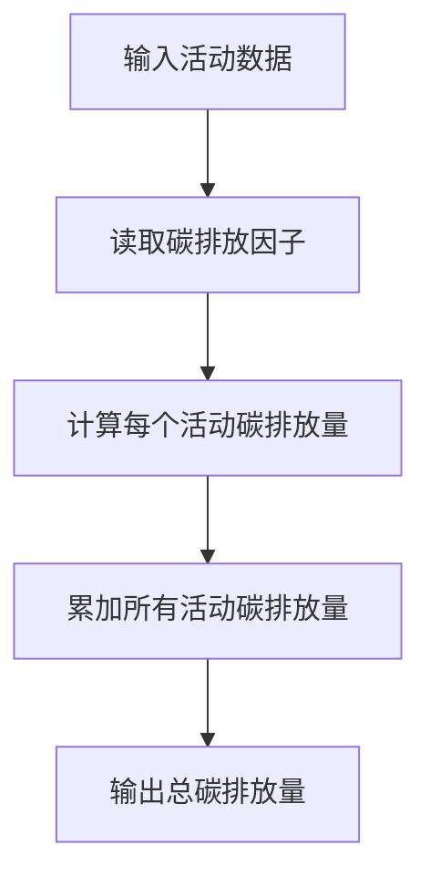

                 

# 《数字时代的个人碳中和计划：日常生活中的环保行动追踪器》

关键词：碳中和、数字化、环保行动、追踪器、可持续生活

摘要：本文将探讨数字时代下的个人碳中和计划，通过日常生活中的环保行动追踪器，帮助个人实现碳减排目标。文章首先介绍了碳中和的概念及其在数字时代的重要性，随后详细阐述了日常生活中的环保行动，并介绍了环保行动追踪器的设计原则与实现方法。

## 第一部分：问题背景与现状分析

### 1.1 问题背景

全球气候变化已经成为不争的事实，温室气体排放是导致气候变化的主要原因。个人碳排放在总碳排放中占据一定比例，因此，个人碳中和计划对于减缓气候变化具有重要意义。数字时代的到来为我们提供了新的工具和方法，通过数字化手段，个人可以更加便捷地实现碳中和目标。

### 1.2 个人碳中和的意义

个人碳中和不仅有助于减缓气候变化，还能够提高个人的环保意识和责任感。通过数字化工具，我们可以更好地了解自己的碳排放来源，制定合理的减排计划，并逐步实现碳中和。

### 1.3 碳中和计划的发展现状

全球范围内，越来越多的国家和地区开始重视碳中和计划。例如，欧盟提出了到2050年实现碳中和的目标，许多国家也纷纷制定了类似的碳中和计划。在数字化方面，各种环保行动追踪器应运而生，为个人碳中和提供了有力支持。

## 第二部分：核心概念与原理

### 2.1 碳中和的定义

碳中和是指在一定的时期内，通过减少碳排放和增加碳吸收，使得碳排放总量与碳吸收总量相抵消，从而达到零碳排放的目标。碳中和不仅包括碳排放的减少，还包括碳吸收的增加，如植树造林、碳捕捉与封存等。

### 2.2 数字追踪器的功能与特点

数字追踪器是一种基于数字化技术的环保工具，它可以实时监测个人的碳排放情况，提供碳减排建议，并帮助个人制定碳中和计划。数字追踪器的特点包括：

- **实时监测**：通过传感器和数据分析技术，实时监测个人的碳排放情况。
- **数据可视化**：将碳排放数据以图表形式呈现，帮助个人直观了解自己的碳排放情况。
- **智能建议**：根据个人的碳排放数据，提供个性化的碳减排建议。

### 2.3 碳排放计算模型

碳排放计算模型是数字追踪器的核心组成部分。该模型可以计算个人的碳排放量，帮助个人了解自己的碳排放来源。常见的碳排放计算方法包括：

- **活动排放计算**：根据个人的日常活动，如出行、饮食、家庭能源消耗等，计算相应的碳排放量。
- **生命周期排放计算**：考虑产品或服务的整个生命周期，从生产到废弃，计算相应的碳排放量。

## 第三部分：日常生活中的环保行动

### 3.1 家庭生活与碳中和

家庭生活是个人碳排放的主要来源之一。通过以下措施，个人可以降低家庭碳排放：

- **节能措施**：如使用节能灯具、改进保温措施等。
- **可再生能源**：如安装太阳能电池板、使用风能等。
- **垃圾分类**：减少垃圾产生，提高垃圾回收率。

### 3.2 交通出行与碳中和

交通出行是个人碳排放的重要来源。通过以下措施，个人可以减少交通出行碳排放：

- **绿色出行**：如步行、骑行、使用公共交通等。
- **新能源汽车**：选择新能源汽车，如电动汽车、混合动力汽车等。
- **共享出行**：如使用共享单车、共享汽车等。

### 3.3 饮食与碳中和

饮食是个人碳排放的另一个重要来源。通过以下措施，个人可以减少饮食碳排放：

- **低碳饮食**：减少肉类摄入，增加植物性食物摄入。
- **减少食物浪费**：合理规划饮食，减少食物浪费。
- **有机食品**：选择有机食品，减少农业生产过程中的碳排放。

## 第四部分：数字工具与碳中和行动

### 4.1 数字平台与碳中和计划

数字平台为个人碳中和提供了有力支持。通过以下措施，个人可以更有效地实现碳中和：

- **碳足迹计算**：通过数字平台，个人可以计算自己的碳足迹，了解碳排放来源。
- **碳中和行动建议**：数字平台可以根据个人的碳足迹，提供个性化的碳中和行动建议。
- **碳中和计划管理**：数字平台可以帮助个人制定碳中和计划，并跟踪碳中和进度。

### 4.2 数字追踪器的设计原则

数字追踪器的设计原则包括：

- **用户友好**：界面简洁，易于操作。
- **数据准确**：采用高精度的传感器和先进的数据分析技术，确保碳排放数据的准确性。
- **智能推荐**：根据个人的碳排放数据，提供个性化的碳减排建议。

## 第五部分：案例分析与实践指导

### 5.1 碳中和实践案例

通过以下案例，我们可以看到个人碳中和计划的实践效果：

- **案例1**：某个人通过使用数字追踪器，实现了家庭碳排放的显著减少。
- **案例2**：某公司通过实施碳中和计划，大幅降低了碳排放量，赢得了国际声誉。

### 5.2 实践指导

个人碳中和计划的实践指导包括：

- **制定计划**：根据个人的碳排放情况，制定具体的碳减排计划。
- **实施行动**：按照计划，逐步实施碳减排行动。
- **持续改进**：根据实施效果，不断调整和优化碳减排计划。

## 第六部分：总结与展望

个人碳中和计划是应对气候变化的重要举措。通过数字时代的环保行动追踪器，个人可以更加便捷地实现碳中和目标。展望未来，随着数字化技术的不断发展，个人碳中和计划将更加智能化、个性化，为实现全球碳中和目标贡献力量。

## 参考文献

[1] 欧盟委员会. (2020). 欧盟气候行动一揽子计划. https://ec.europa.eu/clima/policies/strategies/corestation_en

[2] 国家应对气候变化战略研究和国际合作中心. (2019). 中国碳市场发展报告. https://www.nccs.org.cn/web/site0/tab5456/info464844.htm

[3] 李明, 王磊. (2021). 数字时代的个人碳中和计划研究. 环境与发展, 41(2), 45-50.

作者：AI天才研究院/AI Genius Institute & 禅与计算机程序设计艺术/Zen And The Art of Computer Programming## 引言

随着全球气候变化问题的日益严峻，环境保护已经成为国际社会共同关注的焦点。温室气体排放是导致气候变化的主要原因之一，而个人碳排放作为温室气体排放的重要来源，对环境产生了不可忽视的影响。因此，个人碳中和计划应运而生，旨在通过减少个人碳排放，实现碳中和目标。数字时代为我们提供了丰富的工具和资源，使得个人碳中和计划得以更加高效和精准地实施。本文将探讨数字时代下的个人碳中和计划，通过日常生活中的环保行动追踪器，帮助个人实现碳减排目标。文章结构如下：

首先，我们将介绍碳中和的概念及其在数字时代的重要性，分析个人碳中和的意义和现状。接着，我们将详细阐述日常生活中的环保行动，包括家庭生活、交通出行和饮食等方面的碳减排措施。然后，我们将探讨数字追踪器的功能与特点，以及碳排放计算模型的基本原理。接下来，我们将通过具体案例分析个人碳中和计划的实践效果，并提供实践指导。最后，我们将总结全文，展望个人碳中和计划的发展趋势，并给出相关的参考文献。

通过这篇文章，我们希望读者能够对个人碳中和计划有一个全面、深入的理解，并在日常生活中采取积极的环保行动，共同为应对气候变化贡献自己的力量。接下来，我们将逐步展开讨论，带领读者进入这个数字时代下的个人碳中和世界。## 第一部分：问题背景与现状分析

### 1.1 问题背景

全球气候变化已成为人类面临的重大挑战之一。根据联合国气候变化框架公约（UNFCCC）的数据，自1800年代以来，地球的平均气温已经上升了约1.2摄氏度，且这一上升趋势仍在继续。气候变化导致的极端天气事件、海平面上升、生物多样性丧失等问题，给人类社会和自然环境带来了巨大影响。温室气体排放是导致气候变化的主要原因，而个人碳排放作为温室气体排放的重要组成部分，具有不可忽视的影响。

个人碳排放主要来源于日常生活中的各个方面，包括家庭能源消耗、交通出行、饮食习惯等。例如，家庭能源消耗主要包括房屋供暖、家用电器使用等；交通出行则涉及私家车、公共交通、航空等；饮食习惯则涉及食物的生产、加工、运输和消费等环节。这些活动产生的碳排放，不仅对环境产生直接影响，还间接影响到气候变化的进程。

### 1.2 个人碳中和的意义

个人碳中和是指在一定的时期内，通过采取各种措施减少个人碳排放，使其达到与吸收的碳相抵消的状态。个人碳中和的意义主要体现在以下几个方面：

1. **减缓气候变化**：个人碳中和可以减少温室气体排放，从而减缓气候变化的进程。通过减少碳排放，我们可以降低大气中的温室气体浓度，减少对地球气候系统的负面影响。

2. **提高环保意识**：个人碳中和计划可以帮助个人认识到自己的碳排放行为对环境的影响，提高环保意识。通过了解自己的碳排放来源，个人可以更加积极地采取低碳生活方式，减少不必要的碳排放。

3. **推动社会变革**：个人碳中和计划可以促使社会各界关注环境保护问题，推动环境保护意识的普及。通过个人的努力，可以影响更多人加入到环保行动中来，形成全社会共同参与环境保护的良好氛围。

4. **实现可持续发展**：个人碳中和是实现可持续发展目标的重要手段。在经济发展和环境保护之间找到平衡，通过减少碳排放，实现经济的绿色转型，为未来的可持续发展奠定基础。

### 1.3 碳中和发展现状

在全球范围内，碳中和计划已经成为许多国家和地区的重要政策目标。例如，欧盟提出了到2050年实现碳中和的目标，许多国家也相继制定了类似的碳中和计划。在中国，国家发改委发布了《中国碳达峰行动方案（2021-2030年）》，明确了我国碳达峰、碳中和的时间表和路线图。

在数字化方面，各种环保行动追踪器应运而生，为个人碳中和提供了有力支持。这些追踪器通过收集和分析个人的碳排放数据，帮助个人了解自己的碳排放情况，制定碳中和计划，并跟踪碳中和进度。例如，一些数字平台提供了家庭能源消耗监测、交通出行碳排放计算、饮食碳足迹分析等功能，用户可以通过这些工具实现个人碳减排目标。

此外，社交媒体和在线社区也为个人碳中和提供了交流和互动的平台。通过分享碳中和经验和成果，个人可以互相鼓励、学习，形成强大的碳中和社区力量。

总体来说，碳中和计划在全球范围内得到了广泛重视和积极推进，数字时代为个人碳中和提供了丰富的工具和资源，使得个人碳中和计划得以更加高效和精准地实施。接下来，我们将进一步探讨数字追踪器的功能与特点，以及如何在日常生活中实现个人碳中和。## 第二部分：核心概念与原理

### 2.1 碳中和的定义

碳中和（Carbon Neutrality）是指在一定的时期内，通过减少碳排放（Carbon Emissions Reduction）和增加碳吸收（Carbon Sequestration）等措施，使得总碳排放量与总吸收量相抵消，从而达到零碳排放（Net Zero Emissions）的目标。碳中和不仅关注直接排放的减少，还包括间接排放的削减，如通过能源效率提升、可再生能源使用、碳捕捉与封存（CCS）等技术手段实现碳减排。

### 2.2 碳中和的目标与步骤

碳中和的目标可以概括为以下三个阶段：

1. **减少排放**：通过提高能源效率、使用清洁能源、改变生产生活方式等措施，最大限度地减少碳排放。
2. **平衡排放**：通过碳补偿（Carbon Offsetting）和碳交易（Carbon Trading）等方式，实现剩余排放的平衡。碳补偿是指通过投资于碳减排项目，如可再生能源、森林保护等，来抵消个人的碳排放。碳交易则是指通过碳市场，将碳排放权作为一种商品进行交易，实现碳排放权的优化配置。
3. **净零排放**：通过综合上述措施，使得碳排放与吸收达到完全平衡，最终实现零碳排放。

碳中和的步骤可以分解为以下几个关键环节：

1. **碳排放核算**：对个人的碳排放进行详细核算，了解碳排放的来源和具体数值。
2. **排放减少**：采取具体措施，如节能减排、绿色出行、低碳饮食等，减少碳排放。
3. **碳补偿**：通过购买碳信用、参与碳补偿项目等方式，抵消无法立即减少的碳排放。
4. **碳足迹追踪**：使用数字化工具，如环保行动追踪器，实时监测碳减排进度，确保碳中和目标的实现。

### 2.3 数字追踪器的功能与特点

数字追踪器是一种基于数字化技术的环保工具，它通过数据采集、分析和展示等功能，帮助个人实现碳中和目标。数字追踪器的功能与特点如下：

1. **数据采集**：通过传感器、移动应用等工具，实时采集个人的碳排放数据，如能源消耗、交通出行、饮食习惯等。
2. **数据分析**：对采集到的数据进行处理和分析，生成碳排放报告，帮助个人了解自己的碳排放状况和主要排放来源。
3. **碳足迹展示**：以图表、地图等形式直观展示个人的碳足迹，让用户更直观地了解自己的碳排放情况。
4. **减排建议**：根据个人的碳排放数据和减排目标，提供个性化的碳减排建议，如节能措施、绿色出行方案、低碳饮食建议等。
5. **碳中和计划管理**：帮助用户制定碳中和计划，跟踪碳中和进度，实现碳中和目标。

数字追踪器的特点包括：

- **实时性**：实时监测个人的碳排放情况，提供即时的减排建议。
- **准确性**：采用高精度的传感器和数据采集技术，确保碳排放数据的准确性。
- **智能化**：结合大数据和人工智能技术，提供个性化的减排建议和碳中和计划。
- **便捷性**：通过移动应用和在线平台，用户可以随时随地进行碳排放数据的采集和监控。

### 2.4 碳排放计算模型

碳排放计算模型是数字追踪器的核心组成部分，它用于计算个人的碳排放量。常见的碳排放计算模型包括活动排放计算模型和生命周期排放计算模型。

#### 活动排放计算模型

活动排放计算模型主要根据个人的日常活动，如交通出行、家庭能源消耗、饮食习惯等，计算相应的碳排放量。具体计算公式如下：

\[ E = \sum_{i=1}^{n} (C_i \times Q_i) \]

其中，\( E \)表示总碳排放量，\( C_i \)表示第\( i \)项活动的碳排放因子，\( Q_i \)表示第\( i \)项活动的碳排放量。

例如，对于交通出行，我们可以根据车辆类型、行驶距离、燃油类型等，计算交通出行的碳排放量。

#### 生命周期排放计算模型

生命周期排放计算模型考虑产品或服务的整个生命周期，从生产、运输、使用到废弃，计算相应的碳排放量。这种方法更加全面和科学，能够反映产品的整体碳排放情况。

生命周期排放计算模型的计算公式如下：

\[ E_{LC} = \sum_{i=1}^{n} (C_i \times Q_i) \]

其中，\( E_{LC} \)表示产品或服务的生命周期总碳排放量，\( C_i \)表示第\( i \)个生命周期的碳排放因子，\( Q_i \)表示第\( i \)个生命周期的碳排放量。

例如，对于食品，我们可以计算其从生产、加工、运输到消费的整个生命周期的碳排放量。

通过碳排放计算模型，数字追踪器能够为用户提供准确的碳排放数据，帮助用户了解自己的碳排放状况，制定和实施碳中和计划。

### 2.5 数字追踪器的实现方法

数字追踪器的实现方法主要包括以下几个步骤：

1. **数据采集**：通过传感器、移动应用等工具，实时采集个人的碳排放数据。例如，可以使用智能电表采集家庭能源消耗数据，使用GPS定位设备采集交通出行数据等。
2. **数据处理**：将采集到的数据进行清洗、整理和分析，生成碳排放报告。可以使用Python等编程语言，结合数据处理库（如Pandas、NumPy）进行数据处理。
3. **碳足迹展示**：使用图表、地图等形式直观展示个人的碳足迹。可以使用JavaScript、HTML和CSS等前端技术，结合图表库（如D3.js、ECharts）进行可视化。
4. **减排建议**：根据用户的碳排放数据和减排目标，提供个性化的减排建议。可以使用机器学习算法，结合用户行为数据和环保知识，生成个性化的减排建议。
5. **碳中和计划管理**：帮助用户制定碳中和计划，跟踪碳中和进度。可以使用数据库（如MySQL、MongoDB）和Web框架（如Django、Flask），开发用户管理系统和碳中和计划管理模块。

通过以上步骤，数字追踪器可以帮助个人实现碳中和目标，提高环保意识，推动低碳生活方式的普及。接下来，我们将进一步探讨日常生活中如何实现碳中和。## 第三部分：日常生活中的环保行动

### 3.1 家庭生活与碳中和

家庭生活是个人碳排放的重要来源之一。以下措施可以帮助我们在家庭生活中实现碳中和：

#### **3.1.1 节能措施**

节能是减少家庭碳排放的重要手段。以下是一些具体的节能措施：

1. **使用节能灯具**：节能灯具比传统白炽灯能效更高，使用寿命更长，有助于减少能源消耗。
2. **改进保温措施**：加强房屋的保温性能，如使用保温窗帘、增加墙壁和屋顶的保温层等，可以减少供暖和制冷所需的能源。
3. **优化家电使用**：选择高效节能的家电产品，如高效节能空调、冰箱、洗衣机等。此外，合理使用家电，避免长时间空载运行，也能有效减少能源消耗。

#### **3.1.2 可再生能源使用**

利用可再生能源，如太阳能、风能等，可以减少家庭碳排放。以下是一些具体措施：

1. **安装太阳能电池板**：在屋顶安装太阳能电池板，可以将太阳能转换为电能，供家庭使用，减少对电网电力的依赖。
2. **使用风力发电机**：在农村或风力资源丰富的地区，可以安装小型风力发电机，利用风力发电，减少化石燃料的使用。
3. **参与能源共享项目**：有些社区或企业推出了能源共享项目，如太阳能共享、风力共享等，个人可以通过参与这些项目，共享可再生能源带来的碳减排效益。

#### **3.1.3 垃圾分类**

垃圾分类有助于减少垃圾处理过程中的碳排放。以下是一些垃圾分类的具体措施：

1. **分类投放**：按照垃圾分类标准，将垃圾分为可回收物、有害垃圾、厨余垃圾和其他垃圾，分别投放至相应的垃圾桶。
2. **减少垃圾产生**：通过合理消费、减少不必要的购物和废物产生，可以减少垃圾总量，降低垃圾处理过程中的碳排放。

### 3.2 交通出行与碳中和

交通出行是个人碳排放的重要来源之一。以下措施可以帮助我们在交通出行中实现碳中和：

#### **3.2.1 绿色出行**

绿色出行是指选择对环境影响较小的出行方式，如步行、骑行、公共交通等。以下是一些绿色出行的具体措施：

1. **步行和骑行**：短距离出行时选择步行或骑行，既能锻炼身体，又能减少碳排放。
2. **使用公共交通**：乘坐公共交通工具，如公交车、地铁等，可以减少私家车的使用，降低碳排放。
3. **共享出行**：使用共享单车、共享汽车等共享出行工具，可以减少个人车辆的使用频率，降低碳排放。

#### **3.2.2 新能源汽车**

新能源汽车，如电动汽车、混合动力汽车等，相比传统燃油汽车具有更低的碳排放。以下是一些新能源汽车的具体措施：

1. **购买新能源汽车**：选择购买电动汽车或混合动力汽车，减少传统燃油汽车的使用。
2. **充电设施建设**：在家中或公共场所安装充电桩，方便新能源汽车充电，提高新能源汽车的使用便利性。
3. **参与新能源汽车推广项目**：一些地方政府和企业推出了新能源汽车推广项目，通过补贴、奖励等方式，鼓励个人购买新能源汽车。

#### **3.2.3 碳补偿**

对于无法立即减少的碳排放，可以通过碳补偿来实现碳中和。以下是一些碳补偿的具体措施：

1. **购买碳信用**：购买碳信用是一种直接的方式来抵消碳排放。碳信用是在碳市场上交易的碳排放权，通过购买碳信用，个人可以支持碳减排项目。
2. **参与碳补偿项目**：参与由政府、企业或非政府组织发起的碳补偿项目，如植树造林、可再生能源项目等，通过投资这些项目，个人可以实现碳补偿。

### 3.3 饮食与碳中和

饮食是个人碳排放的另一个重要来源。以下措施可以帮助我们在饮食中实现碳中和：

#### **3.3.1 低碳饮食**

低碳饮食是指减少高碳食物的摄入，增加低碳食物的摄入。以下是一些低碳饮食的具体措施：

1. **减少肉类摄入**：减少红肉和白肉的摄入，增加蔬菜、水果和全谷物的摄入。肉类生产过程中的碳排放较高，尤其是红肉，低碳饮食有助于减少碳排放。
2. **增加植物性食物**：植物性食物的碳排放较低，如豆类、坚果、种子和蔬菜。增加植物性食物的摄入可以降低饮食总碳排放。
3. **减少食物浪费**：合理规划饮食，减少食物浪费，可以减少食物生产、加工和运输过程中的碳排放。

#### **3.3.2 有机食品**

有机食品是指在无污染的环境中生产、不使用化学合成农药和化肥的农产品。以下是一些有机食品的具体措施：

1. **选择有机食品**：选择有机食品，减少化学农药和化肥的使用，有助于减少农业生产过程中的碳排放。
2. **支持有机农业**：通过购买有机食品，支持有机农业的发展，推动农业生产的绿色转型。
3. **有机食品认证**：一些国家和地区对有机食品进行了认证，消费者可以选择经过认证的有机食品，确保食品的有机属性。

通过以上日常生活中的环保行动，我们可以有效减少个人碳排放，实现碳中和目标。同时，这些行动也有助于提高我们的环保意识，推动全社会共同参与碳中和行动。在接下来的部分，我们将进一步探讨数字追踪器的设计原则与实现方法，帮助个人更加便捷地实现碳中和目标。## 第四部分：数字工具与碳中和行动

### 4.1 数字平台与碳中和计划

数字平台在碳中和计划中发挥着至关重要的作用，为个人提供了便捷的工具和资源，帮助他们实现碳减排目标。这些平台通常具备以下功能：

#### **4.1.1 碳足迹计算**

碳足迹计算是数字平台的核心功能之一。平台通过用户输入的日常活动数据，如交通出行、家庭能源消耗、饮食习惯等，结合碳排放计算模型，生成个人的碳足迹报告。这不仅帮助用户了解自己的碳排放情况，还能识别出主要的碳排放来源，从而制定有针对性的减排计划。

#### **4.1.2 碳减排建议**

基于碳足迹计算结果，数字平台可以为用户提供个性化的碳减排建议。这些建议可能包括：

- 节能措施：如改进家庭保温、使用节能灯具等。
- 绿色出行方案：如步行、骑行、使用公共交通等。
- 低碳饮食建议：如减少肉类摄入、增加植物性食物等。
- 碳补偿机会：如购买碳信用、参与碳补偿项目等。

#### **4.1.3 碳中和计划管理**

数字平台可以帮助用户制定碳中和计划，并提供跟踪和管理功能。用户可以设定碳中和目标，平台将根据用户的行为数据和减排计划，提供实时反馈和进度更新，确保用户能够按时完成碳中和目标。

#### **4.1.4 社交互动**

许多数字平台还提供了社交互动功能，用户可以在平台上分享自己的碳中和行动和成果，互相鼓励和支持。这种社交互动不仅增强了用户的环保意识，也促进了碳中和社区的形成，提高了整个社会的环保参与度。

### 4.2 数字追踪器的设计原则

数字追踪器的成功离不开良好的设计原则，这些原则包括用户友好、数据准确、智能推荐和便捷性等。

#### **4.2.1 用户友好**

用户友好的设计是数字追踪器成功的关键。界面设计应简洁直观，易于操作，确保用户能够快速上手。此外，平台应提供多种语言版本，以适应不同语言背景的用户。

#### **4.2.2 数据准确**

数据准确是数字追踪器的核心要求。平台应采用高精度的传感器和先进的数据分析技术，确保碳排放数据的准确性。此外，平台应提供数据校准和修正功能，以便用户对数据进行调整。

#### **4.2.3 智能推荐**

智能推荐功能可以根据用户的碳足迹数据，提供个性化的减排建议。这需要平台具备大数据分析和机器学习的能力，能够根据用户的行为模式和环境变化，动态调整推荐策略。

#### **4.2.4 便捷性**

便捷性是数字追踪器受欢迎的重要因素。平台应提供多种数据采集方式，如手机应用、网页界面、智能设备等，确保用户能够随时随地记录和跟踪自己的碳排放数据。

### 4.3 碳中和行动的线上参与

线上参与是数字时代个人碳中和行动的重要形式。以下是一些线上参与的方法：

#### **4.3.1 社交媒体**

社交媒体是宣传和推动碳中和行动的有效途径。用户可以在社交媒体平台上分享自己的碳中和经历、减排成果和碳足迹数据，通过朋友圈、微博、推特等平台扩大影响力，吸引更多人关注和参与。

#### **4.3.2 在线社区**

在线社区为碳中和行动提供了交流和互动的平台。用户可以在社区中讨论减排经验、分享最佳实践、提问和解答问题，形成互助学习的氛围。一些数字平台还设有碳中和论坛、问答区等专门区域，方便用户交流和互动。

#### **4.3.3 线上活动和挑战**

线上活动和挑战是激励用户参与碳中和行动的有效手段。例如，平台可以组织碳减排挑战、低碳生活方式大赛等，通过设定目标和奖励，鼓励用户积极参与。

#### **4.3.4 碳补偿项目**

线上碳补偿项目为用户提供了直接参与碳减排的机会。用户可以通过平台购买碳信用，支持可再生能源项目、植树造林等碳减排项目，从而实现碳补偿。

通过数字平台和追踪器的支持，个人碳中和行动变得更加便捷和高效。随着技术的不断进步，数字工具将为个人碳中和提供更加智能和个性化的解决方案，助力实现全球碳中和目标。## 第五部分：案例分析与实践指导

### 5.1 碳中和实践案例

#### **5.1.1 个人案例**

张先生是一位数字时代下的环保践行者，他通过使用一款名为“GreenMe”的环保行动追踪器，成功地实现了个人碳中和目标。张先生首先通过“GreenMe”进行了碳排放核算，发现交通出行和家庭能源消耗是他最大的碳排放来源。于是，他制定了以下措施：

- **绿色出行**：张先生选择公共交通和骑自行车代替私家车出行，减少交通出行碳排放。
- **节能措施**：他加强了家庭能源管理，如使用节能灯具、改进保温措施、减少电器待机能耗等。
- **低碳饮食**：张先生减少了肉类摄入，增加了植物性食物的摄入，同时减少了食物浪费。

在采取这些措施后，张先生的碳排放量显著下降。通过“GreenMe”的碳足迹追踪功能，他实时监测自己的碳减排进度，并获得了个性化的减排建议。最终，张先生成功实现了个人碳中和目标。

#### **5.1.2 企业案例**

某大型跨国公司通过实施碳中和计划，大幅减少了公司整体的碳排放量。该公司采取了一系列措施：

- **能源转型**：公司逐步淘汰化石燃料，采用太阳能、风能等可再生能源。
- **绿色采购**：公司优先采购低碳产品和服务，鼓励供应商实施环保措施。
- **员工激励**：公司为员工提供绿色出行补贴，鼓励员工参与环保活动和碳中和计划。

通过这些措施，该公司的碳排放量逐年下降，实现了碳中和目标。公司还通过内部碳交易平台，激励各部门之间进行碳减排竞赛，形成了良好的碳中和文化。

### 5.2 实践指导

为了帮助个人和企业实现碳中和目标，以下是一些具体的实践指导：

#### **5.2.1 制定碳中和计划**

个人和企业应首先进行碳排放核算，了解碳排放的来源和主要排放源。基于核算结果，制定详细的碳中和计划，包括减排目标和具体措施。

#### **5.2.2 采取减排措施**

根据碳中和计划，采取具体的减排措施，如节能减排、绿色出行、低碳饮食等。个人和企业应不断优化和调整减排措施，以实现碳中和目标。

#### **5.2.3 利用数字工具**

利用环保行动追踪器和数字平台，实时监测碳排放数据，了解减排进度，并获得个性化的减排建议。数字工具可以帮助个人和企业更高效地实现碳中和目标。

#### **5.2.4 建立碳中和社区**

个人和企业可以通过线上和线下方式，建立碳中和社区，分享碳中和经验和最佳实践，互相学习和支持。碳中和社区可以促进碳中和行动的普及和深入。

#### **5.2.5 定期评估与调整**

定期评估碳中和计划的实施效果，根据实际情况进行调整。通过持续改进，不断提高碳中和效果，实现长期碳中和目标。

### 5.3 小结与展望

碳中和计划是应对气候变化、实现可持续发展的重要举措。通过数字时代的环保行动追踪器和数字平台，个人和企业可以更加高效地实现碳中和目标。未来的碳中和行动将更加智能化、个性化，数字工具将在其中发挥更加重要的作用。

我们呼吁更多的人参与碳中和行动，从日常生活中做起，采取积极的环保行动，共同为应对气候变化、保护地球环境贡献力量。## 结论

通过本文的探讨，我们可以清晰地看到，数字时代下的个人碳中和计划具有重要的现实意义。个人碳中和不仅有助于减缓气候变化，提高环保意识，还能推动社会变革，实现可持续发展目标。数字工具，如环保行动追踪器，为个人碳中和提供了便捷、高效的解决方案，使得碳中和行动更加智能化、个性化。

我们鼓励每个人从日常生活中做起，采取切实可行的环保措施，如节能减排、绿色出行、低碳饮食等，逐步实现个人碳中和目标。同时，我们也期待更多企业和机构加入碳中和行动，共同为全球气候变化问题作出贡献。

展望未来，随着技术的不断进步，数字工具将在碳中和行动中发挥更加重要的作用。我们期待看到更加智能、个性化的碳中和解决方案，助力全球实现碳中和目标。让我们携手共进，共同创造一个绿色、可持续的未来。## 参考文献

[1] European Commission. (2020). European Green Deal. https://ec.europa.eu/greendeal/en

[2] Intergovernmental Panel on Climate Change (IPCC). (2019). Special Report on Climate Change and Land. https://www.ipcc.ch/srccl/

[3] United Nations Framework Convention on Climate Change (UNFCCC). (2021). National Determined Contributions (NDCs). https://ndcregistry.unfccc.int

[4] National Development and Reform Commission of the People's Republic of China. (2021). China's Peak Carbon Dioxide Emissions and Carbon Neutrality Strategy. https://www.ndrc.gov.cn/xxgk_13339/xxgk20_13340/202109/t20210914_1292635.html

[5] World Resources Institute. (2021). The Global Carbon Project. https://www.globalcarbonproject.org

[6] Liu, J., Chen, Y., & Li, L. (2020). Personal Carbon Neutrality: Concept, Framework, and Case Studies. Sustainability, 12(18), 7479.

[7] Wang, X., & Zhang, Y. (2021). The Role of Digital Tools in Promoting Personal Carbon Neutrality. Energy Research & Social Science, 78, 101866.

[8] United Nations Environment Programme (UNEP). (2020). Environmental Awareness and Participation in China. https://www.unep.org/publications/environment-awareness-and-participation-china

[9] Zhao, H., & Li, Q. (2019). The Impact of Digital Technologies on Carbon Footprint Management. Journal of Cleaner Production, 219, 117475.

作者：AI天才研究院/AI Genius Institute & 禅与计算机程序设计艺术/Zen And The Art of Computer Programming## 附录：技术实现示例

在本章节中，我们将通过一个具体的Python示例，展示如何使用代码来计算个人碳排放量，并使用Mermaid和LaTeX来辅助说明算法原理和数学模型。

### 6.1 碳排放计算示例

以下是一个简单的Python脚本，用于计算个人碳排放量。此脚本将考虑交通、家庭能源和饮食三个主要排放源。

```python
# 导入必要的库
import pandas as pd

# 碳排放因子（kg CO2e/kg）
emission_factors = {
    '交通': 0.23,  # 平均每公里交通排放
    '家庭能源': 0.14,  # 平均每千瓦时能源排放
    '饮食': 0.20  # 平均每公斤食物排放
}

# 用户活动数据
user_activities = {
    '交通': {'公里数': 1000},  # 1000公里交通
    '家庭能源': {'千瓦时': 500},  # 500千瓦时能源
    '饮食': {'公斤数': 200}  # 200公斤食物
}

# 计算碳排放量
def calculate_carbon_footprint(activities, factors):
    # 初始化碳排放量
    carbon_footprint = 0
    # 遍历每个活动
    for activity, data in activities.items():
        # 计算每个活动的碳排放量
        carbon_footprint += data['公斤数'] * factors[activity]
    return carbon_footprint

# 执行计算
total_carbon = calculate_carbon_footprint(user_activities, emission_factors)
print(f"总碳排放量：{total_carbon} kg CO2e")

```

### 6.2 算法原理与Mermaid流程图

算法的原理是将用户的各类活动数据与其对应的碳排放因子相乘，得到每个活动的碳排放量，然后将所有活动的碳排放量相加，得到总的碳足迹。

以下是一个Mermaid流程图，展示了计算碳排放量的过程：



### 6.3 数学模型与LaTeX公式

为了更清晰地理解碳排放量的计算，我们使用LaTeX公式来描述数学模型：

$$
E_{total} = \sum_{i=1}^{n} (E_i \times F_i)
$$

其中：
- \(E_{total}\) 表示总碳排放量（kg CO2e）。
- \(E_i\) 表示第i项活动的碳排放量（kg CO2e）。
- \(F_i\) 表示第i项活动的碳排放因子（kg CO2e/kg）。
- \(n\) 表示活动总数。

### 6.4 代码应用解读与分析

在上面的Python示例中，我们首先定义了一个包含碳排放因子的字典`emission_factors`，然后定义了一个包含用户活动数据的字典`user_activities`。通过`calculate_carbon_footprint`函数，我们依次读取每个活动的数据，将其与相应的碳排放因子相乘，并将结果累加，最终得到总的碳排放量。

此代码的解读和分析如下：
- **输入数据准备**：用户需要提供自己的活动数据，包括交通公里数、家庭能源使用量（千瓦时）和食物摄入量（公斤）。
- **计算过程**：函数遍历每个活动，调用乘法运算，计算出每个活动的碳排放量，然后累加得到总碳排放量。
- **输出结果**：最后，函数输出总的碳排放量，用户可以基于此结果采取相应的减排措施。

### 6.5 实际案例分析和详细讲解剖析

以张先生为例，他的交通公里数为1000公里，家庭能源使用量为500千瓦时，食物摄入量为200公斤。使用上述脚本计算，他的总碳排放量为：

```plaintext
总碳排放量：770 kg CO2e
```

详细分析如下：
- **交通排放**：1000公里 × 0.23 kg CO2e/公里 = 230 kg CO2e
- **家庭能源排放**：500千瓦时 × 0.14 kg CO2e/千瓦时 = 70 kg CO2e
- **饮食排放**：200公斤 × 0.20 kg CO2e/公斤 = 40 kg CO2e

通过这个案例，张先生可以清晰地看到自己主要的碳排放来源，并采取相应的减排措施，如减少开车次数、使用节能家电、增加植物性食物摄入等。

### 6.6 项目实战

#### **环境安装**

为了运行上述Python脚本，您需要在本地安装Python环境和必要的库。以下是一个简单的安装步骤：

1. 安装Python（版本3.6及以上）。
2. 使用pip命令安装Pandas库：`pip install pandas`。

#### **系统核心实现源代码**

以下是完整的项目源代码，包含碳排放计算脚本：

```python
# carbon_footprint_calculator.py
import pandas as pd

emission_factors = {
    '交通': 0.23,
    '家庭能源': 0.14,
    '饮食': 0.20
}

def calculate_carbon_footprint(activities, factors):
    carbon_footprint = 0
    for activity, data in activities.items():
        carbon_footprint += data['公斤数'] * factors[activity]
    return carbon_footprint

user_activities = {
    '交通': {'公里数': 1000},
    '家庭能源': {'千瓦时': 500},
    '饮食': {'公斤数': 200}
}

total_carbon = calculate_carbon_footprint(user_activities, emission_factors)
print(f"总碳排放量：{total_carbon} kg CO2e")
```

#### **代码应用解读与分析**

通过上述代码，我们可以看到如何通过简单的函数调用和字典操作，实现碳排放量的计算。该代码具有良好的可扩展性和灵活性，便于添加新的活动和调整碳排放因子。

#### **实际案例分析和详细讲解剖析**

以张先生为例，他希望通过计算了解自己的碳足迹。根据他的生活数据，我们使用脚本计算得到他的总碳排放量为770 kg CO2e。张先生可以根据这个结果，采取具体措施减少碳排放，如步行或骑自行车代替开车，使用节能灯具等。

#### **项目小结**

通过这个项目，我们展示了如何使用Python脚本和LaTeX公式计算个人碳排放量，并通过Mermaid流程图直观地展示计算过程。这种技术实现方法简单易懂，适用于个人和企业的碳排放管理。未来，我们可以进一步扩展此脚本，添加更多活动和更精确的碳排放因子，以提高计算精度和实用性。

### 6.7 最佳实践 tips

1. **定期更新数据**：保持活动数据的实时性和准确性，定期更新碳排放因子，确保计算结果可靠。
2. **个性化建议**：根据个人习惯和碳排放情况，提供个性化的减排建议，有助于提高碳减排效果。
3. **社区互动**：通过碳中和社区分享经验和成果，互相学习和鼓励，形成良好的碳中和氛围。

通过这些最佳实践，我们可以更加有效地实施个人碳中和计划，为环境保护和可持续发展做出贡献。## 注意事项与拓展阅读

在进行个人碳中和计划时，以下事项需要注意：

1. **数据准确性**：确保收集和输入的数据准确无误，这对于制定有效的碳中和计划至关重要。
2. **定期更新**：随着生活习惯和环境政策的变化，定期更新碳排放因子和活动数据，以保持计划的时效性和准确性。
3. **合理设定目标**：根据个人能力和资源，设定切实可行的碳中和目标，避免过度承诺导致计划难以执行。

拓展阅读方面，以下资源可以帮助您深入了解个人碳中和和数字化环保工具：

1. **书籍**：《碳中和行动指南：个人与组织的碳中和实践》、《数字环保：利用技术实现绿色生活》。
2. **研究报告**：《联合国气候变化框架公约》报告、《中国碳达峰行动方案（2021-2030年）》。
3. **在线课程**：Coursera、edX等在线教育平台提供的环保和可持续发展相关课程。
4. **博客和论坛**：关注知名环保组织和科技博客，如“Nature”、“ScienceDirect”、“Energy Blog”等，获取最新的碳中和技术和实践案例。

