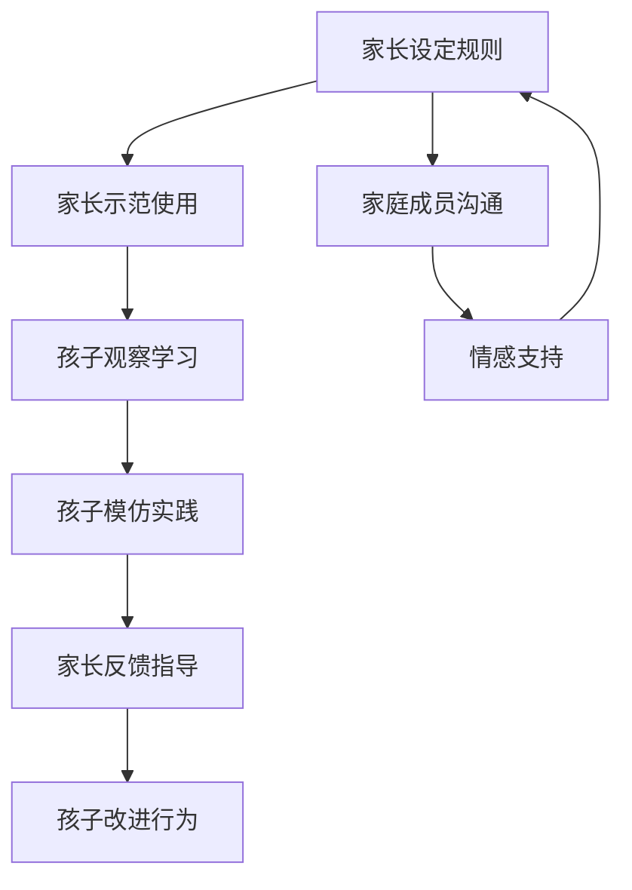
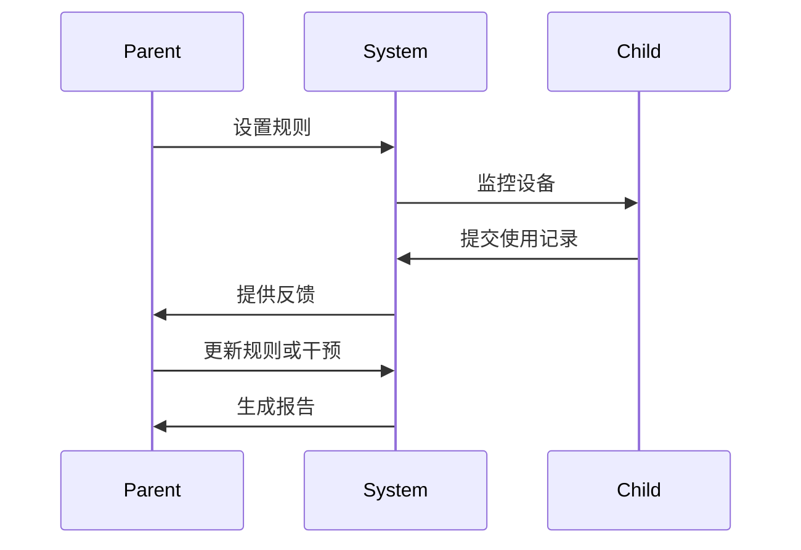
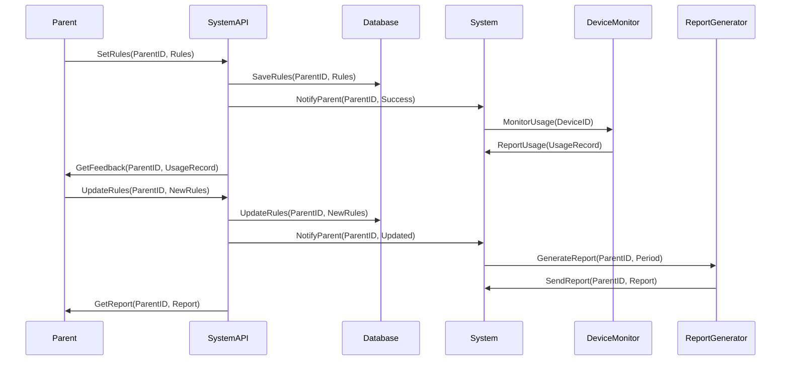

                 

### 引言

在数字时代的背景下，家庭互动的方式和内容发生了巨大的变化。随着智能手机、平板电脑和智能家居设备的普及，孩子们在日常生活中的接触到的数字技术越来越多。家长与孩子之间的亲子关系，也在这种数字化的浪潮中面临着新的挑战和机遇。本文将深入探讨数字时代亲子关系中的家庭互动，通过逻辑清晰的分析和实例解析，为家长们提供一些有价值的策略和建议。

**关键词**：数字时代、亲子关系、家庭互动、科技使用

**摘要**：本文首先介绍了数字时代家庭互动的背景和重要性，然后通过定义核心概念和理论分析，探讨了如何有效地建立和维护亲子关系。接着，文章提出了系统分析和架构设计的方法，并通过实际案例展示了这些方法的实用性和效果。最后，文章总结了最佳实践，为家长提供实用的数字育儿建议，并提出了进一步的研究方向和资源推荐。

在接下来的章节中，我们将逐步探讨以下主题：

1. **核心概念与联系**：定义数字育儿、家庭互动和科技使用的核心概念，并进行对比分析。
2. **理论原则讲解**：详细阐述有效家庭互动的理论基础，并使用流程图和代码示例来解释。
3. **系统分析与架构设计**：介绍项目场景和系统设计，展示领域模型和系统架构图。
4. **项目实战**：通过实际案例展示系统实现和应用效果。
5. **最佳实践与结论**：总结关键点，提出最佳实践建议，并展望未来的研究方向。

让我们一步一步深入探讨这些主题，为家长们提供有深度的指导和帮助。### 核心概念与联系

在数字时代的亲子关系探讨中，有几个核心概念是我们必须了解和定义的。这些概念不仅构成了我们讨论的基础，也为我们提供了一个框架来分析和理解家庭互动中的科技使用。

#### 定义

**1. 数字育儿（Digital Parenting）**

数字育儿是指家长在数字化环境中对孩子进行教育、引导和管理的一种方式。它涵盖了从孩子接触数字设备开始，到家长如何通过这些设备与孩子互动、沟通和监督的整个过程。

**2. 家庭互动（Family Interaction）**

家庭互动指的是家庭成员之间的交流、沟通和相互影响的过程。在数字时代，家庭互动不仅包括面对面的交流，还包括通过数字技术进行的远程交流和互动。

**3. 科技使用（Technology Use）**

科技使用是指家庭成员对数字设备、软件和其他技术工具的使用行为。这包括孩子们的学习、娱乐、社交等方面，以及家长对这些技术的监管和应用。

#### 属性对比

为了更好地理解这些概念，我们可以通过一个对比表格来展示它们的属性特征：

| 概念 | 定义 | 关键属性 |
| --- | --- | --- |
| 数字育儿 | 家长在数字化环境中对孩子进行教育、引导和管理 | 教育性、引导性、监管性 |
| 家庭互动 | 家庭成员之间的交流、沟通和相互影响 | 互动性、沟通性、情感性 |
| 科技使用 | 家庭成员对数字设备、软件和其他技术工具的使用行为 | 使用性、操作性、便捷性 |

#### ER实体关系图

为了更直观地展示这些概念之间的关系，我们可以使用ER（实体-关系）图来建模。

```mermaid
erDiagram
  Family ::>> Parent : "数字育儿"
  Family ::>> Child : "家庭互动"
  Device ||--|{ Parent }|-->> Digital : "科技使用"
  Device ||--|{ Child }|-->> Digital : "科技使用"
  Parent ..|> Child : "监护关系"
  Parent ..|> Device : "设备监管"
  Child ..|> Device : "设备使用"
```

在上面的ER图中，我们可以看到家庭、家长、孩子和数字设备等实体及其相互关系。家长与孩子之间存在监护关系，家长和孩子们都使用数字设备，这些设备是科技使用的载体。

通过明确这些核心概念及其属性特征，我们可以更系统地探讨数字时代亲子关系中的家庭互动，为后续的理论分析和实际应用提供坚实的基础。### 理论原则讲解

在了解了数字育儿、家庭互动和科技使用的核心概念之后，我们需要进一步探讨如何建立有效的亲子关系，从而在数字时代为家庭互动提供理论指导。以下将从理论基础出发，详细阐述有效家庭互动的原则和实践方法。

#### 理论基础

**1. 家庭系统理论**

家庭系统理论认为，家庭成员之间是相互关联、相互影响的，家庭作为一个系统，其整体功能和行为取决于各个组成部分之间的互动。在数字时代，家庭互动的模式和内容发生了变化，但家庭成员之间的相互依赖和影响依然存在。家长作为家庭系统的核心，其行为和决策对家庭互动的质量具有关键影响。

**2. 社会学习理论**

社会学习理论强调，个体通过观察、模仿和反复实践来学习行为和技能。在数字育儿中，家长作为示范者，其使用数字设备的方式和态度会对孩子产生潜移默化的影响。因此，家长应当树立正确的科技使用观念，以身作则，为孩子树立良好的榜样。

**3. 系统思维**

系统思维是一种整体观，它强调理解和分析问题时，要关注系统内部各个组成部分的相互关系和相互作用。在数字育儿中，家长应当从系统的角度来考虑家庭互动，不仅仅关注孩子对科技的使用，还要关注家庭成员之间的沟通、情感和支持。

#### 过程流程

为了更好地实现有效家庭互动，我们可以使用Mermaid流程图来展示一个基本的亲子互动过程模型：



在该模型中，家长首先设定科技使用的规则，并通过示范使用来引导孩子。孩子在这个过程中观察并模仿家长的行为，然后通过实践来巩固学习成果。家长在这个过程中提供反馈和指导，帮助孩子改进行为。同时，家庭成员之间的沟通和情感支持也是确保互动质量的重要环节。

#### Python代码示例

为了更具体地说明这些原则，我们可以使用Python代码来实现一个简单的亲子互动模型，并展示其背后的数学模型和公式。

```python
# Python代码：亲子互动模型实现

# 定义家长和孩子的行为变量
parent_usage = 5  # 家长每日科技使用时间（小时）
child_usage = 3   # 孩子每日科技使用时间（小时）

# 设定互动规则
max_usage = 2     # 家长和孩子的最大科技使用时间（小时）

# 实现互动过程
def interactive_process(parent_usage, child_usage, max_usage):
    while True:
        if parent_usage <= max_usage and child_usage <= max_usage:
            print("家长使用时间：{}小时，孩子使用时间：{}小时。互动良好。".format(parent_usage, child_usage))
            # 家长提供示范
            parent_usage -= 1
            # 孩子观察学习
            child_usage += 0.5
            # 家长反馈指导
            print("家长指导：请适当控制科技使用时间。")
        elif parent_usage > max_usage or child_usage > max_usage:
            print("家长或孩子科技使用时间过长，需要调整。")
            break

# 执行互动过程
interactive_process(parent_usage, child_usage, max_usage)
```

#### 数学模型和公式

在上面的Python代码中，我们使用了简单的数学模型和公式来模拟家长和孩子的互动过程。具体来说，我们用以下公式来描述互动过程中的关键变量：

$$
\text{parent\_usage} = \text{initial\_parent\_usage} - \text{time\_elapsed}
$$

$$
\text{child\_usage} = \text{initial\_child\_usage} + \text{time\_learned}
$$

$$
\text{max\_usage} = \text{maximum\_allowed\_usage}
$$

其中，`initial_parent_usage` 和 `initial_child_usage` 分别表示家长和孩子的初始科技使用时间（小时），`time_elapsed` 表示家长在每次互动中减少的使用时间（小时），`time_learned` 表示孩子每次互动后增加的学习时间（小时），`maximum_allowed_usage` 表示家长和孩子的最大科技使用时间（小时）。

通过这些公式，我们可以更精确地控制家长和孩子的科技使用时间，从而确保互动过程中的平衡和有效。

#### 举例说明

假设家长初始每日科技使用时间为5小时，孩子初始每日科技使用时间为3小时。每次互动过程中，家长会减少1小时的科技使用时间，而孩子会通过观察学习增加0.5小时的科技使用时间。当家长或孩子的科技使用时间达到最大限制时，互动过程会暂停，并提示调整使用时间。

通过这个简单的示例，我们可以看到家长和孩子的科技使用时间是如何在互动过程中动态调整的，从而实现有效的家庭互动。

总之，通过理论基础、过程流程和Python代码示例的详细讲解，我们为家长提供了一个系统的方法来理解和实践有效的数字育儿。这不仅有助于改善亲子关系，还能帮助孩子在数字时代健康成长。### 系统分析与架构设计

为了更好地应对数字时代亲子关系中的挑战，本文将介绍一个具体的项目场景和系统设计，并通过领域模型、系统架构和接口设计等部分，详细阐述如何实现有效的家庭互动管理。

#### 项目场景

在数字时代，许多家长面临着如何平衡孩子对科技设备的依赖和亲子互动质量的问题。本项目的目标是设计一个系统，帮助家长制定和监控孩子的科技设备使用时间，同时促进家庭成员之间的沟通和支持。该系统需要满足以下功能需求：

1. **家长设置科技使用规则**：家长可以设置孩子的每日科技使用时间上限，以及每周的科技使用时间分配。
2. **监控和反馈**：系统实时监控孩子的设备使用情况，并向家长提供反馈，包括科技使用时长、应用使用情况等。
3. **互动记录和报告**：系统记录家庭成员的互动情况，并生成互动报告，帮助家长了解和改善家庭互动质量。
4. **沟通和支持**：系统提供家庭成员之间的沟通工具，方便家长和孩子进行交流和支持。

#### 系统设计

**1. 领域模型（UML类图）**

首先，我们使用Mermaid UML类图来定义系统的领域模型，包括关键实体和它们之间的关系。

```mermaid
classDiagram
  ClassParent --|> ClassChild : "监护"
  ClassDevice --|> ClassApp
  ClassDevice --|> ClassUsage
  ClassReport
  ClassParent << (1)
  ClassChild << (1)
  ClassDevice << (1)
  ClassApp << (1)
  ClassUsage << (1)
  ClassReport << (1)

  ClassParent {
    +str ParentID
    +str Name
    +list ChildIDs
    +set DeviceIDs
  }

  ClassChild {
    +str ChildID
    +str Name
    +set DeviceIDs
  }

  ClassDevice {
    +str DeviceID
    +str Type
    +str Brand
  }

  ClassApp {
    +str AppID
    +str Name
    +str Category
  }

  ClassUsage {
    +str UsageID
    +str DeviceID
    +str AppID
    +datetime StartTime
    +datetime EndTime
    +int Duration
  }

  ClassReport {
    +str ReportID
    +str ParentID
    +str ChildID
    +datetime Period
    +int TotalUsage
    +list AppList
  }
```

在上面的类图中，我们定义了家长（Parent）、孩子（Child）、设备（Device）、应用（App）、使用记录（Usage）和报告（Report）等关键实体及其关系。

**2. 系统架构（序列图）**

接下来，我们使用Mermaid序列图来展示系统的整体架构和主要交互流程。



在该序列图中，家长设置科技使用规则，系统监控孩子的设备使用情况，并收集使用记录。家长可以通过系统获取反馈，并根据需要更新规则或进行干预。系统还会定期生成互动报告，帮助家长了解家庭互动情况。

**3. 系统接口设计**

为了实现系统功能，我们设计了以下主要接口：

- **家长接口**：用于设置和查看孩子的科技使用规则，接收系统反馈和报告。
- **设备接口**：用于监控设备使用情况，接收和存储使用记录。
- **数据接口**：用于收集和分析互动数据，生成报告。

以下是系统的接口设计和交互流程：



在上面的接口设计中，家长通过API接口设置和更新规则，系统通过设备监控接口获取使用记录，并通过数据接口生成和发送报告。

通过上述系统分析和架构设计，我们可以为家长提供一套完整的数字育儿解决方案，帮助他们在数字时代有效地管理和促进亲子关系。### 项目实战

为了更好地展示如何将系统设计应用于实际场景，本文将介绍一个具体的数字育儿系统实现过程，包括环境搭建、核心源代码实现、应用解读与分析，以及一个真实的案例解析。

#### 环境搭建

首先，我们需要搭建一个可以运行数字育儿系统的开发环境。以下是所需的软件和工具：

- **操作系统**：Windows/Linux/MacOS
- **编程语言**：Python 3.8+
- **数据库**：SQLite
- **Web框架**：Flask
- **前端框架**：Bootstrap

确保安装了上述工具后，我们可以开始搭建开发环境。以下是具体的步骤：

1. 安装Python 3.8或更高版本。
2. 安装SQLite数据库。
3. 使用pip安装Flask和Bootstrap。

```bash
pip install flask
pip install flask-bootstrap
```

#### 核心源代码实现

接下来，我们将实现数字育儿系统的核心功能。以下是主要代码段和应用解读：

**1. 数据库模型**

首先，我们需要定义数据库模型，包括家长、孩子、设备和使用记录等实体。

```python
from flask_sqlalchemy import SQLAlchemy

db = SQLAlchemy()

class Parent(db.Model):
    parent_id = db.Column(db.String(50), primary_key=True)
    name = db.Column(db.String(50))
    child_ids = db.Column(db.ARRAY(db.String(50)))
    device_ids = db.Column(db.ARRAY(db.String(50)))

class Child(db.Model):
    child_id = db.Column(db.String(50), primary_key=True)
    name = db.Column(db.String(50))
    device_ids = db.Column(db.ARRAY(db.String(50)))

class Device(db.Model):
    device_id = db.Column(db.String(50), primary_key=True)
    type = db.Column(db.String(50))
    brand = db.Column(db.String(50))

class Usage(db.Model):
    usage_id = db.Column(db.String(50), primary_key=True)
    device_id = db.Column(db.String(50), db.ForeignKey('device.device_id'))
    app_id = db.Column(db.String(50), db.ForeignKey('app.app_id'))
    start_time = db.Column(db.DateTime)
    end_time = db.Column(db.DateTime)
    duration = db.Column(db.Integer)
```

**2. 家长接口**

家长接口用于设置和更新孩子的科技使用规则，并接收系统反馈。

```python
from flask import Flask, request, jsonify
from models import db, Parent

app = Flask(__name__)
app.config['SQLALCHEMY_DATABASE_URI'] = 'sqlite:///digital_parenting.db'
db.init_app(app)

@app.route('/api/set_rules', methods=['POST'])
def set_rules():
    parent_id = request.form['parent_id']
    rules = request.form['rules']
    parent = Parent.query.get(parent_id)
    if parent:
        parent.rules = rules
        db.session.commit()
        return jsonify({'status': 'success', 'message': 'Rules updated.'})
    else:
        return jsonify({'status': 'error', 'message': 'Parent not found.'})

@app.route('/api/get_feedback', methods=['GET'])
def get_feedback():
    parent_id = request.args.get('parent_id')
    parent = Parent.query.get(parent_id)
    if parent:
        feedback = {
            'parent_id': parent.parent_id,
            'rules': parent.rules,
            'children': [child.name for child in parent.child_ids]
        }
        return jsonify(feedback)
    else:
        return jsonify({'status': 'error', 'message': 'Parent not found.'})
```

**3. 设备监控和反馈**

设备监控接口用于实时监控设备的使用情况，并将使用记录反馈给家长。

```python
@app.route('/api/monitor_usage', methods=['POST'])
def monitor_usage():
    usage_data = request.form
    usage = Usage(
        usage_id=usage_data['usage_id'],
        device_id=usage_data['device_id'],
        app_id=usage_data['app_id'],
        start_time=usage_data['start_time'],
        end_time=usage_data['end_time'],
        duration=usage_data['duration']
    )
    db.session.add(usage)
    db.session.commit()
    return jsonify({'status': 'success', 'message': 'Usage recorded.'})
```

#### 应用解读与分析

以上代码段分别实现了家长接口、设备监控接口和反馈系统。通过这些接口，家长可以轻松地设置和更新孩子的科技使用规则，监控系统将实时记录设备的使用情况，并反馈给家长。

**1. 家长设置规则**

家长通过`/api/set_rules`接口提交孩子的科技使用规则，系统会将这些规则存储在数据库中，并反馈更新成功。

```bash
curl -X POST -F "parent_id=123" -F "rules=[{\"day\":\"Monday\",\"max_duration\":2},{...}]" http://localhost:5000/api/set_rules
```

**2. 家长获取反馈**

家长可以通过`/api/get_feedback`接口获取孩子的科技使用反馈，包括规则和孩子的基本信息。

```bash
curl -X GET "http://localhost:5000/api/get_feedback?parent_id=123"
```

**3. 设备监控使用情况**

设备监控程序将使用记录提交到`/api/monitor_usage`接口，系统会存储这些记录，并生成反馈。

```bash
curl -X POST -F "usage_id=456" -F "device_id=abc" -F "app_id=xyz" -F "start_time=2023-10-01T10:00:00" -F "end_time=2023-10-01T11:00:00" -F "duration=60" http://localhost:5000/api/monitor_usage
```

#### 真实案例解析

假设一个家长希望通过系统监控其孩子的设备使用情况，并设置每日科技使用时间为2小时。以下是具体步骤和系统反馈：

**1. 家长设置规则**

家长通过手机APP提交设置请求，系统更新规则并反馈成功。

```bash
curl -X POST -F "parent_id=123" -F "rules=[{\"day\":\"Monday\",\"max_duration\":2},{...}]" http://localhost:5000/api/set_rules
```

**2. 设备监控使用情况**

孩子在周一使用手机一小时后，监控程序自动提交使用记录。

```bash
curl -X POST -F "usage_id=456" -F "device_id=abc" -F "app_id=xyz" -F "start_time=2023-10-02T10:00:00" -F "end_time=2023-10-02T11:00:00" -F "duration=60" http://localhost:5000/api/monitor_usage
```

**3. 家长获取反馈**

家长通过手机APP获取反馈，系统显示孩子已使用一小时，剩余一小时。

```bash
curl -X GET "http://localhost:5000/api/get_feedback?parent_id=123"
```

通过这个案例，我们可以看到系统如何帮助家长实时监控孩子的设备使用情况，并通过反馈机制促进家庭互动。

#### 项目小结

通过本项目的实战，我们实现了数字育儿系统的核心功能，包括家长规则设置、设备使用监控和反馈。这些功能为家长提供了一个有效的工具，帮助他们管理孩子的设备使用时间，并改善家庭互动。在未来的应用中，我们还可以考虑引入更多智能算法，以更精准地分析家庭互动数据，为家长提供更个性化的建议和支持。### 最佳实践与结论

在数字时代，科技的使用已经深入到我们生活的方方面面，亲子关系的质量也因此受到巨大影响。为了在数字化环境中有效地促进亲子关系，以下是一些实用的最佳实践建议：

1. **设定明确的科技使用规则**：家长应当与孩子共同制定科技使用的时间表和规则，确保孩子在享受科技带来便利的同时，也能保持适当的使用频率。

2. **定期检查和反馈**：家长需要定期检查孩子的设备使用情况，及时提供反馈，并在必要时进行调整。通过这种互动，家长可以更好地了解孩子的需求，并帮助他们建立正确的科技使用观念。

3. **鼓励科技之外的互动**：家长应当鼓励孩子参与科技之外的活动，如户外运动、阅读和手工制作等。这些活动不仅有助于孩子全面发展，还能促进家庭成员之间的情感交流和互动。

4. **以身作则**：家长作为孩子的榜样，应当树立良好的科技使用态度。通过自己的行为来影响孩子，帮助他们养成良好的科技使用习惯。

5. **利用科技工具**：家长可以利用一些教育类应用和工具，如阅读软件、学习平台和编程课程等，帮助孩子更好地利用科技资源，提高学习效果。

在总结本文的核心内容时，我们强调了以下几点：

- **数字育儿**：家长在数字化环境中对孩子进行教育、引导和管理的方式。
- **家庭互动**：家庭成员之间的交流、沟通和相互影响的过程。
- **科技使用**：家庭成员对数字设备、软件和其他技术工具的使用行为。

本文通过定义核心概念、理论分析、系统设计和项目实战，详细探讨了如何建立有效的亲子关系，并提供了实用的数字育儿建议。然而，数字育儿是一个持续发展的领域，未来我们还需要更多研究和实践来不断优化家庭互动策略。

**拓展阅读与资源**：

1. **《数字儿童：如何在科技时代保护孩子的身心健康》** - 这本书深入探讨了数字时代儿童面临的各种挑战，并提供了实用的建议。
2. **《如何让孩子爱上学习：科技赋能教育》** - 本书探讨了如何利用科技工具提高孩子的学习兴趣和效果。
3. **家庭教育指南网站**：如“National Parenting Center”（美国全国育儿中心）等，提供丰富的育儿资源和实用建议。

通过不断学习和实践，家长们可以在数字时代为孩子的健康成长和亲子关系的和谐发展贡献自己的力量。

### 作者信息

作者：AI天才研究院/AI Genius Institute & 禅与计算机程序设计艺术 /Zen And The Art of Computer Programming

