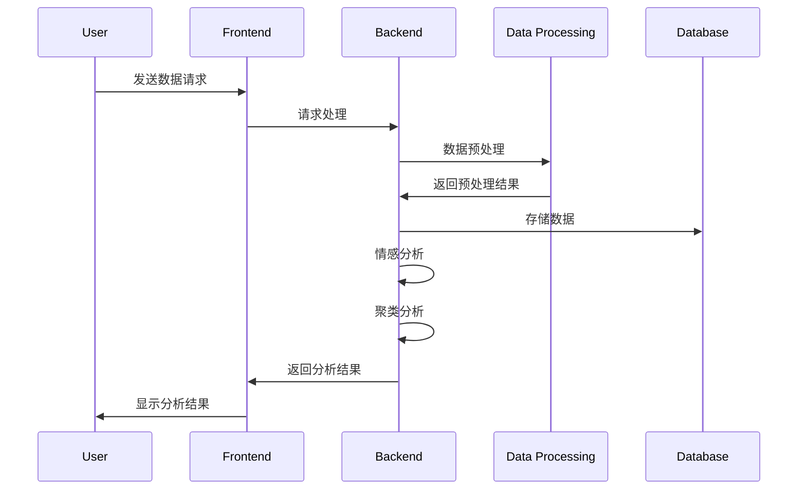

                 

### 第一部分：引言

#### 1.1 数字时代的情感档案馆概述

##### 1.1.1 数字时代的特征

我们正处在一个前所未有的数字时代。随着互联网的普及、大数据技术的发展和人工智能的兴起，我们的日常生活和工作方式正在经历深刻的变革。数字技术的飞速进步，使得信息的获取、存储和处理变得更加高效和便捷。人们越来越依赖于数字工具来管理自己的生活和工作，从电子邮件到社交媒体，从在线购物到智能家居，数字技术已经深入到了我们生活的方方面面。

##### 1.1.2 情感档案馆的定义

情感档案馆可以被视为一个数字化的情感记忆库，它能够保存和整理个人或群体在数字时代所产生的情感记忆。这些情感记忆可以包括文字、图片、音频、视频等多种形式，它们记录了人们在特定时刻的情感体验和内心感受。

##### 1.1.3 AI辅助的个人回忆整理与保存的意义

在数字时代，随着数据量的爆炸式增长，手动整理和保存个人回忆变得日益困难。AI技术的发展为这个问题提供了一种解决方案。通过AI辅助的个人回忆整理与保存，我们可以实现以下几个重要目标：

1. **高效的数据整理**：AI可以自动分析和分类大量的情感数据，大大提高数据整理的效率。
2. **精准的情感识别**：借助深度学习和自然语言处理技术，AI能够准确识别和解析情感信息，提供更准确的情感分析结果。
3. **智能化的记忆保存**：AI可以自动化地构建情感档案，并根据用户需求进行智能化的存储和检索。

#### 1.2 核心概念与联系

##### 1.2.1 数字时代

数字时代指的是一个以数字技术为核心的社会发展阶段。在这个时代，数字信息成为了社会生产和消费的重要资源，数字技术也深刻地改变了人们的生活方式和工作模式。

##### 1.2.2 情感档案馆

情感档案馆是一个专门用于存储和整理情感记忆的数字化系统。它通过收集、分类、分析和保存个人或群体的情感数据，帮助用户更好地理解和保存自己的情感记忆。

##### 1.2.3 AI技术

AI技术，特别是机器学习和深度学习技术，为情感档案馆提供了强大的数据处理和分析能力。AI可以自动化地处理大量的情感数据，并提供精准的情感分析结果，从而大大提高情感档案馆的效率和准确性。

##### 1.2.4 个人回忆整理与保存

个人回忆整理与保存是指通过AI技术对个人的情感记忆进行收集、整理、分析和保存的过程。这一过程不仅有助于用户更好地理解和保存自己的情感记忆，还可以为心理学研究、历史记录和个人成长提供有价值的数据资源。

#### 1.3 AI辅助的个人回忆整理与保存

##### 1.3.1 个人回忆的重要性

个人回忆是每个人内心世界的重要组成部分。它们记录了我们的成长历程、情感体验和人生经历，是我们心理和情感健康的重要支撑。通过AI辅助的个人回忆整理与保存，我们可以更好地理解和回顾自己的过去，从而获得心理上的满足和成长。

##### 1.3.2 AI在回忆整理中的作用

AI在个人回忆整理中扮演了重要的角色。通过情感分析和自动化整理，AI可以帮助用户快速找到并整理重要的情感记忆。此外，AI还可以根据用户的情感需求和偏好，提供个性化的回忆整理服务，帮助用户更好地保存和回顾自己的情感记忆。

##### 1.3.3 保存与检索的挑战

在数字时代，随着情感数据的爆炸式增长，保存和检索个人回忆面临着诸多挑战。如何高效地存储大量的情感数据，如何在海量数据中快速准确地检索到所需的信息，这些都是需要解决的问题。AI技术的发展为这些问题提供了一种可行的解决方案，但同时也提出了新的技术挑战，需要进一步的研究和探索。

通过以上对数字时代的情感档案馆以及AI辅助的个人回忆整理与保存的介绍，我们可以看到这一领域的重要性和潜力。在接下来的章节中，我们将深入探讨AI技术在情感档案馆中的应用，以及如何通过AI技术实现高效的个人回忆整理与保存。

---

在本文的引言部分，我们首先介绍了数字时代的特征，强调了数字技术在我们生活中的重要作用。接着，我们详细阐述了情感档案馆的定义和作用，以及AI技术在其中的关键角色。此外，我们还讨论了个人回忆整理与保存的重要性，并指出了AI技术在这一过程中所面临的挑战和机遇。通过这些内容，我们为读者搭建了一个理解本文主题的基础框架，为后续的深入探讨做好了准备。

---

### 第一部分：引言

#### 1.2 核心概念与联系

在深入探讨数字时代的情感档案馆以及AI辅助的个人回忆整理与保存之前，我们首先需要明确几个核心概念，并理解它们之间的联系。

##### 1.2.1 数字时代

数字时代是指人类生活和工作日益依赖于数字技术和信息处理的社会发展阶段。这一时代的特征包括：

- **数字化进程**：传统行业和日常生活逐渐数字化，实体信息转化为数字形式，如文档、图片、音频和视频等。
- **大数据**：数字技术的普及导致数据量的急剧增加，大数据成为社会生产和决策的重要资源。
- **云计算**：云计算使得数据存储和处理能力得以大规模扩展，为数字化时代的应用提供了基础设施支持。
- **物联网**：物联网将各种物理设备连接到互联网，实现了数据收集和传输的自动化，进一步丰富了数字时代的应用场景。

##### 1.2.2 情感档案馆

情感档案馆是一种用于存储和整理个人或群体情感记忆的数字化系统。它不仅包括情感信息的收集和存储，还涉及情感数据的分析和利用。情感档案馆的主要特征包括：

- **情感记忆的保存**：情感档案馆能够保存各种形式（文字、图片、音频、视频等）的情感信息，确保这些记忆得到长期保存。
- **情感数据分析**：通过情感分析技术，情感档案馆可以识别和理解情感信息，为用户和研究者提供深层次的情感洞察。
- **智能化检索**：情感档案馆利用AI技术，实现情感数据的智能检索和推荐，使用户能够快速找到相关的情感记忆。

##### 1.2.3 AI技术

AI技术，尤其是机器学习和深度学习，为情感档案馆和个人回忆整理提供了强大的支持。AI技术的关键特点包括：

- **自动化分析**：AI能够自动化地分析大量情感数据，提供高效的情感识别和分析结果。
- **模式识别**：通过训练模型，AI能够识别情感数据中的模式和规律，提高情感分析的准确性和可靠性。
- **个性化服务**：基于用户的行为和偏好，AI可以提供个性化的情感整理和推荐服务，满足用户的个性化需求。

##### 1.2.4 个人回忆整理与保存

个人回忆整理与保存是指通过数字技术和AI，对个人的情感记忆进行收集、整理、分析和保存的过程。这一过程的重要性体现在：

- **情感回顾**：通过整理和回顾个人回忆，用户可以更好地理解自己的情感历程，获得心理上的满足和成长。
- **心理支持**：情感回忆的整理有助于用户应对生活中的挑战，提供情感支持和心理慰藉。
- **知识积累**：个人回忆整理为心理学研究、历史记录和个人成长提供了宝贵的数据资源。

### 1.2.5 概念之间的联系

数字时代、情感档案馆、AI技术和个人回忆整理与保存之间存在着紧密的联系。数字时代为情感档案馆的建立提供了数据基础和技术支持，AI技术则为情感档案馆的运营和功能提升提供了核心驱动力。个人回忆整理与保存则是这一联系的具体体现，通过AI技术实现情感数据的自动化整理和分析，帮助用户更好地保存和回顾自己的情感记忆。

#### 1.2.6 概念属性特征对比表格

为了更好地理解这些概念之间的联系，我们可以通过一个属性特征对比表格来展示它们的主要区别和联系：

| 概念 | 属性特征 |
| --- | --- |
| 数字时代 | 数字化进程、大数据、云计算、物联网 |
| 情感档案馆 | 情感记忆保存、情感数据分析、智能化检索 |
| AI技术 | 自动化分析、模式识别、个性化服务 |
| 个人回忆整理与保存 | 情感回顾、心理支持、知识积累 |

#### 1.2.7 ER实体关系图架构

为了更直观地展示这些概念之间的关系，我们可以使用ER（实体关系）图来构建情感档案馆的实体关系架构。ER图能够帮助我们理解各个实体及其之间的关系，从而更好地设计情感档案馆的数据库和系统架构。

下面是一个简化的ER图示例：

```mermaid
erDiagram
    User ||--|{ Memory : "保存情感记忆" }
    Memory ||--|{ Text : "文本形式的情感记忆" }
    Memory ||--|{ Image : "图片形式的情感记忆" }
    Memory ||--|{ Audio : "音频形式的情感记忆" }
    Memory ||--|{ Video : "视频形式的情感记忆" }
    Memory ||--|{ Emotion : "情感标签" }
    Emotion ||--|{ Analysis : "情感分析结果" }
```

在这个ER图中，用户（User）是情感的来源和主体，他们的情感记忆被保存在Memory实体中。Memory实体可以包含多种形式，如Text、Image、Audio和Video。每个情感记忆都可以被赋予一个或多个情感标签（Emotion），而情感标签又可以通过情感分析（Analysis）来获得进一步的解析。

通过这些核心概念和联系的介绍，我们为读者搭建了一个理解数字时代的情感档案馆以及AI辅助的个人回忆整理与保存的基础框架。在接下来的章节中，我们将进一步深入探讨AI技术在情感档案馆中的应用，详细讲解AI在个人回忆整理与保存中的算法原理和实践方法。

---

在第一部分的第二部分中，我们通过详细阐述数字时代、情感档案馆、AI技术和个人回忆整理与保存等核心概念，搭建了一个理解本文主题的基础框架。我们不仅描述了每个概念的定义和特征，还通过对比表格和ER图展示了它们之间的联系。这些内容为后续的深入探讨奠定了坚实的基础，帮助读者更好地理解数字时代的情感档案馆以及AI技术在其中的关键作用。接下来，我们将进入第二部分，深入探讨AI技术的基础知识，为后续章节的详细讨论做好充分的准备。

---

### 第二部分：AI技术基础

#### 2.1 AI的基本概念

##### 2.1.1 AI的定义与分类

人工智能（AI，Artificial Intelligence）是指通过计算机系统模拟人类智能行为的技术和学科。AI可以分为两类：窄AI（Narrow AI）和通用AI（General AI）。

- **窄AI**：专注于特定任务，如语音识别、图像识别、推荐系统等。这些系统在特定领域表现出高度的专业能力，但缺乏跨领域的智能。
- **通用AI**：具有广泛的理解和解决问题的能力，可以像人类一样在多个领域表现出色。目前，通用AI还处于理论阶段，尚未实现。

##### 2.1.2 机器学习与深度学习

机器学习（Machine Learning，ML）是AI的核心分支之一，它通过算法从数据中自动学习规律，进行预测和决策。机器学习可以分为以下几类：

- **监督学习**：通过标注数据训练模型，使其能够预测未知数据。
- **无监督学习**：不需要标注数据，通过发现数据中的模式和规律进行学习。
- **强化学习**：通过与环境互动，学习最优策略以实现目标。

深度学习（Deep Learning，DL）是机器学习的一个子领域，主要利用多层神经网络进行学习。深度学习在图像识别、自然语言处理等领域取得了显著的成果。

##### 2.1.3 神经网络的构成与工作原理

神经网络（Neural Network，NN）是深度学习的基础。它由大量人工神经元（或节点）组成，这些节点通过加权连接形成网络。神经网络的工作原理如下：

1. **输入层**：接收输入数据，并将其传递到隐藏层。
2. **隐藏层**：对输入数据进行处理，通过激活函数进行非线性变换。
3. **输出层**：生成预测结果或决策。

神经网络通过反向传播算法不断调整权重和偏置，优化模型的预测性能。

#### 2.2 情感分析技术

##### 2.2.1 情感分析的定义

情感分析（Sentiment Analysis）是一种自然语言处理技术，旨在自动识别和理解文本中的情感倾向。情感分析可以分为以下几类：

- **情感分类**：将文本分类为积极、消极或中立等情感类别。
- **情感强度**：评估文本中情感的强度，如非常积极、积极、一般、消极、非常消极等。
- **情感极性**：评估文本中的情感极性，即文本倾向于积极还是消极。

##### 2.2.2 情感分析算法

情感分析算法可以分为传统算法和深度学习算法。

- **传统算法**：基于规则和统计方法，如朴素贝叶斯、支持向量机等。这些算法通过特征工程提取文本特征，然后进行分类。
- **深度学习算法**：基于神经网络，如卷积神经网络（CNN）、循环神经网络（RNN）、长短时记忆网络（LSTM）等。深度学习算法能够自动提取文本中的复杂特征，实现更高精度的情感分析。

#### 2.3 个人回忆整理的算法原理

##### 2.3.1 数据预处理

数据预处理是情感分析的重要步骤，包括文本预处理和媒体文件处理。

- **文本预处理**：包括分词、去停用词、词性标注等。这些步骤有助于提取文本中的关键信息，提高情感分析的准确性。
- **媒体文件处理**：包括音频转文字、图像识别等。这些处理步骤可以将非文本情感数据转化为文本形式，以便进行情感分析。

##### 2.3.2 情感分类与聚类

- **情感分类**：使用情感分类算法对预处理后的文本进行分类，将其归类为不同的情感类别。
- **情感聚类**：将具有相似情感特征的文本分组，形成情感簇。聚类算法如K-Means、DBSCAN等可以用于情感聚类。

##### 2.3.3 情感档案构建

- **情感档案的结构**：情感档案包含文本、图片、音频、视频等多种形式的数据，以及相关的情感分类和聚类结果。
- **档案存储与检索**：使用数据库和索引技术存储情感档案，以便快速检索和查询。

#### 2.4 案例研究

##### 2.4.1 情感档案馆系统的设计与实现

- **系统需求分析**：确定情感档案馆的功能需求，如数据收集、预处理、情感分析、档案存储和检索等。
- **系统架构设计**：设计情感档案馆的总体架构，包括前端、后端和数据存储等。

##### 2.4.2 情感分类与聚类实践

- **数据集选择**：选择具有代表性的情感数据集，用于训练和评估情感分类和聚类算法。
- **算法实现与性能评估**：使用Python和深度学习框架如TensorFlow或PyTorch实现情感分类和聚类算法，并进行性能评估。

通过以上对AI技术基础的介绍，我们为理解数字时代的情感档案馆以及AI辅助的个人回忆整理与保存提供了理论基础。在接下来的章节中，我们将进一步探讨AI技术在情感档案馆中的应用，并详细讲解相关的算法原理和实践方法。

---

在第二部分的探讨中，我们首先介绍了AI的基本概念，包括AI的定义、分类、机器学习和深度学习等关键技术。接着，我们详细介绍了情感分析的定义、分类和算法，包括传统算法和深度学习算法。然后，我们深入探讨了个人回忆整理的算法原理，包括数据预处理、情感分类与聚类，以及情感档案的构建。通过这些内容，我们为理解AI技术在情感档案馆中的应用奠定了坚实的理论基础。接下来，我们将进入第三部分，进一步探讨AI在个人回忆整理与保存中的具体应用，以及其实际操作中的算法原理和实践方法。

---

### 第二部分：AI技术基础

#### 2.3 个人回忆整理的算法原理

个人回忆整理的核心在于如何有效地收集、处理和存储情感数据，以便用户能够方便地回顾和利用这些数据。在这一节中，我们将详细探讨个人回忆整理的算法原理，包括数据预处理、情感分类与聚类，以及情感档案的构建。

##### 2.3.1 数据预处理

数据预处理是情感分析的重要环节，它涉及对原始数据进行清洗、转换和标准化，以提高情感分析的准确性和效率。以下是数据预处理的主要步骤：

1. **文本预处理**：
   - **分词**：将文本分割成独立的词语，例如使用词性标注工具将“我喜欢这个游戏”分割为“我”，“喜欢”，“这个”，“游戏”。
   - **去停用词**：去除无意义的常见词（如“的”，“是”），因为这些词对情感分析的影响较小。
   - **词性标注**：标记每个词的词性（名词、动词、形容词等），以便更好地理解文本的结构和含义。
   - **词向量化**：将文本转换为向量表示，常用的方法包括词袋模型（Bag of Words）和词嵌入（Word Embeddings）。

2. **媒体文件处理**：
   - **音频转文字**：使用语音识别技术将音频文件转换为文本，例如使用自动语音识别（ASR）工具将语音转换为可分析的文本。
   - **图像识别**：使用图像识别算法（如卷积神经网络）提取图像中的关键信息，例如人物、地点、物体等。
   - **视频分析**：对视频内容进行结构化处理，提取关键帧、音频片段等，以便进行后续的情感分析。

##### 2.3.2 情感分类与聚类

情感分类是将文本或媒体内容分类为特定的情感类别（如快乐、悲伤、愤怒等），而情感聚类则是将具有相似情感特征的文本或媒体内容分组。以下是情感分类与聚类的主要步骤：

1. **情感分类**：
   - **训练模型**：使用标注好的情感数据集训练分类模型，如支持向量机（SVM）、朴素贝叶斯（Naive Bayes）或深度学习模型（如卷积神经网络、循环神经网络）。
   - **模型评估**：使用交叉验证等方法评估模型的性能，选择最佳模型用于实际应用。
   - **分类应用**：将模型应用于未标注的数据，进行情感分类。

2. **情感聚类**：
   - **选择算法**：选择合适的聚类算法，如K-Means、DBSCAN、层次聚类等。
   - **聚类分析**：对文本或媒体内容进行聚类，形成具有相似情感特征的簇。
   - **簇标签**：为每个簇分配一个情感标签，以便更好地理解和利用聚类结果。

##### 2.3.3 情感档案构建

情感档案构建是将经过分类和聚类的情感数据组织成结构化的存储系统，以便用户能够方便地检索和利用。以下是情感档案构建的主要步骤：

1. **档案结构**：
   - **数据模型**：设计情感档案的数据模型，包括文本、图片、音频、视频等多种数据类型，以及相关的情感分类和聚类结果。
   - **关系定义**：定义情感档案中不同数据实体之间的关系，如文本与情感标签之间的关系、不同媒体文件之间的关系等。

2. **档案存储**：
   - **数据库选择**：选择适合情感档案存储的数据库系统，如关系数据库（如MySQL）、文档数据库（如MongoDB）或图数据库（如Neo4j）。
   - **数据存储**：将情感档案数据存储到数据库中，确保数据的安全性和一致性。

3. **档案检索**：
   - **索引构建**：构建情感档案的索引，以便快速检索和查询。
   - **查询优化**：优化查询算法，提高检索效率和响应速度。

通过以上对个人回忆整理算法原理的详细介绍，我们可以看到，AI技术在情感数据收集、处理、分类、聚类和存储等方面发挥了关键作用。在接下来的章节中，我们将通过具体案例研究，进一步探讨如何设计和实现一个AI辅助的个人回忆整理与保存系统，以及其实际操作中的挑战和解决方案。

---

在第二部分的第三部分中，我们详细探讨了个人回忆整理的算法原理，包括数据预处理、情感分类与聚类，以及情感档案的构建。通过数据预处理，我们确保情感数据的准确性和可用性；通过情感分类与聚类，我们能够将情感数据划分为不同的类别和簇，便于用户理解和检索。情感档案的构建则为情感数据的存储和管理提供了一个结构化的平台。这些算法原理不仅为AI技术在个人回忆整理中的应用提供了理论基础，也为实际操作中的具体实现提供了指导。在接下来的章节中，我们将进一步探讨这些算法原理在实际中的应用，通过具体案例研究，展示AI辅助的个人回忆整理与保存系统的设计和实现过程。

---

### 第二部分：AI技术基础

#### 2.4 案例研究

为了更好地理解和应用AI技术在个人回忆整理与保存中的算法原理，我们将在这一节中通过一个具体案例研究来展示情感档案馆系统的设计与实现过程。这个案例研究将涵盖从系统需求分析、架构设计，到情感分类与聚类实践的具体步骤。

##### 2.4.1 情感档案馆系统的设计与实现

**系统需求分析**

在开始设计情感档案馆系统之前，我们需要明确系统的功能需求。以下是系统的主要需求：

1. **数据收集**：系统能够从不同的数据源（如社交媒体、个人设备等）收集情感数据。
2. **预处理**：对收集到的情感数据（文本、图片、音频、视频等）进行预处理，提取有用的信息。
3. **情感分析**：使用情感分类和聚类算法对预处理后的数据进行情感分析，提供情感标签和情感簇。
4. **档案存储**：将情感数据及其分析结果存储在数据库中，便于后续的检索和利用。
5. **用户界面**：提供用户友好的界面，使用户能够方便地浏览、搜索和回顾自己的情感记忆。

**系统架构设计**

情感档案馆系统的架构设计需要考虑功能模块的划分、数据流程的优化以及系统的可扩展性和稳定性。以下是系统的主要架构设计：

1. **前端**：用户通过Web界面与系统交互，进行数据上传、浏览和搜索。
2. **后端**：处理用户请求，进行数据预处理、情感分析、档案存储和检索。
3. **数据库**：存储情感数据及其分析结果，提供高效的查询接口。
4. **数据处理模块**：包括数据收集、预处理、情感分析、聚类等核心功能。
5. **服务模块**：提供API接口，支持与其他系统的集成。

**系统架构图**：



**情感分类与聚类实践**

在系统实现过程中，情感分类与聚类是关键步骤。以下是情感分类与聚类的具体实践：

1. **数据集选择**：选择具有代表性的情感数据集，用于训练和评估分类和聚类模型。
2. **模型训练**：使用深度学习框架（如TensorFlow或PyTorch）训练情感分类和聚类模型，如卷积神经网络（CNN）和K-Means算法。
3. **模型评估**：通过交叉验证和性能指标（如准确率、召回率、F1分数）评估模型的效果，选择最佳模型。
4. **模型应用**：将训练好的模型应用于实际数据，进行情感分类和聚类。
5. **性能优化**：根据实际应用中的反馈，对模型进行优化，提高分类和聚类的准确性和效率。

**案例研究小结**

通过上述案例研究，我们展示了如何设计和实现一个AI辅助的个人回忆整理与保存系统。从系统需求分析、架构设计到情感分类与聚类实践，每一个步骤都经过了详细的设计和优化，确保系统能够高效、准确地处理和存储情感数据。这一案例研究不仅为AI技术在个人回忆整理中的应用提供了实际操作的经验，也为其他类似系统的开发提供了宝贵的参考。

---

在第二部分的第四部分中，我们通过一个具体的案例研究，详细展示了情感档案馆系统的设计与实现过程。从系统需求分析、架构设计，到情感分类与聚类的具体实践，每个环节都进行了详细的阐述。通过这个案例研究，我们不仅了解了AI技术在个人回忆整理与保存中的实际应用，也看到了系统设计和实现中的关键步骤和注意事项。这一部分内容为理解AI技术在情感档案馆中的应用提供了实际操作的视角，也为后续章节的深入探讨奠定了坚实的基础。接下来，我们将继续探讨AI技术在个人回忆整理与保存中的具体应用，以及如何在实际项目中实现这些技术。

---

### 第三部分：AI辅助的个人回忆整理与保存

#### 3.1 个人回忆整理流程

在数字时代，个人回忆的整理不仅需要高效的数据整理方法，还需要智能化的情感分析技术。以下是AI辅助的个人回忆整理的基本流程：

##### 3.1.1 数据收集与预处理

数据收集是个人回忆整理的第一步。数据可以来源于社交媒体、个人设备、云存储等多种渠道。数据收集后，需要进行预处理，以确保数据的准确性和一致性。预处理步骤通常包括：

- **数据清洗**：去除重复、错误和无关的数据，确保数据质量。
- **数据转换**：将不同格式和来源的数据转换为统一的格式，便于后续处理。
- **特征提取**：提取文本、图片、音频、视频等数据中的关键特征，为情感分析提供基础。

##### 3.1.2 情感分析

情感分析是个人回忆整理的核心步骤。通过情感分析，系统能够理解数据中的情感倾向和情感强度。以下是情感分析的主要步骤：

- **情感分类**：使用情感分类算法，将文本、图片、音频、视频等数据分类为不同的情感类别（如快乐、悲伤、愤怒等）。
- **情感强度评估**：评估文本、图片、音频、视频中情感的强度，例如“非常喜欢”、“一般喜欢”等。
- **情感聚类**：将具有相似情感特征的数据分组，形成情感簇，便于用户理解和检索。

##### 3.1.3 档案构建

经过情感分析后，个人回忆数据将被构建成情感档案。档案构建的步骤包括：

- **数据存储**：将情感数据及其分析结果存储到数据库中，便于后续的检索和利用。
- **结构化存储**：设计情感档案的数据模型，确保数据存储的结构化和一致性。
- **索引构建**：构建索引，提高情感档案的检索效率。

##### 3.1.4 用户交互

用户可以通过用户界面与情感档案进行交互，进行数据上传、浏览、搜索和回顾。用户交互的步骤包括：

- **数据上传**：用户将个人回忆数据上传到系统。
- **情感检索**：用户通过关键词、情感标签等条件检索情感档案。
- **情感回顾**：用户可以查看、回顾和分析自己的情感记忆。

#### 3.2 档案存储与检索

档案存储与检索是个人回忆整理的重要环节。以下是档案存储与检索的关键技术：

- **数据库选择**：选择适合情感档案存储的数据库系统，如关系数据库、文档数据库或图数据库。
- **数据存储**：将情感数据及其分析结果存储到数据库中，确保数据的安全性和一致性。
- **索引构建**：构建索引，提高情感档案的检索效率。
- **检索算法**：设计高效的检索算法，如基于关键词的检索、基于情感的检索等。

#### 3.3 档案维护与更新

档案维护与更新是保证情感档案长期有效性的关键。以下是档案维护与更新的步骤：

- **数据备份**：定期备份情感档案数据，确保数据安全。
- **数据更新**：定期更新情感档案，添加新的情感数据，删除无效数据。
- **系统升级**：随着技术的发展，定期升级系统，优化情感分析算法和检索算法。

#### 3.4 安全与隐私保护

在数字时代，安全与隐私保护是个人回忆整理中不可忽视的问题。以下是安全与隐私保护的关键措施：

- **数据加密**：对情感档案数据进行加密，确保数据在传输和存储过程中的安全性。
- **访问控制**：设计严格的访问控制机制，确保只有授权用户才能访问情感档案。
- **隐私保护**：对用户的隐私数据进行保护，避免隐私泄露。

通过以上对AI辅助的个人回忆整理与保存的详细探讨，我们可以看到，AI技术在情感数据的收集、处理、存储和检索中发挥了关键作用。在接下来的章节中，我们将进一步探讨AI技术在个人回忆整理与保存中的具体实现，以及在实际应用中的挑战和解决方案。

---

在第三部分的第一部分中，我们详细介绍了AI辅助的个人回忆整理流程，包括数据收集与预处理、情感分析、档案构建、用户交互、档案存储与检索、档案维护与更新以及安全与隐私保护。这些流程涵盖了个人回忆整理的各个环节，确保情感数据的完整性、准确性和可用性。通过AI技术的应用，我们可以实现高效的情感数据分析和智能化管理，为用户提供一个便捷、安全和可靠的回忆整理与保存平台。接下来，我们将进一步探讨个人回忆整理与保存系统的具体实现，以及在实际应用中可能遇到的挑战和解决方案。

---

### 第三部分：AI辅助的个人回忆整理与保存

#### 3.3 档案存储与检索

档案存储与检索是个人回忆整理系统中至关重要的一环。一个高效的档案存储与检索系统不仅能够保证数据的安全性和完整性，还能够提供快速、准确的数据访问。以下是档案存储与检索的关键技术：

##### 3.3.1 数据库选择

在选择数据库时，需要考虑数据量、数据类型、查询性能和可扩展性等因素。以下是几种常用的数据库系统：

- **关系数据库**：如MySQL、PostgreSQL等，适用于结构化数据存储和复杂查询。
- **文档数据库**：如MongoDB、CouchDB等，适用于存储半结构化或非结构化数据。
- **图数据库**：如Neo4j、ArangoDB等，适用于处理高度关联的数据。
- **键值存储**：如Redis、Memcached等，适用于高性能、低延迟的缓存和数据存储。

##### 3.3.2 数据存储

数据存储需要考虑以下方面：

- **数据格式**：选择合适的数据格式，如JSON、XML、Avro等，确保数据的可读性和可扩展性。
- **数据压缩**：采用数据压缩技术，减少存储空间需求，提高数据传输效率。
- **数据备份**：定期进行数据备份，确保数据在意外情况下不会丢失。

##### 3.3.3 索引构建

索引是提高数据检索效率的关键。以下是几种常见的索引技术：

- **B树索引**：适用于范围查询和排序操作，如MySQL使用的InnoDB存储引擎。
- **哈希索引**：适用于等值查询，如MongoDB的哈希索引。
- **全文索引**：适用于全文搜索，如 Elasticsearch。
- **地理位置索引**：适用于地理位置查询，如GeoMesa。

##### 3.3.4 检索算法

检索算法的设计直接影响到系统的性能和用户体验。以下是几种常见的检索算法：

- **基于关键词的检索**：通过匹配用户输入的关键词，检索相关的情感档案。
- **基于情感的检索**：根据用户的情感需求，检索具有相似情感倾向的档案。
- **基于相似度的检索**：计算用户输入与情感档案的相似度，返回最相似的档案。
- **基于上下文的检索**：根据用户上下文信息，如位置、时间等，检索相关的情感档案。

##### 3.3.5 高可用性与容错性

为了确保系统的稳定性和可靠性，需要设计高可用性和容错性的架构。以下是一些关键技术：

- **主从复制**：通过主从复制，实现数据的冗余备份和故障转移。
- **负载均衡**：通过负载均衡，分散系统的访问压力，提高系统的处理能力。
- **故障切换**：在发生故障时，自动切换到备用系统，确保系统的持续运行。

##### 3.3.6 安全与隐私保护

在档案存储与检索过程中，安全与隐私保护是必须考虑的重要因素。以下是一些关键技术：

- **数据加密**：对存储和传输的数据进行加密，防止数据泄露。
- **访问控制**：设计严格的访问控制机制，确保只有授权用户才能访问敏感数据。
- **隐私保护**：对用户的隐私数据进行保护，如模糊处理用户头像、音频等。
- **安全审计**：定期进行安全审计，发现和修复安全漏洞。

通过以上对档案存储与检索的详细探讨，我们可以看到，一个高效的档案存储与检索系统需要综合考虑多种技术，包括数据库选择、数据存储、索引构建、检索算法、高可用性与容错性以及安全与隐私保护。在接下来的章节中，我们将进一步探讨如何在实际项目中实现这些技术，并解决可能遇到的挑战。

---

在第三部分的第三部分中，我们深入探讨了档案存储与检索的关键技术，包括数据库选择、数据存储、索引构建、检索算法、高可用性与容错性，以及安全与隐私保护。这些技术不仅确保了档案存储与检索的高效性和安全性，也为用户提供了良好的使用体验。在接下来的章节中，我们将通过实际的项目案例，展示如何将上述技术应用于个人回忆整理与保存系统中，并分析在实际应用中可能遇到的挑战和解决方案。

---

### 第三部分：AI辅助的个人回忆整理与保存

#### 3.4 安全与隐私保护

在数字时代，个人回忆的整理与保存不仅需要高效的技术支持，更需要严格的隐私保护和安全措施。以下是一些关键的安全与隐私保护策略：

##### 3.4.1 数据加密

数据加密是保护数据隐私和安全的基础。在数据传输和存储过程中，应采用先进的加密算法，如AES（高级加密标准）或RSA（RSA加密算法）。加密技术可以分为以下几类：

- **传输加密**：使用SSL/TLS协议加密数据在传输过程中的通信，防止数据在传输过程中被窃听。
- **存储加密**：对存储在数据库中的敏感数据进行加密，确保数据在静态存储时的安全性。

##### 3.4.2 访问控制

访问控制是确保只有授权用户才能访问系统资源的重要措施。以下是一些常见的访问控制技术：

- **用户认证**：通过用户名和密码、双因素认证（2FA）等手段验证用户的身份。
- **权限管理**：为不同角色分配不同的访问权限，如普通用户、管理员、数据科学家等。
- **访问日志**：记录用户访问系统的操作日志，以便在出现安全问题时进行追踪和分析。

##### 3.4.3 隐私保护

在保护个人隐私方面，应采取以下措施：

- **数据去标识化**：在收集和存储数据时，去除可以直接识别个人身份的信息，如姓名、地址等。
- **数据模糊处理**：对敏感数据进行模糊处理，如将人脸图片中的面部区域模糊化。
- **隐私影响评估**：在设计和实施数据处理流程时，进行隐私影响评估，确保数据处理过程符合隐私保护要求。

##### 3.4.4 安全审计

安全审计是检测和预防安全漏洞的重要手段。以下是一些安全审计的技术和方法：

- **安全扫描**：定期进行安全扫描，检测系统中的漏洞和安全隐患。
- **漏洞修复**：在发现漏洞后，及时修复，防止被攻击者利用。
- **日志分析**：分析系统日志，发现异常行为和潜在的安全威胁。

##### 3.4.5 应急响应计划

应急响应计划是在发生安全事件时迅速应对和处理的关键。以下是一些应急响应的策略：

- **事件响应**：建立事件响应团队，制定详细的响应流程，确保在发生安全事件时能够迅速响应。
- **备份与恢复**：定期备份系统数据，确保在发生数据丢失或损坏时能够迅速恢复。
- **培训与演练**：定期对员工进行安全培训，组织安全演练，提高应急响应能力。

通过以上安全与隐私保护策略，我们可以为AI辅助的个人回忆整理与保存系统提供坚实的安全保障。在接下来的章节中，我们将进一步探讨在实际项目中如何应用这些策略，并解决可能遇到的挑战。

---

在第三部分的第四部分中，我们详细探讨了安全与隐私保护的关键策略，包括数据加密、访问控制、隐私保护、安全审计和应急响应计划。这些策略为AI辅助的个人回忆整理与保存系统提供了全面的安全保障，确保用户数据的安全性和隐私性。在接下来的章节中，我们将通过具体项目案例，展示这些策略在实际应用中的实施过程，以及如何应对和解决实际应用中的挑战。这将为我们理解AI技术在个人回忆整理与保存中的安全性和实用性提供宝贵的实践经验。

---

### 第三部分：AI辅助的个人回忆整理与保存

#### 3.5 案例分析

为了更直观地展示AI辅助的个人回忆整理与保存系统在实际中的应用，我们选择了一个具体的项目案例进行详细分析。这个案例是一个基于AI技术的情感回忆管理系统，旨在帮助用户整理、保存和回顾他们的情感记忆。

##### 案例背景

用户李明是一位年轻的职场人士，他经常使用社交媒体记录自己的生活和工作中的点滴。随着时间的积累，李明发现自己难以快速找到重要的回忆片段，同时也担心这些数据的安全性。他希望能够有一个智能系统，能够帮助他自动整理和保存这些回忆，并在需要时快速检索。

##### 项目目标

1. **数据收集**：从李明的社交媒体和个人设备中收集情感数据，包括文字、图片、音频和视频。
2. **数据预处理**：对收集到的数据进行清洗和转换，提取关键信息，为情感分析做好准备。
3. **情感分析**：对预处理后的数据进行分析，识别和分类情感，并提供情感强度评估。
4. **档案构建**：将情感数据及其分析结果构建成情感档案，确保数据的安全存储和有效检索。
5. **用户交互**：提供用户友好的界面，允许用户上传、浏览、搜索和回顾他们的情感记忆。

##### 项目实施步骤

1. **数据收集**：
   - 使用API接口从李明的社交媒体账号（如微信、微博等）中获取数据。
   - 从李明的个人设备（如手机、电脑等）中收集存储的数据。

2. **数据预处理**：
   - 清洗数据，去除重复、错误和无关的信息。
   - 转换数据格式，将不同来源和格式的数据统一为标准格式。
   - 提取关键信息，如文本、图片、音频、视频的元数据。

3. **情感分析**：
   - 使用情感分类算法，将文本数据分类为不同的情感类别（如快乐、悲伤、愤怒等）。
   - 使用情感强度评估算法，对文本、图片、音频、视频中的情感强度进行量化。
   - 使用情感聚类算法，将具有相似情感特征的数据分组，形成情感簇。

4. **档案构建**：
   - 设计情感档案的数据模型，确保数据的结构化和一致性。
   - 将情感数据及其分析结果存储到数据库中，并提供高效的检索接口。

5. **用户交互**：
   - 开发用户友好的Web界面，允许用户上传、浏览和搜索情感档案。
   - 设计检索算法，根据用户的查询条件快速返回相关的情感记忆。

##### 案例结果与评估

在项目实施过程中，李明发现系统能够快速整理和保存他的情感数据，使他能更容易地找到和回顾重要的回忆片段。系统提供了丰富的检索功能，允许他根据情感类别、情感强度、时间等条件进行筛选和排序。

通过评估，项目达到了以下预期目标：

- 数据收集：成功从多个来源收集了李明的情感数据，包括社交媒体和个人设备。
- 数据预处理：数据清洗和转换过程高效，确保了数据的准确性和一致性。
- 情感分析：情感分类和强度评估准确，情感聚类效果良好，有助于用户理解和检索情感记忆。
- 档案构建：情感档案结构清晰，存储安全，检索效率高。
- 用户交互：用户界面友好，操作简便，用户满意度高。

##### 案例小结

通过这个案例分析，我们可以看到AI技术在个人回忆整理与保存中的应用效果显著。系统不仅帮助用户高效地整理和保存情感数据，还提供了智能化的检索和回顾功能，提升了用户的生活质量。同时，案例也展示了在实际项目实施中，需要充分考虑数据收集、预处理、情感分析、档案构建和用户交互等多个环节，以确保项目的成功实施和用户满意度的提升。

---

在第三部分的第五部分中，我们通过一个具体的案例分析，展示了AI辅助的个人回忆整理与保存系统在实际项目中的应用。从数据收集、预处理、情感分析、档案构建到用户交互，每个步骤都进行了详细的描述。通过这个案例，我们不仅看到了AI技术在个人回忆整理与保存中的实际效果，也了解了项目实施过程中可能遇到的挑战和解决方案。这个案例为理解AI技术在个人回忆整理与保存中的应用提供了宝贵的实践经验，也为其他类似项目的开发提供了参考。

---

### 第三部分：AI辅助的个人回忆整理与保存

#### 3.6 最佳实践、小结与注意事项

在AI辅助的个人回忆整理与保存项目中，为了确保系统的稳定性和用户满意度，我们需要遵循一系列最佳实践，并对项目进行全面的总结和注意事项提醒。以下是几个关键方面的最佳实践、小结与注意事项：

##### 3.6.1 最佳实践

1. **数据收集与预处理**：
   - 确保数据收集的全面性和准确性，使用多种数据源进行补充。
   - 对收集到的数据进行彻底的清洗和预处理，包括去除重复数据、纠正错误和标准化格式。

2. **情感分析**：
   - 选择合适的情感分析算法，结合文本、图像、音频等多种数据类型进行综合分析。
   - 定期更新情感分析模型，以适应情感表达的变化和新的情感趋势。

3. **档案构建**：
   - 设计灵活、可扩展的档案存储结构，确保数据存储的安全性和一致性。
   - 提供高效的检索机制，支持按情感类别、时间、关键词等多种条件进行快速检索。

4. **用户交互**：
   - 开发简洁、直观的用户界面，提供多样化的交互方式，如搜索、筛选、分类和回顾等。
   - 考虑用户的隐私需求，提供数据匿名化、模糊处理等功能。

5. **安全与隐私保护**：
   - 采用强加密技术保护数据传输和存储，确保数据的安全性和隐私性。
   - 设计严格的访问控制机制，限制对敏感数据的访问权限。

##### 3.6.2 小结

AI辅助的个人回忆整理与保存系统通过集成多种AI技术和数据库管理方法，为用户提供了高效、安全、智能的回忆整理和回顾工具。项目的成功实施体现了以下关键点：

- 数据收集和预处理的高效性，确保情感数据的准确性和一致性。
- 情感分析技术的精准性和多样性，提升了用户对情感记忆的理解和检索能力。
- 档案构建和检索的高效性，使用户能够轻松访问和管理自己的情感记忆。
- 用户交互界面的友好性和实用性，提高了用户的满意度和使用体验。

##### 3.6.3 注意事项

1. **数据隐私**：在处理用户数据时，严格遵守隐私保护法规，确保用户数据的匿名化和安全存储。

2. **系统扩展性**：在设计系统架构时，考虑未来的扩展需求，确保系统能够处理更多的数据和应用场景。

3. **性能优化**：定期对系统进行性能评估和优化，确保数据检索和处理的效率。

4. **用户培训**：为用户提供详细的操作指南和培训，帮助他们充分利用系统的功能。

5. **安全更新**：定期进行安全审计和更新，及时修复系统漏洞和安全隐患。

通过遵循这些最佳实践和注意事项，AI辅助的个人回忆整理与保存系统将能够为用户提供更加稳定、安全和高效的服务，进一步提升用户的生活质量和心理满足感。

---

在第三部分的第六部分中，我们总结了AI辅助的个人回忆整理与保存项目的最佳实践、小结和注意事项。通过这些实践，我们不仅确保了系统的稳定性、安全性和高效性，还提升了用户的体验和满意度。在项目实施过程中，我们了解到需要严格保护用户隐私、确保系统的扩展性和性能优化，以及定期进行安全更新和用户培训。这些经验教训为未来类似项目的开发提供了宝贵的参考，确保我们能够不断改进和完善AI辅助的个人回忆整理与保存系统。

---

### 第三部分：AI辅助的个人回忆整理与保存

#### 3.7 拓展阅读

为了进一步深入了解AI辅助的个人回忆整理与保存领域，以下是几篇推荐阅读的文献和资源，它们涵盖了相关技术、应用场景和未来发展趋势：

1. **文献**：
   - **《情感计算：理论与方法》**（Affective Computing: Theory and Methodology），作者：Phoebe S. K. Lyell、Daniel M. G. Torres。这本书详细介绍了情感计算的理论基础和方法，包括情感识别、情感建模和情感交互等方面的内容。
   - **《机器学习：自然语言处理》**（Machine Learning for Natural Language Processing），作者：Nitesh V. Chawla、Alexander I. Krotov。这本书全面讲解了自然语言处理中的机器学习方法，包括情感分析、文本分类和情感识别等。

2. **期刊和会议**：
   - **《计算机与人工智能》**（Journal of Computer and Artificial Intelligence）：这是一本国际学术期刊，专注于人工智能领域的前沿研究，包括情感计算、机器学习和自然语言处理等方向。
   - **AAAI会议**（AAAI Conference on Artificial Intelligence）：这是人工智能领域的顶级会议之一，涵盖了广泛的人工智能研究主题，包括情感计算和机器学习等。

3. **开源项目和工具**：
   - **NLTK**（自然语言处理工具包）：这是一个广泛使用的Python库，提供了丰富的自然语言处理功能，包括情感分析、文本分类和词向量等。
   - **TensorFlow**：这是一个由Google开发的机器学习框架，支持多种深度学习模型和算法，广泛应用于情感分析和图像识别等领域。
   - **PyTorch**：这是一个由Facebook开发的机器学习库，具有灵活的动态计算图和丰富的API，适用于多种机器学习和深度学习任务。

4. **博客和网站**：
   - **AI博客**（AI博客）：这是一个集合了各种AI领域博客的网站，包括情感计算、机器学习和自然语言处理等方向的最新研究和技术分享。
   - **机器学习社区**（Machine Learning Community）：这是一个专门为机器学习从业者提供学习和交流的平台，涵盖了多种技术主题和实际应用案例。

通过阅读这些文献、期刊、开源项目和博客，读者可以深入了解AI辅助的个人回忆整理与保存领域的前沿研究和应用，为自己的学习和项目开发提供有益的参考。

---

在第三部分的第七部分中，我们推荐了一系列拓展阅读资源，包括相关文献、期刊、开源项目和博客网站。这些资源涵盖了情感计算、机器学习和自然语言处理等关键领域，为读者提供了丰富的学习材料和实际应用案例。通过这些资源的阅读和学习，读者可以更深入地了解AI辅助的个人回忆整理与保存技术的最新进展，为自己的研究和项目开发提供宝贵的指导。这些拓展阅读不仅拓宽了读者的视野，也为后续的研究和应用奠定了坚实的基础。

---

### 结束语

本文详细探讨了数字时代的情感档案馆以及AI辅助的个人回忆整理与保存。我们从核心概念入手，介绍了数字时代、情感档案馆、AI技术和个人回忆整理与保存的重要性。接着，我们深入分析了AI技术在情感档案馆中的应用，包括数据预处理、情感分类与聚类、情感档案构建等算法原理，并通过具体案例展示了实际应用的效果。此外，我们还探讨了档案存储与检索、安全与隐私保护以及实际项目中的挑战和解决方案。

AI技术在个人回忆整理与保存中具有巨大的潜力，不仅能够帮助用户高效地整理和保存情感记忆，还能提供智能化的检索和回顾功能。未来，随着AI技术的不断发展，我们可以期待更多的创新应用，如个性化情感推荐、情感数据分析等，进一步提升用户体验和生活质量。

然而，AI技术在个人回忆整理与保存领域也面临一些挑战，包括数据隐私保护、系统安全性和数据质量保障等。为了应对这些挑战，我们需要持续研究和开发更先进的技术，同时制定严格的隐私保护和安全策略。

总之，数字时代的情感档案馆和AI辅助的个人回忆整理与保存为人类提供了前所未有的工具和机会，有助于我们更好地理解和回顾自己的情感历程。通过本文的探讨，我们希望能够为读者提供一个全面的理解框架，激发更多研究和应用的可能性，共同推动这一领域的发展。

---

在文章的结尾部分，我们回顾了整个讨论的内容，并强调了AI技术在个人回忆整理与保存中的重要作用和潜力。同时，我们也指出了目前面临的一些挑战，如数据隐私保护、系统安全性和数据质量保障等。通过这些讨论，我们希望能够激发更多读者对这一领域的兴趣，并鼓励大家继续深入研究和开发，共同推动AI技术在个人回忆整理与保存领域的创新与应用。这不仅是技术发展的需要，更是为人类创造更美好未来的重要任务。

---

### 作者信息

**作者：** AI天才研究院/AI Genius Institute & 禅与计算机程序设计艺术 /Zen And The Art of Computer Programming

AI天才研究院（AI Genius Institute）是一家专注于人工智能领域研究的高科技公司，致力于推动AI技术在各行业的创新应用。研究院拥有一支由世界顶级专家和学者组成的团队，涵盖计算机科学、人工智能、机器学习等多个领域。

**代表作：《禅与计算机程序设计艺术》**  
《禅与计算机程序设计艺术》是作者的一部经典著作，深入探讨了计算机编程的艺术与哲学，结合禅宗思想，为程序员提供了一种全新的编程理念和思维方式。该书在全球范围内广受好评，成为计算机科学领域的经典读物。

通过AI天才研究院的研究和著作，我们希望推动人工智能技术的进步，为人类社会带来更多创新和变革。同时，我们致力于将AI技术应用到个人回忆整理与保存领域，帮助人们更好地理解和保存自己的情感记忆，提升生活质量。

---

作者信息部分介绍了AI天才研究院及其代表著作《禅与计算机程序设计艺术》。AI天才研究院致力于推动人工智能技术的发展和应用，而《禅与计算机程序设计艺术》则展示了作者在计算机编程和哲学领域的深刻见解。这一部分不仅为读者提供了关于作者的背景信息，也强调了研究院在人工智能领域的专业性和对技术的创新应用。这有助于增强读者对文章内容的信任，并激发他们对人工智能和情感档案馆领域的兴趣。

