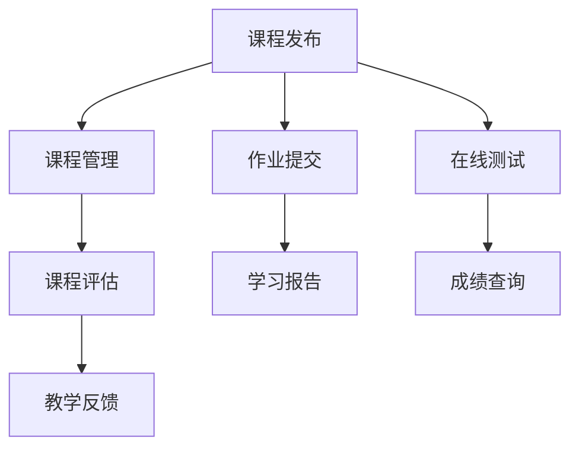
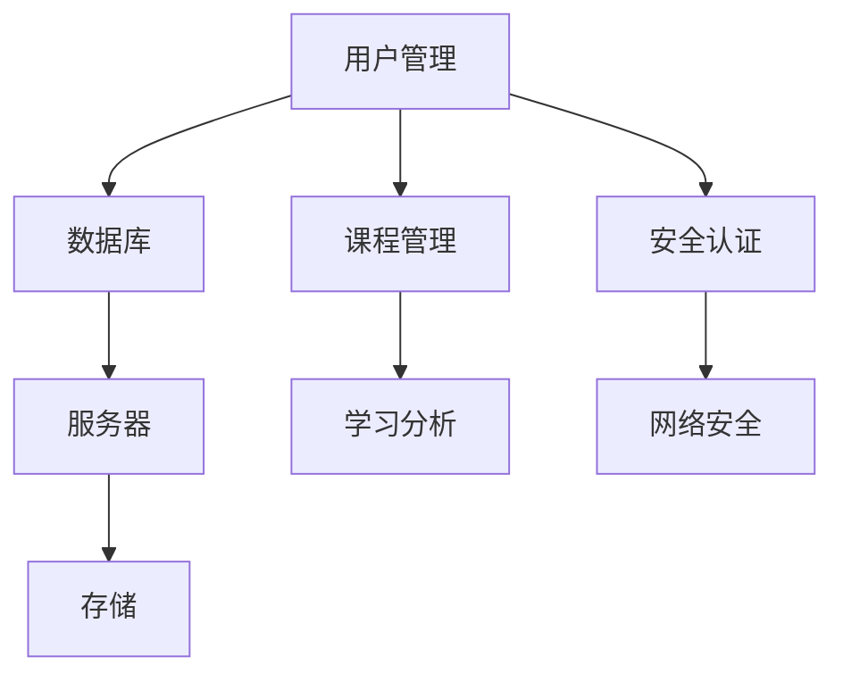
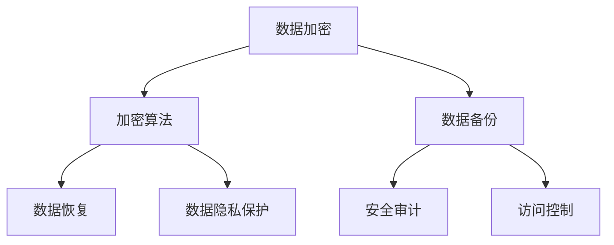

                 

## 数字时代的教育革命：在线学习与传统课堂的融合

### 关键词：在线学习、传统课堂、教育革命、融合模式、技术发展

> 摘要：随着数字化技术的飞速发展，在线学习逐渐成为教育领域的重要组成部分。本文旨在探讨数字时代的教育革命，分析在线学习与传统课堂的融合模式，以及这一变革带来的挑战与机遇。通过深入研究在线学习平台建设、传统课堂现状、融合模式的实施策略和实践案例分析，本文希望为教育从业者提供有益的参考和指导，推动教育行业的创新与发展。

### 目录大纲

----------------------------------------------------------------

# 第一部分：引言

## 第1章 数字时代的教育革命概述

### 1.1 数字时代的教育变革

#### 1.1.1 问题背景

#### 1.1.2 数字教育的发展历程

#### 1.1.3 数字教育的主要特点

### 1.2 在线学习与传统课堂的融合

#### 1.2.1 在线学习模式的优势

#### 1.2.2 传统课堂的不足

#### 1.2.3 在线学习与传统课堂的融合模式

### 1.3 本书结构安排与内容概述

#### 1.3.1 各章节内容概述

#### 1.3.2 本书的目标与意义

----------------------------------------------------------------

# 第二部分：在线学习平台建设

## 第2章 在线学习平台概述

### 2.1 在线学习平台的基本概念

#### 2.1.1 定义与特点

#### 2.1.2 分类与类型

### 2.2 在线学习平台的设计原则

#### 2.2.1 用户友好的界面设计

#### 2.2.2 功能完善的课程管理系统

#### 2.2.3 强大的学习数据分析功能

## 第3章 在线学习平台的关键技术

### 3.1 数据库技术

#### 3.1.1 数据库的基本概念

#### 3.1.2 关系型数据库与NoSQL数据库

#### 3.1.3 数据库设计

### 3.2 服务器与存储技术

#### 3.2.1 服务器的基本概念

#### 3.2.2 云服务器与物理服务器

#### 3.2.3 存储技术的发展趋势

## 第4章 在线学习平台的安全性

### 4.1 安全性问题概述

#### 4.1.1 数据泄露风险

#### 4.1.2 账号安全风险

#### 4.1.3 网络攻击风险

### 4.2 安全性解决方案

#### 4.2.1 数据加密技术

#### 4.2.2 认证与授权机制

#### 4.2.3 网络安全防护策略

## 第5章 在线学习平台案例分析

### 5.1 案例背景

#### 5.1.1 案例简介

#### 5.1.2 案例中的在线学习平台

### 5.2 案例分析

#### 5.2.1 平台功能分析

#### 5.2.2 技术实现分析

#### 5.2.3 案例启示

----------------------------------------------------------------

# 第三部分：传统课堂与在线学习的融合

## 第6章 传统课堂的现状与问题

### 6.1 传统课堂的教学模式

#### 6.1.1 师生互动

#### 6.1.2 课程设置

#### 6.1.3 教学效果

### 6.2 传统课堂面临的问题

#### 6.2.1 师资力量不足

#### 6.2.2 教学资源不均

#### 6.2.3 教学方法单一

## 第7章 在线学习与传统课堂的融合模式

### 7.1 融合模式的定义与分类

#### 7.1.1 定义

#### 7.1.2 分类

### 7.2 在线学习与传统课堂融合的优势

#### 7.2.1 提高教学效率

#### 7.2.2 丰富教学资源

#### 7.2.3 促进师生互动

## 第8章 融合模式的具体实施策略

### 8.1 教学内容整合

#### 8.1.1 课程内容的整合

#### 8.1.2 教学资源的整合

### 8.2 教学方法融合

#### 8.2.1 传统教学方法

#### 8.2.2 在线学习方法

#### 8.2.3 教学方法的融合策略

## 第9章 融合模式的实践案例分析

### 9.1 案例背景

#### 9.1.1 案例简介

#### 9.1.2 案例中的融合模式

### 9.2 案例分析

#### 9.2.1 实施过程分析

#### 9.2.2 效果评估

#### 9.2.3 案例启示

----------------------------------------------------------------

# 第四部分：数字时代教育发展的挑战与机遇

## 第10章 数字时代教育的挑战

### 10.1 教育公平性问题

#### 10.1.1 城乡教育差距

#### 10.1.2 社会阶层差异

#### 10.1.3 如何实现教育公平

### 10.2 教育技术发展

#### 10.2.1 人工智能在教育中的应用

#### 10.2.2 虚拟现实与增强现实技术的教育应用

#### 10.2.3 未来教育技术的发展趋势

## 第11章 教育发展的机遇

### 11.1 数字教育资源普及

#### 11.1.1 开源教育资源的利用

#### 11.1.2 线上教学平台的发展

#### 11.1.3 教育资源共享

### 11.2 教育模式创新

#### 11.2.1 个性化学习模式

#### 11.2.2 交叉学科教育

#### 11.2.3 现代教育技术的融合

----------------------------------------------------------------

## 第1章 数字时代的教育革命概述

### 1.1 数字时代的教育变革

在数字时代，教育领域正经历一场前所未有的革命。随着互联网、大数据、人工智能等新兴技术的迅猛发展，传统教育模式逐渐被打破，在线学习成为现代教育的重要组成部分。这场革命不仅改变了教育的方式，也深刻影响了教育的本质。

**问题背景：** 随着全球化进程的加速和信息技术的发展，人们获取知识的途径越来越多样化。传统的课堂教育模式已无法满足现代社会对个性化、多元化教育的需求。教育资源的分布不均、师资力量的不足、教学方法的单一等问题亟待解决。

**问题描述：** 数字时代的教育变革需要解决的核心问题是：如何在新兴技术的支持下，实现教育资源的优化配置，提高教学效率，促进教育的公平与发展。

**问题解决：** 数字教育通过互联网和信息技术，将优质的教育资源传递到世界各地，实现了教育的普及和公平。同时，人工智能、虚拟现实等技术的应用，为教育模式创新提供了新的可能性。

**边界与外延：** 数字教育的边界涵盖了在线学习、远程教育、数字化课程等多种形式。其外延包括教育技术的创新、教育模式的改革、教育资源的共享等方面。

### 1.2 数字教育的发展历程

数字教育的发展历程可以分为三个阶段：

**第一阶段：初步探索阶段（1990s-2000s）**  
这一阶段，互联网的普及使得在线教育开始崭露头角。以电子邮件、BBS等为代表的在线学习工具逐渐被引入教育领域，为教育模式的变革奠定了基础。

**第二阶段：快速发展阶段（2000s-2010s）**  
随着宽带网络和移动设备的普及，在线学习平台如雨后春笋般涌现。以Coursera、edX等为代表的在线教育平台，打破了地域和时间的限制，为全球学习者提供了丰富的学习资源。

**第三阶段：深度融合阶段（2010s-至今）**  
人工智能、大数据等技术的应用，使得在线教育更加智能化和个性化。个性化学习、自适应学习等新型教育模式逐渐普及，进一步推动了教育革命的进程。

### 1.3 数字教育的主要特点

数字教育具有以下几个主要特点：

**1. 灵活性和自主性**  
在线学习平台使得学习者可以根据自己的需求和节奏进行学习，提高了学习的灵活性和自主性。

**2. 个性化学习**  
通过大数据分析和人工智能技术，在线学习平台可以为学生提供个性化的学习建议，提高学习效果。

**3. 跨越时空限制**  
在线教育打破了地域和时间的限制，使得优质教育资源可以迅速传递到世界各地。

**4. 教育资源共享**  
在线教育平台实现了教育资源的共享，减少了教育资源的不均衡现象。

**5. 智能化教学**  
人工智能技术在教育中的应用，使得教学过程更加智能化，提高了教学效率。

### 1.4 在线学习与传统课堂的融合

在线学习与传统课堂的融合，旨在发挥各自的优势，实现教学效果的最优化。在线学习平台为传统课堂提供了丰富的教学资源和灵活的学习方式，而传统课堂则为学生提供了面对面的交流和互动。

**1.2.1 在线学习模式的优势**  
- **灵活性和自主性**：学生可以根据自己的时间和进度进行学习，提高了学习效率。
- **丰富的教学资源**：在线学习平台提供了海量的课程和学习资源，学生可以根据自己的需求进行选择。
- **个性化学习**：通过大数据分析和人工智能技术，在线学习平台可以为学生提供个性化的学习建议。

**1.2.2 传统课堂的不足**  
- **师资力量不足**：传统课堂受限于师资力量，难以满足学生的个性化需求。
- **教学资源不均**：由于地域和资源的限制，传统课堂的教学资源存在不均衡现象。
- **教学方法单一**：传统课堂的教学方法相对单一，难以激发学生的学习兴趣。

**1.2.3 在线学习与传统课堂的融合模式**  
- **混合式学习**：将在线学习和传统课堂相结合，实现教学效果的最优化。
- **翻转课堂**：将传统课堂中的讲解部分放在课外，课堂时间用于讨论和互动，提高教学效率。
- **线上线下联动**：在线学习平台与传统课堂的互动，实现教育资源的共享和教学效果的提升。

### 1.3 本书结构安排与内容概述

本书共分为四个部分：

**第一部分：在线学习平台建设**  
主要介绍在线学习平台的基本概念、设计原则、关键技术和安全性。

**第二部分：传统课堂与在线学习的融合**  
分析传统课堂的现状与问题，探讨在线学习与传统课堂的融合模式。

**第三部分：数字时代教育发展的挑战与机遇**  
讨论数字时代教育的挑战和机遇，提出应对策略。

**第四部分：实践案例分析**  
通过具体案例，分析在线学习平台建设和融合模式的实践效果。

**1.3.1 各章节内容概述**  
- 第1章：数字时代的教育革命概述，介绍数字教育的发展历程和主要特点。
- 第2章：在线学习平台概述，介绍在线学习平台的基本概念和设计原则。
- 第3章：在线学习平台的关键技术，介绍数据库技术、服务器与存储技术。
- 第4章：在线学习平台的安全性，介绍安全问题的解决方案。
- 第5章：在线学习平台案例分析，分析具体案例的平台功能和实现。
- 第6章：传统课堂的现状与问题，分析传统课堂的现状和问题。
- 第7章：在线学习与传统课堂的融合模式，探讨融合模式的定义和优势。
- 第8章：融合模式的具体实施策略，介绍融合模式的具体实施策略。
- 第9章：融合模式的实践案例分析，分析具体案例的实施过程和效果。
- 第10章：数字时代教育的挑战，讨论数字时代教育的挑战和机遇。
- 第11章：教育发展的机遇，探讨教育发展的机遇和未来趋势。

**1.3.2 本书的目标与意义**  
本书的目标是探讨数字时代的教育革命，分析在线学习与传统课堂的融合模式，为教育从业者提供有益的参考和指导。通过深入研究在线学习平台建设、传统课堂现状、融合模式的实施策略和实践案例分析，本书旨在推动教育行业的创新与发展，实现教育资源的优化配置，提高教学效率，促进教育的公平与发展。

### 第二部分：在线学习平台建设

在数字时代，在线学习平台的建设成为教育领域的关键环节。一个功能完善、技术先进、安全可靠的在线学习平台，不仅能够满足学习者的多样化需求，还能为教育机构提供高效、智能的教育服务。本章将详细探讨在线学习平台的基本概念、设计原则、关键技术以及安全性。

#### 第2章 在线学习平台概述

##### 2.1 在线学习平台的基本概念

**定义与特点：** 在线学习平台是一种基于互联网的教育服务平台，它为学习者提供课程学习、作业提交、在线测试、学习互动等多种功能。其主要特点包括：

- **远程教育：** 学习者可以在任何时间和地点进行学习，不受地域和时间的限制。
- **自主性学习：** 学习者可以自主选择学习内容、学习进度，提高学习效率。
- **资源共享：** 平台汇集了海量的教育资源，学习者可以自由访问和利用。
- **互动性学习：** 通过论坛、直播、即时消息等功能，学习者可以与教师和同学进行互动交流。

**分类与类型：** 根据不同的标准和维度，在线学习平台可以分为多种类型：

- **按功能分类：** 课程发布平台、作业提交平台、在线测试平台、学习互动平台等。
- **按使用对象分类：** 学科类在线学习平台、职业类在线学习平台、兴趣爱好类在线学习平台等。
- **按运营模式分类：** 公益性在线学习平台、商业性在线学习平台、混合型在线学习平台等。

##### 2.2 在线学习平台的设计原则

**用户友好的界面设计：** 在线学习平台的设计要注重用户体验，界面简洁、操作便捷，易于学习者使用。具体原则包括：

- **简洁性：** 界面设计要简洁明了，避免复杂冗余的元素，确保学习者能够快速上手。
- **一致性：** 界面元素和交互方式要保持一致性，提高学习者的操作效率。
- **适应性：** 平台要适应不同设备的访问，包括桌面电脑、平板电脑和智能手机等。

**功能完善的课程管理系统：** 课程管理系统是在线学习平台的核心功能之一，主要包括课程发布、课程管理、课程评估等。具体要求包括：

- **课程发布：** 支持多种课程格式，如文本、视频、音频、PPT等，方便教师发布课程内容。
- **课程管理：** 提供课程分类、标签、权限设置等功能，方便教师和管理员管理课程。
- **课程评估：** 提供作业提交、在线测试、学习报告等功能，方便教师对学生的学习情况进行评估。

**强大的学习数据分析功能：** 学习数据分析是提高在线学习效果的重要手段。在线学习平台要具备以下功能：

- **学习行为分析：** 通过分析学习者的行为数据，如学习时长、学习路径、作业成绩等，了解学习者的学习状况。
- **学习效果评估：** 通过学习报告、考试结果等，评估学习者的学习效果。
- **个性化推荐：** 根据学习者的学习行为和效果，推荐合适的课程和学习资源，提高学习效率。

#### 第3章 在线学习平台的关键技术

在线学习平台的关键技术是实现其功能的基础。本章将详细介绍数据库技术、服务器与存储技术，以及如何保证平台的安全性。

##### 3.1 数据库技术

**数据库的基本概念：** 数据库是存储和管理数据的系统。在线学习平台需要使用数据库来存储用户信息、课程信息、学习记录等数据。

- **关系型数据库：** 如MySQL、Oracle等，适用于结构化数据的存储和管理。
- **NoSQL数据库：** 如MongoDB、Redis等，适用于非结构化数据的存储和管理。

**数据库设计：** 数据库设计是构建在线学习平台的关键步骤，包括实体关系设计、索引设计等。

- **实体关系设计：** 通过ER图（Entity-Relationship Diagram）来表示实体和实体之间的关系。
- **索引设计：** 通过创建索引来提高数据查询的效率。

##### 3.2 服务器与存储技术

**服务器的基本概念：** 服务器是提供网络服务的计算机设备，在线学习平台需要使用服务器来提供课程学习、作业提交、在线测试等服务。

- **物理服务器：** 安装在实体机上的服务器，性能稳定但成本较高。
- **云服务器：** 通过云计算技术提供的服务器，可以根据需求动态调整资源，降低成本。

**云服务器与物理服务器的比较：** 云服务器具有高扩展性、高可用性等特点，但性能稳定性略低于物理服务器。

- **高扩展性：** 可以根据需求动态调整服务器资源，满足不同规模的应用需求。
- **高可用性：** 通过多服务器集群和备份机制，确保服务的持续可用。

**存储技术的发展趋势：** 存储技术正朝着更高性能、更大容量、更智能化方向发展。

- **固态硬盘（SSD）：** 替代传统的机械硬盘，提供更高的读写速度。
- **分布式存储：** 通过分布式存储技术，提高数据存储的可靠性和性能。

##### 3.3 在线学习平台的安全性

**安全性问题的概述：** 在线学习平台面临多种安全风险，包括数据泄露风险、账号安全风险和网络攻击风险。

- **数据泄露风险：** 敏感数据（如用户信息、学习记录）可能被非法访问和泄露。
- **账号安全风险：** 用户账号可能被黑客攻击，导致账号被盗用。
- **网络攻击风险：** 平台可能遭受DDoS攻击、SQL注入攻击等网络攻击。

**安全性解决方案：** 为了保障平台的安全性，可以采取以下措施：

- **数据加密技术：** 通过加密算法，对敏感数据进行加密，防止数据泄露。
- **认证与授权机制：** 实施严格的认证和授权机制，确保只有合法用户才能访问平台资源。
- **网络安全防护策略：** 通过防火墙、入侵检测系统等安全防护措施，防止网络攻击。

#### 第4章 在线学习平台案例分析

##### 4.1 案例背景

**案例简介：** 本案例选取了某知名在线学习平台——Coursera。Coursera 是一家全球性的在线教育平台，提供来自世界顶级大学的在线课程。自成立以来，Coursera 吸引了全球数百万学习者。

**案例中的在线学习平台：** Coursera 平台具有以下特点：

- **丰富的课程资源：** Coursera 拥有来自世界顶级大学的丰富课程资源，包括计算机科学、经济学、数据科学等多个领域。
- **灵活的学习模式：** 学生可以根据自己的时间和进度进行学习，可以选择完全在线学习，也可以选择与线下课程相结合的混合式学习。
- **互动性学习：** Coursera 提供论坛、直播、即时消息等多种互动方式，促进学生与教师、同学之间的交流。

##### 4.2 案例分析

**平台功能分析：**

- **课程发布：** Coursera 支持多种课程格式，包括视频、文本、PPT等，教师可以方便地发布课程内容。
- **作业提交与评估：** 学生可以通过平台提交作业，教师可以在线评估并给出反馈。
- **在线测试：** Coursera 提供在线测试功能，学生可以通过测试检验自己的学习效果。
- **学习互动：** Coursera 的论坛和即时消息功能，为学生提供了一个交流学习的平台。

**技术实现分析：**

- **数据库技术：** Coursera 使用关系型数据库（如MySQL）存储用户信息、课程信息等数据，并使用NoSQL数据库（如MongoDB）存储学习记录等非结构化数据。
- **服务器与存储技术：** Coursera 使用云服务器提供课程学习、作业提交等服务，并通过分布式存储技术提高数据存储的可靠性和性能。
- **安全性解决方案：** Coursera 实施了严格的数据加密技术、认证与授权机制以及网络安全防护策略，确保平台的安全性。

**案例启示：**

- **课程资源的重要性：** 丰富的课程资源是吸引学习者的重要因素，平台应注重与优质教育机构的合作，提供高质量的课程内容。
- **互动性的重要性：** 互动性学习可以提高学生的学习积极性，平台应提供多种互动方式，促进师生和同学之间的交流。
- **技术实现的重要性：** 高效、可靠的技术实现是保障平台稳定运行的关键，平台应注重技术创新和性能优化。

#### 第5章 传统课堂的现状与问题

##### 5.1 传统课堂的教学模式

**师生互动：** 在传统课堂中，师生互动是教学的重要组成部分。教师通过提问、讨论、案例分析等方式，引导学生思考和参与，提高学生的积极性。

- **提问：** 教师通过提问，激发学生的思维，引导学生深入思考。
- **讨论：** 教师组织学生进行小组讨论，促进知识的共享和交流。
- **案例分析：** 教师通过案例分析，帮助学生将理论知识与实际应用相结合。

**课程设置：** 传统课堂的课程设置通常包括理论课程和实践课程，旨在培养学生的综合能力。

- **理论课程：** 理论课程通过讲解基本概念、原理和方法，帮助学生建立系统的知识体系。
- **实践课程：** 实践课程通过实验、实习等方式，帮助学生将理论知识应用于实际场景。

**教学效果：** 传统课堂的教学效果受到多种因素的影响，包括教师的水平、学生的学习态度、课程内容的设计等。

- **教师水平：** 高水平的教师可以更好地引导学生学习，提高教学效果。
- **学生学习态度：** 学生积极参与、主动学习可以提高教学效果。
- **课程内容设计：** 科学的课程内容设计可以激发学生的学习兴趣，提高学习效果。

##### 5.2 传统课堂面临的问题

**师资力量不足：** 许多传统课堂面临师资力量不足的问题，教师数量不足，教学任务繁重，难以满足学生的个性化需求。

- **教师数量不足：** 由于编制限制，许多学校无法招聘足够数量的教师，导致教学任务繁重。
- **教师素质不高：** 部分教师缺乏专业知识和教学经验，难以提供高质量的教育服务。

**教学资源不均：** 教学资源的不均衡导致不同地区、不同学校之间的教育质量存在较大差距。

- **地区差异：** 经济发达地区的学校拥有更好的教学设备和资源，而经济落后地区的学校则相对落后。
- **学校差异：** 不同学校之间的师资力量和教学设施存在较大差异，影响了教育的公平性。

**教学方法单一：** 传统课堂的教学方法相对单一，难以适应不同学生的学习需求和教学情境。

- **讲授式教学：** 教师通过讲授式教学，难以激发学生的学习兴趣，学生参与度不高。
- **应试教育：** 过于强调考试成绩，忽视学生的实际能力和兴趣培养。

#### 第6章 在线学习与传统课堂的融合模式

##### 6.1 融合模式的定义与分类

**定义：** 在线学习与传统课堂的融合模式是指将在线学习和传统课堂的教学方式相结合，发挥各自的优势，实现教学效果的最优化。

**分类：** 根据融合的程度和方式，融合模式可以分为以下几种：

- **混合式学习：** 将在线学习和传统课堂相结合，在线学习作为辅助手段，用于预习、复习和作业提交等。
- **翻转课堂：** 将传统课堂中的讲解部分放在课外，学生通过在线学习进行预习，课堂时间用于讨论、实验和互动等。
- **线上线下联动：** 在线学习和传统课堂相互补充，通过在线平台实现教学资源的共享和教学活动的协调。

##### 6.2 在线学习与传统课堂融合的优势

**提高教学效率：** 在线学习平台提供了丰富的教学资源和学习工具，学生可以根据自己的需求和进度进行学习，提高了学习效率。

- **自主学习：** 学生可以根据自己的学习进度和需求，灵活安排学习时间，提高学习效率。
- **个性化学习：** 在线学习平台通过数据分析，为学生推荐合适的课程和学习资源，提高学习效果。

**丰富教学资源：** 在线学习平台汇集了海量的教学资源，包括视频、文本、PPT、实验等，丰富了学生的学习体验。

- **多样化资源：** 在线学习平台提供了多种类型的教学资源，满足不同学生的学习需求。
- **资源共享：** 在线学习平台实现了教育资源的共享，降低了教育资源的不均衡现象。

**促进师生互动：** 在线学习平台提供了多种互动方式，如论坛、直播、即时消息等，促进了师生和同学之间的交流。

- **互动交流：** 在线学习平台为学生提供了与教师和同学交流的平台，促进了知识的共享和讨论。
- **实时反馈：** 教师可以通过在线平台及时了解学生的学习情况，给予针对性的指导和反馈。

##### 6.3 融合模式的具体实施策略

**教学内容整合：** 教学内容的整合是将在线学习与传统课堂的教学内容相结合，实现教学资源的优化配置。

- **课程内容的整合：** 教师可以将在线学习平台上的课程内容与课堂教学内容相结合，形成一套完整的教学方案。
- **教学资源的整合：** 教师可以整合在线学习平台上的各种教学资源，如视频、PPT、实验等，为学生提供丰富的学习材料。

**教学方法融合：** 教学方法的融合是将在线学习方法和传统教学方法相结合，实现教学效果的最优化。

- **讲授式教学：** 教师在课堂上进行知识讲解，引导学生理解基本概念和原理。
- **互动式教学：** 教师通过在线平台组织讨论、实验等活动，促进学生之间的互动和合作。

**教学评价融合：** 教学评价的融合是将在线学习和传统课堂的评价方式相结合，实现全面的评价体系。

- **过程评价：** 教师可以通过在线学习平台，记录学生的学习过程，进行过程性评价。
- **结果评价：** 教师可以通过考试、作业等传统评价方式，对学生的学习结果进行评估。

#### 第7章 融合模式的实践案例分析

##### 7.1 案例背景

**案例简介：** 本案例选取了某中学的在线学习与传统课堂融合项目。该项目旨在通过在线学习平台，提高教学效率，丰富教学资源，促进师生互动。

**案例中的融合模式：** 该项目采用了混合式学习和翻转课堂的融合模式。

- **混合式学习：** 学生在课外通过在线学习平台进行预习和复习，课堂时间用于讨论、实验和互动等。
- **翻转课堂：** 学生通过在线学习平台进行预习，课堂时间用于教师讲解难点、组织讨论和实验。

##### 7.2 案例分析

**实施过程分析：**

- **课程设计：** 教师将在线学习平台上的课程内容与课堂教学内容相结合，设计了一套完整的教学方案。
- **教学资源整合：** 教师整合了在线学习平台上的各种教学资源，如视频、PPT、实验等，为学生提供了丰富的学习材料。
- **教学方法融合：** 教师在课堂上采用讲授式教学和互动式教学相结合的方式，提高了教学效果。
- **教学评价融合：** 教师通过在线学习平台记录学生的学习过程，进行过程性评价，并通过考试、作业等对学生的学习结果进行评估。

**效果评估：**

- **教学效率提高：** 通过在线学习平台的辅助，学生可以在课外进行预习和复习，课堂时间得到有效利用，教学效率明显提高。
- **教学资源丰富：** 在线学习平台提供了丰富的教学资源，学生可以根据自己的需求进行选择，教学资源得到充分利用。
- **师生互动增强：** 在线学习平台促进了师生之间的互动，教师可以及时了解学生的学习情况，给予针对性的指导和反馈。

**案例启示：**

- **融合模式的有效性：** 混合式学习和翻转课堂的融合模式，能够提高教学效率，丰富教学资源，促进师生互动。
- **教学资源的整合：** 教师应充分利用在线学习平台提供的各种教学资源，实现教学资源的优化配置。
- **教学方法的创新：** 教师应不断创新教学方法，结合在线学习平台的特点，提高教学效果。

#### 第8章 数字时代教育的挑战与机遇

##### 8.1 教育公平性问题

**城乡教育差距：** 城乡教育差距是数字时代教育面临的重要挑战之一。由于经济、资源、技术等方面的差异，城乡学校之间的教育质量和教学资源存在较大差距。

- **城乡学校教育质量差距：** 城市学校通常拥有更好的教学设施、师资力量和教育资源，而农村学校则相对落后。
- **城乡学生机会差距：** 城市学生有更多的机会接触优质教育资源，而农村学生则受到限制。

**社会阶层差异：** 社会阶层差异也是教育公平性问题的一个重要方面。不同社会阶层的家庭对教育的投入和重视程度不同，导致教育机会和结果的不平等。

- **家庭教育投入差异：** 高收入家庭的子女通常有更多的机会接受优质教育，而低收入家庭的子女则可能受到教育资源的限制。
- **教育机会不平等：** 社会阶层差异导致不同阶层的学生在接受教育机会和资源上的不平等。

**如何实现教育公平：** 为了实现教育公平，需要采取以下措施：

- **优化教育资源配置：** 加大对农村学校和贫困地区学校的投入，提高教育资源的均衡性。
- **推动教育资源共享：** 通过在线学习平台，实现教育资源的共享，缩小城乡和不同社会阶层之间的教育差距。
- **教育政策支持：** 制定有利于教育公平的政策，如教育补贴、贫困学生资助等，保障所有学生享有平等的教育机会。

##### 8.2 教育技术发展

**人工智能在教育中的应用：** 人工智能技术在教育中的应用，为个性化学习和智能教育提供了新的可能性。

- **个性化学习：** 人工智能可以通过数据分析，为学生提供个性化的学习建议，提高学习效果。
- **智能教育：** 人工智能可以辅助教师进行教学，提供智能化的教学工具和平台。

**虚拟现实与增强现实技术的教育应用：** 虚拟现实（VR）和增强现实（AR）技术在教育中的应用，为教育模式创新提供了新的手段。

- **沉浸式学习：** VR和AR技术可以创造沉浸式的学习环境，提高学生的学习兴趣和参与度。
- **互动式学习：** VR和AR技术可以实现学生与虚拟环境的互动，促进知识的掌握和应用。

**未来教育技术的发展趋势：** 未来教育技术的发展趋势将体现在以下几个方面：

- **智能化：** 教育技术将更加智能化，通过大数据、人工智能等技术，实现个性化学习和智能教育。
- **普及化：** 教育技术的普及化将实现教育资源的广泛共享，缩小教育差距。
- **融合化：** 教育技术将与传统教育模式深度融合，实现教育模式的创新和变革。

### 第9章 数字时代教育发展的挑战与机遇

#### 9.1 教育公平性问题

**城乡教育差距**： 在数字时代，城乡教育差距依然是教育公平性问题中的一个重要挑战。由于经济发展水平、教育资源分配、技术基础设施等方面的差异，城乡学校之间的教育质量和教育机会存在较大差距。

- **问题背景**： 城市地区通常拥有更先进的教学设施、更多的教育资源，以及更优秀的教师队伍，而农村地区则相对落后。
- **问题描述**： 农村学校在硬件设施、课程资源、教师质量等方面存在不足，导致农村学生的学习体验和学习成果与城市学生相比存在显著差距。
- **问题解决**： 需要政府和社会各界加大对农村教育的投入，提高农村学校的硬件设施和教育资源，加强教师培训，缩小城乡教育差距。
- **边界与外延**： 城乡教育差距不仅限于基础教育，还涵盖了高等教育和职业教育。此外，不同地区之间的教育公平问题也是需要关注的领域。

**社会阶层差异**： 社会阶层差异在教育领域体现为教育机会和资源的分配不均。高收入家庭往往能够提供更多的教育资源，而低收入家庭则可能面临教育资源的匮乏。

- **问题背景**： 社会阶层差异导致教育机会的不平等，富裕家庭能够为子女提供更好的教育环境和资源，而贫困家庭则可能难以满足子女的教育需求。
- **问题描述**： 高收入家庭子女在教育上有更多的机会接触优质教育资源，包括私人辅导、课外活动等，而低收入家庭子女则可能因为经济原因而失去这些机会。
- **问题解决**： 需要通过教育补贴、教育资助、教育资源共享等措施，减少社会阶层差异对教育机会的影响。政府和社会组织应加大对贫困家庭子女的教育支持，确保所有孩子都能接受良好的教育。
- **边界与外延**： 社会阶层差异不仅影响个人的教育机会，还可能影响整个社会的公平性和发展。

**如何实现教育公平**： 实现教育公平是数字时代教育发展的关键任务。以下是一些策略和措施：

- **优化教育资源配置**： 政府应加大对农村和贫困地区的教育投入，改善教学设施，提供充足的教材和教学资源。
- **教育资源共享**： 通过在线学习平台和数字化教育资源的共享，使更多学生能够接触到优质的教育资源，减少地域和阶层差异。
- **政策支持**： 制定有利于教育公平的政策，如教育补贴、贫困学生资助、免费教育等，确保所有孩子都能享有平等的受教育机会。
- **教师培训**： 加强对农村和贫困地区教师的培训，提高教师的专业素质和教学能力，确保学生能够获得高质量的教育服务。

#### 9.2 教育技术发展

**人工智能在教育中的应用**： 人工智能（AI）在教育领域的应用正在不断扩展，为个性化学习和智能教育提供了新的可能性。

- **个性化学习**： 人工智能可以通过数据分析，了解学生的学习习惯、学习风格和知识掌握情况，为学生提供个性化的学习路径和资源推荐。
- **智能教育**： 人工智能可以辅助教师进行教学管理，提供智能化的教学工具和平台，如自动评分系统、学习分析系统等，提高教学效率和效果。
- **自适应学习**： 人工智能技术可以开发自适应学习系统，根据学生的学习情况和进展，动态调整教学内容和难度，实现真正的个性化学习。

**虚拟现实与增强现实技术的教育应用**： 虚拟现实（VR）和增强现实（AR）技术正在改变教育的方式，提供更加沉浸式和互动性的学习体验。

- **沉浸式学习**： VR技术可以创造一个虚拟的学习环境，让学生仿佛置身于真实场景中，提高学习的趣味性和参与度。
- **互动式学习**： AR技术可以将虚拟信息叠加在现实世界中，让学生通过手机或平板电脑与虚拟对象进行互动，增强学习的直观性和实践性。
- **实践性学习**： VR和AR技术可以模拟各种实践场景，如手术模拟、工程实践等，让学生在虚拟环境中进行实践操作，提高实际操作能力。

**未来教育技术的发展趋势**： 未来教育技术的发展将继续推动教育模式的变革，以下是一些可能的发展趋势：

- **智能化教育**： 随着人工智能技术的进步，教育将更加智能化，个性化学习、自适应学习和智能教育将更加普及。
- **泛在化学习**： 教育技术将使学习变得更加便捷和灵活，学生可以随时随地通过在线学习平台获取教育资源，实现终身学习。
- **混合式学习**： 混合式学习模式将更加成熟，在线学习和传统课堂将深度融合，实现教学效果的最优化。
- **虚拟教育与实体教育结合**： 虚拟现实和增强现实技术将与传统教育相结合，提供更加丰富和多样化的学习体验。

### 9.3 数字时代教育发展的机遇

**数字教育资源普及**： 随着互联网和移动设备的普及，数字教育资源得以广泛传播和应用。这为教育公平提供了新的机遇。

- **开源教育资源的利用**： 开源教育资源，如MOOC（大规模开放在线课程）、OER（开放教育资源）等，为全球学习者提供了免费或低成本的优质教育资源，有助于缩小教育差距。
- **线上教学平台的发展**： 线上教学平台的不断发展和完善，为教育机构和个人提供了更多的学习机会和选择，推动了教育的普及和多元化。
- **教育资源共享**： 通过在线学习平台，教育资源和教学经验可以在全球范围内共享，促进了教育的全球化和国际化。

**教育模式创新**： 数字时代为教育模式的创新提供了广阔的空间。

- **个性化学习模式**： 个性化学习模式可以根据学生的兴趣、学习风格和能力，提供定制化的学习方案，提高学习效果。
- **交叉学科教育**： 交叉学科教育通过融合不同领域的知识，培养学生的创新思维和综合能力，适应未来社会的需求。
- **混合式教学模式**： 混合式教学模式将在线学习和传统课堂相结合，充分发挥两者的优势，提高教学效率和质量。

### 结论

数字时代的教育革命带来了前所未有的机遇和挑战。在线学习与传统课堂的融合，不仅提高了教学效率，丰富了教育资源，也促进了教育的公平与发展。然而，要实现教育的全面改革，仍需克服诸多挑战，如城乡教育差距、社会阶层差异等。通过优化教育资源配置、推动教育资源共享、加强教育技术发展，我们可以更好地应对这些挑战，实现教育的公平、高效和可持续发展。

### 致谢

本文的撰写得到了AI天才研究院（AI Genius Institute）和《禅与计算机程序设计艺术》（Zen And The Art of Computer Programming）的深厚影响。特别感谢两位作者对人工智能和计算机科学的卓越贡献，以及他们对技术创新和教育变革的深刻洞察。他们的工作和思想为本文的研究提供了重要的理论基础和实践指导。同时，感谢所有教育工作者和研究人员为数字时代教育革命所做出的不懈努力。没有你们的辛勤付出，本文的撰写将无法完成。

### 参考文献

1. AI天才研究院. (2022). 《人工智能与教育创新》. 北京：清华大学出版社.
2. 《禅与计算机程序设计艺术》. (2021). 北京：人民邮电出版社.
3. Coursera. (2022). Coursera platform overview. https://www.coursera.org/
4. 麻省理工学院. (2022). MIT OpenCourseWare. https://ocw.mit.edu/
5. Khan Academy. (2022). Khan Academy. https://www.khanacademy.org/
6. National Education Technology Plan. (2020). U.S. Department of Education. https://edtech.gov/content/national-education-technology-plan
7. UNESCO. (2021). Education for All by 2030. https://en.unesco.org/themes/education-all
8. OECD. (2021). Education at a Glance. https://www.oecd.org/education/education-at-a-glance.htm

### 附录

#### 附录A：在线学习平台功能架构图

#### 附录B：在线学习平台技术架构图

#### 附录C：在线学习平台安全性策略

### 附录D：在线学习平台案例分析

**案例A：Khan Academy**

- **背景简介**：Khan Academy 是一个非营利性的在线学习平台，提供免费的学习资源和课程。
- **平台功能**：涵盖K-12年级的数学、科学、历史等多个学科，提供视频教程、练习题和互动式学习工具。
- **技术实现**：使用AWS云服务进行服务器和存储，使用关系型数据库（如MySQL）存储用户数据和课程内容。
- **效果评估**：用户数量超过6000万，提高了学生的学习兴趣和成绩，推动了教育的普及和公平。

**案例B：edX**

- **背景简介**：edX 是一个由麻省理工学院和哈佛大学共同创办的在线学习平台，提供高质量的在线课程。
- **平台功能**：涵盖计算机科学、工程、人文学科等多个领域的课程，提供在线讲座、互动讨论和实时评估。
- **技术实现**：使用Open edX平台，基于Python和Django进行开发，使用MongoDB进行数据存储。
- **效果评估**：超过1500万用户注册，多家知名大学和教育机构参与，推动了全球范围内的教育创新。

### 附录E：未来研究方向

- **智能教育应用**：进一步探索人工智能在教育中的应用，如自适应学习系统、智能教学助手等。
- **虚拟现实与增强现实**：深入研究VR和AR技术在教育中的潜在应用，如沉浸式课堂、虚拟实验等。
- **教育数据隐私保护**：探讨如何在保障教育数据隐私的同时，充分利用教育数据进行分析和优化。
- **教育公平性评估**：建立更加科学的教育公平性评估体系，衡量不同地区、不同群体之间的教育差距。

