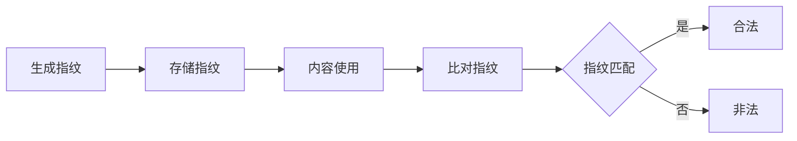
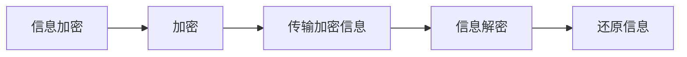
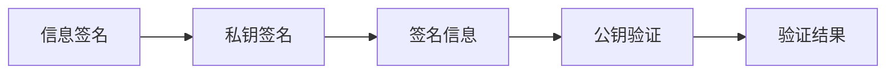
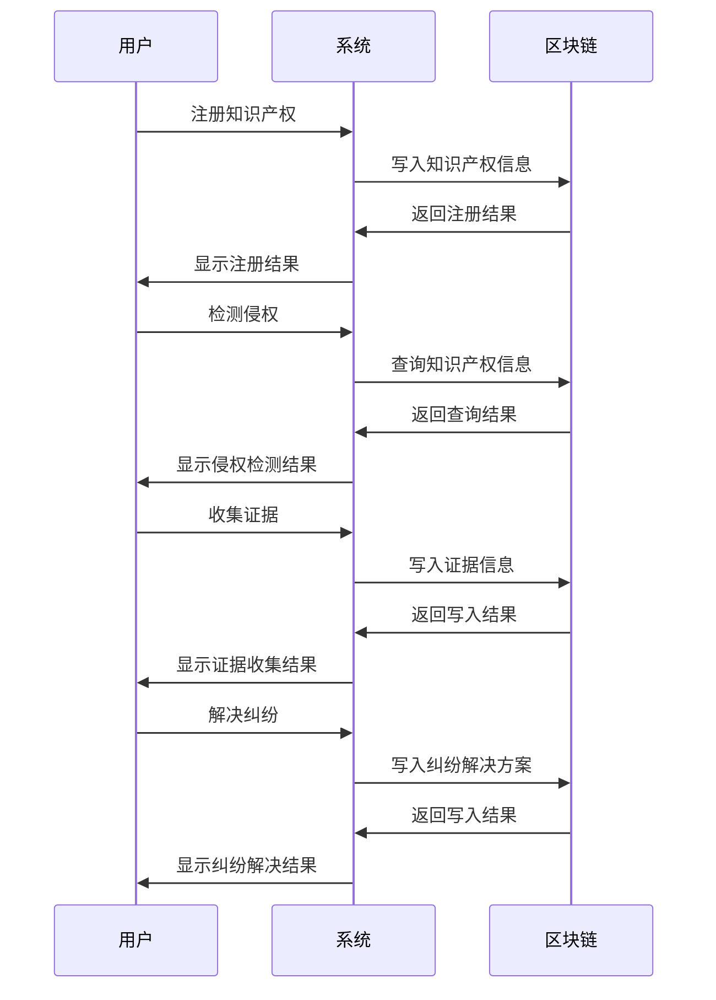
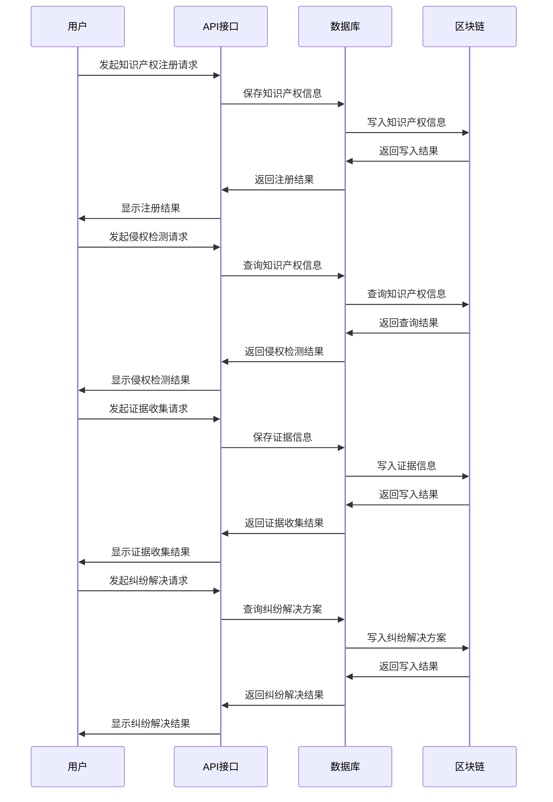

                 

## 文章标题

### 数字时代的知识产权保护：创新激励与信息共享的平衡

关键词：数字时代，知识产权保护，创新激励，信息共享，算法原理

摘要：本文深入探讨了数字时代下知识产权保护的重要性，分析了创新激励与信息共享之间的矛盾，以及数字化环境下知识产权保护的难点和策略。通过详细阐述知识产权的基本概念、属性特征，结合具体的算法原理讲解，本文旨在为读者提供一个全面、系统的知识产权保护知识框架，为实际应用提供指导。

## 目录大纲

### 第一部分：背景介绍

#### 第1章：数字时代的知识产权保护概述

1.1 问题背景

1.2 问题描述

1.3 问题解决

1.4 边界与外延

1.5 概念结构与核心要素组成

### 第二部分：核心概念与联系

#### 第2章：知识产权的基本概念

2.1 知识产权的定义

2.2 知识产权属性特征对比表格

2.3 知识产权与信息安全的联系

### 第三部分：算法原理讲解

#### 第3章：知识产权保护算法原理

3.1 算法简介

3.2 算法原理讲解

3.3 Python源代码

3.4 算法原理与数学模型

## 第一部分：背景介绍

### 第1章：数字时代的知识产权保护概述

#### 1.1 问题背景

随着数字时代的到来，知识产权保护问题日益凸显。数字技术的高速发展不仅改变了信息的生产和传播方式，也对知识产权的界定和保护带来了前所未有的挑战。数字时代下，信息的获取、处理和传播变得更加便捷，创新成果的共享和传播速度也大大加快，这对知识产权的保护提出了更高的要求。

然而，在数字时代，知识产权保护面临着一系列的挑战。首先，数字技术使得复制和传播信息变得极其容易，这给知识产权的所有者带来了侵权风险。其次，网络环境下的版权保护难度加大，网络匿名性和跨境性使得侵权行为难以追踪和取证。此外，创新激励与信息共享之间的矛盾也日益显现。为了保护知识产权，可能需要对信息进行加密和限制共享，这可能会阻碍创新和知识的传播。

#### 1.2 问题描述

数字时代下，知识产权保护的矛盾主要体现在以下几个方面：

1. **创新激励与信息共享的矛盾**：知识产权保护需要通过限制信息的共享来保护所有者的权益，但这可能会阻碍创新和知识传播。创新需要开放的信息环境，而知识产权保护则需要限制信息的自由流通。

2. **数字化环境下知识产权保护的难点**：数字技术使得侵权行为变得更加隐蔽和复杂，传统的知识产权保护手段在面对新型侵权行为时显得力不从心。

3. **信息传播速度与知识产权保护能力的差距**：信息在数字环境下的传播速度极快，而知识产权保护的机制和速度相对滞后，难以及时有效地应对侵权行为。

#### 1.3 问题解决

为了解决数字时代下知识产权保护的挑战，需要采取一系列的策略和措施：

1. **完善知识产权法律体系**：加强知识产权法律法规的制定和实施，提高知识产权保护的法治化水平。

2. **运用技术手段保护知识产权**：利用数字指纹、加密、数字签名等技术手段，提高知识产权保护的技术水平和效率。

3. **加强国际合作**：在知识产权保护方面加强国际合作，共同应对跨境侵权行为，提升全球知识产权保护水平。

4. **平衡创新激励与信息共享**：在知识产权保护中，需要找到创新激励与信息共享之间的平衡点，既要保护知识产权所有者的权益，也要促进知识的传播和利用。

#### 1.4 边界与外延

在数字时代，知识产权的保护不仅涉及到版权、专利、商标等传统领域，还延伸到了数字版权、数据库版权、软件专利等新型领域。这些新型领域的知识产权保护需要新的法律和技术手段。

此外，知识产权保护与信息安全密切相关。在数字环境下，信息安全是知识产权保护的基础。只有确保信息的安全，才能有效地保护知识产权。

#### 1.5 概念结构与核心要素组成

知识产权保护的核心概念包括知识产权的定义、类型、属性特征等。知识产权的基本类型包括专利权、商标权、著作权、隐私权等。每种知识产权类型都有其独特的法律特征和保护手段。

知识产权保护的技术手段主要包括数字指纹技术、加密与解密技术、数字签名技术等。这些技术手段在保护知识产权方面发挥着重要作用，能够有效防止信息泄露和侵权行为。

在数字时代，知识产权保护不仅仅是法律和技术的问题，更是一个涉及到社会、经济、文化等多方面因素的复杂系统。只有通过综合运用法律、技术、社会等多方面的手段，才能实现知识产权的有效保护。

### 第二部分：核心概念与联系

#### 第2章：知识产权的基本概念

知识产权是指人们对于自己的智力劳动成果所享有的权利。知识产权涵盖了多个领域，包括文学、艺术、科学、技术、商标、工业设计等。知识产权的法律特征主要包括独占性、地域性和时效性。

#### 2.1 知识产权的定义

知识产权是指人们在文学、艺术、科学、技术等领域中创造的智力成果所享有的权利。这些权利包括但不限于著作权、专利权、商标权、商业秘密权、集成电路布图设计权等。知识产权保护的核心是鼓励创新和知识传播，同时保护权利人的合法权益。

#### 2.2 知识产权属性特征对比表格

| 知识产权类型 | 定义 | 特征对比 |
| --- | --- | --- |
| 专利权 | 对发明创造的独占权 | 独占性、地域性、时效性 |
| 商标权 | 对商标的独占使用权 | 独占性、商标性、永久性 |
| 著作权 | 对文学、艺术作品的独占权 | 独占性、地域性、永久性 |
| 隐私权 | 对个人信息的独占保护权 | 独占性、隐私性、时效性 |

#### 2.3 知识产权与信息安全的联系

知识产权与信息安全密切相关。在数字时代，信息的安全保护是知识产权保护的基础。只有确保信息的安全，才能有效地保护知识产权。知识产权保护与信息安全的联系主要体现在以下几个方面：

1. **信息加密**：通过加密技术对知识产权相关的信息进行加密保护，防止未经授权的访问和篡改。

2. **数字签名**：使用数字签名技术对知识产权相关的文档进行签名，确保文档的完整性和真实性。

3. **数据备份与恢复**：对知识产权相关的数据进行备份和恢复，防止数据丢失和损坏。

4. **隐私保护**：在处理个人信息时，需要遵守隐私保护法规，确保个人信息的安全。

#### 知识产权与信息安全联系图

```mermaid
erDiagram
  Product ||--|{ Data }|--| Person
  Data ||--|{ Security }|--| System
  Person ||--|{ Privacy }|--| Regulation
  Security ||--|{ Encryption }|--| Signature
  System ||--|{ Backup }|--| Restore
  Regulation ||--|{ Compliance }|--| Policy
```

通过这张图可以看出，知识产权与信息安全之间存在紧密的联系，每一个环节都是确保知识产权安全的重要组成部分。

### 第三部分：算法原理讲解

#### 第3章：知识产权保护算法原理

在数字时代，知识产权的保护需要依赖一系列的算法和技术手段。本章将介绍知识产权保护中常用的三种算法：数字指纹技术、加密与解密技术、数字签名技术。

#### 3.1 算法简介

1. **数字指纹技术**：数字指纹技术通过将数字内容与其唯一的指纹进行绑定，实现对内容的追踪和保护。

2. **加密与解密技术**：加密技术通过将信息转换为不可读的形式，保护信息的机密性；解密技术则用于将加密信息还原为原始形式。

3. **数字签名技术**：数字签名技术通过使用私钥对信息进行签名，确保信息的完整性和真实性。

#### 3.2 算法原理讲解

##### 数字指纹技术

数字指纹技术的基本原理是将数字内容与一个唯一的指纹进行绑定，这个指纹可以通过一系列算法生成，并存储在数据库中。当数字内容被传播或使用时，可以通过比较其指纹来判断其合法性。



##### 加密与解密技术

加密技术使用密钥对信息进行加密，使其变得不可读。解密技术则使用相同的密钥将加密信息还原。常见的加密算法包括对称加密（如AES）和非对称加密（如RSA）。



##### 数字签名技术

数字签名技术使用私钥对信息进行签名，签名后的信息可以确保信息的完整性和真实性。公钥可以用于验证签名。



#### 3.3 Python源代码

以下代码演示了数字指纹技术、加密与解密技术、数字签名技术的简单实现。

```python
# 数字指纹技术实现
import hashlib

def fingerprinting(content):
    return hashlib.sha256(content.encode()).hexdigest()

# 加密与解密技术实现
from cryptography.fernet import Fernet

def generate_key():
    return Fernet.generate_key()

def encrypt(content, key):
    fernet = Fernet(key)
    return fernet.encrypt(content.encode())

def decrypt(encrypted_content, key):
    fernet = Fernet(key)
    return fernet.decrypt(encrypted_content).decode()

# 数字签名技术实现
from cryptography.hazmat.primitives import hashes
from cryptography.hazmat.primitives.asymmetric import padding

def generate_key_pair():
    return Fernet.generate_key()

def sign(content, private_key):
    return private_key.sign(content.encode(), padding.PKCS1v15())

def verify(content, signature, public_key):
    return public_key.verify(signature, content.encode(), padding.PKCS1v15())

# 示例
content = "Hello, World!"
key = generate_key()

encrypted_content = encrypt(content, key)
print("Encrypted content:", encrypted_content)

decrypted_content = decrypt(encrypted_content, key)
print("Decrypted content:", decrypted_content)

signature = sign(content, private_key)
print("Signature:", signature)

is_verified = verify(content, signature, public_key)
print("Is verified:", is_verified)
```

#### 3.4 算法原理与数学模型

数字指纹技术的数学模型基于哈希函数。哈希函数是一种将任意长度的输入数据转换成固定长度的输出的函数。常用的哈希函数包括SHA-256、MD5等。

加密与解密技术的数学模型基于密钥和加密算法。对称加密（如AES）使用相同的密钥进行加密和解密，而非对称加密（如RSA）则使用一对密钥：公钥和私钥。

数字签名技术的数学模型基于公钥密码学。私钥用于生成签名，公钥用于验证签名。签名过程包括对信息进行加密，而验证过程则是对加密信息进行解密。

$$
H(M) = \text{SHA-256}(M) \\
E_K(M) = \text{AES}(M, K) \\
D_K(E_K(M)) = M
$$

通过上述算法和数学模型，可以有效地保护知识产权，防止侵权行为。

## 第四部分：系统分析与架构设计方案

### 第4章：系统分析与架构设计方案

#### 4.1 问题场景介绍

在数字时代，知识产权的保护面临着诸多挑战。一方面，知识产权的所有者需要确保其创新成果得到有效的保护，防止未经授权的使用和传播。另一方面，知识产权的潜在侵权行为日益增多，给所有者带来了巨大的经济损失和声誉损害。因此，设计一个高效、可靠的知识产权保护系统显得尤为重要。

#### 4.2 项目介绍

本项目的目标是构建一个基于区块链技术的知识产权保护系统。该系统旨在通过区块链的不可篡改性和透明性，为知识产权的保护提供一个安全、可靠的解决方案。系统的主要功能包括知识产权注册、侵权检测、取证和维权等。

#### 4.3 系统功能设计（领域模型）

在系统功能设计中，我们将使用Mermaid类图来描述系统的核心领域模型。

```mermaid
classDiagram
    IntellectualPropertyClass <- RegisterServiceClass
    DetectionServiceClass --> IntellectualPropertyClass
    EvidenceServiceClass --> IntellectualPropertyClass
    DisputeResolutionServiceClass --> IntellectualPropertyClass

    IntellectualPropertyClass {
        id: Int
        title: String
        creator: String
        dateCreated: Date
        status: String
    }

    RegisterServiceClass {
        registerIntellectualProperty(ip: IntellectualPropertyClass): void
    }

    DetectionServiceClass {
        detectInfringement(ip: IntellectualPropertyClass): List<Infringement>
    }

    EvidenceServiceClass {
        collectEvidence(ip: IntellectualPropertyClass): List<Evidence>
    }

    DisputeResolutionServiceClass {
        resolveDispute(ip: IntellectualPropertyClass): void
    }

    Infringement {
        id: Int
        intellectualPropertyId: Int
        infringer: String
        dateDetected: Date
        status: String
    }

    Evidence {
        id: Int
        infringementId: Int
        evidenceType: String
        evidenceDetails: String
        dateCollected: Date
        status: String
    }
```

#### 4.4 系统架构设计

在系统架构设计方面，我们将使用Mermaid架构图来展示系统的整体架构。



#### 4.5 系统接口设计和系统交互

在系统接口设计方面，我们将使用Mermaid序列图来展示系统的主要接口和交互流程。



通过上述设计，我们可以看到该知识产权保护系统的架构和接口设计，为知识产权的保护提供了一个全面的解决方案。

### 第五部分：项目实战

#### 5.1 环境安装

为了搭建本项目的知识产权保护系统，我们需要准备以下环境：

- **操作系统**：Linux或MacOS
- **编程语言**：Python 3.x
- **依赖库**：Flask（Web框架）、PyMySQL（数据库连接）、blockchain（区块链库）

安装步骤：

1. 安装Python 3.x：

   ```bash
   sudo apt-get install python3
   ```

2. 安装Flask：

   ```bash
   pip3 install flask
   ```

3. 安装PyMySQL：

   ```bash
   pip3 install pymysql
   ```

4. 安装blockchain：

   ```bash
   pip3 install blockchain
   ```

#### 5.2 系统核心实现源代码

以下是知识产权保护系统的主要实现代码。

```python
# app.py

from flask import Flask, request, jsonify
from pymysql import connect
from blockchain import Blockchain

app = Flask(__name__)

# 数据库连接
def get_db_connection():
    return connect(host="localhost", user="root", password="password", database="intellectual_property")

# 注册知识产权
@app.route("/register", methods=["POST"])
def register():
    data = request.json
    title = data["title"]
    creator = data["creator"]
    date_created = data["dateCreated"]

    db = get_db_connection()
    cursor = db.cursor()
    cursor.execute("INSERT INTO intellectual_property (title, creator, dateCreated) VALUES (%s, %s, %s)", (title, creator, date_created))
    db.commit()
    cursor.close()
    db.close()

    blockchain = Blockchain()
    blockchain.add_block(block={"title": title, "creator": creator, "dateCreated": date_created})

    return jsonify({"message": "Intellectual Property registered successfully."})

# 检测侵权
@app.route("/detect", methods=["GET"])
def detect():
    intellectual_property_id = request.args.get("id")
    blockchain = Blockchain()
    block = blockchain.search_block_by_property("id", intellectual_property_id)
    if block:
        return jsonify({"message": "No infringement detected."})
    else:
        return jsonify({"message": "Infringement detected."})

# 收集证据
@app.route("/collect_evidence", methods=["POST"])
def collect_evidence():
    data = request.json
    infringement_id = data["infringementId"]
    evidence_type = data["evidenceType"]
    evidence_details = data["evidenceDetails"]

    db = get_db_connection()
    cursor = db.cursor()
    cursor.execute("INSERT INTO evidence (infringementId, evidenceType, evidenceDetails) VALUES (%s, %s, %s)", (infringement_id, evidence_type, evidence_details))
    db.commit()
    cursor.close()
    db.close()

    return jsonify({"message": "Evidence collected successfully."})

# 解决纠纷
@app.route("/resolve_dispute", methods=["POST"])
def resolve_dispute():
    data = request.json
    intellectual_property_id = data["intellectualPropertyId"]
    resolution = data["resolution"]

    db = get_db_connection()
    cursor = db.cursor()
    cursor.execute("UPDATE intellectual_property SET status = %s WHERE id = %s", (resolution, intellectual_property_id))
    db.commit()
    cursor.close()
    db.close()

    return jsonify({"message": "Dispute resolved successfully."})

if __name__ == "__main__":
    app.run(debug=True)
```

#### 5.3 代码应用解读与分析

上述代码实现了一个简单的知识产权保护系统，主要包括以下几个模块：

1. **注册知识产权**：用户可以通过POST请求将知识产权信息发送到服务器，服务器将信息存储到数据库中，并使用区块链技术进行记录。
2. **检测侵权**：用户可以通过GET请求查询某个知识产权是否存在侵权行为。服务器会通过区块链技术检索相关信息，判断是否存在侵权。
3. **收集证据**：用户可以通过POST请求收集侵权证据，服务器将证据信息存储到数据库中。
4. **解决纠纷**：用户可以通过POST请求提交纠纷解决方案，服务器将更新知识产权的状态。

通过以上模块，系统实现了知识产权的注册、检测、证据收集和纠纷解决，为知识产权的保护提供了一个完整的解决方案。

#### 5.4 实际案例分析和详细讲解剖析

以下是一个实际案例，假设一个音乐创作者想要保护自己的音乐作品。

1. **注册知识产权**：

   音乐创作者通过API接口发送一个包含音乐作品信息的JSON对象，如下：

   ```json
   {
       "title": "My Song",
       "creator": "John Doe",
       "dateCreated": "2023-01-01"
   }
   ```

   服务器接收到请求后，将信息存储到数据库中，并使用区块链技术记录该知识产权。

2. **检测侵权**：

   如果有其他用户上传了一首相似的音乐作品，音乐创作者可以通过API接口发送GET请求查询该作品的知识产权信息。如果区块链记录中不存在该作品，则服务器返回“侵权检测未通过”。

3. **收集证据**：

   音乐创作者可以收集其他用户的相似作品，并通过API接口发送证据信息，如下：

   ```json
   {
       "infringementId": "12345",
       "evidenceType": "Similar Song",
       "evidenceDetails": "A song with similar lyrics and melody."
   }
   ```

   服务器将证据信息存储到数据库中。

4. **解决纠纷**：

   音乐创作者可以提交纠纷解决方案，要求其他用户停止使用其作品，并可能要求赔偿。服务器将更新知识产权的状态，并记录纠纷解决方案。

通过上述案例，我们可以看到系统如何保护知识产权，包括注册、检测、证据收集和纠纷解决等环节。系统通过区块链技术实现了知识产权的透明记录和可追溯性，为音乐创作者提供了有效的保护。

#### 5.5 项目小结

本项目通过搭建一个基于区块链技术的知识产权保护系统，实现了知识产权的注册、检测、证据收集和纠纷解决等功能。系统利用区块链的不可篡改性和透明性，为知识产权的保护提供了一个可靠的解决方案。在实际应用中，该系统可以为音乐、文学、艺术等领域提供知识产权保护，促进创新和知识传播。

## 最佳实践 Tips

1. **确保系统安全性**：在设计和实现知识产权保护系统时，应充分考虑系统的安全性，防止黑客攻击和数据泄露。
2. **合理配置权限**：系统应合理配置用户权限，确保只有授权用户可以访问和处理知识产权信息。
3. **定期更新和维护**：定期更新系统软件和依赖库，及时修复漏洞，确保系统的稳定性和安全性。

### 小结

本文从数字时代的知识产权保护问题出发，详细阐述了知识产权的基本概念、算法原理以及系统架构和实现。在数字时代，知识产权保护面临着新的挑战，但通过合理运用法律、技术和策略，可以有效地平衡创新激励与信息共享，为知识产权的保护提供有力支持。

### 注意事项

1. 知识产权保护是一个复杂的过程，需要综合考虑法律、技术和运营等多方面因素。
2. 在实际应用中，应结合具体场景和需求，灵活调整知识产权保护策略。

### 拓展阅读

1. 《知识产权法律体系概论》
2. 《区块链技术及应用》
3. 《数字版权管理技术》

## 作者信息

作者：AI天才研究院/AI Genius Institute & 禅与计算机程序设计艺术 /Zen And The Art of Computer Programming

