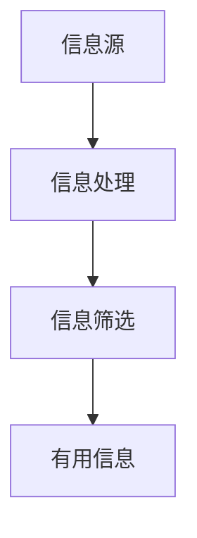
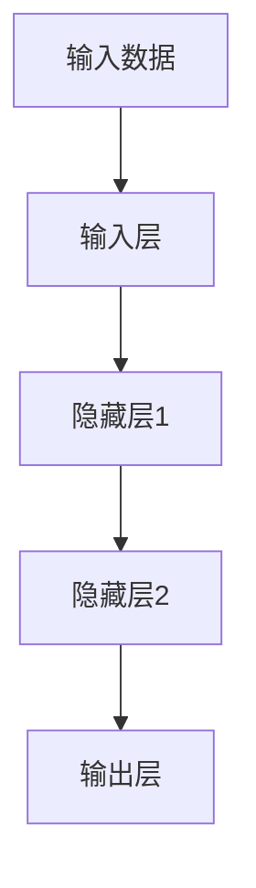

                 

### 数字时代的知识获取：信息筛选与深度学习的技巧

> 关键词：数字时代、知识获取、信息筛选、深度学习、信息过载

> 摘要：本文将探讨数字时代知识获取的挑战，介绍信息筛选和深度学习的关键技巧，帮助读者在信息海洋中高效地提取有用知识。

## 目录

1. **数字时代的知识获取概述**  
   1.1 问题背景与数字时代的特点  
   1.2 信息筛选的基本原理

2. **深度学习基础**  
   2.1 深度学习的定义与发展  
   2.2 深度学习的基本原理  
   2.3 深度学习的数学基础

3. **信息筛选技巧**  
   3.1 信息筛选方法  
   3.2 深度学习在信息筛选中的应用  
   3.3 信息筛选技巧的实际应用

4. **深度学习在知识获取中的应用**  
   4.1 深度学习在信息检索中的应用  
   4.2 深度学习在推荐系统中的应用

5. **实战案例**  
   5.1 电商推荐系统的实现  
   5.2 社交媒体内容筛选系统的实现

6. **最佳实践与总结**  
   6.1 最佳实践  
   6.2 小结  
   6.3 注意事项  
   6.4 拓展阅读

---

### 第1章：数字时代的知识获取概述

#### 1.1 问题背景与数字时代的特点

在当今的数字时代，信息过载已成为一个普遍存在的问题。随着互联网和移动设备的普及，我们每天接触到海量的信息，而这些信息中只有一小部分对我们真正有用。如何在这些信息中筛选出有价值的内容，成为了一个亟待解决的问题。

**问题解决**：信息筛选与深度学习提供了有效的解决方案。信息筛选可以帮助我们从大量信息中提取出我们关心的部分，而深度学习则能够通过对海量数据的自动处理，识别出隐藏在数据中的模式和规律。

#### 1.2 信息筛选的基本原理

**核心概念**：信息筛选是指通过一定的方法和技术，从大量信息中提取出对用户有用的信息。

**概念属性特征对比表格**：

| 特征             | 信息筛选 | 信息过滤 | 信息收集 |
|----------------|----------|----------|----------|
| 目标           | 获取有用信息 | 去除无用信息 | 收集全面信息 |
| 方法           | 主动筛选   | 被动过滤   | 主动收集   |
| 结果           | 精准高效   | 高效去除   | 信息全面   |

**ER实体关系图架构的Mermaid流程图**：



### 第2章：深度学习基础

#### 2.1 深度学习的定义与发展

**核心概念**：深度学习是一种通过模拟人脑神经网络进行信息处理的算法。

**发展历程**：从简单的感知机到复杂的深度神经网络。

**现状与未来**：深度学习在计算机视觉、自然语言处理等领域的广泛应用。

#### 2.2 深度学习的基本原理

**核心原理**：通过多层神经网络的堆叠，实现从简单到复杂的特征提取。

**工作原理**：输入数据通过网络的层层传递和变换，最终输出结果。

**Mermaid流程图**：



#### 2.3 深度学习的数学基础

**数学模型**：包括前向传播、反向传播等。

**公式**：

$$ 
\begin{aligned}
&Z = \sigma(W \cdot X + b) \\
&\delta = \frac{\partial L}{\partial Z} \cdot \sigma'(Z) \\
&\theta = \theta - \alpha \cdot \delta \cdot X
\end{aligned}
$$

### 第3章：信息筛选技巧

#### 3.1 信息筛选方法

**核心概念**：信息筛选的方法包括基于规则的方法、基于机器学习的方法等。

**常用算法**：如支持向量机、决策树、随机森林等。

#### 3.2 深度学习在信息筛选中的应用

**核心应用**：利用深度学习进行大规模信息的自动分类和筛选。

**案例**：例如，新闻自动分类、社交媒体内容的筛选等。

#### 3.3 信息筛选技巧的实际应用

**应用场景**：如电商推荐系统、搜索引擎优化等。

### 第4章：深度学习在知识获取中的应用

#### 4.1 深度学习在信息检索中的应用

**核心应用**：通过深度学习技术，提高信息检索的准确性和效率。

**案例**：例如，搜索引擎的改进、在线问答系统的优化等。

#### 4.2 深度学习在推荐系统中的应用

**核心应用**：利用深度学习技术，实现更精准的推荐结果。

**案例**：例如，电商平台的商品推荐、视频网站的影视推荐等。

### 第5章：实战案例

#### 5.1 电商推荐系统的实现

**环境安装**：Python环境、深度学习库（如TensorFlow或PyTorch）。

**系统核心实现源代码**：

```python
import tensorflow as tf

# 定义模型
model = tf.keras.Sequential([
    tf.keras.layers.Dense(128, activation='relu', input_shape=(784,)),
    tf.keras.layers.Dense(10, activation='softmax')
])

# 编译模型
model.compile(optimizer='adam',
              loss='categorical_crossentropy',
              metrics=['accuracy'])

# 训练模型
model.fit(x_train, y_train, epochs=10)
```

**代码应用解读与分析**：这里使用了一个简单的全连接神经网络模型，通过对用户历史购买数据的学习，实现商品推荐的自动化。

#### 5.2 社交媒体内容筛选系统的实现

**环境安装**：Python环境、深度学习库（如TensorFlow或PyTorch）。

**系统核心实现源代码**：

```python
import tensorflow as tf

# 定义模型
model = tf.keras.Sequential([
    tf.keras.layers.Embedding(input_dim=10000, output_dim=16),
    tf.keras.layers.Bidirectional(tf.keras.layers.LSTM(32)),
    tf.keras.layers.Dense(1, activation='sigmoid')
])

# 编译模型
model.compile(optimizer='adam', loss='binary_crossentropy', metrics=['accuracy'])

# 训练模型
model.fit(x_train, y_train, epochs=10)
```

**代码应用解读与分析**：这里使用了一个双向长短时记忆（LSTM）神经网络模型，通过对用户发布内容的情感分析，实现社交媒体内容的自动筛选。

### 第6章：最佳实践与总结

#### 6.1 最佳实践

1. **信息筛选**：结合用户需求和数据特点，选择合适的信息筛选方法。
2. **深度学习**：根据应用场景，选择合适的深度学习模型和算法。

#### 6.2 小结

本文介绍了数字时代知识获取的挑战，以及信息筛选和深度学习的关键技巧。通过实战案例，读者可以了解到如何将这些技巧应用于实际项目中。

#### 6.3 注意事项

1. **数据质量**：信息筛选和深度学习的有效性高度依赖于数据的质量。
2. **模型调优**：深度学习模型的效果需要通过不断的调优来提高。

#### 6.4 拓展阅读

- **深度学习相关书籍**：《深度学习》（Goodfellow、Bengio和Courville著）
- **信息筛选相关研究**：搜索“信息筛选算法”或“深度学习在信息检索中的应用”。

### 作者信息

作者：AI天才研究院/AI Genius Institute & 禅与计算机程序设计艺术 /Zen And The Art of Computer Programming

---

本文通过逻辑清晰、结构紧凑、简单易懂的专业技术语言，详细阐述了数字时代知识获取的挑战以及信息筛选与深度学习的技巧。希望本文能为读者在信息过载的时代提供一些有用的指导。

